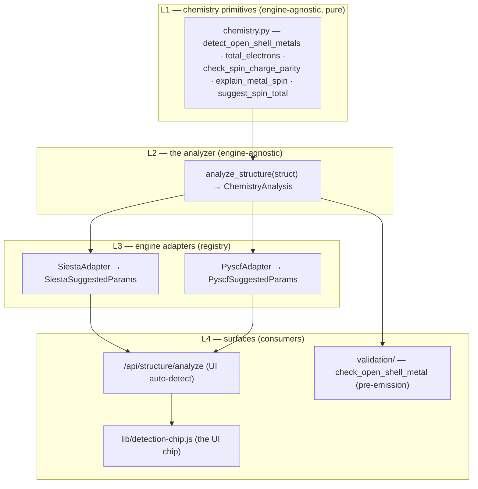
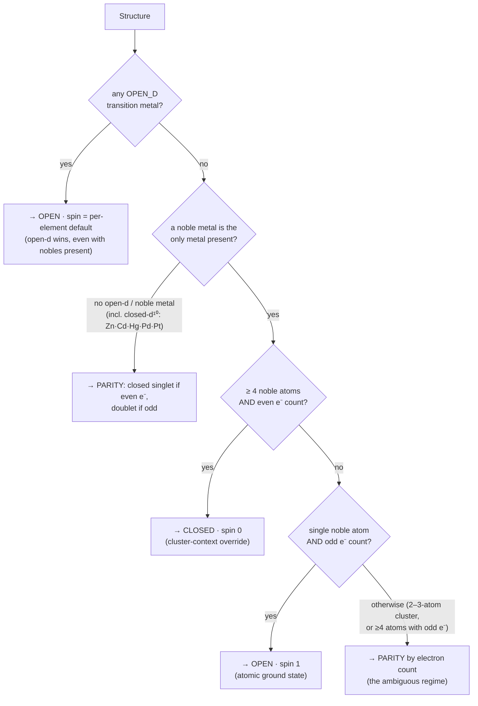
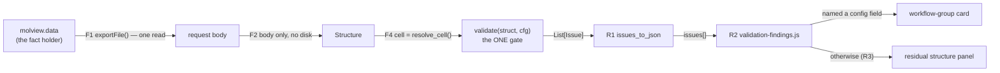

# Scientific validation — the runtime machinery

**Role:** contract
**Domain:** science
**Companions:** `overview.md` (the **what** — the correctness principles + the
advisory-while-editing / enforcing-at-generation rule); `chemistry-correctness.md`
(the chemistry facts the analyzer encodes); [`model/chemistry.md`](?doc=model/chemistry.md)
(the L1 chemistry primitives this composes); the engine emitters (the consumers).

This is **how** molbuilder realises scientific correctness at runtime: one
engine-agnostic chemistry **analyzer**, a per-engine **adapter registry**, and
the surfaces that read each conclusion. Every boundary passes a **frozen
dataclass** (an immutable typed record — never an untyped dict); JSON appears
only at the HTTP wire (the network boundary), via `dataclasses.asdict()`.

The core idea is **open-shell vs closed-shell**: *closed-shell* = every electron
paired (non-magnetic, most organics); *open-shell* = some electrons unpaired
(magnetic, most transition metals). Picking the wrong one gives a physically
wrong answer that often still "converges" silently — which is exactly what this
machinery prevents. (Cross-cutting terms — *SCF*, *DFT*, *2S*, *parity*, *KB
projector* — are in the [`overview.md` glossary](?doc=science/overview.md);
narrower ones are glossed inline below.)

---

## 1. Layered overview



Three typed boundaries:

| Boundary | Owner | Input → output |
|---|---|---|
| `analyze_structure(struct)` | `chemistry.py:669` | `Structure` → `ChemistryAnalysis` |
| `Adapter.to_params(analysis)` | per-engine `auto_defaults.py` | `ChemistryAnalysis` → engine `*SuggestedParams` |
| `check_open_shell_metal(struct, …)` | `validation/chemistry.py:113` | `Structure` + engine params → `List[Issue]` |

---

## 2. The analyzer (L2)

`chemistry.analyze_structure(struct) → ChemistryAnalysis` (`chemistry.py:669`)
is the engine-agnostic middle layer — the single source of truth every
science-aware surface reads, so two surfaces cannot disagree about the
chemistry by construction.

```python
@dataclass(frozen=True)
class ChemistryAnalysis:           # chemistry.py:607
    n_atoms:             int
    elements:            List[str]              # unique, sorted
    n_electrons_neutral: int                    # Σ Z for the neutral system
    metals:              List[str]              # ["Fe"], or [] for organics
    metal_hints:         List[MetalHint]        # ranked spin choices per metal
    suggested_charge:    int
    suggested_spin:      int                    # 2S = n_unpaired
    suggested_treatment: Literal["closed", "open"]
    rationale:           str
    warnings:            List[str]
```

**Design rules.** Pure function (no I/O, no engine imports); engine-agnostic
vocabulary (`treatment ∈ {closed, open}`, not `UKS`/`SpinPolarized` — those live
in the adapters); **parity is enforced here, once** — if
`(n_electrons_neutral − suggested_charge)` parity doesn't match `suggested_spin`,
the analyzer bumps the spin and records it in `warnings`, so adapters never
re-do parity work.

### 2.1 The noble-metal distinction — three categories, not one flat set

The flat `OPEN_SHELL_METALS` set (kept only as a back-compat alias) wrongly
treated gold junctions as open-shell. The analyzer splits metals into three
physically-grounded sets (`chemistry.py:134-157`; the flat alias follows at
`:163`):

| Set | Elements | Physics | Treatment |
|---|---|---|---|
| `OPEN_D_TRANSITION_METALS` | Sc–Ni (3d), Y–Rh (4d, not Pd), Hf–Ir (5d, not Pt/Au), lanthanides, common actinides | incomplete d-shell; Stoner criterion / itinerant moments | **force open-shell** |
| `NOBLE_METALS_S1` | Cu, Ag, Au | atomic nd¹⁰(n+1)s¹, but in any extended metallic context (cluster ≥ 4, surface, junction, bulk) the s-band delocalises | **closed-shell singlet** for even electron count |
| `CLOSED_D10_METALS` | Zn, Cd, Hg, **Pd** (4d¹⁰5s⁰), **Pt** (5d⁹6s¹ atom; metallic Pt closed-shell in surface DFT) | filled/effectively-filled d | closed-shell |

*(Plain-language keys: a **d-shell** is the set of d orbitals; **d¹⁰** = full (10
electrons, non-magnetic), an **incomplete** d-shell is the magnetic case. The
**Stoner criterion** is the textbook condition for a metal's delocalised
electrons to turn magnetic — it fails for Cu/Ag/Au, so they stay non-magnetic.
**NEGF** / **TranSIESTA**, in the references below, is the electron-transport
method these gold-junction papers used.)*

**Decision tree** (`analyze_structure`) — read top-down; the first matching
branch wins, so **open-d is checked before the noble-metal rules**:



The 4-atom cutoff (`_NOBLE_METAL_CLUSTER_THRESHOLD = 4`, `chemistry.py:666`) is
the conservative choice — overwhelmingly what published Au transport / surface
DFT does. When the noble closed-shell default is wrong (sub-4-atom Au cluster,
single adatom (one atom on a surface) on an insulator, magnetic 3d co-adsorbate
(a second magnetic species nearby), explicit Kondo / spin-orbit physics), the
`rationale` string lists those override scenarios so the user knows the boundary.

**Two spin defaults, intentionally distinct.** The `spin = per-element default`
the analyzer emits for an open-d metal comes from `_ANALYZER_DEFAULT_SPIN`
(`chemistry.py:578`) — the *most-likely-correct* chemistry guess (Fe → 2S = 2,
the intermediate-spin 4-coordinate-porphyrin case). SIESTA's spin-*sweep* starting
value is a **different** table, `_SPIN_TOTAL_DEFAULTS` (`:304`, Fe → 4.0 high-spin,
ramp down from there). Where they disagree (Fe 2 vs 4, Co 1 vs 3) both are correct
for their own purpose; the code's rule is *don't unify — document*
(`chemistry.py:550-573`).

**Worked example — the two verdicts, end to end.** The same call decides both
directions; here is the closed one (an **Au-BDT-Au** junction — gold /
benzene-1,4-dithiol / gold, ≥4 Au atoms, even electron count) and the open one
(an Fe centre):

```python
>>> from molbuilder.chemistry import analyze_structure
>>> from molbuilder.siesta.auto_defaults import SiestaAdapter
>>> from molbuilder.pyscf.auto_defaults  import PyscfAdapter

# --- CLOSED: the Au junction ---
>>> a = analyze_structure(au_bdt_au)
>>> a.metals, a.suggested_treatment, a.suggested_spin
(['Au'], 'closed', 0)                        # cluster-context override
>>> a.rationale
'Detected metallic Au system (N atoms, even electron count). Noble-metal clusters /
 surfaces / junctions are conventionally treated as closed-shell singlet …'  # real head, abridged
>>> SiestaAdapter.to_params(a)
SiestaSuggestedParams(net_charge=0, spin_polarized=False, spin_total=0.0, rationale='…')
# The retired flat OPEN_SHELL_METALS alias would have returned 'open' here — WRONG.

# --- OPEN: an Fe centre (open-d 3d metal) ---
>>> b = analyze_structure(fe_porphyrin)
>>> b.metals, b.suggested_treatment, b.suggested_spin
(['Fe'], 'open', 2)                          # open-d → open-shell; analyzer default 2S = 2
>>> PyscfAdapter.to_params(b)                 # PySCF: open-shell → UKS
PyscfSuggestedParams(charge=0, spin=2, method='UKS', rationale='…')
>>> SiestaAdapter.to_params(b)               # SIESTA: spin-polarized, Spin.Total in μB
SiestaSuggestedParams(net_charge=0, spin_polarized=True, spin_total=2.0, rationale='…')

# REVERSE gate — the user forces a closed-shell SCF on the open-shell Fe system:
>>> from molbuilder.validation.chemistry import check_open_shell_metal
>>> check_open_shell_metal(fe_porphyrin, is_closed_shell=True, engine_label='PySCF (RKS)')
[Issue(severity='warn', message='Analyzer recommends OPEN-SHELL DFT … but PySCF (RKS)
       requests a closed-shell SCF … converges to a fictitious state …', where='config.spin')]
```

**References** (the noble-metal-is-closed-shell basis): Taylor, Brandbyge,
Stokbro, *PRB* **63**, 245407 (2001) — the original TranSIESTA Au-BDT-Au paper;
Ke, Baranger, Yang, *JCP* **122**, 074704 (2005) — Au-BDT-Au NEGF; Verzijl &
Thijssen, *JPCC* **116**, 24811 (2012) — DFT+Σ Au-alkanedithiol benchmark;
Marder, *Condensed Matter Physics* Ch. 17 — the Stoner-criterion derivation
(Cu/Ag/Au explicitly non-magnetic in bulk). Pinned by
`tests/test_chemistry_analyzer.py` (Au₄ / Au-BDT-Au / single Au / Au₂ / Cu₄ /
Pd₂ / Au+Fe), which also asserts the three sets are pairwise disjoint and Pd/Pt
are excluded from `OPEN_D_TRANSITION_METALS`.

---

## 3. The adapter layer (L3)

Adapters translate one `ChemistryAnalysis` into each engine's parameter
dataclass. The registry (`chemistry.py`):

```python
def register_adapter(name): ...          # :883 — decorator
def registered_adapters() -> dict: ...   # :906 — {name: AdapterClass}
```

Every adapter satisfies the `EngineParameterAdapter` **Protocol** (the formal
interface, `chemistry.py:849`): a `name: str` plus a
`to_params(cls, analysis) -> <Engine>SuggestedParams` classmethod — that is the
*entire* contract a new engine implements.

Each engine ships an `auto_defaults.py` that defines a frozen `*SuggestedParams`
(field names matching the engine's web form) and an adapter that
`@register_adapter`s itself:

```python
# siesta/auto_defaults.py                # pyscf/auto_defaults.py
@register_adapter("siesta")              @register_adapter("pyscf")
class SiestaAdapter:                     class PyscfAdapter:
    → SiestaSuggestedParams(             → PyscfSuggestedParams(
        net_charge, spin_polarized,          charge, spin,
        spin_total, rationale)               method="UKS"|"RKS", rationale)
```

(*UKS* = unrestricted / open-shell Kohn-Sham; *RKS* = restricted / closed-shell —
PySCF's open- vs closed-shell DFT solve; SIESTA's `spin_polarized` bool is the
equivalent switch.)

**Adapter rules:** a pure translator — **must not** re-do chemistry detection or
parity (if you're importing `chemistry.py` inside an adapter, the logic belongs
in the analyzer); returns a frozen dataclass, not a dict; `rationale` always
present (may append one engine-specific sentence). Spectra reuses `PyscfAdapter`
(it emits PySCF). Enforced by `test_chemistry_adapters.py::test_adapter_modules_do_not_import_analyzer`.

---

## 4. The consumers (L4)

**`/api/structure/analyze`** (`build.py:415`) — the UI auto-detect. Returns the
analysis plus `suggested.<engine> = asdict(adapter.to_params(analysis))` for
**every** registered adapter (`asdict` turns a dataclass into a plain JSON-able
dict — the single serialisation point), so a new engine appears the moment its
adapter module is imported — endpoint code unchanged.

**`check_open_shell_metal(struct, *, is_closed_shell, engine_label)`**
(`validation/chemistry.py:113`) — the pre-emission validator. It calls the
**same** `analyze_structure` and gates on `analysis.suggested_treatment == "open"`
(not the flat `metals` list — that's what fired for Au-BDT-Au before the
category split), returning a `warn` `Issue` carrying the analyzer's rationale
when the user requests a closed-shell SCF against an open-shell recommendation.

Four engine surfaces route through this reverse check (a *preflight* = the checks
run at Generate-time, before engine input is written) — SIESTA + PySCF Build
preflight (`validation/siesta.py:360`, `validation/pyscf.py:132`), Spectra
preflight (`spectra/pyscf_engine.py:319`), and Transport preflight
(`transport/transiesta.py:911`). The UI chip (`lib/detection-chip.js`) reads the
**forward** side instead — `suggested_treatment` straight off the
`/api/structure/analyze` response — not this validator. **The invariant**
(`web-ui-coherence.md` Rule 1): chip and validator both derive from the one
`analyze_structure` result, so they cannot disagree — the remedy for two-surface
drift (the "closed-shell singlet" chip vs a "switch to open-shell" warning two
panels down) is to delete the parallel path, not patch it. So the analyzer runs
in two directions over the one analysis: **forward** (auto-detect pre-fills the
form) and **reverse** (Generate-time check).

---

## 4.1 The delivery contract — facts in, findings out (decided 2026-07-29)

A check that never runs, or runs on the wrong structure, or produces a finding
nobody sees, is worse than no check: it reads as a clean bill of health. Three
real failures forced this contract (all three were live on `qlabsrv`):

* the min-atom-to-nearest-image check worked correctly and had **never once been
  shown in the browser** — `validate()` skips cell-dependent checks when `cell`
  is `None`, and every web caller omitted it;
* the SIESTA thin-vacuum advice reached only the server's `stderr`, because it
  was a Python `warnings.warn` rather than an `Issue`;
* a Generate request could carry fresh labels, fresh periodicity and **stale
  coordinates**, because one tab mirrored the geometry into a page-local
  variable while reading the other facts live from the model.

**The layer between a tab and validation owns both directions.** That layer is
MolView's concealed data model (`molview.data`): the facts leave from it, the
findings come back to it for routing. A tab wires the two and contributes
nothing of its own. Everything below follows from that.

### Facts (inbound)

| # | Clause | Enforced by |
|---|---|---|
| **F1** | **One fact holder, read once.** Coordinates, elements, labels (regions / frozen), periodicity and annotations are read from `molview.data` **at request time** — never from a page-local mirror, a second fetch, or a re-read of disk. **One call assembles the whole body**, so a tab can neither send a partial set nor send the same facts twice from two reads: `exportFile(range)` returns them together, in the server's words, for the frame on screen ([`web/molview.md`](?doc=web/molview.md) § 9.3a). A body that carries `frozen_atoms` / `regions` / `periodicity` *beside* the structure has read them again, at another moment, and fails the pin. | `molview.data.exportFile()`; `test_in_body_labels_contract.py` |
| **F2** | **No server-side second source.** The server builds its `Structure` from the request body alone — one seam applies the in-body labels and periodicity and runs the frame-contract gate. **The sidecar is never read for an emitted structure**, so a validated structure is never a body/disk mixture, and a body with no label keys declares *no labels*. `structure_path` still travels (it anchors pseudopotential and dest-dir resolution) but is not a label source — an earlier cut refused requests that named a path without label keys, which conflated "here is where the file lives" with "read my sidecar" and rejected many legitimate callers. Loudness belongs on the side that can guarantee it (F1), not on an unrelated field. | `struct_from_body` — the labels ride inside the envelope; `test_validation_delivery_contract.py` proves a sidecar on disk cannot reach an emitted deck |
| **F3** | **The model is complete by construction.** The model always carries periodicity — defaults when the pair has none, full values otherwise — so a tab is never in a position where it must invent a fact. | [`model/structure-periodicity.md`](?doc=model/structure-periodicity.md) § 7; `TestTabEmitContract` |
| **F4** | **Derived facts are derived from those facts, server-side.** The cell a check needs is `struct.resolve_cell()`, resolved inside `validate()` — never an argument a caller can forget. It is derived only when the structure actually **declares a box** (an explicit `cell`, a non-zero vacuum, or a non-isolated axis): a gas-phase molecule never asked for a lattice, and a *planar* one's bounding box has zero thickness, so checking it would report a degenerate cell for a calculation that has no cell. A check that cannot run says so as `info`; silence is never the answer. | `_structure_declares_a_box`; `validate()`'s cell default; contract tests |

### Findings (outbound)

| # | Clause | Enforced by |
|---|---|---|
| **R1** | **One result type, web-shaped by construction.** Every finding is an `Issue` → `{severity, message, where, workflow_group?, stage?}` from the one serializer (`_shared.issues_to_json`). `where` is the **stable machine-readable identifier** (`geometry.min_distance`, `cell.image_distance`, `config.mesh_cutoff`) — the UI binds behaviour to it and never parses `message`, which is prose for humans and may be reworded freely. | `issues_to_json`; contract tests |
| **R1a** | **A stage label rides beside `where`, never inside it** (added 2026-08-07; [`engines/stages.md`](?doc=engines/stages.md) § 4 R2). A stage is validated as a *resolved whole*, so the same check fires for a stage as for a single run and produces the **same** id — folding the stage into the id would give one check as many ids as the ladder has stages, and R1 says the UI binds to the id. `stage` is **absent** for a single run *and* for a finding about the **sequence** (§ 4 R3 — a ladder that loosens is a fact about the description, not about a member of it). | `issues_to_json` omits the key when unset; `test_validation_across_stages.py` |
| **R2** | **One channel into the UI.** The layer that holds the facts also takes the result: a single client module (`lib/validation-findings.js`) receives `issues[]` and routes them — per workflow-group card where the finding names a config field, residual structure panel otherwise — and every page mounts it. No page implements its own renderer. | `validation-findings.js`; `test_no_second_issue_renderer` |
| **R3** | **Nothing is dropped.** Rendered count equals received count. An unknown or missing `workflow_group` falls to the residual panel; it is never skipped, and the list is never truncated. | contract tests |
| **R4** | **Severity means the same everywhere.** `error` blocks generation and says why; `warn` renders without blocking; `info` is advisory. No surface downgrades a severity to keep a screen quiet, and the CLI prints the same three. | contract tests |

**Which severity a spatial check gets** (decided 2026-07-29). Two different
questions get two different answers, and conflating them is how a tool becomes
either nagging or dangerous:

* **Is there *enough* space?** — `cell.vacuum_thin`, `cell.image_distance`,
  `cell.volume`. These are **warnings, never blocking.** The cell is well-formed;
  what is in question is the *physics quality* of the result, and that is the
  user's call to make. They may be probing convergence, reproducing a published
  tight-box run, or deliberately accepting image interaction. molbuilder states
  the number and the recommendation and gets out of the way — it never resizes
  the box and never refuses the run.
* **Will this engine even USE the cell?** — `cell.periodic_in_gas_phase`
  (added 2026-08-03). A **warning**, by the same rule: the PySCF renderer builds
  a molecular `gto.M()` with no lattice and no k-points, so a structure with a
  repeating axis produces an **isolated cluster** and the cell is dropped. That
  is not a rough version of what was asked for — it is a different calculation,
  and it used to happen in silence. An isolated-cluster run of a periodic input
  is legal and occasionally deliberate, so the user is told, not stopped: the
  finding names the repeating axes, the lattice being ignored, and what comes
  out instead.

  It keys on `axis_kind`, not `pbc`. `axis_kind` is authoritative and never
  `None`; `pbc` is its derived view and collapses `transport` into the same
  `True` as `periodic` — both are wrong for a gas-phase script, but a check
  written on `pbc` alone could not tell a lead from a crystal axis, which
  `cell.kgrid` depends on.

* **Can this cell exist at all?** — `cell.no_volume` and `cell.left_handed`,
  both **errors**, from the one checker (`molbuilder/cell.py`). Upstream of
  them the gate refuses the edit outright (§ 6.1). Not a judgement about
  quality: a zero-volume lattice makes SIESTA fail when it builds reciprocal
  vectors, so emitting it with a warning would hand the user a
  guaranteed-failed run dressed as a choice.

  **They were one id, `cell.determinant`, until 2026-08-03** — "degenerate or
  left-handed", two faults with two different repairs under one name, so a flat
  molecule was told to swap its lattice vectors. Split when the cell checks
  became one process line; see
  [`model/structure-periodicity.md`](?doc=model/structure-periodicity.md)
  § 6.1a for the full id list and which surface each reaches.

So: **adequacy is advisory, representability is blocking.** A check that reports
"your box is small" must not stop the run; a check that reports "this box is not
a box" must.
| **R5** | **One channel means one channel.** A finding never travels as a Python `warnings.warn` — it cannot reach a web user. Code that wants to warn returns an `Issue` from a validator. | `test_no_warnings_warn_in_emitters` |
| **R6** | **Visible before the irreversible step.** Findings accompany the artifact at render time *and* the preflight — before engine input is written or a job is submitted, never after. | endpoint tests |



**Worked example — the thin vacuum that reached SIESTA (2026-07-29).** A user
generated `hemeC-dithiol` with 2.5 Å of vacuum per side. Two checks had
something to say and neither arrived: `validate_geometry`'s image-distance check
was skipped (no `cell` passed — F4), and the emitter's vacuum advice went to
`stderr` (a `warnings.warn` — R5). SIESTA itself reported the consequence
(*"Gamma-point calculation with multiply-connected orbital pairs"* — basis
orbitals overlapping the periodic images), which is not an error but means the
molecule interacted with its own copies. Under this contract the same run
surfaces `cell.image_distance` (`warn`, "min atom-to-nearest-image distance is
5.15 Å") in the structure panel *before* the deck is written, with the actionable
number in the message.

---

## 5. Pattern-B — regions the engine doesn't consume

When `struct.regions` is populated but the engine doesn't consume region labels,
it must surface an `info` `Issue` so the user knows the labels were noticed but
unused. One shared helper — `regions_pattern_b_notice(struct, engine_label)`
(`_shared.py:1377`) — is called from `/api/build/fdf` and `/api/build/pyscf`
(`build.py:896`, `:968`), so the notice text is identical whichever engine fires
it. **Transport is deliberately not a caller** (`transport.py:132`): it *is* the
region consumer — the labels drive the whole device/electrode split, so the
Pattern-B "noticed-but-unused" path doesn't apply. Pinned by
`test_web.py::test_{fdf,pyscf}_surfaces_info_when_structure_carries_regions`.

---

## 6. Adding a new engine

1. Create `<engine>/auto_defaults.py`: a frozen `<Engine>SuggestedParams` +
   an adapter class `@register_adapter("<engine>")` with `to_params(cls, analysis)`.
2. Import the module in `web/blueprints/__init__.py` so it registers at startup.
3. (Optional) route the engine's validator through `check_open_shell_metal`.
4. Add adapter tests (the cross-engine consistency invariant runs over the
   registry).

No endpoint change; the new engine surfaces in `suggested.<engine>` automatically.

---

## 7. Where the validators live

`molbuilder/validation/` is a package split **by concern** so any caller imports
directly from the relevant submodule:

```
validation/
├── __init__.py     # public API: validate, report, the engine registry + re-exports
├── geometry.py     # validate_geometry + geometry checks
├── metadata.py     # dataclass-field-driven config validation
├── chemistry.py    # check_open_shell_metal, metal-basis adequacy, peptide protonation
├── sidecar.py      # frozen-atoms-consumed check
├── siesta.py       # SIESTA preflight aggregator + pseudo/mesh/Makov-Payne/spin checks
└── pyscf.py        # PySCF preflight aggregator
```

Two rules make this safe to extend: **the call order inside `_validate_siesta` /
`_validate_pyscf` is the per-engine public contract** — load-bearing, since
tests count issues by position — and a helper **loses its `_` prefix when it
gains a cross-module caller** (e.g. `check_open_shell_metal` is public; the
others stay private until a PR forces the promotion, no back-compat shim). The
engine registry (`_ENGINE_VALIDATORS`, populated at import) holds all four
configs (SIESTA / PySCF / spectra / transport), so `validate(struct, cfg)` is the
one per-engine gate. Tests mirror the layout under `tests/validation/`.

---

## 8. What the analyzer does NOT cover

Its scope is the chemistry-driven **`(charge, spin, treatment)` triplet + the
open-shell-metal hints** — the place silent chemistry errors hide. Out of scope
(and why): basis set + XC functional (user preference / budget), k-points / mesh
cutoff (geometry, not chemistry), pseudopotential family (covered by the
`pseudopotentials.md` validator pass), convergence thresholds and optimisation /
spectral-workflow choices. Growing it to cover everything would re-fragment the
cross-engine consistency claim.

---

## 9. Test invariants

- **Cross-engine agreement** — all registered adapters reach the same open-vs-closed
  decision (SIESTA `spin_polarized` iff PySCF `UKS`) and the same 2S for a given
  structure: `test_chemistry_adapters.py::test_all_adapters_agree_on_treatment`
  (parametrised over CH₄ / Fe / Cu / Mn).
- **Validator ↔ analyzer** — `check_open_shell_metal` reads its conclusion from
  `analyze_structure` and echoes its rationale, proved by *monkeypatching* the
  analyzer (a test temporarily swaps it for a stub):
  `tests/validation/test_chemistry.py::TestCheckOpenShellMetalUsesAnalyzer`.
- **Endpoint shape** — `/api/structure/analyze` carries every documented key and
  each `suggested.<engine>` matches its dataclass fields
  (`test_structure_analyze_endpoint.py::test_response_shape_carries_every_documented_key`).
- **New-engine on-ramp** — a freshly-registered synthetic adapter appears in the
  endpoint response (`…::test_freshly_registered_adapter_appears_in_endpoint_response`),
  catching a hardcoded engine list.
- **Adapter purity** — an *AST check* (a static parse of the source — imports are
  read without running the module) that no adapter imports the analyzer/primitives:
  `test_chemistry_adapters.py::test_adapter_modules_do_not_import_analyzer`.

---

## 10. Design history — why the machinery is shaped this way

Three decisions produced this structure (fuller provenance in git history):

- **The analyzer was hoisted out of the endpoint (2026-06-10).**
  `/api/structure/analyze` first shipped (2026-05-23) with both engine
  translations hardcoded inline in `web/blueprints/build.py` — duplication waiting
  to drift, and no on-ramp for a new engine. Extracting `analyze_structure` + the
  adapter registry realised the cross-engine consistency rule at the UI surface
  too, not just the validators.
- **`validation.py` became a package (2026-06-13).** The flat 1326-line module
  became the 7-file `validation/` package (§ 7) so "where does a new check go?"
  has a one-step answer. The split was mechanical — every function body,
  signature, and per-engine call order moved *verbatim*, because the call order is
  the load-bearing contract. The Spectra-preflight drift that motivated it came
  from external engines rolling their own chemistry check for lack of a convenient
  import.
- **`OPEN_SHELL_METALS` split into three sets (2026-06-13).** So the analyzer
  recommends closed-shell singlet for Au junctions (§ 2.1) and
  `check_open_shell_metal` gates on `suggested_treatment` instead of the flat
  `metals` list — killing the Au-BDT-Au chip-vs-validator contradiction the user
  reported (the "closed-shell singlet" chip vs a "switch to open-shell" warning on
  the same form).

---

> **Note — the GPU eigensolver is not here.** The ELPA-CUDA / NVIDIA-MPS
> eigensolver machinery (the `molbuilder-siesta-gpu` env, the numerical-
> equivalence claim, the MPS rank policy, the `envs validate` probes) is a
> SIESTA-GPU engine/ops concern, documented in `engines/siesta-gpu.md` (engines
> wave). It rode in the legacy `scientific-validation.md` but is not chemistry
> validation.
