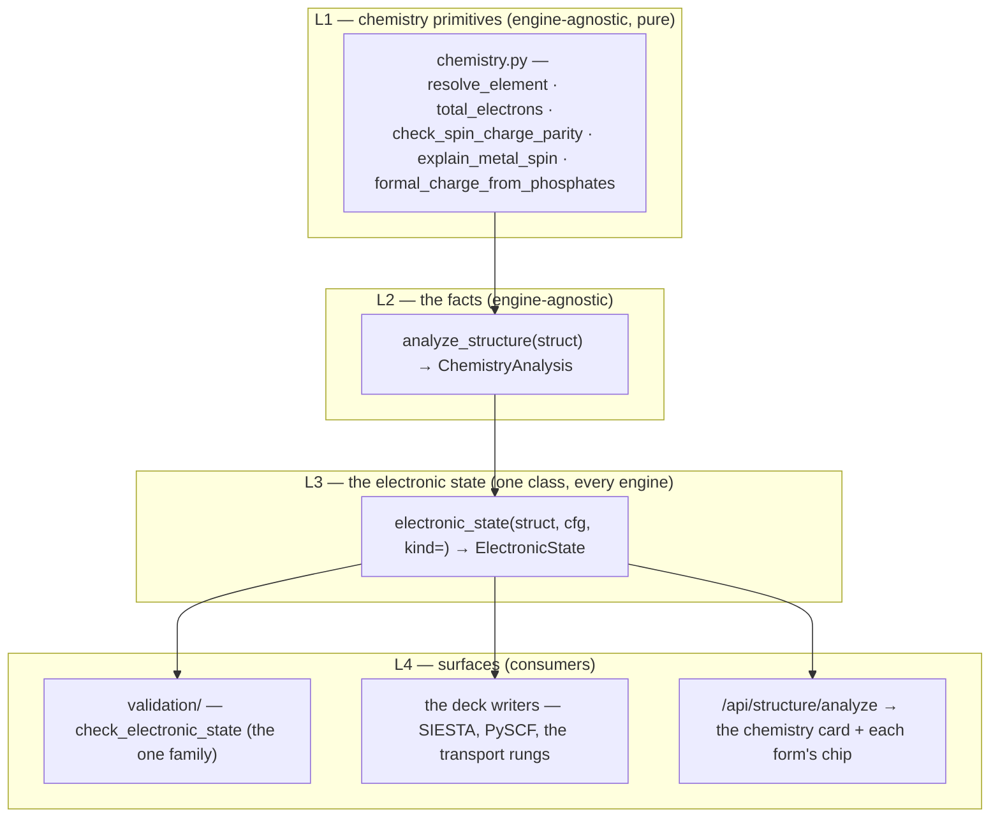
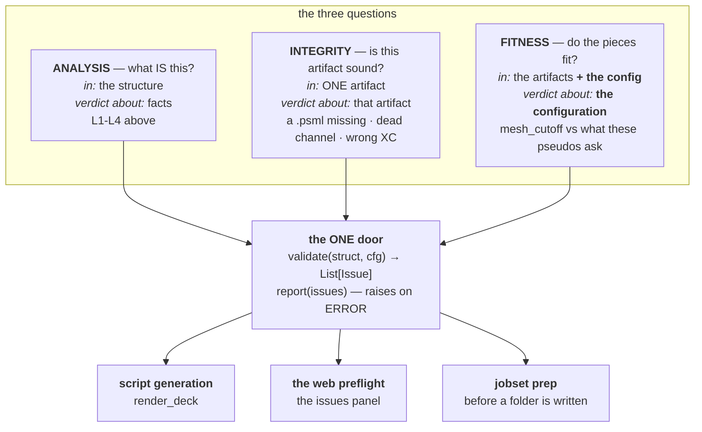
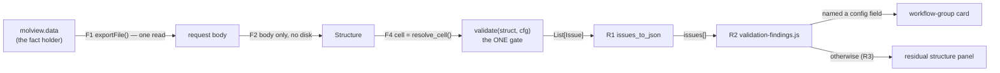

# Scientific validation — the runtime machinery

**Role:** contract
**Domain:** science
**Companions:** `overview.md` (the **what** — the correctness principles + the
advisory-while-editing / enforcing-at-generation rule); `chemistry-correctness.md`
(the chemistry facts the analyzer encodes); [`model/chemistry.md`](?doc=model/chemistry.md)
(the L1 chemistry primitives this composes); the engine emitters (the consumers).

This is **how** molbuilder realises scientific correctness at runtime: the
structure's chemistry **facts** (`analyze_structure`), the one **electronic
state** every calculation carries (`electronic_state`,
[`chemistry-correctness.md`](?doc=science/chemistry-correctness.md) § 2a), and the
surfaces that read them — the checks, the deck writers, the chemistry card. Every
boundary passes a **frozen dataclass** (an immutable typed record — never an
untyped dict); JSON appears only at the HTTP wire (the network boundary), via the
record's own `as_dict()` or `dataclasses.asdict()`.

The core idea is **open-shell vs closed-shell**: *closed-shell* = every electron
paired (non-magnetic, most organics); *open-shell* = some electrons unpaired
(magnetic, most transition metals). Picking the wrong one gives a physically
wrong answer that often still "converges" silently — which is exactly what this
machinery prevents. (Cross-cutting terms — *SCF*, *DFT*, *2S*, *parity*, *KB
projector* — are in the [`overview.md` glossary](?doc=science/overview.md);
narrower ones are glossed inline below.)

---

## 1. Layered overview


```mermaid
flowchart TB
    subgraph L1["L1 — chemistry primitives (engine-agnostic, pure)"]
        chem["chemistry.py — resolve_element · total_electrons ·<br/>check_spin_charge_parity · explain_metal_spin · formal_charge_from_phosphates"]
    end
    subgraph L2["L2 — the facts (engine-agnostic)"]
        an["analyze_structure(struct) → ChemistryAnalysis"]
    end
    subgraph L3["L3 — the electronic state (one class, every engine)"]
        es["electronic_state(struct, cfg, kind=) → ElectronicState"]
    end
    subgraph L4["L4 — surfaces (consumers)"]
        val["validation/ — check_electronic_state (the one family)"]
        deck["the deck writers — SIESTA, PySCF, the transport rungs"]
        api["/api/structure/analyze → the chemistry card + each form's chip"]
    end
    chem --> an --> es
    es --> val
    es --> deck
    es --> api
```

Three typed boundaries:

| Boundary | Owner | Input → output |
|---|---|---|
| `analyze_structure(struct)` | `chemistry.py` | `Structure` → `ChemistryAnalysis` — facts, no decision |
| `electronic_state(struct, cfg, *, kind)` | `electronic_state.py` | `Structure` + a config's four state items → `ElectronicState` |
| `check_electronic_state(struct, cfg, *, calculation)` | `validation/chemistry.py` | the same → `List[Issue]`, one finding per fact |

### 1.1 Three kinds of question, one door *(framework, 2026-09-03)*

The layers above are **one** of the three things validation does, and the three
differ in what they take in and — the part that decides where a finding
belongs — **what their verdict is about**:


```mermaid
flowchart TB
    subgraph Q["the three questions"]
      direction LR
      A["<b>ANALYSIS</b> — what IS this?<br/><i>in:</i> the structure<br/><i>verdict about:</i> facts<br/>L1-L4 above"]
      I["<b>INTEGRITY</b> — is this artifact sound?<br/><i>in:</i> ONE artifact<br/><i>verdict about:</i> that artifact<br/>a .psml missing · dead channel · wrong XC"]
      F["<b>FITNESS</b> — do the pieces fit?<br/><i>in:</i> the artifacts <b>+ the config</b><br/><i>verdict about:</i> <b>the configuration</b><br/>mesh_cutoff vs what these pseudos ask"]
    end
    D["<b>the ONE door</b><br/>validate(struct, cfg) → List[Issue]<br/>report(issues) — raises on ERROR"]
    A --> D
    I --> D
    F --> D
    D --> S1["<b>script generation</b><br/>render_deck"]
    D --> S2["<b>the web preflight</b><br/>the issues panel"]
    D --> S3["<b>jobset prep</b><br/>before a folder is written"]
```

| | analysis | integrity | fitness |
|---|---|---|---|
| **input** | the structure | ONE artifact | every artifact **+ the config** |
| **verdict about** | facts — *what this molecule is* | that artifact | **the configuration** |
| **keyed to** | nothing to fix | the element / file | the **config field** a person edits |
| **example** | *this has an open-shell metal* | *`S.psml` is absent* | *`mesh_cutoff` is below what these pseudos state* |

**Why the distinction earns its keep: it decides where a finding goes, and
being wrong about that hides it.** A fitness verdict keyed to an element reads
as *"something is wrong with sulfur"* when what is wrong is a number in the
form — so the person goes and re-downloads a perfectly good file. Key it to
`config.mesh_cutoff` and it lands on the field they change.

**An artifact may DECLARE a requirement, and then the configuration must
satisfy it — the strictest one in the set wins.** That is the fitness rule in
one sentence, and it is general: a PseudoDojo v0.5 file states its own
recommended cutoff, and any future declared fact (a required relativity, a
minimum basis) enters through the same reader and the same comparison. Where a
file states nothing, a literature default answers instead — **a declared number
outranks a guess**, the same rule the rank count follows
(`running-a-job.md` § 3.1: *read from a record, never guessed*).

**All three reach every surface through the one door, and that is the test of
placement.** `report(validate(...))` is called by script generation, the web
preflight and `jobset prep`; a finding that needed new plumbing to reach a
surface would be a finding put in the wrong layer.

---

## 2. The facts (L2)

`chemistry.analyze_structure(struct) → ChemistryAnalysis` (`chemistry.py`) says
what a structure IS, chemically — the metals that bear on its spin, and their
usual spins — and decides nothing:

```python
@dataclass(frozen=True)
class ChemistryAnalysis:           # chemistry.py
    n_atoms:        int
    elements:       List[str]          # unique, sorted
    open_d_metals:  List[str]          # the open-d transition metals present
    noble_metals:   List[str]          # Cu, Ag, Au present
    metals:         List[str]          # both, open-d first; [] for organics
    metal_hints:    List[MetalHint]    # each metal's usual spins, low → high
```

**Design rules.** Pure function (no I/O, no engine imports); engine-agnostic
vocabulary; **facts, not a decision** — the charge and the spin are decided by the
electronic state (§ 3), at the calculation's own charge and periodicity. Every
label must name an element: `resolve_element` raises `KeyError` on one that does
not, because every reader goes on to count electrons, and a count with an atom
left out is a wrong one. The metal lists are split once here, so no reader
filters `metals` again.

> *(Until 2026-09-28 it also carried a **suggested** charge, spin and treatment,
> judged at charge 0 on the neutral structure whatever its cell — which is how a
> formate ion at −1 and a bulk gold lead were both told to go open-shell. Deciding
> moved to the electronic state; § 10.)*

### 2.1 The noble-metal distinction — three categories, not one flat set

The flat `OPEN_SHELL_METALS` set wrongly treated gold junctions as
open-shell. The metals are split into three physically-grounded sets
(`chemistry.py`). The flat set survived the split as a back-compat alias and
was **deleted 2026-09-17**, once it turned out its only reader was the one
function the split existed to correct — see § 5:

| Set | Elements | Physics | What a blank spin becomes |
|---|---|---|---|
| `OPEN_D_TRANSITION_METALS` | Sc–Ni (3d), Y–Rh (4d, not Pd), Hf–Ir (5d, not Pt/Au), lanthanides, common actinides | incomplete d-shell; Stoner criterion / itinerant moments | **unrestricted** — the metal's usual count in a finite system, a floating moment in a repeating cell; warned until stated (ES8) |
| `NOBLE_METALS_S1` | Cu, Ag, Au | atomic nd¹⁰(n+1)s¹, but in any extended metallic context (cluster ≥ 4, surface, junction, bulk) the s-band delocalises | **restricted** for a cluster of four or more with an even count, and in any repeating cell; a single atom keeps its doublet |
| `CLOSED_D10_METALS` | Zn, Cd, Hg, **Pd** (4d¹⁰5s⁰), **Pt** (5d⁹6s¹ atom; metallic Pt closed-shell in surface DFT) | filled/effectively-filled d | no row of its own — the electron count's parity decides |

*(Plain-language keys: a **d-shell** is the set of d orbitals; **d¹⁰** = full (10
electrons, non-magnetic), an **incomplete** d-shell is the magnetic case. The
**Stoner criterion** is the textbook condition for a metal's delocalised
electrons to turn magnetic — it fails for Cu/Ag/Au, so they stay non-magnetic.
**NEGF** / **TranSIESTA**, in the references below, is the electron-transport
method these gold-junction papers used.)*

**The decision is the detection table** —
[`chemistry-correctness.md`](?doc=science/chemistry-correctness.md) § 2a.1b,
`electronic_state.recommend`. The first row that matches wins, so an open-d metal
decides even beside gold; a repeating cell never reads its count per cell as a
spin (ES3). The 4-atom cutoff (`NOBLE_CLUSTER_THRESHOLD = 4`,
`electronic_state.py`) is the conservative choice — overwhelmingly what published
Au transport / surface DFT does. When the noble closed-shell answer is wrong
(sub-4-atom Au cluster, single adatom on an insulator, a magnetic 3d co-adsorbate,
explicit Kondo / spin-orbit physics), state the spin.

**Worked example — both directions, end to end.** An **Au-BDT-Au** junction
(gold / benzene-1,4-dithiol / gold) and an Fe centre:

```python
>>> from molbuilder.electronic_state import electronic_state
>>> from molbuilder.validation.chemistry import check_electronic_state

# --- CLOSED: the Au junction, a repeating cell ---
>>> st = electronic_state(au_bdt_au, SiestaConfig(), kind="transport")
>>> st.spin_treatment.value, st.unpaired_electrons.value
('restricted', 0)
>>> st.spin_treatment.said
'detected: metallic Au in a repeating cell: the s-band delocalises and no moment forms'
# The retired flat OPEN_SHELL_METALS alias would have said open-shell here — WRONG.

# --- OPEN: an Fe centre (open-d 3d metal), the spin fields blank ---
>>> st = electronic_state(fe_porphyrin, PySCFConfig(), kind="optimization")
>>> st.spin_treatment.value, st.unpaired_electrons.value
('unrestricted', 2)          # Fe's usual count — a guess about coordination (ES8)

# REVERSE — a closed shell stated on the open-shell Fe system:
>>> check_electronic_state(fe_porphyrin, PySCFConfig(spin_treatment="restricted"),
...                        calculation="optimization")
[Issue(severity='warn', message='The spin treatment is restricted (stated), and the
       structure implies unrestricted, 2S = 2: … converges to a fictitious state …',
       where='config.spin_treatment')]
```

**References** (the noble-metal-is-closed-shell basis): Taylor, Brandbyge,
Stokbro, *PRB* **63**, 245407 (2001) — the original TranSIESTA Au-BDT-Au paper;
Ke, Baranger, Yang, *JCP* **122**, 074704 (2005) — Au-BDT-Au NEGF; Verzijl &
Thijssen, *JPCC* **116**, 24811 (2012) — DFT+Σ Au-alkanedithiol benchmark;
Marder, *Condensed Matter Physics* Ch. 17 — the Stoner-criterion derivation
(Cu/Ag/Au explicitly non-magnetic in bulk). The table's rows are pinned through
prep in `tests/test_electronic_state.py` (Au₄, Au₁, the gold lead, Fe, bcc Fe on
SIESTA; Au₂, Au₃, Au₅, Pd₂ and more on PySCF); `tests/test_chemistry_analyzer.py`
asserts the three sets are pairwise disjoint and Pd/Pt are excluded from
`OPEN_D_TRANSITION_METALS`.

---

## 3. The electronic state (L3)

One class decides the charge and the spin of a calculation — for the form, the
checks and every deck: `electronic_state(struct, cfg, *, kind)`. Its contract —
the four items, the one order a blank is answered in (stated → implied → recorded
→ detected), the detection table, what each engine can run, ES1–ES10 — is
[`chemistry-correctness.md`](?doc=science/chemistry-correctness.md) § 2a; this is
where it sits in the machinery. Each value is a `Resolved(value, source, why)`
with its phrasing `said`, so the deck comment, the prep report and the card say
the same words.

*(Until 2026-09-28 this layer was a per-engine **adapter registry** —
`siesta/auto_defaults.py` and `pyscf/auto_defaults.py` translating one analysis
into each engine's suggested fields, for an Auto-detect button to copy into the
forms. Deleted with the button: the suggestion was judged at charge 0 on the
neutral structure, and the copy overwrote the person's own values.)*

---

## 4. The consumers (L4)

**The settings gate** — `check_electronic_state` (`validation/chemistry.py`),
asked **once** by `validate()` for every engine and every kind: what the engine
cannot run (ES4–ES6), parity at the resolved charge for a finite system (ES3), a
stated closed shell on an open-shell structure and a constrained singlet (ES9), a
count a metal decided until it is stated (ES8), a charge on a transport
calculation (ES7). At most one finding per fact. The engine validators READ the
state — SIESTA's charged-cell notice and vacuum threshold, its spin-orbit
pseudopotential check — but raise none of its findings.
[`overview.md`](?doc=science/overview.md) § 4 lists them with their severities.

**The deck writers** — SIESTA optimization and vibration, the five transport
rungs, PySCF optimization and vibration — each spells the state its own way
(`Spin` / `Spin.Fix` + `Spin.Total` / `NetCharge`; PySCF's composed class and
`gto.M(charge=, spin=)`) and writes each value beside its source. A transport
ladder's rungs are handed the junction's state, decided once at prep.

**The forms** — `/api/structure/analyze` (`build.py`) takes the structure the page
would hand over (the envelope its viewer holds — the one the preflight and the
hand-over send) and each form's four items, and answers per engine
`ElectronicState.as_dict()` beside the facts. `lib/chemistry.js` shows it on the
chemistry card, each value with its source; `lib/detection-chip.js` in one line
on each form's chip. It is asked on every load and restore and on every edit to
one of the four items, and it **fills nothing in** — a blank is already the
instruction "work it out", and the card is its answer. With no structure or no
answer, the card is hidden.

**The invariant** (`web-ui-coherence.md` Rule 1): the card, the chip, the checks
and the deck read one class, so they cannot disagree — the remedy for two-surface
drift is to delete the parallel path, not patch it. *(Until 2026-09-28 the
forward side was the Auto-detect button — the analysis fired on load, and a click
copied its suggestion into the forms — and the reverse side was
`check_open_shell_metal`, which judged the neutral, non-repeating structure; the
chip read one verdict for the whole page at charge 0.)*

---

## 4.1 The delivery contract — facts in, findings out (decided 2026-07-29)

A check that never runs, or runs on the wrong structure, or produces a finding
nobody sees, is worse than no check: it reads as a clean bill of health. Three
real failures forced this contract (all three were live on the dev workstation):

* the min-atom-to-nearest-image check worked correctly and had **never once been
  shown in the browser** — `validate()` skips cell-dependent checks when `cell`
  is `None`, and every web caller omitted it;
* the SIESTA thin-vacuum advice reached only the server's `stderr`, because it
  was a Python `warnings.warn` rather than an `Issue`;
* a Generate request could carry fresh labels, fresh periodicity and **stale
  coordinates**, because one tab mirrored the geometry into a page-local
  variable while reading the other facts live from the model.

**The layer between a tab and validation owns both directions.** That layer is
MolView's concealed data model (`molview.data`): the facts leave from it, the
findings come back to it for routing. A tab wires the two and contributes
nothing of its own. Everything below follows from that.

### Facts (inbound)

| # | Clause | Enforced by |
|---|---|---|
| **F1** | **One fact holder, read once.** Coordinates, elements, labels (regions / frozen), periodicity and annotations are read from `molview.data` **at request time** — never from a page-local mirror, a second fetch, or a re-read of disk. **One call assembles the whole body**, so a tab can neither send a partial set nor send the same facts twice from two reads: `exportFile(range)` returns them together, in the server's words, for the frame on screen ([`web/molview.md`](?doc=web/molview.md) § 9.3a). A body that carries `frozen_atoms` / `regions` / `periodicity` *beside* the structure has read them again, at another moment, and fails the pin. | `molview.data.exportFile()`; `test_in_body_labels_contract.py` |
| **F2** | **No server-side second source.** The server builds its `Structure` from the request body alone — one seam applies the in-body labels and periodicity and runs the frame-contract gate. **The sidecar is never read for an emitted structure**, so a validated structure is never a body/disk mixture, and a body with no label keys declares *no labels*. `structure_path` still travels (it anchors pseudopotential and dest-dir resolution) but is not a label source — an earlier cut refused requests that named a path without label keys, which conflated "here is where the file lives" with "read my sidecar" and rejected many legitimate callers. Loudness belongs on the side that can guarantee it (F1), not on an unrelated field. | `struct_from_body` — the labels ride inside the envelope; `test_validation_delivery_contract.py` proves a sidecar on disk cannot reach an emitted deck |
| **F3** | **The model is complete by construction.** The model always carries periodicity — defaults when the pair has none, full values otherwise — so a tab is never in a position where it must invent a fact. | [`model/structure-periodicity.md`](?doc=model/structure-periodicity.md) § 7; `TestTabEmitContract` |
| **F4** | **Derived facts are derived from those facts, server-side.** The cell a check needs is `struct.resolve_cell()`, resolved inside `validate()` — never an argument a caller can forget. It is derived only when the structure actually **declares a box** (an explicit `cell`, a non-zero vacuum, or a non-isolated axis): a gas-phase molecule never asked for a lattice, and a *planar* one's bounding box has zero thickness, so checking it would report a degenerate cell for a calculation that has no cell. A check that cannot run says so as `info`; silence is never the answer. | `_structure_declares_a_box`; `validate()`'s cell default; contract tests |

### Findings (outbound)

| # | Clause | Enforced by |
|---|---|---|
| **R1** | **One result type, web-shaped by construction.** Every finding is an `Issue` → `{severity, message, where, workflow_group?, stage?}` from the one serializer (`_shared.issues_to_json`). `where` is the **stable machine-readable identifier** (`geometry.min_distance`, `cell.image_distance`, `config.mesh_cutoff`) — the UI binds behaviour to it and never parses `message`, which is prose for humans and may be reworded freely. | `issues_to_json`; contract tests |
| **R1a** | **A stage label rides beside `where`, never inside it** (added 2026-08-07; [`engines/stages.md`](?doc=engines/stages.md) § 4 R2). A stage is validated as a *resolved whole*, so the same check fires for a stage as for a single run and produces the **same** id — folding the stage into the id would give one check as many ids as the ladder has stages, and R1 says the UI binds to the id. `stage` is **absent** for a single run *and* for a finding about the **sequence** (§ 4 R3 — a ladder that loosens is a fact about the description, not about a member of it). | `issues_to_json` omits the key when unset; `test_validation_across_stages.py` |
| **R2** | **One channel into the UI.** The layer that holds the facts also takes the result: a single client module (`lib/validation-findings.js`) receives `issues[]` and routes them — per workflow-group card where the finding names a config field, residual structure panel otherwise — and every page mounts it. No page implements its own renderer. | `validation-findings.js`; `TestNoSecondRendererAnywhere` |
| **R2a** | **A NOTICE IS A FINDING** *(written down 2026-09-11, after it was not)*. `{severity, message, where, about}` beside `ok` ([`web/web-api.md`](?doc=web/web-api.md)) is the same row the same module draws — a different word for the same channel, and the different word is the whole of how a sixth renderer came to be written. `lib/molview/ui.js` grew its own `drawNotices` with a two-word severity map, so an error drew in the grey of a remark, and R2's guard could not see it because that guard asked two named files whether they delegated rather than asking the tree whether anyone else rendered. | `TestNoSecondRendererAnywhere` searches for a severity reaching markup, anywhere |
| **R2b** | **Reuse is by IMPORT, downward, and it is not a breach of a module's boundary.** A module with its own design system may compose around the shared row — MolView sets its own type scale on `.issues-panel .issue-item` — but may not re-implement it: [`ui-contract.md § 5`](?doc=web/ui-contract.md) already rules that a surface owns *where* a message sits and never what a severity looks like. What a self-contained module may NOT do is take the renderer off a global: [`web/molview.md`](?doc=web/molview.md) § 4 is *"nothing it needs comes from a global"*, and mounting publishes nothing. So `lib/validation-findings.js` has **two delivery forms** — `export`s for the modules that import it, and `lib/validation-findings-global.js`, a separate entry point that publishes `molbuilder.validationFindings` for the classic scripts that cannot import. One implementation; the registration is not part of it. | `test_the_modules_molview_depends_on_are_these_and_no_others`; `test_mounting_needs_only_a_host_and_a_workspace_door` |
| **R3** | **Nothing is dropped.** Rendered count equals received count. An unknown or missing `workflow_group` falls to the residual panel; it is never skipped, and the list is never truncated. | contract tests |
| **R4** | **Severity means the same everywhere.** `error` blocks generation and says why; `warn` renders without blocking; `info` is advisory. No surface downgrades a severity to keep a screen quiet, and the CLI prints the same three. | contract tests |
| **R5** | **One channel means one channel.** A finding never travels as a Python `warnings.warn` — it cannot reach a web user. Code that wants to warn returns an `Issue` from a validator. | `test_no_warnings_warn_in_emitters` |
| **R6** | **Visible before the irreversible step.** Findings accompany the artifact at render time *and* the preflight — before engine input is written or a job is submitted, never after. | endpoint tests |

**Which severity a spatial check gets** (decided 2026-07-29). Two different
questions get two different answers, and conflating them is how a tool becomes
either nagging or dangerous:

* **Is there *enough* space?** — `cell.vacuum_thin`, `cell.image_distance`,
  `cell.volume`. These are **warnings, never blocking.** The cell is well-formed;
  what is in question is the *physics quality* of the result, and that is the
  user's call to make. They may be probing convergence, reproducing a published
  tight-box run, or deliberately accepting image interaction. molbuilder states
  the number and the recommendation and gets out of the way — it never resizes
  the box and never refuses the run.
* **Will this engine even USE the cell?** — `cell.periodic_in_gas_phase`
  (added 2026-08-03). A **warning**, by the same rule: the PySCF renderer builds
  a molecular `gto.M()` with no lattice and no k-points, so a structure with a
  repeating axis produces an **isolated cluster** and the cell is dropped. That
  is not a rough version of what was asked for — it is a different calculation,
  and it used to happen in silence. An isolated-cluster run of a periodic input
  is legal and occasionally deliberate, so the user is told, not stopped: the
  finding names the repeating axes, the lattice being ignored, and what comes
  out instead.

  It keys on `axis_kind`, not `pbc`. `axis_kind` is authoritative and never
  `None`; `pbc` is its derived view and collapses `transport` into the same
  `True` as `periodic` — both are wrong for a gas-phase script, but a check
  written on `pbc` alone could not tell a lead from a crystal axis, which
  `config.kgrid` depends on.

* **Does the k-point mesh contradict the axes?** — `kmesh.check`, on every
  mesh a deck writes (`config.kgrid`, a transmission's `config.tbt_k_grid`),
  **warnings**, under one rule *(user, 2026-08-20)*: **`k > 1` is the user's
  explicit statement — "sample a supercell along this axis" — so that is the
  only place a consistency question exists. `k = 1` states nothing** (correct
  for an isolated axis, a legitimate Γ-only choice for a periodic one) **and is
  validated not at all.** The mesh and its roles are
  [`engines/siesta.md`](?doc=engines/siesta.md) § 6.1's.

  Where `k > 1`, two of the user's own statements can contradict it:

  | the sampled axis says | finding |
  |---|---|
  | `isolated` | **warn** — sampling a direction declared not to repeat: wasted cost |
  | `periodic` — or `transport` in a calculation that is not a transport one, where the deck is periodic along it *(user, 2026-09-30)* — but the **geometric gap** (cell extent − atom span) on that axis is ≥ 5 Å | **hint** — the gap is the real vacuum whether or not the `vacuum` field was set; images that far apart are usually meant to interact weakly or not at all, so the finding names the gap and says *"if deliberate, carry on"* — a minor-image-interaction setup is a legitimate choice only the user can judge. *(The arithmetic is exact for orthogonal cells with unwrapped coordinates — the common case here; a skewed cell's axis norm overstates the perpendicular image distance, and wrapped coordinates can suppress the hint. Both err on the quiet side of a hint-only check.)* |
  | `periodic`, tightly packed | silent — everything checks out |

  A transport calculation's own transport axis is not in this table: it is 1
  on the open rungs and a lead's own count on a lead, fixed by the mesh and
  refused otherwise on every door. *(Until 2026-09-30 a `transport` axis was
  warned here in every calculation, while the transport kind's validator
  refused the same value — two severities for one fact.)*

  *(This retired two earlier rules on 2026-08-20: a span-ratio heuristic
  that judged intent geometrically even at `k = 1`, and an
  "under-converged" warning on `k = 1` periodic axes — both validated an
  axis about which the user had stated nothing. The historical failure
  this rule exists for: a junction whose axis kinds were lost between
  tabs kept its `2 2 1` k-grid, and nothing cross-checked the two — with
  the rule, wrongly-isolated axes under `k = 2` earn two warnings.)*

* **Can this cell exist at all?** — `cell.no_volume` and `cell.left_handed`,
  both **errors**, from the one checker (`molbuilder/cell.py`). Upstream of
  them the gate refuses the edit outright (§ 6.1). Not a judgement about
  quality: a zero-volume lattice makes SIESTA fail when it builds reciprocal
  vectors, so emitting it with a warning would hand the user a
  guaranteed-failed run dressed as a choice.

  **They were one id, `cell.determinant`, until 2026-08-03** — "degenerate or
  left-handed", two faults with two different repairs under one name, so a flat
  molecule was told to swap its lattice vectors. Split when the cell checks
  became one process line; see
  [`model/structure-periodicity.md`](?doc=model/structure-periodicity.md)
  § 6.1a for the full id list and which surface each reaches.

So: **adequacy is advisory, representability is blocking.** A check that reports
"your box is small" must not stop the run; a check that reports "this box is not
a box" must.


```mermaid
flowchart LR
    M["molview.data<br/>(the fact holder)"] -->|"F1 exportFile() — one read"| REQ["request body"]
    REQ -->|"F2 body only, no disk"| S["Structure"]
    S -->|"F4 cell = resolve_cell()"| V["validate(struct, cfg)<br/>the ONE gate"]
    V -->|"List[Issue]"| J["R1 issues_to_json"]
    J -->|"issues[]"| P["R2 validation-findings.js"]
    P -->|"named a config field"| C["workflow-group card"]
    P -->|"otherwise (R3)"| RES["residual structure panel"]
```

**Worked example — the thin vacuum that reached SIESTA (2026-07-29).** A user
generated `hemeC-dithiol` with 2.5 Å of vacuum per side. Two checks had
something to say and neither arrived: `validate_geometry`'s image-distance check
was skipped (no `cell` passed — F4), and the emitter's vacuum advice went to
`stderr` (a `warnings.warn` — R5). SIESTA itself reported the consequence
(*"Gamma-point calculation with multiply-connected orbital pairs"* — basis
orbitals overlapping the periodic images), which is not an error but means the
molecule interacted with its own copies. Under this contract the same run
surfaces `cell.image_distance` (`warn`, "min atom-to-nearest-image distance is
5.15 Å") in the structure panel *before* the deck is written, with the actionable
number in the message.

---

## 5. Labels are the user's

molbuilder reads the labels it **owns** — the reserved frozen label (SIESTA's
`Geometry.Constraints`, PySCF's geomeTRIC `$freeze`, the vibration's Hessian
mask) and a transport calculation's partition (`L-electrode`, `R-electrode`,
`bridge`, `buffer`, [`engines/transport.md`](?doc=engines/transport.md) § 4)
— and no other. Any other label in `struct.regions` is the user's: it rides
along untouched, and no gate refuses it, warns about it or gives it a meaning
by its name *(user, 2026-10-02; the "unconsumed label" notice that said
otherwise went with F25, 2026-10-08)*.

---

## 6. Adding a new engine

1. Declare what it can run: the kinds in `electronic_state.engines_for`'s
   table (and in `cell.MOLECULAR` if it builds the atoms as one molecule in
   free space — then every question about the calculation's axes, the box's
   advice among them, is answered for a cluster:
   [`model/structure-periodicity.md`](?doc=model/structure-periodicity.md)
   § 2.1), and on
   the state's two items the choices each of its kinds offers (`offered` with
   the engine's key, [`engines/template.md`](?doc=engines/template.md) § 6.3a —
   no `free` among its counts if it cannot float a moment), with a reason in
   `template.why_not_offered` for what it cannot. The form then offers exactly
   that, and `resolve` and the gate refuse the rest by name (ES4).
2. Give its config the four state items from `config/state.py` (the factories
   every engine's config uses), and `method` if it has one.
3. Spell the state in its deck writer — read `electronic_state(...)`, never the
   raw fields — and write each value beside its source.
4. Register its validator in `_ENGINE_VALIDATORS`; the state's findings come to it
   through `validate()` without a line of its own. Pin its decks through prep.

No endpoint change: `/api/structure/analyze` answers every engine
`engines_for` names for the kind.

---

## 7. Where the validators live

`molbuilder/validation/` is a package split **by concern** so any caller imports
directly from the relevant submodule:

```
validation/
├── __init__.py     # public API: validate, report; the engine registry
│                   # (_ENGINE_VALIDATORS, type-keyed) and the calculation-kind
│                   # registry (_KIND_VALIDATORS, fact-keyed) + re-exports
├── geometry.py     # validate_geometry + geometry checks
├── metadata.py     # dataclass-field-driven config validation (range/validate/choices)
├── chemistry.py    # species labels; THE ELECTRONIC STATE'S ONE FAMILY
│                   # (check_electronic_state); metal-basis adequacy;
│                   # peptide protonation
├── identity.py     # names and labels (run identity, basenames)
├── sidecar.py      # frozen-atoms-consumed check; the junction's boundary (§ 6.1c);
│                   # the relaxation-record check (engines/vibration.md § 2.2)
├── stages.py       # stage-ladder checks (shared by describe/dispatch)
├── task.py         # the TASK preflight — a description that is not one refuses
├── siesta.py       # SIESTA preflight aggregator + pseudo/mesh/Makov-Payne/vacuum checks
├── pyscf.py        # PySCF preflight aggregator
└── spectra.py      # the vibration kind's render gate (grid/amplitude/frozen
                    # atoms/the relaxation record) — moved whole from the retired
                    # engine class at the spectra migration's P3
```

*(This tree drifted once — it listed seven files while the package held
eleven; reconciled 2026-08-21 during the diagram-faithfulness review.)*

Two rules make this safe to extend: **the call order inside `_validate_siesta` /
`_validate_pyscf` is the per-engine public contract** — load-bearing, since
tests count issues by position — and a helper **loses its `_` prefix when it
gains a cross-module caller** (e.g. `check_electronic_state` is public; the
others stay private until a PR forces the promotion, no back-compat shim). The
engine registry (`_ENGINE_VALIDATORS`, populated at import) holds **two**
configs (SIESTA / PySCF), and the calculation-kind
registry (`_KIND_VALIDATORS`) composes a kind's own science from the
described fact — `validate(struct, cfg, calculation=…)` is the
one per-engine gate. Tests mirror the layout under `tests/validation/`.

**One fact, one finding.** The kind's validator owns the families the kind's
science answers — on a vibration: the grid, the held atoms and what survives the
freeze, and the region labels the run does not consume — and the engine
validator, which
receives `calculation`, **defers** those families on that kind rather than
firing its own copy. Two findings for one fact is the failure this rule
closes: the engine's copy is reasoned from the wrong calculation (a
*"held fixed during relaxation"* line on a force-constant run that relaxes
nothing — seen on the Spectrum tab, 2026-09-24). Both engine validators
branch on the kind the same way (`validation/pyscf.py`, `validation/siesta.py`).
The charge and spin are neither's: they are the electronic state's one family,
asked once by `validate()` for every engine and kind (§ 4).
The same wrong calculation reached the transport kind: its rungs write no MD
block — the junction was relaxed upstream and every rung computes at that
geometry — so SIESTA's frozen-atom family is not asked there at all, rather
than deferred to anyone (every junction rung said *"held fixed during SIESTA
relaxation"*, 2026-09-25).

> *This said **four** configs (SIESTA / PySCF / spectra / transport). Both of
> the others keyed on a config class nothing in production validates, and both
> retired for the same reason one year apart in code time: `SpectraConfig`
> 2026-08-22 (a vibration's science is the KIND's), `TransportConfig`
> 2026-09-17 (every transport rung resolves a `SiestaConfig`, so the row
> dispatched for nothing). **A registry keyed on a class is only as live as the
> callers that construct that class** — which is the difference between
> `_ENGINE_VALIDATORS` and `_KIND_VALIDATORS`, and the reason transport's
> science moved to the second.*

---

## 8. What the analyzer does NOT cover

Its scope is the chemistry that decides the **electronic state** — the charge, the
spin treatment and the count — **+ the open-shell-metal hints**: the place silent
chemistry errors hide. Out of scope
(and why): basis set + XC functional (user preference / budget), k-points / mesh
cutoff (geometry, not chemistry), pseudopotential family (covered by the
`pseudopotentials.md` validator pass), convergence thresholds and optimisation /
spectral-workflow choices. Growing it to cover everything would re-fragment the
cross-engine consistency claim.

---

## 9. Test invariants

- **One state, every deck** — each deck kind (SIESTA optimization, vibration, the
  transport rungs; PySCF optimization and vibration) carries the class's answer,
  each value beside its source, pinned through `jobset prep`:
  `tests/test_electronic_state.py` (the detection table on both engines, the
  charge step on every deck, the refusals, the recorded step, the migration) and
  `tests/test_transport_prep.py` (a blank spin decided once, on the junction).
- **The card and the chip** — they answer for exactly what each form says, about
  the structure the page holds, fill nothing in, and hide with nothing to answer:
  `tests/test_chemistry_card_e2e.py` (the three tabs, in a browser) and
  `tests/test_chemistry_module_js.py` (the supersede protocol, what the card
  says).
- **The route's refusals** — no structure, an unreadable one, a label naming no
  element, a form for an engine that does not run the kind:
  `tests/test_structure_analyze_endpoint.py`.
- **Every field reaches the deck** — a state item changes what the ENGINE reads,
  not only the comment beside it: `tests/test_every_form_field_reaches_the_deck.py`.

*(The adapter-agreement, adapter-purity, new-engine-registration and
`check_open_shell_metal` invariants went with the adapters on 2026-09-28: one
class leaves nothing to agree.)*

---

## 10. Design history — why the machinery is shaped this way

Three decisions produced this structure (fuller provenance in git history):

- **The analyzer was hoisted out of the endpoint (2026-06-10).**
  `/api/structure/analyze` first shipped (2026-05-23) with both engine
  translations hardcoded inline in `web/blueprints/build.py` — duplication waiting
  to drift, and no on-ramp for a new engine. Extracting `analyze_structure` + the
  adapter registry realised the cross-engine consistency rule at the UI surface
  too, not just the validators.
- **`validation.py` became a package (2026-06-13).** The flat 1326-line module
  became the 7-file `validation/` package (§ 7) so "where does a new check go?"
  has a one-step answer. The split was mechanical — every function body,
  signature, and per-engine call order moved *verbatim*, because the call order is
  the load-bearing contract. The Spectra-preflight drift that motivated it came
  from external engines rolling their own chemistry check for lack of a convenient
  import.
- **`OPEN_SHELL_METALS` split into three sets (2026-06-13).** So the analyzer
  recommends closed-shell singlet for Au junctions (§ 2.1) and
  `check_open_shell_metal` gates on `suggested_treatment` instead of the flat
  `metals` list.
- **The electronic state (2026-09-28, M6).** The analyzer's suggestion, its two
  adapters, the Auto-detect button that copied them into the forms, and
  `check_open_shell_metal` were replaced by one class, `electronic_state`, which
  decides the charge and the spin at the calculation's own charge and
  periodicity, for the form, the checks and every deck alike
  ([`chemistry-correctness.md`](?doc=science/chemistry-correctness.md) § 2a).
  Measured before it: a formate ion prepared at −1 and a bulk gold lead both told
  to go open-shell; a blank charge written as 0 by the fill, switching the
  phosphate rule off; a person's Hartree–Fock turned into DFT; `dft.RKS` with a
  nonzero spin re-ruled by PySCF into ROKS without a word.
- **The alias deleted, and the split finished (2026-09-17).** The 2026-06-13
  entry above claimed to have killed the Au-BDT-Au chip-vs-validator
  contradiction. It killed it on the **chip**. There were three readers of the
  open-shell question, not two: `analyze_structure` and
  `check_open_shell_metal` were both migrated, and
  `detect_open_shell_metals` was left on the flat union behind the
  "deprecation window" alias. So for three months `analyze_structure` called a
  gold junction closed-shell while `validation/siesta.py` — reading the alias —
  **refused to generate it**, advising 1 μB of spin on the system whose own
  rationale cites the spin-restricted TranSIESTA benchmark. The window
  preserved the bug rather than a caller, which is what the
  no-backward-compat rule exists to prevent.  `detect_open_shell_metals` then
  asked the structure: an open-d metal decided for everything, and a
  nobles-only system was decided by electron parity — the same rule
  `analyze_structure` reached (both retired with the electronic state, the
  entry above).

---

> **Note — the GPU eigensolver is not here.** The ELPA-CUDA / NVIDIA-MPS
> eigensolver machinery (the `molbuilder-siesta-gpu` env, the numerical-
> equivalence claim, the MPS rank policy, the `envs validate` probes) is a
> SIESTA-GPU engine/ops concern, documented in
> [`engines/siesta.md`](?doc=engines/siesta.md) § 7.1 and
> [`ops/installation.md`](?doc=ops/installation.md) (the old
> `engines/siesta-gpu.md` split into those two on 2026-07-28). It rode in the
> legacy `scientific-validation.md` but is not chemistry validation.
