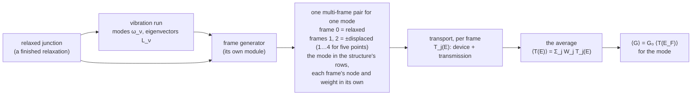
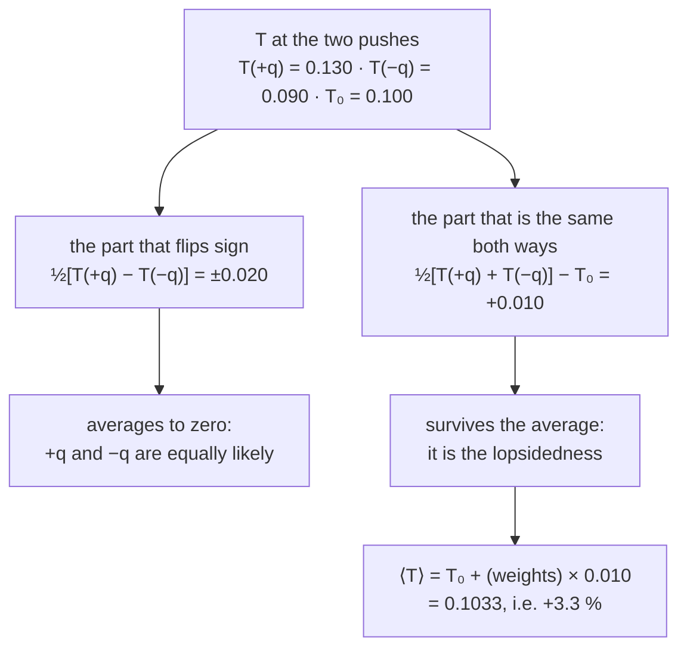
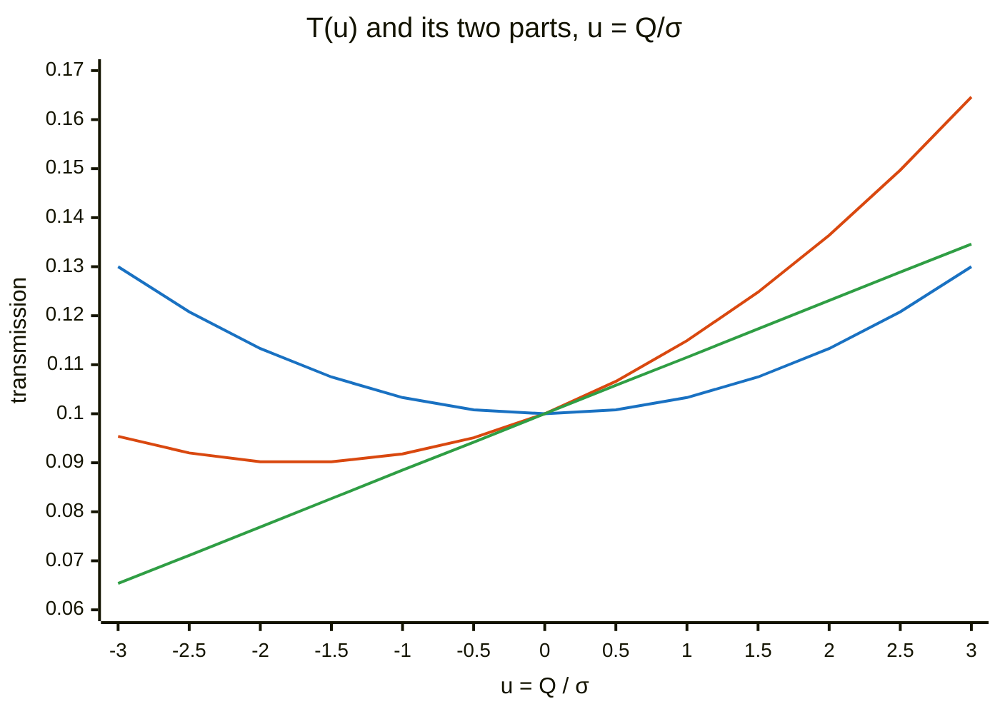
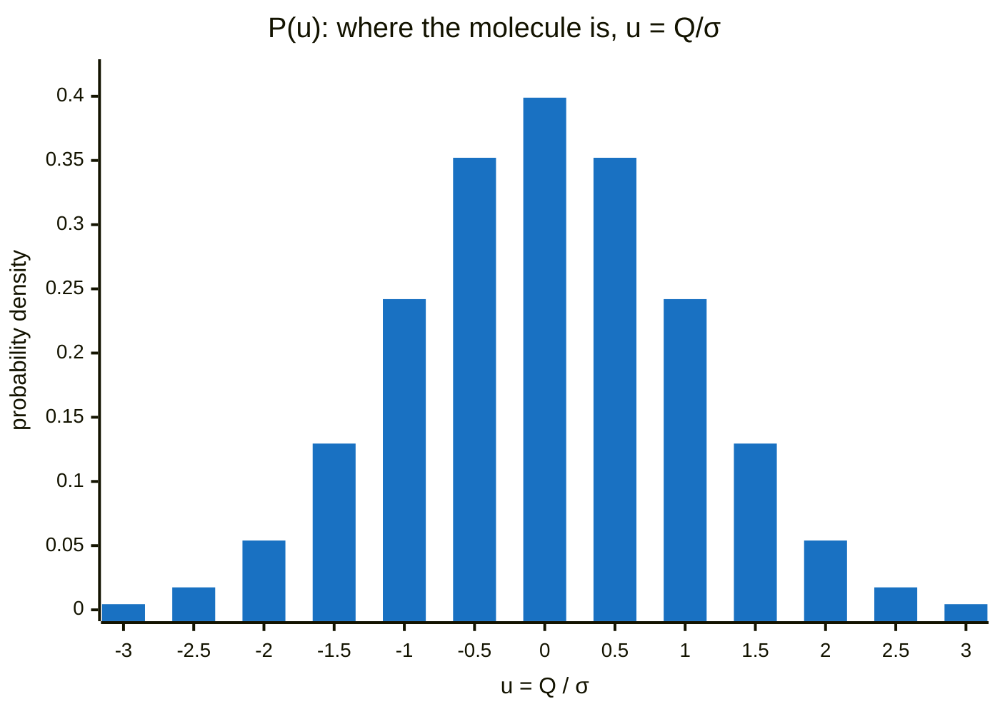
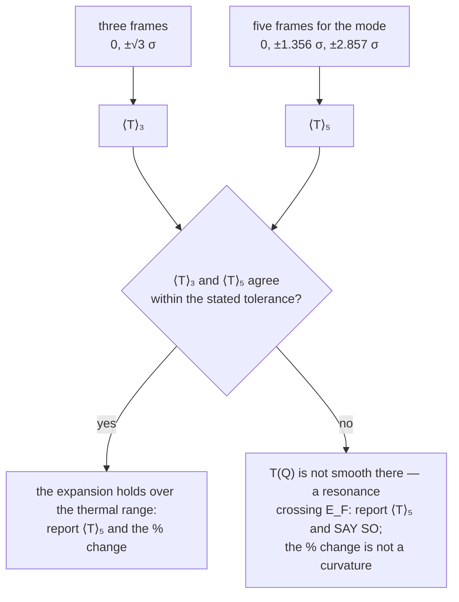
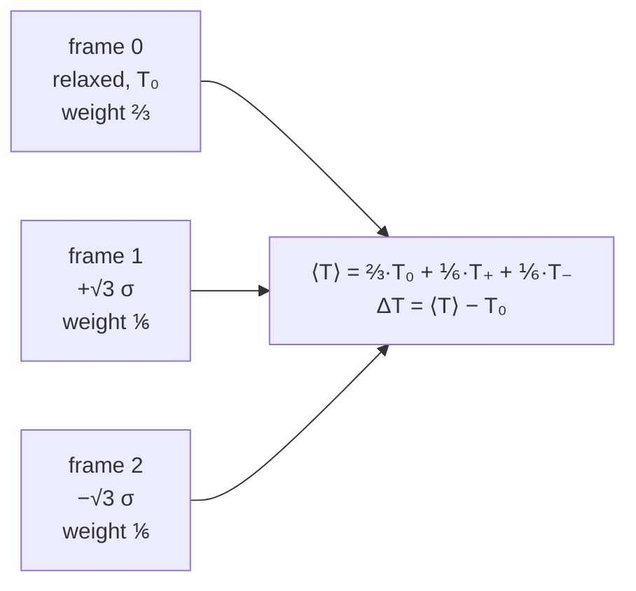

# Averaging the transmission over the junction's vibrations

**Role:** science reference
**Domain:** science
**Companions:** [`normal-modes.md`](?doc=science/normal-modes.md) § 4c (which
mode moves the current: the screen this average feeds);
[`engines/transport.md`](?doc=engines/transport.md) § 2a.9 (the frame set a
transport calculation is handed); [`engines/vibration.md`](?doc=engines/vibration.md)
§ 5.10 ③ (the frame rule's fields); `plans/plan.md` § 5z (Q17, decision D5).

*Written 2026-10-09 at the user's request: "add a discussion of this
averaging as an independent document under science, expand the details".*

---

## 0. The question

A molecule bridging two electrodes is never still. Every vibration moves it —
a little even at absolute zero, more when warm — and a conductance measurement
lasts millions of vibrational periods. What it reports is the transmission
**averaged over every geometry the molecule passes through**, not the
transmission of the relaxed geometry.

A transport calculation on a frame set computes that average from a handful of
**static frames**: the relaxed junction and copies of it displaced along
**one** normal mode — one frame set per mode *(user, 2026-10-09: "i would
rather let one multi-frame focus on one mode")*. Each frame is an ordinary
transport calculation; the average is assembled afterwards from the mode the
structure's `customized` rows announce and the weight each frame's own rows
state.

This document answers three questions: **where** the molecule is while it
vibrates (§ 2), **what** the measurement averages and why a lopsided response
gives a net change (§ 3–4), and **how** few frames can compute that average and
when they cannot (§ 5); § 6 says what one mode's frames do not answer. § 7 lists what the picture assumes; § 8 what the
record carries.

---

## 1. The quantities

A normal mode $\nu$ has an angular frequency $\omega_\nu$ and a mass-weighted
normal coordinate $Q_\nu$ (units $\mathrm{amu}^{1/2}\,\text{Å}$). Displacing the
junction along the mode moves each atom $A$ by its share of the canonical
eigenvector $\mathbf L_{\nu,A}$ (`vibration.md` § 6.3):

$$
\mathbf R_A(Q_\nu) \;=\; \mathbf R_A^{0} \;+\; Q_\nu\,\mathbf L_{\nu,A},
\qquad \mathbf L_{\nu,A} = \mathbf 0 \ \text{for every held atom.}
$$

The electrodes are held, so no frame moves a lead atom — the condition that
lets every frame share one pair of lead calculations (`transport.md` § 2a.9).

For each frame the transport calculation gives the transmission $T(E;Q)$, and
at low bias the conductance

$$
G(Q) \;=\; G_0\,T(E_F;Q), \qquad G_0 = \frac{2e^2}{h}
$$

for a spin-degenerate junction (per spin channel, $e^2/h$ each; `transport.md`
§ 2a.12).

---

## 2. Where the molecule is: the thermal distribution of one mode

For a harmonic mode in thermal equilibrium at temperature $T_{\mathrm{K}}$ the
probability of finding the coordinate at $Q$ is a Gaussian — exactly, quantum
mechanically, at every temperature (the diagonal of the oscillator's thermal
density matrix; Feynman, *Statistical Mechanics*, 1972, ch. 2):

$$
P(Q) \;=\; \frac{1}{\sqrt{2\pi}\,\sigma}\,\exp\!\left(-\frac{Q^2}{2\sigma^2}\right),
\qquad
\sigma^2 \;=\; \langle Q^2\rangle \;=\; \frac{\hbar}{2\omega}\,
\coth\!\left(\frac{\hbar\omega}{2k_B T_{\mathrm K}}\right).
$$

Its two limits say what sets the width:

$$
\sigma^2 \xrightarrow{\;k_BT_{\mathrm K}\ll\hbar\omega\;} \frac{\hbar}{2\omega}
= Q_{\mathrm{zp}}^2 \quad\text{(zero-point motion)},
\qquad
\sigma^2 \xrightarrow{\;k_BT_{\mathrm K}\gg\hbar\omega\;} \frac{k_BT_{\mathrm K}}{\omega^2}
\quad\text{(classical equipartition)}.
$$

$Q_{\mathrm{zp}}$ is in every vibration result already
(`zero_point_amplitude_amu12_ang`, `vibration.md` § 6.3, beside
`zero_point_displacement_ang`, $Q_{\mathrm{zp}}\,\mathbf L$ per atom in Å), so
$\sigma = Q_{\mathrm{zp}}\sqrt{\coth(\hbar\omega/2k_BT_{\mathrm K})}$. At
298 K:

| mode | $\hbar\omega/2k_BT_{\mathrm K}$ | $\sigma/Q_{\mathrm{zp}}$ | what it means |
|---|---|---|---|
| 1600 cm⁻¹ (a ring stretch) | 3.86 | 1.00 | frozen in its ground state: zero-point only |
| 500 cm⁻¹ | 1.21 | 1.09 | mostly zero-point |
| 50 cm⁻¹ (a soft torsion) | 0.12 | 2.89 | thermally excited: three times wider |

Soft modes swing far — which is why each frame states its largest atomic
displacement against that atom's nearest-neighbour distance
(`normal-modes.md` § 4c.5), and why § 7 names the harmonic picture's limit.

**What matters for § 3: $P(Q)$ is symmetric, $P(-Q) = P(Q)$.** The molecule
spends as much time pushed one way as pushed the other. This is a property of
the *distribution* of positions, for a harmonic mode — and it says nothing
about whether the *transmission* responds symmetrically.

---

## 3. What a measurement averages

The current at bias $V$ is linear in the transmission (Landauer),

$$
I \;=\; \frac{2e}{h}\int T(E)\,\big[f_L(E)-f_R(E)\big]\,dE ,
$$

and the measurement integrates over many vibrational periods, so — in the
static-frame picture of § 7 — the measured current and conductance are those
of the **averaged transmission**:

$$
\big\langle T(E)\big\rangle \;=\; \int_{-\infty}^{\infty} P(Q)\,T(E;Q)\,dQ ,
\qquad
\langle G\rangle = G_0\,\big\langle T(E_F)\big\rangle .
$$

The question the frame set answers is how far $\langle T\rangle$ is from the
relaxed geometry's $T_0 = T(E;0)$.

---

## 4. A lopsided response is what produces a net change

### 4.1 The transmission is not symmetric about equilibrium

The working hypothesis is that $T(Q)$ is **not** symmetric: pushing the
molecule one way changes the transmission differently from pushing it the
other way, because $T$ depends non-linearly on the geometry — a contact bond
shortened raises the tunnelling exponentially more than the same bond
lengthened lowers it; a level moved toward $E_F$ raises $T$ more than the same
level moved away lowers it. That hypothesis is exactly what gives a net
change, and the way to see it is to split $T(Q)$ into the part that flips sign
with the push and the part that does not:

$$
T(Q) \;=\;
\underbrace{\tfrac12\big[T(Q)+T(-Q)\big]}_{T_{\mathrm{even}}(Q)\ \text{— same both ways}}
\;+\;
\underbrace{\tfrac12\big[T(Q)-T(-Q)\big]}_{T_{\mathrm{odd}}(Q)\ \text{— flips sign}} .
$$

Averaged over the symmetric distribution of § 2, the odd part vanishes
exactly — whatever its size — because every push $+Q$ is matched by a push
$-Q$ of equal probability:

$$
\big\langle T_{\mathrm{odd}}\big\rangle = \int P(Q)\,T_{\mathrm{odd}}(Q)\,dQ = 0
\quad\Longrightarrow\quad
\big\langle T\big\rangle \;=\; \big\langle T_{\mathrm{even}}\big\rangle .
$$

So **the net change comes entirely from the even part**, and the even part is
non-zero only because of the asymmetry: if $T$ responded linearly —
$T(Q) - T_0 = -\big[T(-Q) - T_0\big]$, a symmetric response — then
$T_{\mathrm{even}} = T_0$ and the average would be the relaxed value, no
matter how strongly the mode moves $T$. A mode changes the measured
conductance precisely when $T(+Q) + T(-Q) \neq 2T_0$: when the response is
lopsided.

The same example drawn: the full response (lopsided), its odd part drawn
about $T_0$ (a straight line here — it cancels), and its even part (a bowl —
it survives). $u = Q/\sigma$.

*(Orange: the full $T(u)$, lopsided. Blue: its even part — the bowl that
survives the average. Green: its odd part drawn about $T_0$ — the straight
line that cancels. The example is $T(u) = 0.100 + 0.0115\,u + 0.0033\,u^2$.)* And the distribution it is
averaged over:

### 4.2 In derivatives

Expanding about equilibrium makes the same statement term by term:

$$
T(Q) = T_0 + T'Q + \tfrac12 T''Q^2 + \tfrac16 T'''Q^3 + \tfrac1{24}T''''Q^4 + \dots
$$

The Gaussian's odd moments vanish, $\langle Q\rangle = \langle Q^3\rangle = 0$,
and its even ones are $\langle Q^2\rangle = \sigma^2$,
$\langle Q^4\rangle = 3\sigma^4$:

$$
\big\langle T\big\rangle \;=\; T_0 \;+\; \tfrac12\,T''\sigma^2 \;+\; \tfrac18\,T''''\sigma^4 \;+\;\dots
$$

$T'$ and $T'''$ — the odd, sign-flipping response — drop out; $T''$, the
curvature, is the leading measure of the lopsidedness. The *relative* change
of the conductance,

$$
\frac{\langle\Delta G\rangle_\nu}{G} \;=\; \frac{\tfrac12\,T''_\nu\,\sigma_\nu^2}{T_0},
$$

is the transport score of `normal-modes.md` § 4c.4. Its sign is the sign of
the curvature: a convex response (a level's tail, an exponential contact)
raises the average conductance, a concave one (sitting on a resonance's peak)
lowers it.

### 4.3 Two examples of a strongly lopsided response

**A contact bond.** Tunnelling through a contact falls exponentially with its
length, $T \propto e^{-2\kappa d}$. If the mode stretches the contact,
$d = d_0 + d'Q$, then $T(Q) = T_0\,e^{-aQ}$ with $a = 2\kappa d'$ — very
lopsided: with $a\sigma = 0.6$ the two frames at $\pm\sqrt3\,\sigma$ give
$T/T_0 = 2.83$ and $0.35$. The Gaussian average is exact:

$$
\frac{\langle T\rangle}{T_0} = \big\langle e^{-aQ}\big\rangle = e^{a^2\sigma^2/2}
= e^{2\kappa^2 d'^2\sigma^2} \;>\; 1 \quad \text{for either sign of } d' ,
$$

$= 1.197$ for $a\sigma = 0.6$: a 20 % rise. The shortened side wins because it
wins exponentially — the log-normal average of `normal-modes.md` § 4c.4.

**A level near $E_F$.** A single level of half-width $\Gamma$ at
$\varepsilon(Q) = \varepsilon_0 + gQ$ transmits

$$
T(E_F;Q) = \frac{\Gamma^2}{\big(\varepsilon(Q)-E_F\big)^2+\Gamma^2}.
$$

With $\Gamma = 0.1$ eV and a thermal level shift $g\sigma = 0.1$ eV:

| where the level sits | $T_0$ | exact $\langle T\rangle$ | change | the response |
|---|---|---|---|---|
| on the tail, $\varepsilon_0 - E_F = 0.5$ eV | 0.0385 | 0.0436 | **+13 %** | convex: the side moved toward $E_F$ gains more than the other loses |
| on the peak, $\varepsilon_0 = E_F$ | 1.000 | 0.656 | **−34 %** | concave: either push moves the level off resonance |

The same mode raises or lowers the conductance depending on where $E_F$ sits —
the curvature's sign, read off the frames, not assumed.

---

## 5. Computing the average from a few frames

### 5.1 The Gauss–Hermite rule

Each frame costs a device calculation and a transmission, so the integral of
§ 3 is computed from as few frames as possible. For a Gaussian weight the
optimal choice is the **Gauss–Hermite** rule (Abramowitz & Stegun, *Handbook of
Mathematical Functions*, 1964, § 25.4.46 and Table 25.10): with
$Q = \sqrt2\,\sigma x$,

$$
\big\langle T\big\rangle = \frac{1}{\sqrt\pi}\int e^{-x^2}\,T(\sqrt2\sigma x)\,dx
\;\approx\; \sum_{j=1}^{n} W_j\,T(Q_j),
\qquad Q_j = \sqrt2\,\sigma\,x_j,\quad W_j = \frac{w_j}{\sqrt\pi},
$$

where $x_j$ and $w_j$ are the nodes and weights of the $n$-point rule. The rule
is **exact whenever $T(Q)$ is a polynomial of degree $\le 2n-1$** over the
thermal range — including every odd term, so an arbitrarily lopsided cubic or
quintic response is averaged exactly.

| $n$ | frames $Q_j/\sigma$ | weights $W_j$ | exact for degree |
|---|---|---|---|
| 3 | $0,\ \pm\sqrt3 = \pm1.7321$ | $\tfrac23,\ \tfrac16,\ \tfrac16$ | $\le 5$ |
| 5 | $0,\ \pm1.3556,\ \pm2.8570$ | $0.53333,\ 0.22208,\ 0.01126$ | $\le 9$ |

### 5.2 Three frames give the average and the curvature at once

With three frames,

$$
\big\langle T\big\rangle \approx \tfrac23\,T_0 + \tfrac16\big[T(+\sqrt3\sigma) + T(-\sqrt3\sigma)\big]
= T_0 + \tfrac16\big[T_+ + T_- - 2T_0\big],
$$

and the bracket is the second difference at step $h = \sqrt3\,\sigma$:
$T_+ + T_- - 2T_0 = h^2\,T''_{\mathrm{fd}} = 3\sigma^2 T''_{\mathrm{fd}}$, so

$$
\big\langle T\big\rangle \approx T_0 + \tfrac12\,T''_{\mathrm{fd}}\,\sigma^2 .
$$

The same three frames are the curvature of § 4.2 and the thermal average, and
there is no step size to choose: the step is the thermal amplitude, where the
molecule actually is. The bracket is the "same both ways" part of § 4.1 —
twice the lopsidedness at $\pm\sqrt3\sigma$.

On the examples of § 4.3: the contact gives $1.1968$ against the exact
$1.1972$; the level on its tail $0.0435$ against $0.0436$. Both responses are
smooth over $\pm3\sigma$, so three frames suffice.

### 5.3 When three are not enough — and how to tell

A response that is not polynomial-like over the thermal range — a level
**crossing** $E_F$ within the vibration, as in the second row of § 4.3 — is
averaged badly by three frames: $0.750$ against the exact $0.656$. Five frames
give $0.692$, and the disagreement between the two rules is the signal:

Five frames cost two more transport calculations; they are a check the frame
generator offers, not a default (`normal-modes.md` § 4c.5). A frame set is one
mode at one rule — its weights summing to 1 — so the check is a second set of
the same mode at the other rule, and comparing the two is the person's.

---

## 6. One mode a set — and what its frames do not answer

A frame set samples **one** mode: frame 0 and the mode's displaced frames,
**every frame stating its weight and the weights summing to 1** *(user,
2026-10-09: "all weights should add up to 1 that's an explicit rule within
error tolerance")*:

Another mode is another frame set and another transport calculation. **How
several modes act together is not answered here.** Whether their changes add,
compound or cancel depends on the joint motion of the modes and on the
cross-derivatives $\partial^2T/\partial Q_\nu\partial Q_\mu$, which frames
displaced along one mode never measure; and no thermodynamic data at hand
supports a claim about it. So each mode's average stands on its own, and
weighing one mode against another is the person's post-processing *(user,
2026-10-09: "it is cleaner and more focused to let user to post-process the
results from different vibrational mode and decide how they can be weighed to
give an overall impact ... it is baseless to discuss how different normal mode
would mix because there is not thermal dynamic data to support any claims at
this point")*.

---

## 7. What the picture assumes

Each is stated beside the numbers it limits, never dropped:

1. **A harmonic mode.** $P(Q)$ is the Gaussian of § 2. A strongly
   anharmonic mode — a soft contact bond, softer outward than inward — has a
   *skewed* distribution, $\langle Q\rangle \neq 0$ and $\langle Q^3\rangle\neq0$,
   and then the odd part of $T$ no longer cancels: a second source of
   asymmetry, the distribution's own, which a harmonic frame set does not
   carry. The soft-mode displacement check of `normal-modes.md` § 4c.5 flags
   where it may matter.
2. **Static frames (the electron is fast).** Each frame is a frozen geometry:
   the electron crosses the junction quickly against the vibration,
   $\hbar\omega \ll \max\big(|\varepsilon - E_F|,\ \Gamma\big)$. What a static
   average cannot give — the inelastic steps at $eV = \hbar\omega$, a strongly
   coupled level's polaron shift — needs the electron–vibration coupling itself
   [Frederiksen2007, Galperin2007] (`vibration.md` § 5.6, level two).
3. **The equilibrium distribution, one voltage at a time.** The average is
   taken over the frames at each voltage separately (`transport.md` § 2a.9,
   *Both axes*), with weights from the thermal distribution of § 2 — the
   junction's at equilibrium. A finite bias can heat the modes the current
   couples to, and then their population is not that distribution; that is not
   modelled. At low bias the averaged $T(E_F)$ is the averaged conductance.
4. **Each frame's electrons in their ground state for that frame** (the
   Born–Oppenheimer picture): every frame runs its own self-consistent device.
5. **The level alignment is DFT's**, frame by frame (`normal-modes.md` § 4c.6).
6. **The electrodes do not move**: the held atoms are the leads, shared by
   every frame (§ 1).

---

## 8. What the record carries

The frame set states what every frame is, raw values beside derived ones —
the mode as the vibration result numbers it, its frequency, the temperature,
the zero-point amplitude and the spread $\sigma$; each frame's plain
displacement, its mass-weighted position $Q_j$ and $Q_j/\sigma$, its weight;
every atom's mass — in one definition whose home is
[`model/structure.md`](?doc=model/structure.md) § 2.2f, checked when the set
is cited. The transport record (`transport.md` § 2a.12) carries:

- each frame's $T_j(E)$ and current — the family of curves — beside its rows;
- $\langle T(E)\rangle = \sum_j W_j T_j(E)$, the mode's average at every
  frame's stated weight, and $\Delta T(E) = \langle T(E)\rangle - T_0(E)$;
- at $E_F$ the averaged conductance beside the base frame's, and
  $\langle\Delta G\rangle / G$ in per cent;

with § 7's assumptions beside them. It computes with the weights alone, and
**no curvature or slope**: a level crossing $E_F$ within the vibration makes
$T(Q)$ jump between frames, and a difference of three frames is then no
derivative (§ 5.3) — so a number shaped like one would mislead (the user,
2026-10-10). What is derived across the frames — a slope, the curvature where
the response is smooth, a comparison with another mode's set — is the
analysis's, made on the data file, where every frame's transmission sits
beside its $Q_j$ and its weight (`transport.md` § 2a.12, *the data file*).

---

## References

- R. P. Feynman, *Statistical Mechanics: A Set of Lectures* (Benjamin, 1972),
  ch. 2 — the harmonic oscillator's thermal density matrix, whose diagonal is
  the Gaussian of § 2.
- M. Abramowitz and I. A. Stegun, *Handbook of Mathematical Functions* (NBS,
  1964), § 25.4.46 and Table 25.10 — Gauss–Hermite nodes and weights.
- [Frederiksen2007], [Galperin2007] — inelastic transport and the
  electron–vibration coupling (`references.bib`).
