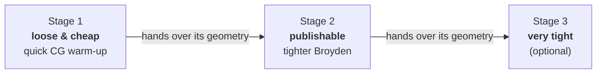
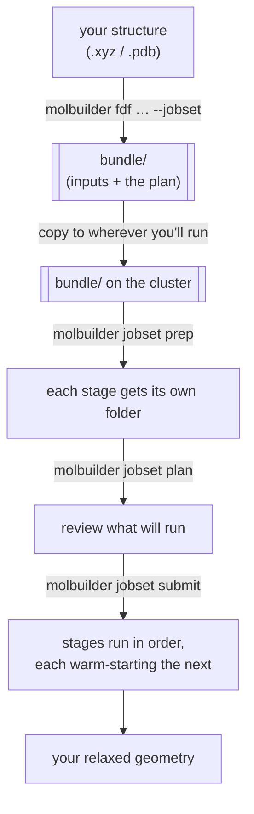

# Staged relaxation — a user's guide

> **Plain-language guide** to running a geometry optimization as a *ladder
> of stages* — cheap and loose first, expensive and tight last — and
> launching it on your workstation or an HPC cluster. No coding required;
> everything here is `molbuilder` commands you can copy and paste.
>
> Want the internals (data model, file layout, design decisions)? That's the
> developer doc, [`protocols/staged-execution.md`](protocols/staged-execution.md).
> This guide is the *how do I use it* companion.

---

## What is a staged relaxation?

Relaxing a structure all the way to a tight, publication-quality geometry in
one shot is slow and fragile. A **staged relaxation** breaks it into a short
ladder:



Each stage starts from where the previous one finished (a **warm start**, see
below), so the expensive final stage only has to polish an already-good
geometry. You get to a trustworthy answer faster, and you decide how much
accuracy (and compute) you want.

Pick a ready-made ladder with `--stage-strategy`:

| Strategy | Stages | Use it for |
|---|---|---|
| `loose-only` | 1 | a quick, cheap pre-optimization |
| `publishable` | 1 + 2 | the everyday default — a solid, publishable geometry |
| `vib-quality` | 1 + 2 + 3 | very tight finish for vibrations / IR / NEB |

---

## The big picture

You build a self-contained **bundle** (a folder) once, ship it wherever you
want to run, and drive it with three commands. Build on your laptop, run on
a supercomputer — the bundle carries everything it needs.



---

## Step by step

### 1. Build the bundle (on your laptop or the cluster — either works)

```bash
molbuilder fdf my-structure.xyz bundle/JOB.fdf \
    --stage-strategy publishable \
    --jobset \
    --psml-lib ~/pseudopotentials
```

This creates a `bundle/` folder with one input file per stage
(`JOB_stage1.fdf`, `JOB_stage2.fdf`), your pseudopotentials, and a
`job-set.json` — the **plan** that ties the stages together. The `--jobset`
flag is what writes that plan; without it you just get the raw input files.

### 2. (If needed) copy the bundle to where you'll run

```bash
scp -r bundle/ you@cluster:/scratch/you/myrun/
```

Nothing else to set up — the bundle is self-contained.

### 3. Lay out the stage folders

```bash
molbuilder jobset prep bundle/
```

Each stage gets its own folder (`point-stage1/`, `point-stage2/`) with the
shared files linked in, so the stages never overwrite each other's results.

### 4. Review the plan before anything runs

```bash
molbuilder jobset plan bundle/
```

You'll see each stage, the order, what hardware/resources it asks for, and
which restart files it hands forward. **Nothing has run yet** — this is your
chance to check.

### 5. Run it

On a **cluster** (jobs are queued; the stages chain automatically):

```bash
# preview the exact commands first (recommended)
molbuilder jobset submit bundle/ --mode submit --domain public --dry-run

# then for real
molbuilder jobset submit bundle/ --mode submit --domain public
```

On **your own machine** (stages run one after another, right now):

```bash
molbuilder jobset submit bundle/ --mode direct
```

`--domain` picks *where* on the cluster to run (a named queue your admin set
up — run `plan` to see the choices). molbuilder never picks it for you.

### 6. Watch progress

Point the Watch tab (or `molbuilder watch`) at a stage's folder, e.g.
`bundle/point-stage2/`, to see the live optimization trajectory.

---

## What "warm start" / carry-forward means

You never copy files between stages by hand. When stage 1 finishes, molbuilder
makes stage 2 start from stage 1's result automatically:

- the **relaxed geometry** is always carried forward,
- the **converged electron density** is carried forward too by default (a
  better starting guess → fewer SCF steps),
- the optimizer's own history is carried only when both stages use the *same*
  optimizer (otherwise the new optimizer starts fresh from the carried
  geometry — carrying mismatched history would only confuse it).

The result: each stage resumes almost exactly where the previous one left off.

---

## When a stage doesn't converge, or you want to try something else

molbuilder's job is to **organize and inform** — it never silently re-runs or
deletes your work, because redoing a long calculation unknowingly is
expensive. You stay in control.

**First, ask molbuilder where things stand:**

```bash
molbuilder jobset status bundle/
```

It shows each stage's state (finished / running / failed / pending /
not-started), which restart files are present, and — most useful — the
**first incomplete stage**, i.e. exactly where to pick back up. It only
reports; it never resumes for you.

- **A stage was interrupted (time limit, crash).** Re-submit that one stage;
  the modeling code (SIESTA/PySCF) picks up from its own restart files:
  ```bash
  cd bundle/point-stage2 && sbatch JOB_stage2.sbatch --continue
  ```
- **You want to explore an alternative** (say, a tighter basis for the final
  stage) without losing the good result. Save a checkpoint, branch, and
  experiment — you can always rewind:
  ```bash
  cd bundle/point-stage2
  molbuilder snapshot tag stage2-good      # save this state
  git checkout -b stage2-bigger-basis      # fork to experiment
  # ...edit the input, re-run; if it's worse:
  molbuilder snapshot restore stage2-good  # rewind
  ```

---

## Command cheat-sheet

| Goal | Command |
|---|---|
| Build a staged bundle | `molbuilder fdf IN.xyz bundle/JOB.fdf --stage-strategy publishable --jobset --psml-lib DIR` |
| Lay out the stage folders | `molbuilder jobset prep bundle/` |
| See what will run (no run) | `molbuilder jobset plan bundle/` |
| Check progress / where to resume | `molbuilder jobset status bundle/` |
| Preview the launch commands | `molbuilder jobset submit bundle/ --mode submit --domain NAME --dry-run` |
| Run on a cluster | `molbuilder jobset submit bundle/ --mode submit --domain NAME` |
| Run on your own machine | `molbuilder jobset submit bundle/ --mode direct` |
| Resume an interrupted stage | `cd bundle/point-stageN && sbatch JOB_stageN.sbatch --continue` |

---

## Going deeper

- **Running jobs in general** (environments, activation, workstation vs HPC,
  `.molbuilder.json` templates): [`job-execution.md`](job-execution.md).
- **The design and internals** of the staged-execution framework:
  [`protocols/staged-execution.md`](protocols/staged-execution.md).
- **The science** of choosing convergence tiers:
  [`engines/optimization-tuning.md`](engines/optimization-tuning.md).
