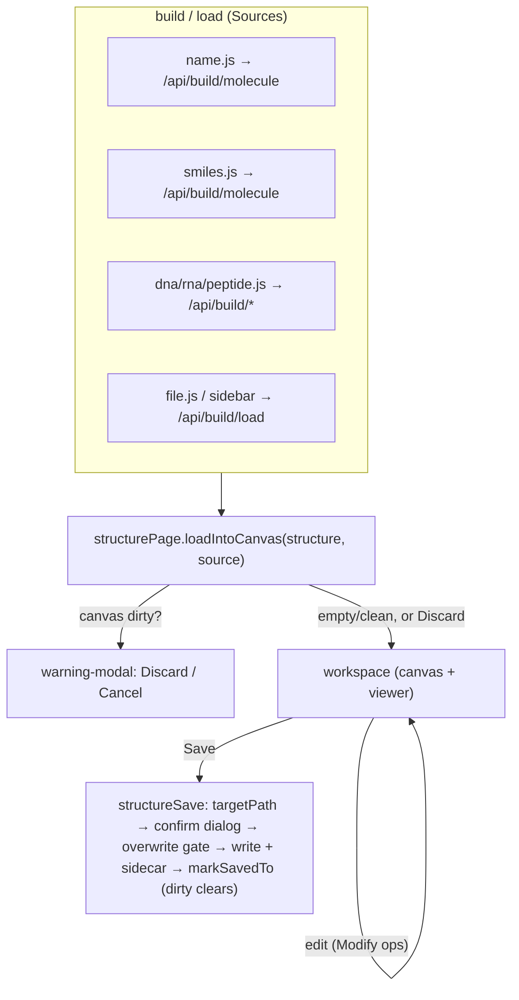

# Structure build & save — a developer's guide

**What this is.** A plain-language guide to the **client-side structure
lifecycle**: how a molecule gets *into* the workspace (build from a name,
SMILES, DNA/RNA sequence, peptide, or a file) and *out* of it (save, with its
`.molstruct.json` sidecar). It's the glue for the Sources + Save panels
(`lib/structure/*`).

**What this is NOT.** The authoritative contract, or the backend builders.
`protocols/save-flow.md` is the sole source of truth for the Save panel/dialog/
sidecar; `engines/builders.md` documents the *server-side* structure synthesis
(peptide / nucleic-acid / SMILES, H-placement, X3DNA). This guide teaches the
browser-side flow and points there.

---

## 1. The one-paragraph mental model

Getting a structure into the workspace always goes through **one gate**:
`structurePage.loadIntoCanvas(structure, source)`. Every Source panel (name,
SMILES, DNA, RNA, peptide, file, or a sidebar Load) builds/fetches a structure
and hands it to that gate — which runs the **unsaved-changes check** before
replacing what's on the canvas. Saving is the mirror: `structureSave` resolves
the destination, confirms the name, writes the file **and** its sidecar, then
clears the dirty bit. Two funnels — one in, one out — so the dirty-state logic
lives in exactly one place each.



---

## 2. The pieces

| File | Role |
|---|---|
| `lib/structure/page.js` | **the load gate** — `structurePage.loadIntoCanvas` + `markDirtyAfterModification` / `markSavedTo` / `getCanvasSnapshot` |
| `lib/structure/{name,smiles,dna,rna,peptide,file}.js` | the six **Source panels** (build/fetch → gate) |
| `lib/structure/warning-modal.js` | the "you have unsaved edits" Discard/Cancel modal |
| `lib/structure/save.js` | **`structureSave`** — destination resolution + the write |
| `lib/structure/save-dialog.js` | the confirm-name dialog (single-instance) |
| `lib/structure/sidecar-labels.js` | the `.molstruct.json` label pairing |

---

## 3. Building a structure (the common pattern)

Every Source panel follows the same shape:

```js
// 1. read input; refuse empty
// 2. POST to the backend build endpoint:
const r = await fetch("/api/build/molecule",
    { method: "POST", body: JSON.stringify({ kind: "name", input: text }) });
// 3. route the result THROUGH THE GATE (this is where the dirty check fires):
const gate = await window.molbuilder.structurePage.loadIntoCanvas(
    { source_format: "xyz", text: r.text }, { kind: "generated", ... });
if (!gate.ok) return;                 // user cancelled the discard
// 4. drive the viewer with the accepted structure
window.molbuilder.loadStructureText(r.text, name);
```

Backend dispatch (see `engines/builders.md`): `kind:"name"` → PubChem lookup;
`kind:"smiles"` → RDKit/OpenBabel; DNA/RNA → X3DNA; peptide → the peptide
builder. `file.js` and the sidebar use `/api/build/load` (load existing text).

---

## 4. The load gate (the rule that keeps state sane)

`structurePage.loadIntoCanvas(structure, source)` is the **single entry point**
for "put this on the canvas". Its logic:

- canvas **empty** → set immediately
- canvas **clean** → set immediately
- canvas **dirty** → show `warning-modal`; set **only** on "Discard and continue"

**Every Source MUST go through this gate — never call `canvas-state.setStructure`
directly.** Bypassing it was the historical bug: canvas-state stayed empty, the
dirty bit didn't track, Save reported "nothing to save", and the sidecar went
out of sync. (This is the structure-side cousin of the workspace mount-restore
race — one authoritative path, honored by all callers.)

---

## 5. Saving (destination + sidecar)

`structureSave` (`window.molbuilder.structureSave`):

- **`targetPath()`** resolves where to write: `kind="file"` → the `source.file`
  it was loaded from; otherwise → `last_save_to` if a prior Save happened this
  session; else the panel disables (Save-as is a separate action).
- The flow (save-flow.md §3): resolve dir → default filename → **confirm-name
  dialog** → compute final path → **overwrite gate** (refuses a clobber unless
  confirmed) → write.
- **Sidecar pairing (§4):** the `.xyz` is written with its `.molstruct.json`
  (regions + frozen atoms) as an atomic pair. Save-as **propagates labels** to
  the new path; save-back updates in place.
- **Post-write sync:** `markSavedTo` clears the dirty bit + records
  `last_save_to`, so a subsequent Load/Generate won't fire the warning modal.

---

## 6. Rules to get right / gotchas

- **Route every new Source through `loadIntoCanvas`** — not `canvas-state`
  directly (the silent dirty-bit desync).
- **Check `gate.ok`** — a `false` means the user cancelled the discard; don't
  proceed to load the viewer.
- **Sidecar travels with the structure.** On Save-as, propagate labels to the
  new path (§4.3); don't drop regions/frozen.
- **Dialogs are single-instance** (§6) — don't stack a second confirm dialog.
- **Safe-action focus** (§5): don't autofocus a destructive/overwrite button.

---

## 7. Where the authority lives

- **`protocols/save-flow.md`** — the Save panel/dialog/sidecar contract.
- **`engines/builders.md`** — the server-side builders (peptide / nucleic /
  SMILES, H-placement heuristics, X3DNA quirks).
- **`protocols/sidecar-contract.md`** — the `.molstruct.json` three-stage flow.
- **`workspace-guide.md`** — the workspace store the canvas/selection live in.
