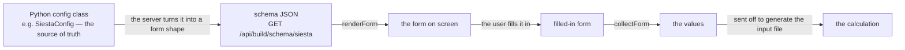

# Form-schema — building the engine-option forms from the config

**Role:** contract
**Domain:** web
**Companions:** [`runtime.md`](?doc=web/runtime.md) — the shared building blocks
(form-schema is one of them, big enough for its own doc);
[`engines/siesta.md`](?doc=engines/siesta.md) +
[`engines/pyscf.md`](?doc=engines/pyscf.md) — the `SiestaConfig` / `PySCFConfig`
dataclasses these forms are generated from; `web-api.md` — the
`/api/build/schema/*` routes (web wave); [`roadmap.md`](?doc=roadmap.md) § 3 —
the pending ES-module conversion.

The long option forms on the Build, Spectra, and Transport tabs — mesh cutoff,
basis size, k-grid, the relaxation stages, and the rest — are **not written by
hand**. They are **generated from the Python config object**. This module,
`form-schema`, is what does the generating: it fetches a form's shape from the
server, draws the form, and reads the filled-in values back.

## 1. The one idea: the config is the source of truth

There is a Python dataclass for each engine's settings — `SiestaConfig`,
`PySCFConfig`, and so on. Those classes already define every option: its name,
its type, its default, and (through a bit of field metadata) which section of
the form it belongs in. **The form is built from that class.** Add a field to
`SiestaConfig`, mark which section it goes in, and it shows up in the Build tab's
SIESTA form automatically — nobody edits any HTML. Remove it, and it's gone.
There is no second copy of the option list to keep in sync.

## 2. The round-trip

- **On the server**, `dataclass_to_form_schema()` walks the config class and
  turns each field into a small JSON description — its label, its kind, its
  default, its allowed choices — grouped by section. Only fields that carry a
  `section` tag are exposed, so an option can be kept internal by leaving that
  tag off. This is served at `GET /api/build/schema/<engine>` (SIESTA, PySCF),
  `GET /api/build/schema/spectra`, and `GET /api/transport/schema`.
- **In the browser**, this module takes that JSON and draws the matching
  controls, then — when the user submits — reads every control back into a
  plain values object that goes to the generate step.

Because both directions start from the one dataclass, the form a user fills in
and the config the server rebuilds can't drift apart.

## 3. The four calls

Everything is on `window.molbuilder.formSchema` (a plain global — it does not
register with the runtime):

| Call | What it does |
|---|---|
| `fetchSchema(engine, opts)` | Ask the server for a form's shape (`GET /api/build/schema/<engine>`). |
| `renderForm(schema, host, …)` | Draw the form from that shape into a host element. |
| `collectForm(host)` | Read the filled-in controls back into a plain values object. |
| `setValues(host, values)` | Push a set of values into an already-drawn form (e.g. to restore a saved config). |

## 4. What each field type becomes

The server tags each field with a *kind*, and this module draws the matching
control. The nine kinds:

| The config field | The control you get |
|---|---|
| `bool` | a checkbox |
| `int` | a whole-number input |
| `float` | a number input |
| `str` | a text box |
| a fixed set of choices | a dropdown |
| `Optional[bool]` | a three-way select (yes / no / leave default) |
| three integers (e.g. a k-grid) | three linked integer inputs |
| a list of numbers | a comma-separated number box |
| a list of sub-configs (the relaxation **stages**) | a table with one row per stage |

Anything the server doesn't recognize falls back to a plain text box (with a
warning), so an un-mapped field never silently disappears.

## 5. A worked example — why the SIESTA form has the fields it has

1. The Build tab, with SIESTA selected, calls
   `formSchema.fetchSchema("siesta")`.
2. The server walks `SiestaConfig`, turns each sectioned field into a small
   description (mesh cutoff → a number input; the k-grid `Tuple[int,int,int]` →
   three linked inputs; the relaxation stages `List[SiestaStageSpec]` → a
   stage table), and returns them grouped by section.
3. `renderForm` draws exactly those controls — so the form shows the SIESTA
   options **because `SiestaConfig` has those fields**, not because someone
   wrote a SIESTA form.
4. The user edits, and `collectForm` reads the controls back into a values
   object that is sent to generate the `.fdf`.
5. Later, reopening a saved config calls `setValues` to refill the same form.

## 6. Who uses it

- **Build tab** (structure-optimization) — the full four-call cycle, for SIESTA
  and PySCF.
- **Spectra tab** — `fetchSchema` / `renderForm` / `collectForm` / `setValues`
  for its own config.
- **Transport tab** — uses `renderForm` / `collectForm`, but fetches its shape
  from its own route (`GET /api/transport/schema`) rather than through
  `fetchSchema` (which targets the Build engines).

## 7. Current → target: ES modules

`form-schema.js` is a classic `window.molbuilder.*` script today. Converting it
to an ES module is a planned pass ([`roadmap.md § 3`](?doc=roadmap.md)); this
note is dropped when that lands.
