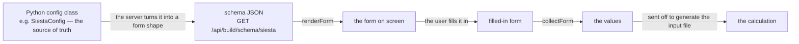

# Form-schema — building the engine-option forms from the config

**Role:** contract
**Domain:** web
**Companions:** [`runtime.md`](?doc=web/runtime.md) — the shared building blocks
(form-schema is one of them, big enough for its own doc);
[`engines/siesta.md`](?doc=engines/siesta.md) +
[`engines/pyscf.md`](?doc=engines/pyscf.md) — the `SiestaConfig` / `PySCFConfig`
dataclasses these forms are generated from; `web-api.md` — the
`/api/build/schema/*` routes (web wave); [`roadmap.md`](?doc=roadmap.md) § 3 —
the pending ES-module conversion.

The long option forms on the Build, Spectra, and Transport tabs — mesh cutoff,
basis size, k-grid, the relaxation stages, and the rest — are **not written by
hand**. They are **generated from the Python config object**. This module,
`form-schema`, is what does the generating: it fetches a form's shape from the
server, draws the form, and reads the filled-in values back.

> **Where this generator stops, and why it matters** (2026-08-07). It answers
> exactly one question: *what settings does this engine have, and how is each one
> drawn?* It does **not** answer *which of those settings the user wants to vary
> across stages* — that is the user's choice, made in the UI and recorded in
> `task.json` (`engines/stages.md § 1.2`).
>
> The two got fused. `stages` was made a field of `SiestaConfig`, so this
> generator walked into it and emitted one table column per field of
> `SiestaStageSpec` — answering the *selection* question with the *catalogue*
> machinery, and thereby fixing in a Python class the set of things a user is
> allowed to vary. That is the whole reason a stage can vary four values today.
>
> **An engine config carries no stage list**, so the generator never meets a
> stage and the `stage-table` field kind is not reachable from an engine schema.
> The per-stage grid is the shared Task Setup tab's
> ([`task-setup.md`](?doc=web/task-setup.md) § 5), fed by two inputs
> from two sources: the **catalogue** from here, the **selection** from
> `task.json`. PySCF still has a `stages` field and is a deliberate exception
> until the SIESTA path works.

## 1. The one idea: the CATALOGUE is the source of truth

**Every parameter both engines have is defined in one file** —
`molbuilder/data/catalogue.template.toml`, in the template format
([`engines/template.md`](?doc=engines/template.md) § 4.3). It carries the name,
the type, the default, the bounds, the prose, and the two things that decide
where a control appears. **The form is built from that file.** Add an item to
the catalogue and it shows up in the Build tab automatically — nobody edits any
HTML, and nobody edits Python. Remove it and it is gone. There is no second copy
of the option list to keep in sync.

> ⚠ **This section said the opposite until 2026-08-14** — *"there is a Python
> dataclass for each engine's settings … the form is built from that class."*
> That was the direction [`template.md`](?doc=engines/template.md) § 2.1
> retired: it made the config classes the master, so enriching the parameter
> list meant editing Python, and two engines' parameters could never share one
> file. The classes are **translators** now — they carry a value on its way to
> an engine, and nothing else.

### 1.1 What the form takes from an item, and what it derives

**The presentation does not change.** The CSS, the card layout, the help
disclosure, the engine-key badge — all of it stays exactly as it is. What moves
is where the *data* comes from.

| the schema needs | from the item |
|---|---|
| `name` | the item's own name |
| `label` · `help` · `default` · `unit` · `choices` | the keys of the same name |
| `min` / `max` | `range` |
| `engine_key` | the item's **`engine_key`** — the full spelling. `expands` is the fallback for a `deck` item whose several keywords are the honest answer, and `anchor` the last resort. *(This said `anchor` first until 2026-08-15, and an anchor is deliberately the bare leading keyword — so the badge read `gto.M` on four different PySCF controls, `mf` on three more, and nothing at all on the eleven whose key is a molbuilder note.)* |
| `workflow_group` | `group` |
| `id` | derived: the container's prefix + the name |
| `kind` (which control) | derived from `type` — `enum`→select, `bool`→checkbox, `int3`/`float3`→a triple, … |
| `step` | derived from `type`: `int` steps by 1, `float` by any |
| `labels` (a triple's x/y/z) | derived from `type` |
| `null_option` | derived: the item is optional |
| `tier` · `pattern` · `optional` | **item keys added for this** — § 1.2 |

### 1.2 Three keys the catalogue gained for the form

| key | why the form cannot derive it |
|---|---|
| `optional` | *unset* is a real state and the control must offer it. It is **not** inferable from `null_label`: of **17** optional items only **13** carry one, so four would silently lose their *(auto)* option |
| `tier` | `basic` / `advanced`. A judgement about the parameter, not about the widget — the form dims advanced fields |
| `pattern` | a regex the value must match. Two items have one (`system_label`, `job_name`) and nothing else can express it |

### 1.3 The two grouping axes, and why both survive

They are orthogonal, every item carries both, and the form uses each for a
different job:

| axis | answers | the form uses it for |
|---|---|---|
| **`group`** — the closed vocabulary of [`template.md`](?doc=engines/template.md) § 5 | *when do I set this?* | the **outer card**, in that vocabulary's declared order |
| **`category`** — the six of § 6.2 | *what question about the calculation is this?* | the **legend inside** the card |

*The `group` row named `profile · stage · budget` until 2026-08-15 and had been
wrong since `output` landed. Naming the members in two documents is what made
that possible; § 5 owns them now.*

**`category` replaces `section`** in the inner legend, and that is the whole
visible change: `section` was free text chosen per engine, so SIESTA's *"Basis &
grid"* and PySCF's *"Method"* were unrelated words. The six categories are
shared, so the same card shows the same inner headings for both engines — which
is what [`template.md`](?doc=engines/template.md) § 6.2 exists for.

**The outer cards are load-bearing.** They were introduced 2026-06-13 to fix a
reported bug — the stage selector silently rewrote budget and system fields.
Keeping `group` as the outer axis keeps that fix.

This said *"and are not touched"* until 2026-08-15, by which point three had
been added: `output`, `staging` and `setup`. The sentence meant *the mechanism
is not changed*, and that is still true — cards are still chosen by `group`,
still drawn in the renderer's declared order. But read as *the set is closed in
practice* it was simply false, and it is the reason two tables below it went
stale unnoticed. **The vocabulary grows; the axis does not.**

## 1a. The field-metadata vocabulary — every tag, and the rule for adding one

*Written 2026-08-07 (user rule): **every tag this system uses must have a stated
meaning, function and reader in a contract**, so that expanding the data set has
rules rather than precedents.*

**Twenty-two keys are in use across the four engine configs**, and they split
into two groups that this table conflated until 2026-08-17 — when it listed
fifteen and said *"this is all of them"*, while seven were in the tree with no
entry anywhere. The rule above is what made that a defect rather than an
oversight: a tag with no contract entry is a tag whose meaning is whatever the
last person to add one assumed.

**Group 1 — the form's own tags**, below. They describe *how a field is
presented*, and this document owns them.

**Group 2 — the catalogue's axes**, which happen to ride on the same
`field(metadata=…)` because that is where a config class carries anything.
They describe *what an item is*, they are owned by
[`engines/template.md`](?doc=engines/template.md), and the form reads none of
them:

| key | what it says | owned by |
|---|---|---|
| `category` | which question about the calculation this answers | `template.md` § 6.2 |
| `read_by` | which other layer derives from the value | `template.md` § 6.1 |
| `resolver` | who computes the value when it is unset | `template.md` § 6.4 |
| `allocation` | this value belongs to the allocation, so a template may never carry one | `template.md` § 7 |
| `expands` | the engine keywords a `deck` item produces | `template.md` § 5 |
| `item_kind` | the item's `kind` when it is not the default `engine` | `template.md` § 6 |
| `validate` | a per-field checker the validation layer runs | `validation/` |

*(An eighth, `decl_type`, is **read** by `template.declaration_for` — it names
the validation type where a Python annotation cannot, and is checked against
`template.TYPES`. No field carries one today; it is listed so that the next
person to need it finds the entry rather than inventing a second spelling.)*

> **The rule for a new tag, before the table:** a tag earns its place only if
> something **reads** it. A key nothing consumes is a comment wearing metadata's
> clothes — put it in the field's `help` instead. And a tag names *how a field is
> handled*, never *what it means scientifically*; that belongs in `help` and in
> [`engines/tuning.md`](?doc=engines/tuning.md).

| Key | What it says | Who reads it |
|---|---|---|
| **`label`** | the field's display name | the form builder; falls back to the field name |
| **`help`** | one sentence of guidance, shown beside the control | the form builder, and the CLI's `--help` |
| **`section`** | which fieldset it belongs to — **and whether it is exposed at all.** A field with no `section` is internal and no surface renders it. ⚠ **Only for `SpectraConfig` and `TransportConfig` since 2026-08-15** — see the note below | `dataclass_to_form_schema`; the CLI option generator |
| **`workflow_group`** | which card — one of [`template.md`](?doc=engines/template.md) § 5's closed vocabulary, **not** restated here — and therefore **where a finding about it appears** | `form-schema.js` (card order), `validation-findings.js` (finding placement), `_shared.py::resolve_workflow_group` (wire enrichment) |
| **`engine_key`** | the deck keyword it becomes (`MeshCutoff`) — **or a parenthesised note when the field is not a deck line at all**, e.g. `mpi_np`'s *"(molbuilder: .run.sh `mpirun -np N` only; not in .fdf)"* | the emitters; BENCH-MARKS; anything tracing a value to the file it lands in |
| **`tier`** | CLI exposure level — a `--tier` filter shows only matching fields | `cli.py`'s option generator |
| **`skip_cli`** | this field has no command-line option | `cli.py` |
| **`range`** | `(min, max)`, inclusive | the form builder → the control's bounds; validators |
| **`choices`** | the legal values of an enum → a dropdown | the form builder |
| **`unit`** | the unit shown beside the control (`Ry`, `eV/Å`) | the form builder. **Display only** — it never converts anything |
| **`step`** | the numeric input's step; `"any"` for free floats | the form builder |
| **`pattern`** | a regex the value must match | the form builder → the control's `pattern` |
| **`null_label`** | what the *unset* option is called on an optional field — `"(default)"`, `"(auto)"` | the form builder's tri-select |
| **`id_suffix`** | overrides the DOM id derived from the field name, where the derived one would collide or read badly | `_shared.py`'s schema emitter |
| **`triple_labels`** | the three labels of an `int-triple` (`kx`/`ky`/`kz`) | the form builder |

> ### ⚠ `section` no longer decides visibility on the two engine forms
>
> **Changed 2026-08-15.** The SIESTA and PySCF forms are built from the
> **catalogue** (§ 1), which has no `section` — an item is on the form because
> the catalogue carries it, and § 7's membership rule makes that *every
> parameter the schema declares*. So for those two classes `section` is read by
> nothing, and a field without one is **not** internal.
>
> That is not a technicality. `section` was an **opt-in**, and fifteen real
> parameters never got one — `write_forces`, `species_order`, `copy_psml`,
> PySCF's `ecp` / `auxbasis` / `diis_space` / `damp` and the rest. They were
> invisible on the form while being perfectly ordinary settings that reach the
> generated file. Building from the catalogue is what surfaced them.
>
> `section` is still live for **`SpectraConfig` and `TransportConfig`**, whose
> tabs still call `dataclass_to_form_schema`. Until those move, the tag means
> two different things depending on which class carries it, and the rules below
> say which.

### The rules a new field must satisfy

1. **Every field must be placeable, and how you say so depends on the class.**
   * **`SiestaConfig` / `PySCFConfig`** — the parameter belongs in
     `data/catalogue.template.toml`, and its item must declare a `group` from
     the closed vocabulary (`template.GROUPS`). An item with no group renders
     loose below the cards and its findings fall to the residual panel instead
     of beside the field. **Guarded:**
     `tests/test_catalogue_agreement.py::test_every_catalogue_item_declares_a_panel`,
     plus `test_the_renderer_knows_every_card_the_form_actually_asks_for` —
     because a card the renderer does not draw looks exactly like no card.
   * **`SpectraConfig` / `TransportConfig`** — `section` and `workflow_group`
     still move together, for the reason that rule always had: a field exposed
     with no group renders bare after the cards, and a group with no `section`
     is a tag nothing can read. **Guarded:**
     `tests/test_issues_workflow_group.py::TestEveryExposedFieldIsTagged`.
   * The two engine classes still carry `workflow_group` **as well as** the
     catalogue's `group`, and the two must agree: the form reads the
     catalogue's, while finding-placement reads the class's
     (`_shared.resolve_workflow_group`). A disagreement puts a control on one
     card and its warnings on another. **Guarded:**
     `test_every_mirrored_fact_agrees`.
2. **`workflow_group` is a default and a placement, never a restriction.** It
   decides which card a field is drawn in, where its advice lands, and — for
   `stage` — whether its *vary per stage* box starts ticked. It does **not**
   decide what a user may vary: any field can be promoted
   ([`engines/stages.md`](?doc=engines/stages.md) § 1.2–1.3).
3. **The groups may overlap in meaning, and nothing downstream reads them to
   decide anything.** They serve user clarity and finding placement. A field can
   belong to a run's identity *and* be something a user steps.
4. **`engine_key` is always present**, even when the field never reaches the
   deck — the parenthesised form is how a reader learns *that*, rather than
   finding a missing key and guessing.

### What each `workflow_group` means

**The members and their meanings live in
[`template.md`](?doc=engines/template.md) § 5's `group` row, and are not
restated here.** They were, until 2026-08-15 — a three-row table naming
`profile`, `stage` and `budget`. It went stale twice in one day without anyone
noticing: `output` and `staging` were added earlier that day and never reached
it, and `setup` followed the same afternoon. A restated closed vocabulary is a
copy that only *looks* authoritative, and this document has no way to know when
the vocabulary grows.

What belongs here is the part `template.md` does not say — **how a form USES
the axis**, which is § 1.3's table: `group` chooses the outer card, `category`
the legend inside it. Two additional consequences are the form's own and are
stated nowhere else:

- **`stage` seeds the *vary per stage* checkboxes** — those boxes start ticked
  for a `stage` item and clear for everything else.
- **`staging` is not drawn at all.** `catalogue_to_form_schema` filters it,
  because the item is answered by the staging surface rather than by a
  parameter form. It is a real parameter that this page does not ask.

> **Where the cards came from.** They were introduced 2026-06-13 to fix a
> reported bug: the form mixed stage, budget and system fields inside the same
> fieldsets, so **switching the stage preset silently rewrote budget and system
> fields too**. The cards made *"the stage selector touches the stage card
> only"* visible. The per-parameter checkbox
> ([`web/task-setup.md`](?doc=web/task-setup.md)
> § 7.6) removes the preset that caused it, so the grouping now stands on its two
> remaining jobs: reading the form, and placing advice.

---

## 2. The round-trip

- **On the server**, `dataclass_to_form_schema()` walks the config class and
  turns each field into a small JSON description — its label, its kind, its
  default, its allowed choices — grouped by section. Only fields that carry a
  `section` tag are exposed, so an option can be kept internal by leaving that
  tag off. This is served at `GET /api/build/schema/<engine>` (SIESTA, PySCF —
  `?calculation=vibration` narrows PySCF's to the vibration kind's items;
  the separate `/api/build/schema/spectra` route retired at the spectra
  migration's P3) and `GET /api/transport/schema`.
- **In the browser**, this module takes that JSON and draws the matching
  controls, then — when the user submits — reads every control back into a
  plain values object that goes to the generate step.

Because both directions start from the one dataclass, the form a user fills in
and the config the server rebuilds can't drift apart.

## 3. The five calls

Everything is on `window.molbuilder.formSchema` (a plain global — it does not
register with the runtime):

| Call | What it does |
|---|---|
| `fetchSchema(engine, opts)` | Ask the server for a form's shape (`GET /api/build/schema/<engine>`). |
| `renderForm(host, schema)` | Draw the form from that shape into a host element. |
| `collectForm(host, schema)` | Read the filled-in controls back into a plain values object (the schema tells it how to read each kind). |
| `setValues(host, schema, values)` | Push a set of values into an already-drawn form (e.g. to restore a saved config). |
| `diffFromDefaults(host, schema)` | Which fields are **not** at the catalogue's recommended value, as `[{name, label, current, recommended, unit, help}]`. |

### 3.1 Why the difference is computed here

`diffFromDefaults` needs both halves this module already owns — what the DOM
holds and what the schema says — so a page that compared them itself would need
its own reader for every kind in § 4. It skips a field with **no `default`**:
there is nothing to recommend, so offering to reset it would mean blanking a
value on the user's behalf.

Two comparison rules, each earned by a way the naive version misleads:

* **Numbers compare numerically.** A control reads back as text, so a JSON
  comparison alone makes `"300"` differ from `300` and flags a field the moment
  it is focused. A panel that cries wolf is one nobody reads.
* **Composite kinds compare whole.** A k-grid is one decision, not three —
  element-wise it would be reported three times and reset a third at a time.

**The consumer is the recommended-value panel** on the structure-optimization
forms: it lists what differs and resets only what is ticked. One "reset
everything" button cannot tell a deliberate 4×4×1 k-grid from a value that
arrived with an older session, and both live in the same form.

## 4. What each field type becomes

The server tags each field with a *kind*, and this module draws the matching
control. The nine kinds:

| The config field | The control you get |
|---|---|
| `bool` | a checkbox |
| `int` | a whole-number input |
| `float` | a number input |
| `str` | a text box |
| a fixed set of choices | a dropdown |
| `Optional[bool]` | a three-way select (yes / no / leave default) |
| three integers (e.g. a k-grid) | three linked integer inputs |
| a list of numbers | a comma-separated number box |
| a list of sub-configs (the relaxation **stages**) | a table with one row per stage |

Anything the server doesn't recognize falls back to a plain text box (with a
warning), so an un-mapped field never silently disappears.

## 5. A worked example — why the SIESTA form has the fields it has

1. The Build tab, with SIESTA selected, calls
   `formSchema.fetchSchema("siesta")`.
2. The server walks `SiestaConfig`, turns each sectioned field into a small
   description (mesh cutoff → a number input; the k-grid `Tuple[int,int,int]` →
   three linked inputs), and returns them grouped by section.
3. `renderForm` draws exactly those controls — so the form shows the SIESTA
   options **because `SiestaConfig` has those fields**, not because someone
   wrote a SIESTA form.
4. The user edits, and `collectForm` reads the controls back into a values
   object that is sent to generate the `.fdf`.
5. Later, reopening a saved config calls `setValues` to refill the same form.

## 6. Who uses it

- **Build tab** (structure-optimization) — the full four-call cycle, for SIESTA
  and PySCF.
- **Spectra tab** — `fetchSchema` / `renderForm` / `collectForm` / `setValues`
  for its own config.
- **Transport tab** — uses `renderForm` / `collectForm`, but fetches its shape
  from its own route (`GET /api/transport/schema`) rather than through
  `fetchSchema` (which targets the Build engines).

## 7. Current → target: ES modules

`form-schema.js` is a classic `window.molbuilder.*` script today. Converting it
to an ES module is a planned pass ([`roadmap.md § 3`](?doc=roadmap.md)); this
note is dropped when that lands.
