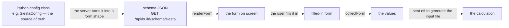

# Form-schema — building the engine-option forms from the config

**Role:** contract
**Domain:** web
**Companions:** [`runtime.md`](?doc=web/runtime.md) — the shared building blocks
(form-schema is one of them, big enough for its own doc);
[`engines/siesta.md`](?doc=engines/siesta.md) +
[`engines/pyscf.md`](?doc=engines/pyscf.md) — the `SiestaConfig` / `PySCFConfig`
dataclasses these forms are generated from; `web-api.md` — the
`/api/build/schema/*` routes (web wave); [`roadmap.md`](?doc=roadmap.md) § 3 —
the pending ES-module conversion.

The long option forms on the Build, Spectra, and Transport tabs — mesh cutoff,
basis size, k-grid, the relaxation stages, and the rest — are **not written by
hand**. They are **generated from the Python config object**. This module,
`form-schema`, is what does the generating: it fetches a form's shape from the
server, draws the form, and reads the filled-in values back.

> **Where this generator stops, and why it matters** (2026-08-07). It answers
> exactly one question: *what settings does this engine have, and how is each one
> drawn?* It does **not** answer *which of those settings the user wants to vary
> across stages* — that is the user's choice, made in the UI and recorded in
> `task.json` (`engines/stages.md § 1.2`).
>
> The two got fused. `stages` was made a field of `SiestaConfig`, so this
> generator walked into it and emitted one table column per field of
> `SiestaStageSpec` — answering the *selection* question with the *catalogue*
> machinery, and thereby fixing in a Python class the set of things a user is
> allowed to vary. That is the whole reason a stage can vary four values today.
>
> **An engine config carries no stage list**, so the generator never meets a
> stage and the `stage-table` field kind is not reachable from an engine schema.
> The per-stage grid is the shared Task Setup tab's
> ([`task-setup-plan.md`](?doc=web/task-setup-plan.md) § 6), fed by two inputs
> from two sources: the **catalogue** from here, the **selection** from
> `task.json`. PySCF still has a `stages` field and is a deliberate exception
> until the SIESTA path works.

## 1. The one idea: the config is the source of truth

There is a Python dataclass for each engine's settings — `SiestaConfig`,
`PySCFConfig`, and so on. Those classes already define every option: its name,
its type, its default, and (through a bit of field metadata) which section of
the form it belongs in. **The form is built from that class.** Add a field to
`SiestaConfig`, mark which section it goes in, and it shows up in the Build tab's
SIESTA form automatically — nobody edits any HTML. Remove it, and it's gone.
There is no second copy of the option list to keep in sync.

## 1a. The field-metadata vocabulary — every tag, and the rule for adding one

*Written 2026-08-07 (user rule): **every tag this system uses must have a stated
meaning, function and reader in a contract**, so that expanding the data set has
rules rather than precedents.* Fifteen keys are in use across the four engine
configs; this is all of them.

> **The rule for a new tag, before the table:** a tag earns its place only if
> something **reads** it. A key nothing consumes is a comment wearing metadata's
> clothes — put it in the field's `help` instead. And a tag names *how a field is
> handled*, never *what it means scientifically*; that belongs in `help` and in
> [`engines/tuning.md`](?doc=engines/tuning.md).

| Key | What it says | Who reads it |
|---|---|---|
| **`label`** | the field's display name | the form builder; falls back to the field name |
| **`help`** | one sentence of guidance, shown beside the control | the form builder, and the CLI's `--help` |
| **`section`** | which fieldset it belongs to — **and whether it is exposed at all.** A field with no `section` is internal and no surface renders it | `dataclass_to_form_schema`; the CLI option generator |
| **`workflow_group`** | which of the three cards — `profile` / `stage` / `budget` — and therefore **where a finding about it appears** | `form-schema.js` (card order), `validation-findings.js` (finding placement), `_shared.py::resolve_workflow_group` (wire enrichment) |
| **`engine_key`** | the deck keyword it becomes (`MeshCutoff`) — **or a parenthesised note when the field is not a deck line at all**, e.g. `mpi_np`'s *"(molbuilder: .run.sh `mpirun -np N` only; not in .fdf)"* | the emitters; BENCH-MARKS; anything tracing a value to the file it lands in |
| **`tier`** | CLI exposure level — a `--tier` filter shows only matching fields | `cli.py`'s option generator |
| **`skip_cli`** | this field has no command-line option | `cli.py` |
| **`range`** | `(min, max)`, inclusive | the form builder → the control's bounds; validators |
| **`choices`** | the legal values of an enum → a dropdown | the form builder |
| **`unit`** | the unit shown beside the control (`Ry`, `eV/Å`) | the form builder. **Display only** — it never converts anything |
| **`step`** | the numeric input's step; `"any"` for free floats | the form builder |
| **`pattern`** | a regex the value must match | the form builder → the control's `pattern` |
| **`null_label`** | what the *unset* option is called on an optional field — `"(default)"`, `"(auto)"` | the form builder's tri-select |
| **`id_suffix`** | overrides the DOM id derived from the field name, where the derived one would collide or read badly | `_shared.py`'s schema emitter |
| **`triple_labels`** | the three labels of an `int-triple` (`kx`/`ky`/`kz`) | the form builder |

### The rules a new field must satisfy

1. **`section` and `workflow_group` move together.** A field exposed in the form
   with no group renders bare after the three cards and its findings fall to a
   residual panel instead of beside the field — a half-integrated field. A group
   with no `section` is a tag nothing can read. **Guarded:**
   `tests/test_issues_workflow_group.py::TestEveryExposedFieldIsTagged`.
2. **`workflow_group` is a default and a placement, never a restriction.** It
   decides which card a field is drawn in, where its advice lands, and — for
   `stage` — whether its *vary per stage* box starts ticked. It does **not**
   decide what a user may vary: any field can be promoted
   ([`engines/stages.md`](?doc=engines/stages.md) § 1.2–1.3).
3. **The groups may overlap in meaning, and nothing downstream reads them to
   decide anything.** They serve user clarity and finding placement. A field can
   belong to a run's identity *and* be something a user steps.
4. **`engine_key` is always present**, even when the field never reaches the
   deck — the parenthesised form is how a reader learns *that*, rather than
   finding a missing key and guessing.

### What each `workflow_group` means

| | | |
|---|---|---|
| **`profile`** | *what you are computing* — identity and physical character: label, functional, charge, spin, pseudopotentials | set once for a run **in the ordinary case**. That is a claim about typical use, not a rule: a user may still vary any of it |
| **`stage`** | *the convergence targets a sequence tightens* — cutoffs, tolerances, k-grid | **the default `varies` selection**: these boxes start ticked |
| **`budget`** | *how much compute you are willing to spend* — ranks, threads, memory, iteration caps, GPU | — |

> **Where the three cards came from.** They were introduced 2026-06-13 to fix a
> reported bug: the form mixed stage, budget and system fields inside the same
> fieldsets, so **switching the stage preset silently rewrote budget and system
> fields too**. The cards made *"the stage selector touches the stage card only"*
> visible. The per-parameter checkbox
> ([`web/structure-optimization-ui-plan.md`](?doc=web/structure-optimization-ui-plan.md)
> § 7.6) removes the preset that caused it, so the grouping now stands on its two
> remaining jobs: reading the form, and placing advice.

---

## 2. The round-trip

- **On the server**, `dataclass_to_form_schema()` walks the config class and
  turns each field into a small JSON description — its label, its kind, its
  default, its allowed choices — grouped by section. Only fields that carry a
  `section` tag are exposed, so an option can be kept internal by leaving that
  tag off. This is served at `GET /api/build/schema/<engine>` (SIESTA, PySCF),
  `GET /api/build/schema/spectra`, and `GET /api/transport/schema`.
- **In the browser**, this module takes that JSON and draws the matching
  controls, then — when the user submits — reads every control back into a
  plain values object that goes to the generate step.

Because both directions start from the one dataclass, the form a user fills in
and the config the server rebuilds can't drift apart.

## 3. The four calls

Everything is on `window.molbuilder.formSchema` (a plain global — it does not
register with the runtime):

| Call | What it does |
|---|---|
| `fetchSchema(engine, opts)` | Ask the server for a form's shape (`GET /api/build/schema/<engine>`). |
| `renderForm(host, schema)` | Draw the form from that shape into a host element. |
| `collectForm(host, schema)` | Read the filled-in controls back into a plain values object (the schema tells it how to read each kind). |
| `setValues(host, schema, values)` | Push a set of values into an already-drawn form (e.g. to restore a saved config). |

## 4. What each field type becomes

The server tags each field with a *kind*, and this module draws the matching
control. The nine kinds:

| The config field | The control you get |
|---|---|
| `bool` | a checkbox |
| `int` | a whole-number input |
| `float` | a number input |
| `str` | a text box |
| a fixed set of choices | a dropdown |
| `Optional[bool]` | a three-way select (yes / no / leave default) |
| three integers (e.g. a k-grid) | three linked integer inputs |
| a list of numbers | a comma-separated number box |
| a list of sub-configs (the relaxation **stages**) | a table with one row per stage |

Anything the server doesn't recognize falls back to a plain text box (with a
warning), so an un-mapped field never silently disappears.

## 5. A worked example — why the SIESTA form has the fields it has

1. The Build tab, with SIESTA selected, calls
   `formSchema.fetchSchema("siesta")`.
2. The server walks `SiestaConfig`, turns each sectioned field into a small
   description (mesh cutoff → a number input; the k-grid `Tuple[int,int,int]` →
   three linked inputs), and returns them grouped by section.
3. `renderForm` draws exactly those controls — so the form shows the SIESTA
   options **because `SiestaConfig` has those fields**, not because someone
   wrote a SIESTA form.
4. The user edits, and `collectForm` reads the controls back into a values
   object that is sent to generate the `.fdf`.
5. Later, reopening a saved config calls `setValues` to refill the same form.

## 6. Who uses it

- **Build tab** (structure-optimization) — the full four-call cycle, for SIESTA
  and PySCF.
- **Spectra tab** — `fetchSchema` / `renderForm` / `collectForm` / `setValues`
  for its own config.
- **Transport tab** — uses `renderForm` / `collectForm`, but fetches its shape
  from its own route (`GET /api/transport/schema`) rather than through
  `fetchSchema` (which targets the Build engines).

## 7. Current → target: ES modules

`form-schema.js` is a classic `window.molbuilder.*` script today. Converting it
to an ES module is a planned pass ([`roadmap.md § 3`](?doc=roadmap.md)); this
note is dropped when that lands.
