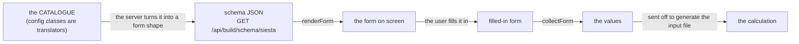

# Form-schema — building the engine-option forms from the config

**Role:** contract
**Domain:** web
**Companions:** [`runtime.md`](?doc=web/runtime.md) — the shared building blocks
(form-schema is one of them, big enough for its own doc);
[`engines/siesta.md`](?doc=engines/siesta.md) +
[`engines/pyscf.md`](?doc=engines/pyscf.md) — the engines whose catalogue
items these forms are drawn from; `web-api.md` — the
`/api/build/schema/*` routes (web wave); [`plans/plan.md`](?doc=plans/plan.md) **W15** —
the pending ES-module conversion.

The long option forms on the Build, Spectra, and Transport tabs — mesh cutoff,
basis size, k-grid, the relaxation stages, and the rest — are **not written by
hand**. They are **generated from the Python config object**. This module,
`form-schema`, is what does the generating: it fetches a form's shape from the
server, draws the form, and reads the filled-in values back.

> **Where this generator stops, and why it matters** (2026-08-07). It answers
> exactly one question: *what settings does this engine have, and how is each one
> drawn?* It does **not** answer *which of those settings the user wants to vary
> across stages* — that is the user's choice, made in the UI and recorded in
> `task.json` (`engines/stages.md § 1.2`).
>
> The two got fused. `stages` was made a field of `SiestaConfig`, so this
> generator walked into it and emitted one table column per field of
> `SiestaStageSpec` — answering the *selection* question with the *catalogue*
> machinery, and thereby fixing in a Python class the set of things a user is
> allowed to vary. That is the whole reason a stage can vary four values today.
>
> **An engine config carries no stage list**, so the generator never meets a
> stage, and no field kind renders one.
> The per-stage grid is the shared Task Setup tab's
> ([`task-setup.md`](?doc=web/task-setup.md) § 5), fed by two inputs
> from two sources: the **catalogue** from here, the **selection** from
> `task.json`. PySCF still has a `stages` field and is a deliberate exception
> until the SIESTA path works.

## 1. The one idea: the CATALOGUE is the source of truth

**Every parameter both engines have is defined in one file** —
`molbuilder/data/catalogue.template.toml`, in the template format
([`engines/template.md`](?doc=engines/template.md) § 4.3). It carries the name,
the type, the default, the bounds, the prose, and the two things that decide
where a control appears. **The form is built from that file.** Add an item to
the catalogue and it shows up in the Build tab automatically — nobody edits any
HTML, and nobody edits Python. Remove it and it is gone. There is no second copy
of the option list to keep in sync.

> ⚠ **This section said the opposite until 2026-08-14** — *"there is a Python
> dataclass for each engine's settings … the form is built from that class."*
> That was the direction [`template.md`](?doc=engines/template.md) § 2.1
> retired: it made the config classes the master, so enriching the parameter
> list meant editing Python, and two engines' parameters could never share one
> file. The classes are **translators** now — they carry a value on its way to
> an engine, and nothing else.

### 1.1 What the form takes from an item, and what it derives

**The presentation does not change.** The CSS, the card layout, the help
disclosure, the engine-key badge — all of it stays exactly as it is. What moves
is where the *data* comes from.

| the schema needs | from the item |
|---|---|
| `name` | the item's own name |
| `label` · `help` · `unit` | the keys of the same name |
| `default` | the item's default **for this kind** (`template.recommended_for`) — a HINT beside a field with no value, never a value |
| `value` · `source` | **the calculation's template**, when the surface is drawn from one (`catalogue_to_form_schema(template=)`): the item's value and where it came from (`engines/template.md` § 6.6 obligation 2). A value nobody chose (`default`) is not carried — that field is blank. With no template, no field has a value. The words a source is said in ride once, as the schema's `source_words` (`template.SOURCE_WORDS`: *from the run you cited* · *you set this* · *not chosen* · *not recorded*), and every surface says them from there |
| `locked` | derived from the kind: an item the RUNG fixes (`role`, `engines/template.md` § 6.4), echoed read-only — `{value, why}`, the rung's answer (`template.role_answers`; on a form for the whole calculation, the answers every rung gives alike, `fixed_on_every_rung`) and the reason (`why_role`). Drawn disabled at its value with the reason beside it, never collected (§ 6.6 obligation 3: shown, never a control). The bias carries no value — each point of the description's list is its own (`template.PER_POINT`) *(2026-09-30, K7)* |
| `choices` | the item's `choices`, **narrowed to what the kind offers** on this engine (`offered`, `template.offered` — [`engines/template.md`](?doc=engines/template.md) § 6.3a, 2026-09-30): a vibration's relaxation shows three relaxers, a PySCF vibration's spin `restricted` alone |
| `min` / `max` | `range` |
| `engine_key` | the item's **`engine_key`** — the full spelling. `expands` is the fallback for a `deck` item whose several keywords are the honest answer, and `anchor` the last resort. *(This said `anchor` first until 2026-08-15, and an anchor is deliberately the bare leading keyword — so the badge read `gto.M` on four different PySCF controls, `mf` on three more, and nothing at all on the eleven whose key is a molbuilder note.)* |
| `workflow_group` | `group` |
| `id` | derived: the container's prefix + the name |
| `kind` (which control) | derived from `type` — `enum`→select, `bool`→checkbox, `int3`/`float3`→a triple, … |
| `step` | derived from `type`: `int` steps by 1, `float` by any |
| `labels` (a triple's x/y/z) | derived from `type` — the k-point mesh's axis names (`kmesh.AXES`) |
| `fixed` (a triple's locked components) | derived from the kind: the components it fixes, `{z: {value: 1, why: "…"}}` (`kmesh.fixed`, [`engines/siesta.md`](?doc=engines/siesta.md) § 6.1) — a transport calculation's third k component, which no rung reads. The triple draws each locked at its value with the reason beside it, and the value still travels, so the template states it *(2026-09-30)* |
| `null_option` | derived: the item is optional |
| `required` | derived from the kind: the item's `required` kinds ([`engines/template.md`](?doc=engines/template.md) § 5) — the control is drawn required, and red while it is empty. The value may still be blank; the refusal is the Send's, beside the field ([`science/pseudopotentials.md`](?doc=science/pseudopotentials.md) § 1) *(2026-09-30)* |
| `tier` · `pattern` · `optional` | **item keys added for this** — § 1.2 |

**One field state, drawn the same way on every surface** *(plan § 5w K7,
2026-09-30)*. A field **holds** a value only where its surface is drawn from
the template and edits it — the transport tab's shared panel: the template's
`value`, named by its source. A surface of **overrides** over the template
(`renderForm`'s `holds: "overrides"` — a transport rung's tab) holds the
rung's own values, and a new calculation's form holds what the person gives
it; both hold nothing until then. Under every field one caption says whose its
value is, and follows each edit: the source, *you set this*, or —

* **blank is not chosen**, for every field, and the caption and the box's own
  hint say what then applies: on a surface of overrides the template's value
  and whose it is; an optional item's own blank (its `null_label`); else the
  kind's `default`, *recommended*. Never the first choice of a list, never a
  zero in a triple, never an unticked box — a checkbox nobody answered is
  drawn **indeterminate**, the box's own blank. A value the person did not
  choose is never presented as if they had.

`collectForm` reads what the form holds, **a blank as `null`**, and every
door that takes a form reads a `null` as not chosen: the template is written
with what then applies and records it as nobody's choice — the kind's
recommendation (`_shared.config_from_params`; on a rung's tab, the template's
own value, since the rung sets nothing), or on transport's shared panel no
value at all for a cited row the person emptied, which `prep` fills with the
documented default ([`engines/transport.md`](?doc=engines/transport.md)
§ 3.8.3). **A value that will not read as its type is
refused, naming its field** — client-side by `collectForm`, whose caption then
says why beside the field, and by the server's door for any other caller; a
fractional count is one, never rounded, and so is a triple holding only some
of its components.

An item's hard limit (`above`) is **not** sent: the form computes no verdict of
its own. The settings gate's refusal is its live check, and lands beside the
field it names ([`engines/template.md`](?doc=engines/template.md) § 5.3).

### 1.2 Three keys the catalogue gained for the form

| key | why the form cannot derive it |
|---|---|
| `optional` | *unset* is a real state and the control must offer it. It is **not** inferable from `null_label`: of **17** optional items only **14** carry one, so three would silently lose their *(auto)* option |
| `tier` | `basic` / `advanced`. A judgement about the parameter, not about the widget — the form dims advanced fields |
| `pattern` | a regex the value must match. Two items have one (`system_label`, `job_name`) and nothing else can express it |

### 1.3 The two grouping axes, and why both survive

They are orthogonal, every item carries both, and the form uses each for a
different job:

| axis | answers | the form uses it for |
|---|---|---|
| **`group`** — the closed vocabulary of [`template.md`](?doc=engines/template.md) § 5 | *when do I set this?* | the **outer card**, in that vocabulary's declared order |
| **`category`** — the six of § 6.2 | *what question about the calculation is this?* | the **legend inside** the card |

*The `group` row named `profile · stage · budget` until 2026-08-15 and had been
wrong since `output` landed. Naming the members in two documents is what made
that possible; § 5 owns them now.*

**`category` replaces `section`** in the inner legend, and that is the whole
visible change: `section` was free text chosen per engine, so SIESTA's *"Basis &
grid"* and PySCF's *"Method"* were unrelated words. The six categories are
shared, so the same card shows the same inner headings for both engines — which
is what [`template.md`](?doc=engines/template.md) § 6.2 exists for.

**The outer cards are load-bearing.** They were introduced 2026-06-13 to fix a
reported bug — the stage selector silently rewrote budget and system fields.
Keeping `group` as the outer axis keeps that fix.

**Folding is the caller's choice, drawn here** *(2026-09-24)*.
`renderForm(container, schema, {foldable, folded})` draws each outer card as
a `
` whose header is its `
`, with the count of settings it
holds, and `folded(role, fields)` says which start closed. The transport tab
folds per rung — a card holding none of the rung's own items starts closed
([`engines/transport.md`](?doc=engines/transport.md) § 3.8.2a); the Build tab
passes nothing and keeps its open cards. The sheet owns the two states and
decides nothing about which cards fold.

This said *"and are not touched"* until 2026-08-15, by which point three had
been added: `output`, `staging` and `setup`. The sentence meant *the mechanism
is not changed*, and that is still true — cards are still chosen by `group`,
still drawn in the renderer's declared order. But read as *the set is closed in
practice* it was simply false, and it is the reason two tables below it went
stale unnoticed. **The vocabulary grows; the axis does not.**

## 1a. The field-metadata vocabulary — every tag, and the rule for adding one

*Written 2026-08-07 (user rule): **every tag this system uses must have a stated
meaning, function and reader in a contract**, so that expanding the data set has
rules rather than precedents.*

**15 keys are carried by the two engine configs** *(measured on every run,
`tests/test_doc_claims.py`)*, and they split into two groups that this table conflated until
2026-08-17 — when it listed fifteen and said *"this is all of them"*, while
seven were in the tree with no entry anywhere. The rule above is what made that
a defect rather than an oversight: a tag with no contract entry is a tag whose
meaning is whatever the last person to add one assumed. *(It said twenty-two
across four configs until 2026-10-02. `SpectraConfig` retired on 2026-08-22
and `TransportConfig` on 2026-10-02, and the dataclass form builder went with
the last of them. Four keys went that day because nothing read them any more:
`section`, `id_suffix` and `step`, which only the builder read; `skip_cli`,
unread since the click bridge's deletion on 2026-09-17; and `optional`, which
the template takes from the field's `Optional[...]` type and the form from
the catalogue — 136 declarations. `help` left the classes the same day: the
catalogue is its one home, read through `template.help_for`.)*

**Group 1 — the form's own tags**, below. They describe *how a field is
presented*, and this document owns them. **The form reads them from the
catalogue** (§ 1). A config class carries copies — the two-homes debt of
[`engines/template.md`](?doc=engines/template.md) § 2.1a — and the table names
what reads the class's copy. `test_every_mirrored_fact_agrees` compares six of
them with the catalogue (`label`, `unit`, `engine_key`, `range`, `choices`,
`workflow_group`); the copies of `tier`, `pattern` and `null_label` are read
only by `template.declaration_for`, which no production code calls, and nothing
compares them — they go when that debt is paid.

**Group 2 — the catalogue's axes**, which happen to ride on the same
`field(metadata=…)` because that is where a config class carries anything.
They describe *what an item is*, they are owned by
[`engines/template.md`](?doc=engines/template.md), and the form reads none of
them:

| key | what it says | owned by |
|---|---|---|
| `category` | which question about the calculation this answers | `template.md` § 6.2 |
| `read_by` | which other layer derives from the value | `template.md` § 6.1 |
| `allocation` | this value belongs to the allocation, so a template may never carry one | `template.md` § 7 |
| `expands` | the engine keywords a `deck` item produces | `template.md` § 5 |
| `item_kind` | the item's `kind` when it is not the default `engine` | `template.md` § 6 |
| `validate` | a per-field checker the validation layer runs | `validation/` |

*(A seventh, `decl_type`, is **read** by `template.declaration_for` — it names
the validation type where a Python annotation cannot, and is checked against
`template.TYPES`. No field carries one today; it is listed so that the next
person to need it finds the entry rather than inventing a second spelling.)*

> **The rule for a new tag, before the table:** a tag earns its place only if
> something **reads** it. A key nothing consumes is a comment wearing metadata's
> clothes — put it in the field's `help` instead. And a tag names *how a field is
> handled*, never *what it means scientifically*; that belongs in `help` and in
> [`engines/tuning.md`](?doc=engines/tuning.md).

| Key | What it says | The form reads the catalogue's | The class's copy is read by |
|---|---|---|---|
| **`label`** | the field's display name | the control's legend; falls back to the item name | the settings gate's messages (`validation/metadata.py`) |
| **`workflow_group`** | which card — one of [`template.md`](?doc=engines/template.md) § 5's closed vocabulary, **not** restated here — and therefore **where a finding about it appears** | `form-schema.js` (card order) | `_shared.py::resolve_workflow_group`, which stamps each finding with its card for `validation-findings.js` to place |
| **`engine_key`** | the deck keyword it becomes (`MeshCutoff`) — **or a parenthesised note when the field is not a deck line at all**, e.g. `mpi_np`'s *"(molbuilder: .run.sh `mpirun -np N` only; not in .fdf)"* | the keyword badge | the settings gate's messages |
| **`tier`** | `basic` / `advanced` — a judgement about the parameter; the form dims an advanced field (§ 1.2) | `form-schema.js` | `template.declaration_for` only |
| **`range`** | `(min, max)`, inclusive — a recommendation, warned and never refused ([`engines/template.md`](?doc=engines/template.md) § 5.3) | the control's bounds | the settings gate; the description check (`validation/task.py`) |
| **`choices`** | the legal values of an enum → a dropdown | the dropdown | the settings gate; the description check; `_shared.py::coerce_to_field_type` |
| **`unit`** | the unit shown beside the control (`Ry`, `eV/Å`). **Display only** — it never converts anything | beside the control | the settings gate's messages |
| **`pattern`** | a regex the value must match | the control's `pattern` | `template.declaration_for` only |
| **`null_label`** | what the *unset* option is called on an optional field — `"(default)"`, `"(auto)"` | the tri-select's blank | `template.declaration_for` only |

> ### ⚠ `section` no longer decides visibility on the two engine forms
>
> **Changed 2026-08-15.** The SIESTA and PySCF forms are built from the
> **catalogue** (§ 1), which has no `section` — an item is on the form because
> the catalogue carries it, and § 7's membership rule makes that *every
> parameter the schema declares*. So for those two classes `section` is read by
> nothing, and a field without one is **not** internal.
>
> That is not a technicality. `section` was an **opt-in**, and fifteen real
> parameters never got one — `write_forces`, `species_order`, `copy_psml`,
> PySCF's `ecp` / `auxbasis` / `diis_space` / `damp` and the rest. They were
> invisible on the form while being perfectly ordinary settings that reach the
> generated file. Building from the catalogue is what surfaced them. *(Two of
> them, `write_forces` and `write_coor_step`, left the form again on
> 2026-09-29 — by declaration, not by omission: the rung fixes both on every
> SIESTA kind, [`template.md`](?doc=engines/template.md) § 6.4.)*
>
> **`section` itself is gone** *(2026-10-02)*. The transport tab moved onto
> the catalogue on 2026-09-24, which left the dataclass form builder no
> caller; it was deleted with `TransportConfig`, and the 90 `section`
> declarations still on the two engine classes went with it.

### The rules a new field must satisfy

1. **Every field must be placeable.**
   * The parameter belongs in
     `data/catalogue.template.toml`, and its item must declare a `group` from
     the closed vocabulary (`template.GROUPS`). An item with no group renders
     loose below the cards and its findings fall to the residual panel instead
     of beside the field. **Guarded:**
     `tests/test_catalogue_agreement.py::test_every_catalogue_item_declares_a_panel`,
     plus `test_the_renderer_knows_every_card_the_form_actually_asks_for` —
     because a card the renderer does not draw looks exactly like no card.
   * The two engine classes still carry `workflow_group` **as well as** the
     catalogue's `group`, and the two must agree: the form reads the
     catalogue's, while finding-placement reads the class's
     (`_shared.resolve_workflow_group`). A disagreement puts a control on one
     card and its warnings on another. **Guarded:**
     `test_every_mirrored_fact_agrees`.
2. **`workflow_group` is a default and a placement, never a restriction.** It
   decides which card a field is drawn in, where its advice lands, and — for
   `stage` — whether its *vary per stage* box starts ticked. It does **not**
   decide what a user may vary: any field can be promoted
   ([`engines/stages.md`](?doc=engines/stages.md) § 1.2–1.3).
3. **The groups may overlap in meaning, and nothing downstream reads them to
   decide anything.** They serve user clarity and finding placement. A field can
   belong to a run's identity *and* be something a user steps.
4. **`engine_key` is always present**, even when the field never reaches the
   deck — the parenthesised form is how a reader learns *that*, rather than
   finding a missing key and guessing.

### What each `workflow_group` means

**The members and their meanings live in
[`template.md`](?doc=engines/template.md) § 5's `group` row, and are not
restated here.** They were, until 2026-08-15 — a three-row table naming
`profile`, `stage` and `budget`. It went stale twice in one day without anyone
noticing: `output` and `staging` were added earlier that day and never reached
it, and `setup` followed the same afternoon. A restated closed vocabulary is a
copy that only *looks* authoritative, and this document has no way to know when
the vocabulary grows.

What belongs here is the part `template.md` does not say — **how a form USES
the axis**, which is § 1.3's table: `group` chooses the outer card, `category`
the legend inside it. Two additional consequences are the form's own and are
stated nowhere else:

- **`stage` seeds the *vary per stage* checkboxes** — those boxes start ticked
  for a `stage` item and clear for everything else.
- **`staging` is not drawn at all.** `catalogue_to_form_schema` filters it,
  because the item is answered by the staging surface rather than by a
  parameter form. It is a real parameter that this page does not ask.

> **Where the cards came from.** They were introduced 2026-06-13 to fix a
> reported bug: the form mixed stage, budget and system fields inside the same
> fieldsets, so **switching the stage preset silently rewrote budget and system
> fields too**. The cards made *"the stage selector touches the stage card
> only"* visible. The per-parameter checkbox
> ([`web/task-setup.md`](?doc=web/task-setup.md)
> § 7.6) removes the preset that caused it, so the grouping now stands on its two
> remaining jobs: reading the form, and placing advice.

---

## 2. The round-trip

```mermaid
flowchart LR
    DC["the CATALOGUE<br/>(config classes are translators)"]
    DC -->|"the server turns it into a form shape"| SCHEMA["schema JSON<br/>GET /api/build/schema/siesta"]
    SCHEMA -->|"renderForm"| FORM["the form on screen"]
    FORM -->|"the user fills it in"| FILLED["filled-in form"]
    FILLED -->|"collectForm"| VALUES["the values"]
    VALUES -->|"sent off to generate the input file"| GEN["the calculation"]
```

- **On the server**, `catalogue_to_form_schema()` walks the CATALOGUE
  (narrowed to the engine, and to the calculation kind when asked) and
  turns each item into a small JSON description — its label, its kind, its
  default, its allowed choices — grouped by category. This is served at `GET /api/build/schema/<engine>` (SIESTA, PySCF —
  `?calculation=vibration` narrows PySCF's to the vibration kind's items;
  the separate `/api/build/schema/spectra` route retired at the spectra
  migration's P3) and `GET /api/transport/schema`, whose two surfaces are
  drawn from the template the tab's describe will write, each field carrying
  its value and source (§ 1.1).
- **In the browser**, this module takes that JSON and draws the matching
  controls, then — when the user submits — reads every control back into a
  plain values object that goes to the generate step.

Because both directions start from the one catalogue, the form a user fills in
and the config the server rebuilds can't drift apart.

## 3. The six calls

Everything is on `window.molbuilder.formSchema` (a plain global — it does not
register with the runtime):

| Call | What it does |
|---|---|
| `fetchSchema(engine, opts)` | Ask the server for a form's shape (`GET /api/build/schema/<engine>?calculation=<kind>`). `opts.calculation` is required: every caller states its kind, and the server refuses a request that states none rather than giving it one (2026-10-06, plan W57 R10). |
| `renderForm(host, schema, opts)` | Draw the form from that shape into a host element. `opts.holds = "overrides"` draws a surface of overrides over the template — its fields blank, the template's value their hint (§ 1.1); `opts.foldable` folds the cards (§ 1.3). |
| `collectForm(host, schema, names?)` | Read what the form holds back into a plain values object (the schema tells it how to read each kind): **every field, a blank as `null`** — not chosen — each value read as its type. A value that will not read is refused: it throws an `Error` naming the field (`err.field`) (§ 1.1). A `locked` field is never read. `names` reads those fields alone. |
| `heldValues(host, schema, kept)` | What the form holds, **for saving**: `collectForm` field by field, a field that will not read keeping its value in `kept` (the previous save) — one half-typed field never costs the rest of the form its save. The Send reads through `collectForm`, which refuses. |
| `setValues(host, schema, values)` | Push a set of values into an already-drawn form (e.g. to restore a saved config). |
| `diffFromDefaults(host, schema)` | Which fields hold a value that is **not** the kind's recommended one, as `[{name, label, current, recommended, unit, help}]`. A blank field is not listed: the recommendation already applies, and resetting a listed one blanks it (§ 1.1). |

### 3.0a What `setValues` guarantees, and the two ways it can fail quietly

Both of these are things a *new field kind* gets wrong by omission, and both
fail without an error — which is why they are written down rather than left to
the reader of the function.

**It fires `input` and `change` on everything it writes.** A programmatic fill
that only sets `.value` looks applied on screen while every dirty-tracker,
live preview and unsaved-marker on the page still believes nothing happened.
The events are how the rest of the page finds out.

**A triple is written through its sub-ids, not its own.** The field's `id`
is on the `` wrapping the three inputs — where a finding about the
field lands (§ 1.1) — and that span has no `.value`. It is handled by its own
loop over `<id>-<label>` (the field's `labels`, else `x`/`y`/`z`), and a
value that is neither a 3-element array nor `null` is skipped rather than
half-applied.

Everything else is written through `.value`, except a checkbox, which is
written through `.checked`. **A `null` blanks a field** — not chosen: an empty
box, a select's blank option, a tri-select's `auto`, an **indeterminate**
checkbox (§ 1.1). A field absent from the values object is left alone — this
is *push these*, not *reset to these*. A `locked` field is never written.

### 3.1 Why the difference is computed here

`diffFromDefaults` needs both halves this module already owns — what the DOM
holds and what the schema says — so a page that compared them itself would need
its own reader for every kind in § 4. It skips a field with **no `default`**:
there is nothing to recommend, so offering to reset it would mean blanking a
value on the user's behalf. It skips a **blank** field too: not chosen, so the
recommendation is already what applies — and resetting a listed field blanks
it, back to not chosen, rather than typing the recommended value in, which the
template would record as the person's (§ 1.1).

Two comparison rules, each earned by a way the naive version misleads:

* **Numbers compare numerically.** A control reads back as text, so a JSON
  comparison alone makes `"300"` differ from `300` and flags a field the moment
  it is focused. A panel that cries wolf is one nobody reads.
* **Composite kinds compare whole.** A k-grid is one decision, not three —
  element-wise it would be reported three times and reset a third at a time.

**The consumer is the recommended-value panel** on the structure-optimization
forms: it lists what differs and resets only what is ticked. One "reset
everything" button cannot tell a deliberate 4×4×1 k-grid from a value that
arrived with an older session, and both live in the same form.

## 4. What each field type becomes

The server tags each field with a *kind* (`_shared.py::_control_for`), and this
module draws the matching control. The eight kinds:

| The item | The control you get |
|---|---|
| `bool` | a checkbox |
| `int` | a whole-number input |
| `float` | a number input |
| `str`, and a list | a text box — a list typed comma-separated, which the server reads back |
| a fixed set of choices | a dropdown — and a choice is read back as **the member itself, with its own type**: `unpaired_electrons`' `2` comes back the number 2 and `free` the word, never the text `"2"` ([`engines/template.md`](?doc=engines/template.md) § 5); its blank reads back `null`, not chosen (§ 1.1) |
| `Optional[bool]` | a three-way select (yes / no / leave default) |
| three integers (e.g. a k-grid) | three linked integer inputs |
| three numbers (e.g. the k-grid's offset) | three linked number inputs — `0.5` survives |

Anything the server doesn't recognize falls back to a plain text box, so an
un-mapped item never disappears.

## 5. A worked example — why the SIESTA form has the fields it has

1. The Build tab, with SIESTA selected, calls
   `formSchema.fetchSchema("siesta", {calculation: "optimization"})`.
2. The server reads the catalogue's SIESTA items
   (`catalogue_to_form_schema`), turns each into a small description (mesh
   cutoff → a number input; the k-grid → three linked inputs), and returns
   them grouped by card and category.
3. `renderForm` draws exactly those controls — so the form shows the SIESTA
   options **because the catalogue declares those items**, not because
   someone wrote a SIESTA form.
4. The user edits, and `collectForm` reads the controls back into a values
   object that is sent to generate the `.fdf`.
5. Later, reopening a saved config calls `setValues` to refill the same form.

## 6. Who uses it

- **Build tab** (structure-optimization) — the full four-call cycle, for SIESTA
  and PySCF.
- **Spectrum tab** — the same four calls, once per engine, against
  `fetchSchema(<engine>, {calculation: "vibration"})` — the Build engines'
  door, narrowed to the kind (no config of its own since P3); both forms stay
  mounted and the engine strip shows one.
- **Transport tab** — uses `renderForm` / `collectForm`, but fetches its shape
  from its own route (`GET /api/transport/schema`) rather than through
  `fetchSchema` (which targets the Build engines).

## 7. Current → target: ES modules

`form-schema.js` is a classic `window.molbuilder.*` script today. Converting it
to an ES module is a planned pass ([`plans/plan.md`](?doc=plans/plan.md) **W15**); this
note is dropped when that lands.
