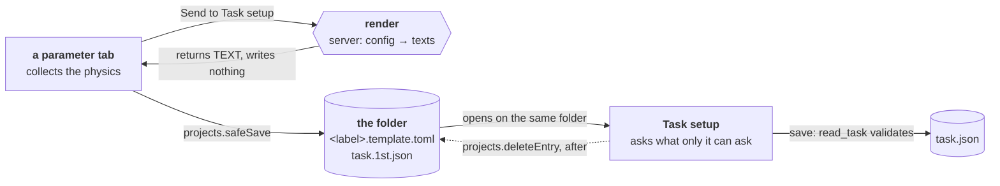

# The hand-over procedure — how a parameter tab reaches a description

**Role:** contract
**Domain:** web

**Companions — where the two disagree those win:**
[`web/tabs.md`](?doc=web/tabs.md) § 1 — the rule that tabs do not hand each
other data in memory, and the four costs that rule buys;
[`web/projects.md`](?doc=web/projects.md) §§ 1, 3 — the content-blind file layer
and the content-aware doors;
[`engines/stages.md`](?doc=engines/stages.md) § 6.5a — the hand-over file;
[`web/task-setup.md`](?doc=web/task-setup.md) — the tab that finishes it;
[`execution/job-contracts.md`](?doc=execution/job-contracts.md) § 6.1 — the
artifact registry.

**This is the general procedure, named once so every generating tab uses the
same one** (user, 2026-08-16). Structure optimization is the worked case;
**Spectrum is next; Transport waits** because a transport calculation is a
multi-component job and needs the extension in § 6 first.

---

## 1. The problem it solves

A parameter tab collects the physics and **produces no artifact**. Something has
to carry that work to a description on disk, and the obvious answer — hand the
next tab the form values in memory — is the one `tabs.md` § 1 forbids, with four
costs stated: a result depending on hidden state, a re-run silently differing,
two people getting different answers, and export losing information.

**So the hand-over goes through disk.** The receiving tab reads a folder like
every other reader, and nothing it shows depends on the sending tab still being
open.

---

## 2. The three steps

**Step 1 — render.** The server turns the collected values into the two texts
and **returns them**. It writes nothing. Only the server can do this: rendering
`<label>.template.toml` means narrowing the catalogue to one engine and filling
in the answers (`template_with_values`), which is Python's.

**Step 2 — write, through the file layer.** The tab writes both texts with
`projects.safeSave(text, filename, {overwrite})` into the folder the user
selected. Never a fetch of its own: the content-blind layer is what *"every tab
can use"* (`projects.md` § 1), and it carries the roots guard, the lock, the
uniform `{ok, …}` envelope and the sidebar re-list.

**Step 3 — finish, in Task setup.** It reads the folder, asks for what the
parameter tab could not know, and on save writes `task.json` — then removes the
hand-over.

---

## 3. The hand-over file

`task.1st.json`, schema **`molbuilder/task-handover@1`**. Three rules, each
doing work (`stages.md` § 6.5a is the contract):

| | |
|---|---|
| **its own schema** | never `molbuilder/task@1`. It has no `shape`, so it would fail that reader — and `check_schema` refuses a wrong artifact **by name**, so nothing can read it as a description by accident |
| **the extension is last** | `task.1st.json`, not `task.json.1st`. Highlighting is by suffix, so the second spelling is plain text in the editor a person reads it in — and nothing looking for `task.json` matches it, which matters because `checkpoint.py::_BUNDLE_DESCRIPTORS` treats that name as the marker that a folder **declares itself a calculation root** |
| **it says what it is** | JSON has no comments, so it opens with a `_what` line and an `awaiting` list naming the keys it lacks. A person reads it, in an editor, and should not need a document open beside it |

**It resolves in one direction.** On a successful save `task.json` exists and the
hand-over is removed, so the next visit finds one description. A folder holding
both is a save that did not finish, and **the description wins** — it is the one
that passed the preflight.

---

## 4. Who may write what

The split is `projects.md`'s, not this document's invention:

| | who | why |
|---|---|---|
| the template, the hand-over | **the browser**, via `safeSave` | raw bytes — the content-blind layer |
| removing the hand-over | **the browser**, via `deleteEntry` | likewise, and **only after** the write succeeded: the reverse order loses the parameters if the write fails |
| `task.json` | **the server**, via `/api/task-setup/save` | a **content-aware door**, for the reason § 3 of `projects.md` gives about the sidecar: *"a browser-written sidecar had no schema stamp, so the load door rejected it — a save-then-reload trap"*. A description is validated through `task.read_task`, the same door `prep` uses, so the browser cannot become a second drifting writer |

---

## 5. What the receiving tab must do

**Three states, and the third is a refusal:**

| the folder holds | it means |
|---|---|
| a `task.json` | an existing calculation — load and edit it |
| no `task.json`, a `task.1st.json` | **a hand-over** — say what is still needed, and show it |
| neither | nothing described yet |

**Ask only what the sender could not know.** For a ladder that is `shape` —
required with no default, because inferring it *"would hand somebody a directory
tree they never asked for"* (`stages.md` § 6.7) — and the stages.

**Show what will be written, not what arrived.** Once the missing answers are
given, the editor shows the **proposed `task.json`**, not the hand-over file. A
person checking a description before a week of compute should be reading the
thing that lands.

**Refuse rather than repair.** A description that does not parse, names a field
the schema does not know, or carries no stage is refused in the reader's own
words.

---

## 6. Extending it — Spectrum next, Transport after

**Nothing in §§ 1–5 is specific to a relaxation.** The sender is *whatever tab
collected parameters*; the hand-over carries the engine, the structure and the
name; the receiver asks for what is missing.

**Spectrum** is the same shape: one engine, one parameter set, a description
with stages. It needs its rows in the catalogue read by
`catalogue_to_form_schema` — which they already are — and a Send button wired to
the same endpoint with `engine: "pyscf"`. **No change to this procedure.**

**Transport is not, and that is why it waits.** It is a **multi-component job**
— *"it involves multiple results and the transportation needs to combine all of
them… a different kind of beast"* (user, decision 37,
[`execution/generator.md`](?doc=execution/generator.md) § 9), and one region-
labelled device becomes **three coupled SIESTA runs**
([`engines/transport.md`](?doc=engines/transport.md)).

Two things this procedure does not yet express, and both must be designed
before Transport uses it:

1. **A hand-over carrying several components**, not one engine + one structure.
   `awaiting` names missing *keys*; a transport hand-over is missing a
   *structure* — which of the three runs a value belongs to.
2. **A description whose members are coupled.** `generator.md` § 9 keeps
   transport out of `ParameterSet` deliberately: it is neither a sweep nor a
   ladder, and this procedure currently produces exactly those two.

**Do not stretch `task-handover@1` to cover it.** A second schema
(`transport-handover@1`) that this procedure's three steps carry is the shape to
reach for — the steps generalise, the payload does not.

---

## 7. How it is verified

End to end, in `tests/test_task_setup_tab.py`:

* the render endpoint returns both texts and **leaves the folder untouched**;
* neither surface calls `/api/files/write` directly;
* the hand-over declares its own schema, lacks `shape`/`stages`, and says what
  it is;
* save writes `task.json`, reports the hand-over rather than deleting it, and
  refuses bad JSON, a missing stage list, and a destination outside the roots.

**A tab is on this procedure when those hold for it.** That is the bar Spectrum
has to clear, and the reason to clear it before Transport is designed against it.
