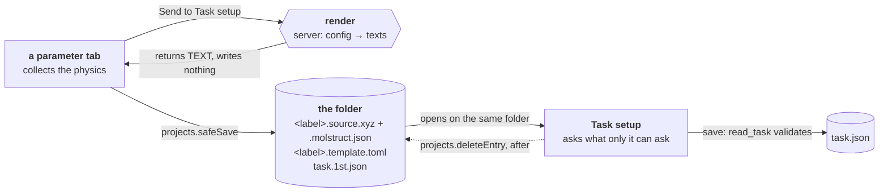

# The hand-over procedure — how a parameter tab reaches a description

**Role:** contract
**Domain:** web

**Companions — where the two disagree those win:**
[`web/tabs.md`](?doc=web/tabs.md) § 1 — the rule that tabs do not hand each
other data in memory, and the four costs that rule buys;
[`web/projects.md`](?doc=web/projects.md) §§ 1, 3 — the content-blind file layer
and the content-aware doors;
[`engines/stages.md`](?doc=engines/stages.md) § 6.5a — the hand-over file;
[`web/task-setup.md`](?doc=web/task-setup.md) — the tab that finishes it;
[`execution/job-contracts.md`](?doc=execution/job-contracts.md) § 6.1 — the
artifact registry.

**This is the general procedure, named once so every generating tab uses the
same one** (user, 2026-08-16). Structure optimization is the worked case.
**Spectrum sends since 2026-08-20** — the § 6 prerequisites landed with the
spectra migration's P0–P2
([`archive/2026-08-20-spectra-migration-plan.md`](?doc=archive/2026-08-20-spectra-migration-plan.md)).
**Transport never joined, by design** (resolved 2026-08-29): the composite
leaves no question open for Task setup to answer, so its tab describes
directly — no hand-over exists for it (see the closing section).

---

## 1. The problem it solves

A parameter tab collects the physics and **produces no artifact**. Something has
to carry that work to a description on disk, and the obvious answer — hand the
next tab the form values in memory — is the one `tabs.md` § 1 forbids, with four
costs stated: a result depending on hidden state, a re-run silently differing,
two people getting different answers, and export losing information.

**So the hand-over goes through disk.** The receiving tab reads a folder like
every other reader, and nothing it shows depends on the sending tab still being
open.

---

## 2. The three steps

**Step 1 — render.** The server turns the collected values into the texts and
**returns them**. It writes nothing. Two of them can only be made here:
rendering `<label>.template.toml` means narrowing the catalogue to one engine
and filling in the answers (`template_with_values`); and the structure's own
pair comes from `StructureCodec`, because
[`molview.md § 11.7`](?doc=web/molview.md) says **the server writes every
file** — a browser-authored pair drifts from the server's, and one shipped
without the sidecar's `schema_version`, after which the load door refused it
and every label in it was dropped silently.

**The stem is the caller's, the suffixes are the codec's.** The calculation's
label names the pair; which extension follows from the format, and what the
sidecar beside it is called, is the pairing rule's — one home
(`model/structure.md` § 2.4). A caller building either keeps a second copy of a
rule it does not own.

**Step 2 — write, through the file layer.** The tab writes every returned text
with `projects.safeSave(text, filename, {overwrite})` into the folder the user
selected — **the structure first**, because the hand-over *names* it and a
hand-over pointing at a file that was never written is worse than no hand-over. Never a fetch of its own: the content-blind layer is what *"every tab
can use"* (`projects.md` § 1), and it carries the roots guard, the lock, the
uniform `{ok, …}` envelope and the sidebar re-list.

**Step 3 — finish, in Task setup.** It reads the folder, asks for what the
parameter tab could not know, and on save writes `task.json` — then removes the
hand-over.

### 2.1 The cell gate — the rule this procedure owns *(workflow.md § 9 gate ②)*

**Step 1's render runs the periodicity gate on the exported envelope, and its
verdicts split two ways.** A box the calculation cannot use — a degenerate
cell, left-handed axes — is a **refusal**: the door answers 400 and nothing is
written. A box the gate accepted but wants read — an axis it could not tell
was periodic, vacuum thinner than it expects — comes back as **notices**
(the gate's four-key dicts: `level`, `message`, `where`, `about` —
`periodicity_gate.py`), and a notice holds back the **navigation, never the
write**: the files are the person's own parameters and refusing to save them
helps nobody, but a page that jumps away is a page whose warning was never
read. The sender (`lib/task-handover.js`) shows every notice, keyed on the
gate's own `level`, and stays on the page. *(A tab does not decide for its
user — `tabs.md`.)*

---

## 3. The hand-over file

`task.1st.json`, schema **`molbuilder/task-handover@1`**. Three rules, each
doing work (`stages.md` § 6.5a is the contract):

| | |
|---|---|
| **its own schema** | never `molbuilder/task@1`. It has no `shape`, so it would fail that reader — and `check_schema` refuses a wrong artifact **by name**, so nothing can read it as a description by accident |
| **the extension is last** | `task.1st.json`, not `task.json.1st`. Highlighting is by suffix, so the second spelling is plain text in the editor a person reads it in — and nothing looking for `task.json` matches it, which matters because `checkpoint.py::_BUNDLE_DESCRIPTORS` treats that name as the marker that a folder **declares itself a calculation root** |
| **it says what it is** | JSON has no comments, so it opens with a `_what` line and an `awaiting` list naming the keys it lacks. A person reads it, in an editor, and should not need a document open beside it |

**It names the structure, it does not summarise it.** `structure.source` is a
**folder-relative** name — the `.xyz` beside it — plus `formula` and `atoms` as
conveniences. Those three are `task.json`'s own `_STRUCTURE_KEYS`, so the
hand-over and the description say the same thing in the same words.

> **This is where the hole was.** `source` used to hold the projects sidebar's
> *selected file*, which is a second fact read at a second moment —
> [`molview.md § 9.3a`](?doc=web/molview.md): *the facts that leave together
> were read together*. In a real folder the cursor sat on the calculation's own
> `.template.toml`, so the hand-over said a calculation was OF its own
> parameter file. Nothing in the sender may consult the sidebar for this: the
> structure is in the request body, and the names come from what was written.

**The sidecar is not named here.** It is found from the `.xyz` by the pairing
rule, which has one home (`model/structure.md` § 2.4). Naming it would be a
second copy of a rule this document does not own.

**It resolves in one direction.** On a successful save `task.json` exists and the
hand-over is removed, so the next visit finds one description. A folder holding
both is a save that did not finish, and **the description wins** — it is the one
that passed the preflight.

---

## 4. Who may write what

The split is `projects.md`'s, not this document's invention:

| | who | why |
|---|---|---|
| the structure's pair, the template, the hand-over | **the browser**, via `safeSave` | raw bytes — the content-blind layer. The browser is a **courier**: every byte was generated on the server, and it composes neither a name nor a document |
| removing the hand-over | **the browser**, via `deleteEntry` | likewise, and **only after** the write succeeded: the reverse order loses the parameters if the write fails |
| `task.json` | **the server**, via `/api/task-setup/save` | a **content-aware door**, for the reason § 3 of `projects.md` gives about the sidecar: *"a browser-written sidecar had no schema stamp, so the load door rejected it — a save-then-reload trap"*. A description is validated through `task.read_task`, the same door `prep` uses, so the browser cannot become a second drifting writer |

---

## 5. What the receiving tab must do

**Three states, and the third is a refusal:**

| the folder holds | it means |
|---|---|
| a `task.json` | an existing calculation — load and edit it |
| no `task.json`, a `task.1st.json` | **a hand-over** — say what is still needed, and show it |
| neither | nothing described yet |

**Ask only what the sender could not know.** For a ladder that is `shape` —
required with no default, because inferring it *"would hand somebody a directory
tree they never asked for"* (`stages.md` § 6.7) — and the stages.

**Show what will be written, not what arrived.** Once the missing answers are
given, the editor shows the **proposed `task.json`**, not the hand-over file. A
person checking a description before a week of compute should be reading the
thing that lands.

**Refuse rather than repair.** A description that does not parse, names a field
the schema does not know, or carries no stage is refused in the reader's own
words.

---

## 6. Extending it — the Spectrum case (landed 2026-08-20), Transport after

**Nothing in §§ 1–5 is specific to a relaxation.** The sender is *whatever tab
collected parameters*; the hand-over carries the engine, the structure and the
name; the receiver asks for what is missing.

> ⚠ **This section claimed on 2026-08-16 that Spectrum's "rows in the catalogue
> are already read by `catalogue_to_form_schema`". That is false**, and it was
> written without checking. `spectra.py:161` calls
> `dataclass_to_form_schema(SpectraConfig, "s")`; the catalogue declares
> `engines = ["siesta", "pyscf"]` and carries **zero** spectra items. The
> correction is recorded rather than quietly edited because the claim would
> have made the next piece of work look like wiring a button.

The three prerequisites named here landed with the spectra migration
([`archive/2026-08-20-spectra-migration-plan.md`](?doc=archive/2026-08-20-spectra-migration-plan.md)):

1. **Its parameters are in the catalogue** (P0) — fourteen items carrying
   `calculations = ["vibration"]` beside the shared PySCF set
   ([`engines/template.md`](?doc=engines/template.md) § 6.3: the key is
   `engines`' exact sibling; absent = every kind).
2. **Its form is off the catalogue** (P2) — the tab renders
   `GET /api/build/schema/pyscf?calculation=vibration` through the same
   shared renderer as Build, and `dataclass_to_form_schema`'s spectra route
   retires at P3.
3. **The decision was made** — a vibration calculation IS a description with
   a ladder: one `freq` stage ([`engines/stages.md`](?doc=engines/stages.md)
   § 6.8), with relaxation an in-deck precondition rather than a stage.

**And the hand-over is now exactly what this section predicted**: a Send
button on the same endpoint. One extension rode along — the body may carry
`calculation`, and the hand-over file records it **only when it is not
`optimization`** (absent IS the default state, § 2's economy). The sender
itself moved into `lib/task-handover.js` when the second tab arrived: the
guards, the write order and the notice handling are this procedure's contract,
and two copies of a contract drift.

**Transport does not use this procedure — resolved 2026-08-29, and not the
way this section once predicted.**  A hand-over exists because Task setup
owns questions the sending tab leaves open (shape, stages, what varies).
The composite leaves NONE open: the five stages and the hierarchical shape
are fixed by design, the electronic contract arrives from the cited
attempt's own deck at prep, and the knobs ride the stages' override bags.
So the Transport tab describes DIRECTLY — `POST /api/transport/describe`
answers with the finished `task.json`, the browser writes it where the
user chose, and **nothing is awaiting** ([`archive/2026-09-01-transport-design.md`](?doc=archive/2026-09-01-transport-design.md)
P7b).  The `transport-handover@1` schema this section once proposed was
never needed: with no open questions there is no hand-over payload to
carry.  Task setup remains the run surface that READS the description —
machine, queue, prep — like any other.

---

## 7. How it is verified

> ⚠ **This section asserted a verification it did not perform, from 2026-08-16
> until 2026-08-17.** It listed four checks and concluded *"A tab is on this
> procedure when those hold for it"* — and not one of them opened the structure
> the hand-over names. The procedure was called proven end to end, and Spectrum
> was told to clear this bar, while the hand-over carried a **formula and an
> atom count** in place of the structure: the geometry crossed the wire from
> `exportFile()` and was discarded, and `structure.source` recorded the
> projects sidebar's *selected file* — which in a real folder pointed at the
> calculation's own `.template.toml`.
>
> A 444-atom Au(111) slab handed over its k-grid and lost the lattice that
> k-grid indexes. The correction is recorded rather than quietly edited because
> **the false assurance was worse than the defect**: § 1 of this document
> already says *"nothing it shows depends on the sending tab still being
> open"*, and that sentence was the test nobody wrote.

**The bar is a round trip, not a shape check.** A check that reads what was
written proves the hand-over carried something; only opening it proves *what*.

End to end, in `tests/test_task_setup_tab.py`:

| what it asks | how it fails |
|---|---|
| **open what `structure.source` names** and count its atoms | the reference points at nothing, or at a different structure |
| **the cell survived** — read the geometry back through `StructureCodec` and compare the lattice | a periodic calculation silently becomes a molecule in a box it never had |
| **the labels survived** — regions and frozen atoms, through the same read | region labels are how a device knows its electrodes; losing them is silent |
| **the sidecar carries its `schema_version`** | the load door refuses the pair on the next open and drops every label — this has happened, in this codebase |
| the render endpoint returns the texts and **leaves the folder untouched** | a render that writes is not a render |
| neither surface calls `/api/files/write` directly | a second writer, and `projects.md` § 1's guard is bypassed |
| the hand-over declares its own schema, lacks `shape`/`stages`, and says what it is | it could be read as a description |
| save writes `task.json`, reports the hand-over rather than deleting it, and refuses bad JSON, a missing stage list, and a destination outside the roots | the browser becomes a second, drifting writer |

**And the whole chain runs, in a test and not in somebody's memory of driving
it** — `test_the_whole_chain_from_structure_to_rendered_deck`. Hand-over →
description → `prep` → the rendered deck, comparing the deck's own `%block
LatticeVectors` and its atom rows against the structure that started the chain.

That is the check the four could not add up to: **every link can hold while the
thing being carried is lost between them.** Removing the cell from what the
hand-over writes leaves every step returning `ok` and puts a *bounding box*
— `[[8.885,0,0],[0,6,0],[0,0,10.755]]` — in the deck where the hexagonal
lattice belongs, which is a different calculation that never announces itself.

> This paragraph first claimed the chain was verified when it had only been
> driven by hand in a browser — the same false assurance as the retraction
> above, written the same day, one section apart. The test exists now.

**A tab is on this procedure when those hold for it.** That is the bar Spectrum
has to clear, and the reason to clear it before Transport is designed against it.
