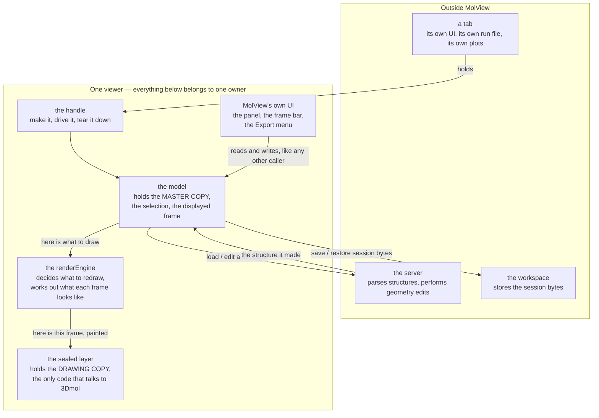
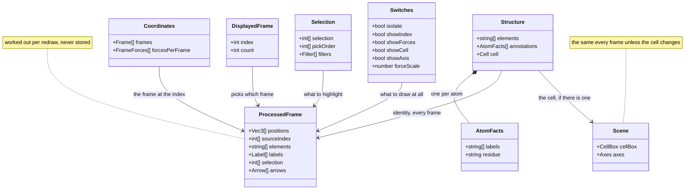
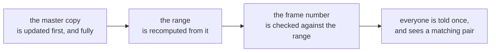
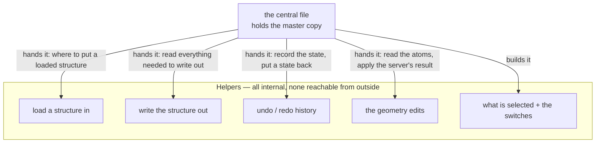
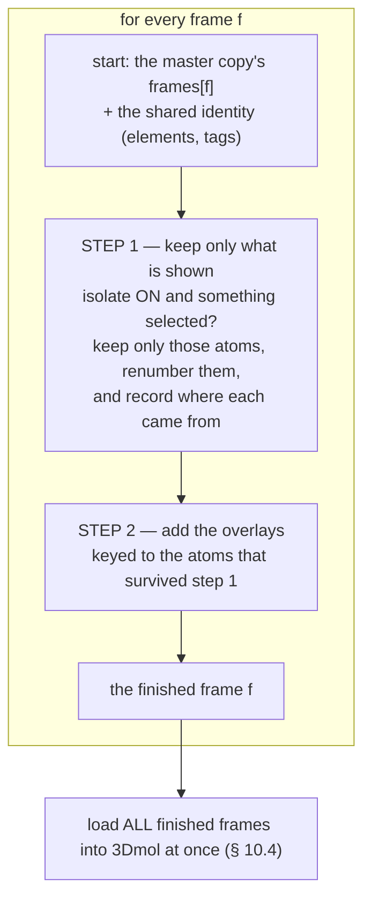
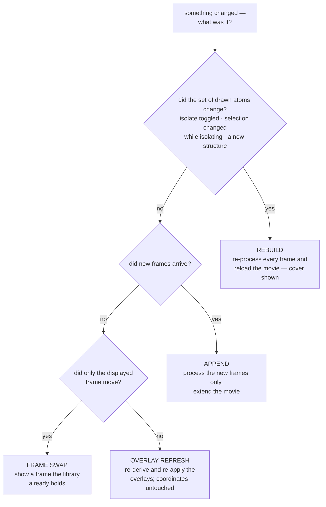
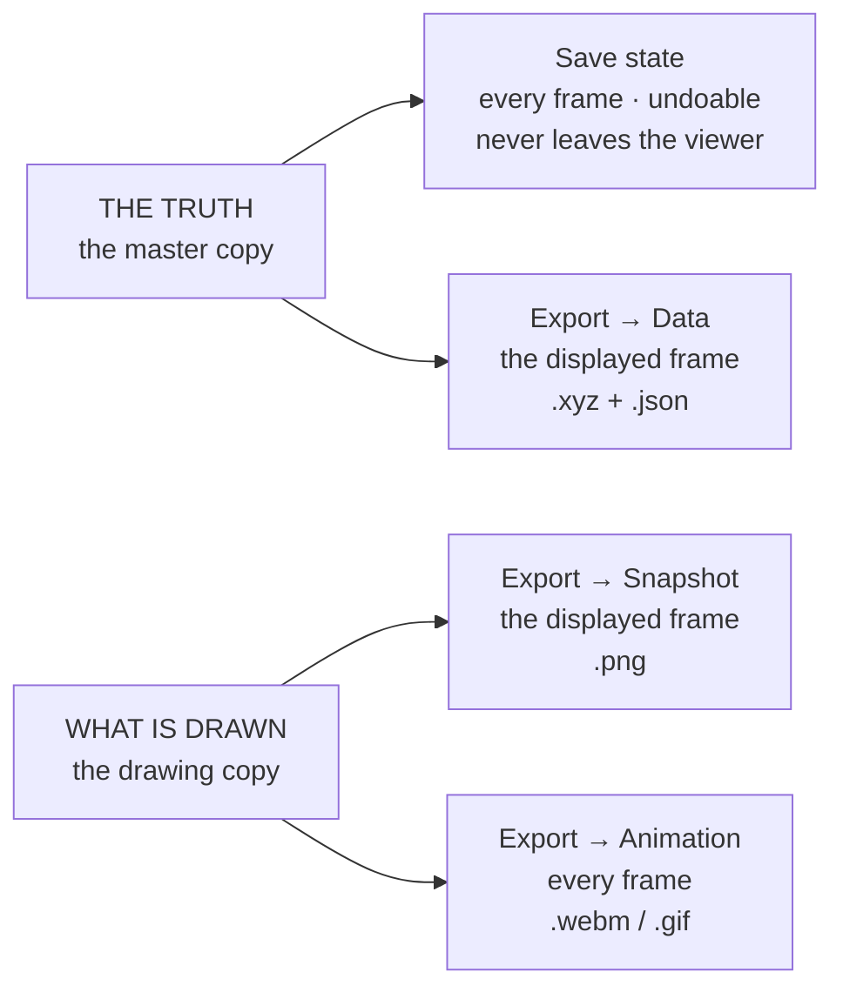

# MolView — the 3D structure viewer

**Role:** contract
**Domain:** web
**Companions:** [`overview.md`](?doc=web/overview.md) (the web start-here map);
[`workspace.md`](?doc=web/workspace.md) (where a saved session's bytes are kept);
[`projects.md`](?doc=web/projects.md) (the file browser that hands structures to
MolView); [`web-api.md`](?doc=web/web-api.md) (the server routes MolView calls);
[`model/structure.md`](?doc=model/structure.md) +
[`model/structure-annotations.md`](?doc=model/structure-annotations.md) (the
structure and the labels MolView carries);
[`model/structure-molstruct.md`](?doc=model/structure-molstruct.md) (the
`.molstruct.json` sidecar it reads and writes). How a user *builds* a structure —
the Modify tab's source panels and its save dialog — belongs to
[`tabs.md`](?doc=web/tabs.md), not here.

MolView is the one 3D molecular viewer used everywhere in the browser. The Modify
tab edits a structure in it; the Results, Spectra and Transport tabs show one in
it without letting you edit. Within Results, the view that opens depends on the
file you picked — a trajectory file opens a view that plays the optimization and
draws its energy and force plots alongside. Every one of them embeds the same
component with the same controls.

**This document is the design of that component** — what it is for, what it
refuses to do, what it holds, how it is layered, what each API is for, how the
pieces fit together, and how its tests are derived. It is not a tour of the
current code.

> **Words used in this document.** A few terms come up constantly. Each is
> defined here in plain terms and used consistently below.
>
> - **A viewer** — one mounted MolView: one 3D window, its panel, its controls,
>   and everything it holds. Two viewers on a page are two of these.
> - **The handle** — the object you get back when you make a viewer. Think of it
>   as the viewer itself; it is the only thing a tab holds.
> - **The model** — the part of a viewer that holds the structure and answers
>   questions about it. Everything that changes the structure goes through it.
> - **The master copy** and **the drawing copy** — the structure exists in two
>   forms, on purpose: the master copy is the real one (every atom, every frame),
>   the drawing copy is what the 3D library was handed to paint. § 6.3.
> - **A frame** — one set of atom positions. A trajectory is many frames of the
>   same molecule; a plain structure is one frame.
> - **Isolate** — the "show selected atoms only" switch.
> - **The renderEngine** — the part that decides what to redraw and works out
>   what each frame should look like. *Not* a calculation engine: SIESTA and
>   PySCF are engines in a completely different sense, and this document never
>   means that one.
> - **The sealed layer** — the one place in this module allowed to talk to
>   3Dmol.js, the third-party library that does the actual drawing. Nothing above
>   it knows that library exists.
> - **The panel** — the strip beside the 3D window: where you select atoms, tag
>   them, and see the unit cell. It belongs to the viewer, not to the tab.
> - **The sidecar** — the small companion file that travels beside a structure
>   file and carries what coordinates cannot: the labels, the cell, what the user
>   said about the atoms. Written as `.molstruct.json`.
>
> Atom numbering: **0-based in code, 1-based on screen**, translated in exactly
> one place (§ 11.5).

---

## 1. The goal

**One 3D molecular viewer, learned once, used everywhere.**

Every place in the app that shows a molecule embeds the same component with the
same controls. A user who learns to select, isolate, measure and scrub in the
Modify tab can do all of it in the Results tab without learning anything new. A
developer who needs a viewer does not build one.

### 1.1 What that looks like in use

This is the behaviour the rest of the document exists to protect. It is the same
in every tab.

**Moving around.** Drag to rotate, scroll to zoom, right-drag (or shift-drag) to
pan. `⟲` re-centres and re-fits the camera. The View menu offers **Perspective**
(natural depth, the default) or **Orthographic** — pick orthographic when you are
eyeballing bond lengths, because it removes the foreshortening that makes distant
atoms look closer together.

**Appearance.** The View menu holds style (stick, ball & stick, sphere, line), a
radius slider from 0.2 to 2.5 that scales stick thickness / sphere size / line
width, and a background colour with preset swatches plus a picker. One preset is
transparent — choose it before exporting a picture to drop onto a slide.

**The toolbar switches.** Six icon buttons sit down the left edge, always
outside the canvas, never on top of the molecule:

| Button | What it does |
|---|---|
| `⟲` Reset view | re-fit the camera |
| `✚` Show axes | draw the x/y/z axis widget |
| `#` Show atom labels | label every atom with its number |
| `➤` Show force vectors | draw the per-atom force arrows |
| `▦` Show unit cell | draw the periodic cell box |
| `◉` Show selected only | **isolate** — hide every unselected atom |

Isolate turns itself off when the selection becomes empty, since there would be
nothing left to show.

**Selecting.** Click an atom and a soft amber sphere appears over it. The atom
keeps its own element colour and the geometry is not rebuilt, so selecting is
instant even on a large system and the highlight follows the atom as a
trajectory plays. Click again to deselect; selections accumulate. Clicking is
off while isolate is on — with everything else hidden there is no unambiguous
atom to pick — so turn isolate off to select again.

The panel beside the viewer is the other way to select. **Click** mode picks by
hand; **Filter** mode selects everything matching a rule — by element (`Au,C`),
by atom index (`1-4, 6, 10-11`), by residue (`ALA,DA`), or by label
(`L-electrode`). Add several rows and combine them with AND / OR. Switching
between Click and Filter does not disturb what you already have selected. The
panel shows a live count and measurement of the current selection.

**Measuring.** Measurements come from what you selected, in the order you picked
it:

- one atom → its coordinates, `Au #3 — (0.000, 0.000, 0.000) Å`
- two atoms → the distance, `|H #5 – O #1| = 0.957 Å`
- three atoms → the angle, with the **middle-picked** atom as the vertex,
  `∠H #5 – O #1 – H #6 = 104.5°`

**Tagging atoms.** In an editable view the panel tags the selected atoms with a
label — L-electrode, R-electrode, bridge, interface, frozen atoms, or a name you
type. Tags show as chips you can remove. These are not decoration: they are
written into the structure's sidecar file and into the generated input script, so
the calculation and the results view both see what was set here.

Some of those names are **reserved** — they are ordinary labels, but something
downstream knows what they mean. Tagging atoms *frozen atoms* is how you say
"hold these still", and the calculation is generated with those atoms
constrained. You do not tick a separate box; the label is the mechanism (§ 6.6).

**Playing a trajectory.** When a structure has more than one frame, a playback
bar appears under the viewer: `‹` / `›` step, `▶`/`❙❙` play-pause, `⟳` loop, a
speed box in milliseconds per frame (20–3000, default 150), and a slider with an
`i / N` counter. One frame shows no bar. As it plays, the force arrows animate
with the frames — the largest force is drawn gold, the rest shade dim-red to
orange-red by relative size, so converging forces visibly shrink.

**Keeping a point to come back to.** In an editable view you can save the current
state — the structure as it stands, with the atoms you have picked out — and step
back to it later, even after a reload. It is undo that survives closing the page.
Saving is something you do: nothing is recorded on its own, and a small badge in
the corner says when there is work that is not on the sequence yet. This is not a
file and nothing appears in your project (§ 11.2, § 11.3).

**Getting things out.** The Export menu offers three things, each with a *Save*
(into the project) and a *Download* row:

- **Data** — the current frame's coordinates as `.xyz`, plus the metadata that
  goes with them as `.json`.
- **Snapshot** — a `.png` of the molecule exactly as it is drawn right now,
  transparent if you chose that background.
- **Animation** — the whole trajectory as `.webm` or `.gif`, rendered frame by
  frame with the view you have set. It appears only when there is more than one
  frame.

Two things are worth knowing about that menu, both in § 11.3: **Data** comes from
the structure while **Snapshot** and **Animation** come from what is on screen —
and *Save* versus *Download* is only a choice of destination, since MolView
produces bytes and never writes a file itself. Who the menu belongs to is § 11.4,
which also records the one thing here the code has not caught up with: today's
Data rows write the coordinates and leave the `.json` behind.

**The unit cell.** When a structure is periodic, the panel shows its cell too, and
in an editable view it can be changed there. A cell edit goes through one door and
only one (§ 9.3), so everything drawn from it — the box, the axes — cannot end up
describing a different cell from the one the structure has.

---

## 2. What MolView is not

Three jobs a viewer could plausibly grow into, and does not. Each boundary is
here for a reason, and each has been crossed at some point by something that
seemed convenient at the time.

A boundary earns a row here only if a viewer would plausibly drift across it.
Jobs that simply belong to other modules are not listed — naming them would keep
them present in a document they have no business being in.

| Not | Whose job it is | Why the boundary is there |
|---|---|---|
| a structure **parser** | the server | one parser, one set of chemistry rules. A parser in the browser would be a second, weaker opinion about what a file means, and the two would disagree on the awkward cases |
| a **file manager** | the projects module | MolView produces and consumes bytes. Where those bytes live on disk is not a viewing concern, and MolView holds no file route |
| a place to **keep** a saved session | the workspace module | MolView decides *when* to save and *how far* to step back; the workspace only knows *where the bytes go* (§ 11.2) |

---

## 3. The overall shape

One picture, then the rest of the document fills it in.



Four things to read off it:

**Data flows down.** The model hands the renderEngine what to draw; the
renderEngine hands the sealed layer a finished frame. Nothing lower ever answers
a question about what the structure *is*. If you want to know where an atom is,
you ask the model — never the drawing. (One narrow thing does travel back up: the
renderEngine asking the drawing whether its own last instruction landed. That
answer goes no further — § 10.10.)

**A tab owns none of it.** A tab has a handle. It does not have the structure,
the renderer, the camera, or a way to reach 3Dmol. What it does own is its own
business: its plots, its parsed run file, its own layout.

**MolView brings its own controls.** The panel, the frame bar and the Export menu
are the viewer's, not the tab's — which is why the same controls appear in every
tab (§ 1.1) and why a tab that wants a viewer builds no UI (§ 11.4). They are
callers of the model like anything else; none of them reaches further down.

**Everything inside the box belongs to one owner.** Mount twice and you get two
of these, sharing nothing — two structures, two selections, two displayed
frames, two cameras. § 5.6.

---

## 4. MolView is a self-contained module

This is worth stating on its own, because everything else depends on it.

**MolView is one ES module, sealed at every edge.** It is imported by name, it
reaches nothing else in the app by name, and nothing in the app can reach inside
it.

**One entry point, and nothing else is importable.**

```js
import { mount, formula } from "/static/lib/molview/index.js";
```

That is the whole surface. `mount` makes a viewer; `formula` turns a list of
elements into a Hill formula and needs no viewer. Every other file in the module
is internal — the model, the stores, the renderEngine, the panel, the sealed
layer. A consumer that imports any of them directly has broken the module, not
found a shortcut.

**Nothing it needs comes from a global.** A viewer needs two things at mount: an
element to live in, and a workspace to save through. Both are handed in. It does
not look up the tab it is inside, does not read app configuration, and does not
consult any other module by name.

**Nothing leaks out.** No 3Dmol object, no store, no DOM node, and no internal
function ever appears on the handle. Within this module the name `3Dmol` occurs
in exactly one file — the sealed layer — which is also the only place that fails
with a clear error if the library is missing. Swapping the drawing library
touches that one file and reaches no consumer of MolView.

**It contains its own state.** The structure, the selection, the switches, the
displayed frame and the undo history all live inside the viewer. It keeps
nothing in a global, and nothing outside it keeps a copy of anything it holds.

**The test of all of this:** delete every other web module and MolView still
loads, mounts, draws, selects, measures and exports. The only things it would
miss are the server routes it calls and the workspace it saves through — and
both of those are reached through named routes and an injected accessor, not by
importing anything.

> **Transition.** The module currently also publishes some
> `window.molbuilder.molview.*` values. They are live seams — node-test entry
> points and readiness signals used by the browser tests (§ 13.4) — plus one
> shared model left from before viewers were owned (§ 9.2). None of them are part
> of this contract, and retiring them is [`roadmap.md`](?doc=roadmap.md)'s
> business.

---

## 5. The ideas everything else follows from

Six of them. They are the reason every rule below exists, and a design choice
that breaks one is wrong no matter how convenient it is.

### 5.1 What you see is what you save

The structure on screen and the structure that goes to a calculation are the same
structure, at the same frame. Scroll to frame 40, export it, and frame 40 is what
the file holds (§ 11.3).

"Which frame am I looking at" and "which frame am I working on" must not be able
to have different answers — which is why there is exactly one number saying which
frame is displayed, held in one place and read by everyone (§ 6.4).

### 5.2 One place holds each fact

Every fact — the atoms, the cell, the selection, which frame — has one home. Two
copies of a fact are two things that must be kept in step, and every mechanism
for keeping them in step is a place they can fall out of step.

Where two forms genuinely must coexist — the real structure and the filtered
thing the graphics library draws (§ 6.3) — one of them is unambiguously the real
one, the other cannot be reached as an answer to anything, and a single number
joins them.

### 5.3 The graphics library is invisible

Nothing above the sealed layer knows the viewer is 3Dmol — not a tab, not a
panel, not the renderEngine. This makes "the same viewer everywhere" a property
of the code rather than a convention people have to remember.

### 5.4 A host needs to know nothing

Hand MolView somewhere to live and a workspace, and get back a viewer. No
knowledge of rendering, of how structures are parsed, or of how sessions persist.
The handle is deliberately small (§ 9.2) so that embedding a viewer is never a
project.

### 5.5 The user's intent is data, and it travels

What a user does in the viewer is not decoration, and each kind of intent has its
own way of surviving the trip out:

- **the labels they attach** go into the structure's sidecar and into the
  generated input script, so the calculation and the results view both see them
  (§ 6.6);
- **the atoms they picked out** decide what an edit acts on, and come back with a
  restored session (§ 11.2);
- **the frame they stopped on** is the frame an export writes (§ 5.1, § 11.3).

Three different journeys, and they are worth keeping apart — collapsing them into
"the user's state gets saved" is how a document comes to promise that the frame
you were looking at is stored somewhere, which it is not (§ 11.2). The viewer is
where scientific intent gets expressed, so none of it may be silently lost between
here and the calculation.

### 5.6 A viewer is owned

**Every mounted viewer is its own MolView, and it belongs to its owner.** Two
viewers on one page are two structures, two selections, two displayed frames,
two cameras — not one set of facts they fight over. The `owner` given at mount is
what makes that true, and it names *everything* the viewer holds.

This is what makes § 5.2 mean anything: "one place holds each fact" is only a
real rule once *which viewer's* fact you mean is unambiguous. A single structure
shared behind two viewers is not one home for a fact — it is one home for two
facts that happen to collide.

It follows that **the handle is the way in**. A tab holds a handle, a handle *is*
a particular viewer, and there is no global to look one up in — so a tab cannot
reach the wrong viewer by accident.

---

## 6. The data a viewer holds

A viewer holds **one structure**. If it came from a trajectory, it holds **many
frames** of that same structure and **one number** saying which frame you mean.
It holds **what is selected** and **which switches are on**. Everything else you
see — the drawn atoms, the arrows, the highlight — is worked out fresh on each
redraw and never stored.

Everything in this section belongs to one owner (§ 5.6). Two viewers hold two of
all of it.

### 6.1 The four things

**The structure — the same for every frame.** Per atom: its element, the labels
it carries, and a residue name when the source had one. Plus, for the structure
as a whole, an optional unit cell.
A frame never carries any of these; they are fixed when the structure loads and
are identical for frame 0 and frame 400. That is exactly what makes a trajectory
*one molecule moving* instead of a sequence of different molecules.

**The coordinates — one set per frame.** `frames[f][a]` is atom `a`'s position in
frame `f`. Per-atom forces, when a calculation produced them, sit in a matching
list of the same shape. A structure that is not a trajectory is simply a list of
**one** frame.

**Which frame, and how many there are.** One number saying which frame is meant,
and the range it is allowed to be in. They are held together because neither is
usable alone (§ 6.4).

**What is selected, and which switches are on.** The selected atom numbers with
the order they were picked in — a three-atom angle has to know which one was
picked second — the filter settings, and the on/off switches: isolate, atom
labels, force arrows, unit cell, axes, and the arrow scale. How the molecule is
*drawn* — style, radius, background — is held separately (§ 9.6), and nothing
above the drawing itself keeps the camera at all (§ 9.6).

### 6.2 The shapes



**The structure and its coordinates:**

| Field | Shape | What it is |
|---|---|---|
| `elements` | `string[]` | element per atom. **Shared by every frame.** |
| `annotations` | per atom: the labels it carries, and its residue name if the source had one | **Shared by every frame.** These are facts about the molecule, not switches — the panel reads them, writes them and filters on them (§ 9.5); the drawing does not use them. Writing one is a change to the structure, gated like any other (§ 9.4). Some label names are **reserved** and mean something downstream (§ 6.6) |
| `cell` | `{lattice: [Vec3,Vec3,Vec3], origin: Vec3}` or `null` | the a/b/c vectors, plus the corner the box is anchored at |
| `frames` | `Vec3[][]` | `frames[f]` = the coordinates of frame `f`. At least one. **Coordinates only** — no elements, no tags |
| `forcesPerFrame` | `Vec3[][]` or `null` | `forcesPerFrame[f]` = the forces of frame `f` |

Atom **count**, `elements` and `annotations` are fixed when the structure loads
and are identical for every frame. That *is* the same-atoms rule of § 10.8.

Those three — element, labels, residue — are exactly what the filter enumerates
from an atom (§ 9.5). They are the same list, which is why filtering needs no
case per property.

**The switches.** Only `selection` and `isolate` change which atoms are drawn at
all; every other switch adds or removes something drawn alongside them. That is
why turning labels or the cell on never rebuilds the geometry (§ 10.5).

### 6.3 Two copies, and which one answers what

The coordinates exist in **exactly two** forms, and only two.

**The master copy — the real structure.** Every atom, every frame, in the
original order. This is what gets measured, exported, saved, and handed to a
calculation. It is kept clean — never overwritten with a filtered or reduced
list — so every redraw starts from it rather than from whatever is currently on
screen. That is what lets the whole structure come back the moment isolate is
turned off.

**The drawing copy — what the graphics library was handed.** Under isolate the
unselected atoms are gone from it entirely, the survivors are renumbered, and
force arrows are baked in. It can answer exactly one question: what is currently
painted on screen.

**There is no third copy, and adding one is a design error.** A tab may hold its
own parsed run file — but that file carries *different* facts (energies, forces
per step, SCF history), not another copy of the coordinates. It feeds MolView; it
is not one of MolView's two.

Each question routes to the copy that can answer it, and the displayed frame
number is what routes them:

| The question | Answered from | How |
|---|---|---|
| Which frame is displayed — and which one will be saved? | the displayed frame number | `currentFrame()` |
| Where is **every** atom at that frame — to measure, export, save | **the master copy** | `getFrameAllAtoms(i)` |
| What is on screen right now? | **the drawing copy** | nothing outside the renderEngine asks it, and nothing ever asks it for coordinates. It is output, not a source — the one exception is the renderEngine checking its own work (§ 10.10) |
| What was the energy / SCF history at that step? | not MolView's data at all — the tab's own run file | the tab reads its own file, at the same frame number |

### 6.4 The displayed frame and the range it lives in

**They are one fact, kept in one place.** A frame number without the range it is
valid in cannot be used for anything — you cannot draw a slider, clamp a seek, or
follow the end of a growing run without both. So they sit together, are updated
together, and are read through one API. Splitting them is how a slider comes to
offer a frame that nothing can draw.

**Nothing anywhere keeps its own copy of either.** Not the renderEngine, not the
sealed layer, not a tab, not the frame bar. There is nothing to gain: it is one
integer, read a handful of times per redraw, so a private copy saves no
measurable work. What a copy *does* buy is a second thing to keep in step — and
this number answers two questions that must never disagree (what is on screen,
what gets saved). A copy is precisely how they would come to disagree.

**Both answer to the master copy, in this order:**



1. **The master copy is updated first, and completely.** A load, an append, an
   edit, a restore — it reaches its final state before anything else moves.
2. **The range is recomputed from it.** Not from the drawing copy, and not from
   what the caller said it was adding. The master copy is the only thing entitled
   to say how many frames exist.
3. **The frame number is checked against that range** and moved if it no longer
   fits.
4. **Only then is anyone told**, and what they see is a matching pair.

No one ever observes a half-updated state. There is no moment when the range
belongs to the new structure and the frame number still belongs to the old one,
because nobody is notified until both have settled. This is what makes "what you
see is what you save" survive a structure changing underneath a user.

**Three kinds of access, and no fourth:**

| | Who uses it, and why |
|---|---|
| **read** — `currentFrame()`, `frameCount()` | anyone who needs to know which frame is meant and how many there are: the frame bar, the measurement readout, export and save, a tab |
| **write** — `setCurrentFrame(i)` | anyone who moves it: the frame bar, playback, a tab following the end of a growing run, a session being restored. A number outside the range is resolved against the range, never taken on trust |
| **subscribe** — `onFrameChange(fn)` | anyone who must react: the slider and its counter, the measurement readout, the renderEngine |

**Every UI reads and sets the displayed frame through exactly this API** — the
frame bar under the viewer, a tab's own scrubber, a keyboard shortcut, playback,
a restored session. There is no privileged writer and no back channel. A UI that
tracked the frame itself would be a second answer to a question that must have
one, and it would be the stale one the moment anything else moved it.

The write is the only way it moves, and it tells **every** subscriber regardless
of what did the moving. A subscriber never has to know which; nothing anywhere
needs its own "did it change?" check.

**It is deliberately not one of the switches.** Playback moves it many times a
second, and pushing that through the switch store would re-render the selection
panel that often and steal focus from a filter box mid-play. A switch is
something a user sets; this is something a movie drives.

### 6.5 Worked out fresh on every redraw, never stored

One frame, after the switches have been applied, becomes a **processed frame** —
and that is the only *per-frame* thing that ever goes down. (Cell geometry, the
overlays and the busy state also travel down, but none of them is per frame —
§ 10.3.)

| Field | Shape | What it is |
|---|---|---|
| `positions` | `Vec3[]` | the atoms **actually drawn** — cut down to the selection when isolate is on |
| `sourceIndex` | `int[]` | `sourceIndex[m]` = the **original** number of drawn atom `m`. This map from drawn back to original is why labels still show the right number under isolate |
| `elements` | `string[]` | element per **drawn** atom |
| `labels` | `{position, text}[]` or `null` | the atom-number labels, when that switch is on. `text` is the **1-based original** number (§ 11.5) |
| `selection` | `int[]` or `null` | which drawn atoms to highlight. `null` means *draw no highlight* — which happens both when nothing is selected and under isolate, where every drawn atom is selected and a highlight would say nothing |
| `arrows` | `{start, end}[]` or `null` | force vectors for **this** frame, where `end = start + force × scale` |

The cell box and the axes are **not** in here. They are the same for every frame
unless the cell itself changes, so they are worked out once as scene-level data
and are not recomputed per frame.

**`selection` here is content, not styling.** It says *which* atoms are
highlighted. What the highlight looks like is a fixed constant owned by the
sealed layer — a translucent sphere, amber `#ffd54a`, radius 0.7, opacity 0.5 —
re-placed each frame so it follows moving atoms. Keeping the appearance out of
the per-frame data is what keeps every frame's data identically shaped, and it
means a selected atom keeps its own element colour with the highlight simply
sitting over it.

**Under isolate, the 3D window is display-only.** In-window clicking is off,
because a drawn atom's number no longer equals its real number. The panel curates
the selection instead and always speaks in original numbers. Measurement is a
separate thing from drawing: it takes its atoms from the panel's selection and
reads their coordinates from the **master copy** at the current frame, so it
stays correct and frame-aware without touching the drawing at all. Clicking
returns when isolate is off, where drawn number and real number agree again.

### 6.6 Reserved labels — one mechanism, interpreted at the end

A label is just a name attached to a set of atoms. **Some names are reserved**:
they are stored, filtered and displayed exactly like any other label, and the
only difference is that something downstream knows what they mean.

`frozen atoms` is one. The transport vocabulary — `L-electrode`, `R-electrode`,
`bridge`, `interface` — is the rest of the set today. **The list itself does not
live in this document**, and deliberately: it belongs with the descriptions the
label reference already shows, keyed by name, so that adding a reserved meaning
touches that list and its translator and nothing else.

**MolView does not interpret any of them.** It stores them, offers them in the
label list, filters by them, and writes them out. What `frozen atoms` *means* —
that those atoms are held still, which becomes a constraints block in a SIESTA
input or a freeze list for a geometry optimiser — is decided by the code that
generates the input, not here. The viewer's job ends at "these atoms carry this
name".

**Typing a reserved name is allowed, and the viewer says so.** A user can type
any label they like, including a reserved one. Nothing refuses it — refusing
would be inventing a rule, and a reserved name is *just a label*, which is the
entire point. What happens instead is that the moment what they typed matches a
reserved name, the viewer tells them: **this name is reserved, and here is what
it does.**

That turns the one real hazard into an informed choice. Somebody labelling a
group `frozen atoms` as a note to themselves would otherwise have those atoms
silently constrained in the next calculation; now they are told before it
happens, and can pick another name or go ahead deliberately.

**Knowing a name is reserved is not interpreting it.** MolView holds the list of
reserved names and a short human description of each — the same descriptions the
label reference shows — so it can name the conflict and explain it. It never
*acts* on the meaning: no code here holds an atom still, and tagging atoms
`frozen atoms` changes what is stored and nothing about what is drawn. Carrying a
description to show a user and implementing a behaviour are different things, and
only the first is a viewer's business.

**Why it is worth being strict about this.** A reserved meaning costs a **name**
and a **translator at the point of use** — nothing else. The alternative, which
this design rejects, is to give each special meaning its own storage: its own
field on the structure, its own kind of thing to filter by, its own key in the
saved file, its own control in the panel, and a translation between the name the
user sees and the name the field has. That is five places to keep in step for
something a label already expresses — and it is exactly the state `frozen atoms`
is in today.

So adding a reserved meaning later is a name and one translator entry. It changes
neither what a viewer holds nor anything in this document.

> **Where the code has not caught up.** `frozen atoms` is currently the odd one
> out — the other four are plain labels, while frozen is stored as a separate
> field and shown as a label, which costs an alias between the two spellings, a
> special case when the label is written, and a test to keep the two names from
> drifting. Folding it onto the same footing as the other four is a change to the
> structure model, the saved file format and the input generators, so it belongs
> to [`model/structure-annotations.md`](?doc=model/structure-annotations.md) —
> this document states only MolView's end: one mechanism, no special case.

### 6.7 What a viewer does not hold

| Not held | Whose it is | Why |
|---|---|---|
| parsed structure text | the **server** | MolView never parses. It posts bytes and adopts the structure that comes back (§ 11.1) |
| files on disk | the **projects** module | `exportFile()` returns bytes; MolView owns no file route |
| the saved session bytes | the **workspace** module | MolView decides when and how far; the workspace knows where (§ 11.2) |

---

## 7. The layers

Seven levels, read from outside in: a tab at the top, the drawing library at the
bottom. Each level owns one thing, offers one surface, and has exactly one kind
of caller. **The "never" column is what stops a fact quietly acquiring a second
home** — it is the enforceable half of § 5.2.

| | The level | What it offers, and who calls it | Never |
|---|---|---|---|
| **1** | **the tab** | *No API — it is the caller.* Owns its own UI, its own run file, its own plots. Holds a handle and reaches its viewer only through it | keeps its own copy of the displayed frame, the range, or anything else the viewer holds; reaches past the handle; consults its own file to answer a question about the viewer |
| **2** | **the handle** | Making, driving and tearing down a viewer (§ 9.2). A handle *is* a viewer: one owner, one structure, one of everything. Called by a tab | holds structure data of its own, or answers a question the model already answers (§ 9.2) |
| **3** | **the model** | The data API (§ 9.3), one per owner. Called through the handle, and by every level inside the same viewer. **Holds the master copy**, the selection, the displayed frame and its range. This is where the rules are enforced and where read-only is applied, so nothing may go around it | touches the drawing library; exists as one shared instance behind several viewers |
| **4** | **the stores** | Change-and-subscribe. Assembled by the model and reached only through it (§ 9.3), so a change asked for through a store meets the same rules as one asked for anywhere else (§ 9.4). They exist so state has a home that knows nothing about drawing | draw anything; hold the displayed frame — that is not a switch (§ 6.4); be kept by anything outside the viewer once it has been reached |
| **5** | **the renderEngine** | Commands only — "draw this", "add these frames", "the forces changed", "throw it away". **Called only by the model.** It is *handed* the master copy and the switches, works out what each frame looks like, and passes the result down. It holds nothing of its own | keep its own copy of the displayed frame; answer a question about what the data is; run a change notification of its own |
| **6** | **the drawing commands** | Small, decision-free operations that translate a processed frame into calls the library understands, plus two questions the renderEngine asks *about the drawing* to check its own work (§ 10.10). **Called only by the renderEngine.** It owns exactly one fact: the multi-frame format the library expects | decide how much work a change needs; hold state; answer anything upward |
| **7** | **the sealed layer** | The only code that names 3Dmol. **Called only by level 6.** **Holds the drawing copy** — the movie, the camera, the styles, the picking, the highlight spheres | keep its own frame number, or be a source of truth about coordinates. It draws the frame it is handed and offers no way to read coordinates or frames back out |

### 7.1 Where the two copies sit

The model (level 3) holds the **master copy** — that is what a save, an export, a
measurement and a server request all read. The renderEngine (level 5) is *handed*
it, works it through the switches, and produces the **drawing copy**, which lives
in the sealed layer (level 7) and exists only to be looked at.

Data goes down. Nothing comes back up. The one thing that crosses levels in both
directions is a *question the renderEngine asks about its own work* (§ 10.10), and
that answer never reaches a user.

### 7.2 The shape of each surface tells you its job

The handle is nouns and lifecycle, because a tab wants *a viewer*. The model is
reads and writes with rules attached, because it is the only place truth changes.
The renderEngine is commands only, because a renderer is told what to do and not
consulted. Level 6 is operations with no decisions in them, because deciding is
level 5's job.

When a surface starts growing the wrong kind of thing — a read appearing on the
renderEngine, a decision appearing at level 6 — that is the signal a
responsibility has leaked, and it is visible before anything breaks.

### 7.3 Inside the model: one file, and helpers it hands work to

The model is not one big file. **One central file holds the structure, and hands
each real job to a small helper that does only that job.**

**When the central file builds a helper, it hands over exactly the functions that
helper is allowed to call.** The helper never reaches out on its own. The undo
helper is the clearest case: it has to save and restore the structure, but it
does not need to know the file format — it is simply handed a "record the state"
function and a "put a state back" function. That keeps each helper small,
testable on its own with stand-in functions, and replaceable without disturbing
anything else.



| Helper | Its job | What it is handed |
|---|---|---|
| load | put a loaded structure into the model | where to put it; how to announce a change; a way to record the first state |
| write out | turn the structure into text, for export and for saved states | read-only access to the atoms, cell, selection and history position |
| history | undo / redo (§ 11.2) | "record the current state" + "put a state back"; where the bytes go |
| edits | the geometry operations (§ 11.1) | read the atoms; apply the structure the server sends back |
| selection | what is selected + the switches (§ 9.5) | *(an optional starting selection)* |

The cell is **not** in this list, deliberately. It is a field of the structure
(§ 6.2), so it lives with the structure and is edited through the one cell door
(§ 9.3). A helper holding "the cell" beside the structure that already has one
would be a second home for it, which is the thing § 5.2 exists to prevent.

Two more groups sit beside the model and are built the same sealed way: the
**renderEngine**, which turns the master copy into what you see, and the
**selection panel**, which is the panel you click in, the click-to-select wiring,
and the distance/angle maths. The panel reads what is selected; it never talks to
the 3D window directly.

---

## 8. Making and tearing down a viewer

```js
import { mount, formula } from "/static/lib/molview/index.js";

const viewer = await mount(hostEl, workspace, {
  owner: "results-structure",
  mode: "readonly",
});
if (!viewer.ok) {
  console.error("viewer failed to mount:", viewer.error);
  return;                    // dispose() is safe to call anyway
}
// … use it …
viewer.dispose();            // tears down in reverse order of assembly
```

`mount` assembles a complete viewer in one call — the 3D window, the panel beside
it, the switches, and MolView's own menu surface (§ 11.4). The frame bar is the
one piece that is not decided at mount: a viewer mounts before it has a structure,
and the bar appears once a structure with more than one frame is loaded into it.

The **workspace** handed in is a door, not a module: anything that can store and
return bytes satisfies it. That is what lets a viewer mount in a test page with a
stand-in, and it is the whole of § 4's "nothing it needs comes from a global".

**`owner` names the viewer, and therefore everything in it.** It is not a prefix
on a settings key; it is the identity of an instance. The structure, the
selection, the switches, the displayed frame and its range, the undo history,
the renderEngine and its sealed layer all belong to that owner. Two
mounts with different owners share nothing (§ 5.6). A viewer with no owner has no
identity, which is why one is always given.

**`mode: "readonly"`** freezes the master copy and changes nothing else — § 9.4.

**Mount always resolves; it never rejects and never returns nothing.** It always
gives back an object with `ok` and a real `dispose`. On success `ok` is true; on
failure `ok` is false and `error` says why, and `dispose` still works. A viewer
that cannot fit — a host narrower than the card's minimum width — renders a blank
card with the error written in it, rather than a half-built viewer.

> **Transition.** MolView can also wire itself into a pre-built card that the
> host laid out, instead of building its own. That path exists for the Modify
> tab's template and is being removed; new hosts hand over an empty element.

---

## 9. The APIs, and who each one serves

Eight surfaces, outermost first — each with who calls it and what it is for —
plus one rule (§ 9.4) that cuts across all of them.

### 9.1 The module entry point

`mount` and `formula` (§ 4). Nothing else in the module is importable, and this
is the only import a consumer ever writes.

### 9.2 The handle — for a tab that wants a viewer

**What it must be able to do, and what it refuses:**

| A tab must be able to | Refused, deliberately |
|---|---|
| find out whether it got a viewer, and tear it down | reaching the 3Dmol object, or the DOM inside the card |
| reach everything this viewer holds — the structure, the selection, the frames, the drawing settings | reaching *another* viewer's; or reaching any of it except through the model, which is where the rules and the read-only gate live |
| run the movie — play, pause, ask whether it is playing | owning the timer. Playback lives in the mount layer and moves the frame through the same write everyone else uses (§ 6.4) |
| hear that something changed | polling for it |
| change what the viewer shows — the data, a switch, a drawing setting (§ 10.1) | hand in a finished appearance. There is no "set the arrows", "set the labels", "show a busy state", "add a toggle". Arrows, labels and the highlight are **worked out from the data** by the renderEngine, never given to it |

**The handle contains the model; it does not mirror it.** This is what being
owned forces. When there was one shared model, a handle that also carried
`getStructure`, `getFrameAllAtoms`, `currentFrame` and the rest was a convenience
— two ways to the same object. Now that each viewer owns its model, a mirrored
read is a *second surface over the same fact*, and one of the two is the one
somebody forgets to update. So the handle carries lifecycle, playback, and one
route to the model; the model carries the data API with the selection and window
stores beneath it.

Adding a read to the handle that the model already answers is the specific move
this rule forbids.

In the examples below that one route is written `viewer.data` — the handle is the
viewer, and `viewer.data` is that viewer's model. There is no other way to it,
and no other viewer's model is reachable from it.

> **Transition.** Today's handle carries fifteen names: lifecycle and playback,
> plus eight reads and writes forwarded from the model. Those eight are what the
> rule above retires — they are how a tab reached a viewer back when there was
> only one to reach. Also today, the module publishes a single shared model as a
> global; while it exists the old rule applies to it — look it up at the moment
> you read, never hold on to it, because its contents change underneath you.

### 9.3 The model — the one place the structure lives

Every read of data returns a **copy**, so changing what you were given can never
change the viewer. The two entries that are not data — `selection` and `view` —
are doors rather than values: reaching one is how you *ask* for a change, and
every change asked for through one meets the same rules as a change asked for
here (§ 9.4). Nothing outside holds on to a door after it has used it.

The surface is organised by **what a caller needs**, not by how the internals
happen to be split. **One need, one main way in.** Where several names serve one
need, exactly one is the main one and the rest are narrower cuts of it; a cut may
disappear, but it must never grow into a rival.

The last column is the read-only rule (§ 9.4), read straight off this table
rather than maintained separately.

| The need | The main way in | Narrower cuts of it | Changes the master copy |
|---|---|---|:--:|
| Get the whole structure | `getStructure` | `getAtoms`, `getElements`, `getCoordinates`, `getSource`; `getRegions` — the atoms grouped by the label they carry; `getFrozen` — the atoms carrying the reserved `frozen atoms` label (§ 6.6) | — |
| Get the cell | `getUnitCellInfo` — the resolved cell, always answerable | `getUnitCell` (the raw 3×3 or `null`), `getUnitCellOrigin`, `getAxisKind`, `getVacuum` | — |
| Get one frame's coordinates | `getFrameAllAtoms(i)` — **every** atom, original order, before any filtering | | — |
| Know / move / follow the displayed frame | `currentFrame()` · `frameCount()` · `setCurrentFrame(i)` · `onFrameChange(fn)` (§ 6.4) | | — |
| Build a server request | `factsForRequest()` — the one payload a request is built from | | — |
| Get the structure out as text | `exportFile()` | | — |
| Hear that the structure changed | `subscribe(fn)` — the structure only; the frame has its own channel | | — |
| Reach the selection / the drawing settings | `selection` (§ 9.5) · `view` (§ 9.6) | | — |
| Put a structure in | `installMolecule(input)` | | **yes** |
| Edit the geometry | `applyOp(name)` (§ 11.1) | | **yes** |
| Edit the cell | `commitPeriodicityOp` — the one way the cell changes | | **yes** |
| Load or extend the frames | `reloadFrames` · `addFrame` · `addFrames` · `setForces` | | **yes** |
| Tag the selected atoms | the label door on `selection` (§ 9.5) — the atoms it applies to are the selection, but what it writes is the structure | | **yes** |
| Move through the session history | `save` · `load(delta)` (§ 11.2) | `undo`, which is exactly `load(-1)` | **yes** |
| Know where you are in the history | `state_index` · `uncommitted` | | — |

Fifteen needs. That count is the honest measure of the surface; everything else
is a narrower cut, and a cut earns its place only by being what a caller actually
asks for.

**A cut with no stated caller is a cut on its way out.** `getSource` is the one on
this table that nothing in this document asks for. By the rule above it has not
earned its place, and the design's answer is to remove it rather than to invent a
justification for it. (`getRegions` earns its place by name: "which atoms are the
electrodes" is a real question, and it is a *cut of the labels* — not a second
place where groups of atoms are stored, § 6.6.)

Two of those rows are the ones this table used to get wrong, and both are worth
naming. **Tagging** looks like a selection action and is a structure change, so it
is listed here where the gate can see it. **Reading the history position** was
sitting in the same row as the writes that move it, which made the last column
unanswerable — a row has to be one kind of thing or the question "does this change
the master copy?" has no single answer.

**`getFrameAllAtoms(i)` is named for exactly what it promises:** every atom of
frame `i`, in the original numbering, before any selection or isolate filtering.
That is what its callers want — measurement resolves panel numbers against it,
and export writes the frame from it. Naming the promise means no call site has to
restate it, and there is no rival: reading coordinates back out of the drawing
would give the isolated subset under its own renumbering, which is a different
thing and one MolView does not offer.

**The two structure primitives.**

- **`installMolecule(input)`** — the only way a structure gets in. It sends the
  text (and an optional sidecar) to the server and, on the structure that comes
  back, replaces the whole model at once and resets the undo history. Everything
  upstream converges here — whatever built or fetched the text, it arrives this
  way. One entrance means one place the rules are checked and one place the
  history is anchored.
- **`exportFile()`** — its exact inverse. Returns the structure text plus its
  sidecar, written from **the frame currently displayed** (§ 6.4). It **refuses**
  to produce anything when the geometry and the per-atom tags disagree about how
  many atoms there are, returning nothing rather than writing a corrupt
  structure. It is not a disk write and not the session save.

> **Transition.** Cell writes that predate `commitPeriodicityOp` still exist on
> the object. They go around the gate, which is exactly why there is one way in.
> Do not call them; removing them is a cleanup, not a design question.

**The encapsulation rule.** Consumers go through these. They never parse
structure text, and never reach past this surface into a store or into the
drawing. That is what lets the model stay the single source of truth.

### 9.4 Read-only — one rule, not a list of disabled buttons

**A read-only viewer freezes the master copy. Nothing else changes.**

That is the whole rule, and it is one sentence on purpose: every previous attempt
to describe read-only turned into a list of disabled controls that had to be
maintained by hand and drifted. There is no list. There is one question asked of
every entry in § 9.3's table: *does this change the master copy?* If yes, it is a
**no-op** in a read-only viewer — it returns without effect and without throwing.
If no, it behaves exactly as it does anywhere else.

The line falls exactly where the two copies do. Read-only is a statement about
**the master copy**; the drawing copy is the picture, and looking at the picture
is what a read-only viewer is *for*. Somebody studying a finished calculation can
still select atoms, isolate them, measure them, scrub the trajectory, turn on
force arrows, spin the camera and export what they see — none of that touches the
structure. What they cannot do is change the structure the calculation ran on.

Three consequences that are easy to get backwards:

- **Isolate is not an edit.** It hides atoms from the drawing; the master copy
  still has all of them, which is why the whole structure comes back when isolate
  goes off. A read-only viewer isolates freely.
- **Export is a read.** Getting bytes out of a viewer you cannot edit is the
  point of a read-only viewer, and it changes nothing.
- **Tagging is an edit.** A label becomes part of what an atom *is* and travels
  to the calculation (§ 5.5), so writing one is frozen along with the rest. It is
  the one truth change reached through the selection door, which is precisely why
  it is listed in § 9.3's table where the question can be asked of it.

**A read-only viewer has no history.** `save` is the one entry where the question
needs a moment's thought: saving does not itself change the master copy, it
records it. But a history exists to get back to a state you left, and in a
read-only viewer nothing can leave one — there is nothing to record and nowhere to
go back to. So `save`, `load` and `undo` are no-ops here too, and the
unsaved-changes badge (§ 11.2) never appears.

**A control that would do nothing should not be offered.** The rule above is what
the *API* does; a button that silently does nothing is a bad answer for a *user*.
So a read-only viewer does not show the controls the gate would swallow — the tag
box, the edit operations, Save state. The two are not in tension: the gate is what
makes the guarantee true even if a control is ever shown by mistake, and hiding
the control is what makes the viewer honest. The gate is the contract; the hiding
is courtesy, and it may never be the only thing standing between a read-only
viewer and a changed structure.

### 9.5 `selection` — what is picked out, and what is drawn beside it

What is selected, and which of the things that go *into* a frame are switched on,
all in one place. The panel, the highlight and the measurements are all
**readers** of it; none of them keeps its own answer.

- **The switches live here** (all off by default), not in the renderEngine and
  not in the panel.
- **The selection is the truth; click and filter are two editors of it.**
  Switching between them does not touch what is selected. Click mode edits atom
  by atom, entirely in the browser. Filter mode composes a query that the user
  explicitly applies, and applying it **replaces** the selection.

- **Filtering is a question asked of the server, not a scan done here.** The
  panel builds a small rule and sends it; the server evaluates it against the
  structure and answers with the atoms. MolView holds no matching logic — which
  is the same boundary as § 2's: one place decides what a structure means.

- **Four kinds of rule, and they compose.** Each row of the filter is one of:

  | Row | Matches | What the user types |
  |---|---|---|
  | by element | atoms of those elements | `Au,C` |
  | by atom index | atoms at those positions | `1-4, 6, 10-11` |
  | by residue | atoms in residues of those names | `ALA,DA` |
  | by label | atoms carrying that label — reserved names included (§ 6.6) | picked from the labels present |

  Several rows combine under one **and** / **or**. One row is the rule by
  itself; no rows means no filter at all.

- **A half-typed row constrains nothing — it does not match nothing.** An empty
  row is dropped before the rule is built, so a row the user has not finished
  filling in cannot silently empty the result under *and*. "You have not told me
  anything to intersect with yet" is the correct reading of a blank row, and
  treating it as "match nothing" would make the panel feel broken mid-typing.

- **By atom index is the one row that crosses the numbering boundary.** An atom's
  index is not something it *has* — it is *where it sits* — so it is the one rule
  matched against positions rather than names. The user types 1-based, matching
  what is on screen; the rule sent is 0-based; the shift happens exactly once, at
  the point the row becomes a rule, through the one translation that owns it
  (§ 11.5). Every other row compares names to names and never touches a number.

- **Which rows are worth offering is read from the structure, not hard-coded.**
  The label names in the by-label list, and whether a by-residue row makes sense
  at all, come from looking at the atoms. That reading decides *what to offer*;
  the four rules above decide *how to match*. Keeping those apart is why a new
  label needs no panel change, and why filtering for frozen atoms needs no case
  of its own (§ 6.6).

**What this store lets you do:** turn isolate on or off, set a switch, apply a
filter, adopt a restored session's selection, the click operations (toggle, add,
remove, all, invert, clear), and build the filter rows themselves (which mode,
which rows, how they combine).

**All of that stays live in a read-only viewer** — selecting and isolating change
the drawing, not the structure (§ 9.4).

**Writing a label is the one thing reached from here that is not like the
others.** It is a change to the structure: the label becomes part of what the atom
is, goes into the sidecar, and reaches the calculation (§ 5.5, § 6.6). So it
behaves like every other truth change and not like its neighbours — applying a
label **replaces that label's previous set of atoms**, and in a read-only viewer it
does nothing at all. It is reached from here only because the atoms it applies to
are the selection; that is a matter of convenience, and it does not make it a
drawing concern. This is why it appears in § 9.3's table: a change the gate cannot
see is a change the gate does not stop.

**One selection per owner, and that is the whole of how viewers stay out of each
other's way.** A read-only inspector's selection cannot disturb an editable tab's,
because they are not the same selection — not because something copies one aside.
When every viewer owns its state, "don't let them collide" stops being a
mechanism and becomes a fact.

### 9.6 `view` — how the molecule is drawn, and where the camera is not

Draw style, radius, background colour, projection — and the camera.

**The first four are settings the user chose.** They arrive from a menu, MolView
was handed them, and it holds them like any other input. Nothing has to be read
back to know which style is active: the answer is whatever was last set.

**Nothing above the 3D window keeps the camera.** The window itself has one — a
view of a 3D scene must have a point of view, and § 9.9 lists it among the things
the sealed layer holds. What no layer above it does is *track* it. It is the one
thing a user changes without telling MolView — a drag rotates it directly in the
window — and MolView never records where it ended up, never reads it back, and
never saves it. On load, and on Reset, the
camera is **fitted to the structure**, which is the only orientation guaranteed
to show the molecule.

That is a deliberate trade. Restoring an orientation across a session sounds
useful and mostly is not: after the structure changes, an old camera can leave
the molecule off-screen, which is exactly why a reload re-fits. What matters
across a session is the **structure and the selection** (§ 11.2); the angle you
happened to be looking from is cheap to recreate and easy to get wrong.

What that costs is one sentence. What it buys is the removal of an entire
mechanism: without it, nothing ever asks the sealed layer a question (§ 9.9),
there is no separate trigger for saving a view-only change, and no persisted
slot that has to be patched independently of the structure it belongs to.

**Why these are not the switches of § 9.5**, when both are things a user turns
on. The test is: *does working out what a frame contains require reading it?*

| | **What a frame is made of** — `selection` | **How that frame is painted** — `view` |
|---|---|---|
| Examples | what is selected, isolate, atom labels, force arrows and their scale, the cell box, the axes | draw style, radius, background, perspective vs orthographic |
| What they change | **what is in a frame** — which atoms, and what is drawn beside them | **how the same frame is painted** |
| Who reads them | the renderEngine, when working out a processed frame (§ 6.5) | nobody in that calculation — they go straight to the sealed layer |
| If one changed and nothing was recomputed | the picture would be *wrong* | the picture would be *correct, painted differently* |

That line is checkable, not a convention to remember: a switch the frame
calculation has to read belongs to `selection`; a setting the sealed layer applies
without that calculation ever seeing it belongs here. The camera is in neither
column, because it is in neither place.

### 9.7 The renderEngine — commands only

"Here is the data", "here is the cell", "add these frames", "the forces changed",
"show this frame", "draw", "throw it away". Every one of them is an instruction.
None of them is a question, because the renderEngine is told what to draw and is
never consulted about what the data is.

Inside, it is split in two: a **maths half** that works out what to draw with no
drawing library anywhere near it, and an **I/O half** that is the only code
allowed to issue drawing commands. That split is why the interesting part — how
much work a change needs, and what each frame turns into — can be exercised with
no browser at all (§ 13.2).

### 9.8 The drawing commands — small operations with no decisions in them

Load frames, swap to a frame, append frames, apply the overlays, set this frame's
arrows, set the cell geometry, show or hide the "Updating view…" cover, batch a
group of changes so the screen updates once — and **produce a picture of what is
currently drawn**, since only the bottom can do that (§ 11.4). Each one translates finished data
into something the layer below can act on. None of them decides anything — which
operation to use is the renderEngine's call, made one level up.

Plus **two questions, asked only by the renderEngine, only about the drawing
itself**: *is there a movie loaded at all?* and *how many frames does it have?*
Both exist for one purpose — so the renderEngine can check whether its own last
instruction actually landed (§ 10.10). Neither is reachable from outside, and
neither answer ever reaches a user.

### 9.9 The sealed layer — the only code that knows about 3Dmol

Beneath the commands sits the one piece of code that names the drawing library.
It **holds the drawing copy** — the movie, the camera, the styles, the picking,
the highlight spheres — and it draws the frame it is handed. (The camera is here
because a window must have a point of view; § 9.6 is why nothing above it keeps
one.)

**It answers exactly two questions, and they are both about itself.** *Is there a
movie loaded at all?* and *how many frames does it have?* Both are asked only by
the layer immediately above, both exist so that layer can find out whether its
own last instruction landed (§ 10.10), and neither answer ever reaches a user.

**Everything else, it refuses.** There is no way to read coordinates out, no way
to ask which frame is showing, and no way to ask where the camera is pointing.

The line between the two is worth being exact about, because it is easy to read
as a loophole and it is not one. *"Did what I told you to do land?"* is a check.
*"What is the structure?"* is a question about the truth, and the truth is not
here. Everything the sealed layer holds is either **derived** — the drawing copy,
worked out from the master copy every redraw — or **given to it**. Asking a
derived thing for the truth is asking the wrong copy, and it will be the wrong
one the moment the two have drifted (§ 6.4). Asking for something it was given is
pointless, because whoever gave it still knows.

Which is why the camera used to be the awkward case: it was neither derived nor
given — the user put it there by dragging — so it was the one fact only this
layer knew. § 9.6 resolves that by not keeping it at all, rather than by opening
a third kind of question.

This is the layer that makes § 5.3 true. Everything above it — the commands, the
renderEngine, the model, the panel, the tab — could be read end to end without
learning which library draws the molecule.

---

## 10. How a frame gets drawn — the render pipeline

This is the heart of the module: how the master copy plus a handful of switches
becomes what 3Dmol paints. It is one path. There is no second one.

### 10.1 The governing principle

**Every interaction is the same three steps:**

1. change the **data**, and/or
2. change a **switch**, then
3. ask for **one render**.

That is all any button, toggle, panel or streamed update ever does. **There is no
hand-crafted render anywhere.** No control builds its own view, pokes the drawing
library directly, or produces a picture on the side. Given the current data and
the current switches, one piece of code produces the finished frames and hands
them over.

This is why the module can promise "the same viewer everywhere". A second render
path would be a second answer to "what does this structure look like", and the
two would diverge the first time somebody fixed a bug in one of them.

### 10.2 What goes in, and what comes out

The whole pipeline is a **function of two inputs**: the **data** (the master copy)
and **what the user has set** — the selection and the switches (§ 6.1). Both are
plain values — no drawing-library objects, no DOM anywhere in it.

**Everything is treated as multi-frame.** There is no single-structure path. One
frame is a set of length one, and it runs through exactly the same steps as four
hundred. The only thing that changes is that the frame bar does not appear.

**The output is fully-ready data.** What reaches 3Dmol is finished — every frame
already filtered, with its arrows baked in. The pipeline does not micro-manage
the library frame by frame; it hands over the complete set and 3Dmol then uses
its own GPU acceleration to display and animate it. (Labels and the highlight are
the exception, and § 10.6 explains why: they are free-standing objects, re-placed
per frame rather than carried inside it.)

That division of labour is the whole performance story: **we do the derivation
once, up front; the library does the fast part, repeatedly.**

### 10.3 The per-frame steps, in order

For **each** frame, two steps, and the order matters:



**Step 1 — keep only what is shown.** If isolate is on *and* something is
selected, the frame keeps only the selected atoms and drops the rest. Otherwise it
keeps everything.

(This step is deliberately *not* called filtering. "Filter" already means
something else in this viewer — the panel's Filter mode, which is a question asked
of the server about which atoms to select (§ 9.5). One word for two mechanisms is
how a reader comes to believe the server is consulted on every redraw.)

Dropping atoms renumbers them, so this step also records **where each drawn atom
came from** — the map back to its original number. Everything downstream depends
on that map existing; it is what lets a label still show `#47` for an atom that is
now third in the list.

**Step 2 — add the overlays**, keyed to whatever survived step 1:

| Overlay | Produced when | From what | Note |
|---|---|---|---|
| **atom-number labels** | the labels switch is on | one label per drawn atom | the text is the atom's **original** number, recovered through the map from step 1, and converted to 1-based by the one shared translation (§ 11.5). Never its position in the filtered list |
| **the selection highlight** | something is selected **and isolate is off** | the list of drawn atoms to highlight | under isolate this is deliberately empty: the drawn set already *is* the selection, so highlighting all of it would say nothing. The pipeline emits only *which* atoms — never what the highlight looks like |
| **force arrows** | the forces switch is on and the data carried forces | frame `f`'s forces, times the scale | frame `f`'s arrows come from frame `f`'s forces. Getting this wrong shows converged forces on an unconverged frame |

The result, for every frame, is the finished data of § 6.5.

**Two things are deliberately not in that table, because they are not per-frame.**
The **unit cell box** and the **axes** are scene-level: they are worked out once
from the cell and the origin, and are the same for every frame unless the cell
itself changes (§ 6.5). Recomputing them per frame would be work that produces an
identical answer four hundred times.

**Measurement is deliberately not in this list.** The position / distance / angle
readout is the result of a user *interacting* with the view, not part of
producing a frame. It lives on its own (§ 11.5), takes its atoms from the panel's
selection, and reads coordinates from the master copy — which is exactly why it
stays correct under isolate, where the drawn numbering has changed.

> **The cell's geometry and the cell's visibility travel separately.**
>
> The box's vectors and its anchor corner are **structure** data. They are handed
> down **unconditionally** whenever they change — at load, and again when the cell
> is edited, through their own command (§ 9.8) — **even while the cell is
> hidden**. So the anchor is always current.
>
> The visibility switch carries **only a boolean**: show it or don't. It never
> carries geometry.
>
> Keeping those two apart is what makes a cell edit an overlay refresh rather than
> a rebuild (§ 10.5): the atoms did not move, so only the box and the axes need
> re-applying.
>
> The reason it is stated as a rule: if geometry is gated behind the visibility
> switch, it only ever arrives while the cell is already shown — so turning the
> cell **on after a hidden load** draws the box from the world origin instead of
> the structure's corner. A test of this must assert **where the wireframe is
> drawn**, not what the cell data says. The cell data is right the whole time;
> that is exactly why checking it proves nothing.

### 10.4 Load once; playing is a frame swap, not a redraw

Every finished frame is handed to 3Dmol **up front**, in one multi-frame load.

Then, when the user steps or plays, nothing is re-derived and nothing is
re-processed. The pipeline asks the library to **switch to a frame it already
holds** — one call. Playback is a native swap at the library's own speed, not a
render.

This is the single largest performance decision in the module, and it is why
scrubbing a 400-frame optimization is smooth: the per-frame work was paid once,
at load.

### 10.5 How much work a change costs

A render is **not** always a rebuild. Given what changed since the last one, the
pipeline does the least work that still produces the correct result — still one
place and one decision, not a second path.

**The cost is chosen by *what changed*, never by how big the system is.** There
is no atom-count threshold and no magic number anywhere in this decision.



Those four questions, in that order, are the whole decision. **"How many atoms are
there?" is not one of them**, and a change that adds it has changed the design.

| What changed | What it costs | What actually happens | "Updating view…" cover |
|---|---|---|---|
| the displayed frame only — scrubbing or playing | **frame swap** | ask the library to show a frame it already has (§ 10.4) | no |
| an overlay switch, with the same atoms drawn — the highlight while *not* isolating, labels, forces or their scale, the cell, the axes, **or a cell edit** | **overlay refresh** | re-derive and re-apply just the overlays. The coordinates are not rebuilt | no |
| new frames arrived from a running job | **append** | process only the new frames and extend the movie. The displayed frame does not move | no |
| **the set of drawn atoms changed** — isolate toggled, or the selection changed *while* isolating — or a whole new structure loaded | **rebuild** | re-process every frame and reload the movie | **yes** |

Two entries are worth reading twice, because both are easy to get wrong:

- **A cell edit is an overlay refresh, not a rebuild.** The atoms did not move;
  only the box and the axes changed.
- **A streamed append extends the movie.** It is not a reload. Only isolate,
  selection-while-isolating, and a full load rebuild.

### 10.6 Why the costs split exactly there — how overlays ride the movie

The movie the library holds contains **coordinates only**. Overlays attach to it
in two different ways, and that difference is what decides which change costs
what.

**Force arrows are baked into the movie, per frame, at load.** Frame `i` carries
frame `i`'s arrows, so a frame swap shows the right arrows for free — no
recompute. That is why changing the forces switch or the arrow scale re-derives
arrows for every frame and **re-bakes them in place**, without touching the
coordinates: an overlay refresh, not a rebuild.

**Labels and the highlight are re-placed for the shown frame on each swap.**
They are free-standing objects sitting at atom coordinates.
A frame swap moves the atoms but not those objects, so each swap must repaint
them at the new positions. That is a handful of shapes — one frame's worth — not
a movie rebuild, and critically it **never restyles the molecule's geometry**.

A rebuild is the only cost that reparses coordinates: it rebuilds the movie, and
also re-bakes the arrows and re-applies the shown frame's labels and highlight.
It is the only one that raises the cover.

> If those shapes are not re-placed on a swap, they stay where frame 0 put them
> and visibly drift off the atoms as a trajectory plays. That is the failure this
> mechanism exists to prevent, and it is what a test of it must actually check —
> that the shapes move with the frames, not merely that they exist.

### 10.7 Why the highlight is a shape and not a restyle

This is a performance decision with a measured basis, and it explains a
constraint that runs through the whole design: **the highlight says *which* atoms,
never *what it looks like*.**

Selecting an atom has to do three things: show the atom clearly, be cheap on a
click, and keep up with a playing trajectory. Three mechanisms were measured:

| Mechanism | One click costs | During playback | Verdict |
|---|---|---|---|
| a translucent **sphere shape** over the atom, re-placed each frame | ~2–8 ms, and **flat** — independent of atom count | re-place a few shapes per frame | **this is what ships** |
| a **second model** drawn over the first | ~35 ms | rides the frame swap | hides the atom underneath; the fix for that resets on every frame swap, so it needs per-frame patching anyway |
| **dimming everything else** and popping the selected atoms | ~24–109 ms | rides the frame swap | washes out the scene — and see the hard fact below |

Two facts decided it:

1. **The drawing library has no partial model update.** Restyling *one* atom
   rebuilds the entire model's geometry. Measured: styling 1 atom costs the same
   as styling all of them — tens to hundreds of milliseconds on a 2000-atom
   model. So *any* highlight living in the atom styles pays a cost proportional
   to the whole structure on every single click.
2. **The library renders shapes translucently, but rebuilds their material every
   frame.** So a shape highlight needs re-placing each frame — cheap, a few
   objects — but it renders correctly with the atom's own colour showing through,
   with no tricks.

A shape touches nothing in the model. So a click is a few objects added or
removed, a frame swap re-places a few objects, and the molecule's geometry is
**never** rebuilt because of a selection. That is what "pay only for what
changed" means in practice.

Its one weak spot, stated honestly: a very large selection — hundreds of atoms —
on a *playing* trajectory re-places many shapes per frame and will drop the frame
rate. That is rare, and the answer if it ever bites a real workflow is to handle
that case then, not to make every click more expensive now.

### 10.8 The two ways data changes

These are different and must not be confused.

**A full load replaces everything.** It establishes the atoms' identity — count,
elements, order — from frame 0, resets to frame 0, and rebuilds every frame from
scratch. The structure that arrives has already been validated upstream; the
pipeline does not read files and does not re-check what the parser guaranteed.

**An append adds frames to what is already there.** A running job produces steps
one or a few at a time, and they extend the existing data rather than reloading
it. The rules:

1. **Something must already be loaded.** Appending with nothing loaded is a hard
   error — there is no atom identity to append to.
2. **Each new frame is checked against that identity before anything reaches the
   drawing.** Same atom count. Elements are not re-sent — a streamed frame
   carries coordinates only, because identity was fixed at load.
3. **A mismatch is a hard error.** Never padded, never truncated, never guessed
   into fitting.
4. **New frames go through the same two steps** as every other frame (§ 10.3),
   and their forces are taken from the correct new frame.
5. **The displayed frame does not move.** A user watching frame 12 keeps watching
   frame 12 while the run grows past it.

### 10.9 What happens during a rebuild

A rebuild takes long enough to be visible, so it shows the "Updating view…" cover
and locks the viewer while it works. That leaves a window in which other things
can arrive — a user click, or a timer-driven poll delivering new frames that no
amount of disabled buttons could stop. **Nothing that lands in that window is
silently dropped.**

- **Switch changes** are honoured by the rebuild reading the switches *when it
  runs*, not when it was scheduled. The latest values win.
- **Pushed operations** — new forces, a seek, appended frames — are held and
  replayed in arrival order once the rebuild finishes. A seek and a set of forces
  are latest-wins, since only the last one matters. **Appended frames
  accumulate**, because each poll tick's frames are a distinct piece of the run
  and losing one would leave a hole.
- **A full load cancels the held operations.** It replaces the atom set, so
  anything queued refers to atoms or frames that no longer exist. A full load is
  never itself refused: it supersedes a rebuild already under way, because it is
  the more authoritative statement about what the structure is.

Otherwise: one update at a time. Nothing races a half-built movie.

### 10.10 Keeping the offered frames drawable

**The range comes from the master copy; the drawing is made to match it.** The
master copy says how many frames exist (§ 6.4), the frame bar offers exactly that
many, and the pipeline's job is to make the drawing able to show every one.

This is what the two questions of § 9.8 are for. After acting, the pipeline can
ask the drawing whether a movie exists and how many frames it has, and compare
that with the master copy. **A check is only worth making against something that
could disagree** — asking the copy you just grew how big it is confirms nothing,
because it agrees with itself by construction. The only informative question is
whether the *drawing* ended up with as many frames as the *structure* has.

Two rules follow, both on append:

- **Appending to a structure with no movie yet becomes a rebuild.** A movie is
  only built once there is more than one frame, so a run caught at its very first
  geometry has none — and appending to a movie that does not exist quietly does
  nothing at all. This is the case the "is there a movie?" question exists to
  catch.
- **A drawing found short of the master copy is rebuilt from it.**

So `frameCount()` is the master copy's length and **the only count anyone is ever
offered**. The drawing's own count is not reachable from outside the pipeline and
exists only to catch a redraw that silently failed. A mismatch is never shown to
anybody; it triggers a rebuild.

### 10.11 Planned: doing even less work on an overlay refresh

Today an overlay refresh re-derives the overlays. It could re-derive only the
ones that actually changed.

The scene is a fixed stack of independent layers — labels, force arrows, the
highlight, the cell box, the axes — drawn in that order, each a function of a
**declared** set of inputs and of nothing else. (Draw style is not one of them:
it is a drawing setting, applied by the sealed layer without the frame
calculation ever seeing it — § 9.6.) Two rules would
follow: a change dirties only the layers that declare it as an input (a click
dirties the highlight and nothing else; the labels switch dirties labels and
nothing else; a frame swap dirties no layer's content at all, only positions),
and a dirty layer applies **only its difference** rather than clearing and
rebuilding.

The independence is the point beyond speed: because no layer's output depends on
another layer's state, any combination of switches produces the correct scene and
no switch can corrupt another. Cross-layer coupling — one layer's repaint
depending on a different mechanism having fired — is exactly the shape of the
drift bug described in § 10.6.

The highlight already works this way. The rest is planned, not built
([`roadmap.md`](?doc=roadmap.md)), and it changes none of § 10.5's four costs —
it makes the overlay-refresh one do less.

---

## 11. The other connections

### 11.1 Geometry edits go to the server

MolView never changes coordinates itself. An edit is **data describing what to
do**: `applyOp(name)` posts to the matching server route and applies the
structure that comes back, all at once. One small table declares each operation's
shape, rather than each one being hand-coded:

| Operation | The selection is | With nothing selected | Needs exactly | Effect on atom count |
|---|---|---|:--:|---|
| `translate` | the thing being moved | act on all atoms | — | unchanged |
| `rotate` | the thing being rotated | act on all atoms | — | unchanged |
| `orient` | a reference the move is defined against | refuse | 2 | unchanged |
| `add_atom` | a reference the new atom attaches to | refuse | 1 | grows |
| `electrode` | a reference | fall back to centring on the origin | — | grows |
| `symmetric_electrodes` | a reference | fall back to centring on the origin | — | grows |
| `delete` | the atoms to remove | refuse | — | shrinks |
| `calibrate` | the thing being mapped | act on all atoms | — | unchanged, whole-structure only |

Those columns drive one generic piece of code. The count requirement is checked
**before** the request goes out — `orient` with one atom selected never reaches
the network. `calibrate` always takes the whole-structure path even with a
partial selection, because it rigidly maps every atom into the cell and clears
the cell origin.

**If the edit does not come back, nothing happened.** A request the server refuses
— or one that never arrives — leaves the structure exactly as it was: nothing is
half-applied, no history state is recorded, and the caller is told. That is the
other half of "all at once". It is what lets a failed edit be a state the viewer
can sit in without being wrong, and it is why the model, not the caller, decides
when a structure has changed.

```js
await viewer.data.applyOp("delete");                 // delete the selected atoms
await viewer.data.applyOp("symmetric_electrodes");   // electrodes anchored on the selection
// in a read-only viewer both do nothing — they would change the master copy (§ 9.4)
```

The operation name **is** the server route segment. The delete operation is
`delete`, not `deleteAtoms`; the add operation is `add_atom`. Use these names
exactly.

**The three routes MolView calls** are: load a structure, perform one geometry
edit, and resolve a cell. On the way in, the server's payload is normalised into
the shapes of § 6.2 — the server's names become this module's names, in one
place, so nothing downstream has to know both.

> The **field-level** JSON of those payloads — the structure envelope, the atom
> row, the error envelope — belongs to [`web-api.md`](?doc=web/web-api.md). This
> document names the routes and the direction data flows; copying the schemas
> into two documents is how two documents come to disagree.

### 11.2 Session history, and what the workspace owns

**This is undo, made to survive.** A saved state is a point you can get back to
after a modification; the saved states form an ordered **sequence**, and moving
back along it is exactly what undo means. The difference from an in-memory undo
is that the sequence is **persistent** — it outlives the page, so "get me back to
before I deleted those atoms" still works after a reload.

`save`, `load` and `undo` are that history, and the mechanism is internal to
MolView.

It owns the position in the edit sequence (0 is the state the structure opened
at), a flag saying whether there are unsaved changes, and the save/restore chain
itself: **save** records a **saved state**; **load(delta)** moves along the
history, so `load(-1)` steps back; **undo** is exactly `load(-1)`. (Not to be
confused with the Export menu's *Snapshot*, which is a picture — § 11.3.)

**Saving a state is something the user does.** Nothing else puts a point on the
sequence. An edit — a delete, a rotate, a new electrode — changes the structure
and does **not** record a state; the user decides when the structure is worth
being able to come back to, and says so.

Two consequences follow, and they are the whole user-facing shape of this:

- **Undo returns to the last state the user saved**, not to the moment before the
  last edit. Three edits after a save are undone together, because they were never
  three points — they were one stretch of work between two of them.
- **The badge is what makes that honest.** The unsaved-changes flag is not
  bookkeeping: it shows as a small badge in the corner of the 3D window, so "there
  is work here that is not on the sequence yet" is visible without opening a menu.
  Without it, an explicit-save history would silently lose work that a user
  assumed was being kept.

**There is no automatic write.** Only installing a structure — the one anchoring
write — and an explicit save or load touch storage, and each moves the history
position only after its round trip has finished. The history mechanism is blind
to the file format: the model hands it a way to record a state and a way to put
one back, and nothing else.

**Opening a new structure invalidates the old one's pending writes.** Anchoring a
new molecule prunes the previous one's saved states and resets the position — so
a save or a load of the *previous* structure that is still queued or still
waiting on its round trip must not land. It is abandoned rather than applied,
because applying it would put an old state over a freshly opened structure.

That is the same rule as § 10.9's, in a different subsystem: **the more
authoritative statement about what the structure is supersedes whatever is
in flight.** A full load beats a queued redraw there; a new anchor beats a queued
save here. Two places, one principle — which is a good sign it is the right one.

Writes also pass a gate that can hold and coalesce them, so a burst of changes
does not become a burst of round trips.

**MolView owns the whole mechanism and the policy** — when to save, what to
prune, how far back to step. The **workspace** module owns only what sits
underneath: where the bytes actually go, reached through an accessor handed in at
mount. That is the entire division. See
[`workspace.md`](?doc=web/workspace.md).

**State is the truth. What you are looking at is not state.**

That one line decides everything about what a saved state holds, and it is worth
stating before the list, because otherwise every entry looks like a judgement
call and none of them are.

| | |
|---|---|
| **Saved — it is the truth** | the whole structure: every atom, every frame, **and the metadata that goes with it** — the unit cell, the labels. And the selection: which atoms the user picked out, because that is intent they expressed, not a way of looking (§ 5.5) |
| **Not saved — it is a view of the truth** | where the camera is pointing, which frame is on screen, which switches are on |

Reopen a saved session and you get **what you were working on**, not what you
were looking at. The molecule is back, with every frame it had and the atoms you
had picked out still picked out. It opens at the first frame, fitted, with the
switches off — because none of that was ever part of what you were working on.

**The mechanism does not know or care what is in it.** It is handed a way to make
a state and a way to put one back, and it never looks inside. So **nothing about
saving constrains what may be saved**: a trajectory needs no new mechanism to
become restorable, and neither does anything added to the truth later. Only the
thing that writes the state has to include it.

Which is why this section lists no exclusions of its own. Nothing is left out by
the saving machinery. Things are left out because they are not the truth, and
that is one rule rather than a list to maintain.

> **Transition.** Today's serialiser writes a structure with one set of
> coordinates, so a session saved while a trajectory was loaded comes back as a
> single structure. Frames *are* the truth and belong in a saved state; the
> serialiser is simply behind, and that is where it is fixed.

### 11.3 Three different things that all look like saving

Three kinds of thing, not variants of each other:

1. **a saved state** — somewhere to get back to;
2. **an export of the truth** — a structure, to compute on;
3. **an export of the view** — a picture, to look at.

They differ in **what they produce**, **what they read it from**, and **whether
you can go back**. The first two are the truth; the third is a view of it — the
same line § 11.2 draws.



| | Produces | Reads from | Which frames | Undoable |
|---|---|---|---|:--:|
| **Save state** (and Retract) | one point in an ordered, persistent sequence — undo that survives a reload | **the truth** — the structure with its cell and labels, and the selection (§ 11.2) | all of them | **yes** — going back is the whole point of it |
| **Export → Data** | two files: the coordinates as `.xyz`, and the metadata that travels with them as `.json` | **the truth** — the master copy | the displayed one, only | no |
| **Export → Snapshot** | a `.png` of the molecule as it is drawn right now | **the drawing** | the displayed one, only | no |
| **Export → Animation** | a `.webm` or `.gif` of the whole trajectory | **the drawing** | every frame | no |

Snapshot and Animation are one kind in two sizes — both are renders, differing
only in how many frames they cover.

Every export goes either into the project or to a download. That choice is a
separate axis from all of the above, and it is the subject of the second half of
this section.

**Save state is not a file.** It is how you get back to where you were after a
modification. Nothing appears in the project, nothing is named, and it is the
only one you can step backwards through — an export produces something and is
finished.

**Of the three Export menu items, only Data is about the truth.** Snapshot and
Animation are renders and nothing else. (A saved state is the truth too — it is
just not an export, which is the distinction the numbered list above makes.) That
division is the one worth remembering, because the rest follows from it.

**Data has to be the truth.** You export a structure to run a calculation on it.
Taken from the drawing it would be missing every atom isolate had hidden, with
the survivors renumbered (§ 6.3). It comes from the master copy at the displayed
frame — § 5.1, at the user's end of it — and it is **two files, not one**: the
coordinates, and the metadata that has to travel with them (§ 5.5). One without
the other is a structure that has lost what the user said about it.

**What the second file carries** is everything about the structure that a
coordinate file cannot hold: the labels each atom carries, reserved names included
(§ 6.6); the unit cell and the corner it is anchored at; residue names where the
source had them. That is the sidecar, and its field-by-field shape belongs to
[`model/structure-molstruct.md`](?doc=model/structure-molstruct.md), not here.
What it does **not** carry is anything about looking — no camera, no switches, no
displayed frame — nor the selection, which is working state rather than a fact
about the molecule. That is § 11.2's line drawn a second time, at the file. (One
piece of code writes both this and a saved state, which is why § 7.3 hands it more
than an export needs; what each *writes* is decided per job, not by what it can
reach.)

It exports the **displayed frame**, and that is the point of it rather than a
limit on it. Scrubbing a trajectory is how a user *chooses* a geometry: look
through the optimization, stop on the one worth taking forward, export that. The
frame bar and this export are one workflow, not two features that happen to meet
— and § 5.1 is the promise holding it together, that the frame you stopped on is
the frame you get.

**A picture has to be the view.** A `.png` is for a slide, so what you want is
exactly what was on screen — the camera angle, the style, the transparent
background you picked, the atoms you isolated to make the point. From the truth
it would be useless. MolView does not draw it either: the drawing library already
has the image, so it is asked for it.

**An animation is the same thing, every frame.** The whole trajectory is rendered
frame by frame, each with the **current** view settings — so the isolate, the
labels, the arrows and the camera in the file are the ones on screen when it was
made. It is the only export that spans frames, and it is still entirely a render.

Notice those are two independent axes. Data is **one frame of the truth**; an
animation is **every frame of the view**. Neither "which frames" nor "truth or
view" predicts the other, which is exactly why these are three menu items and not
one with options.

**Save-to-project and Download produce identical bytes — and mean different
things.** MolView writes neither: it produces the bytes and stops there, the
project is the projects module's job (§ 2) and a download is the browser's. It
holds no file route at all.

But where those bytes land decides what happens next.

**A download leaves the application.** It is for the user — a file on their
machine, for a paper, a colleague, another tool. Nothing here will read it again.

**The project is the scientific record.** A structure saved there — the `.xyz`
and its `.json` together — is what the rest of the app builds on: it is the
source a calculation's input script is generated from, and what analysis later
refers back to. That is the handoff out of the viewer and into the workflow.

Which retro-justifies two things that would otherwise look like details. The Data
export **must** be the truth, because a script generated from a filtered drawing
would compute the wrong system. And it **must** be both files, because the
metadata is where the user's intent lives (§ 5.5) — a `.xyz` saved without its
`.json` is a structure whose labels have been quietly dropped on the way to the
calculation that needed them: which atoms were to be held still, which were the
electrodes, gone without a word.

**A saved state is not a record.** It is private working history — how you get
back to where you were (§ 11.2). Nothing reads it but this viewer, nothing is
generated from it, and it never appears in the project. The project is what you
*meant to keep*; a saved state is where you happened to be.

Which leaves one question: who decides any of this. That is § 11.4.

### 11.4 Who owns the Export menu

**It is MolView's own, and every export enters through it.** MolView decides what
an export produces and what it is read from — nothing below it makes that call.

It lives in **MolView's own menu surface**, part of the card MolView assembles
(§ 8), separate from the 3D window's own controls rather than being the same menu
with different wiring behind it.

Having a place of its own is the part that matters. A menu is where something is
*decided*, and the sealed layer decides nothing (§ 7) — so when a MolView-level
decision needed somewhere to live and the only menu in sight was the 3D window's
own, it went there, and the layer that draws started deciding what a structure
export means. A surface at the right level means the next such control has an
obvious home instead of landing one layer too low again.

**Which menu a control belongs to has a test:** *what does it decide?*

| The control decides… | It belongs to |
|---|---|
| what leaves the viewer, in what form, read from which copy, and where it goes | **MolView's menu** — export, and anything later that touches the structure or the truth |
| how the same molecule is painted — style, radius, background, projection, reset | it may sit in the **3D window's own controls**, because it decides nothing on anyone's behalf |

**Where a control sits and where a fact lives are different questions.** A style
control may live in the window's own menu; the setting it changes still has one
home, `view` (§ 9.6), and the control writes into it exactly the way the panel
writes into the selection — as a caller of the model (§ 3). What is not allowed is
the drawing keeping its own copy of the style so that two places both believe they
know which one is active (§ 5.2). A control's home is a UI choice; a fact's home
never is.

The 3D window's own export menu is switched off rather than rewired: the
possibility is removed, not the behaviour corrected.

For a picture and an animation the actual rendering has to happen at the bottom,
because only the sealed layer can draw. So MolView **delegates the rendering
down** and keeps everything else: the menu, the choice, the destination. Asking
the layer that can draw to draw is a command like any other (§ 9.8). Letting it
decide what an export *is* would not be.

That is not an academic distinction — it is exactly where this went wrong:

> **Where the code has not caught up — and this one loses data.** The Export menu
> currently belongs to the 3D window. Its Data rows write **coordinates only**:
> save-to-project and download each offer `.xyz` or `.pdb`, and neither emits the
> `.json`. The model's export door builds the sidecar correctly and the Modify
> tab's save dialog writes both files — the Export menu never goes through it.
>
> The consequence is not cosmetic. A structure saved to the project this way
> reaches script generation with its labels **silently gone** — frozen atoms,
> electrodes and all —
> and the calculation that results looks right and is not. It matters most for
> **save-to-project**: a lossy download is the user's problem, a lossy project
> file is the next calculation's.
>
> The root cause is the layering, not a missing line. An export that needs the
> model's truth was built at the bottom, so it serialised the coordinates
> it happened to have. Adding a `.json` write down there would paper over that.
> Tracked as **task #39**, along with a question the menu does not currently ask:
> `.pdb` cannot carry this metadata at all, so a format that cannot hold the
> truth probably belongs on the download row and not on save-to-project.

> **A word that means two things.** The Export menu's **Snapshot** is a picture —
> that is its label on screen. The saving machinery also uses *snapshot* for a
> point in history, which is a completely different thing. This document avoids
> the collision by calling the second one a **saved state** everywhere, and
> leaving *snapshot* to mean the picture. (Whether the menu item should be
> renamed to something unambiguous is worth deciding while § 11.4's move happens
> — task #39.)

### 11.5 One atom-numbering translation, in one place

Atom numbers are **0-based in code** and **1-based on screen**, and MolView never
writes a bare `+1` of its own anywhere.

One shared piece of code owns the translation in both directions: the number a
user reads, and the reverse — turning a typed 1-based input like `1-4, 6` in the
"by atom index" filter row back into the 0-based numbers the server expects
(§ 9.5).

**Every** surface that shows or accepts an atom number goes through it: the
measurement readout, the atom-list column, the labels in the 3D window (§ 10.3 step 2),
the filter panel. That is why they cannot drift apart, and why the first atom
reads as `#1` everywhere even though the code sees `0`.

This is the browser end of a rule that spans the whole application — the same
translation exists on the server side, and the number a user reads must equal the
atom number in the generated input file. Its single home is
[`model/overview.md`](?doc=model/overview.md) § 2, and MolView defers to it
rather than restating it.

**Measurement is its own layer, not part of drawing.** The readout in the 3D
window repaints on a selection change **or** a frame change. Its maths comes from
pick order — which is why the vertex of a three-atom angle is the atom picked
second — and its coordinates come from the master copy at the current frame, so
it is correct while a trajectory plays and correct under isolate.

---

## 12. Worked examples

### 12.1 Delete two atoms, then undo

A user selects two atoms in the panel and clicks Delete.

1. The tab calls the delete operation on its viewer's model — `viewer.data`, the
   one route the handle offers (§ 9.2).
2. The model passes it to the **edits helper**, which sends the selected atoms to
   the server and applies the smaller structure that comes back — all at once. If
   the server refuses, nothing is applied and the structure is untouched (§ 11.1).
3. The structure changed, so the viewer now has unsaved work: the badge appears in
   the corner of the 3D window (§ 11.2). Nothing is written on its own.
4. The user clicks Undo. The model asks the **history helper** to step back one
   state, and hands the previous one to the **load helper** to put back.

Every step crosses exactly one helper, and each helper only ever calls the
functions the model gave it. That is why the module stays sealed: the outside
sees the handle, and never any of this.

### 12.2 A trajectory that is still growing

The Results tab is watching a geometry optimization that is still running. It
polls, gets more frames, and hands them to the viewer:

```js
viewer.data.addFrames(newFrames, { forces });
```

What happens, in order (§ 6.4): the master copy grows; the range is recomputed
from it; the displayed frame is checked against the new range; everyone is told
once. If the user was watching the newest frame, the tab moves the displayed
frame to the new end through the ordinary write, and the slider and counter
follow because they are subscribers, not trackers.

The renderEngine appends to the drawing — and then checks whether the drawing
actually grew. The interesting case is the very first poll: a run caught at one
geometry has no movie yet, so appending would silently do nothing. The check
catches it and the drawing is rebuilt instead (§ 10.10), with the "Updating view…"
cover appearing for that one redraw.

Note what the tab does **not** do: it does not track the frame count, it does not
decide whether a rebuild is needed, and it never asks the drawing anything.

### 12.3 A read-only viewer in the Results tab

Mounted with `mode: "readonly"` (§ 9.4). The user selects two atoms, gets a bond
length, turns on isolate to see them alone, turns on force arrows, scrubs to the
last frame, spins the camera, and exports the structure as text — every one of
which works normally.

They then try an edit. Nothing happens: no error, no exception, no change. The
structure that the calculation ran on is exactly as it was.

### 12.4 Measuring an angle while a trajectory plays

Three atoms are selected in the panel, in order. The middle-picked one is the
vertex.

On every frame change the measurement readout recomputes: it takes the three
atom numbers from the selection, asks the model for **all** atoms at the current
frame, and computes the angle from the master copy — never from the drawing. So
the angle stays correct while the movie plays, and it stays correct under
isolate, where the drawn numbering no longer matches the real one.

### 12.5 Take one frame out of an optimization and keep it

A user is looking at a finished optimization. They scrub to frame 40, decide that
is the geometry worth taking forward, and choose **Export → Data → Save to
project** — with isolate switched on, because they had been looking at one region.

1. The menu is MolView's (§ 11.4), so MolView decides what this means: **the
   truth, at the displayed frame**.
2. It asks the model for frame 40's coordinates — *every* atom, in the original
   numbering, whatever isolate is doing to the picture (§ 6.3).
3. It produces **two** files: the coordinates as `.xyz`, and the sidecar as
   `.json` carrying the labels, the cell and the residues (§ 11.3).
4. It hands both to the projects module. MolView writes no file itself (§ 2).

Later, an input script is generated from that pair, and the atoms tagged `frozen
atoms` come out held still — because the label reached the file and the file
reached the generator (§ 6.6). Had step 3 produced only the `.xyz`, everything
would have looked right and the calculation would have been a different one.

Notice what isolate did to the file: nothing. Isolate is a property of the
drawing, and an export of the truth never reads the drawing.

### 12.6 Two viewers on one page

A tab shows a structure in an editable viewer and the same run's optimization in a
read-only one beside it.

```js
const left  = await mount(hostA, workspace, { owner: "modify-structure" });
const right = await mount(hostB, workspace, { owner: "results-trajectory",
                                              mode: "readonly" });
```

They share nothing. Selecting atoms in `right` leaves `left`'s selection exactly
as it was (§ 9.5). Scrubbing `right` to frame 40 does not move `left`, which has
one frame and no frame bar at all. An edit in `left` changes `left`'s structure,
and `right` never hears of it. There is no registry to look a viewer up in, so
`left` cannot reach `right` even by mistake — the only way to a viewer is the
handle you were handed (§ 5.6).

---

## 13. How the tests are designed

**Every test is derived from this document, never from the source.** That is the
project's testing rule applied here, and for this module it is a correction — the
suite that came before was largely the opposite.

### 13.1 What that rules out

- **Reading the implementation to build the assertion.** A test that picks apart
  a file's returned object and asserts the names it finds can only ever confirm
  that the code still says what it said. It passes for a surface that has drifted
  away from this document, and it fails for a rename that changed nothing.
- **Lists of names copied out of the code.** A pinned list of method names is a
  transcription, not a contract. The contract is *what a surface must be able to
  do and must refuse to do* — the "never" column of § 7, not a spelling.
- **Stand-ins that copy how the code happens to work.** A stand-in takes the
  place of a level, so it must obey **that level's rules from this document**. A
  stand-in for the sealed layer that claims a two-frame movie loaded while also
  reporting that no movie exists describes something this design forbids — and a
  suite built on it will confirm behaviour that cannot happen while missing
  behaviour that does.

### 13.2 Three levels of test

| Level | Runs | Derived from | Shows |
|---|---|---|---|
| **Behaviour, no browser** | node | § 6, § 10.3 | the model's rules, and the per-frame calculation — values in, values out |
| **Boundary behaviour** | node, with stand-ins that obey this document | § 7, § 10.5–10.10 | how much work a change takes, and that each level refuses what its "never" column forbids |
| **End to end** | a real page | § 1.1 | what a user does: select, isolate, measure, scrub, play, export |

### 13.3 What each rule obliges a test to show

This table is the test plan. **A rule with no row here is a rule nothing guards.**

| The rule | A test must show |
|---|---|
| § 4 — the module is self-contained | nothing outside is importable but the entry point; the module mounts given only a host element and something that satisfies the workspace door |
| § 5.6 — a viewer is owned | two mounts hold two structures, two selections, two displayed frames, two points of view; changing one leaves the other untouched, and neither is reachable from the other's handle |
| § 6.1 — one frame is not a special case | no read, edit, export or save path treats a single frame differently from four hundred |
| § 6.2 — the data holds what the filter enumerates | every property the filter enumerates from an atom — element, labels, residue — is a property the structure actually carries; neither list can grow without the other |
| § 6.3 — each question goes to the copy that can answer it | measurement, export and a server request all read the master copy; nothing outside the renderEngine reads the drawing, and nothing reads coordinates out of it at all |
| § 6.4 — nothing keeps its own copy | exactly one place answers "which frame"; one write reaches **every** subscriber, whatever moved it |
| § 6.4 — master copy, then range, then frame, then notify | after a load that shortens a trajectory, no subscriber ever sees a range from the new structure beside a frame number from the old one; an out-of-range write is resolved against the range, not accepted |
| § 6.5 — the drawn-to-original map holds | under isolate, labels carry original numbers and measurement resolves panel numbers against the master copy |
| § 6.5 — the highlight is content, not styling | per-frame data carries no colour, radius or opacity |
| § 6.6 — MolView interprets no reserved label | tagging atoms `frozen atoms` changes what is stored and nothing about what is drawn; no code here acts on the name |
| § 6.6 — a reserved name is announced, never refused | typing a reserved label applies it like any other label **and** tells the user it is reserved and what it does |
| § 6.7 — no file route | the module reaches no file endpoint |
| § 8 — mount always resolves | a mount that cannot fit still returns `ok === false` **and** a working `dispose`; nothing rejects, nothing returns nothing |
| § 9.2 — the handle refuses appearance | there is no way through the handle to push arrows, labels, a busy state or a toggle — arrows come from the forces in the data or are not drawn at all |
| § 9.3 — a read cannot be used to write | changing what a read returned leaves the viewer untouched |
| § 9.3 — one need, one main way in | a narrower cut returns exactly what the main way in holds for that field — the two cannot disagree |
| § 9.3 — a structure that cannot be written out is not written out | when the geometry and the per-atom tags disagree about how many atoms there are, the export door returns nothing rather than a corrupt structure |
| § 9.4 — read-only freezes the master copy and nothing else | every change to the master copy is a no-op **and does not throw**, while select, isolate, scrub, camera and export all work normally |
| § 9.4 — a read-only viewer has no history | `save`, `load` and `undo` do nothing, and the unsaved-changes badge never appears |
| § 9.5 — the selection survives an editor switch | moving between click and filter mode leaves the selection exactly as it was |
| § 9.5 — a half-typed row constrains nothing | a blank row combined under *and* leaves the other rows' result intact rather than emptying it |
| § 9.5 — by atom index crosses the numbering boundary once | a typed range like `1-4, 6` selects the atoms a user would count off on screen, at any structure size, without drifting by one — and the shift happens at one point, not at each row |
| § 9.5 — a label is a change to the truth | applying a label replaces that label's previous set of atoms, and in a read-only viewer it does nothing at all |
| § 9.5 — one selection per owner | a read-only viewer's selection changes leave an editable viewer's selection untouched |
| § 9.6 — the camera is not kept, saved or read back | nothing above the drawing reports where the camera is pointing, and a reload fits it to the structure rather than restoring an angle |
| § 9.7 — the renderEngine answers nothing | it offers no read of the data and no read of the displayed frame |
| § 9.8 — the drawing commands answer nothing upward | they offer the renderEngine its two self-check questions and nothing else — no coordinates, no frame read-back |
| § 9.9 — the sealed layer faces downward only | the only questions it answers are the two self-checks of § 10.10; coordinates, the shown frame and the camera cannot be read out of it |
| § 10.1 — one render place | no control produces a picture on the side; every interaction is a data or switch write followed by one render |
| § 10.3 — the two steps, in that order | the isolate cut runs before the overlays, and the overlays are keyed to the atoms that survived it |
| § 10.3 — a label carries the original number | under isolate, a drawn atom's label shows where it came from, not its position in the cut-down list |
| § 10.3 — frame *f*'s arrows come from frame *f* | arrows on a played trajectory match their own frame's forces |
| § 10.3 — cell geometry and cell visibility travel separately | turning the cell on **after** a hidden load draws the box at the structure's corner, and a cell edit while the cell is hidden still updates the anchor. The assertion is where the wireframe is drawn, not what the cell data says |
| § 10.3 — the cell box and the axes are worked out once | they are not recomputed per frame, and playing a trajectory does not re-derive them |
| § 10.4 — playing does not re-process | stepping or playing issues no per-frame derivation; the frames were finished at load |
| § 10.5 — the cost matches what changed | flipping a switch does not reload coordinates; an isolate does; the choice never consults the atom count |
| § 10.6 — shapes move with the frames | after a swap, labels and the highlight sit on the atoms' new positions, not where frame 0 left them |
| § 10.7 — a selection never restyles the model | a click adds or removes shapes and issues no model restyle, and its cost does not grow with atom count |
| § 10.8 — same atoms, every frame | a frame with a different atom count is a hard error, never coerced |
| § 10.9 — nothing is lost during a rebuild | frames that arrive mid-rebuild all appear afterwards; a seek and a force update keep only the last; a full load cancels what was queued and supersedes the rebuild |
| § 10.10 — the offered frames are drawable | appending to a structure with no movie rebuilds instead of extending nothing; a short drawing heals |
| § 10.10 — only the master copy's count is offered | the count a consumer reads never comes from the drawing |
| § 11.1 — the count requirement is checked first | `orient` with one atom and `delete` with none are refused locally, with no request sent |
| § 11.1 — an empty selection means what the table says | with nothing selected, `translate` acts on every atom, `orient` refuses and `electrode` centres on the origin — three different answers, each read from the table rather than hand-coded per operation |
| § 11.1 — a failed edit changes nothing | when the server refuses, the structure is exactly as it was and no history state is recorded |
| § 11.2 — state is the truth, not the view of it | restoring brings back the structure and the selection; it does not bring back the camera, the displayed frame or the switches — and the saving mechanism itself excludes nothing |
| § 11.2 — a new structure invalidates the old one's pending writes | a save still in flight when a new structure is opened does not apply its state over the new one |
| § 11.2 — there is no automatic write | nothing persists except through installing, saving or loading, and each moves the history position only after its round trip finishes |
| § 11.2 — saving a state is the user's act, and undo returns to it | an edit records nothing and raises the badge; after three edits with no save between them, one undo restores the state before all three |
| § 11.3 — only the data export is the truth, at the frame the user chose | exporting data yields **the displayed frame's** coordinates and its metadata, from the master copy — scrub to frame 40 and frame 40 is what the file holds, whatever isolate is doing; a picture and an animation are renders and carry whatever the view was set to |
| § 11.3 — an animation covers every frame | the file has as many frames as the structure, not just the one on screen |
| § 11.3 — a structure saved to the project keeps its metadata | the `.json` goes with the `.xyz`, so labels and frozen atoms survive into whatever is generated from it |
| § 11.3 — save-to-project and download differ only in destination | both produce identical bytes, and neither has MolView writing a file |
| § 11.4 — every export enters at MolView | no export decides anything below the model; a picture is rendered by the sealed layer on request, but what to export and where it goes is decided above |
| § 11.5 — one translation, one place | every surface agrees with the shared translation; none computes its own `+1` |

### 13.4 What makes this testable at all

The per-frame calculation and the selection store both run with no browser,
because neither touches the drawing library. There is an in-repo demo page that
exercises a multi-frame structure end to end. The browser tests use readiness
signals the module publishes for that purpose.

---

## 14. Every section, and what it is for

The check that keeps this document honest: every section **that states a rule**
exists because one of § 5's ideas needs it. A rule-stating section serving none of
them is either describing an accident of the implementation or documenting
something that belongs elsewhere. Three sections state no rules and are marked
`—`: § 5 is the source the others are checked against, § 12 only walks through
what they already said, and § 15 is a map for reading the code.

| Section | Serves | Because |
|---|---|---|
| § 1 the goal, § 1.1 what it looks like in use | 5.1, 5.5 | one set of controls, learned once; measuring and tagging are how intent gets expressed |
| § 2 what MolView is not | **all six** | the ideas say what MolView owns; this says what it must refuse, which is the harder half |
| § 3 the overall shape | 5.4 | one picture of what a host does *not* own |
| § 4 a self-contained module | **5.3, 5.4** | sealed at every edge is what makes the other five enforceable rather than aspirational |
| § 5 the ideas | — | the source everything else is checked against |
| § 6 the data | **5.1, 5.2** | the whole of what-you-see-is-what-you-save, and one-home-per-fact |
| § 6.6 reserved labels | **5.2, 5.5** | a special meaning costs a name and a translator, not a second mechanism — and it is the user's intent travelling to the calculation |
| § 7 the layers | **5.2, 5.3** | the "never" column is how one-home-per-fact and an invisible library get enforced instead of remembered |
| § 8 making a viewer | **5.4, 5.6** | embedding is one call, and `owner` is what makes it a viewer of its own |
| § 9 the APIs | 5.2, 5.4 | each surface named with who it serves, so nothing grows a second way to the same fact |
| § 9.4 read-only | 5.1, 5.2 | one rule instead of a list of disabled buttons that drifts |
| § 9.6 the camera is not held | **5.2** | the one fact MolView cannot own without owning something that goes stale — so it owns none of it |
| § 10 the render pipeline | **5.1, 5.2, 5.3** | the one path from the master copy to the picture: what each switch produces, in what order, at what cost |
| § 11 the other connections | 5.2, 5.5 | the server, the workspace, the three kinds of saving, and the one atom-numbering translation |
| § 11.3–11.4 saving, and who decides it | **5.1, 5.2, 5.5** | three things wear the same word; separating them is what makes "the truth" and "a view of it" mean something at the point a user acts |
| § 12 worked examples | — | the concepts above, in the order they actually happen |
| § 13 the tests | all six | a test derived from the source cannot defend an idea |
| § 15 the file map | — | for when you open the code |

Two parts of this document earn their place by what they **exclude**: § 2 refuses
three jobs by name, and § 11.1 keeps field-level JSON out. Boundaries are
load-bearing — most of what has gone wrong in this module was a fact quietly
acquiring a second home.

---

## 15. The file map

For reading the code. The helpers of § 7.3 are not repeated here; everything
below lives under `lib/molview/`.

| File / directory | Owns |
|---|---|
| `index.js` | the entry point — `mount`, `formula` (§ 4) |
| `mount.js` | assembling a viewer, the handle, the playback timer (§ 8) |
| `data-model.js` | the model — the master copy and the data API (§ 6, § 9.3) |
| `render-engine/` | the renderEngine: what to redraw, the per-frame maths, the drawing commands (§ 9.7–9.8) |
| `selection/` | the panel, the click-to-select wiring, the distance/angle maths (§ 9.5) |
| `frame-controls.js` · `measurement-overlay.js` | the frame bar and the measurement readout |
| `_atom-index.js` | the one atom-numbering translation (§ 11.5) |
| `_atom-channels.js` | what kinds of thing an atom can be filtered by, and in what order (§ 9.5) |
| `_viewer-overlay.js` | one consistent way to put a small badge in a corner of the 3D window |
| `demo.js` | the in-repo multi-frame demo page (§ 13.4) |

**Deliberately not listed:** the sealed layer. No consumer names its file and
neither does this document (§ 4).

---

> **Planned, not built.** Saving more than one frame of a trajectory, and finer
> control over exactly which parts of a drawing need refreshing, live in
> [`roadmap.md`](?doc=roadmap.md).

> **Where the code has not caught up.** Being owned (§ 5.6) and its consequences
> — one model per viewer instead of one shared model, the handle as the way in
> rather than a mirror of the model (§ 9.2), read-only as a rule about the master
> copy (§ 9.4) — describe where the module is going.
>
> One of those is worth naming exactly, because it is an inversion and not just
> an absence: today the model answers **which frame** and **how many frames** by
> asking the renderEngine, which answers from the data it was handed. The number
> that comes back is right, but the direction is upside down — the layer that
> holds the master copy is deferring to a layer that is supposed to hold no truth
> at all (§ 7, level 5). It also means the range is read back out of the renderer
> rather than recomputed from the master copy, so the ordering rule of § 6.4 has
> nothing to stand on. Every *caller* is already correct; only the model's own
> implementation of those two reads is inverted. The places marked
> **Transition** say what the code does today. The design was settled first, so
> the change has something to be measured against; everything not marked
> Transition describes what ships.
