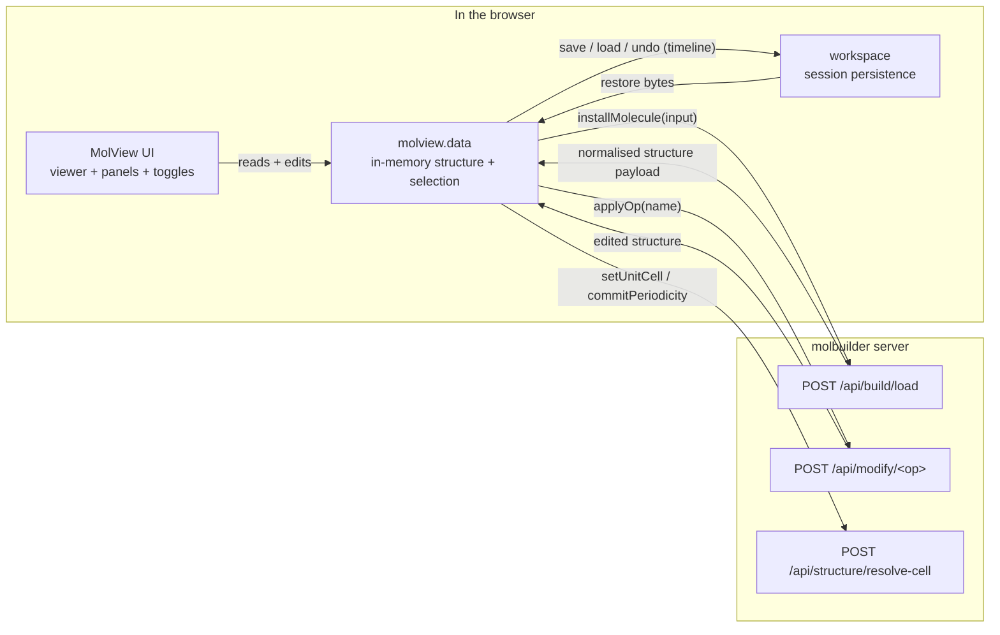
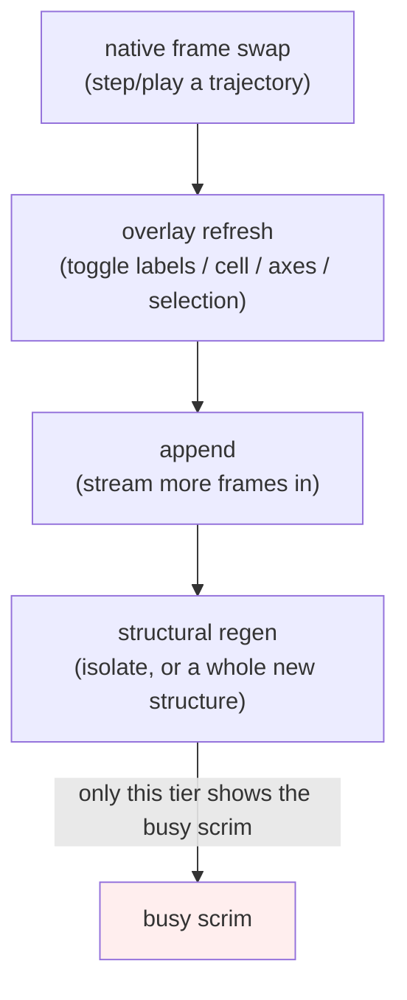

# MolView — the embeddable 3D structure viewer

**Role:** contract
**Domain:** web
**Companions:** `overview.md` (the web start-here map — composed last, named
not linked yet); `workspace.md` (session persistence — where MolView saves and
restores its state, web wave); `projects-sidebar.md` (the file browser that
hands structures to MolView, web wave); `web-api.md` (the server routes MolView
calls — `/api/build/load`, `/api/modify/*`, web wave);
[`model/structure.md`](?doc=model/structure.md) +
[`model/structure-annotations.md`](?doc=model/structure-annotations.md) (the
`Structure` + region/frozen data MolView carries);
[`model/structure-molstruct.md`](?doc=model/structure-molstruct.md) (the
`.molstruct.json` sidecar it round-trips). The **Modify tab** — how a user
*builds* and *saves* a structure (the six source panels, the save dialog) —
is a separate concern owned by a tabs doc, not this one.

MolView is the one 3D molecular viewer used **everywhere** in the browser: the
Modify tab edits a structure in it, the Results and Spectra and Transport tabs
show a structure read-only in it, and the trajectory inspector plays an
optimization movie in it. Every tab embeds the *same* component with the *same*
controls, so a user learns the viewer once.

This doc has two halves, one per reader:

- **Part 1 — Using the viewer** (plain-language user guide): what every button,
  menu, and click does on screen.
- **Part 2 — Embedding and extending MolView** (developer contract): the one
  module door, the `mount()` call and its handle, the in-memory data model, the
  render engine, and the wire to the server.

A final section covers **VibrationView**, MolView's sibling viewer that
animates vibrational modes on the Spectra and Results views.

> **Vocabulary.** *Embed* = the low-level wrapper around 3Dmol.js (the
> third-party WebGL molecule renderer); MolView conceals it. *Handle* = the small
> object `mount()` returns, the only way a tab talks to a mounted viewer.
> *Store* = the in-memory selection/view state. *Isolate* = "show selected atoms
> only". *Glow* = the translucent amber sphere drawn on a selected atom. *Frame*
> = one geometry in a trajectory movie. Atom indices are **0-based internally**
> and **1-based on screen** (see § 6).

---

# Part 1 — Using the viewer

Everything in this part is what a user sees and does. No code — just "when you
click X, Y happens."

## 1. What the 3D viewer is

Any tab that shows a molecule embeds MolView. It always looks and behaves the
same: a 3D canvas with a small toolbar down the left edge, a **View** menu and
an **Export** menu across the top, and — when the tab allows editing — a
selection/cell panel beside it. On a read-only view (Results, Spectra,
Transport) you can look, rotate, select, and measure, but not edit the geometry.

## 2. Moving around

- **Drag** to rotate, **scroll** to zoom, **right-drag** (or **Shift-drag**) to
  pan.
- **Reset (`⟲`)** on the left toolbar re-centers and re-fits the camera.
- The **View** menu offers **Perspective** (the default, natural depth) or
  **Orthographic** (parallel lines — pick this when you are eyeballing bond
  lengths, because it removes the foreshortening that makes far atoms look
  closer together).

## 3. Changing how the molecule looks — the View menu

The **View** dropdown holds the appearance controls you reach for less often:

- **Style:** **Stick**, **Ball & stick**, **Sphere**, or **Line**.
- **Radius** slider (0.2–2.5): scales stick thickness / sphere size / line
  width.
- **Background:** preset swatches plus a custom color picker. One preset is
  **transparent** — choose it before exporting a snapshot you want to drop onto
  a slide.

## 4. The left toolbar toggles

The always-visible icon buttons sit **outside** the canvas (never on top of the
molecule). Each is a simple on/off:

| Button | Glyph | What it does |
|---|:--:|---|
| Reset view | `⟲` | Re-fit the camera (§ 2) |
| Show axes | `✚` | Draw the x/y/z axis widget |
| Show atom labels | `#` | Label every atom with its index |
| Show force vectors | `➤` | Draw the per-atom force arrows (listed as "Show overlay" in menus) |
| Show unit cell | `▦` | Draw the periodic cell box |
| Show selected only | `◉` | **Isolate** — hide every unselected atom |

Isolate turns itself off automatically when the selection becomes empty (there
would be nothing left to show).

## 5. Selecting atoms

- **Click an atom** and it lights up with a translucent **amber glow**. The
  glow is a soft sphere laid over the atom, so the atom keeps its own element
  color and the geometry never rebuilds — selection is instant even on large
  systems, and the glow follows the atom as a trajectory plays.
- **Click it again** to deselect. Selecting more atoms accumulates the set.
- Clicking is **disabled while Isolate is on** (with the rest of the cell
  hidden there is no unambiguous atom to pick); turn Isolate off to select
  again.

The selection **panel** beside the viewer controls how you select:

- **Mode: Click vs Filter.** *Click* picks atoms by hand; *Filter* selects
  every atom matching a rule.
- **Filter kinds:** by **element** (`Au,C`), by **atom index** (`1-4, 6,
  10-11`), by **residue** (`ALA,DA`), or by **label** (`L-electrode`). You can
  add several filters and combine them with **AND** / **OR**.
- The panel shows a live **atom-count / measurement** readout of the current
  selection.

## 6. Measuring

Measurements come straight from what you have selected, in pick order:

- **1 atom** → its coordinates, e.g. `Au #3 — (0.000, 0.000, 0.000) Å`.
- **2 atoms** → the distance, e.g. `|H #5 – O #0| = 0.957 Å`.
- **3 atoms** → the angle, with the **middle-picked** atom as the vertex, e.g.
  `∠H #5 – O #0 – H #6 = 104.5°`.

The `#N` in a readout is the **1-based** on-screen atom number. (Internally
MolView counts atoms from 0; it adds 1 only for display, so the first atom reads
as `#1` on screen even though code sees index `0`.)

## 7. Region labels and freezing

In an editable view the panel lets you **tag** the selected atoms:

- Assign a region label — **L-electrode**, **R-electrode**, **bridge**,
  **interface**, **frozen atoms**, or a custom name you type.
- Each atom's tags show as removable chips (click the `×`).

These labels are **data that travels with the structure**: they are written into
the `.molstruct.json` sidecar and into the generated input script's
`ATOM-METADATA` block, so a downstream calculation and the Results view both see
the same regions you set here (see
[`model/structure-annotations.md`](?doc=model/structure-annotations.md)).

## 8. Playing a trajectory

When a result has **more than one frame** (a geometry optimization, say), a
**playback bar** appears under the viewer:

- **‹** / **›** step one frame; **▶ / ❙❙** play-pause.
- **⟳** loop (wrap at the ends).
- a **speed** box in **milliseconds per frame** (20–3000, default 150).
- a **range slider** with an `i / N` frame counter.

A single static structure shows **no bar**. As the movie plays, the per-atom
**force arrows animate with the frames** — the largest force is drawn gold, the
rest shade dim-red → orange-red by relative magnitude, so the converging forces
visibly shrink.

## 9. Saving a picture or data — the Export menu

The **Export** dropdown is organized by *what* you are exporting, each with a
**Save** (into the project) and a **Download** row:

- **Data** — the structure as text (xyz / pdb).
- **Snapshot** — a PNG of the current view (transparent background if you chose
  it in § 3).
- **Animation** — the trajectory as a gif/webm. This section only appears when
  an animation is mounted.

## 10. VibrationView — animating vibrational modes

On the **Spectra** and **Results** views, picking a vibrational mode from the
list makes the molecule **oscillate** in that mode. Drag **Amplitude** and
**Speed**, and play/pause. Frozen atoms stay grey and still; the camera holds
steady as you browse from mode to mode. VibrationView is a separate viewer from
MolView — the same idea (a concealed 3D viewer with a tiny handle) applied to
animation; its developer contract is in the last section of this doc.

---

# Part 2 — Embedding and extending MolView

This part is the **contract**: the exact surface a JS developer uses to embed a
viewer, drive it, and read its data. MolView is a self-contained ES module —
it owns its in-memory structure, conceals the 3Dmol embed, and persists only
through the workspace.

## 11. How MolView exchanges data

MolView sits between the user's clicks, the **server** (which parses and edits
structures), and the **workspace** (which persists a session). Three data
paths, three owners:



The rule the diagram encodes: **parsing and geometry edits are the server's
job** (MolView never parses structure text itself), **persistence is the
workspace's job** (MolView holds no file endpoint), and **everything in
between — the live structure, the selection, the view state — is
`molview.data`'s job**.

## 12. The one door and the read rule

MolView has a single ES-module entry point:

```js
import { mount, formula } from "/static/lib/molview/index.js";
```

`index.js` (`lib/molview/index.js:66-67`) exports exactly **`mount`** (the
viewer factory) and **`formula`** (a Hill-formula helper). It also re-exports
the data model, but production consumers must **not** import-and-hold the data
object — they look it up live at read time:

```js
// read the CURRENT structure/selection — always look it up, never cache it:
const data = window.molbuilder.molview.data;
const selected = data.getSelection();   // [0-based atom indices]
```

Why look up instead of import: the data object is a long-lived singleton whose
contents change as the user works; a consumer that imported a snapshot would go
stale. The `data` export exists for **tests and tooling**; every live tab
(`modify/viewer.js`, `lib/trajectory/core.js`, `lib/inspectors/structure.js`,
`lib/transport/core.js`, `spectra/viewer.js`) looks up
`window.molbuilder.molview.data` at the moment it reads.

**The concealed 3Dmol seal.** MolView wraps 3Dmol.js so nothing above the embed
ever touches it. `$3Dmol` stays a classic third-party global read only inside
`lib/viewer/mol-viewer.js`; the embed throws a clear error if it is absent. No
tab, panel, or engine imports 3Dmol — they go through the handle (§ 13) or the
data model (§ 14).

> **ESM status.** All consumers are `type="module"` and import the door
> (conversion phases A and B are done). The module still publishes transitional
> `window.molbuilder.molview.*` globals — these are **kept live seams** (node-test
> entry points, end-to-end readiness sentinels, the runtime registry), not dead
> scaffolding. Retiring them is tracked in [`roadmap.md`](?doc=roadmap.md), not
> here.

## 13. `mount()` and the handle

```js
const handle = await mount(hostEl, workspace, { mode, owner });
```

`mount(hostEl, workspace, opts) → Promise<handle>` (`lib/molview/mount.js:109`)
assembles a complete viewer — the 3D embed, the selection/cell panel, the view
toggles, and (for a trajectory) the frame bar — in one call. `opts.mode` is
`"readonly"` for a look-only view; `opts.owner` namespaces the view state so two
mounts on one page do not collide.

**Two assembly paths** (`mount.js:142-175`):

- an **empty host** → MolView builds the whole fused card itself (embed + panel
  + engine);
- a **pre-built `.molview-card` host** → MolView wires the existing panel and
  toggles (the transitional path the Modify tab's template uses).

**The mount contract — always resolves, never rejects to null.** `mount` always
returns `{ ok, dispose, … }`. On success `ok` is `true`; on failure it is
`false` with an `error`, and `dispose` is still a real teardown function.
Branch on `.ok`:

```js
const handle = await mount(hostEl, workspace, { mode: "readonly", owner: "results-structure" });
if (!handle.ok) {
  console.error("viewer failed to mount:", handle.error);
  return;                         // dispose() is safe to call regardless
}
// … use the viewer …
handle.dispose();                 // on teardown — LIFO drain: attachments → WebGL context → card DOM
```

A viewer that cannot fit (the host is narrower than the card's minimum width)
renders a blank card with an inline error rather than a broken half-viewer
(`mount.js:183-205`).

**The handle surface is exactly these 15 keys** — pinned by
`tests/test_molview_mount_js.py` (`HANDLE_KEYS`), so this list is the contract:

```
currentFrame  dispose      exportFile   frameCount   getFrame
getSelection  getStructure installMolecule  isPlaying  ok
onChange      pause        play         setFrame     undo
```

The handle deliberately exposes **no internals** — not the 3Dmol viewer, not the
store, not the DOM. There is intentionally **no** `setArrows` / `setLabels` /
`setBusy` / `addViewToggle` on the tab-facing handle: force arrows and labels
are baked by the render engine from the data (§ 16), not pushed by a consumer.
`handle.undo` is session-state undo (`data.load(-1)`); `play` / `pause` /
`isPlaying` drive the trajectory timer, which lives in `mount.js` (default 10
fps), not in the engine.

## 14. The data model — `molview.data`

`molview.data` (`lib/molview/data-model.js`) is the in-memory structure. Its
API object is authoritative; every accessor returns a **defensive copy**, so a
caller can never mutate MolView's state by reference.

**Reads** (selected — full list in the code): `getStructure`, `getSource`,
`getSourceFile`, `getSelection`, `getAtoms`, `getElements`, `getCoordinates`,
`getUnitCell` (the raw explicit 3×3, or `null`), `getUnitCellInfo`,
`getUnitCellOrigin`, `getAxisKind`, `getVacuum`, `getAtomsByLabel`,
`getLabelAtoms(label)`, `getLabels()`, `getFrozen`, `getRegions`, `isDirty`,
`isEmpty`, `draftIdentity`.

**Writes:** `commitPeriodicity`, `setUnitCell`, `setCellOrigin`, `setAxisKind`,
`setVacuum`, `setLabel`, `markDirty`, `markSaved`, `installMolecule`,
`exportFile`, `save`, `load`, `generate`, `applyOp`, `discard`, `undo`,
`reloadFrames`, `setForces`, plus the frame API (§ 16), the `selection`
sub-namespace (§ 15), and the `view` sub-namespace (§ 18).

**The two structure primitives:**

- **`installMolecule(input)`** — the LOAD primitive. Sends the structure text
  (plus optional sidecar) to `/api/build/load`, and on the normalised response
  does an **atomic whole-model replace** and resets the undo timeline.
  Generators call it directly; the projects file-open path calls it after
  reading bytes.
- **`exportFile()`** — the SAVE primitive, `installMolecule`'s inverse. Returns
  `{ xyz, sidecar }`. It **refuses** to emit when the geometry and the
  per-atom labels disagree on atom count (a desync) by returning `null` — a
  guard against writing a corrupt structure. `exportFile()` is *not* a disk
  write and *not* the session-state save; files belong to the projects package,
  session state to the timeline (§ 17).

**The encapsulation rule:** consumers go through accessors; they never parse
structure text and never reach past the API into the store or the embed. This
is what lets the data model stay the single source of truth.

## 15. Structure-mutation — `applyOp`

Geometry edits are **ops as data**. `applyOp(name)` posts to
`/api/modify/<name>` and applies the server's result atomically. The registry
(`lib/molview/_operations.js`) declares each op's shape rather than hand-coding
each one:

| Op | Role | Empty selection | Shape |
|---|---|---|---|
| `translate` | subject | — | transform |
| `rotate` | subject | — | transform |
| `orient` | subject | — | transform |
| `add_atom` | subject | — | grow |
| `electrode` | anchor | canonical (centre on origin) | grow |
| `symmetric_electrodes` | anchor | canonical | grow |
| `delete` | subject | reject | shrink |
| `calibrate` | subject | all atoms | transform (whole-structure only) |

Each entry's fields drive one generic orchestrator: `role` (whether the
selection is the thing acted on or an anchor), `empty` (what an empty selection
means), `groupField` (how selected indices are passed to the server), and
`shape` (grow / shrink / transform — how atom count changes). `calibrate` is
`wholeOnly`: it rigidly maps all atoms into `[0, cell)` and clears the cell
origin, so it always takes the whole-structure path even with a partial
selection.

```js
const data = window.molbuilder.molview.data;
await data.applyOp("delete");                 // delete the selected atoms
await data.applyOp("symmetric_electrodes");   // add electrodes anchored on the selected group
```

> The canonical op name **is** the server route segment — the delete op is
> `"delete"` (there is no `deleteAtoms`), the add op is `"add_atom"`. Use the
> registry names exactly.

## 16. The render engine and trajectories

The render engine (`lib/molview/engine/`) is the **one place** that draws.
`engine.create(handle, { store })` returns `{ setData, appendFrames, showFrame,
render, dispose }`. It splits into a **pure** layer (`engine/process.js`, no
3Dmol, node-tested — it computes what to draw) and an **I/O** layer
(`engine/embed-io.js`, the only 3Dmol-touching primitives).

**Four update tiers**, cheapest first, so common actions never rebuild geometry:



Only the fourth tier (a structural rebuild) shows the busy scrim; stepping a
movie or toggling an overlay is immediate. Updates are serialized with a
latest-wins pending-transaction queue, and a new `setData` voids any queued
overlay work and supersedes an in-flight rebuild.

**Trajectories.** The frame coordinates are owned by the 3Dmol **native movie**
(`addModelsAsFrames`); `molview.data` is a thin index/metadata coordinator over
it. The frame API is `reloadFrames`, `setForces`, `addFrame`, `addFrames`,
`setFrame`, `getFrame`, `currentFrame`, `frameCount`, `onFrameChange`.

```js
// load a trajectory with per-frame forces (the engine bakes the force arrows):
window.molbuilder.molview.data.reloadFrames(frames, { forces });
```

Two rules the code enforces:

- **Same-atoms invariant** — every frame must have the same atoms in the same
  order (a movie is one molecule moving, not a sequence of different molecules).
- **Forces, not arrows** — a consumer hands the engine the raw per-frame
  **forces**; the engine builds the arrow overlay. (The legacy
  `reloadFrames(frames, { arrowsPerFrame })` form is dead — `arrowsPerFrame`
  draws nothing; always pass `{ forces }`.)

## 17. Session-state timeline

`save`, `load`, and `undo` on the data model delegate to an internal timeline.
The model is deliberately small: **`save`** snapshots the current state,
**`load(delta)`** moves along the history (`load(-1)` = undo), and
**`undo`** is exactly `load(-1)`. MolView owns the *mechanism* (the history of
states); **policy** — when to auto-save, how much history to keep, where the
bytes live — is the workspace's (see `workspace.md`). The timeline snapshot
includes the view state (§ 18) but **not** trajectory frames: multi-frame
persistence is planned, not shipped (see [`roadmap.md`](?doc=roadmap.md)).

## 18. The view sub-namespace and the persistence seam

`data.view.applyState(patch)` / `data.view.getState()` hold the camera/style/
toggle state. The embed's view handle is registered at mount via
`attachViewHandle(h)`; any view state stashed before the embed was ready is
applied on registration. `flushViewState` pushes the current view into the
snapshot. View state is namespaced by `opts.owner`, so two viewers on one page
keep independent cameras.

## 19. The selection store — `molview.data.selection`

The selection lives in a store (`lib/molview/_selection-store-impl.js`), reached
as `molview.data.selection`. Panel, viewer glow, and measurements are all
**consumers** that read from this one store — the single source of truth for
what is selected and which view flags are on.

- **View flags** (all default off): `showIndex`, `showForces`, `showCell`,
  `showAxis`, plus a `forceScale`. One authority per flag: the store holds it,
  the engine reads it and draws.
- **Mutators:** `adoptSession`, `setIsolate`, `setViewFlag(name, value)`,
  `applyFilter`, `writeLabel(target, indices)` (replace-per-target), plus the
  click-selection set operations (toggle / add / remove / all / invert / clear)
  and the filter builder (mode / filters / combinator).
- A read-only inspector gets its own `createEphemeralStore()` so it never
  disturbs the editable tab's selection.

**Selection is drawn as shape-glow, and only shape-glow.** The engine emits
*which* atoms are selected; the embed draws one translucent sphere per selected
atom in a fixed style (`_SELECTION_GLOW = { color: "#ffd54a", radius: 0.7,
opacity: 0.5 }`), re-placed each frame so it tracks moving atoms. The older
mechanisms — colored **halos**, a **second model**, and **dim-the-rest**
(dim-pop) — were all removed; region tints and frozen markers are no longer
rendered at all. A selected atom keeps its element color; the glow just sits
over it.

## 20. Measurement overlay and the atom-index rule

Beyond the panel readout (§ 6), a viewer-window measurement overlay
(`mount.js` → `mountMeasurementOverlay`) repaints on selection **or** frame
change. All measurement math is derived from pick order; the vertex of a
3-atom angle is the middle-picked atom. Atom indices are **0-based internally,
1-based on screen** — the `#N` a user reads is `index + 1`.

## 21. The wire contract

MolView calls three server routes: `/api/build/load` (load/parse a structure),
`/api/modify/<op>` (a geometry edit), and `/api/structure/resolve-cell` (cell
resolution). The client normalises the server's payload into its store shape
(regions → labels, `is_frozen` → `isFrozen`).

> The **field-level** JSON shapes of these payloads (the structure envelope, the
> atom row, the error envelope) are owned by `web-api.md` (web wave) — this doc
> names the routes and the direction of data; the exact request/response schemas
> are cross-referenced there rather than duplicated here.

## 22. Test affordances

MolView is exercised by node harness modules (the pure `engine/process.js` and
the selection store run without a browser) and by end-to-end pages — chiefly
`/molview-demo` (`molview/demo.js`), the only in-repo multi-frame exerciser.
The transitional `window.molbuilder.molview.*` publishes double as the
node/e2e entry points and readiness sentinels (§ 12).

## 23. The developer's map

| File | Owns |
|---|---|
| `lib/molview/index.js` | the one door (`mount`, `formula`, data re-export) |
| `lib/molview/mount.js` | `mount()`, the handle, the playback timer |
| `lib/molview/data-model.js` | the in-memory structure (`molview.data`) |
| `lib/molview/_operations.js` | the `applyOp` registry |
| `lib/molview/_selection-store-impl.js` | the selection store |
| `lib/molview/selection/` | panel, viewer-adapter, measurements, mount-panel |
| `lib/molview/engine/` | render engine — `engine.js`, `process.js` (pure), `embed-io.js` |
| `lib/molview/frame-controls.js` | the trajectory playback bar |
| `lib/molview/measurement-overlay.js` | the in-viewer measurement overlay |
| `lib/viewer/` | the concealed 3Dmol embed family |
| `lib/vibrationview/` | VibrationView (§ 24) |
| `molview/demo.js` | the `/molview-demo` page |

---

# 24. VibrationView — the animation sibling

VibrationView (`lib/vibrationview/`) is a **separate** viewer that animates a
vibrational mode. It is a *sibling* of MolView, not a part of it: same design
idea (a concealed 3D viewer exposed through a tiny handle), applied to
animation. It is what the user drives in § 10.

**The handle.** `mount(host, opts) → handle` (`lib/vibrationview/
vibrationview.js:69`) follows the same uniform contract as MolView: it **always**
returns a handle carrying `dispose`; failure is `{ ok: false, error, dispose }`,
success is `{ ok: true, … }`. The handle:

```
showMode(mode)   play()   pause()   isPlaying()
setAmplitude(å)  setSpeed(hz)  getMode()  dispose()
```

Like MolView's handle, it exposes no internals. Defaults: amplitude **0.15 Å**,
speed **1.0 Hz**.

**The animation model** is owned here (`vibrationview.js`):

```
pos_i(φ) = equilibrium_i + amplitude · cos(φ) · displacement_i
```

The phase `φ` is continuous across pause/play (resuming does not jump), and
amplitude/speed are **live** — a change takes effect on the next animation frame
with no rebuild. The baseline is redrawn only when the geometry or the frozen
set changes, so browsing from mode to mode of one structure keeps the camera
still. **Frozen atoms** are greyed (`#555`) and never move (zero displacement).
The one science-shaped piece VibrationView owns is scattering the eigenvector
into a per-atom displacement array (free rows → the global vector; frozen rows →
`[0, 0, 0]`), in `lib/vibrationview/mode-math.js`.

**The seal.** VibrationView owns the animation clock, the knobs, and the tick
math, and drives its drawing surface through **generic** doors —
`handle.setAtomCoords(coords)` per tick and
`handle.setAnimationProvider({ frameCoords, restCoords, cycleSec })` for export
capture. It still *draws* through the shared embed as a plain drawing surface
(picking off, axes off): the seal is **semantic** — the embed holds zero
vibration-specific concern — not a second, separate 3Dmol wrapper. The embed's
old built-in `kind:"vibration"` animation was deleted.

**Spectra-tab wiring** (`lib/spectra/core.js`). The spectra inspector mounts
VibrationView once, then on each mode pick calls
`vib.showMode({ index, displacements, geometry, freeAtomIdx, frozenAtomIdx })`;
the amplitude/speed sliders call `vib.setAmplitude` / `vib.setSpeed`; the
play/pause button calls `vib.play` / `vib.pause`; a geometry change or unmount
calls `vib.dispose()`. **The inspector owns the control widgets, the Plotly
chart, and the mode list; VibrationView renders no control UI** — it just
animates. It runs identically on `/results` and `/spectra`.

---

> **Planned work, not contract.** Multi-frame trajectory persistence
> (`_serialise` does not yet carry frames — trajectories are demo-only today),
> the finer-grained render invalidation refinements, and retiring the
> transitional module globals all live in [`roadmap.md`](?doc=roadmap.md). This
> doc describes only what ships.
