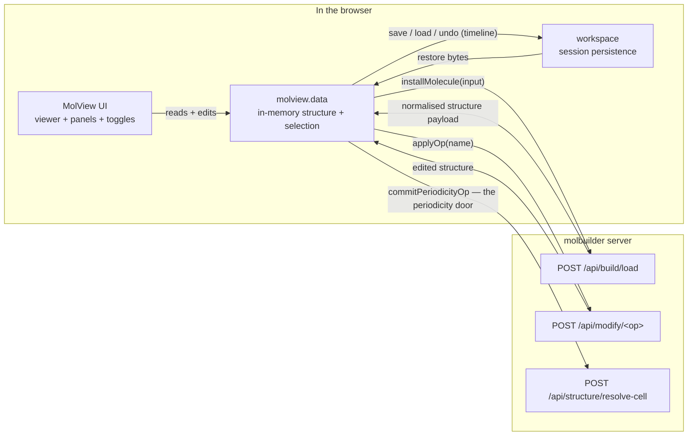
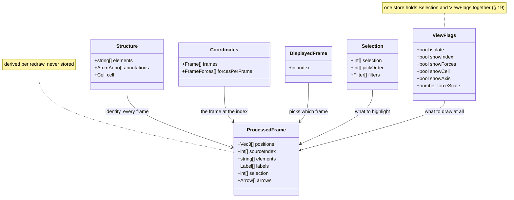
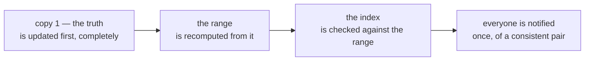
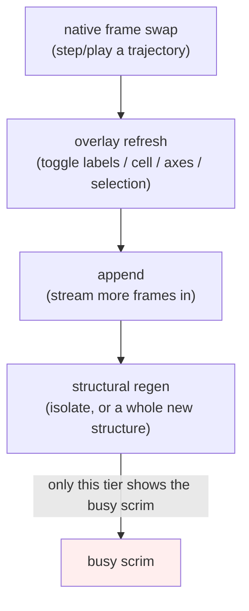
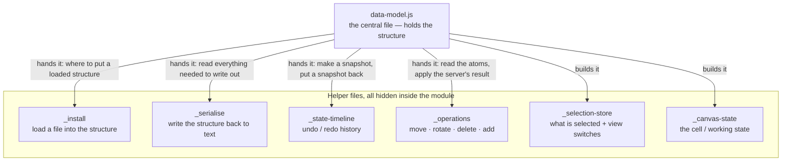

# MolView — the embeddable 3D structure viewer

**Role:** contract
**Domain:** web
**Companions:** [`overview.md`](?doc=web/overview.md) (the web start-here map);
[`workspace.md`](?doc=web/workspace.md) (session persistence — where MolView
saves and restores its state); [`projects.md`](?doc=web/projects.md) (the file
browser that hands structures to MolView);
[`web-api.md`](?doc=web/web-api.md) (the server routes MolView calls);
[`model/structure.md`](?doc=model/structure.md) +
[`model/structure-annotations.md`](?doc=model/structure-annotations.md) (the
`Structure` + region/frozen data MolView carries);
[`model/structure-molstruct.md`](?doc=model/structure-molstruct.md) (the
`.molstruct.json` sidecar it round-trips). The **Modify tab** — how a user
*builds* and *saves* a structure (the six source panels, the save dialog) —
is a separate concern owned by [`tabs.md`](?doc=web/tabs.md), not this one.

MolView is the one 3D molecular viewer used **everywhere** in the browser: the
Modify tab edits a structure in it, the Results and Spectra and Transport tabs
show a structure read-only in it, and the trajectory inspector plays an
optimization movie in it. Every tab embeds the *same* component with the *same*
controls, so a user learns the viewer once.

This doc has two halves, one per reader:

- **Part 1 — Using the viewer** (plain-language user guide): what every button,
  menu, and click does on screen.
- **Part 2 — Embedding and extending MolView** (developer contract): the one
  module door, the `mount()` call and its handle, the in-memory data model, the
  render engine, and the wire to the server.

A final section covers **VibrationView**, MolView's sibling viewer that
animates vibrational modes on the Spectra and Results views.

> **Vocabulary.** *Embed* = the low-level wrapper around 3Dmol.js (the
> third-party WebGL molecule renderer); MolView conceals it. *Handle* = the small
> object `mount()` returns, the only way a tab talks to a mounted viewer.
> *Store* = the in-memory selection/view state. *Isolate* = "show selected atoms
> only". *Glow* = the translucent amber sphere drawn on a selected atom. *Frame*
> = one geometry in a trajectory movie. *renderEngine* = the layer that decides
> what to redraw and how (never a calculation engine — SIESTA and PySCF are
> engines in a different sense, and this module never means that one).
> *Copy 1* = the structure as MolView holds it, every atom of every frame, the
> thing that gets saved; *copy 2* = the filtered, renumbered copy the graphics
> library draws (§ 14.3). Atom indices are **0-based internally** and **1-based
> on screen**, translated by one shared API — never a hand-rolled `+1` (§ 20).

---

# What MolView is for

**One 3D molecular viewer, learned once, used everywhere.** Every place in the
app that shows a molecule embeds the *same* component with the *same* controls —
the Modify tab editing a structure, the Results and Spectra and Transport tabs
showing one read-only, the trajectory inspector playing an optimization. A user
who learns to select, isolate, measure and scrub in one of them can do it in all
of them, and a developer who wants a viewer does not build one.

Six things follow from that goal. They are the reason every rule in this
document exists; a design choice that breaks one of them is wrong regardless of
how convenient it is.

### 1. What you see is what you save

The structure on screen and the structure that goes to a calculation are the same
structure, at the same frame. A user scrubbed to frame 40 who clicks Save gets
frame 40. This is why the displayed frame index is a single number owned above
the renderer and read by everyone (§ 14.3) — the question "which frame am I
looking at" and the question "which frame am I working on" must not be able to
have different answers.

### 2. One place holds each fact

Every fact — the atoms, the cell, the selection, which frame — has one home and
one door. Where two forms genuinely must coexist (the structure's truth and the
filtered thing the graphics library draws, § 14.3), one is unambiguously the
truth, the other is unreachable as an answer, and a single index joins them. A
second copy buys nothing and creates somewhere for the two to drift apart.

### 3. The graphics library is invisible

Nothing above the concealed seal knows the viewer is 3Dmol — not a tab, not a
panel, not the render layer. Replacing it should reach no consumer. This is what
makes "the same viewer everywhere" a property of the code and not a convention
people remember to follow.

### 4. A host needs to know nothing

A consumer hands MolView somewhere to live and a workspace, and gets a viewer. It
needs no knowledge of rendering, of structure parsing, or of how sessions
persist — those belong to the render layer, the server, and the workspace
respectively (§ 14.5). The handle is deliberately small (§ 13) so that embedding
a viewer is never a project.

### 5. The user's intent is data, and it travels

Region labels, frozen flags, the selection, the frame in view — these are not
decoration. They are written into the structure's sidecar and into the generated
input script, so the calculation and the results view both see the regions the
user set here (§ 7). The viewer is where scientific intent is expressed, so that
intent has to survive the trip.

### 6. A viewer is owned

**Every mounted viewer is its own MolView, and it belongs to its owner.** Two
viewers on one page are two structures, two selections, two displayed frames, two
cameras — not one set of facts that both of them fight over. The `owner` a host
passes at mount is what makes that true, and it names *everything* the viewer
holds, not just its camera.

This is the goal the module was always reaching for, and it is what makes goal 2
mean something: "one place holds each fact" is only a real rule once *which*
viewer's fact you mean is unambiguous. A single shared structure behind two
viewers is not one home for a fact — it is one home for two facts that happen to
collide.

It follows that **the handle is the door** (§ 13). A tab holds a handle, and a
handle *is* a particular viewer; there is no global to look a viewer up in and no
way to reach the wrong one by accident.

### What MolView is deliberately not

| Not | Whose job | Why the boundary is there |
|---|---|---|
| a structure **parser** | the server | one parser, one set of chemistry rules — a browser-side parser would be a second, weaker opinion |
| a structure **generator** | the server + the Modify tab | building a molecule from a SMILES string, a name, a sequence, or a file is `POST /api/build/molecule` driven by the tab's own panels. A viewer that dispatched generation would have to know its host's modules by name — which is the inversion goal 4 exists to prevent |
| a **file** manager | the projects package | MolView produces and consumes bytes; where they live is not a viewing concern |
| a **persistence** layer | the workspace | MolView owns *when* and *how far* to persist; the workspace owns *where the bytes go* (§ 17) |
| a **vibrational animator** | VibrationView | a separate module with its own doc |

---

# Part 1 — Using the viewer

Everything in this part is what a user sees and does. No code — just "when you
click X, Y happens."

## 1. What the 3D viewer is

Any tab that shows a molecule embeds MolView. It always looks and behaves the
same: a 3D canvas with a small toolbar down the left edge, a **View** menu and
an **Export** menu across the top, and — when the tab allows editing — a
selection/cell panel beside it. On a read-only view (Results, Spectra,
Transport) you can look, rotate, select, and measure, but not edit the geometry.

## 2. Moving around

- **Drag** to rotate, **scroll** to zoom, **right-drag** (or **Shift-drag**) to
  pan.
- **Reset (`⟲`)** on the left toolbar re-centers and re-fits the camera.
- The **View** menu offers **Perspective** (the default, natural depth) or
  **Orthographic** (parallel lines — pick this when you are eyeballing bond
  lengths, because it removes the foreshortening that makes far atoms look
  closer together).

## 3. Changing how the molecule looks — the View menu

The **View** dropdown holds the appearance controls you reach for less often:

- **Style:** **Stick**, **Ball & stick**, **Sphere**, or **Line**.
- **Radius** slider (0.2–2.5): scales stick thickness / sphere size / line
  width.
- **Background:** preset swatches plus a custom color picker. One preset is
  **transparent** — choose it before exporting a snapshot you want to drop onto
  a slide.

## 4. The left toolbar toggles

The always-visible icon buttons sit **outside** the canvas (never on top of the
molecule). Each is a simple on/off:

| Button | Glyph | What it does |
|---|:--:|---|
| Reset view | `⟲` | Re-fit the camera (§ 2) |
| Show axes | `✚` | Draw the x/y/z axis widget |
| Show atom labels | `#` | Label every atom with its index |
| Show force vectors | `➤` | Draw the per-atom force arrows (listed as "Show overlay" in menus) |
| Show unit cell | `▦` | Draw the periodic cell box |
| Show selected only | `◉` | **Isolate** — hide every unselected atom |

Isolate turns itself off automatically when the selection becomes empty (there
would be nothing left to show).

## 5. Selecting atoms

- **Click an atom** and it lights up with a translucent **amber glow**. The
  glow is a soft sphere laid over the atom, so the atom keeps its own element
  color and the geometry never rebuilds — selection is instant even on large
  systems, and the glow follows the atom as a trajectory plays.
- **Click it again** to deselect. Selecting more atoms accumulates the set.
- Clicking is **disabled while Isolate is on** (with the rest of the cell
  hidden there is no unambiguous atom to pick); turn Isolate off to select
  again.

The selection **panel** beside the viewer controls how you select:

- **Mode: Click vs Filter.** *Click* picks atoms by hand; *Filter* selects
  every atom matching a rule.
- **Filter kinds:** by **element** (`Au,C`), by **atom index** (`1-4, 6,
  10-11`), by **residue** (`ALA,DA`), or by **label** (`L-electrode`). You can
  add several filters and combine them with **AND** / **OR**.
- The panel shows a live **atom-count / measurement** readout of the current
  selection.

## 6. Measuring

Measurements come straight from what you have selected, in pick order:

- **1 atom** → its coordinates, e.g. `Au #3 — (0.000, 0.000, 0.000) Å`.
- **2 atoms** → the distance, e.g. `|H #5 – O #1| = 0.957 Å`.
- **3 atoms** → the angle, with the **middle-picked** atom as the vertex, e.g.
  `∠H #5 – O #1 – H #6 = 104.5°`.

The `#N` in a readout is the **1-based** on-screen atom number. MolView does not
hand-roll that `+1`: the readout, the atom labels, and the filter panel all get
it from the one shared index-base API (`atomIndexModel.toDisplay`), so the first
atom reads as `#1` everywhere even though code sees index `0`. That single home
is described in § 20.

## 7. Region labels and freezing

In an editable view the panel lets you **tag** the selected atoms:

- Assign a region label — **L-electrode**, **R-electrode**, **bridge**,
  **interface**, **frozen atoms**, or a custom name you type.
- Each atom's tags show as removable chips (click the `×`).

These labels are **data that travels with the structure**: they are written into
the `.molstruct.json` sidecar and into the generated input script's
`ATOM-METADATA` block, so a downstream calculation and the Results view both see
the same regions you set here (see
[`model/structure-annotations.md`](?doc=model/structure-annotations.md)).

## 8. Playing a trajectory

When a result has **more than one frame** (a geometry optimization, say), a
**playback bar** appears under the viewer:

- **‹** / **›** step one frame; **▶ / ❙❙** play-pause.
- **⟳** loop (wrap at the ends).
- a **speed** box in **milliseconds per frame** (20–3000, default 150).
- a **range slider** with an `i / N` frame counter.

A single static structure shows **no bar**. As the movie plays, the per-atom
**force arrows animate with the frames** — the largest force is drawn gold, the
rest shade dim-red → orange-red by relative magnitude, so the converging forces
visibly shrink.

## 9. Saving a picture or data — the Export menu

The **Export** dropdown is organized by *what* you are exporting, each with a
**Save** (into the project) and a **Download** row:

- **Data** — the structure as text (xyz / pdb).
- **Snapshot** — a PNG of the current view (transparent background if you chose
  it in § 3).
- **Animation** — the trajectory as a gif/webm. This section only appears when
  an animation is mounted.

## 10. VibrationView — animating vibrational modes

On the **Spectra** and **Results** views, picking a vibrational mode from the
list makes the molecule **oscillate** in that mode. Drag **Amplitude** and
**Speed**, and play/pause. Frozen atoms stay grey and still; the camera holds
steady as you browse from mode to mode. VibrationView is a separate viewer from
MolView — the same idea (a concealed 3D viewer with a tiny handle) applied to
animation; its developer contract is in the last section of this doc.

---

# Part 2 — Embedding and extending MolView

This part is the **contract**: the exact surface a JS developer uses to embed a
viewer, drive it, and read its data. MolView is a self-contained ES module —
it owns its in-memory structure, conceals the 3Dmol embed, and persists only
through the workspace.

## 11. How MolView exchanges data

MolView sits between the user's clicks, the **server** (which parses and edits
structures), and the **workspace** (which persists a session). Three data
paths, three owners:



The rule the diagram encodes: **parsing and geometry edits are the server's
job** (MolView never parses structure text itself), **persistence is the
workspace's job** (MolView holds no file endpoint), and **everything in
between — the live structure, the selection, the view state — is
`molview.data`'s job**.

## 12. The one door

MolView has a single ES-module entry point, and it exports a **factory**:

```js
import { mount, formula } from "/static/lib/molview/index.js";

const viewer = await mount(hostEl, workspace, { owner: "results-structure" });
const selected = viewer.getSelection();   // [0-based atom indices]
```

`mount` makes a viewer; `formula` is a Hill-formula helper that needs no viewer.
That is the whole import surface.

**The handle you get back *is* the viewer** (goal 6). It is not a pointer into a
shared object — it owns its structure, its selection, its displayed frame, its
camera. Holding it is correct and expected: a handle never goes stale, because
its identity is the viewer, not a snapshot of one. Two mounts give two handles
that share nothing, and there is no global to look a viewer up in, so a tab
cannot reach the wrong one.

> **Transition.** Today the module also publishes
> `window.molbuilder.molview.data` — a **single** shared model, from before
> viewers were owned. It is what tabs currently read through, and while it exists
> the old rule still applies to it: look it up at read time, never cache it,
> because its *contents* swap under you. It is a seam being removed, not a second
> door; new code takes the handle. The other `window.molbuilder.molview.*`
> publishes are live test and readiness seams (§ 22.4). Both are
> [`roadmap.md`](?doc=roadmap.md)'s business.

**The concealed 3Dmol seal.** The name `3Dmol` appears in **exactly one place**
in the module — the innermost seal (L7, § 24), which is the only code allowed to
read the third-party global, and which fails with a clear error if it is absent.
Nothing above it — no tab, no panel, no renderEngine — names the library or any
of its types. That is goal 3 made structural: swapping the drawing library
touches one file and no consumer.

## 13. `mount()` and the handle

```js
const handle = await mount(hostEl, workspace, { mode, owner });
```

`mount(hostEl, workspace, opts) → Promise<handle>` assembles a complete viewer —
the 3D embed, the selection/cell panel, the view toggles, and (for a trajectory)
the frame bar — in one call.

**`opts.owner` names the viewer, and therefore everything in it.** It is not a
prefix on a settings key; it is the identity of an instance. The structure, the
selection, the view flags, the displayed frame and its range, the camera, the
undo timeline, the renderEngine and its seal all belong to that owner. Two mounts
with different owners share nothing (goal 6). A mount with no owner is a viewer
with no identity, which is why one is always given.

**`opts.mode: "readonly"` freezes copy 1 and nothing else** — the rule is § 13.1.

**Two assembly paths:**

- an **empty host** → MolView builds the whole fused card itself (embed + panel
  + renderEngine);
- a **pre-built `.molview-card` host** → MolView wires the existing panel and
  toggles (the transitional path the Modify tab's template uses).

**The mount contract — always resolves, never rejects to null.** `mount` always
returns `{ ok, dispose, … }`. On success `ok` is `true`; on failure it is
`false` with an `error`, and `dispose` is still a real teardown function.
Branch on `.ok`:

```js
const handle = await mount(hostEl, workspace, { mode: "readonly", owner: "results-structure" });
if (!handle.ok) {
  console.error("viewer failed to mount:", handle.error);
  return;                         // dispose() is safe to call regardless
}
// … use the viewer …
handle.dispose();                 // on teardown — LIFO drain: attachments → WebGL context → card DOM
```

A viewer that cannot fit (the host is narrower than the card's minimum width)
renders a blank card with an inline error rather than a broken half-viewer.

**What the handle must be able to do**, and what it must refuse:

| A tab must be able to | Refused, deliberately |
|---|---|
| know whether it got a viewer, and tear it down | reaching the 3Dmol viewer, the stores, or the DOM |
| reach everything the viewer holds — its structure, selection, frames, window state | reaching *another* viewer's, or reaching any of it without going through the model, where the invariants and the read-only gate live (§ 14.6) |
| run the movie — `play`, `pause`, `isPlaying` | owning the timer; playback lives in the mount layer and drives the frame through `setCurrentFrame` like every other writer |
| hear that something changed | polling |
| — | pushing appearance: there is no `setArrows`, `setLabels`, `setBusy`, `addViewToggle`. Arrows and labels are **baked from the data** by the renderEngine (§ 16), never handed in by a consumer |

**The handle does not mirror the model; it contains it.** This is the difference
the owner decision forces. When the model was a single shared object, a handle
that also carried `getStructure`, `getFrameAllAtoms`, `currentFrame` and the rest
was a convenience — two ways to the same object. Once each viewer owns its model,
a mirrored read is a *second surface over the same fact*, and one of the two will
be the one somebody forgets to update. So: the handle carries **lifecycle,
playback, and one route to the model**, and the model carries the data API
(§ 14.6) with `selection` and `view` beneath it.

Adding a read to the handle that the model already answers is the specific move
this rule forbids.

> **Transition.** Today's handle is 15 keys — lifecycle and playback, plus eight
> reads and writes forwarded from the model. The forwarded eight are what the
> rule above retires; they are how a tab reached a viewer before there were
> viewers to reach. `undo` is session-state undo, not a geometry undo. Playback
> speed is the user's setting (§ 8), owned in one place.

### 13.1 Read-only means one thing

**A read-only viewer freezes copy 1. Nothing else changes.**

That is the entire rule, and it is worth stating in one line because every
previous attempt to describe read-only turned into a list of disabled buttons
that had to be maintained. There is no list. There is one question, asked of each
door: *does this change the truth?* If it does, in a read-only viewer it is a
**no-op** — it returns without effect and without throwing. If it does not, it
works exactly as it does anywhere else.

| Does it change copy 1? | Doors | In read-only |
|---|---|---|
| **Yes** | `installMolecule`, `applyOp`, `discard`, `commitPeriodicityOp`, `reloadFrames`, `addFrame`, `addFrames`, `setForces`, and the timeline's `load` / `undo` (they restore a *different* truth) | no-op |
| **No — it changes what is drawn, or reads** | `setCurrentFrame` and the whole frame API, everything under `selection`, every view flag including isolate, everything under `view` (camera, style, background), `getStructure` and every other read, `exportFile`, `factsForRequest` | fully live |

The line falls exactly where the two copies do (§ 14.3). Read-only is a statement
about **copy 1**; copy 2 is the render, and rendering is what a read-only viewer
is *for*. A user looking at a finished calculation can still select atoms, isolate
them, measure them, scrub the trajectory, turn on force arrows, spin the camera
and export what they see — none of that touches the truth. What they cannot do is
change the structure the calculation ran on.

Two consequences worth naming, because they are easy to get backwards:

- **Isolate is not an edit.** It hides atoms from the drawing; the truth still has
  all of them, which is why the whole structure comes back when it is turned off
  (§ 14.3). A read-only viewer isolates freely.
- **`exportFile` is a read.** Getting bytes out of a viewer you cannot edit is
  exactly the point of a read-only viewer, and it changes nothing.

## 14. The data — what a viewer holds

A viewer holds **one structure**. If that structure came from a trajectory, it
holds **many frames** of that same structure, and **one number** saying which
frame you mean. It holds **what you have selected** and **which view switches are
on**. Everything else you see — the drawn atoms, the force arrows, the selection
glow — is worked out fresh on each redraw and never stored.

*A viewer*, not *the module*: everything below belongs to one owner (goal 6). Two
viewers on a page hold two of everything in this section and share none of it.

### 14.1 The four things a viewer holds

**The structure — identical for every frame.** One element symbol per atom, one
set of per-atom tags (a region label, a frozen flag), and optionally a unit cell.
A frame never carries these; they are fixed when the structure loads and are the
same for frame 0 and frame 400. That is what makes a trajectory *one molecule
moving* rather than a sequence of different molecules.

**The coordinates — one entry per frame.** `frames[f][a]` is atom `a`'s position
in frame `f`. Per-atom forces, when a run produced them, sit in a parallel list
of the same shape. A structure that is not a trajectory is simply a list of
**one** frame — there is no separate "static" mode anywhere in the module.

**The index, and the range it lives in — which frame you mean.** A single number
and the bounds it is valid in, held together. The number answers *which frame is
on screen* and *which frame gets saved or exported* — the same question, so the
same number. The range says which numbers are legal, and it is recomputed from
the coordinates every time they change. Both sit above the renderEngine (§ 14.3).

**What is selected, and the view switches.** The selected atom indices with the
order you picked them (a 3-atom angle needs to know which you picked second), the
filter settings, and the on/off view flags — isolate, atom labels, force arrows,
unit cell, axes, plus the force-arrow scale. Window settings — camera, style,
background — are a separate store, for the reason in § 18.

### 14.2 The shapes



**The structure and its coordinates.**

| Field | Shape | Notes |
|---|---|---|
| `elements` | `string[]` | element per atom. **Shared by every frame.** |
| `annotations` | `{label?, frozen?}[]` | per-atom region label + frozen flag. **Shared by every frame.** Model data, not view flags — the selection panel reads them; the renderer does not. |
| `cell` | `{lattice: [Vec3,Vec3,Vec3], origin: Vec3}` \| `null` | the a/b/c vectors plus the corner the box is anchored at. |
| `frames` | `Vec3[][]` | `frames[f]` = coordinates of frame `f`. Length ≥ 1. **Coordinates only.** |
| `forcesPerFrame` | `Vec3[][]` \| `null` | `forcesPerFrame[f]` = forces of frame `f`. |

Atom **count**, `elements` and `annotations` are fixed at load from frame 0 and
identical for every frame — that *is* the same-atoms invariant of § 16.5.

**The view flags.** `selection` and `isolate` are the only two that change the
**drawn atom set**; every other flag changes overlays only, which is why toggling
labels or the cell never rebuilds geometry (§ 16.2). **The displayed index is
deliberately not a view flag** — see § 14.3.

### 14.3 Which copy answers which question

The coordinates exist in **exactly two** forms, and only two.

**Copy 1 — the truth.** Every atom, every frame, in original 0-based order. This
is what gets measured, exported, saved, and handed to a calculation. It is kept
**clean** — never overwritten with a filtered or derived list — so every redraw
re-derives from it rather than from what is currently drawn. That is what keeps
the whole structure drawable after an isolate.

**Copy 2 — the render copy.** What the graphics library actually draws: under
*isolate* the unselected atoms are gone from the frame, the survivors are
renumbered, and force arrows are baked in. It can answer one question only —
"what is on screen".

**There is no third copy, and adding one is a design error.** A tab may hold its
own parsed run file, but that is the tab's data carrying *different* facts —
energies, forces per step, SCF history — not another copy of the coordinates. It
feeds MolView; it is not one of MolView's two.

Two copies means each question routes to the one that can answer it, and **the
index is what routes them**:

| The question | Answered from | Through |
|---|---|---|
| Which frame is displayed — and which will be saved? | the index, held above the renderEngine | `currentFrame()` |
| The coordinates of **every** atom at that frame — measure, export, save | **copy 1, the truth** | `getFrameAllAtoms(i)` |
| What is on screen? | **copy 2, the render copy** | nothing reads it — it is output, never a source |
| The energy / forces / SCF at that step | *not MolView's data at all* — the tab's own run file | the tab reads its own file, at the same index |

Because the index means *which frame the user intends to work on*, it is a fact
about intent, not about rendering. It lives in **MolView, above the renderEngine**,
and **no layer keeps a copy of it** — not the renderEngine, not the drawing seal.

**Why no copy.** There is nothing to gain. It is one integer, read a handful of
times per redraw, so a local copy saves no measurable work. What a copy *does*
buy is a second thing that must be kept in step — and every mechanism for keeping
it in step is a place it can fall out of step. This index answers two questions
that must never disagree (what is on screen, what gets saved); a copy is exactly
how they would come to disagree.

**The index and its range are one fact, kept in one place.** An index without the
range it is valid in is not usable — you cannot offer a slider, clamp a seek, or
follow a tail without both — so they are held together, next to each other,
updated together, and read through one API. Splitting them is how a slider comes
to offer a frame nothing can draw.

**They are answerable to the truth, in this order:**



1. **The truth is updated first, and fully.** A load, an append, an edit, a
   restore — copy 1 reaches its final state before anything else moves.
2. **The range is recomputed from the truth.** Not from the movie, not from what
   the caller said it was adding. The truth is the only thing entitled to say how
   many frames there are.
3. **The index is checked against that range**, and moved if it no longer fits.
4. **Only then is anyone notified**, and what they see is a matched set.

Nothing observes a half-updated state: there is no moment when the range belongs
to the new structure and the index still belongs to the old one, because the
notification comes after both have settled. This is what makes "what you see is
what you save" survive a structure changing underneath a user — the pair is never
briefly wrong.

**One fact, three doors:**

| Door | Who uses it, and why |
|---|---|
| `currentFrame()` · `frameCount()` | anyone who needs to know which frame is meant, and how many there are — the frame bar, the measurement overlay, export/save, a tab |
| `setCurrentFrame(i)` | anyone who moves it — the frame bar, the playback timer, a tab following the tail of a growing run, a restored session. Out-of-range values are resolved against the range, never trusted |
| `onFrameChange(fn)` | anyone who must react — the bar's slider and counter, the measurement overlay, the renderEngine |

**Every UI gets and sets the displayed frame through exactly this API** — the
frame bar under the viewer, a tab's own scrubber, a keyboard shortcut, playback,
a restored session. There is no privileged writer and no back channel. A UI that
tracked the frame itself would be a second answer to a question that must have
one, and it would be the stale one the moment anything else moved.

`setCurrentFrame` is the **single write door**, and it notifies **every**
subscriber regardless of what moved the index. A subscriber never has to know
which of those happened, and nothing anywhere needs a private "did it change?"
check.

The renderEngine keeps no copy either, and it does not run a notification of its
own. It is **told** to draw a frame when the index moves; and when a *view flag*
changes — a label toggle, say — it reads `currentFrame()` to know whose overlays
to re-apply. Fanning the change out to subscribers is entirely the door's job.

The index is also **not a view flag**: it has its own change channel, because
playback moves it many times a second, and firing the view store that often would
re-render the selection panel and steal focus from a filter input mid-play. A
flag is something a user sets; this is something a movie drives.

### 14.4 Derived on every redraw, never stored

`ProcessedFrame` is what one frame becomes after the view flags are applied — the
only thing that reaches the drawing seal.

| Field | Shape | Notes |
|---|---|---|
| `positions` | `Vec3[]` | the atoms **actually drawn** — filtered to the selection when isolate is on. |
| `sourceIndex` | `int[]` | `sourceIndex[m]` = the **original** index of drawn atom `m`. This drawn → original map is why labels still show the original number under isolate. |
| `elements` | `string[]` | element per **drawn** atom. |
| `labels` | `{position, text}[]` \| `null` | index labels when `showIndex` is on; `text` is the **1-based original** index (§ 20). |
| `selection` | `int[]` \| `null` | which drawn atoms to glow. `null` under isolate (the drawn set *is* the selection) and `null` when nothing is selected. |
| `arrows` | `{start, end}[]` \| `null` | force vectors for **this** frame; `end = start + force · scale`. |

`selection` here is **semantic content, not styling**: it says *which* atoms glow.
How the glow looks is a constant owned by the drawing seal (§ 19) and is never
baked into per-frame data, so the shape stays identical for every frame.
`cellBox` and `axes` are scene-level — computed once, the same every frame unless
the cell changes.

**Interaction under isolate.** While isolate is on the 3-D window is
display-only: in-window click-to-select is **off**, because a drawn index no
longer equals an original index. The panel curates the selection and always
speaks original 0-based indices. Measurement is a separate interaction layer, not
part of the render machine — it takes its atoms from that panel selection and
reads their coordinates via `getFrameAllAtoms(currentFrame())`, the clean copy, so
it stays correct and frame-aware without touching the drawn geometry. In-window
picking returns when isolate is off, where drawn index equals original index
again.

### 14.5 What MolView deliberately does not hold

| Not held | Whose job | Why |
|---|---|---|
| parsed structure text | the **server** | MolView never parses; it posts bytes to `/api/build/load` and adopts the normalised result (§ 21) |
| files on disk | the **projects** package | MolView's `exportFile()` returns bytes; it owns no file endpoint |
| the persisted session bytes | the **workspace** transport | MolView owns *when* and *how far* to persist; the workspace owns *where the bytes live* (§ 17) |
| trajectory frames, across a session | *nobody yet* | multi-frame persistence is planned, not shipped — see [`roadmap.md`](?doc=roadmap.md) |

### 14.6 The API on this data — `molview.data`

`molview.data` (`lib/molview/data-model.js`) is the door onto everything above.
Every accessor returns a **defensive copy**, so a caller can never mutate
MolView's state by reference.

The surface is organised by **what a caller needs**, not by what the internals
happen to keep separate. One need, one door — where several doors serve one need,
exactly one of them is canonical and the rest are convenience slices of it that
may shrink but must never grow.

The last column is the read-only gate (§ 13.1) — and it is read straight off the
table, not maintained separately: **a door that changes copy 1 is a no-op in a
read-only viewer.**

| The need | The door | Slices of it | Changes copy 1 |
|---|---|---|:--:|
| Get the whole structure | `getStructure` | `getAtoms`, `getElements`, `getCoordinates`, `getSource`, `getFrozen`, `getRegions` | — |
| Get the cell | `getUnitCellInfo` (the resolved cell, always answerable) | `getUnitCell` (raw explicit 3×3 or `null`), `getUnitCellOrigin`, `getAxisKind`, `getVacuum` | — |
| Get a frame's coordinates | `getFrameAllAtoms(i)` — every atom, original order (§ 16.4) | | — |
| Know / move / follow the displayed frame | `currentFrame()` · `frameCount()` · `setCurrentFrame(i)` · `onFrameChange(fn)` — § 14.3 | | — |
| Build a server request from the structure | `factsForRequest()` — the one payload a request is built from | | — |
| Get a structure out | `exportFile()` | | — |
| Hear that the structure changed | `subscribe(fn)` — structure only; the frame has its own channel (§ 14.3) | | — |
| Reach the selection / the window state | `selection` (§ 19) · `view` (§ 18) | | — |
| Put a structure in | `installMolecule(input)` | | **yes** |
| Edit the geometry | `applyOp(name)` (§ 15) · `discard` | | **yes** |
| Edit the cell | `commitPeriodicityOp` — **the** periodicity door | | **yes** |
| Load or extend the frames | `reloadFrames` · `addFrame` · `addFrames` · `setForces` | | **yes** |
| Move through session history | `save` · `load(delta)` · `undo` · `state_index` · `uncommitted` (§ 17) | | **yes** — `load`/`undo` restore a different truth |

Reading down the *need* column is the honest measure of the surface: **thirteen
needs**. Everything else is a slice, and a slice earns its place only by being
what a caller actually asks for.

**The two structure primitives:**

- **`installMolecule(input)`** — the LOAD primitive, and **the only way a
  structure enters MolView**. Sends the structure text (plus optional sidecar) to
  `/api/build/load` and, on the normalised response, does an **atomic whole-model
  replace** and resets the undo timeline. Everything upstream converges here: a
  generator builds text and installs it, the projects file-open path reads bytes
  and installs them. One entrance means one place where the invariants are
  checked and one place the timeline is anchored.
- **`exportFile()`** — the SAVE primitive, `installMolecule`'s inverse. Returns
  `{ xyz, sidecar }`, serialising **the frame at the current index** (§ 14.3). It
  **refuses** to emit when the geometry and the per-atom labels disagree on atom
  count — a desync — by returning `null`, guarding against writing a corrupt
  structure. It is *not* a disk write and *not* the session-state save.

Cell writes that predate `commitPeriodicityOp` still exist on the object
(`commitPeriodicity`, `setUnitCell`, `setCellOrigin`, `setAxisKind`,
`setVacuum`). They bypass the gate — which is exactly why there is one door.
**Do not call them.** Their removal is a cleanup, not a design question.

**The encapsulation rule:** consumers go through these accessors. They never
parse structure text, and never reach past the API into a store or the drawing
seal. That is what lets this stay the single source of truth. Internally
`data-model.js` is the **composer** of the module's concealed submodules — the
architecture is § 24.

## 15. Structure-mutation — `applyOp`

Geometry edits are **ops as data**. `applyOp(name)` posts to
`/api/modify/<name>` and applies the server's result atomically. The registry
(`lib/molview/_operations.js`) declares each op's shape rather than hand-coding
each one:

| Op | Role | Empty selection | Arity | Shape |
|---|---|---|:--:|---|
| `translate` | subject | all atoms | — | transform |
| `rotate` | subject | all atoms | — | transform |
| `orient` | anchor | reject | 2 | transform |
| `add_atom` | anchor | reject | 1 | grow |
| `electrode` | anchor | canonical (centre on origin) | — | grow |
| `symmetric_electrodes` | anchor | canonical | — | grow |
| `delete` | subject | reject | — | shrink |
| `calibrate` | subject | all atoms | — | transform (whole-structure only) |

Each entry's fields drive one generic orchestrator: `role` (whether the
selection is the thing acted on, or an anchor the op is defined relative to),
`empty` (what an empty selection means — act on `all` atoms, `reject` the op,
or fall back to a `canonical` centre), `arity` (an exact selected-atom count the
op requires, checked before the fetch — `orient` needs 2, `add_atom` needs 1),
`groupField` (how selected indices are passed to the server), and `shape` (grow
/ shrink / transform — how atom count changes). `calibrate` is
`wholeOnly`: it rigidly maps all atoms into `[0, cell)` and clears the cell
origin, so it always takes the whole-structure path even with a partial
selection.

```js
await viewer.applyOp("delete");                 // delete the selected atoms
await viewer.applyOp("symmetric_electrodes");   // add electrodes anchored on the selected group
// in a read-only viewer both are no-ops — they would change copy 1 (§ 13.1)
```

> The canonical op name **is** the server route segment — the delete op is
> `"delete"` (there is no `deleteAtoms`), the add op is `"add_atom"`. Use the
> registry names exactly.

## 16. Trajectories — how frames are redrawn

### 16.1 What a trajectory is here

A trajectory is **one structure with many frames** — the same atoms in the same
order, moving.

**In the data there is no static mode.** A structure that is not a trajectory is
a list of one frame, and every read, edit, export and save takes the same path
for one frame as for four hundred (§ 14.1). There is no "static structure" branch
to keep in step with a "trajectory" branch, because there is no second branch.

**In what the user sees, and in the drawing library, one frame is a real special
case** — a single structure shows no frame bar (§ 8), and the graphics library
builds a movie only when there is more than one frame to play. So the one place
those two facts meet is a seam, and § 16.3 is the rule that guards it. That seam
is not an inconsistency in the design; naming it is what stops it being one.

This section covers what is specific to frames: how a change is redrawn, what
keeps the offered range honest, and the two invariants. Read § 14.3 first — the
truth versus the drawn copy, and the index that routes between them. One property
carries through all of it: **every tier redraws from copy 1**, so an isolate, a
force re-bake and a full rebuild all start from identical inputs, and none can be
corrupted by what is currently on screen.

### 16.2 Four update tiers

The renderEngine is the **one place** that draws. Its surface is all verbs (L5,
§ 24) because it is *told* what to draw and answers no questions about the data.
Inside, it splits in two: a **pure** half that computes what to draw with no
drawing library anywhere near it, and an **I/O** half that is the only code
allowed to touch the seal. That split is why the interesting half — *which* tier
a change takes, and what each frame becomes — can be exercised with no browser
at all (§ 22.2).

Tiers are chosen by *what changed*, cheapest first, so common actions never
rebuild geometry:



Only the fourth tier shows the busy scrim; stepping a movie or toggling an
overlay is immediate. Updates are serialized with a latest-wins
pending-transaction queue, and a new `setData` voids any queued overlay work and
supersedes an in-flight rebuild.

### 16.3 The offered range must be a drawable range

**The range comes from the truth; the movie is made to match it.** That is the
direction, and it is the whole of this section. Copy 1 says how many frames there
are (§ 14.3), the frame bar offers exactly that many, and the renderEngine's
obligation is to make copy 2 able to draw every one of them.

Which turns the seal's frame count into what it should be: not a source, but a
**check**. After the renderEngine has done its work it can ask copy 2 how many
frames it ended up with, and compare. The two agreeing proves the work landed;
the two disagreeing proves it did not.

Two rules follow, both in the append tier:

- **An append onto a structure with no movie promotes to a rebuild.** A movie is
  only built for more than one frame, so a run caught at its very first geometry
  has none — and appending to a movie that does not exist quietly does nothing.
- **A movie found short of the truth is rebuilt from it.**

The reason this is a rule and not an implementation detail: **a check is only
worth making against something that could disagree.** Asking the copy you just
grew how big it is confirms nothing — it agrees with itself by construction. The
only informative question is whether the *drawing* got as many frames as the
*truth* has, and that question can only be asked of the seal.

So: **`frameCount()` is copy 1's length and the only count anyone is ever
offered** — the frame bar, a tab, a keyboard seek, all read it. The seal's
`frameCount` probe (L6, § 24) reports copy 2's length, is not reachable from
outside the renderEngine, and exists for one purpose: to catch a redraw that
silently failed. A disagreement is never surfaced to a user; it is the trigger to
rebuild. This is exactly how a viewer once shipped offering frames it could not
draw — it asked the copy that could only ever agree.

### 16.4 `getFrameAllAtoms(i)` is named for its contract

*Every* atom of frame `i`, in original 0-based order, **before** any selection or
isolate filtering. That is what the callers want: measurement resolves panel
indices (original numbering) against it, and export/save serialise the visible
frame from it.

The name states the contract so no call site has to restate it. There is no
rival: a coordinate read-back from the movie would return the drawn subset under
its own renumbering — a different thing, and one MolView does not expose.

### 16.5 Two invariants the door enforces

`molview.data` is the one door for every frame read and write (§ 14.6). It holds
these two before it forwards anything to the renderEngine:

- **Same atoms, same order, every frame.** A movie is one molecule moving, not a
  sequence of different molecules. A frame that disagrees on atom count is a hard
  error — never padded, truncated, or otherwise coerced into fitting.
- **Hand over forces, not arrows.** A caller supplies the raw per-frame
  **forces**; building the arrow overlay is the renderEngine's job, because an
  arrow is a rendering decision (scale, colour by relative magnitude) and forces
  are the physics. A caller that hands in pre-built arrows is describing the
  picture instead of the fact, and the door does not accept it.

```js
// load a trajectory with per-frame forces — the renderEngine bakes the arrows:
viewer.reloadFrames(frames, { forces });
```

## 17. Session-state timeline

`save`, `load`, and `undo` on the data model are the tab's **undo/redo history**,
and the mechanism is a concealed MolView submodule —
`lib/molview/_state-timeline-impl.js`, used only by `data-model.js`. It owns
`state_index` (position in the edit sequence; 0 = the opened anchor), the
`uncommitted` flag, and the serialized save/load push-pop chain: **`save`**
snapshots the current state, **`load(delta)`** moves along the history
(`load(-1)` = undo / **retract**), and **`undo`** is exactly `load(-1)`. There is
**no auto-write** — only `installMolecule` (the one anchor write), `save`, and
`load` touch disk, and each advances or retreats the index only after its
round-trip resolves. The submodule is format-blind: the data model injects
`serialise` / `applySnapshot`.

MolView owns this whole mechanism **and** the orchestration — *when* to persist
or prune, *how far* to retract. The **workspace** module owns only the
persistence **transport** underneath it: `POST /api/state-timeline/{write,read,prune}`,
reached through an injected accessor — i.e. *where the bytes live*, not the
timeline logic (see `workspace.md`). The timeline snapshot includes the view
state (§ 18) but **not** trajectory frames: multi-frame persistence is planned,
not shipped (see [`roadmap.md`](?doc=roadmap.md)).

## 18. Two stores, and the line between them

A viewer holds two kinds of switch, and they look alike on screen — both are
things a user turns on. They are not alike underneath, and putting them in one
place would break a rule that matters more than the tidiness of a single store.

**The test is: does the renderEngine's pure half have to read it to work out what
a frame contains?**

| | **Facts about the molecule** — `data.selection` | **Facts about the window** — `data.view` |
|---|---|---|
| Examples | what is selected, isolate, atom labels, force arrows and their scale, the unit cell box, the axes | camera position and zoom, projection (perspective / orthographic), draw style, radius, background colour |
| What they do | change **what is in a frame** — which atoms are in it, what is drawn alongside them | change **how the same frame is painted** |
| Where they are consumed | by the renderEngine's pure half; they become fields of `ProcessedFrame` (§ 14.4) | nowhere in the pure half — they pass straight through to the seal |
| If you changed one and re-derived nothing | the picture would be wrong | the picture would be correct, painted differently |
| Belong to | the structure the user is working on | the window they are looking at it through |

That line is not a convention to remember; it is checkable. A flag that reaches
`ProcessedFrame` is a molecule fact and lives in the selection store. A setting
the seal applies without the pure half ever seeing it is a window fact and lives
in `view`. Nothing sits in both, and there is no third category.

**Neither store mirrors the other.** The rule that keeps them from collapsing
back into one home for two facts: when the session snapshot is written it
**reads** each store at snapshot time and, on restore, **puts each value back
through the store that owns it**. It never keeps a parallel set of switches of
its own. A snapshot that carried its own copy of `isolate` would be a second
answer to "is isolate on", and the first thing to go wrong would be a restored
session that draws one thing and reports another.

The seal is attached at mount; window state set before the seal exists is stashed
and applied when it registers, so a restore that lands early is not lost.

Both stores belong to the **owner** (goal 6) — two viewers on a page have two
selections and two cameras, and neither can see the other's.

## 19. The selection store — `data.selection`

The molecule facts of § 18 live in one store, reached as `data.selection`. Panel,
viewer glow, and measurements are all **consumers** that read from it — the
single authority for what is selected and which of the molecule's features are
drawn.

- **The view flags** (all default off) live here, not in the renderEngine and not
  in the panel. What each one means, and which two change the drawn atom set, is
  § 14.2.
- **Mutators:** `setIsolate`, `setViewFlag(name, value)`, `applyFilter`,
  `writeLabel(target, indices)` (replace-per-target), `adoptSession`, plus the
  click-selection set operations (toggle / add / remove / all / invert / clear)
  and the filter builder (mode / filters / combinator).
- Every one of them stays live in a **read-only** viewer — selecting and
  isolating change the drawing, not the truth (§ 13.1).

**One store per owner, and that is the whole isolation mechanism.** A read-only
inspector's selection cannot disturb an editable tab's, because they are not the
same store — not because something copies one aside. The separate throwaway store
that used to exist for exactly this purpose is a workaround for a shared model,
and it goes away with the shared model (goal 6). When every viewer owns its
state, "don't let them collide" stops being a mechanism and becomes a fact.

**Selection is drawn as shape-glow, and only shape-glow.** The engine emits
*which* atoms are selected; the embed draws one translucent sphere per selected
atom in a fixed style (`_SELECTION_GLOW = { color: "#ffd54a", radius: 0.7,
opacity: 0.5 }`), re-placed each frame so it tracks moving atoms. The older
mechanisms — colored **halos**, a **second model**, and **dim-the-rest**
(dim-pop) — were all removed; region tints and frozen markers are no longer
rendered at all. A selected atom keeps its element color; the glow just sits
over it.

## 20. Measurement overlay and the atom-index rule

Beyond the panel readout (§ 6), a viewer-window measurement overlay
(`mount.js` → `mountMeasurementOverlay`) repaints on selection **or** frame
change. All measurement math is derived from pick order; the vertex of a
3-atom angle is the middle-picked atom.

**The atom-index rule — one translation, one home.** Atom indices are
**0-based internally** and **1-based on screen**, and MolView never applies a
bare `+1` of its own. The translation is owned by a single shared API,
`atomIndexModel` (`lib/molview/_atom-index.js`): `toDisplay(i) = i + 1` for the
number a user reads, and `fromDisplay` / `shiftExpression` for turning 1-based
input — the "by atom index" filter (§ 5), e.g. `1-4, 6` — back into the 0-based
indices the server expects. **Every** display surface (measurements, the
atom-list column, the viewer's labels, the filter panel) routes through it, so
they can never drift apart; even the standalone embed's inline label is
drift-guarded against `toDisplay` by `tests/test_atom_index_js.py`. This is the
web-UI end of a cross-cutting convention whose **single home** — including the
engine-side translation (`engine_atom_index.py`) and the invariant that
`toDisplay(i)` equals the atom number in the generated `.fdf` — is
[`model/overview.md`](?doc=model/overview.md) § 2. MolView defers to it rather
than re-deriving the rule.

## 21. The wire contract

MolView calls three server routes: `/api/build/load` (load/parse a structure),
`/api/modify/<op>` (a geometry edit), and `/api/structure/resolve-cell` (cell
resolution). The client normalises the server's payload into its store shape
(regions → labels, `is_frozen` → `isFrozen`).

> The **field-level** JSON shapes of these payloads (the structure envelope, the
> atom row, the error envelope) are owned by
> [`web-api.md`](?doc=web/web-api.md) — this doc names the routes and the
> direction of data; the exact schemas are cross-referenced there rather than
> duplicated here, because a shape copied into two docs is a shape that will
> disagree with itself.

## 22. How MolView is tested

**The rule: every test is derived from this document, never from the source.**
That is the project's testing rule (`docs/README.md`) applied here, and for this
module it is a correction — the suite that existed before was largely the
opposite.

### 22.1 What that forbids

- **Reading the implementation to build the assertion.** A test that regex-parses
  a module's `return { … }` block and asserts the keys it finds can only ever
  confirm the code still says what it said. It passes for a surface that has
  drifted away from this contract, and it fails for a rename that changed
  nothing.
- **Symbol rosters copied out of the code.** A pinned list of method names is a
  transcription, not a contract. The contract is *what the surface must be able
  to do and must refuse to do* — § 24's "never" column, not a spelling.
- **Stubs that model the seam the way the code happens to work.** A stub stands in
  for a layer, so it must obey **that layer's rules from this document**. A
  drawing-seal stub that reports "no movie exists" while claiming a two-frame
  movie had loaded describes a seal this contract forbids — and a suite built on
  it will confirm behaviour that cannot happen and miss behaviour that does. That
  is exactly how a viewer shipped offering frames it could not draw (§ 16.3)
  through a green suite.

### 22.2 The three levels

| Level | Runs | Derives from | Asserts |
|---|---|---|---|
| **Behaviour, no browser** | node | § 14, § 16 | the data door's invariants and the pure per-frame processing — inputs in, values out |
| **Seam behaviour** | node, with contract-obeying stubs | § 16.2–16.3, § 24 | which tier a change takes, and that each layer refuses what its "never" column forbids |
| **End-to-end** | a real page | Part 1 (§ 1–§ 10) | what a user does: select, isolate, measure, scrub, play, export |

### 22.3 What each clause obliges a test to prove

This table is the test plan. A clause with no row is a clause nothing guards.

| Clause | A test must show |
|---|---|
| goal 6 — a viewer is owned | two mounts hold two structures, two selections, two displayed frames, two cameras; changing one leaves the other untouched, and neither can be reached from the other's handle |
| § 13.1 — read-only freezes copy 1 and nothing else | in a read-only viewer every truth-changing door is a no-op **and does not throw**, while select, isolate, scrub, camera and `exportFile` all work normally |
| § 14.3 — truth, then range, then index, then notify | after a load that shortens a trajectory, no subscriber ever observes a range from the new structure beside an index from the old one; an out-of-range `setCurrentFrame` is resolved against the range rather than accepted |
| § 18 — the two stores do not mirror each other | a session snapshot carries no second copy of a molecule flag; restoring puts each value back through its owning store |
| § 13 — mount always resolves | a mount that cannot fit still returns a handle with `ok === false` **and** a working `dispose`; nothing rejects, nothing returns null |
| § 13 — the handle refuses appearance | there is no way through the handle to push arrows, labels, a busy state, or a toggle |
| § 14.1 — a non-trajectory is a list of one frame | no read, edit, export or save path special-cases a single frame |
| § 14.3 — no layer keeps a copy of the index | exactly one place answers "which frame"; a write through `setCurrentFrame` reaches **every** subscriber, whatever moved it |
| § 14.3 — saving serialises the frame at the index | export at index *N* yields frame *N*'s coordinates, not frame 0's |
| § 14.4 — `sourceIndex` maps drawn → original | under isolate, labels carry original numbers, and measurement resolves panel indices against copy 1 |
| § 14.4 — selection is semantic, not styling | per-frame data carries no colour, radius or opacity |
| § 14.5 — MolView holds no file endpoint | the module reaches no file route |
| § 14.6 — one need, one canonical door | a slice returns exactly what the canonical door's corresponding field holds — they cannot disagree |
| § 15 — an op's arity and empty-selection rule are checked before the request | `orient` with one atom, `delete` with none: refused locally, no call made |
| § 16.2 — tiers are chosen by what changed | a view-flag toggle does not reload coordinates; an isolate does |
| § 16.3 — the offered range is a drawable range | appending onto a structure with no movie rebuilds rather than extending nothing; a lagging movie heals |
| § 16.3 — only copy 1's count is offered | the count a consumer reads never comes from the seal's probe |
| § 16.5 — same atoms, every frame | a frame with a different atom count is a hard error, never coerced |
| § 16.5 — forces, not arrows | handing pre-built arrows draws nothing |
| § 17 — there is no auto-write | nothing persists except through `installMolecule`, `save`, `load`; each moves the index only after its round trip resolves |
| § 19 — a read-only inspector cannot disturb an editable tab | an ephemeral store's selection changes leave the shared store untouched |
| § 20 — one translation, one home | every display surface agrees with `toDisplay`; no surface computes its own `+1` |
| § 24 — L5 is verbs only | the renderEngine exposes no read of the data or the index |
| § 24 — L6 exposes no read upward | the drawing seal offers the renderEngine its two probes and nothing else |
| § 24 — L7 is not a source of truth | the concealed seal exposes no coordinate read and no frame read-back |

### 22.4 Affordances

The pure per-frame processor and the selection store run without a browser. The
transitional `window.molbuilder.molview.*` publishes double as node entry points
and end-to-end readiness sentinels (§ 12); `/molview-demo` (`molview/demo.js`) is
the in-repo multi-frame exerciser.

## 23. Every section, and the goal it serves

The check that keeps this document honest: each section exists because a goal
needs it. A section that serves no goal is either describing an accident of the
implementation or documenting something that belongs elsewhere.

| Section | Serves | Because |
|---|---|---|
| § 1–§ 6 the viewer, moving, looking, selecting, measuring | goal 1, goal 5 | one set of controls learned once; measurement is how intent gets expressed |
| § 7 region labels and freezing | **goal 5** | this is the intent that has to travel to the calculation |
| § 8 playing a trajectory | goal 1 | the frame bar is part of the one viewer, not per-tab furniture |
| § 9 export | **goal 1** | what you see is what you save, at the user's end of it |
| § 10 VibrationView pointer | boundary | names the sibling so the reader stops looking for it here |
| § 11 how data is exchanged | goal 4 | shows the host what it does *not* own |
| § 12 the one door | **goal 3, goal 4, goal 6** | one import, and the handle it returns *is* the viewer; the graphics library never escapes |
| § 13 `mount()` and the handle | **goal 4, goal 6** | embedding a viewer is one call and a small handle, and `owner` is what makes it a viewer of its own |
| § 13.1 read-only | **goal 1, goal 2** | one rule — the truth is frozen — instead of a list of disabled buttons that drifts |
| § 14 the data | **goal 1, goal 2** | the whole of what-you-see-is-what-you-save and one-home-per-fact |
| § 15 `applyOp` | goal 2 | edits are the server's opinion, adopted atomically — no second geometry authority |
| § 16 trajectories | goal 1, goal 2 | the offered frame range must be drawable, or "what you see" stops being true |
| § 17 session timeline | goal 4 | MolView owns the policy so a host does not have to |
| § 18 the two stores | **goal 2** | molecule facts and window facts are different facts; the line is checkable, and neither store mirrors the other |
| § 19 the selection store | goal 2, goal 5 | one authority for what is selected and which of the molecule's features are drawn |
| § 20 measurement + the atom-index rule | **goal 5** | the number a user reads must equal the number in the generated input |
| § 21 the wire contract | goal 2 | names the three routes; the field shapes belong to the API doc, not here |
| § 22 how MolView is tested | all five | a test derived from the source cannot defend a goal |
| § 24 the layers | **goal 2, goal 3** | the "never" column is how one-home-per-fact and an invisible library are enforced rather than remembered |
| § 25 VibrationView | boundary | a separate module; the coupling is named and tracked |
| "What MolView is deliberately not" | **all five** | the goals say what MolView owns; that table says what it must refuse, which is the harder half |

Three parts of this document earn their place by what they **exclude**: the
"deliberately not" table refuses five jobs by name, § 21 keeps field-level JSON
out (it belongs to the API doc), and § 25 keeps a sibling module out. Boundaries
are load-bearing — most of what went wrong in this module's history was a fact
quietly acquiring a second home.

## 24. The layers — how the module is built, and what each level serves

From outside, MolView shows only its door (`mount`, `formula`) and the
`molview.data` object (§ 12); everything below is hidden inside the module. But
the module is not one big file. **One central file holds the structure, and it
hands each real job to a small helper file that does only that one job.** This
section is for when you open the code.

`data-model.js` is the central file: it holds copy 1 and answers every question
about it. It does none of the heavy jobs itself — it hands each to a helper.

**When the central file builds a helper, it hands the helper exactly the
functions that helper is allowed to call** — the helper never reaches out on its
own. The undo helper is the clearest example: it has to save and restore the
structure, but it does **not** need to know the file format — the central file
just hands it a "make a snapshot" function and a "put a snapshot back" function.
That keeps each helper small (it only knows its own job), easy to test by itself
(you hand it stand-in functions), and replaceable without disturbing the others.



**A worked example — delete two atoms, then undo.** When a user selects two
atoms and clicks Delete:

1. the tab calls `viewer.applyOp("delete")` on its handle;
2. the central file passes it to the **edits helper**, which sends the selected
   atoms to the server (`POST /api/modify/delete`) and applies the smaller
   structure that comes back;
3. because the structure changed, the central file tells the **undo helper** to
   record the new state;
4. the user clicks Undo → `viewer.undo()` → the central file asks the undo
   helper to step back one state, and it hands the previous snapshot to the
   **load helper** to put back in place.

Every step crosses exactly one helper, and each helper only ever calls the
functions the central file gave it. That is why the whole module stays sealed:
the outside sees `molview.data`, never any of these helpers.

**What the central file hands each helper** (for reading the code):

| Helper (file) | Its job | What the central file hands it |
|---|---|---|
| `_install.js` | load a structure into the model (`installMolecule`, § 14.6) | where to put the loaded structure; how to signal a change; a way to record the first state |
| `_serialise.js` | write the structure out (`exportFile`, undo snapshots) | read-only access to the atoms, cell, selection, view, and history position |
| `_state-timeline-impl.js` | undo / redo history (§ 17) | "make a snapshot" + "put a snapshot back"; where the saved bytes go |
| `_operations.js` | the edits — `applyOp` (§ 15) | read the atoms; apply the structure the server sends back |
| `_selection-store-impl.js` | what is selected + the view switches (§ 19) | *(an optional starting selection)* |
| `_canvas-state-impl.js` | the cell / working state | *(nothing — it stands alone)* |

Two more groups of helpers sit beside the structure, built the same sealed way:
the **renderEngine** (`render-engine/`) turns copy 1 into what you see (§ 16), and
the **selection panel** (`selection/`) is the panel you click in, the
click-to-select wiring, and the distance/angle math — it reads what is selected,
never the 3D viewer directly (§ 19).

### The layers — what each owns, its API, and who it serves

Reading down is reading outward-to-inward: a tab at the top, the drawing library
at the bottom. Each level owns one thing, exposes one surface, and has exactly
one kind of caller. The "never" column is what stops a fact acquiring a second
home.

| | Level | Its API — and who calls it | Never |
|---|---|---|---|
| **L1** | the tab / consumer<br/>`lib/trajectory/core.js`, `modify/viewer.js`, spectra, transport | *No API — it is the caller.* Owns its own UI, its parsed run file, its plots. Holds **a handle**, and reaches its viewer only through it. | keeps its own copy of the displayed frame, the range, or anything else the viewer holds; reaches past the handle; consults its own file for a viewer control |
| **L2** | the `mount()` handle<br/>`mount.js` | **The six obligations** (§ 13). A handle *is* a viewer (goal 6): one owner, one structure, one everything. Called by a tab to assemble, drive at the coarse level, and tear down. | holds structure data of its own — it delegates every read and write down to L3; carries a second delegate set (the handle and the frame bar share one frame surface) |
| **L3** | **the model**<br/>`data-model.js` | **The data API** (§ 14.6), one instance per owner. Called through the handle, and by every layer inside that viewer. It is where invariants are enforced and where read-only is gated, so nothing may route around it. **Holds copy 1** — the structure, its coordinates for every frame, the metadata that travels with it, and the displayed frame with its range and change channel (§ 14). | touches the drawing library; exist as a singleton shared between owners |
| **L4** | the stores<br/>`_canvas-state-impl.js`, `_selection-store-impl.js` | **Mutators + `subscribe`.** Called only by L3, which composes them. They exist so state has a home that knows nothing about rendering. | render; carry the displayed frame index — it is not a view flag (§ 14.3) |
| **L5** | the renderEngine<br/>`render-engine/` | `setData` · `setCell` · `appendFrames` · `setForces` · `showFrame` · `render` · `dispose`. **Write-only, called only by L3.** All verbs, because it is *told* what to draw and answers no questions about the data. It is **handed** copy 1 and the view flags, **processes** them per frame (selection, isolate, arrows), and hands the result down. It holds no truth of its own — not the data, not the index. | keep a copy of the displayed index; answer what the data is; run a frame notification of its own |
| **L6** | the drawing seal<br/>`render-engine/embed-io.js` | `loadFrames` · `swapFrame` · `appendFrames` · `applyOverlays` · `setFrameArrows` · `setCellGeometry` · `setBusy` · `beginBatch`/`endBatch`, plus two probes (`animationKind`, `frameCount`) the engine uses to check its own work. **Called only by L5.** Pure translation — it owns one fact, the multi-frame wire format. | choose a tier; hold state; expose a read upward |
| **L7** | MolView's concealed 3Dmol seal | The embed handle's doors. **Called only by L6.** **Holds copy 2** — the render copy the renderEngine produced: the movie, camera, styles, picking, overlay shapes. | keep a frame index of its own, or be a coordinate source of truth — it draws the frame it is handed, and exposes no coordinate read and no frame read-back |

**Where the two copies sit.** MolView holds **copy 1** (L3, over the L4 stores) — that is what
a save, an export, a measurement and a validation request all read. The renderEngine is
*handed* it, processes it through the view flags, and produces **copy 2**, which lives in the
concealed seal (L7) and exists only to be looked at. Data flows down; nothing flows back up.

**The shape of each API tells you its job.** L2 is nouns and lifecycle, because a
tab wants *a viewer*. L3 is reads and writes with invariants, because it is the
only place truth changes. L5 is verbs only, because a renderer is commanded, not
consulted. L6 is primitives with no decisions, because deciding is L5's job. When
a surface starts growing the wrong part of speech — a read on L5, a decision on
L6 — that is the signal a responsibility has leaked.

**Where two layers must both hold something** — the coordinates, which exist as a
truth and as a render (§ 14.3) — the index that joins them has a single owner
above both, and the lower layer's copy is unreachable from outside, so it can
never become a rival answer.

### The file map

The six helpers of the table above are not repeated here. This is everything
else, all of it under `lib/molview/`:

| File / dir | Owns |
|---|---|
| `index.js` | the one door — `mount`, `formula` (§ 12) |
| `mount.js` | `mount()`, the handle, the playback timer (§ 13) |
| `data-model.js` | the composer — `molview.data`, and copy 1 (§ 14) |
| `render-engine/` | the renderEngine: what to redraw, the pure per-frame math, the drawing seal (L5–L6, § 16) |
| `selection/` | the panel, the click-to-select wiring, the distance/angle math (§ 19) |
| `frame-controls.js` · `measurement-overlay.js` | the trajectory bar + the measurement overlay (§ 20) |
| `_atom-index.js` | the one display-index translation (§ 20) |
| `_atom-channels.js` | per-atom channels behind the selection store (§ 19) |
| `_viewer-overlay.js` | the concealed corner-overlay framework |
| `molview/demo.js` | the `/molview-demo` exerciser (§ 22.4) |

**Not in this list, deliberately:** the concealed 3Dmol seal is L7 — no consumer
names its file, and this doc does not either (§ 12). VibrationView is a separate
module with its own doc (§ 25).

---

## 25. VibrationView — the animation sibling

VibrationView (`lib/vibrationview/`) is a **separate, self-contained module** — a
*sibling* of MolView, not a part of it: MolView never animates, VibrationView never
selects or edits. It animates a vibrational normal mode (the view driven in § 10)
and is mounted only by the Spectra viewer. It has **its own doc**:
[`vibrationview.md`](?doc=web/vibrationview.md) (the mount door + handle, the
`pos = eq + amp·cos(φ)·disp` animation model, the semantic seal, the eigenvector
scatter, the spectra wiring).

One coupling worth naming from here, because it is the one place this contract is
not yet true of the code: **VibrationView currently borrows the same 3Dmol
drawing surface MolView uses**, through a transitional global, rather than owning
its own. § 12 says the seal is MolView's and reaches one file; today that file is
shared. The target is **full independence** — a MolView-private seal, and
VibrationView's own — tracked as **task #104**
([`vibrationview.md § 5`](?doc=web/vibrationview.md)). A shared embed is not a
relationship between the two modules; it is a leftover.

---

> **Planned work, not contract.** Multi-frame trajectory persistence
> (trajectories are demo-only today) and the finer-grained render invalidation
> refinements live in [`roadmap.md`](?doc=roadmap.md).

> **The transition to owned viewers.** Goal 6 and its consequences — one model
> per owner instead of one shared model; the handle as the door rather than a
> mirror of it (§ 13); the index and its range held together and updated after
> the truth (§ 14.3); read-only as a gate on copy 1 (§ 13.1); the separate
> throwaway selection store retired (§ 19) — describe where the module is going,
> and the three places above marked **Transition** say what the code does today.
> This is deliberate: the design was settled first so the change has something to
> be measured against. Everything *not* marked Transition describes what ships.
