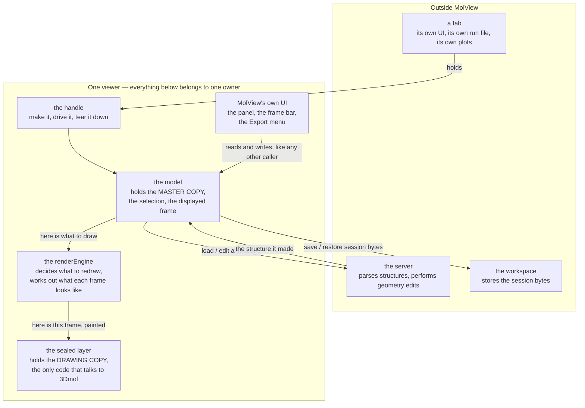
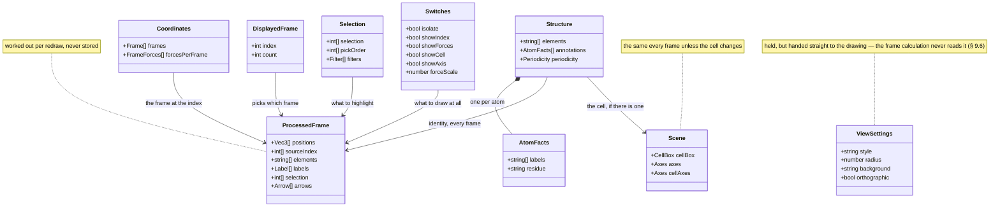
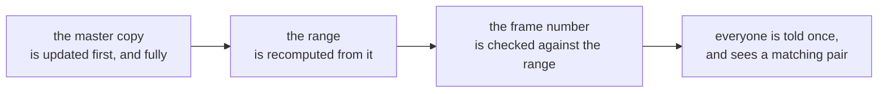
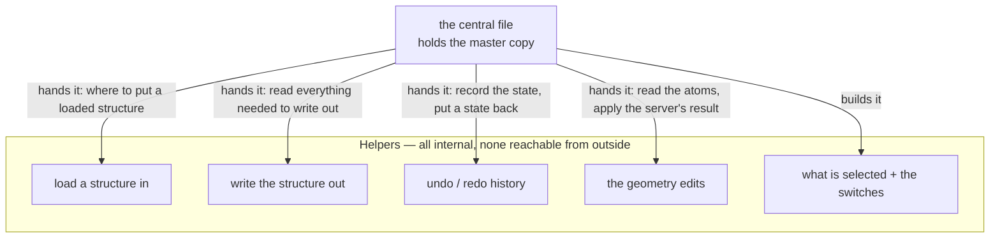
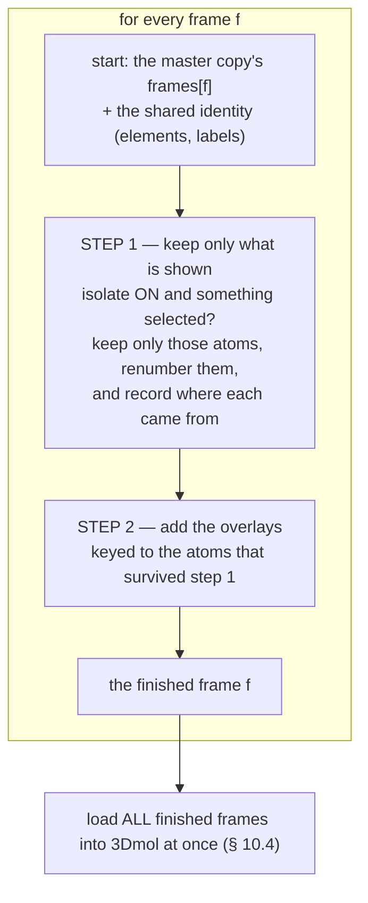
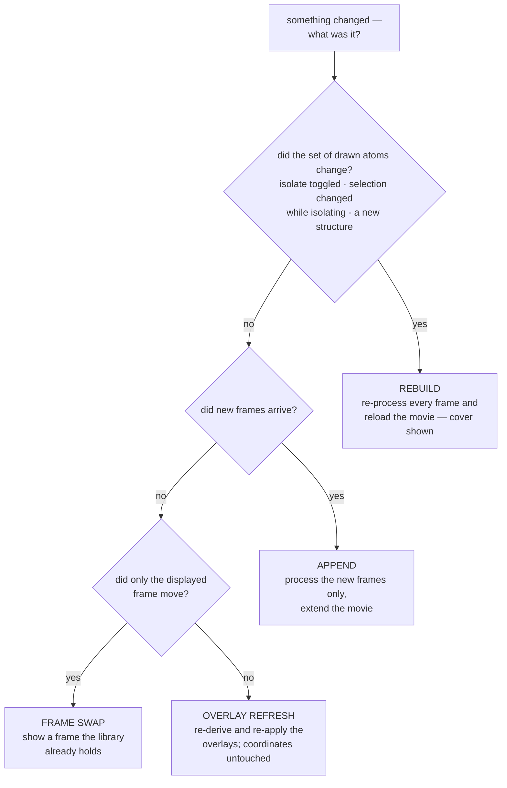
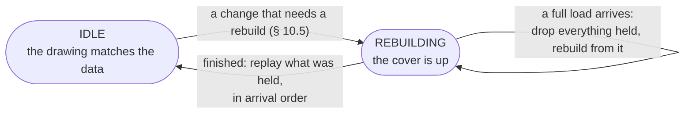
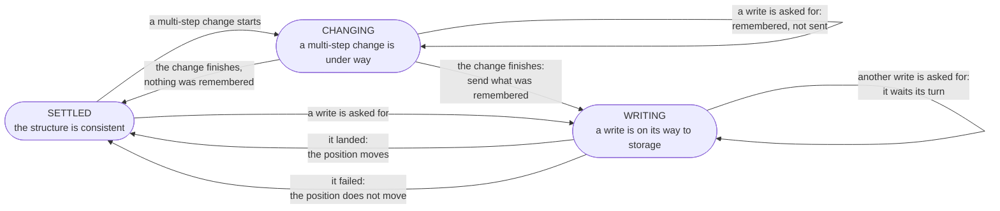
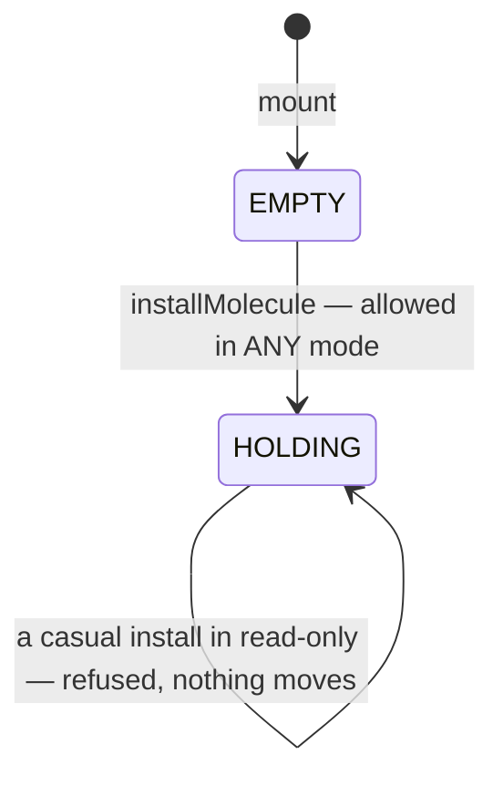
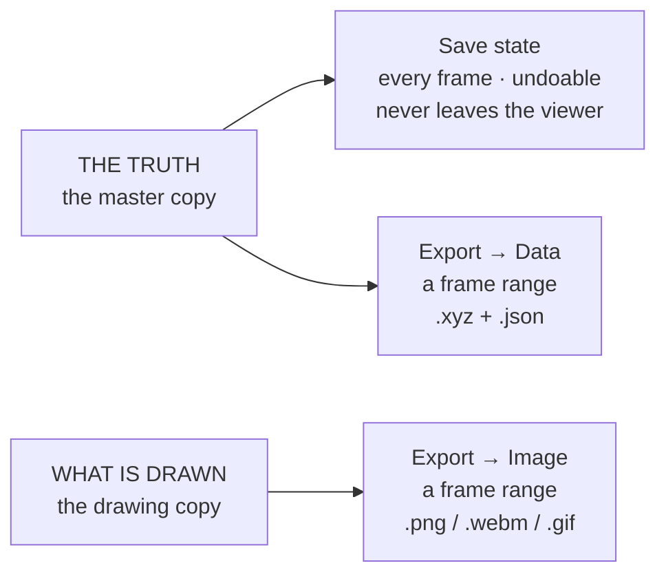

# MolView — the 3D structure viewer

**Role:** contract
**Domain:** web
**Companions:** [`overview.md`](?doc=web/overview.md) (the web start-here map);
[`workspace.md`](?doc=web/workspace.md) (where a saved session's bytes are kept);
[`projects.md`](?doc=web/projects.md) (the file browser that hands structures to
MolView); [`web-api.md`](?doc=web/web-api.md) (the server routes MolView calls);
[`model/structure.md`](?doc=model/structure.md) +
[`model/structure-annotations.md`](?doc=model/structure-annotations.md) (the
structure and the labels MolView carries);
[`model/structure-molstruct.md`](?doc=model/structure-molstruct.md) (the
`.molstruct.json` sidecar it reads and writes). How a user *builds* a structure —
the Modify tab's source panels and its save dialog — belongs to
[`tabs.md`](?doc=web/tabs.md), not here.

MolView is the one 3D molecular viewer used everywhere in the browser. The Modify
tab edits a structure in it; the Results, Spectra and Transport tabs show one in
it without letting you edit. Within Results, the view that opens depends on the
file you picked — a trajectory file opens a view that plays the optimization and
draws its energy and force plots alongside. Every one of them embeds the same
component with the same controls.

**This document is the design of that component** — what it is for, what it
refuses to do, what it holds, how it is layered, what each API is for, how the
pieces fit together, and how its tests are derived. It is not a tour of the
current code.

> **Words used in this document.** A few terms come up constantly. Each is
> defined here in plain terms and used consistently below.
>
> - **A viewer** — one mounted MolView: one 3D window, its panel, its controls,
>   and everything it holds. Two viewers on a page are two of these.
> - **The handle** — the object you get back when you make a viewer. Think of it
>   as the viewer itself; it is the only thing a tab holds.
> - **The model** — the part of a viewer that holds the structure and answers
>   questions about it. Everything that changes the structure goes through it.
> - **The master copy** and **the drawing copy** — the structure exists in two
>   forms, on purpose: the master copy is the real one (every atom, every frame),
>   the drawing copy is what the 3D library was handed to paint. § 6.3.
> - **A frame** — one set of atom positions. A trajectory is many frames of the
>   same molecule; a plain structure is one frame.
> - **Isolate** — the "show selected atoms only" switch.
> - **The renderEngine** — the part that decides what to redraw and works out
>   what each frame should look like. *Not* a calculation engine: SIESTA and
>   PySCF are engines in a completely different sense, and this document never
>   means that one.
> - **The sealed layer** — the one place in this module allowed to talk to
>   3Dmol.js, the third-party library that does the actual drawing. Nothing above
>   it knows that library exists.
> - **The panel** — the strip beside the 3D window: where you select atoms, tag
>   them, and see the unit cell. It belongs to the viewer, not to the tab.
> - **The sidecar** — the small companion file that travels beside a structure
>   file and carries what coordinates cannot: the labels, the cell, what the user
>   said about the atoms. Written as `.molstruct.json`.
> - **A label** — a name a user attaches to a set of atoms: `L-electrode`,
>   `frozen_atoms`, or anything they type (§ 6.6). The atom **numbers** that the
>   `#` switch draws in the 3D window are a different thing entirely; this
>   document always calls those **atom-number labels**, never just "labels".
>   (The switch on screen is named "Show atom labels", which is where the
>   collision comes from.)
>
> Atom numbering: **0-based in code, 1-based on screen**, translated in exactly
> one place (§ 11.5).

---

## 1. The goal

**One 3D molecular viewer, learned once, used everywhere.**

Every place in the app that shows a molecule embeds the same component with the
same controls. A user who learns to select, isolate, measure and scrub in the
Modify tab can do all of it in the Results tab without learning anything new. A
developer who needs a viewer does not build one.

### 1.1 What that looks like in use

This is the behaviour the rest of the document exists to protect. The controls
are the same wherever a viewer appears — with one split: the ones that change the
structure (tagging, editing the cell, the edit operations, saving a state) appear
only in an editable view, because a control that would do nothing should not be
offered (§ 9.4).

**Moving around.** Drag to rotate, scroll to zoom, right-drag (or shift-drag) to
pan. `⟲` re-centres and re-fits the camera. The View menu offers **Perspective**
(natural depth, the default) or **Orthographic** — pick orthographic when you are
eyeballing bond lengths, because it removes the foreshortening that makes distant
atoms look closer together.

**Appearance.** The View menu holds style (stick, ball & stick, sphere, line), a
radius slider from 0.2 to 2.5 that scales stick thickness / sphere size / line
width, and a background colour with preset swatches plus a picker. One preset is
transparent — choose it before exporting a picture to drop onto a slide.

The View menu and the Export menu are not the same kind of thing, and § 11.4 is
why: View changes how the drawing paints what it already has, so it can live in
the 3D window's own controls; Export decides what leaves the viewer and what it
is read from, so it is MolView's.

**The toolbar switches.** Six icon buttons sit down the left edge, always
outside the canvas, never on top of the molecule:

| Button | What it does |
|---|---|
| `⟲` Reset view | re-fit the camera |
| `✚` Show axes | draw the x/y/z axis widget |
| `#` Show atom labels | label every atom with its number |
| `➤` Show force vectors | draw the per-atom force arrows |
| `▦` Show unit cell | draw the periodic cell box |
| `◉` Show selected only | **isolate** — hide every unselected atom |

Isolate turns itself off when the selection becomes empty, since there would be
nothing left to show.

**Selecting.** Click an atom and a soft amber sphere appears over it. The atom
keeps its own element colour and the geometry is not rebuilt, so selecting is
instant even on a large system and the highlight follows the atom as a
trajectory plays. Click again to deselect; selections accumulate. Clicking is
off while isolate is on — with everything else hidden there is no unambiguous
atom to pick — so turn isolate off to select again.

The panel beside the viewer is the other way to select. **Click** mode picks by
hand; **Filter** mode selects everything matching a rule — by element (`Au,C`),
by atom index (`1-4, 6, 10-11`), by residue (`ALA,DA`), or by label
(`L-electrode`). Add several rows and combine them with AND / OR. Switching
between Click and Filter does not disturb what you already have selected. The
panel shows a live count and measurement of the current selection.

**Measuring.** Measurements come from what you selected, in the order you picked
it:

- one atom → its coordinates, `Au #3 — (0.000, 0.000, 0.000) Å`
- two atoms → the distance, `|H #5 – O #1| = 0.957 Å`
- three atoms → the angle, with the **middle-picked** atom as the vertex,
  `∠H #5 – O #1 – H #6 = 104.5°`

**Tagging atoms.** In an editable view the panel tags the selected atoms with a
label — `L-electrode`, `R-electrode`, `bridge`, `interface`, `frozen_atoms`, or
a name you type. They show as chips you can remove. These are not decoration: they are
written into the structure's sidecar file and into the generated input script, so
the calculation and the results view both see what was set here.

Some of those names are **reserved** — they are ordinary labels, but something
downstream knows what they mean. Tagging atoms `frozen_atoms` is how you say
"hold these still", and the calculation is generated with those atoms
constrained. You do not tick a separate box; the label is the mechanism (§ 6.6).

**Playing a trajectory.** When a structure has more than one frame, a playback
bar appears under the viewer: `‹` / `›` step, `▶`/`❙❙` play-pause, `⟳` loop, a
speed box in milliseconds per frame (20–3000, default 150), and a slider with an
`i / N` counter. One frame shows no bar. As it plays, the force arrows animate
with the frames — the largest force is drawn gold, the rest shade dim-red to
orange-red by relative size, so converging forces visibly shrink.

**Keeping a point to come back to.** In an editable view you can save the current
state — the structure as it stands, with the atoms you have picked out — and step
back to it later, even after a reload. It is undo that survives closing the page.
Saving is something you do: nothing is recorded on its own, and a small badge in
the corner says when there is work that is not on the sequence yet. The button
itself belongs to the page rather than to the viewer — in the Modify tab it sits
with the editing (§ 11.2). This is not a file and nothing appears in your project
(§ 11.3).

**Getting things out.** The Export menu offers two things, each with a *Save*
(into the project) and a *Download* row:

- **Data** — the structure itself: coordinates plus the metadata that goes with
  them as `.json`.
- **Image** — a picture of the molecule exactly as it is drawn, transparent if
  you chose that background.

**Each asks which frames**, as a range, and opens on the one you are looking at —
so exporting what is on screen is the default and costs nothing extra. Widen it
and the format follows: one frame of Data is an `.xyz`, a range is an
**extended-XYZ**; one frame of Image is a `.png`, a range is a `.webm` or `.gif`
rendered frame by frame with the view you have set. A structure with one frame
never asks, there being nothing to choose.

Two things are worth knowing about that menu, both in § 11.3: **Data** comes
from the structure while **Image** comes from what is on screen — and *Save*
versus *Download* is only a choice of destination, since MolView produces no
bytes and never writes a file itself. Why it is two items and a range rather
than four items is § 11.3's; who the menu belongs to is § 11.4.

**The unit cell.** When a structure is periodic, the panel shows its cell too, and
in an editable view it can be changed there. A cell edit goes through one door and
only one (§ 9.3), so everything drawn from it — the box, the axes — cannot end up
describing a different cell from the one the structure has.

---

## 2. What MolView is not

Three jobs a viewer could plausibly grow into, and does not. Each boundary is
here for a reason, and each has been crossed at some point by something that
seemed convenient at the time.

A boundary earns a row here only if a viewer would plausibly drift across it.
Jobs that simply belong to other modules are not listed — naming them would keep
them present in a document they have no business being in.

| Not | Whose job it is | Why the boundary is there |
|---|---|---|
| a structure **parser** | the server | one parser, one set of chemistry rules. A parser in the browser would be a second, weaker opinion about what a file means, and the two would disagree on the awkward cases |
| a **file manager** | the projects module | MolView produces and consumes bytes. Where those bytes live on disk is not a viewing concern, and MolView holds no file route |
| a place to **keep** a saved session | the workspace module | MolView decides *when* to save and *how far* to step back; the workspace only knows *where the bytes go* (§ 11.2) |

---

## 3. The overall shape

One picture, then the rest of the document fills it in.



Four things to read off it:

**Data flows down.** The model hands the renderEngine what to draw; the
renderEngine hands the sealed layer a finished frame. Nothing lower ever answers
a question about what the structure *is*. If you want to know where an atom is,
you ask the model — never the drawing. (One narrow thing does travel back up: the
renderEngine asking the drawing whether its own last instruction landed. That
answer goes no further — § 10.10.)

**A tab owns none of it.** A tab has a handle. It does not have the structure,
the renderer, the camera, or a way to reach 3Dmol. What it does own is its own
business: its plots, its parsed run file, its own layout.

**MolView brings its own controls.** The panel, the frame bar and the Export menu
are the viewer's, not the tab's — which is why the same controls appear in every
tab (§ 1.1) and why a tab that wants a viewer builds no UI (§ 11.4). They are
callers of the model like anything else; none of them reaches further down.

**Everything inside the box belongs to one owner.** Mount twice and you get two
of these, sharing nothing — two structures, two selections, two displayed
frames, two cameras. § 5.6.

---

## 4. MolView is a self-contained module

This is worth stating on its own, because everything else depends on it.

**MolView is one ES module, sealed at every edge.** It is imported by name, it
reaches nothing else in the app by name, and nothing in the app can reach inside
it.

**One entry point, and nothing else is importable.**

```js
import { mount, formula } from "/static/lib/molview/index.js";
```

That is the whole surface. `mount` makes a viewer; `formula` turns a list of
elements into a Hill formula and needs no viewer. Every other file in the module
is internal — the model, the stores, the renderEngine, the panel, the sealed
layer. A consumer that imports any of them directly has broken the module, not
found a shortcut.

**Nothing it needs comes from a global.** A viewer needs two things at mount: an
element to live in, and a workspace to save through. Both are handed in. It does
not look up the tab it is inside, does not read app configuration, and does not
consult any other module by name.

**Nothing leaks out.** No 3Dmol object, no store, no DOM node, and no internal
function ever appears on the handle. Within this module the name `3Dmol` occurs
in exactly one file — the sealed layer — which is also the only place that fails
with a clear error if the library is missing. Swapping the drawing library
touches that one file and reaches no consumer of MolView.

**It contains its own state.** The structure, the selection, the switches, the
displayed frame and the session history all live inside the viewer. It keeps
nothing in a global, and nothing outside it keeps a copy of anything it holds.

**The test of all of this:** delete every other web module and MolView still
loads, mounts, draws, selects, measures and exports. The only things it would
miss are the server routes it calls and the workspace it saves through — and
both of those are reached through named routes and an injected accessor, not by
importing anything.

**This is true of the code today.** The module publishes nothing to
`window.molbuilder` — no shared model, no node-test entry point, no readiness
signal. A consumer written against those globals reads `undefined`, and the
answer is to take the handle `mount` returned, which is the only way in (§ 5.6).

---

## 5. The ideas everything else follows from

Six of them. They are the reason every rule below exists, and a design choice
that breaks one is wrong no matter how convenient it is.

### 5.1 What you see is what you get out

The structure on screen and the structure that goes to a calculation are the same
structure, at the same frame. Scroll to frame 40, export it, and frame 40 is what
the file holds (§ 11.3).

"Which frame am I looking at" and "which frame am I working on" must not be able
to have different answers — which is why there is exactly one number saying which
frame is displayed, held in one place and read by everyone (§ 6.4).

### 5.2 One place holds each fact

Every fact — the atoms, the cell, the selection, which frame — has one home. Two
copies of a fact are two things that must be kept in step, and every mechanism
for keeping them in step is a place they can fall out of step.

Where two forms genuinely must coexist — the real structure and the cut-down
thing the graphics library draws (§ 6.3) — one of them is unambiguously the real
one, the other cannot be reached as an answer to anything, and a single number
joins them.

### 5.3 The graphics library is invisible

Nothing above the sealed layer knows the viewer is 3Dmol — not a tab, not a
panel, not the renderEngine. This makes "the same viewer everywhere" a property
of the code rather than a convention people have to remember.

### 5.4 A host needs to know nothing

Hand MolView somewhere to live and a workspace, and get back a viewer. No
knowledge of rendering, of how structures are parsed, or of how sessions persist.
The handle is deliberately small (§ 9.2) so that embedding a viewer is never a
project.

### 5.5 The user's intent is data, and it travels

What a user does in the viewer is not decoration, and each kind of intent has its
own way of surviving the trip out:

- **the labels they attach** go into the structure's sidecar and into the
  generated input script, so the calculation and the results view both see them
  (§ 6.6);
- **the atoms they picked out** decide what an edit acts on, and come back with a
  restored session (§ 11.2);
- **the frame they stopped on** is the frame an export writes (§ 5.1, § 11.3).

Three different journeys, and they are worth keeping apart — collapsing them into
"the user's state gets saved" is how a document comes to promise that the frame
you were looking at is stored somewhere, which it is not (§ 11.2). The viewer is
where scientific intent gets expressed, so none of it may be silently lost between
here and the calculation.

### 5.6 A viewer is owned

**Every mounted viewer is its own MolView, and it belongs to its owner.** Two
viewers on one page are two structures, two selections, two displayed frames,
two cameras — not one set of facts they fight over. The `owner` given at mount is
what makes that true, and it names *everything* the viewer holds.

This is what makes § 5.2 mean anything: "one place holds each fact" is only a
real rule once *which viewer's* fact you mean is unambiguous. A single structure
shared behind two viewers is not one home for a fact — it is one home for two
facts that happen to collide.

It follows that **the handle is the way in**. A tab holds a handle, a handle *is*
a particular viewer, and there is no global to look one up in — so a tab cannot
reach the wrong viewer by accident.

---

## 6. The data a viewer holds

A viewer holds **one structure**. If it came from a trajectory, it holds **many
frames** of that same structure and **one number** saying which frame you mean.
It holds **what is selected**, **which switches are on**, and **how the molecule
is being drawn**. Everything else you see — the drawn atoms, the arrows, the
highlight — is worked out fresh on each redraw and never stored.

Everything in this section belongs to one owner (§ 5.6). Two viewers hold two of
all of it.

### 6.1 The five things it holds

**The structure — the same for every frame.** Per atom: its element, the labels
it carries, and its residue name. Plus, for the structure as a whole, an optional
unit cell.

A residue name is always there. A format that carries residues — a PDB — supplies
real ones; a format that does not gives every atom the placeholder `MOL`, which is
the structure model's own default and not something MolView invents or fills in
(see [`model/structure.md`](?doc=model/structure.md)). The viewer stores whichever
it is handed and reads nothing into either.
A frame never carries any of these; they are fixed when the structure loads and
are identical for frame 0 and frame 400. That is exactly what makes a trajectory
*one molecule moving* instead of a sequence of different molecules.

**The coordinates — one set per frame.** `frames[f][a]` is atom `a`'s position in
frame `f`. Per-atom forces, when a calculation produced them, sit in a matching
list of the same shape. A structure that is not a trajectory is simply a list of
**one** frame.

**Which frame, and how many there are.** One number saying which frame is meant,
and the range it is allowed to be in. They are held together because neither is
usable alone (§ 6.4).

**What is selected, and which switches are on.** The selected atom numbers with
the order they were picked in — a three-atom angle has to know which one was
picked second — the filter settings, and the on/off switches: isolate,
atom-number labels, force arrows, unit cell, axes, and the arrow scale.

**How it is drawn.** Style, radius, background colour, and perspective or
orthographic. These are held like anything else a user set, and they are listed
last because they are the one group the frame calculation never reads — they go
straight to the drawing (§ 9.6). The camera is not held here or anywhere else
above the drawing itself (§ 9.6).

### 6.2 The shapes



**The structure and its coordinates:**

| Field | Shape | What it is |
|---|---|---|
| `elements` | `string[]` | element per atom. **Shared by every frame.** |
| `annotations` | per atom: the labels it carries, and its residue name — a real one from a format that has them, or the model's `MOL` placeholder from one that does not (§ 6.1) | **Shared by every frame.** These are facts about the molecule, not switches — the panel reads them, writes them and filters on them (§ 9.5); the drawing does not use them. Writing one is a change to the structure, gated like any other (§ 9.4). Some label names are **reserved** and mean something downstream (§ 6.6) |
| `periodicity` | the a/b/c vectors, the corner the box is anchored at, how each axis is treated — repeating, isolated, or a transport lead — how much empty space an isolated axis should have, and beside each of those the **resolved** answer the server worked out. `null` when the structure has none | **One fact that travels together**, which is why there is one door to change it (§ 9.3). **Carried under the field names it arrives with** — `cell`, `cell_origin`, `axis_kind`, `vacuum` — which are the same names the sidecar on disk uses, because both are the codec's. MolView holds the block, offers it, edits it through that one door, and interprets none of it. Those names and the rules for resolving them belong to [`model/structure-periodicity.md`](?doc=model/structure-periodicity.md) |
| `frames` | `Vec3[][]` | `frames[f]` = the coordinates of frame `f`. At least one. **Coordinates only** — no elements, no labels |
| `forcesPerFrame` | `Vec3[][]` or `null` | `forcesPerFrame[f]` = the forces of frame `f` |

> **A carried block keeps its own names.** MolView renames nothing it does not
> interpret. The module once called this block `{lattice, origin, …}` and renamed
> it at both edges, and then read `.lattice` from a block that has never had that
> key — so the cell was `null` for every structure ever loaded, the box could not
> be drawn, the axes always fell back to the Cartesian triad, and an export
> carried no cell. Nothing failed, because a missing key reads as "this structure
> is not periodic", which is an ordinary answer. A second name for a fact you do
> not own buys nothing and costs exactly this.
>
> The one place the drawing's own words appear is the box handed down to it,
> which calls the vectors a lattice — a translation into the drawing's vocabulary
> at the layer that already does that for `style` → `rep` (§ 9.8).

Atom **count**, `elements` and `annotations` are fixed when the structure loads
and are identical for every frame. That *is* the same-atoms rule of § 10.8.

Those three — element, labels, residue — are exactly what the filter enumerates
from an atom (§ 9.5). They are the same list, which is why filtering needs no
case per property.

**The switches.** Only `selection` and `isolate` change which atoms are drawn at
all; every other switch adds or removes something drawn alongside them. That is
why turning atom-number labels or the cell on never rebuilds the geometry (§ 10.5).

### 6.3 Two copies, and which one answers what

The coordinates exist in **exactly two** forms, and only two.

**The master copy — the real structure.** Every atom, every frame, in the
original order. This is what gets measured, exported, saved, and handed to a
calculation. It is kept clean — never overwritten with a cut-down list — so every redraw
starts from it rather than from whatever is currently on screen. That is what
lets the whole structure come back the moment isolate is turned off.

**The drawing copy — what the graphics library was handed.** Under isolate the
unselected atoms are gone from it entirely and the survivors are renumbered. The
movie itself is coordinates; what is drawn beside the atoms sits over it as
free-standing shapes (§ 10.6). It can answer exactly one question: what is
currently painted on screen.

**There is no third copy, and adding one is a design error.** A tab may hold its
own parsed run file — but that file carries *different* facts (energies, forces
per step, SCF history), not another copy of the coordinates. It feeds MolView; it
is not one of MolView's two.

Each question routes to the copy that can answer it, and the displayed frame
number is what routes them:

| The question | Answered from | How |
|---|---|---|
| Which frame is displayed — and which one an export writes? | the displayed frame number | `currentFrame()` |
| Where is **every** atom at that frame — to measure it, to export it | **the master copy** | `getFrameAllAtoms(i)` |
| What is on screen right now? | **the drawing copy** | nothing outside the renderEngine asks it, and nothing ever asks it for coordinates. It is output, not a source — the one exception is the renderEngine checking its own work (§ 10.10) |
| What was the energy / SCF history at that step? | not MolView's data at all — the tab's own run file | the tab reads its own file, at the same frame number |

### 6.4 The displayed frame and the range it lives in

**They are one fact, kept in one place.** A frame number without the range it is
valid in cannot be used for anything — you cannot draw a slider, clamp a seek, or
follow the end of a growing run without both. So they sit together, are updated
together, and are read through one API. Splitting them is how a slider comes to
offer a frame that nothing can draw.

**Nothing anywhere keeps its own copy of either.** Not the renderEngine, not the
sealed layer, not a tab, not the frame bar. There is nothing to gain: it is one
integer, read a handful of times per redraw, so a private copy saves no
measurable work. What a copy *does* buy is a second thing to keep in step — and
this number answers two questions that must never disagree (what is on screen,
what gets saved). A copy is precisely how they would come to disagree.

**Both answer to the master copy, in this order:**



1. **The master copy is updated first, and completely.** A load, an append, an
   edit, a restore — it reaches its final state before anything else moves.
2. **The range is recomputed from it.** Not from the drawing copy, and not from
   what the caller said it was adding. The master copy is the only thing entitled
   to say how many frames exist.
3. **The frame number is checked against that range** and moved if it no longer
   fits.
4. **Only then is anyone told**, and what they see is a matching pair.

No one ever observes a half-updated state. There is no moment when the range
belongs to the new structure and the frame number still belongs to the old one,
because nobody is notified until both have settled. This is what makes "what you
see is what you get out" survive a structure changing underneath a user.

**Three kinds of access, and no fourth:**

| | Who uses it, and why |
|---|---|
| **read** — `currentFrame()`, `frameCount()` | anyone who needs to know which frame is meant and how many there are: the frame bar, the measurement readout, an export, a tab |
| **write** — `setCurrentFrame(i)` | anyone who moves it: the frame bar, playback, a tab following the end of a growing run, a session being restored. A number outside the range is resolved against the range, never taken on trust |
| **subscribe** — `onFrameChange(fn)` | anyone who must react: the slider and its counter, the measurement readout, the renderEngine |

**Every UI reads and sets the displayed frame through exactly this API** — the
frame bar under the viewer, a tab's own scrubber, a keyboard shortcut, playback,
a restored session. There is no privileged writer and no back channel. A UI that
tracked the frame itself would be a second answer to a question that must have
one, and it would be the stale one the moment anything else moved it.

The write is the only way it moves, and it tells **every** subscriber regardless
of what did the moving. A subscriber never has to know which; nothing anywhere
needs its own "did it change?" check.

**It is deliberately not one of the switches.** Playback moves it many times a
second, and pushing that through the switch store would re-render the selection
panel that often and steal focus from a filter box mid-play. A switch is
something a user sets; this is something a movie drives.

### 6.5 Worked out fresh on every redraw, never stored

One frame, after the switches have been applied, becomes a **processed frame** —
and that is the only *per-frame* thing that ever goes down. (The cell geometry,
the axes and the busy-state cover also travel down; none of those is per frame —
§ 10.3.)

| Field | Shape | What it is |
|---|---|---|
| `positions` | `Vec3[]` | the atoms **actually drawn** — cut down to the selection when isolate is on |
| `sourceIndex` | `int[]` | `sourceIndex[m]` = the **original** number of drawn atom `m`. This map from drawn back to original is why labels still show the right number under isolate |
| `elements` | `string[]` | element per **drawn** atom |
| `labels` | `{position, text}[]` or `null` | the atom-number labels — *not* the labels a user attaches — when that switch is on. `text` is the **1-based original** number (§ 11.5) |
| `selection` | `int[]` or `null` | which drawn atoms to highlight. `null` means *draw no highlight* — which happens both when nothing is selected and under isolate, where every drawn atom is selected and a highlight would say nothing |
| `arrows` | `{start, end}[]` or `null` | force vectors for **this** frame, where `end = start + force × scale` |

The cell box and the axes are **not** in here. They are the same for every frame
unless the cell itself changes, so they are worked out once as scene-level data
and are not recomputed per frame.

**`selection` here is content, not styling.** It says *which* atoms are
highlighted. What the highlight looks like is a fixed constant owned by the
sealed layer — a translucent sphere, amber `#ffd54a`, radius 0.7, opacity 0.5 —
re-placed each frame so it follows moving atoms. Keeping the appearance out of
the per-frame data is what keeps every frame's data identically shaped, and it
means a selected atom keeps its own element colour with the highlight simply
sitting over it.

**Under isolate, the 3D window is display-only.** In-window clicking is off,
because a drawn atom's number no longer equals its real number. The panel curates
the selection instead and always speaks in original numbers. Measurement is a
separate thing from drawing: it takes its atoms from the panel's selection and
reads their coordinates from the **master copy** at the current frame, so it
stays correct and frame-aware without touching the drawing at all. Clicking
returns when isolate is off, where drawn number and real number agree again.

### 6.6 Reserved labels — one mechanism, interpreted at the end

A label is just a name attached to a set of atoms. **Some names are reserved**:
they are stored, filtered and displayed exactly like any other label, and the
only difference is that something downstream knows what they mean.

Today's set is `frozen_atoms` and the transport vocabulary — `L-electrode`,
`R-electrode`, `bridge`, `interface`. They are named here as examples, not as a
list this document keeps: **the list lives with the labels themselves**, in
[`model/structure-annotations.md`](?doc=model/structure-annotations.md), keyed by
name and next to the description each one shows a user. That is deliberate, so
that adding a reserved meaning touches that list and its translator and nothing
else — not this document, and nothing in the viewer.

**MolView does not interpret any of them.** It stores them, offers them in the
label list, filters by them, and writes them out. What `frozen_atoms` *means* —
that those atoms are held still, which becomes a constraints block in a SIESTA
input or a freeze list for a geometry optimiser — is decided by the code that
generates the input, not here. The viewer's job ends at "these atoms carry this
name".

**Typing a reserved name is allowed, and the viewer says so.** A user can type
any label they like, including a reserved one. Nothing refuses it — refusing
would be inventing a rule, and a reserved name is *just a label*, which is the
entire point. What happens instead is that the moment what they typed matches a
reserved name, the viewer tells them: **this name is reserved, and here is what
it does.**

That turns the one real hazard into an informed choice. Somebody labelling a
group `frozen_atoms` as a note to themselves would otherwise have those atoms
silently constrained in the next calculation; now they are told before it
happens, and can pick another name or go ahead deliberately.

**Knowing a name is reserved is not interpreting it.** MolView reads that list —
the names and the one-line description each carries — so it can name the conflict
and explain it. It never
*acts* on the meaning: no code here holds an atom still, and tagging atoms
`frozen_atoms` changes what is stored and nothing about what is drawn. Carrying a
description to show a user and implementing a behaviour are different things, and
only the first is a viewer's business.

**Why it is worth being strict about this.** A reserved meaning costs a **name**
and **one accessor** — nothing else. The alternative, which this design rejects,
is to give each special meaning its own storage: its own field on the structure,
its own kind of thing to filter by, its own key in the saved file, its own
control in the panel, and a translation between the name the user sees and the
name the field has. That is five places to keep in step for something a label
already expresses.

**The accessor is the only way in.** Because something downstream acts on a
reserved name, that name gets exactly one designated read — `getFrozen()` for
`frozen_atoms`. It is a **cut of the label store, not a second home**: it reads
the same list `getRegions()` reads, so it cannot go stale, and it exists so that
"which atoms carry this name" is answered in one place rather than at every point
of use. What the rule forbids is the other way of getting there — a caller
reaching into the label store for the reserved name itself. Two callers spelling
that name in two places is how two spellings become three, and it is the same
defect as a separate field, arrived at from the other side.

So adding a reserved meaning later is a name and one accessor. It changes neither
what a viewer holds nor anything in this document.

> **Both ends hold this now** (2026-07-31). `frozen_atoms` used to be the odd one
> out — stored as a field of its own and *shown* as a label — and it had already
> cost what this section predicts. The server sent the fact twice, as a label and
> as an `is_frozen` flag, so the selection panel would have rendered an atom's
> frozen state twice; the workaround was to supply the label on
> `/api/selection/eval` and withhold it on `/api/selection/atoms`, which left two
> routes giving different answers about the same structure. MolView carried the
> matching pair of translators, one at each boundary. All of it is gone with the
> second store: see [`model/structure-annotations.md`](?doc=model/structure-annotations.md)
> § 2 for the structure model's end, and § 4a there for the saved file.

### 6.7 What a viewer does not hold

| Not held | Whose it is | Why |
|---|---|---|
| parsed structure text | the **server** | MolView never parses. It posts bytes and adopts the structure that comes back (§ 11.1) |
| files on disk | the **projects** module | `exportFile(range)` returns the structure **as data, not bytes** (§ 11.7); MolView owns no file route **and writes no file-handling code of its own** — see below |
| the saved session bytes | the **workspace** module | MolView decides when and how far; the workspace knows where (§ 11.2) |

---

## 7. The layers

Seven levels, read from outside in: a tab at the top, the drawing library at the
bottom. Each level owns one thing, offers one surface, and has exactly one kind
of caller. **The "never" column is what stops a fact quietly acquiring a second
home** — it is the enforceable half of § 5.2.

| | The level | What it offers, and who calls it | Never |
|---|---|---|---|
| **1** | **the tab** | *No API — it is the caller.* Owns its own UI, its own run file, its own plots. Holds a handle and reaches its viewer only through it | keeps its own copy of the displayed frame, the range, or anything else the viewer holds; reaches past the handle; consults its own file to answer a question about the viewer |
| **2** | **the handle** | Making, driving and tearing down a viewer (§ 9.2). A handle *is* a viewer: one owner, one structure, one of everything. Called by a tab | holds structure data of its own, or answers a question the model already answers (§ 9.2) |
| **3** | **the model** | The data API (§ 9.3), one per owner. Called through the handle, and by every level inside the same viewer. **Holds the master copy**, the selection, the displayed frame and its range. This is where the rules are enforced and where read-only is applied, so nothing may go around it | touches the drawing library; exists as one shared instance behind several viewers |
| **4** | **the stores** | Change-and-subscribe. Assembled by the model and reached only through it (§ 9.3), so a change asked for through a store meets the same rules as one asked for anywhere else (§ 9.4). They exist so state has a home that knows nothing about drawing | draw anything; hold the displayed frame — that is not a switch (§ 6.4); be kept by anything outside the viewer once it has been reached |
| **5** | **the renderEngine** | Commands only — "draw this", "add these frames", "the forces changed", "throw it away". **Called only by the model.** It is *handed* the master copy, the selection and the switches, works out what each frame looks like, and passes the result down. It holds nothing of its own | keep its own copy of the displayed frame; answer a question about what the data is; run a change notification of its own |
| **6** | **the drawing commands** | Small, decision-free operations that translate a processed frame into calls the library understands, plus two questions the renderEngine asks *about the drawing* to check its own work (§ 10.10). **Called only by the renderEngine.** It owns exactly one fact: the multi-frame format the library expects | decide how much work a change needs; hold state; answer anything upward |
| **7** | **the sealed layer** | The only code that names 3Dmol. **Called only by level 6.** **Holds the drawing copy** — the movie, the camera, the styles, the picking, the highlight spheres | keep its own frame number, or be a source of truth about coordinates. It draws the frame it is handed and offers no way to read coordinates or frames back out |

### 7.1 Where the two copies sit

The model (level 3) holds the **master copy** — that is what a save, an export, a
measurement and a server request all read. The renderEngine (level 5) is *handed*
it, works it through the switches, and produces the **drawing copy**, which lives
in the sealed layer (level 7) and exists only to be looked at.

Data goes down. Nothing comes back up. The one thing that crosses levels in both
directions is a *question the renderEngine asks about its own work* (§ 10.10), and
that answer never reaches a user.

### 7.2 The shape of each surface tells you its job

The handle is nouns and lifecycle, because a tab wants *a viewer*. The model is
reads and writes with rules attached, because it is the only place truth changes.
The renderEngine is commands only, because a renderer is told what to do and not
consulted. Level 6 is operations with no decisions in them, because deciding is
level 5's job.

When a surface starts growing the wrong kind of thing — a read appearing on the
renderEngine, a decision appearing at level 6 — that is the signal a
responsibility has leaked, and it is visible before anything breaks.

### 7.3 Inside the model: one file, and helpers it hands work to

The model is not one big file. **One central file holds the structure, and hands
each real job to a small helper that does only that job.**

**When the central file builds a helper, it hands over exactly the functions that
helper is allowed to call.** The helper never reaches out on its own. The history
helper is the clearest case: it has to save and restore the structure, but it
does not need to know the file format — it is simply handed a "record the state"
function and a "put a state back" function. That keeps each helper small,
testable on its own with stand-in functions, and replaceable without disturbing
anything else.



| Helper | Its job | What it is handed |
|---|---|---|
| load | put a loaded structure into the model | where to put it; how to announce a change; a way to record the first state |
| write out | read the structure out, for export and for saved states — as data, never as text (§ 11.7) | read-only access to the atoms, cell, selection and history position |
| history | undo / redo (§ 11.2) | "record the current state" + "put a state back"; where the bytes go |
| edits | the geometry operations (§ 11.1) | read the atoms; apply the structure the server sends back |
| selection | what is selected + the switches (§ 9.5) | *(an optional starting selection)* |

The cell is **not** in this list, deliberately. It is a field of the structure
(§ 6.2), so it lives with the structure and is edited through the one cell door
(§ 9.3). A helper holding "the cell" beside the structure that already has one
would be a second home for it, which is the thing § 5.2 exists to prevent.

Two more groups sit beside the model and are built the same sealed way: the
**renderEngine**, which turns the master copy into what you see, and the
**selection panel**, which is the panel you click in, the click-to-select wiring,
and the distance/angle maths. The panel reads what is selected; it never talks to
the 3D window directly.

---

## 8. Making and tearing down a viewer

```js
import { mount, formula } from "/static/lib/molview/index.js";

const viewer = await mount(hostEl, workspace, {
  owner: "results-structure",
  mode: "readonly",
});
if (!viewer.ok) {
  console.error("viewer failed to mount:", viewer.error);
  return;                    // dispose() is safe to call anyway
}
// … use it …
viewer.dispose();            // tears down in reverse order of assembly
```

`mount` assembles a complete viewer in one call — the 3D window, the panel beside
it, the switches, and MolView's own menu surface (§ 11.4). The frame bar is the
one piece that is not decided at mount: a viewer mounts before it has a structure,
and the bar appears once a structure with more than one frame is loaded into it.

The **workspace** handed in is a door, not a module: anything that can store and
return bytes satisfies it. That is what lets a viewer mount in a test page with a
stand-in, and it is the whole of § 4's "nothing it needs comes from a global".

**Anywhere a structure leaves MolView, it leaves through a door handed in the
same way.** The session history writes through the workspace; an export goes
through a **files** door. MolView hands over the **structure** and names the
destination — it produces no bytes and reaches no file. Turning a structure into
a coordinate document and its sidecar is the server's one generator, which the
door asks; that is what makes "a project save and a download are the same bytes"
a consequence rather than a promise (§ 11.7).

**`owner` names the viewer, and therefore everything in it.** It is not a prefix
on a settings key; it is the identity of an instance. The structure, the
selection, the switches, the displayed frame and its range, the session history,
the renderEngine and its sealed layer all belong to that owner. Two
mounts with different owners share nothing (§ 5.6). A viewer with no owner has no
identity, which is why one is always given.

**`mode: "readonly"`** freezes the master copy and changes nothing else — § 9.4.

**Mount always resolves; it never rejects and never returns nothing.** It always
gives back an object with `ok` and a real `dispose`. On success `ok` is true; on
failure `ok` is false and `error` says why, and `dispose` still works. A viewer
that cannot fit — a host narrower than the card's minimum width — renders a blank
card with the error written in it, rather than a half-built viewer.

> **Transition.** MolView can also wire itself into a pre-built card that the
> host laid out, instead of building its own. That path exists for the Modify
> tab's template and is being removed; new hosts hand over an empty element.

### 8.1 What the card is made of

One card holds two things side by side: the **3D window**, and the **panel** you
select in. Between them sits the **fold handle**.

Down the window's left edge, **outside it**, the **rail** — the six toolbar
switches of § 1.1. It is beside the window and not on top of it, which is why the
card's own width includes it rather than the drawing losing space to it (§ 8.2).

Along the window's top edge, MolView's own **chrome row**: the **View** and
**Export** menus (§ 11.4), and the **frame bar** beside them once a structure has
more than one frame. Over the window's remaining corners, the **overlays** — the
busy cover, the unsaved badge, the measurement readout.

That is the whole of what MolView draws. A host hands over an empty element and
gets all of it; there is no per-host stylesheet and no arrangement to opt into.

**The panel has two pages**, switched by a tab bar at its top: **Selection** —
the mode toggle, the filter rows or the atom list, and the label controls — and
**Cell**, a read-only readout of the resolved periodicity. Switching pages never
resizes the card.

### 8.2 How it sizes, and the one number a host must respect

**The 3D window is a square**, and it never grows to fill the card. Whatever
width is left over goes to the panel. That is the whole layout rule, and every
number below is derived from it rather than chosen.

| | |
|---|---|
| the window | a **1:1 square**, bounded below by a minimum and above by a maximum edge |
| the panel | **the leftover width**, with a minimum of its own |
| **the panel's height** | **the square's edge — the same value the window uses** |

That last row is the one worth reading twice. The panel is not measured and it is
not told a height by script: it is given *the same* extent the square is, so the
two bottom-align at every width **with no JavaScript and no fixed number
anywhere**. A layout that computed the panel's height from the window's would be
a second place the same fact lives, and it would be wrong for one frame after
every resize.

**The card's minimum width is the wider of the two pieces, not their sum.** Below
the sum, the card does not break — it **stacks**, window above panel, and both
are still usable. So the floor a host has to respect is the *stacked* minimum,
and only a host narrower than that is the broken embed § 8 describes, the one
that gets a blank card with the error written in it.

Getting that backwards — treating the side-by-side sum as the floor — makes
MolView refuse to mount in hosts where it would have worked perfectly well by
stacking.

**Everything resolves against the card, not the viewport.** The card measures
itself, so the same module dropped into a wide tab, a narrow inspector or a test
page lays itself out correctly with no per-host CSS. One consequence is a rule:
the *only* place a viewport-relative measure is allowed is the square's maximum
edge, which exists to stop the window swallowing a tall screen.

### 8.3 The fold

The panel folds away, and what "away" means depends on which layout is showing:
**width** collapses to nothing when the two sit side by side, **height** does when
they are stacked. The window does not move either way — folding gives space to
the page, not to the window.

**The handle's arrow points where the panel will go**, not at where it is. Side by
side with the panel on the right: unfolded it points left, *"collapse this away"*;
folded it points right, *"bring it back out"*. Stacked, the same rule reads up and
down.

**The arrow rotates; the handle does not.** Rotating the handle itself would swap
its width and height, which in the stacked layout turns a small grip into a tall
rail lying across the window. Only the glyph turns.

### 8.4 The panel reads one state, and it reads it whole

The panel is a **reader of the selection store** (§ 9.5), and the shape of that
relationship is as much a part of the design as the store's contents.

**One state, handed over whole.** The panel does not assemble what it draws from
a dozen separate reads; it is given a single settled snapshot — what is selected
and *in what order*, which editor is showing, the filter rows and how they
combine, and every switch. It is handed one on subscribing, so the first paint
needs no separate fetch, and another after every change.

That is not a style preference. It is the fix for a real failure: the pick order
was maintained correctly inside the store for months and simply **left out of the
snapshot**, so the panel read nothing, silently fell back to guessing an angle's
vertex from geometry, and the chemist's-pick rule of § 11.6 was dead end to end
while looking implemented. **A fact the store keeps but does not hand over does
not exist.** One snapshot with everything in it is what makes that failure
impossible rather than merely unlikely.

**The filter is edited a row at a time.** A user adds a row, types in it, changes
its kind, removes it, and chooses how the rows combine — each of those is its own
small change, because that is what the controls are. A surface that only accepted
the whole set of rows at once would make the panel rebuild and re-send state it
was in the middle of editing.

**The rules the rows become are the server's, not MolView's** (§ 9.5, § 11.1).
The panel names its rows in the same vocabulary the server evaluates, so there is
no translation table in between to drift — with the single exception of atom
numbering, which crosses at exactly one point (§ 11.5).

### 8.5 The controls, and what each one reads

Every control MolView draws is a **caller of the model** — the same doors a tab
would use, meeting the same rules and the same read-only gate. None of them holds
a fact of its own, and none reaches the drawing directly.

| The control | Reads | Writes |
|---|---|---|
| **the frame bar** — slider, ‹ ▶ ›, loop, speed | the displayed frame and the count, from the model (§ 6.4) | the displayed frame, through the one write everyone uses; play, pause and loop, through the handle (§ 9.2) |
| **the rail** — atom numbers, forces, cell, axes, isolate, Reset (§ 1.1) | `selection`, for the lit state of each switch | the five switches to `selection`; **Reset** writes nothing — it re-fits the camera through the handle, the one thing on this card that is neither data nor a switch (§ 9.6) |
| **the View menu** — style, radius, background, projection | `view` | all four to `view` |
| **the panel** | one snapshot of `selection` (§ 8.4) | the selection, the switches, the filter rows, and labels |
| **the measurement readout** | which atoms are picked **and in what order**, from `selection`; their coordinates from the **master copy** at the current frame | nothing |
| **the Export menu** | what to export, over which frames, and where it goes (§ 11.4); the frame range's default from the model (§ 6.4) | nothing in the viewer |

**The frame bar is the clearest case of "one control, two owners."** The frame
number is the model's (§ 6.4) and playback is the handle's (§ 9.2), so the bar
reads each from where it lives rather than from whichever object is nearest. A
bar that read the frame from the handle would be reading a mirror — and § 9.2
retires exactly those forwarded reads.

**The rail and the View menu hold two different kinds of thing, and § 9.6's
question is what sorts them.** *Does working out what a frame contains require
reading this?* Atom-number labels, force arrows, the cell, the axes and isolate:
yes, so they are switches and they live in `selection`. Style, radius, background
and projection: no, so they go straight to the drawing and live in `view`.

That is why they are two controls and not one menu with two halves. A switch
changes **what is in the picture** and a user reaches for it while looking at the
molecule — so it is one press on the rail, always visible. A drawing setting
changes **how the same picture is painted**, is set once and left, and can afford
to be a menu away.

Neither is a second home for anything: both write into the store that owns the
fact, exactly as the panel does (§ 11.4 — where a control sits and where a fact
lives are different questions).

**The measurement readout never touches the drawing.** It takes atom numbers from
the panel's selection and coordinates from the master copy, which is exactly why
it stays correct while a trajectory plays and under isolate, where the drawn
numbering no longer matches the real one (§ 11.6).

**Reset is the handle's**, and it is the one control here that writes to neither
store. § 9.6 keeps the camera out of every layer above the drawing, so there is
no setting for Reset to change and nothing to read back: it is an **action on the
window**, like playback, and it sits where playback sits. Any other owner would
have had to hold something about the camera in order to offer it.

---

## 9. The APIs, and who each one serves

Eight surfaces, outermost first — each with who calls it and what it is for —
plus one rule (§ 9.4) that cuts across all of them.

### 9.1 The module entry point

`mount` and `formula` (§ 4). Nothing else in the module is importable, and this
is the only import a consumer ever writes.

### 9.2 The handle — for a tab that wants a viewer

**What it must be able to do, and what it refuses:**

| A tab must be able to | Refused, deliberately |
|---|---|
| find out whether it got a viewer, and tear it down | reaching the 3Dmol object, or the DOM inside the card |
| reach everything this viewer holds — the structure, the selection, the frames, the drawing settings | reaching *another* viewer's; or reaching any of it except through the model, which is where the rules and the read-only gate live |
| run the movie — play, pause, ask whether it is playing | owning the timer. Playback lives in the mount layer and moves the frame through the same write everyone else uses (§ 6.4) |
| hear that something changed | polling for it |
| change what the viewer shows — the data, a switch, a drawing setting (§ 10.1) | hand in a finished appearance. There is no "set the arrows", "set the atom-number labels", "show a busy state", "add a toggle". Arrows, labels and the highlight are **worked out from the data** by the renderEngine, never given to it |

**The handle contains the model; it does not mirror it.** This is what being
owned forces. When there was one shared model, a handle that also carried
`getStructure`, `getFrameAllAtoms`, `currentFrame` and the rest was a convenience
— two ways to the same object. Now that each viewer owns its model, a mirrored
read is a *second surface over the same fact*, and one of the two is the one
somebody forgets to update. So the handle carries lifecycle, playback, and one
route to the model; the model carries the data API with the selection and view
stores beneath it.

Adding a read to the handle that the model already answers is the specific move
this rule forbids.

In the examples below that one route is written `viewer.data` — the handle is the
viewer, and `viewer.data` is that viewer's model. There is no other way to it,
and no other viewer's model is reachable from it.

**This is true of the code today.** The handle carries eleven names and not one
of them mirrors the model: `ok` and `error`, `dispose`, `data`, `play` / `pause`
/ `isPlaying` / `setLoop` / `getLoop`, `onChange`, and `resetView`. There is no
forwarded read left to retire.

### 9.3 The model — the one place the structure lives

Every read of data returns a **copy**, so changing what you were given can never
change the viewer. The two entries that are not data — `selection` and `view` —
are doors rather than values: reaching one is how you *ask* for a change, and
every change asked for through one meets the same rules as a change asked for
here (§ 9.4). Nothing outside holds on to a door after it has used it.

The surface is organised by **what a caller needs**, not by how the internals
happen to be split. **One need, one main way in.** Where several names serve one
need, exactly one is the main one and the rest are narrower cuts of it; a cut may
disappear, but it must never grow into a rival.

**One exception, and it is a strengthening.** The cut for a **reserved** label
(§ 6.6) is not optional for its callers. Anything that wants the atoms carrying a
reserved name calls that cut — `getFrozen()` — and never re-derives it from the
main way in. The cut is where the name is spelled, so a caller that looks the
name up itself has put a second spelling of it in a second place.

The last column is the read-only rule (§ 9.4), read straight off this table
rather than maintained separately.

| The need | The main way in | Narrower cuts of it | Changes the master copy |
|---|---|---|:--:|
| Get the whole structure | `getStructure` — the master copy entire: the elements, the per-atom facts, the cell block, **every frame** and its forces (§ 6.3) | `getAtoms`, `getElements`, `getCoordinates`; `getRegions` — the atoms grouped by the label they carry; `getFrozen` — the atoms carrying the reserved `frozen_atoms` label (§ 6.6) | — |
| Get the cell | `getUnitCellInfo` — the cell as it will actually be used, with the defaults filled in for whatever the structure left unsaid, so it always has an answer. Those filled-in values are **the server's own**: it sends them beside the raw ones, and this reads them rather than working anything out (§ 6.2 — MolView interprets none of it) | `getUnitCell` (the raw 3×3 or `null`), `getUnitCellOrigin`, `getAxisKind`, `getVacuum` — **what the structure actually says**, `null` where it says nothing | — |
| Get one frame's coordinates | `getFrameAllAtoms(i)` — **every** atom, original order, before isolate cuts anything down | | — |
| Know / move / follow the displayed frame | `currentFrame()` · `frameCount()` · `setCurrentFrame(i)` · `onFrameChange(fn)` (§ 6.4) | | — |
| Get the structure out, to hand to a door | `exportFile(range)` — the structure over a range of frames, plus the name it came in under (§ 11.7). The range defaults to the displayed frame | | — |
| Hear that the structure changed | `subscribe(fn)` — the structure only; the frame has its own channel | | — |
| Reach the selection / the drawing settings | `selection` (§ 9.5) · `view` (§ 9.6) | | — |
| Put a structure in | `installMolecule(input)` | | **yes** |
| Edit the geometry | `applyOp(name)` (§ 11.1) | | **yes** |
| Edit the cell | `commitPeriodicityOp` — the one way the cell changes | | **yes** |
| Load or extend the frames | `reloadFrames` · `addFrame` · `addFrames` · `setForces` | | — *(delivery, not a change — § 9.4)* |
| Tag the selected atoms | the label door on `selection` (§ 9.5) — the atoms it applies to are the selection, but what it writes is the structure | | **yes** |
| Save a point, and move through the sequence | `save(step)` · `load(step)` (§ 11.2) | `undo`, which is exactly `load(-1)`. `load(0)` is not a move — it puts back the point you were on | **yes** |
| Know where you are in the history | `state_index` · `uncommitted` | | — |
| Make several changes land as one | `beginChange` · `endChange` — the bracket of § 11.2: writes asked for inside are held, and one lands at the end carrying the settled state | | — |
| Ask which kind of viewer this is | `mode` — so MolView can hide the controls the gate would swallow (§ 9.4). Configuration, not data: the gate is still what makes the guarantee true | | — |

Sixteen needs. That count is the honest measure of the surface; everything else
is a narrower cut, and a cut earns its place only by being what a caller actually
asks for.

**A cut has to be a cut, not a rival.** Each one returns exactly what the main
way in holds for that field, which is only checkable because the main way in
holds it: `getCoordinates` was listed here as a cut of `getStructure` while
`getStructure` did not carry the coordinates at all, so the two could not be
compared and every caller building a request had to make a second read. That is
the mismatched set this section exists to prevent, arrived at through the door
meant to stop it. (`getRegions` earns its place by name: "which atoms are the
electrodes" is a real question, and it is a *cut of the labels* — not a second
place where groups of atoms are stored, § 6.6.)

Two of those rows are the ones this table used to get wrong, and both are worth
naming. **Tagging** looks like a selection action and is a structure change, so it
is listed here where the gate can see it. **Reading the history position** was
sitting in the same row as the writes that move it, which made the last column
unanswerable — a row has to be one kind of thing or the question "does this change
the master copy?" has no single answer.

#### The surface, with its parameters

The table above is the *needs*. This is the same surface written out as calls, so
a caller does not have to infer an argument. **With nothing loaded every data
read answers `null`** — "there is nothing here", which is a different answer from
"a structure with no atoms" — and the three below that do not are marked.

| Call | Parameters | Answers |
|---|---|---|
| `getStructure()` | — | the master copy whole: `{elements, annotations, periodicity, frames, forcesPerFrame}` |
| `getAtoms()` | — | `[{index, element, labels, residue}]` |
| `getElements()` · `getCoordinates()` | — | the elements; `{frames, forcesPerFrame}` |
| `getRegions()` | — | `{label: [atom…]}` |
| `getFrozen()` | — | the atoms carrying `frozen_atoms` (§ 6.6) |
| `getFrameAllAtoms(i)` | `i` — frame index, 0-based | every atom of that frame, original order |
| `getUnitCellInfo()` | — | the cell **as it will be used** — `{cell, cell_origin, axis_kind, vacuum}`, each `null` where there is nothing. **Never `null` itself** |
| `getUnitCell()` · `getUnitCellOrigin()` · `getAxisKind()` · `getVacuum()` | — | what the structure itself states, `null` where it states nothing |
| `currentFrame()` · `frameCount()` | — | **`0` with nothing loaded**, not `null` — they are counts |
| `setCurrentFrame(i)` | `i` — resolved against the range, never taken on trust | — |
| `onFrameChange(fn)` · `subscribe(fn)` | `fn` | an unsubscribe function |
| `exportFile(range)` | `range` — `{from, to}`, inclusive, 0-based, clamped to what exists. Omitted means the displayed frame alone | `{name, structure}` for one frame; `{name, structure, frames}` when the range covers more — `frames` is **additive**, so a caller that knows nothing about ranges keeps working. `null` if the geometry and the per-atom facts disagree |
| `mode` | — | **`"editable"` or `"readonly"`**, never `null` |
| `state_index` · `uncommitted` | — | the position; whether there is unsaved work |
| `installMolecule(input)` | `{path}` **or** `{text, filename, format?, sidecar?}`, plus `frames?` + `forces?` for a trajectory (§ 9.3) and `enforce?` (§ 9.4) | the structure, or `null` |
| `applyOp(name, args)` | `name` — a row of § 11.1's table, and the route segment. `args` — that operation's own arguments, flat | the structure, or `null` |
| `commitPeriodicityOp(op, payload)` | `op` — `vacuum` · `axis_kind` · `cell` · `cell_origin`. `payload` — that op's value; `null` clears | the cell block, or `null` |
| `reloadFrames(frames, opts)` | `opts` — `{forces?, enforce?}` | — |
| `addFrame(frame, opts)` · `addFrames(frames, opts)` | `opts` — `{forces?}` | — |
| `setForces(perFrame)` | one entry per frame; `null` clears | — |
| `save(step)` | `1` — a new point, dropping everything above. `0` — rewrite this one | did it land |
| `load(step)` | `-1` back · `+1` forward · `0` **restore, not a move** | the point, or `null` |
| `undo()` | — | exactly `load(-1)` |
| `beginChange()` · `endChange()` | — | the bracket (§ 11.2) |
| `selection.writeLabel(name, verb, atoms?)` | `verb` — `replace` · `add` · `remove`. `atoms` defaults to the selection | did it apply |

#### The cell, the axes and the vacuum — what is given and what is derived

Three of the four cell values can be shown to a user **without ever having been
set by one**, and telling those apart is the whole job of the Cell page. This is
the rule, reconciled against the behaviour the previous implementation arrived at
over a long time and verified against the server's resolver
([`model/structure-periodicity.md`](?doc=model/structure-periodicity.md) § 3).

| Row | Shown | Counts as a **default** when |
|---|---|---|
| **Lattice** | the box as it will be used | there is no explicit `cell` |
| **Origin** | the corner the box is drawn from | there is no explicit `cell_origin` |
| **Axes** | `periodic` · `isolated` · `transport`, per axis | unset **or** every axis is `isolated` |
| **Vacuum** | the per-side gap, per axis | it is `0` on every axis |

**The last two are value-based on purpose, and that is not sloppiness.** A fresh
molecule loads with every axis `isolated` and a vacuum of zero — those *are* the
defaults, whether or not somebody typed them. The tag reports that **the value
being displayed is the default one**, not that nobody ever chose it. Provenance
is a different question and not the one a reader of this page has; theirs is *"is
this box mine?"*

**Where a derived box comes from.** With no explicit `cell`, the server resolves
one per axis kind — and the kinds are not interchangeable:

- **`isolated`** → `bbox + 2 × vacuum`. Vacuum is the gap on **each face**, so
  the molecule sits centred with that clearance on both sides. Widening the
  vacuum widens the box.
- **`transport`** → `bbox`, and **vacuum is ignored** — the device length is
  matched to the structure, because padding a transport axis would insert vacuum
  into the lead.
- **`periodic`** → **an error, never a bounding box.** A repeating axis needs a
  commensurate lattice that came from construction or import; deriving one from
  where the atoms happen to sit would invent a periodicity the crystal does not
  have.

That third rule is why **`axis_kind` is the one field MolView will not default**.
`getAxisKind()` returns what the structure says and `null` when it says nothing,
because periodic / isolated / transport is a *scientific choice*: guessing
`periodic` would silently generate a wrong boundary for a transport cell. Vacuum
defaults safely to zero; the axis kinds do not default at all.

> **What the reconciliation caught.** The rebuilt Cell page showed
> `Lattice: set | none` and no default markers — so a user could not see the cell
> vectors at all, and could not tell a box they had fixed from one resolved out
> of their vacuum. The four rules above had been worked out once and were lost in
> the rebuild; they are written here now rather than living only in the code that
> implements them.

**`getFrameAllAtoms(i)` is named for exactly what it promises:** every atom of
frame `i`, in the original numbering, before isolate cuts anything down.
That is what its callers want — measurement resolves panel numbers against it,
and export writes the frame from it. Naming the promise means no call site has to
restate it, and there is no rival: reading coordinates back out of the drawing
would give the isolated subset under its own renumbering, which is a different
thing and one MolView does not offer.

**Why there is no separate door for "the facts a request carries".**

A request that asks the server to check a structure, or to generate a calculation
input from it, carries the coordinates, the labels, which atoms are held still, and
the cell. **Every one of those is part of the structure**, so one read of the
structure already holds them. There is nothing a request needs that
`getStructure()` does not have.

A second door for it would therefore not be a second *need*. It would be a second
*shape* — the same facts renamed and regrouped for the wire. Shaping a payload is a
translation, and this module already has exactly one place for translations: the
place that turns the server's names into this module's names when a structure comes
in (§ 11.1). Outbound is the same job facing the other way, and it belongs in the
same place.

The property worth protecting survives, and is stronger this way: **the facts that
leave together were read together.** That is not something a special door provides
— it is what one read returning the whole structure means. It matters because it
went wrong once: a tab read the labels and the cell fresh as it sent a request,
while the coordinates came from a copy it had taken when the page loaded. The
request carried current labels with stale positions, and the server judged a
structure that was not the one on screen. A single read of the whole structure
makes that set impossible to assemble.

With nothing loaded, a read returns **nothing** rather than an empty structure.
"There is nothing here" and "here is a structure with no atoms" are different
answers, and a caller has to be able to tell them apart.

**This is true of the code today**, and it was the last thing about this section
that was not. There is no second door: `getStructure()` returns the whole master
copy and the outbound shaping happens in the one place translations happen
(§ 11.1). Note that the guarantee lives in the *shape of the read*, not in a
caller's discipline — a read that returned three of the five fields would put the
second read back, whatever the rule said.

> [`science/validation.md`](?doc=science/validation.md) § 4.1 still states this
> obligation in terms of a `factsForRequest()` door that no longer exists. That
> is a change to that document, not to this one.

**The two structure primitives.**

- **`installMolecule(input)`** — the only way a structure gets in. It sends the
  text (and an optional sidecar) to the server and, on the structure that comes
  back, replaces the whole model at once and resets the session history. Everything
  upstream converges here — whatever built or fetched the text, it arrives this
  way. One entrance means one place the rules are checked and one place the
  history is anchored.

  **A trajectory arrives with it, not after it.** The server answers with one
  geometry, because it parses a file and a file has one; the frames of a run come
  from the tab's own parsed run file (§ 6.3). So a caller opening a trajectory
  hands the frames over *in the same call*, and every one of them lands in a
  single settle. Each is checked against the atoms being installed, exactly as an
  append is (§ 10.8).

  Loading the frames in a second call breaks three rules at once, and the third
  loses data: the one entrance is no longer one, because the frames came through
  another door; a subscriber sees a one-frame structure that never existed
  (§ 6.4); and point 0 is anchored on that one frame, so **a Retract to the
  anchor throws the trajectory away** (§ 11.2).
- **`exportFile(range)`** — its exact inverse. Returns **the structure as
  data** — the frames in the range, with the name it came in under — and stops
  there (§ 11.7). The range defaults to **the frame currently displayed** (§ 6.4),
  which is what makes § 5.1 true at the point a user acts; asking for more is how
  a trajectory leaves. It writes no text and assembles no sidecar, because a
  coordinate document is a format the server owns, and **which** document — one
  frame's plain `.xyz` or a range's extended one — is decided by the count, downstream
  (§ 11.3). It **refuses** to produce anything when the geometry and the per-atom
  labels disagree about how many atoms there are, returning nothing rather than
  handing on a corrupt structure. It is not a disk write and not the session
  save.

**This is true of the code today.** No cell write survives except
`commitPeriodicityOp`; there is nothing left on the object that goes around the
gate.

**The encapsulation rule.** Consumers go through these. They never parse
structure text, and never reach past this surface into a store or into the
drawing. That is what lets the model stay the single source of truth.

### 9.4 Read-only — one rule, not a list of disabled buttons

**A read-only viewer freezes the core data. Nothing else changes.**

The **core data** is the structure and the metadata that travels with it: the
atoms and their identity, the labels they carry, the cell. That is the thing a
calculation ran on, and freezing it is the whole of what read-only promises.

That is the rule, and it is one sentence on purpose: every previous attempt to
describe read-only turned into a list of disabled controls that had to be
maintained by hand and drifted. There is no list. There is one question asked of
every entry in § 9.3's table: *does this **change** the core data?* If yes, it is
a **no-op** in a read-only viewer — it returns without effect and without
throwing. If no, it behaves exactly as it does anywhere else.

**One write is allowed into an empty viewer.** A viewer with nothing in it has no
core data to freeze, so the first `installMolecule` is how a host says which
structure this viewer shows, whatever its mode. That keeps § 9.3's "the only way
a structure gets in" true — there is no second door — while letting a viewer
mount before it has a structure (§ 8).

**A replacement is refused by default and can be enforced.** In a read-only
viewer a later install does nothing, so a structure cannot be swapped out from
under somebody studying it by a stray call. A host that means it says so —
`installMolecule({…, enforce: true})` — because deciding *which* structure a
viewer shows is the host's business, and the host is the one that asked for
read-only. What read-only protects is the core data from being **edited**; a
deliberate swap is not an edit of it, and `applyOp`, the cell door and the label
door stay shut either way.

That is also why no state is a dead end: whatever a viewer ends up holding —
including a structure with no atoms, which is a perfectly ordinary thing to
load — the next install can always be enforced. The viewer does not judge what it
was handed; it carries what it is given (§ 6.2).

**Delivering coordinates is not changing the core data.** `reloadFrames`,
`addFrame`, `addFrames` and `setForces` carry the frames of the structure already
installed: a running job's own output, poll after poll. They are **not** gated,
and § 10.8 is what makes that a fact rather than a reading — those doors cannot
alter the atom count, the elements, the labels or the cell, only add positions
for atoms whose identity was fixed at load. There is nothing there for the gate
to protect.

> Asking instead "does this touch the master copy?" reads the same table and
> gives the wrong answer, because appending a frame literally does. Gated on that
> reading, a read-only viewer lost the two things it exists for: it could not
> follow a running optimization (§ 12.2), and it could not scrub a finished one
> (§ 12.3), because the only frame it could ever hold was the one it was seeded
> with. The question is whether something **changes** the structure the
> calculation ran on — and its own output does not.

#### Every door, in a read-only viewer

The one question of § 9.4 asked of each, with what it answers when the gate
swallows it. **Nothing here throws** — that is the rule, not a courtesy, because
a viewer that threw would make every caller wrap its writes.

| Door | Rewrites what is held? | Read-only | Answers |
|---|:--:|---|---|
| `installMolecule` — into an **EMPTY** viewer | — | **runs** | the structure |
| `installMolecule` — over a structure already held | yes | **no-op**, unless `{enforce: true}` | `null` |
| `applyOp(name, args)` | yes | **no-op** | `null` |
| `commitPeriodicityOp(op, payload)` | yes | **no-op** | `null` |
| `selection.writeLabel(name, verb, atoms?)` | yes | **no-op** | `false` |
| `reloadFrames(frames, opts)` | **yes** — replaces every coordinate, can shorten the run | **no-op**, unless `{enforce: true}` | `undefined` |
| `addFrame` · `addFrames` · `setForces` | no — extend only | **runs** | `undefined` |
| `save(step)` | records | **no-op** | `false` |
| `load(step)` · `undo()` | restores | **no-op** | `null` |
| `setCurrentFrame(i)` · every read · `selection` · `view` | no | **runs** | as always |

**The gate comes before the guards, and that is visible.** § 10.8's atom-count
check is inside the door; the gate is in front of it. So a `reloadFrames` whose
frames do not fit **throws in an editable viewer and returns quietly in a
read-only one** — the door never opened, so there was nothing to check. The
append doors are never gated, so their count check speaks in both modes.

| Called with frames that do not fit | editable | read-only |
|---|---|---|
| `addFrames` | throws | throws |
| `reloadFrames` | throws | silent no-op — the gate answered first |

**`mode` says which kind of viewer this is**, and it is how MolView hides the
controls the gate would swallow (§ 9.4's courtesy half). It is configuration, not
data: the gate is still the thing that makes the guarantee true.

Looking at the picture is what a read-only viewer is *for*. Somebody studying a
finished calculation can still select atoms, isolate them, measure them, scrub
the trajectory, turn on force arrows, spin the camera, and export — the structure
itself or a picture of it — none of which changes what the calculation ran on.
And they can watch one that is still running, because the frames it produces
arrive through doors the gate does not stand in front of. What they cannot do is
**change** the structure the calculation ran on.

Three consequences that are easy to get backwards:

- **Isolate is not an edit.** It hides atoms from the drawing; the master copy
  still has all of them, which is why the whole structure comes back when isolate
  goes off. A read-only viewer isolates freely.
- **Export is a read.** Getting bytes out of a viewer you cannot edit is the
  point of a read-only viewer, and it changes nothing.
- **Tagging is an edit.** A label becomes part of what an atom *is* and travels
  to the calculation (§ 5.5), so writing one is frozen along with the rest. It is
  the one truth change reached through the selection door, which is precisely why
  it is listed in § 9.3's table where the question can be asked of it.

**A read-only viewer has no history.** `save` is the one entry where the question
needs a moment's thought: saving does not itself change the master copy, it
records it. But a history exists to get back to a state you left, and in a
read-only viewer nothing can leave one — there is nothing to record and nowhere to
go back to. So `save`, `load` and `undo` are no-ops here too, and the
unsaved-changes badge (§ 11.2) never appears.

**A control that would do nothing should not be offered.** The rule above is what
the *API* does; a button that silently does nothing is a bad answer for a *user*.
So a read-only viewer does not show the controls the gate would swallow. MolView
hides the one it draws — the label box. The ones a host placed itself, the edit
operations and Save state and Retract among them (§ 11.2), the host leaves out,
and it knows to because it is the one that asked for a read-only viewer.

The two are not in tension: the gate is what makes the guarantee true even if a
control is ever shown by mistake, and hiding the control is what makes the viewer
honest. The gate is the contract; the hiding is courtesy, and it may never be the
only thing standing between a read-only viewer and a changed structure.

### 9.5 `selection` — what is picked out, and what is drawn beside it

What is selected, and which of the things that go *into* a frame are switched on,
all in one place. The panel, the highlight and the measurements are all
**readers** of it; none of them keeps its own answer.

- **The switches live here** — every one of them off by default, and the arrow
  scale at its default — not in the renderEngine and not in the panel.
- **The selection is the truth; click and filter are two editors of it.**
  Switching between them does not touch what is selected. Click mode edits atom
  by atom, entirely in the browser. Filter mode composes a query that the user
  explicitly applies, and applying it **replaces** the selection.

- **Filtering is a question asked of the server, not a scan done here.** The
  panel builds a small rule and sends it; the server evaluates it against the
  structure and answers with the atoms. MolView holds no matching logic — which
  is the same boundary as § 2's: one place decides what a structure means.

- **Four kinds of rule, and they compose.** Each row of the filter is one of:

  | Row | Matches | What the user types |
  |---|---|---|
  | by element | atoms of those elements | `Au,C` |
  | by atom index | atoms at those positions | `1-4, 6, 10-11` |
  | by residue | atoms in residues of those names | `ALA,DA` |
  | by label | atoms carrying that label — reserved names included (§ 6.6) | picked from the labels present |

  Several rows combine under one **and** / **or**. One row is the rule by
  itself; no rows means no filter at all.

- **A half-typed row constrains nothing — it does not match nothing.** An empty
  row is dropped before the rule is built, so a row the user has not finished
  filling in cannot silently empty the result under *and*. "You have not told me
  anything to intersect with yet" is the correct reading of a blank row, and
  treating it as "match nothing" would make the panel feel broken mid-typing.

- **By atom index is the one row that crosses the numbering boundary.** An atom's
  index is not something it *has* — it is *where it sits* — so it is the one rule
  matched against positions rather than names. The user types 1-based, matching
  what is on screen; the rule sent is 0-based; the shift happens exactly once, at
  the point the row becomes a rule, through the one translation that owns it
  (§ 11.5). Every other row compares names to names and never touches a number.

- **Which rows are worth offering is read from the structure, not hard-coded.**
  The label names in the by-label list, and whether a by-residue row makes sense
  at all, come from looking at the atoms. That reading decides *what to offer*;
  the four rules above decide *how to match*. Keeping those apart is why a new
  label needs no panel change, and why filtering for frozen atoms needs no case
  of its own (§ 6.6).

**What this store lets you do:** turn isolate on or off, set a switch, apply a
filter, adopt a restored session's selection, the click operations (toggle, add,
remove, all, invert, clear), and build the filter rows themselves (which mode,
which rows, how they combine).

**All of that stays live in a read-only viewer** — selecting and isolating change
the drawing, not the structure (§ 9.4).

**Writing a label is the one thing reached from here that is not like the
others.** It is a change to the structure: the label becomes part of what the atom
is, goes into the sidecar, and reaches the calculation (§ 5.5, § 6.6). So it
behaves like every other truth change and not like its neighbours — applying a
label **replaces that label's previous set of atoms**, and in a read-only viewer it
does nothing at all. It is reached from here only because the atoms it applies to
are the selection; that is a matter of convenience, and it does not make it a
drawing concern. This is why it appears in § 9.3's table: a change the gate cannot
see is a change the gate does not stop.

**One selection per owner, and that is the whole of how viewers stay out of each
other's way.** A read-only inspector's selection cannot disturb an editable tab's,
because they are not the same selection — not because something copies one aside.
When every viewer owns its state, "don't let them collide" stops being a
mechanism and becomes a fact.

### 9.6 `view` — how the molecule is drawn, and where the camera is not

Draw style, radius, background colour, projection — and the camera.

**The first four are settings the user chose.** They are written here by whatever
control the user touched, wherever that control happens to sit (§ 11.4), and
MolView holds them like any other input. Nothing has to be read back to know
which style is active: the answer is whatever was last set.

**Nothing above the 3D window keeps the camera.** The window itself has one — a
view of a 3D scene must have a point of view, and § 9.9 lists it among the things
the sealed layer holds. What no layer above it does is *track* it. It is the one
thing a user changes without telling MolView — a drag rotates it directly in the
window — and MolView never records where it ended up, never reads it back, and
never saves it. On load, and on Reset, the
camera is **fitted to the structure**, which is the only orientation guaranteed
to show the molecule.

That is a deliberate trade. Restoring an orientation across a session sounds
useful and mostly is not: after the structure changes, an old camera can leave
the molecule off-screen, which is exactly why a reload re-fits. What matters
across a session is the **structure and the selection** (§ 11.2); the angle you
happened to be looking from is cheap to recreate and easy to get wrong.

What that costs is one sentence. What it buys is the removal of an entire
mechanism: without it, nothing ever asks the sealed layer a question (§ 9.9),
there is no separate trigger for saving a view-only change, and no persisted
slot that has to be patched independently of the structure it belongs to.

**Why these are not the switches of § 9.5**, when both are things a user turns
on. The test is: *does working out what a frame contains require reading it?*

| | **What a frame is made of** — `selection` | **How that frame is painted** — `view` |
|---|---|---|
| Examples | what is selected, isolate, atom-number labels, force arrows and their scale, the cell box, the axes | draw style, radius, background, perspective vs orthographic |
| What they change | **what is in a frame** — which atoms, and what is drawn beside them | **how the same frame is painted** |
| Who reads them | the renderEngine, when working out a processed frame (§ 6.5) | nobody in that calculation — they go straight to the sealed layer |
| If one changed and nothing was recomputed | the picture would be *wrong* | the picture would be *correct, painted differently* |

That line is checkable, not a convention to remember: a switch the frame
calculation has to read belongs to `selection`; a setting the sealed layer applies
without that calculation ever seeing it belongs here. The camera is in neither
column, because it is in neither place.

### 9.7 The renderEngine — commands only

"Here is the data", "here is where to read it from", "a switch changed", "draw it
this way", "here is the cell", "add these frames", "the forces changed", "show
this frame", "draw", "point the camera at it again", "throw it away". Every one
of them is an instruction. None of them is a question, because the renderEngine
is told what to draw and is never consulted about what the data is.

Three of those are worth naming, because each is the seam a rule elsewhere needs:
*a switch changed* is what makes § 10.5's cost decision reachable at all; *draw
it this way* is § 10.1's one interaction that derives nothing; and *point the
camera at it again* is § 9.6's Reset, an action on the window rather than on any
fact.

Inside, it is split in two: a **maths half** that works out what to draw with no
drawing library anywhere near it, and an **I/O half** that is the only code
allowed to issue drawing commands. That split is why the interesting part — how
much work a change needs, and what each frame turns into — can be exercised with
no browser at all (§ 13.2).

### 9.8 The drawing commands — small operations with no decisions in them

Load frames, swap to a frame, append frames, apply the overlays, set this frame's
arrows, set the cell geometry, show or hide the "Updating view…" cover, batch a
group of changes so the screen updates once, apply the drawing settings (the
style and the projection of § 9.6, which reach the drawing without the frame
calculation ever seeing them), fit the camera, report a clicked atom upward, tear
it all down — and **produce a picture of what is currently drawn**, since only the
bottom can do that (§ 11.4). Each one translates finished data into something the
layer below can act on. None of them decides anything — which operation to use is
the renderEngine's call, made one level up.

Reporting a click is the one that looks like it faces the wrong way and does not:
it carries **input arriving from the user**, not an answer about the drawing. The
layer holds no notion of what is selected and says only "this atom was clicked";
what that means is decided in `selection`, several levels up (§ 9.5).

Plus **two questions, asked only by the renderEngine, only about the drawing
itself**: *is there a movie loaded at all?* and *how many frames does it have?*
Both exist for one purpose — so the renderEngine can check whether its own last
instruction actually landed (§ 10.10). Neither is reachable from outside, and
neither answer ever reaches a user.

### 9.9 The sealed layer — the only code that knows about 3Dmol

Beneath the commands sits the one piece of code that names the drawing library.
It **holds the drawing copy** — the movie, the camera, the styles, the picking,
the highlight spheres — and it draws the frame it is handed. (The camera is here
because a window must have a point of view; § 9.6 is why nothing above it keeps
one.)

**It answers exactly two questions, and they are both about itself.** *Is there a
movie loaded at all?* and *how many frames does it have?* Both are asked only by
the layer immediately above, both exist so that layer can find out whether its
own last instruction landed (§ 10.10), and neither answer ever reaches a user.

**Everything else, it refuses.** There is no way to read coordinates out, no way
to ask which frame is showing, and no way to ask where the camera is pointing.

The line between the two is worth being exact about, because it is easy to read
as a loophole and it is not one. *"Did what I told you to do land?"* is a check.
*"What is the structure?"* is a question about the truth, and the truth is not
here. Everything the sealed layer holds is either **derived** — the drawing copy,
worked out from the master copy every redraw — or **given to it**. Asking a
derived thing for the truth is asking the wrong copy, and it will be the wrong
one the moment the two have drifted (§ 6.4). Asking for something it was given is
pointless, because whoever gave it still knows.

Which is why the camera used to be the awkward case: it was neither derived nor
given — the user put it there by dragging — so it was the one fact only this
layer knew. § 9.6 resolves that by not keeping it at all, rather than by opening
a third kind of question.

This is the layer that makes § 5.3 true. Everything above it — the commands, the
renderEngine, the model, the panel, the tab — could be read end to end without
learning which library draws the molecule.

---

## 10. How a frame gets drawn — the render pipeline

This is the heart of the module: how the master copy plus a handful of switches
becomes what 3Dmol paints. It is one path. There is no second one.

### 10.1 The governing principle

**Every interaction is the same three steps:**

1. change the **data**, and/or
2. change a **switch**, then
3. ask for **one render**.

That is all any button, toggle, panel or streamed update ever does — with one
exception, named at the end of this section. **There is no
hand-crafted render anywhere.** No control builds its own view, pokes the drawing
library directly, or produces a picture on the side. Given the current data and
the current switches, one piece of code produces the finished frames and hands
them over.

This is why the module can promise "the same viewer everywhere". A second render
path would be a second answer to "what does this structure look like", and the
two would diverge the first time somebody fixed a bug in one of them.

**One interaction is deliberately not one of these: changing a drawing setting.**
Style, radius, background and projection never reach the frame calculation
(§ 9.6) — the sealed layer applies them to the movie it already holds. No frame
is re-derived, which is why they appear in none of § 10.5's four costs: those are
the costs of *working out frames*, not of painting them.

That is not the same as free. Repainting in a new style makes the library rebuild
its own geometry — the very cost § 10.7 measured — which is exactly why a
*selection* is never allowed to trigger one. A user changing style is asking for
that work; a user clicking an atom is not.

### 10.2 What goes in, and what comes out

The whole pipeline is a **function of two inputs**: the **data** (the master copy)
and **what the user has set** — the selection and the switches (§ 6.1). Both are
plain values — no drawing-library objects, no DOM anywhere in it.

**Everything is treated as multi-frame.** There is no single-structure path. One
frame is a set of length one, and it runs through exactly the same steps as four
hundred. The only thing that changes is that the frame bar does not appear.

**The output is fully-ready data.** What reaches 3Dmol is finished — every frame
already cut down to the atoms that are drawn. The pipeline does not micro-manage
the library frame by frame; it hands over the complete set and 3Dmol then uses
its own GPU acceleration to display and animate it. (Atom-number labels and the
highlight are the exception, and § 10.6 explains why: they are free-standing
objects, re-placed per frame rather than carried inside it.)

That division of labour is the whole performance story: **we do the derivation
once, up front; the library does the fast part, repeatedly.**

### 10.3 The per-frame steps, in order

For **each** frame, two steps, and the order matters:



**Step 1 — keep only what is shown.** If isolate is on *and* something is
selected, the frame keeps only the selected atoms and drops the rest. Otherwise it
keeps everything.

(This step is deliberately *not* called filtering. "Filter" already means
something else in this viewer — the panel's Filter mode, which is a question asked
of the server about which atoms to select (§ 9.5). One word for two mechanisms is
how a reader comes to believe the server is consulted on every redraw.)

Dropping atoms renumbers them, so this step also records **where each drawn atom
came from** — the map back to its original number. Everything downstream depends
on that map existing; it is what lets a label still show `#47` for an atom that is
now third in the list.

**Step 2 — add the overlays**, keyed to whatever survived step 1:

| Overlay | Produced when | From what | Note |
|---|---|---|---|
| **atom-number labels** | that switch is on | one label per drawn atom | the text is the atom's **original** number, recovered through the map from step 1, and converted to 1-based by the one shared translation (§ 11.5). Never its position in the cut-down list |
| **the selection highlight** | something is selected **and isolate is off** | the list of drawn atoms to highlight | under isolate this is deliberately empty: the drawn set already *is* the selection, so highlighting all of it would say nothing. The pipeline emits only *which* atoms — never what the highlight looks like |
| **force arrows** | the forces switch is on and the data carried forces | frame `f`'s forces, times the scale | frame `f`'s arrows come from frame `f`'s forces. Getting this wrong shows converged forces on an unconverged frame |

The result, for every frame, is the finished data of § 6.5.

**Two things are deliberately not in that table, because they are not per-frame.**
The **unit cell box** and the **axes** are scene-level: they are worked out once
from the cell and the origin, and are the same for every frame unless the cell
itself changes (§ 6.5). Recomputing them per frame would be work that produces an
identical answer four hundred times.

> **There are two triads, and they are on screen together.** The **world triad**
> — x/y/z at the world origin — is the frame every coordinate in the file is
> written in. The **cell triad** — a/b/c from the corner the box is anchored at —
> is the way the box repeats. On a skewed or rotated cell those are not the same
> directions, and the angle between them is exactly what a user is looking at.
>
> So each rides its own switch, and each switch means one thing: the world triad
> is what **Show axes** shows; the cell's own directions belong to the cell and
> come and go with **Show unit cell**, beside the box they describe. They also
> carry **different colours** — x/y/z red/green/blue, a/b/c amber/violet/teal —
> because two triads in one palette are one triad as far as a reader is
> concerned, and a structure whose cell failed to load then looks exactly like
> one that never had a cell.
>
> Drawing only one of them, chosen by whether a cell exists, is the shape this
> replaced: the world frame vanished the moment a cell appeared, leaving nothing
> to compare the cell against and a single letter at each tip as the only sign of
> which you were looking at.

**Measurement is deliberately not in this list.** The position / distance / angle
readout is the result of a user *interacting* with the view, not part of
producing a frame. It lives on its own (§ 11.6), takes its atoms from the panel's
selection, and reads coordinates from the master copy — which is exactly why it
stays correct under isolate, where the drawn numbering has changed.

> **The cell's geometry and the cell's visibility travel separately.**
>
> The box's vectors and its anchor corner are **structure** data. They are handed
> down **unconditionally** whenever they change — at load, and again when the cell
> is edited, through their own command (§ 9.8) — **even while the cell is
> hidden**. So the anchor is always current.
>
> The visibility switch carries **only a boolean**: show it or don't. It never
> carries geometry.
>
> Keeping those two apart is what makes a cell edit an overlay refresh rather than
> a rebuild (§ 10.5): the atoms did not move, so only the box and the axes need
> re-applying.
>
> The reason it is stated as a rule: if geometry is gated behind the visibility
> switch, it only ever arrives while the cell is already shown — so turning the
> cell **on after a hidden load** draws the box from the world origin instead of
> the structure's corner. A test of this must assert **where the wireframe is
> drawn**, not what the cell data says. The cell data is right the whole time;
> that is exactly why checking it proves nothing.

### 10.4 Load once; playing is a frame swap, not a redraw

Every finished frame is handed to 3Dmol **up front**, in one multi-frame load.

Then, when the user steps or plays, nothing is re-derived and nothing is
re-processed. The pipeline asks the library to **switch to a frame it already
holds** — one call. Playback is a native swap at the library's own speed, not a
render.

This is the single largest performance decision in the module, and it is why
scrubbing a 400-frame optimization is smooth: the per-frame work was paid once,
at load.

### 10.5 How much work a change costs

A render is **not** always a rebuild. Given what changed since the last one, the
pipeline does the least work that still produces the correct result — still one
place and one decision, not a second path.

**The cost is chosen by *what changed*, never by how big the system is.** There
is no atom-count threshold and no magic number anywhere in this decision.



Those four questions, in that order, are the whole decision. **"How many atoms are
there?" is not one of them**, and a change that adds it has changed the design.

The table below is exhaustive of the changes that reach this pipeline — which is
not the same as every change a user can make. A drawing setting reaches the
sealed layer directly and derives nothing (§ 10.1), so it has no row here.

| What changed | What it costs | What actually happens | "Updating view…" cover |
|---|---|---|---|
| the displayed frame only — scrubbing or playing | **frame swap** | ask the library to show a frame it already has (§ 10.4) | no |
| an overlay switch, with the same atoms drawn — the highlight while *not* isolating, atom-number labels, forces or their scale, the cell, the axes, **or a cell edit** | **overlay refresh** | re-derive and re-apply just the overlays. The coordinates are not rebuilt | no |
| new frames arrived from a running job | **append** | process only the new frames and extend the movie. The displayed frame does not move | no |
| **the set of drawn atoms changed** — isolate toggled, or the selection changed *while* isolating — or a whole new structure loaded | **rebuild** | re-process every frame and reload the movie | **yes** |

Two entries are worth reading twice, because both are easy to get wrong:

- **A cell edit is an overlay refresh, not a rebuild.** The atoms did not move;
  only the box and the axes changed.
- **A streamed append extends the movie.** It is not a reload. Only isolate,
  selection-while-isolating, and a full load rebuild.

### 10.6 Why the costs split exactly there — how overlays ride the movie

The movie the library holds contains **coordinates only**. Overlays attach to it
in two different ways, and that difference is what decides which change costs
what.

**Everything drawn beside the atoms is a free-standing object, and they divide by
what decides their content.**

**Atom-number labels and the highlight are keyed to ATOMS.** Which atom a label
belongs to does not change when the frame does — only where that atom is. So the
drawing re-places them itself on every swap, from the atoms it has just moved to,
and nothing above needs to re-send them.

**Force arrows are keyed to the FRAME.** An arrow's length and direction come
from *that frame's* forces, which the drawing does not hold and cannot work out —
so the pipeline sends the shown frame's arrows with each swap. One frame's worth
of shapes, derived from one frame's forces.

That difference is why the drawing can re-place four of the five kinds on its own
and not the fifth: the first four are *positions of things it already knows
about*, and the fifth is *new content*. It is also why changing the forces switch
or the arrow scale costs an overlay refresh and not a rebuild — the coordinates
are untouched either way.

Both are a handful of shapes, and critically neither **restyles the molecule's
geometry**.

A rebuild is the only cost that reparses coordinates: it rebuilds the movie, and
also re-bakes the arrows and re-applies the shown frame's atom-number labels and highlight.
It is the only one that raises the cover.

> If those shapes are not re-placed on a swap, they stay where frame 0 put them
> and visibly drift off the atoms as a trajectory plays. That is the failure this
> mechanism exists to prevent, and it is what a test of it must actually check —
> that the shapes move with the frames, not merely that they exist.
>
> The arrows are the half a test is most likely to miss, because they are correct
> for a different reason than the labels: the drawing keeps the labels honest by
> itself, while the arrows stay honest only for as long as the pipeline keeps
> sending them. An optimisation that skipped re-sending "unchanged" overlays on a
> swap would freeze the arrows on the previous frame and leave the labels
> perfect.

### 10.7 Why the highlight is a shape and not a restyle

This is a performance decision with a measured basis, and it explains a
constraint that runs through the whole design: **the highlight says *which* atoms,
never *what it looks like*.**

Selecting an atom has to do three things: show the atom clearly, be cheap on a
click, and keep up with a playing trajectory. Three mechanisms were measured:

| Mechanism | One click costs | During playback | Verdict |
|---|---|---|---|
| a translucent **sphere shape** over the atom, re-placed each frame | ~2–8 ms, and **flat** — independent of atom count | re-place a few shapes per frame | **this is what ships** |
| a **second model** drawn over the first | ~35 ms | rides the frame swap | hides the atom underneath; the fix for that resets on every frame swap, so it needs per-frame patching anyway |
| **dimming everything else** and popping the selected atoms | ~24–109 ms | rides the frame swap | washes out the scene — and see the hard fact below |

Two facts decided it:

1. **The drawing library has no partial model update.** Restyling *one* atom
   rebuilds the entire model's geometry. Measured: styling 1 atom costs the same
   as styling all of them — tens to hundreds of milliseconds on a 2000-atom
   model. So *any* highlight living in the atom styles pays a cost proportional
   to the whole structure on every single click.
2. **The library renders shapes translucently, but rebuilds their material every
   frame.** So a shape highlight needs re-placing each frame — cheap, a few
   objects — but it renders correctly with the atom's own colour showing through,
   with no tricks.

A shape touches nothing in the model. So a click is a few objects added or
removed, a frame swap re-places a few objects, and the molecule's geometry is
**never** rebuilt because of a selection. That is what "pay only for what
changed" means in practice.

Its one weak spot, stated honestly: a very large selection — hundreds of atoms —
on a *playing* trajectory re-places many shapes per frame and will drop the frame
rate. That is rare, and the answer if it ever bites a real workflow is to handle
that case then, not to make every click more expensive now.

### 10.8 The two ways data changes

These are different and must not be confused.

**A full load replaces everything.** It establishes the atoms' identity — count,
elements, order — from frame 0, resets to frame 0, and rebuilds every frame from
scratch. The structure that arrives has already been validated upstream; the
pipeline does not read files and does not re-check what the parser guaranteed.

**An append adds frames to what is already there.** A running job produces steps
one or a few at a time, and they extend the existing data rather than reloading
it. The rules:

1. **Something must already be loaded.** Appending with nothing loaded is a hard
   error — there is no atom identity to append to.
2. **Each new frame is checked against that identity before anything reaches the
   drawing.** Same atom count. Elements are not re-sent — a streamed frame
   carries coordinates only, because identity was fixed at load.
3. **A mismatch is a hard error.** Never padded, never truncated, never guessed
   into fitting.
4. **New frames go through the same two steps** as every other frame (§ 10.3),
   and their forces are taken from the correct new frame.
5. **The displayed frame does not move.** A user watching frame 12 keeps watching
   frame 12 while the run grows past it.

### 10.9 What happens during a rebuild

A rebuild takes long enough to be visible, so it shows the "Updating view…" cover
and locks the viewer while it works. That leaves a window in which other things
arrive anyway — a user click, or a timer-driven poll delivering new frames that no
amount of disabled buttons could stop. **Nothing that lands in that window is
silently dropped.**

This is the same shape as the write race of § 11.2 — something is in flight, and
work keeps arriving — so it is worth stating the same way, as states and what
happens to an arrival in each.



| What arrives during a rebuild | What happens to it | Why |
|---|---|---|
| a **switch** change | nothing is held. The rebuild reads the switches *when it runs*, not when it was scheduled | the latest value is the one it should use, so there is nothing to replay |
| a **seek** — a new displayed frame | held; only the last one survives | only the frame you end on matters |
| **new forces** | held; only the last set survives | the same: only the last is the current answer |
| **appended frames** | held, and they **accumulate** | each poll tick's frames are a distinct piece of the run, and losing one would leave a hole in the middle of it |
| a **full load** | everything held is dropped, and the load supersedes the rebuild under way | it replaces the atom set, so anything held refers to atoms or frames that no longer exist. A full load is never itself refused: it is the more authoritative statement about what the structure is |

When the rebuild finishes, what was held is replayed **in arrival order**, and the
viewer is idle again.

Otherwise: one update at a time. Nothing races a half-built movie.

### 10.10 Keeping the offered frames drawable

**The range comes from the master copy; the drawing is made to match it.** The
master copy says how many frames exist (§ 6.4), the frame bar offers exactly that
many, and the pipeline's job is to make the drawing able to show every one.

This is what the two questions of § 9.8 are for. After acting, the pipeline can
ask the drawing whether a movie exists and how many frames it has, and compare
that with the master copy. **A check is only worth making against something that
could disagree** — asking the copy you just grew how big it is confirms nothing,
because it agrees with itself by construction. The only informative question is
whether the *drawing* ended up with as many frames as the *structure* has.

Two rules follow, both on append:

- **Appending to a structure with no movie yet becomes a rebuild.** A movie is
  only built once there is more than one frame, so a run caught at its very first
  geometry has none — and appending to a movie that does not exist quietly does
  nothing at all. This is the case the "is there a movie?" question exists to
  catch.
- **A drawing found short of the master copy is rebuilt from it.**

So `frameCount()` is the master copy's length and **the only count anyone is ever
offered**. The drawing's own count is not reachable from outside the pipeline and
exists only to catch a redraw that silently failed. A mismatch is never shown to
anybody; it triggers a rebuild.

### 10.11 Planned: doing even less work on an overlay refresh

Today an overlay refresh re-derives the overlays. It could re-derive only the
ones that actually changed.

The scene is a fixed stack of independent layers — atom-number labels, force
arrows, the highlight, the cell box, the axes — drawn in that order, each a function of a
**declared** set of inputs and of nothing else. (Draw style is not one of them:
it is a drawing setting, applied by the sealed layer without the frame
calculation ever seeing it — § 9.6.) Two rules would
follow: a change dirties only the layers that declare it as an input (a click
dirties the highlight and nothing else; the atom-number switch dirties those
labels and nothing else; a frame swap dirties no layer's content at all, only positions),
and a dirty layer applies **only its difference** rather than clearing and
rebuilding.

The independence is the point beyond speed: because no layer's output depends on
another layer's state, any combination of switches produces the correct scene and
no switch can corrupt another. Cross-layer coupling — one layer's repaint
depending on a different mechanism having fired — is exactly the shape of the
drift bug described in § 10.6.

The highlight already works this way. The rest is planned, not built
([`roadmap.md`](?doc=roadmap.md)), and it changes none of § 10.5's four costs —
it makes the overlay-refresh one do less.

---

## 11. The other connections

### 11.1 Geometry edits go to the server

MolView never changes coordinates itself. An edit is **data describing what to
do**: `applyOp(name)` posts to the matching server route and applies the
structure that comes back, all at once. One small table declares each operation's
shape, rather than each one being hand-coded:

| Operation | The selection is | Where it lands | With nothing selected | Needs exactly | Effect on atom count |
|---|---|---|---|:--:|---|
| `translate` | the thing being moved | `indices` | act on all atoms | — | unchanged |
| `rotate` | the thing being rotated | `indices` | act on all atoms | — | unchanged |
| `orient` | a reference the move is defined against | `anchors` | refuse | 2 | unchanged |
| `add_atom` | a reference the new atom attaches to | `anchor_index` (one number) | refuse | 1 | grows |
| `electrode` | a reference | `center_indices` | fall back to centring on the origin | — | grows |
| `symmetric_electrodes` | a reference | `center_indices` | fall back to centring on the origin | — | grows |
| `delete` | the atoms to remove | `indices` | refuse | — | shrinks |
| `calibrate` | the thing being mapped | — | act on all atoms | — | unchanged, whole-structure only |

Those columns drive one generic piece of code. **"Where it lands" is the body key
the resolved selection is written to** — without it the table says how many atoms
an operation needs and not where to put them, which is not enough to build a
request. It is **omitted entirely when nothing is selected**, so the server
applies its own centring rather than being handed an empty list.

**The body is flat.** The structure travels under `structure`; the selection
travels under the key above; the operation's own arguments — `dx`, `element`,
`angle` — sit beside them at the top level, because that is where the route reads
them. Nesting them under a `params` object sends them where nothing looks.

The count requirement is checked **before** the request goes out — `orient` with
one atom selected never reaches the network. `calibrate` always takes the
whole-structure path even with a partial selection, because it rigidly maps every
atom into the cell and clears the cell origin.

**One mutation in flight.** A second edit started while one is still running is
refused rather than interleaved. Two responses applying over each other produce a
structure neither edit asked for, and a history state the user never saw.

**If the edit does not come back, nothing happened.** A request the server refuses
— or one that never arrives — leaves the structure exactly as it was: nothing is
half-applied, no history state is recorded, and the caller is told. That is the
other half of "all at once". It is what lets a failed edit be a state the viewer
can sit in without being wrong, and it is why the model, not the caller, decides
when a structure has changed.

```js
await viewer.data.applyOp("delete");                 // delete the selected atoms
await viewer.data.applyOp("symmetric_electrodes");   // electrodes anchored on the selection
// in a read-only viewer both do nothing — they would change the master copy (§ 9.4)
```

The operation name **is** the server route segment. The delete operation is
`delete`, not `deleteAtoms`; the add operation is `add_atom`. Use these names
exactly.

**The four routes MolView calls** are: load a structure, perform one geometry
edit, resolve a cell, and resolve a filter. The fourth is § 9.5's — "filtering is
a question asked of the server, not a scan done here" — and it was missing from
this list while the module made the call, which is the kind of gap that lets a
fifth appear unnoticed. On the way in, the server's payload is normalised into
the shapes of § 6.2 — the server's names become this module's names, in one
place, so nothing downstream has to know both.

**What is on the other side of each.** The routes are the server's, and so is
their behaviour — what a body must contain, what comes back, and which status a
refusal carries. That is [`web-api.md`](?doc=web/web-api.md)'s, and the four
MolView calls are listed there with their bodies and answers:

| MolView's call | Route | Sends | Answers |
|---|---|---|---|
| `installMolecule` | `/api/build/load` | `{path}`, or `{text, filename, format?, sidecar?}` | the structure payload this module normalises (§ 6.2) |
| `applyOp(name, args)` | `/api/modify/<name>` | the envelope + the op's arguments + the selection under § 11.1's key | the structure |
| `commitPeriodicityOp(op, payload)` | `/api/structure/periodicity` | the envelope + `op`, `payload` | `{ok, periodicity, notices}` — the cell block in the same shape a load sends it |
| the filter (§ 9.5) | `/api/selection/eval` | `{atoms, rule}` — no coordinates, because no rule matches on position | `{selected_indices}` |

The **export** door is not in that list because MolView does not call it: it
hands the structure to the `files` door, and turning it into bytes is that door's
business (§ 6.7, § 11.7).

> The **field-level** JSON of those payloads — the structure envelope, the atom
> row, the error envelope — belongs to [`web-api.md`](?doc=web/web-api.md). This
> document names the routes and the direction data flows; copying the schemas
> into two documents is how two documents come to disagree.

### 11.2 Session history, and what the workspace owns

**This is undo, made to survive.** A saved state is a point you can get back to
after a modification; the saved states form an ordered **sequence**, and moving
back along it is exactly what undo means. The difference from an in-memory undo
is that the sequence is **persistent** — it outlives the page, so "get me back to
before I deleted those atoms" still works after a reload.

`save`, `load` and `undo` are that history, and the mechanism is internal to
MolView.

It owns the position in the sequence (0 is the state the structure opened at), a
flag saying whether there are unsaved changes, and the save/restore chain itself.
Both `save` and `load` take a **step**, and the step is what tells them apart:

| The call | What it does | The user calls it |
|---|---|---|
| `save(1)` | write a new point one step on, and **drop every point above it** | **Save state** |
| `save(0)` | re-write the current point where it is, without moving | — |
| `load(-1)` | step back one point; `undo` is exactly this | **Retract** |
| `load(+1)` | step forward again, into a point a Retract moved away from | — |
| `load(0)` | **not a move**: put back the point you were on — how a reopened page returns to where it was | — |

`load(0)` is the one worth reading twice. Zero is not "move by nothing"; it is a
different verb. The three things this surface does are *step back*, *step forward*,
and *restore where I was* — and the third is what a session restore needs.

(None of this is the Export menu's *Image*, which is a picture — § 11.3.)

**Saving a state is something the user does.** An edit — a delete, a rotate, a
new electrode — changes the structure and does **not** record a state; the user
decides when the structure is worth being able to come back to, and says so.

The one point nobody asks for is **point 0**, laid down when a structure is
opened. That is not a save; it is the floor the sequence stands on — the state
you started from, so that a Retract from the first edit has somewhere to land.

Three consequences follow, and they are the whole user-facing shape of this:

- **Undo returns to the last state the user saved**, not to the moment before the
  last edit. Three edits after a save are undone together, because they were never
  three points — they were one stretch of work between two of them. **A Retract
  spends that unsaved work first:** from a saved point with edits sitting on top of
  it, the first Retract discards the edits and leaves you *on* that point; only the
  next one steps to the point before it. The first press undoes what you just did,
  not what you had already decided to keep.
- **Stepping forward lasts until you save.** After a Retract you can step forward
  again into the points you moved away from. Saving ends that: a new point is
  written and everything above it is dropped. The moment a user commits to a
  different path, the abandoned one stops existing — which is the same rule as
  *opening a new structure prunes the old sequence* below, one scale smaller.
- **The badge is what makes that honest.** The unsaved-changes flag is not
  bookkeeping: it shows as a small badge in the corner of the 3D window, so "there
  is work here that is not on the sequence yet" is visible without opening a menu.
  Without it, an explicit-save history would silently lose work that a user
  assumed was being kept.

**State is the truth. What you are looking at is not state.**

That one line decides everything about what a saved state holds, and it is worth
stating before the list, because otherwise every entry looks like a judgement
call and none of them are.

| | |
|---|---|
| **Saved — it is the truth** | the whole structure: every atom, every frame, **and the metadata that goes with it** — the unit cell, the labels. And the selection: which atoms the user picked out, because that is intent they expressed, not a way of looking (§ 5.5) |
| **Not saved — it is a view of the truth** | where the camera is pointing, which frame is on screen, which switches are on, and how the molecule is being drawn — the style, the radius, the background (§ 9.6) |

Reopen a saved session and you get **what you were working on**, not what you
were looking at. The molecule is back, with every frame it had and the atoms you
had picked out still picked out. It opens at the first frame, fitted, with the
switches off and the drawing back at its defaults — because none of that was ever
part of what you were working on.

**The mechanism does not know or care what is in it.** It is handed a way to make
a state and a way to put one back, and it never looks inside. So **nothing about
saving constrains what may be saved**: a trajectory needs no new mechanism to
become restorable, and neither does anything added to the truth later. Only the
thing that writes the state has to include it.

Which is why this section lists no exclusions of its own. Nothing is left out by
the saving machinery. Things are left out because they are not the truth, and
that is one rule rather than a list to maintain.

**This is true of the code today.** A saved state carries the structure with
every frame it had and the selection, and nothing about looking: there is no
page-hide flush, and neither the camera nor the switches nor the displayed frame
is written anywhere.

**Nothing is written on a timer, and nothing is written because something
changed.** Storage is touched by exactly three things: opening a structure (which
lays down point 0), an explicit save, and a load.

**When a write may go out is a state machine, and it has three states.** Every
rule below is a transition of it; there is no fourth state and no other reason a
write is delayed.



| In this state | A write asked for now | Why |
|---|---|---|
| **SETTLED** | goes out immediately | the structure is consistent, so there is nothing to wait for |
| **CHANGING** | is remembered and sent when the change finishes. At most one is remembered; if a **saved state** is among them, that is the one sent, and a routine write arriving after it does not replace it | the structure is halfway between two files, and what is halfway is wrong — see below |
| **WRITING** | waits until the one already on its way has landed | two writes in flight is how the position comes to describe a state that was never written |

Two rules sit on top of the machine:

- **Opening a new structure clears it.** Anything remembered, and anything still
  on its way, belongs to the structure that was just replaced. It is dropped
  rather than applied — applying it would put an old state over a freshly opened
  structure. This is the same rule as § 10.9's, one subsystem over: the more
  authoritative statement about what the structure is beats whatever is in flight.
- **A save is never asked for during CHANGING.** It moves your position on the
  sequence, and the write has to land together with the move. Anything that wants
  both waits until the change has finished.

**Why CHANGING exists at all.** Opening a structure arrives in two steps. The new
coordinates come first; the labels for those atoms come a moment later, in a
second answer from the server. Between the two, the viewer is holding the **new
positions with the previous file's labels** — a structure that never existed.

**The example.** A viewer is showing `wire.xyz`, whose first twenty atoms are
labelled `L-electrode`. The user opens `slab.xyz` over it. Both files have sixty
atoms.

A write landing in that gap saves the slab's positions carrying the wire's
labels: twenty slab atoms marked as an electrode. The atom count matches, so
nothing complains — and the next calculation generated from that file puts an
electrode where the user never put one. That is the whole reason writes are held
rather than sent.

The mechanism is blind to the file format: the model hands it a way to record a
state and a way to put one back, and nothing else.

### 11.2a Loading and saving, start to restart

The two machines above — the viewer's own state and the write machine — meet at
one place: what happens when a structure is put in. This is that meeting, in both
modes, so starting and restarting are not left to be inferred.

**The viewer is in one of two states**, and only a load moves it:



| In this state | A load | Frames / forces | An edit | A save |
|---|---|---|---|---|
| **EMPTY** | takes the structure, in either mode | hard error — there is no atom identity yet (§ 10.8) | nothing to edit | nothing to record |
| **HOLDING**, editable | replaces it, and re-anchors the sequence | **delivered** | applied | records a point |
| **HOLDING**, read-only | refused unless `enforce` | **delivered** | no-op | no-op |

**Frames arrive the same way in both modes — the line is rewrite versus
append.** `addFrame`, `addFrames` and `setForces` only EXTEND: after them frame 0
is still exactly what the run produced, and § 10.8 forbids an arriving frame from
carrying different atoms. Nothing already held is altered, so an editable viewer
follows a running job exactly as a read-only one does; this is not a read-only
concession and not an editable privilege.

`reloadFrames` is the exception and belongs with the edits. It **replaces** every
coordinate and can shrink the trajectory, so after it frame 0 need not be what the
calculation produced at all — which is the same kind of act as `applyOp`, not the
same kind as an append. A read-only viewer refuses it unless the caller says it
means to, with the same `enforce` that a replacement of the structure takes.

**Arriving frames do not raise the unsaved badge**, in either mode. The badge
means "there is work here that is not on the sequence yet" (§ 11.2), and a run's
own output is not the user's work — it is reproducible from the run, and a poll
arriving every few seconds would otherwise flicker the badge continuously. Only
an edit raises it.

**The calls involved, and what each does in each mode.** A no-op returns the
value in the last column — it never throws, so no caller has to wrap it (§ 9.4).

| Call | What it does | Editable | Read-only |
|---|---|---|---|
| `mount(host, workspace, opts)` | builds the viewer, in **EMPTY**. `opts.mode: "readonly"` is what makes it one; `workspace` is the door the states go through | — | — |
| `installMolecule(input)` | the **only** way a structure gets in. One settle, every frame (§ 9.3), then the sequence is anchored | always | from EMPTY: **yes**. From HOLDING: **no-op → `null`**, unless `input.enforce` |
| `reloadFrames(frames, {forces, enforce})` | **replace** every coordinate — it can shrink the trajectory, so after it frame 0 need not be what the run produced | yes | no-op unless `enforce` — this one rewrites (§ 11.2a) |
| `addFrame(frame, {forces})` | extend by one | yes | **yes** |
| `addFrames(frames, {forces})` | extend by several | yes | **yes** |
| `setForces(perFrame)` | swap the forces, coordinates untouched | yes | **yes** |
| `applyOp(name, args)` | a geometry edit (§ 11.1) | yes | no-op → `null` |
| `commitPeriodicityOp(op, payload)` | the one cell door (§ 6.2) | yes | no-op → `null` |
| `selection.writeLabel(name, verb, atoms?)` | tag atoms (§ 9.5) | yes | no-op → `false` |
| `save(1)` | write a new point one on, dropping everything above | → landed? | no-op → `false` |
| `save(0)` | re-write the point you are on, without moving | → landed? | no-op → `false` |
| `load(-1)` · `undo()` | step back — spends unsaved work first (§ 11.2) | → the point, or `null` | no-op → `null` |
| `load(+1)` | step forward into a point a Retract left | → the point, or `null` | no-op → `null` |
| `load(0)` | **not a move** — put back the point you are on | → the point, or `null` | no-op → `null` |
| `state_index` | where you are on the sequence | reads it | always `0` |
| `uncommitted` | is there work not on the sequence yet | reads it | always `false` |
| `beginChange()` · `endChange()` | the bracket: writes asked for inside land once, at the end, carrying the settled state | holds them | nothing to hold |

**The workspace door** is `{read(step), write(step, bytes)}` and nothing else — it
is handed in at mount and MolView never learns anything about where the bytes go
(§ 11.2). **Exactly three things touch it:** anchoring a structure, an explicit
`save`, and a `load`. Nothing is written on a timer and nothing is written
because something changed.

**Starting, in an editable viewer.** `mount` → EMPTY → `installMolecule(input)`
→ the whole structure lands in one settle (§ 6.4) → **point 0 is laid down**, and
that is the only point nobody asks for. From there: edits raise the badge and
record nothing, `save(1)` writes a point and drops everything above it, `load(-1)`
steps back, `load(0)` puts back the point you are on.

**Starting, in a read-only viewer.** `mount` → EMPTY → `installMolecule(input)`
→ HOLDING, and **no point 0 is laid down at all**: a read-only viewer has no
history (§ 9.4), so nothing is written to storage, the badge never appears, and
`save` / `load` / `undo` are no-ops. Its frames keep arriving, so it follows a
running job and scrubs a finished one. That is the whole of its lifecycle: one
load, then delivery, for as long as it lives.

**A load lays down a fresh point 0, and that is right.** Opening a molecule is
opening a molecule: the state you started from is the state *this* molecule was
opened at, and the sequence above it belonged to whatever was there before.
§ 11.2 says so directly — "opening a new structure prunes the old sequence".
Point 0 being overwritten is not a loss; it is the floor moving to where the work
is now standing.

So the two ways back are both within an open structure, and both work:
`load(0)` puts back the point you are on, and `load(-1)` steps to the one before.

> **What has no path today: coming back to a session without re-opening the
> file.** § 11.2 calls `load(0)` "how a reopened page returns to where it was",
> and a reopened page builds a fresh viewer. That viewer has no sequence yet —
> only an install anchors one — so:
>
> ```
> session 1: install, edit, save(1)   -> storage holds points 0 and 1
> session 2: fresh viewer, load(0)    -> null; the structure is still null
> ```
>
> Its only way to become useful is to install, which correctly starts a fresh
> sequence. So the stored points are reachable only by the viewer that wrote
> them, and "reopen where I left off" and "open this file again" are the same
> gesture.
>
> Whether that is a gap depends on what a reopened page is *meant* to do — take
> the file again, or take back the work — and that is a decision, not an
> oversight. What is missing if it is the second is a way for a viewer to adopt a
> sequence that already exists, which today's `load` cannot do because it refuses
> before there is an anchor.

**MolView owns the whole mechanism and the policy** — what a save records, what
to prune, how far back a step goes, and the rule that nothing is recorded on its
own. The **workspace** module owns only what sits underneath: where the bytes
actually go, reached through an accessor handed in at mount. That is the entire
division. See [`workspace.md`](?doc=web/workspace.md).

**Save state and Retract are calls, not controls.** MolView offers the doors and
draws no button for them. That is deliberate, and it is the opposite of the Export
menu (§ 11.4) for a reason worth stating plainly: an export carries a **decision**
— which copy it is read from, which frame, which files — and a decision made in
the wrong place is exactly how the sidecar came to be dropped. Saving a state
carries no decision. What a save *means* is fixed here, identically for every
caller; the only thing that varies is *when* it is worth offering one, and a host
knows that better than a viewer does. So the host places the control where its own
workflow puts it — today the Modify tab, beside the editing it belongs next to.

A host that mounted a read-only viewer knows not to offer it, because it is the
one that passed the flag. The gate (§ 9.4) is what makes the guarantee true even
if it does.

**No hand-rolled file handling, anywhere.** MolView does not build a download
link, does not make an object URL, does not touch a filesystem API, and does not
call a file endpoint. Every one of those is somebody else's job, reached through
a door handed in at mount (§ 8) — the workspace for session state, the projects
module for files.

The rule is worth stating flatly because the alternative looks so reasonable in
the moment: offering a download is four lines of DOM, and writing them is much
quicker than threading a door through. It went that way once, and the result was
a viewer that knew how to put a file on a user's disk — which is a second place
that knowledge lived, drifting from the one the projects module already had, and
outside every rule that applies to the real one (where files may go, what names
are legal, what happens on a collision).

**The door is also what keeps the export concealed.** MolView names a
destination and hands over bytes; it learns nothing about how files are stored,
and nothing outside learns how MolView exports. A viewer that called the projects
module directly would couple the two in both directions — MolView would know the
file module's surface, and the file module's shape would show through MolView's
menu. The door is the seal, not a formality.

**One byte-producing path, one destination argument.** Save-to-project and
download differ *only* in where the bytes end up (§ 11.3), so they are not two
mechanisms — they are one call that names a destination. A viewer that grew a
separate download path would have two places to keep in step for something one
already expressed.

### 11.3 Three different things that all look like saving

Three kinds of thing, not variants of each other:

1. **a saved state** — somewhere to get back to;
2. **an export of the truth** — a structure, to compute on;
3. **an export of the view** — a picture, to look at.

They differ in **what they produce**, **what they read it from**, and **whether
you can go back**. The first two are the truth; the third is a view of it — the
same line § 11.2 draws.



| | Produces | Reads from | Which frames | Undoable |
|---|---|---|---|:--:|
| **Save state** (and Retract) | one point in an ordered, persistent sequence — undo that survives a reload | **the truth** — the structure with its cell and labels, and the selection (§ 11.2) | all of them | **yes** — going back is the whole point of it |
| **Export → Data** | the structure as data — a coordinate document and the metadata beside it (§ 11.7). One frame writes an `.xyz`; a range writes one **extended-XYZ**. The `.json` is written once either way | **the truth** — the master copy | **the range asked for**, defaulting to the displayed frame | no |
| **Export → Image** | a picture of the molecule as it is drawn. One frame is a `.png`; a range is a `.webm` or `.gif`, rendered frame by frame with the view as it is set | **the drawing** | **the range asked for**, defaulting to the displayed frame | no |

**The exports are a 2×2 — and only one of its axes is a menu.**

| | the displayed frame | every frame |
|---|---|---|
| **the truth** | plain `.xyz` + `.json` | extended `.xyz` + `.json` |
| **a view of it** | `.png` | `.webm` / `.gif` |

Drawing it is what shows the gap: this section listed three exports for a long
time and called Snapshot and Animation "one kind in two sizes", which describes
the bottom row exactly and quietly implies the top row has only one member. It
does not. **A user who wanted the whole optimization as data — not as a movie of
it — had nowhere to go.**

But the fix is not a fourth menu item, because **the two axes are not the same
kind of question.**

- *Truth or view* changes **what the thing is**. A structure and a picture are
  not the same object, are read from different copies (§ 6.3), and are wanted at
  different moments. That is a choice, so it is a menu.
- *Which frames* changes **how much of it**. That is a quantity, and a menu can
  only ever offer a quantity two values — this one, or all of them.

So the menu offers **two** things, and each asks **which frames** as a range:

| The menu item | Reads from | Asks | Produces |
|---|---|---|---|
| **Data** | the master copy | a frame range | one frame → a plain `.xyz` + `.json`; more → an extended `.xyz` + `.json` |
| **Image** | the drawing | a frame range | one frame → `.png`; more → `.webm` / `.gif` |

**A range is strictly more than the grid could say.** Frames 40–120 of a
400-frame optimization is an ordinary thing to want — the converged tail without
the noisy start — and four menu items can express it only by exporting all 400
and throwing most away. The grid's four cells are the two corners of this range
at each menu item; they are what the range *degenerates to*, not what it can do.

**The format follows from the count, and is not a third question.** One frame is
a plain `.xyz` or a `.png`; more than one is an extended `.xyz` or a movie. Nobody is asked,
because there is nothing to decide: the count already determined it.

**The range defaults to the displayed frame**, which is what keeps § 5.1 true at
the point a user acts — "scroll to frame 40, export it, and frame 40 is what the
file holds". The dialog opens on the frame you are looking at, so accepting it
unchanged is the common case and costs one keystroke; widening it is what the
dialog is *for*. A dialog that opened on the whole range would quietly make the
easy action the wrong one.

**A one-frame structure never asks.** With nothing to choose between, the range
is the whole of it and the dialog would be a question with one answer.

**Why extended XYZ for the trajectory.** A plain `.xyz` has one comment line per
frame and nowhere to put a cell, so a periodic trajectory written that way loses
the box on every frame — and a trajectory that has lost its cell is not the thing
that was computed. Extended XYZ puts the cell in that comment line
(`Lattice="…" Properties=…`), which is why every tool that reads trajectories
expects it. The **metadata `.json` is written once**, not per frame: the labels
and the cell block are § 6.2's shared identity, the same for frame 0 and frame
400, and writing them four hundred times would be four hundred chances to
disagree.

Every export goes either into the project or to a download. That choice is a
separate axis from all of the above, and it is the subject of the second half of
this section.

**Save state is not a file.** It is how you get back to where you were after a
modification. Nothing appears in the project, nothing is named, and it is the
only one you can step backwards through — an export produces something and is
finished.

**Of the two Export menu items, only Data is about the truth.** Image is a
render and nothing else. (A saved state is the truth too — it is just not an
export, which is the distinction the numbered list above makes.) That division is
the one worth remembering, because the rest follows from it, and it is the reason
these two are a menu at all while the frame range is not.

**Data has to be the truth.** You export a structure to run a calculation on it.
Taken from the drawing it would be missing every atom isolate had hidden, with
the survivors renumbered (§ 6.3). It comes from the master copy at the displayed
frame — § 5.1, at the user's end of it — and it is **two files, not one**: the
coordinates, and the metadata that has to travel with them (§ 5.5). One without
the other is a structure that has lost what the user said about it.

**What the second file carries** is everything about the structure that a
coordinate file cannot hold: the labels each atom carries, reserved names included
(§ 6.6); the unit cell, the corner it is anchored at, how each axis is treated and
how much empty space an isolated one gets; and the extensible annotation channels.
That is the sidecar, and its field-by-field shape belongs to
[`model/structure-molstruct.md`](?doc=model/structure-molstruct.md), not here.
Residue names are **not** among them — they ride in the geometry document for the
formats that hold them, which is why they survive a save without the sidecar
carrying a copy.

**MolView produces those fields; it does not produce the file** (§ 11.7). The
envelope that makes a `.molstruct.json` loadable — the schema version, the hash
pinning it to its geometry — is stamped by the codec that writes the bytes.
What it does **not** carry is anything about looking — no camera, no switches, no
displayed frame — nor the selection, which is working state rather than a fact
about the molecule. That is § 11.2's line drawn a second time, at the file. (One
piece of code writes both this and a saved state, which is why § 7.3 hands it more
than an export needs; what each *writes* is decided per job, not by what it can
reach.)

**It opens on the displayed frame**, and that is the point of the default
rather than a limit on the export. Scrubbing a trajectory is how a user *chooses*
a geometry: look through the optimization, stop on the one worth taking forward,
export that. The frame bar and this export are one workflow, not two features
that happen to meet — and § 5.1 is the promise holding it together, that the
frame you stopped on is the frame you get. Widening the range is the other
workflow, and it is the same one act: keep the part of the run that converged.

**A picture has to be the view.** A `.png` is for a slide, so what you want is
exactly what was on screen — the camera angle, the style, the transparent
background you picked, the atoms you isolated to make the point. From the truth
it would be useless. MolView does not draw it either: the drawing library already
has the image, so it is asked for it.

**A movie is the same thing, every frame in the range.** Each is rendered with
the **current** view settings — so the isolate, the labels, the arrows and the
camera in the file are the ones on screen when it was made. Spanning frames does
not make it any less a render, which is the whole reason it is Image's range and
not a third menu item.

Notice those are two independent axes, and that neither predicts the other —
which is why both have to be asked. What sorts them is that only one of the two
changes *what the thing is*: a structure and a picture are different objects, and
a frame range is an amount of either.

**Save-to-project and Download produce the same file — and mean different
things.** MolView writes neither: it produces the bytes and stops there, the
project is the projects module's job (§ 2) and a download is the browser's. It
holds no file route at all.

> **Same file, to one exception worth naming.** The coordinate document is
> byte-identical; the sidecar is identical in **content**, and differs in its
> `created_at` stamp, which records when each file was written and is provenance
> rather than a fact about the molecule. Two separate requests happen at two
> instants, so they cannot share one. This is stated because it was once
> asserted as strict byte-identity and the tests only passed while both writes
> landed inside the same second.

But where those bytes land decides what happens next.

**A download leaves the application.** It is for the user — a file on their
machine, for a paper, a colleague, another tool. Nothing here will read it again.

**The project is the scientific record.** A structure saved there — the `.xyz`
and its `.json` together — is what the rest of the app builds on: it is the
source a calculation's input script is generated from, and what analysis later
refers back to. That is the handoff out of the viewer and into the workflow.

Which retro-justifies two things that would otherwise look like details. The Data
export **must** be the truth, because a script generated from a cut-down drawing
would compute the wrong system. And it **must** be both files, because the
metadata is where the user's intent lives (§ 5.5) — a `.xyz` saved without its
`.json` is a structure whose labels have been quietly dropped on the way to the
calculation that needed them: which atoms were to be held still, which were the
electrodes, gone without a word.

**A saved state is not a record.** It is private working history — how you get
back to where you were (§ 11.2). Nothing reads it but this viewer, nothing is
generated from it, and it never appears in the project. The project is what you
*meant to keep*; a saved state is where you happened to be.

Which leaves one question: who decides any of this. That is § 11.4.

### 11.4 Who owns the Export menu

**It is MolView's own, and every export enters through it.** MolView decides what
an export produces and what it is read from — nothing below it makes that call.

It lives in **MolView's own menu surface**, part of the card MolView assembles
(§ 8), separate from the 3D window's own controls rather than being the same menu
with different wiring behind it.

Having a place of its own is the part that matters. A menu is where something is
*decided*, and the sealed layer decides nothing (§ 7) — so when a MolView-level
decision needed somewhere to live and the only menu in sight was the 3D window's
own, it went there, and the layer that draws started deciding what a structure
export means. A surface at the right level means the next such control has an
obvious home instead of landing one layer too low again.

**Which menu a control belongs to has a test:** *what does it decide?*

| The control decides… | It belongs to |
|---|---|
| what leaves the viewer, in what form, read from which copy, and where it goes | **MolView's menu** — export, and anything later that touches the structure or the truth |
| how the same molecule is painted — style, radius, background, projection, reset | it may sit in the **3D window's own controls**, because it decides nothing on anyone's behalf |
| nothing at all — it only triggers an operation this document has already fixed the meaning of | **the host**, which knows where and when offering it fits its workflow. Save state and Retract are that case (§ 11.2): MolView offers the calls and draws no button |

**Where a control sits and where a fact lives are different questions.** A style
control may live in the window's own menu; the setting it changes still has one
home, `view` (§ 9.6), and the control writes into it exactly the way the panel
writes into the selection — as a caller of the model (§ 3). What is not allowed is
the drawing keeping its own copy of the style so that two places both believe they
know which one is active (§ 5.2). A control's home is a UI choice; a fact's home
never is.

The 3D window's own export menu is switched off rather than rewired: the
possibility is removed, not the behaviour corrected.

For a picture and an animation the actual rendering has to happen at the bottom,
because only the sealed layer can draw. So MolView **delegates the rendering
down** and keeps everything else: the menu, the choice, the destination. Asking
the layer that can draw to draw is a command like any other (§ 9.8). Letting it
decide what an export *is* would not be.

That is not an academic distinction — it is exactly where this went wrong:

> **What this fixed, and what is left.** The Export menu used to belong to the 3D
> window, and its Data rows wrote **coordinates only** — `.xyz` or `.pdb`, never
> the `.json`. A structure saved to the project that way reached script
> generation with its labels silently gone, frozen atoms and electrodes and all,
> and the calculation that resulted looked right and was not. The root cause was
> the layering rather than a missing line: an export needing the model's truth
> had been built at the bottom, so it serialised the coordinates it happened to
> have. The menu is MolView's now and hands the whole structure to the door, so
> the pair is written by the one generator and cannot come apart.
>
> **Left:** the Image row, and Data's frame range. Both are controls that were
> never drawn rather than rules that are broken — the sealed layer can already
> produce a picture (§ 9.8) and the model already reads any frame (§ 9.3).
>
> One question this menu still does not ask: `.pdb` cannot carry this metadata at
> all, so a format that cannot hold the truth probably belongs on the download row
> and not on save-to-project.

> **A word that used to mean two things.** The picture export was called
> *Snapshot*, and the saving machinery uses *snapshot* for a point in history —
> a completely different thing. The menu item is **Image** now, which says what
> it produces and leaves *snapshot* free; this document calls the history one a
> **saved state** throughout.

**An export out of a trajectory names the frames it came from.** The stem
carries them — `wire_frame50` for one, `wire_frame40-120` for a range — so the
file says what is in it without anyone having to remember. A structure with one
frame gets no suffix, and neither does a range that covers the whole run: in both
cases there is nothing to disambiguate it from.

MolView supplies that stem and stops there. The extension completing it —
`.xyz`, and the `.molstruct.json` beside it — is the server's, for
the reason § 11.7 gives: the format was decided by the frame count, so the
extension is not a second decision to make here.

### 11.5 One atom-numbering translation, in one place

Atom numbers are **0-based in code** and **1-based on screen**, and MolView never
writes a bare `+1` of its own anywhere.

One shared piece of code owns the translation in both directions: the number a
user reads, and the reverse — turning a typed 1-based input like `1-4, 6` in the
"by atom index" filter row back into the 0-based numbers the server expects
(§ 9.5).

**Every** surface that shows or accepts an atom number goes through it: the
measurement readout, the atom-list column, the atom-number labels in the 3D
window (§ 10.3 step 2), the filter panel. That is why they cannot drift apart,
and why the first atom reads as `#1` everywhere even though the code sees `0`.

This is the browser end of a rule that spans the whole application — the same
translation exists on the server side, and the number a user reads must equal the
atom number in the generated input file. Its single home is
[`model/overview.md`](?doc=model/overview.md) § 2, and MolView defers to it
rather than restating it.

### 11.6 Measurement is its own layer, not part of drawing

The readout in the 3D window (§ 1.1) is not produced by the render pipeline and is
not an overlay. It is the result of a user *interacting* with the view, and it
lives on its own.

**What it reads.** Its atoms come from the selection, in **pick order** — which is
why the vertex of a three-atom angle is the atom picked second, not the middle one
by number. Its coordinates come from the **master copy at the current frame**
(§ 6.3), never from the drawing.

**When it repaints.** On a selection change **or** a frame change — it subscribes
to both (§ 6.4).

That is what makes it correct in the two places a drawing-derived readout would be
wrong: while a trajectory plays, because it re-reads the current frame; and under
isolate, because the drawn numbering no longer matches the real one and it never
looked at the drawn numbering (§ 6.5).

### 11.7 The structure on the wire — one path in, one path out

**A structure enters and leaves MolView through one path, and the SERVER WRITES
EVERY FILE.** That is the rule this section exists for; everything below is what it
means in practice.

MolView holds a structure. It does not hold a *file*, and it does not make one. A
coordinate document and its metadata sidecar are formats the server owns — one
writer, one field set, one place where "what a saved structure looks like" is
decided. The viewer's job is to hand over what it has and to say where the result
should go.

| | what crosses | who makes the file |
|---|---|---|
| **in** | a path, or raw text a user pasted | the server reads or parses it, and answers with a structure |
| **out** | what the viewer holds — the atoms, their positions, and the facts about them | the server, from that |

**Why this is a rule and not a preference.** A second writer in the browser is a
second answer to "what does this structure look like on disk", and the two drift
the moment either changes: a title line here, a decimal place there, a metadata
field only the newer one knows about. Which bytes a user gets then depends on
*which half of the application wrote them* — and that has already happened in both
directions: the browser's coordinate document differs from Python's (below), and
the sidecar it wrote was missing the version key that makes one loadable (§ 11.3).

Three different things send the structure somewhere: an export, a cell edit, a
geometry edit. They all send the same thing, and it is the row above.

**A geometry edit sends the whole structure and gets the whole structure back.**
There is no partial send. Moving part of a structure is an argument — the atoms
to move, under the key § 11.1's table gives — not a different shape of request:
the route moves those atoms and leaves the box where it is, because they moved
relative to the atoms that stayed.

> **This used to be an exception, and it is worth saying why it is gone.** The
> edit routes had no "apply to these atoms only", so a partial move was done by
> shipping the selected atoms as their own small cell-less document and mapping
> the answer back — a second coordinate writer in the browser, and a request that
> described a structure the user did not have. The routes take the atoms now
> (2026-07-31), so the exception is closed rather than merely constrained. This
> section named its own release condition — *"if the doors ever accept `elements`
> + `positions`, both exceptions disappear with them"* — and the envelope met it.

**One exception is left, and it is the only one.** The rule says the server writes
every file; there is one case where it cannot, and it is named so that a second is
never added quietly:

| Exception | Why the server cannot answer | What the viewer does |
|---|---|---|
| **a frame the server has never seen** — a trajectory scrubbed away from the loaded geometry | those coordinates came from the tab's own run file; there is no server-written document for them | writes the coordinate document for that frame, **in the server's format** — same decimals, title kept — so it differs from a server-written one in nothing but provenance |

It is not a licence: a viewer that writes a coordinate document in any *other*
circumstance has broken the rule, and nothing in the module does — the writer is
gone (2026-07-31), not merely constrained. `exportFile(range)` returns the structure
as data and stops; the bytes come from the server's one generator, which is why
a project save and a download cannot differ.

**Every door takes the atoms as numbers, so the rule holds by construction.** A
viewer that holds coordinates as numbers hands them over as numbers: load, the
geometry edits, the cell edit and the export all take the same envelope, and
`Structure.to_xyz` is the only place in the system that writes an `.xyz`. There
is no round trip through text and no second writer to keep in step by hand.

That was not always so, and the last door to hold out was the cell's: it took a
`{xyz, sidecar}` blob the browser could not produce, so the one door § 6.2 gives
the cell answered 400 to every request ever made of it, silently, for as long as
it existed. A door whose shape only one side can speak is a door that is shut.

> The envelope's field-level JSON lives with the other wire shapes in
> [`web-api.md`](?doc=web/web-api.md) § 1, not here. This document says *that* a
> structure crosses whole and who may write a file; that one says what the JSON
> looks like.

**One blob, and every outbound use is that same one read.** The pair — the
coordinate document and the metadata beside it — is produced in **one place**,
from **one read** of the structure, and handed to whichever door is being asked.
That is § 9.3's "the facts that leave together were read together" turned into a
mechanism instead of a promise: three call sites each assembling their own
payload is exactly how one of them comes to carry current labels with stale
positions.

**The coordinates in it are the displayed frame** (§ 5.1, § 11.3). **It refuses**
rather than producing a pair whose metadata does not fit its geometry — if the
atom count and the per-atom facts disagree, nothing is produced at all (§ 9.3).

**MolView writes the metadata FIELDS. It does not write the sidecar FILE.**

Those are different things that share a name, and the difference is the whole of
this rule. The **fields** are what the viewer knows: which atoms carry which
label — the reserved ones among them, in the same list — and the cell block. The **file** adds an envelope that only
the writer can supply — the schema version the reader checks first, the content
hash that pins the sidecar to the geometry it belongs to, and the provenance
stamp. Those are the codec's, written when the bytes are written.

> This is not a preference. A browser-authored envelope shipped once **without a
> schema version**, and the load door refused the pair on the next open — so the
> file was there, the labels were in it, and every one of them was silently
> dropped on reload. The fix was to stop authoring the envelope in the browser,
> not to add the missing key.

So an export names a **destination** and hands over the blob; what a valid
`.molstruct.json` looks like belongs to
[`model/structure-molstruct.md`](?doc=model/structure-molstruct.md), and putting
the bytes on disk in that shape is the server's job.

**What comes back is the files, named.** The export door does not answer with a
document and a payload for the caller to assemble — it answers with the parts as
they would exist on disk, each one a **name and its text**. Nothing is left for
the caller to work out, and that is the point of the shape.

| Who decides | What |
|---|---|
| **MolView** | the **stem** — what this export *is*: the structure's name, and the frames it came from (§ 11.4) |
| **the server** | the **file names** — the extension the format implies, and what the sidecar beside it is called |

Those look like one decision and are two. A stem is the export's *identity*, and
only the viewer knows it: which structure, which frames, chosen at which moment.
The rest of the name — the geometry extension, and what the sidecar beside it is
called — is the **pairing rule**, which is the codec's and has exactly one home
(`model/structure.md` § 2.4). A caller that builds either is keeping a second
copy of a rule it does not own.

**Both files are `.xyz`, whether it holds one frame or four hundred.** Extended
XYZ is a strict **superset** of plain XYZ — the cell and the per-axis flags ride
in the comment line, which a plain reader skips — so the same extension covers
both and every tool that reads one reads the other. That is the ordinary
convention (ASE, where the format's modern use comes from, writes extended XYZ
to `.xyz` by default), and it is why the format can follow the frame count
without the *name* becoming a second question.

> **What went wrong here, corrected 2026-07-31.** This section briefly claimed
> the opposite — that a range should be named `.extxyz`, and that a `.xyz`
> holding `Lattice=` lines was a file "whose name says one format and whose
> bytes are another". That was wrong on the facts: nothing dispatches on the
> extension, because it does not have to.
>
> The defect underneath it was real and worse, and pointed the other way. The
> codec named a range `.extxyz` while **its own load door accepts only `.xyz`
> and `.pdb`** — so a trajectory saved into a project could never be opened
> again. The scientific record (§ 11.3) was write-only for ranges, and no test
> caught it because the save test never read its file back. The lesson is not
> about extensions: a naming rule that lives in two places gets *argued* about,
> and the argument hid a round trip that did not close.

**What a load brings back.** The server answers with more than the viewer models:
the atoms and their facts, the cell block, the coordinate document it would
write, and per-atom identity columns a coordinate file cannot hold — atom names,
residue ids, chain ids — plus the extensible annotation channels.

> **Open.** MolView keeps the first three and drops the rest. That is invisible
> until an edit: a structure that goes to the server and comes back has been
> rebuilt from what was sent, so anything the viewer did not carry is **gone from
> the file afterwards** — atom names flattened to elements, chains dropped,
> annotation channels cleared. Carrying them opaquely (never read, never
> interpreted, sent back exactly as they arrived) is what the previous
> implementation did and what § 6.2 would have to say for an edit to be
> non-destructive on a structure that came from a PDB.

---

## 12. Worked examples

### 12.1 Delete two atoms, then undo

A user selects two atoms in the panel and clicks Delete.

1. The tab calls the delete operation on its viewer's model — `viewer.data`, the
   one route the handle offers (§ 9.2).
2. The model passes it to the **edits helper**, which sends the selected atoms to
   the server and applies the smaller structure that comes back — all at once. If
   the server refuses, nothing is applied and the structure is untouched (§ 11.1).
3. The structure changed, so the viewer now has unsaved work: the badge appears in
   the corner of the 3D window (§ 11.2). Nothing is written on its own.
4. The user clicks Undo. There is unsaved work, so this first press spends it
   (§ 11.2): the model asks the **history helper** for the point it is sitting on
   and hands that state to the **load helper** to put back. The delete is undone.
   A second press would step to the point before it.

Every step crosses exactly one helper, and each helper only ever calls the
functions the model gave it. That is why the module stays sealed: the outside
sees the handle, and never any of this.

### 12.2 A trajectory that is still growing

The Results tab is watching a geometry optimization that is still running. It
polls, gets more frames, and hands them to the viewer:

```js
viewer.data.addFrames(newFrames, { forces });
```

What happens, in order (§ 6.4): the master copy grows; the range is recomputed
from it; the displayed frame is checked against the new range; everyone is told
once. If the user was watching the newest frame, the tab moves the displayed
frame to the new end through the ordinary write, and the slider and counter
follow because they are subscribers, not trackers.

The renderEngine appends to the drawing — and then checks whether the drawing
actually grew. The interesting case is the very first poll: a run caught at one
geometry has no movie yet, so appending would silently do nothing. The check
catches it and the drawing is rebuilt instead (§ 10.10), with the "Updating view…"
cover appearing for that one redraw.

Note what the tab does **not** do: it does not track the frame count, it does not
decide whether a rebuild is needed, and it never asks the drawing anything.

### 12.3 A read-only viewer in the Results tab

Mounted with `mode: "readonly"` (§ 9.4). The user selects two atoms, gets a bond
length, turns on isolate to see them alone, turns on force arrows, scrubs to the
last frame, spins the camera, and exports the structure as data — every one of
which works normally.

They then try an edit. Nothing happens: no error, no exception, no change. The
structure that the calculation ran on is exactly as it was.

### 12.4 Measuring an angle while a trajectory plays

Three atoms are selected in the panel, in order. The middle-picked one is the
vertex.

On every frame change the measurement readout recomputes: it takes the three
atom numbers from the selection, asks the model for **all** atoms at the current
frame, and computes the angle from the master copy — never from the drawing. So
the angle stays correct while the movie plays, and it stays correct under
isolate, where the drawn numbering no longer matches the real one.

### 12.5 Take one frame out of an optimization and keep it

A user is looking at a finished optimization. They scrub to frame 40, decide that
is the geometry worth taking forward, and choose **Export → Data → Save to
project** — with isolate switched on, because they had been looking at one region.

1. The menu is MolView's (§ 11.4), so MolView decides what this means: **the
   truth, over the frames asked for**. The range opens on frame 40 — the one they
   stopped on — and they accept it, so this is a one-frame export.
2. It asks the model for frame 40's coordinates — *every* atom, in the original
   numbering, whatever isolate is doing to the picture (§ 6.3).
3. One frame, so the pair is an `.xyz` and its `.json` — the sidecar carrying the
   labels, the cell and the residues (§ 11.3). Had they widened the range to
   40–120 instead, the same act would have produced an extended `.xyz` and **the same
   one** `.json`: the format follows the count, and nothing else about the export
   changes.
4. It hands both to the projects module. MolView writes no file itself (§ 2).

Later, an input script is generated from that pair, and the atoms tagged
`frozen_atoms` come out held still — because the label reached the file and the file
reached the generator (§ 6.6). Had step 3 produced only the `.xyz`, everything
would have looked right and the calculation would have been a different one.

Notice what isolate did to the file: nothing. Isolate is a property of the
drawing, and an export of the truth never reads the drawing.

### 12.6 Two viewers on one page

A tab shows a structure in an editable viewer and the same run's optimization in a
read-only one beside it.

```js
const left  = await mount(hostA, workspace, { owner: "modify-structure" });
const right = await mount(hostB, workspace, { owner: "results-trajectory",
                                              mode: "readonly" });
```

They share nothing. Selecting atoms in `right` leaves `left`'s selection exactly
as it was (§ 9.5). Scrubbing `right` to frame 40 does not move `left`, which has
one frame and no frame bar at all. An edit in `left` changes `left`'s structure,
and `right` never hears of it. There is no registry to look a viewer up in, so
`left` cannot reach `right` even by mistake — the only way to a viewer is the
handle you were handed (§ 5.6).

---

## 13. How the tests are designed

**Every test is derived from this document, never from the source.** That is the
project's testing rule applied here, and for this module it is a correction — the
suite that came before was largely the opposite.

### 13.1 What that rules out

- **Reading the implementation to build the assertion.** A test that picks apart
  a file's returned object and asserts the names it finds can only ever confirm
  that the code still says what it said. It passes for a surface that has drifted
  away from this document, and it fails for a rename that changed nothing.
- **Lists of names copied out of the code.** A pinned list of method names is a
  transcription, not a contract. The contract is *what a surface must be able to
  do and must refuse to do* — the "never" column of § 7, not a spelling.
- **Stand-ins that copy how the code happens to work.** A stand-in takes the
  place of a level, so it must obey **that level's rules from this document**. A
  stand-in for the sealed layer that claims a two-frame movie loaded while also
  reporting that no movie exists describes something this design forbids — and a
  suite built on it will confirm behaviour that cannot happen while missing
  behaviour that does.

### 13.2 Three levels of test

| Level | Runs | Derived from | Shows |
|---|---|---|---|
| **Behaviour, no browser** | node | § 6, § 10.3, § 11.2 | the model's rules, and the per-frame calculation — values in, values out |
| **Boundary behaviour** | node, with stand-ins that obey this document | § 7, § 10.5–10.10 | how much work a change takes, and that each level refuses what its "never" column forbids |
| **End to end** | a real page | § 1.1 | what a user does: select, isolate, measure, scrub, play, export |

### 13.3 What each rule obliges a test to show

This table is the test plan. **A rule with no row here is a rule nothing guards.**

| The rule | A test must show |
|---|---|
| § 4 — the module is self-contained | nothing outside is importable but the entry point; the module mounts given only a host element and something that satisfies the workspace door |
| § 5.6 — a viewer is owned | two mounts hold two structures, two selections, two displayed frames, two points of view; changing one leaves the other untouched, and neither is reachable from the other's handle |
| § 6.1 — one frame is not a special case | no read, edit, export or save path treats a single frame differently from four hundred |
| § 6.2 — the data holds what the filter enumerates | every property the filter enumerates from an atom — element, labels, residue — is a property the structure actually carries; neither list can grow without the other |
| § 6.3 — each question goes to the copy that can answer it | measurement, export and a server request all read the master copy; nothing outside the renderEngine reads the drawing, and nothing reads coordinates out of it at all |
| § 6.4 — nothing keeps its own copy | exactly one place answers "which frame"; one write reaches **every** subscriber, whatever moved it |
| § 6.4 — master copy, then range, then frame, then notify | after a load that shortens a trajectory, no subscriber ever sees a range from the new structure beside a frame number from the old one; an out-of-range write is resolved against the range, not accepted |
| § 6.5 — the drawn-to-original map holds | under isolate, atom-number labels carry original numbers and measurement resolves panel numbers against the master copy |
| § 6.5 — the highlight is content, not styling | per-frame data carries no colour, radius or opacity |
| § 6.6 — MolView interprets no reserved label | tagging atoms `frozen_atoms` changes what is stored and nothing about what is drawn; no code here acts on the name |
| § 6.6 — a reserved name is announced, never refused | typing a reserved label applies it like any other label **and** tells the user it is reserved and what it does |
| § 6.6 — a reserved label is stored, filtered and drawn like any other | it arrives in the same list, groups through the same walk, filters through the same rule and leaves in the same field; no atom carries the fact twice, and no boundary renames or moves it |
| § 6.6 / § 9.3 — the accessor is the only way in | the designated read agrees with the label store because it is a cut of it, cannot be used to write, and is the one place the reserved name is spelled |
| § 11.1 — an edit reaches the route it names | the operation's arguments arrive where the route reads them, and the selection lands under the key its row gives; a request the route cannot act on is refused, not answered `ok` |
| § 11.1 — one mutation in flight | a second edit started while one is running is refused, and only one request leaves |
| § 11.7 — one path out, whole structure | every edit sends the whole structure and adopts the whole structure returned; moving part of it is an argument, never a smaller request |
| § 11.7 — the browser writes no coordinate document | the module contains no coordinate or sidecar writer at all; what leaves the export door is the structure, and the bytes are the server's |
| § 6.7 — no file route | the module reaches no file endpoint |
| § 8 — mount always resolves | a mount that cannot fit still returns `ok === false` **and** a working `dispose`; nothing rejects, nothing returns nothing |
| § 8.2 — the panel is not measured, it is given the same extent | the panel's height and the window's square edge come from one value; no script reads one to set the other, and they bottom-align at every width |
| § 8.2 — the floor is the stacked minimum, not the row sum | a host narrower than the side-by-side sum still mounts, and stacks; only one narrower than the wider single piece gets the blank card and the error |
| § 8.3 — the arrow turns, the handle does not | folding rotates the glyph only, so the handle's box keeps its shape in both layouts |
| § 8.4 — the panel is handed one settled state, whole | every fact the panel draws arrives in one snapshot, including the pick order; a fact the store keeps but omits from it is the failure this guards |
| § 8.4 — a filter row is edited one at a time | adding, retyping, re-kinding and removing a row are each their own change; nothing requires re-sending the whole set |
| § 8.5 — a control reads a fact from where it lives | the frame bar takes the frame and the count from the model and playback from the handle; no control reads a forwarded mirror of either |
| § 8.5 — a switch and a drawing setting cost different things | turning on atom numbers re-derives frames; changing the style does not — the rail writes the first, the View menu the second, and § 9.6's question is what sorts them |
| § 9.2 — the handle refuses appearance | there is no way through the handle to push arrows, labels, a busy state or a toggle — arrows come from the forces in the data or are not drawn at all |
| § 9.3 — a read cannot be used to write | changing what a read returned leaves the viewer untouched |
| § 9.3 — one need, one main way in | a narrower cut returns exactly what the main way in holds for that field — the two cannot disagree |
| § 9.3 — the facts a request carries are read together | after an edit, a request built from the viewer carries that edit in **every** part of what it sends — no piece can be older than another, because it all came from one read of the structure; with nothing loaded that read returns nothing rather than an empty structure |
| § 9.3 — one read holds everything a request needs | asked of the read itself, not of the body that leaves: `getStructure()` alone carries the coordinates, the labels, the atoms held still and the cell, so no caller can be made to take a second read — the shape of the read is the guarantee, not the caller's discipline |
| § 9.3 — a trajectory arrives whole, in one install | every frame lands in one settle: no subscriber sees a one-frame structure on the way, and point 0 holds the whole trajectory, so a Retract to the anchor does not throw it away |
| § 10.8 — the append doors refuse what they cannot honour | appending with nothing loaded, and a frame whose atom count differs from the structure's, are each a hard error at the door; nothing is applied, and a batch is checked before any of it lands |
| § 9.3 — a structure that cannot be written out is not written out | when the geometry and the per-atom labels disagree about how many atoms there are, the export door returns nothing rather than a corrupt structure |
| § 9.4 — read-only freezes the core data and nothing else | every change to the structure or its metadata is a no-op **and does not throw**, while select, isolate, scrub, camera and export all work normally |
| § 9.4 — one write into an empty viewer, and delivery stays open | a read-only viewer takes its structure once, then refuses a second; and it still receives that structure's frames and forces, so it can follow a running optimization and scrub a finished one |
| § 9.4 — a replacement is refused by default, never impossible | a read-only viewer ignores a casual second install and takes an enforced one, so no state it can reach is a dead end — while `applyOp`, the cell door and the label door stay shut either way |
| § 9.4 — a read-only viewer has no history | `save`, `load` and `undo` do nothing, and the unsaved-changes badge never appears |
| § 9.5 — the selection survives an editor switch | moving between click and filter mode leaves the selection exactly as it was |
| § 9.5 — a half-typed row constrains nothing | a blank row combined under *and* leaves the other rows' result intact rather than emptying it |
| § 9.5 — by atom index crosses the numbering boundary once | a typed range like `1-4, 6` selects the atoms a user would count off on screen, at any structure size, without drifting by one — and the shift happens at one point, not at each row |
| § 9.5 — a label is a change to the truth | applying a label replaces that label's previous set of atoms, and in a read-only viewer it does nothing at all |
| § 9.5 — one selection per owner | a read-only viewer's selection changes leave an editable viewer's selection untouched |
| § 9.6 — the camera is not kept, saved or read back | nothing above the drawing reports where the camera is pointing, and a reload fits it to the structure rather than restoring an angle |
| § 9.6 — the camera is fitted on load and on Reset, and at no other moment | isolating rebuilds the drawing and leaves the camera exactly where the user put it; since nothing above the drawing keeps the angle, a fit that should not have happened cannot be undone |
| § 9.7 — the renderEngine answers nothing | it offers no read of the data and no read of the displayed frame |
| § 9.8 — the drawing commands answer nothing upward | they offer the renderEngine its two self-check questions and nothing else — no coordinates, no frame read-back |
| § 9.9 — the sealed layer faces downward only | the only questions it answers are the two self-checks of § 10.10; coordinates, the shown frame and the camera cannot be read out of it |
| § 10.1 — one render place | no control produces a picture on the side; every interaction is a data or switch write followed by one render |
| § 10.1 — a drawing setting derives nothing | changing style, radius, background or projection re-derives no frame and reloads no movie; the picture changes and the frames do not |
| § 10.3 — the two steps, in that order | the isolate cut runs before the overlays, and the overlays are keyed to the atoms that survived it |
| § 10.3 — a label carries the original number | under isolate, a drawn atom's label shows where it came from, not its position in the cut-down list |
| § 10.3 — frame *f*'s arrows come from frame *f* | arrows on a played trajectory match their own frame's forces |
| § 6.2 — the cell is one fact with one door | every path that changes the cell goes through that door; nothing writes a part of it — the vectors, the anchor, how an axis is treated — on its own |
| § 10.3 — cell geometry and cell visibility travel separately | turning the cell on **after** a hidden load draws the box at the structure's corner, and a cell edit while the cell is hidden still updates the anchor. The assertion is where the wireframe is drawn, not what the cell data says |
| § 10.3 — the cell box and the axes are worked out once | they are not recomputed per frame, and playing a trajectory does not re-derive them |
| § 10.4 — playing does not re-process | stepping or playing issues no per-frame derivation; the frames were finished at load |
| § 10.5 — the cost matches what changed | flipping a switch does not reload coordinates; an isolate does; the choice never consults the atom count |
| § 10.6 — shapes move with the frames | after a swap, labels and the highlight sit on the atoms' new positions, not where frame 0 left them |
| § 10.7 — a selection never restyles the model | a click adds or removes shapes and issues no model restyle, and its cost does not grow with atom count |
| § 10.8 — same atoms, every frame | a frame with a different atom count is a hard error, never coerced |
| § 10.9 — nothing is lost during a rebuild | frames that arrive mid-rebuild all appear afterwards; a seek and a force update keep only the last; a full load cancels what was queued and supersedes the rebuild |
| § 10.10 — the offered frames are drawable | appending to a structure with no movie rebuilds instead of extending nothing; a short drawing heals |
| § 10.10 — only the master copy's count is offered | the count a consumer reads never comes from the drawing |
| § 11.1 — the count requirement is checked first | `orient` with one atom and `delete` with none are refused locally, with no request sent |
| § 11.1 — an empty selection means what the table says | with nothing selected, `translate` acts on every atom, `orient` refuses and `electrode` centres on the origin — three different answers, each read from the table rather than hand-coded per operation |
| § 11.1 — a failed edit changes nothing | when the server refuses, the structure is exactly as it was and no history state is recorded |
| § 11.2 — state is the truth, not the view of it | restoring brings back the structure and the selection; it does not bring back the camera, the displayed frame or the switches — and the saving mechanism itself excludes nothing |
| § 11.2 — a new structure invalidates the old one's pending writes | a save still in flight when a new structure is opened does not apply its state over the new one |
| § 11.2 — there is no automatic write | nothing persists except through installing, saving or loading, and each moves the history position only after its round trip finishes |
| § 11.2 — a bracketed change writes once, at the end | a write requested mid-bracket does not land until the bracket closes, and what lands is the settled state; if a saved state was among the held writes, it is the one written |
| § 11.2 — saving a state is the user's act, and undo returns to it | an edit records nothing and raises the badge; after three edits with no save between them, one undo restores the state before all three |
| § 11.2 — the history is offered as calls, not as a control | a mounted viewer draws no save-state or retract button of its own, and the calls work all the same when a host wires its own |
| § 11.2 — a Retract spends unsaved work first | from a saved point with edits on top, one Retract lands **on** that point with the edits discarded; a second lands on the point before it |
| § 11.2 — Save state drops what was above it | after retracting past two points and saving, stepping forward is no longer possible — the abandoned points are gone |
| § 11.2 — `load(0)` puts back the point you are on | it restores the current point rather than the anchor, and does not move the position. Coming back to a sequence in a viewer that did not write it has no path yet — § 11.2a |
| § 11.3 — only the data export is the truth, at the frames the user chose | exporting data yields **the asked-for range's** coordinates and its metadata, from the master copy — scrub to frame 40, accept the default range, and frame 40 is what the file holds, whatever isolate is doing; an image is a render and carries whatever the view was set to |
| § 11.3 — the range decides the format, and nobody is asked twice | one frame of Data is a plain `.xyz` and a range is an extended one under the same extension; one frame of Image is a `.png` and a range is a movie — the file has exactly as many frames as the range, and the format is never a separate question |
| § 11.3 — the range opens on the displayed frame | accepting the dialog unchanged exports what is on screen (§ 5.1), and a one-frame structure is never asked at all |
| § 11.3 — a structure saved to the project keeps its metadata | the `.json` goes with the `.xyz`, so every label — `frozen_atoms` among them — survives into whatever is generated from it |
| § 11.7 — one blob, one read | an export and a cell edit send the same pair, assembled in one place; a request built after an edit carries that edit in every part of what it sends |
| § 11.7 — the fields are MolView's, the envelope is not | what leaves the viewer carries the labels (reserved ones included) and the cell — and does **not** carry a schema version, a content hash or a provenance stamp, because a browser-written envelope is refused by the reader that checks it first |
| § 11.7 — a structure that survives a round trip | after an edit, the file on disk still holds what the file before it held: nothing the viewer does not model may be dropped by passing through it |
| § 11.3 — save-to-project and download differ only in destination | both produce identical bytes, and neither has MolView writing a file |
| § 11.4 — every export enters at MolView | no export decides anything below the model; a picture is rendered by the sealed layer on request, but what to export and where it goes is decided above |
| § 6.7 — no hand-rolled file handling | the module builds no download link, makes no object URL, names no filesystem API and calls no file endpoint; bytes leave through a door handed in at mount |
| § 11.5 — one translation, one place | every surface agrees with the shared translation; none computes its own `+1` |
| § 11.6 — measurement reads the truth, in pick order | the vertex of an angle is the atom picked second, not the middle one by number; the readout stays correct while a trajectory plays and under isolate, because it reads the master copy at the current frame |

### 13.4 What makes this testable at all

The per-frame calculation and the selection store both run with no browser,
because neither touches the drawing library. There is an in-repo demo page that
exercises a multi-frame structure end to end.

**The browser tests reach the module the same way a host does** — they `import`
it and drive the handle. There is no readiness signal and no test seam published
anywhere, because a seam a test can reach is a seam anything can reach, and § 4
says nothing leaks out. A test that needed one would be testing something the
contract does not offer.

---

## 14. Every section, and what it is for

The check that keeps this document honest: every section **that states a rule**
exists because one of § 5's ideas needs it. A rule-stating section serving none of
them is either describing an accident of the implementation or documenting
something that belongs elsewhere. Three sections state no rules and are marked
`—`: § 5 is the source the others are checked against, § 12 only walks through
what they already said, and § 15 is a map for reading the code.

| Section | Serves | Because |
|---|---|---|
| § 1 the goal, § 1.1 what it looks like in use | 5.1, 5.5 | one set of controls, learned once; measuring and tagging are how intent gets expressed |
| § 2 what MolView is not | **all six** | the ideas say what MolView owns; this says what it must refuse, which is the harder half |
| § 3 the overall shape | 5.4 | one picture of what a host does *not* own |
| § 4 a self-contained module | **5.3, 5.4** | sealed at every edge is what makes the other five enforceable rather than aspirational |
| § 5 the ideas | — | the source everything else is checked against |
| § 6 the data | **5.1, 5.2** | the whole of what-you-see-is-what-you-get-out, and one-home-per-fact |
| § 6.6 reserved labels | **5.2, 5.5** | a special meaning costs a name and a translator, not a second mechanism — and it is the user's intent travelling to the calculation |
| § 7 the layers | **5.2, 5.3** | the "never" column is how one-home-per-fact and an invisible library get enforced instead of remembered |
| § 8 making a viewer | **5.4, 5.6** | embedding is one call, and `owner` is what makes it a viewer of its own |
| § 8.1–8.3 the card, its sizing, its fold | **5.4** | a host hands over an empty element and gets a working viewer — so what it must respect is one number, and everything else derives from the square |
| § 8.4 the panel reads one state | **5.2** | a fact the store keeps but does not hand over does not exist, and one snapshot is what makes that impossible rather than unlikely |
| § 8.5 the controls and what each reads | **5.1, 5.2** | every control is a caller of the model, so one set of controls behaves the same everywhere and none of them keeps a second answer |
| § 9 the APIs | 5.2, 5.4 | each surface named with who it serves, so nothing grows a second way to the same fact |
| § 9.4 read-only | 5.1, 5.2 | one rule instead of a list of disabled buttons that drifts |
| § 9.6 the camera is not held | **5.2** | the one fact MolView cannot own without owning something that goes stale — so it owns none of it |
| § 10 the render pipeline | **5.1, 5.2, 5.3** | the one path from the master copy to the picture: what each switch produces, in what order, at what cost |
| § 11 the other connections | 5.2, 5.5 | the server, the workspace, the three kinds of saving, and the one atom-numbering translation |
| § 11.3–11.4 saving, and who decides it | **5.1, 5.2, 5.5** | three things wear the same word; separating them is what makes "the truth" and "a view of it" mean something at the point a user acts |
| § 11.7 the structure on the wire | **5.2, 5.5** | one blob assembled once is how the facts that leave together stay together — and the line between the fields a viewer knows and the envelope only a writer can supply is what keeps a saved file loadable |
| § 12 worked examples | — | the concepts above, in the order they actually happen |
| § 13 the tests | all six | a test derived from the source cannot defend an idea |
| § 15 the file map | — | for when you open the code |

Two parts of this document earn their place by what they **exclude**: § 2 refuses
three jobs by name, and § 11.1 keeps field-level JSON out. Boundaries are
load-bearing — most of what has gone wrong in this module was a fact quietly
acquiring a second home.

---

## 15. The file map

For reading the code. The helpers of § 7.3 are not repeated here; everything
below lives under `lib/molview/`.

| File / directory | Owns |
|---|---|
| `index.js` | the entry point — `mount`, `formula` (§ 4) |
| `mount.js` | assembling the card, the handle, the playback timer (§ 8, § 9.2) |
| `model.js` | the model — the master copy and the data API (§ 6, § 9.3) |
| `model-jobs.js` | the model's helpers (§ 7.3) — load in, write out, the geometry edits, the cell edit — and the one place the server's names become this module's (§ 11.1) |
| `stores.js` | `selection` and `view` (§ 9.5, § 9.6) |
| `history.js` | the saved-state sequence and the write machine (§ 11.2) |
| `render-engine.js` | the renderEngine and the drawing commands beneath it — what to redraw, the per-frame maths (§ 9.7–9.8) |
| `ui.js` | every control MolView draws: the rail, the frame bar, the View and Export menus, the selection panel, the measurement readout, the badge (§ 8.5) |
| `_atom.js` | the one atom-numbering translation (§ 11.5), the channels an atom can be filtered by (§ 9.5), and the Hill formula |
| `molview.css` | the carried stylesheet — the card, its sizing and its fold (§ 8.1–8.3) |
| `demo.js` | the in-repo multi-frame demo page (§ 13.4) |

**Deliberately not listed:** the sealed layer. No consumer names its file and
neither does this document (§ 4).

---

> **Planned, not built.** Saving more than one frame of a trajectory, and finer
> control over exactly which parts of a drawing need refreshing, live in
> [`roadmap.md`](?doc=roadmap.md).

> **What is described here is what ships.** Being owned (§ 5.6) and its
> consequences — one model per viewer, the handle as the way in rather than a
> mirror of the model (§ 9.2), read-only as a rule about the master copy (§ 9.4)
> — are all in the code, and so is the direction of the frame reads: the model
> holds the displayed frame and answers `frameCount()` from the master copy's own
> length. It does not ask the renderEngine anything, which is what lets § 6.4's
> ordering rule stand on something.
>
> **Where the code has not caught up** is now a short list, and every item is a
> control that was never drawn rather than a rule that is broken: the Export
> menu's *Image* row and Data's frame range (§ 11.3), the frame bar's speed box
> (§ 1.1), the notice a reserved name earns (§ 6.6), and the by-label list read
> from the structure (§ 9.5). The machinery each of them calls is built and
> tested; only the control is missing.
