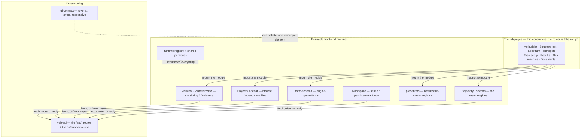

# The web front end — the map

**Role:** overview
**Domain:** web
**Companions:** this is the map; every module named below has its own doc, linked
in the registry (§ 4). New here? Read this, then the one module you need.

The molbuilder front end is **eight tabs sharing one app shell**, and behind them a
small set of **reusable modules** that do the real work. A tab is deliberately
thin: it lays out some cards, then *mounts* the modules — the 3D viewer, the file
browser, the option forms, the result viewers — and wires their events to the
server. The interesting, reused machinery lives in the modules, not the pages.
This doc is the 10,000-foot view: the design doctrine those modules follow, a map
of who-mounts-what, and a registry of every module with its doc and its ESM
status.

## 1. The design doctrine — concealed, reusable modules

The front end is built to one rule: **every system-wide capability — UI, data
model, or API client — is an independent ES module** that is

- **physically separated** — it lives in its own folder under
  `static/lib/<name>/`, not scattered through a tab's code;
- **concealed** — you use it through *one small door* (an exported `mount()`, or a
  single `window.molbuilder.<name>` object). Its guts — the 3Dmol context, the DOM
  it builds, its internal state — are sealed behind that door; you never reach in;
- **uniformly reusable** — the same door works on *any* tab. Mount it read-only to
  inspect, mount it editable to build; the module doesn't know or care which tab
  it's on.

**MolView is the exemplar.** One module builds the entire 3D card — viewer,
selection panel, view toggles, cell editor — and it is mounted **read-only** on
Structure-optimization, Spectra, and Results, and **editable** on Molbuilder and
Transport. Five tabs, one module, zero copy-paste. The projects sidebar and the
form builder are reused the same way. When a module *isn't* fully converted yet
(some are still classic global scripts), its own doc carries a **current → target
ESM note**, and § 6 below is the scorecard.

Why the discipline pays off: a bug fixed in `lib/spectra/core.js` fixes both the
standalone Spectra tab *and* the Results-tab spectrum viewer, because they are two
mounts of one module — not two copies.

**The rule that keeps it true: a missing capability is a task against the module,
never a workaround in the tab.** When a tab needs something the module doesn't
expose, you do *not* implement it tab-side and you do *not* reach around the
module — no raw-3Dmol access, no bespoke overlay, no "temporary" tab-side copy of
the module's state. You file the work against the module, naming the exact API,
handle method, or data field it must add; the tab consumes it once the module
ships it. This is the rule the MolView extraction was run under, and it is why
the seal held. Every shortcut taken mid-migration becomes permanent, and one tab
reaching past the door is how a reusable module quietly turns back into five
copies.

## 2. The layers

The reading is: **tabs consume modules; modules call the server through one
envelope; the runtime registry sequences module load; the CSS contract keeps every
tab looking like one app.**

## 3. Two universal patterns

Two conventions recur in every module, so learn them once:

- **The `{ok, …}` envelope.** Every server call returns `{ok: true, …}` or
  `{ok: false, error}`; the browser's `_fetchEnvelope` unwraps it uniformly. A
  molecule always crosses the wire in the same `workspace_payload` shape. Details
  in [`web-api.md`](?doc=web/web-api.md).
- **The runtime registry.** Classic `<script>`s and `type="module"` scripts load
  in an unpredictable order, so a module never *grabs* another module — it
  `register(name, api)`s itself and `whenReady(name)`s for the ones it needs. This
  is the one pattern that makes the concealed-module design survive real
  page-load timing. Details in [`runtime.md`](?doc=web/runtime.md).

## 4. The module registry

Every reusable piece, its one-line job, its doc, and whether it has reached the
"independent ES module" target. (ESM status verified by inspecting each module's
entry file for `import`/`export`.)

| Module | What it does | Doc | ESM |
|---|---|---|---|
| **MolView** | the embeddable 3D structure viewer + its data model | [molview.md](?doc=web/molview.md) | ✅ full |
| **VibrationView** | the concealed normal-mode animator (a *sibling* of MolView, mounted by the spectra viewer) | [vibrationview.md](?doc=web/vibrationview.md) | ✅ full³ |
| **workspace** | session persistence + the Undo state timeline | [workspace.md](?doc=web/workspace.md) | ✅ full |
| **projects** | the sidebar file browser + the load/save doors | [projects.md](?doc=web/projects.md) | ✅ full |
| **xyz-io** | the shared XYZ parse/format primitive | [runtime.md](?doc=web/runtime.md) | ✅ full |
| **trajectory** | the optimization-run movie + convergence plots | [trajectory.md](?doc=web/trajectory.md) | ⬤ hybrid¹ |
| **transport** | the transport composite's describe surface (cite → describe) | [tabs.md § 4](?doc=web/tabs.md) | ⬤ hybrid¹ |
| **presenters** | the Results-tab file-viewer registry | [presenters.md](?doc=web/presenters.md) | ○ classic² |
| **spectra** | the Raman spectrum chart + mode table engine | [spectra.md](?doc=web/spectra.md) | ○ classic² |
| **results** | the Results-tab dispatch shell + file picker | [results.md](?doc=web/results.md) | ○ classic² |
| **form-schema** | builds engine-option forms from the config dataclass | [form-schema.md](?doc=web/form-schema.md) | ○ classic² |
| **notify** | the app-wide notification framework (any tab, any caller) | [notifications.md](?doc=web/notifications.md) | ○ classic² → #105 |
| **runtime + primitives** | the load-order registry + the genuinely-shared helpers (warningModal, markdownRender, the CodeMirror code-viewer, path/constants) | [runtime.md](?doc=web/runtime.md) | ○ classic² |

¹ **hybrid** = the module already `import`s its dependencies as an ES module, but
its own body is still a classic IIFE — it either publishes a `window.molbuilder.*`
global (trajectory) or self-mounts on page load (transport), rather than being a
clean `export`.
² **classic** = a plain global-registered script, not yet an ES module.
³ **MolView and VibrationView are sibling modules, not one** — each a full ES
module. They are not yet *fully* independent, though: both currently draw through
one **shared 3Dmol embed surface** (`lib/viewer/`, borrowed by VibrationView via a
transitional `window.molbuilder.viewer` global). Making them fully separate — the
embed becomes MolView-private, VibrationView grows its own concealed seal — is
**task #104** (see [`vibrationview.md § 5`](?doc=web/vibrationview.md)). `lib/viewer/`
is that shared engine, not a module tabs mount, so it takes no registry row of its own.

Two cross-cutting contracts round out the domain (not mountable modules, but the
rules every tab obeys): [`web-api.md`](?doc=web/web-api.md) (the server routes) and
[`ui-contract.md`](?doc=web/ui-contract.md) (the CSS/layout conventions). And the
[`tabs.md`](?doc=web/tabs.md) consumer doc shows how the six pages wire it all
together.

## 5. The seam contract — the doors deliberately differ

Every module hides behind one small door, but the doors were **built at different
times and speak different error models on purpose**. There is no single "how a
molbuilder door reports failure" rule — so when you move from calling one module to
another, read the target module's doc rather than assuming the last one's habits. The
contrast, at a glance (each door's full contract is in its own doc):

| Door | On failure | "Nothing there" | Cancellation |
|---|---|---|---|
| **`mount()`** — [molview](?doc=web/molview.md), [vibrationview](?doc=web/vibrationview.md) | returns `{ ok:false, error, dispose(){} }` — **never a null sentinel**; success is `{ ok:true, … }`. Branch on `.ok`; call `.dispose()` unconditionally | — | — |
| **`molview.data`** | **`Promise.reject(Error)`** from the doors that change the structure through the server — `installMolecule` / `applyOp` / `commitPeriodicityOp` — carrying **the server's own sentence**, never a status code ([molview](?doc=web/molview.md) § 6.9). `null` from those same doors means only *there was nothing to do* (nothing loaded, a read-only viewer, an op the controls rule out, an edit already in flight) and is never a failure. `save` answers whether it landed; **validate-and-throw** on bad frame ops | reads return `null` / empty defaults | — |
| **[workspace](?doc=web/workspace.md)** | **never rejects** — `readState` resolves `null` on *any* failure (a miss, a network drop, and malformed data are indistinguishable **by design**: the caller treats every miss as "re-anchor"); `persist` is fire-and-forget | `null` | — |
| **[projects](?doc=web/projects.md)** (files) | a uniform `{ ok:false, error }` envelope — **never throws** | `null` = a deliberate third state ("no file selected") | **yes** — every file op threads `opts.signal`; an abort maps to `{ ok:false, error:"aborted", aborted:true }` |

Three conventions cut across the table:

- **Cancellation has one recognizer.** Four cancel shapes exist (fetch's `AbortError`,
  a user-cancelled dialog's `{ cancelled:true }`, the envelope's `aborted:true`, the
  embed's `ViewerError code:"aborted"`) — don't string-match them; use
  `projects/state.js`'s `isCancelError(err)`, the one recognizer.
- **Two lifecycle philosophies, on purpose.** `mount()` returns a **disposable**
  component (`dispose()` unwinds attachments → embed → card DOM, LIFO); `workspace` and
  `projects` are **page-lifetime singletons** whose only lifecycle surface is each
  subscription's unsubscribe function.
- **Every subscribe-like door returns an unsubscribe function** — the *one* universal
  convention across all the doors.

## 6. ESM status — how far the doctrine is realized

The **data + viewer modules are there** (MolView, VibrationView, workspace,
projects, xyz-io — fully ES modules). What remains classic is the **Results-side
stack and some shared plumbing**:

- **Hybrid** (one foot in ESM — they `import` their deps as a module, but their
  own body is still a classic IIFE): `trajectory`, `transport`, the one converted
  presenter (`inspectors/structure`), and all four tab controllers.
- **Still classic** (global scripts): the `spectra` engine, the `presenters`
  registry (+ its other viewers), the `results` shell, `form-schema`, the runtime
  registry itself, and the loose primitives (`markdown-render`, `detection-chip`,
  `constants`, `path-utils`).

Finishing the conversion is tracked in two workstreams (`plans/plan.md` **W15**):

- **#102** — convert the file-viewer registry to ESM **and rename `inspectors` →
  `presenters`** in one pass. The same pass also converts the two **heavy engine
  cores the registry mounts** — `lib/spectra/core.js` and `lib/trajectory/core.js`
  — since converting them rewrites those files anyway. "Inspector" collided with
  `mountInspector` and the viewers' own inspect panels, hence the rename.
- **#103** — convert the remaining classic modules: the `results` module, the
  runtime registry itself, `form-schema`, and the shared primitives.

Until then, the runtime registry (§ 3) is what lets fully-ESM and classic modules
coexist on the same page without a load-order race.

**Why finish the conversion at all?** An ES module makes the concealment *real*: a
top-level `const` or helper is invisible outside the file unless it's `export`ed, so
"don't reach inside" stops being a rule to remember and becomes enforced by the
language — the seal the doctrine (§ 1) asks for, for free.

**How the conversion stays safe — never big-bang.** The instant a module becomes
pure-ES it leaves `window` and runs *deferred* (after the classic scripts), which would
break every classic consumer still calling `window.molbuilder.<name>.*`. So a module is
converted **together with its consumers**, one at a time, with a thin transitional
`window.molbuilder.<name>` **shim** (its public API re-exposed on the global) kept until
the *last* classic consumer migrates — then the shim is deleted. `xyz-io` is the live
example: already an ES module, but keeping a classic access door for its not-yet-converted
callers. The Node tests come along for free — a converted module publishes the *same*
global **and** exposes exports, so a test reading through `window.molbuilder.X` passes
before and after conversion ([`testing.md § 4`](?doc=process/testing.md)).

## 7. Where to start reading

| If you want to… | Start with |
|---|---|
| understand a whole tab's behaviour | [`tabs.md`](?doc=web/tabs.md) |
| embed or drive the 3D viewer | [`molview.md`](?doc=web/molview.md) |
| browse / open / save project files | [`projects.md`](?doc=web/projects.md) |
| add or change an engine-option form | [`form-schema.md`](?doc=web/form-schema.md) |
| add a new result-file viewer | [`presenters.md`](?doc=web/presenters.md) |
| call or add a server route | [`web-api.md`](?doc=web/web-api.md) |
| keep a new page on-style | [`ui-contract.md`](?doc=web/ui-contract.md) |
| make modules load in the right order | [`runtime.md`](?doc=web/runtime.md) |
| persist a tab's in-progress work | [`workspace.md`](?doc=web/workspace.md) |
