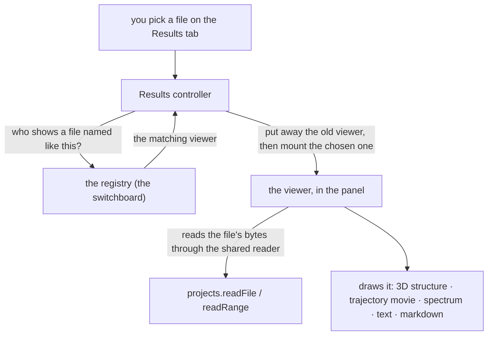

# Presenters — picking the right viewer for a file

**Role:** contract
**Domain:** web
**Companions:** [`molview.md`](?doc=web/molview.md) — the structure viewer one
presenter mounts; [`projects.md`](?doc=web/projects.md) — the file layer every
presenter reads through. `results.md` — the Results tab that *uses* this
registry (its file picker, state, and bundle handoff live there, web wave); the
trajectory-engine and spectra docs — the heavy rendering engines two presenters
wrap. [`roadmap.md`](?doc=roadmap.md) § 3 — the pending ESM + rename of this
module.

When you open a file on the **Results** tab, something has to pick the right way
to show it — a 3D structure for a `.xyz`, a trajectory movie for a
`.molwatch.log`, a spectrum for a `.spectra.json`, a markdown editor for a
`.md`, a plain scrollable text pane for a `.log` or `.fdf`. This module is that
switchboard: a small **registry** of **presenters**, one per file type, and the
rule that picks the matching one and mounts it.

> **Current → target.** In the code today this module is still
> `window.molbuilder.inspectors` (in `lib/inspectors/`), and most of its files
> are classic scripts — only two are ES modules so far (`structure.js` and the
> trajectory engine `lib/trajectory/core.js`). It is being **renamed to
> `presenters`** and converted to ES modules in one pass (task #102,
> [`roadmap.md § 3`](?doc=roadmap.md)) — the old term "inspector" collided with
> `mountInspector` inside the engines and with the viewers' own inspect panels.
> This doc uses the target name **presenter**; where it points at code it uses
> today's `inspectors` names.

## 1. The pieces — a switchboard and five viewers

The **registry** is the switchboard. Each **presenter** is a small self-contained
viewer for one kind of file. Today there are five:

| The file you open | The viewer you get | Shows in the Results dropdown? |
|---|---|---|
| `.xyz`, `.pdb` | a read-only 3D structure (the MolView viewer) | yes |
| `.molwatch.log`, `.out`, `*_optim.xyz` | a trajectory **movie** + energy/force plots + SCF progress | yes |
| `.spectra.json` | a spectrum **chart** + a modes table | yes |
| `.md` | a markdown **editor** with a live preview + Save | no |
| `.fdf`, `.py`, `.log`, `.json`, `.txt` | a plain **paginated text** pane | no |

The three that say "yes" mark themselves as *results*, so they show up in the
Results tab's file dropdown. The two that say "no" (markdown, plain text) are
catch-alls — if they claimed a spot in the dropdown they would flood it with
config files and READMEs.

## 2. How a viewer is chosen — the presenter contract

The registry doesn't hard-code the file types. Each presenter is a small object
that declares four things (and two optional ones), and calls `register` once:

- `name` — a unique key.
- `displayName` — the label a user sees.
- `match(filepath)` → **does this presenter handle this filename?** (checked in
  registration order — the first to say yes wins).
- `mount(host, file, ctx)` → **draw yourself** inside the given element; return a
  small handle with a `dispose()`.
- *(optional)* `isResult` — `true` puts this presenter's files in the Results
  dropdown.
- *(optional)* `resultCategory(file)` — the group heading the dropdown files sit
  under.

The registry's own surface is small: `register`, `pick` (the first presenter
whose `match` is true), `pickResult` (same but only presenters marked
`isResult` — the file picker uses this), `mount`, and `list`. A `match` that
throws is logged and skipped, so one broken presenter can't jam the switchboard;
a `mount` that throws falls back to a clean error card in the panel.

**Every presenter reads files through one shared reader.** `mount` is handed a
`ctx` with exactly four helpers — `showError`, `readFile`, `readRange` (a byte
window, for large files), and `writeFile` (timestamp-safe, so a concurrent edit
on disk is caught) — all of which go through the projects file layer
([`projects.md`](?doc=web/projects.md)). Presenters never hand-roll their own
`/api/files/*` calls; the reader is the one door.

## 3. How the switchboard runs

The Results tab's controller drives it. When you choose a file:

1. The controller asks the registry which presenter matches the filename.
2. It **puts away** whatever was showing (calls the old handle's `dispose()` —
   dropping timers, listeners, and the old DOM) **before** mounting the new one.
3. It mounts the chosen presenter into the panel.
4. For the slow, 3D ones (structure, trajectory, spectra) it shows a
   "parsing…" cover and lifts it when the presenter signals it has painted; the
   instant ones (text, markdown) just appear.

The registry is a **Results-tab** switchboard. Other tabs mount their viewers
directly — the Modify/Spectra/Transport tabs call the MolView or spectra
mount themselves, and the **Documents tab renders markdown through a separate
shared renderer** (`markdown-render.js`), not through this registry.

## 4. Thin viewers over heavy engines

Three of the five presenters are simple, but two — **trajectory** and
**spectra** — are *thin adapters* over big rendering engines:

- the **structure** presenter mounts the whole MolView viewer read-only in one
  call (it opens the file through the projects door, so labels and cell ride
  along) — no separate engine;
- the **trajectory** presenter fetches its panel layout and hands off to the
  trajectory engine (`lib/trajectory/core.js`) — which loads the frames, keeps
  polling while the job runs, and draws the 3D movie plus the energy/force and
  SCF plots;
- the **spectra** presenter hands off the same way to the spectrum engine
  (`lib/spectra/core.js`) — the chart and modes table;
- **source** (plain text) and **markdown** are small and self-contained.

The two engines are large enough to be their own subject — this doc names them
and stops there; their internals belong with the Results/Spectra tab docs.

## 5. A worked example — open a `.molwatch.log`, watch the movie

1. You pick `run_1.molwatch.log` in the Results file dropdown.
2. The controller asks the registry "who handles this?". It checks each viewer's
   `match` in order; the **trajectory** viewer (registered before the generic
   text viewer, so it wins) says yes, because the name ends in `.molwatch.log`.
3. The controller shows a "parsing…" cover, puts away whatever was mounted, and
   hands the panel to the trajectory viewer.
4. That viewer is a thin wrapper: it fetches its panel layout and calls the
   trajectory engine to draw.
5. The engine loads the frames, then checks for new ones every 15 seconds,
   drawing the 3D movie + the energy/force plots + the SCF-progress row. It
   signals "ready", the cover lifts, and the movie plays — updating live as the
   running job writes more frames.

(Contrast: pick `input.fdf` and no special viewer claims it, so the catch-all
text viewer gives you a plain scrollable pane.)

## 6. Adding a new viewer

Because the registry dispatches on each presenter's own `match` rule, adding a
new file type is **one new presenter module plus one `register` call** — no
editing a central list. A presenter that wants a slot in the Results dropdown
sets `isResult: true` and gives a `resultCategory`.

## 7. What is ES-module-converted, and what isn't

This module is the file-viewer registry that is being renamed and modernized
(task #102). Its current state:

| File | Today | After the task-#102 pass |
|---|---|---|
| `structure.js` | already an ES module | renamed to `presenters` |
| `lib/trajectory/core.js` (engine) | already an ES module | renamed |
| `registry.js`, `_partial_inspector_factory.js`, `trajectory.js`, `spectra.js`, `source.js`, `markdown.js` | classic scripts | converted to ES modules + renamed |
| `lib/spectra/core.js` (engine) | classic script | converted |

So two of the module's nine files are ES modules today; the rest, and the
`molbuilder.inspectors` → `presenters` rename, are the pending pass. See
[`roadmap.md § 3`](?doc=roadmap.md).

## 8. Test map

- `test_inspector_registry_e2e.py` — the pick/mount/dispose dispatch end to end.
- `test_inspector_registry_dispatch_js.py` — the filename-match ordering (which
  viewer wins for which extension).
- `test_results_blueprint.py` — the registered set and the template script order.
- The structure/trajectory/spectra viewers are covered by their own viewer and
  engine tests.
