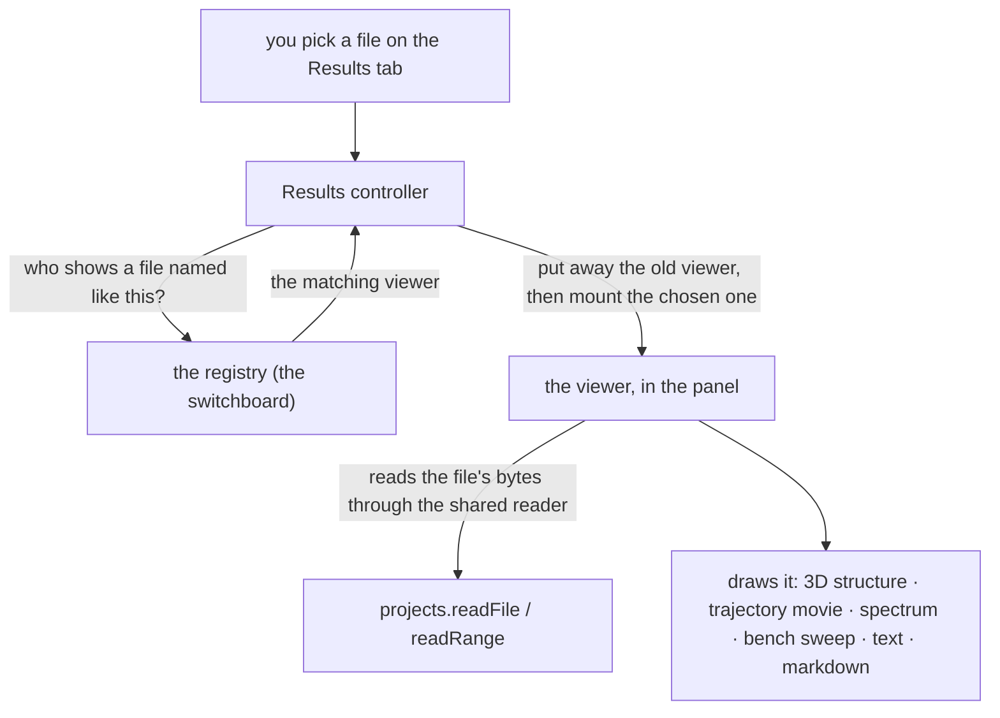

# Presenters — picking the right viewer for a file

**Role:** contract
**Domain:** web
**Companions:** [`molview.md`](?doc=web/molview.md) — the structure viewer one
presenter mounts; [`projects.md`](?doc=web/projects.md) — the file layer every
presenter reads through. `results.md` — the Results tab that *uses* this
registry (its file picker and viewer state live there; the Bundle card it also
used to name retired 2026-08-29 with the whole hand-over model — a calculation
CITES a finished run now); the
trajectory-engine and spectra docs — the heavy rendering engines two presenters
wrap. [`plans/plan.md`](?doc=plans/plan.md) **W15** — the pending ESM + rename of this
module.

When you open a file on the **Results** tab, something has to pick the right way
to show it — a 3D structure for a `.xyz`, a trajectory movie for a
`.molwatch.log`, a spectrum for a `.spectra.json`, a sweep summary for a
`job-set.json`, a markdown editor for a `.md`, a plain scrollable text pane for
a `.log` or `.fdf`. This module is that switchboard: a small **registry** of
**presenters**, one per file type, and the rule that picks the matching one and
mounts it.

> **Current → target.** In the code today this module is still
> `window.molbuilder.inspectors` (in `lib/inspectors/`), and most of its files
> are classic scripts. Two are further along — `structure.js` and the trajectory
> engine `lib/trajectory/core.js` already `import` as modules, but both still
> register through the global, so they are **hybrids**, not clean ES modules yet.
> The module is being **renamed to `presenters`** and fully converted in one pass
> (task #102,
> [`plans/plan.md`](?doc=plans/plan.md) **W15**) — the old term "inspector" collided with
> `mountInspector` inside the engines and with the viewers' own inspect panels.
> This doc uses the target name **presenter**; where it points at code it uses
> today's `inspectors` names.

## 1. The pieces — a switchboard and six viewers

The **registry** is the switchboard. Each **presenter** is a small self-contained
viewer for one kind of file. Today there are six:

| The file you open | The viewer you get | Shows in the Results dropdown? |
|---|---|---|
| `.xyz`, `.pdb` | a read-only 3D structure (the MolView viewer) | yes — *Structure* |
| `.molwatch.log`, `.out`, `*_optim.xyz` | a trajectory **movie** + energy/force plots + SCF progress | yes — *Optimization* / *SIESTA optimization* / *PySCF optimization* |
| `.spectra.json` | a spectrum **chart** + a modes table | yes — *PySCF spectrum* |
| `job-set.json` (exact basename) | a **bench sweep** summary + chart, polled | yes — *Benchmark sweeps* |
| `.md` | a markdown **editor** with a live preview + Save | no |
| `.fdf`, `.py`, `.log`, `.json`, `.txt` | a plain **paginated text** pane | no |

The four that say "yes" mark themselves as *results*, so they show up in the
Results tab's file dropdown. The two that say "no" (markdown, plain text) are
catch-alls — if they claimed a spot in the dropdown they would flood it with
config files and READMEs.

> *This table said **five** viewers and **three** results until 2026-09-17,
> omitting `bench-summary` — a presenter with its own result category that had
> been registering the whole time. Two of the four also never write
> `isResult` at all: `trajectory` and `spectra` are built by
> `makePartialInspector`, which **defaults it to `true`**, so reading the
> registration alone under-counts them. The count here is now derived from the
> six `register()` calls in `lib/inspectors/`, not from this table's memory.*

> **There is no row for a composite result, and transport is the first one.**
> A finished junction writes `<label>.transport.json`, which matches no
> `isResult` presenter, so the picker drops it; its five rungs' `.out` files are
> each claimed by the trajectory viewer under *SIESTA optimization*, so a
> five-rung ladder lists as five unrelated optimizations. The row is owed by
> [`plans/plan.md`](?doc=plans/plan.md) § 5p.3p step 5; the deeper reason the
> picker has to guess at all — there is no server door that answers *what is in
> this directory* — is [`model/parse.md`](?doc=model/parse.md) § 5's
> `JobDirParser`, **specified and not built**, owned by § 5c.

## 2. How a viewer is chosen — the presenter contract

The registry doesn't hard-code the file types. Each presenter is a small object
that declares four things (and three optional ones), and calls `register` once:

- `name` — a unique key.
- `displayName` — the label a user sees.
- `match(filepath)` → **does this presenter handle this filename?** (checked in
  registration order — the first to say yes wins).
- `mount(host, file, ctx)` → **draw yourself** inside the given element; return a
  small handle with a `dispose()`.
- *(optional)* `isResult` — `true` puts this presenter's files in the Results
  dropdown.
- *(optional)* `resultCategory(file)` — the group heading the dropdown files sit
  under. Defaults to `displayName`. A presenter matching more than one
  workflow's outputs discriminates per file here — `trajectory` claims `.out`,
  `.molwatch.log` and `*_optim.xyz` and files them under three different
  headings.
- *(optional)* `absorbs(master, other)` — **"`master` subsumes `other`"**: both
  are result-class files in the SAME directory and `other` is a working part of
  the run `master` reports, so only the master gets a dropdown entry
  ([`results.md`](?doc=web/results.md) § 2.3). *This bullet was missing until
  2026-09-17 and the count above said "two optional" — `absorbs` is what makes
  one PySCF relaxation one menu line instead of five, and it is also the rule
  that CANNOT express a five-directory transport ladder.*

The registry's own surface is small: `register`, `pick` (the first presenter
whose `match` is true), `pickResult` (same but only presenters marked
`isResult` — the file picker uses this), `mount`, and `list`. A `match` that
throws is logged and skipped, so one broken presenter can't jam the switchboard;
a `mount` that throws falls back to a clean error card in the panel.

**Every presenter reads and writes files through one shared reader.** `mount` is
handed a `ctx` with four helpers. Three touch files and all go through the
projects file layer ([`projects.md`](?doc=web/projects.md)) — `readFile`,
`readRange` (a byte window, for large files), and `writeFile` (timestamp-safe,
so a concurrent edit on disk is caught); the fourth, `showError`, just renders an
error card in the panel. Presenters never hand-roll their own `/api/files/*`
calls; that shared reader is the one file door.

## 3. How the switchboard runs

The Results tab's controller drives it. When you choose a file:

1. The controller asks the registry which presenter matches the filename.
2. It **puts away** whatever was showing (calls the old handle's `dispose()` —
   dropping timers, listeners, and the old DOM) **before** mounting the new one.
3. It mounts the chosen presenter into the panel.
4. For the slow, 3D ones (structure, trajectory, spectra) it shows a
   "parsing…" cover and lifts it when the presenter signals it has painted; the
   instant ones (text, markdown) just appear.

The registry is a **Results-tab** switchboard. Other tabs mount their viewers
directly — the Modify/Spectra/Transport tabs call the MolView or spectra
mount themselves, and the **Documents tab renders markdown through a separate
shared renderer** (`markdown-render.js`), not through this registry.

## 4. Thin viewers over heavy engines

Four of the six presenters are simple, but two — **trajectory** and
**spectra** — are *thin adapters* over big rendering engines:

- the **structure** presenter mounts the whole MolView viewer read-only in one
  call (it opens the file through the projects door, so labels and cell ride
  along) — no separate engine;
- the **trajectory** presenter fetches its panel layout and hands off to the
  trajectory engine (`lib/trajectory/core.js`) — which loads the frames, keeps
  polling while the job runs, and draws the 3D movie plus the energy/force and
  SCF plots;
- the **spectra** presenter hands off the same way to the spectrum engine
  (`lib/spectra/core.js`) — the chart and modes table;
- **bench-summary** is self-contained: it reads a `job-set.json`, renders the
  sweep's trials and a chart, and re-polls on its own cadence;
- **source** (plain text) and **markdown** are small and self-contained.

The two engines are large enough to be their own subject — this doc names them
and stops there; their internals belong with the Results/Spectra tab docs.

## 5. A worked example — open a `.molwatch.log`, watch the movie

1. You pick `run_1.molwatch.log` in the Results file dropdown.
2. The controller asks the registry "who handles this?". It checks each viewer's
   `match` in order; the **trajectory** viewer (registered before the generic
   text viewer, so it wins) says yes, because the name ends in `.molwatch.log`.
3. The controller shows a "parsing…" cover, puts away whatever was mounted, and
   hands the panel to the trajectory viewer.
4. That viewer is a thin wrapper: it fetches its panel layout and calls the
   trajectory engine to draw.
5. The engine loads the frames, then checks for new ones every 15 seconds,
   drawing the 3D movie + the energy/force plots + the SCF-progress row. It
   signals "ready", the cover lifts, and the movie plays — updating live as the
   running job writes more frames.

(Contrast: pick `input.fdf` and no special viewer claims it, so the catch-all
text viewer gives you a plain scrollable pane.)

## 6. Adding a new viewer

Because the registry dispatches on each presenter's own `match` rule, adding a
new file type is **one new presenter module plus one `register` call** — no
editing a central list. A presenter that wants a slot in the Results dropdown
sets `isResult: true` and gives a `resultCategory`.

## 7. What is ES-module-converted, and what isn't

This module is the file-viewer registry that is being renamed and modernized
(task #102). Its current state:

| File | Today | After the task-#102 pass |
|---|---|---|
| `structure.js` | hybrid — imports, but registers via the global | clean ES module, renamed to `presenters` |
| `lib/trajectory/core.js` (engine) | hybrid — imports MolView, publishes a global | clean ES module, renamed |
| `registry.js`, `_partial_inspector_factory.js`, `trajectory.js`, `spectra.js`, `source.js`, `markdown.js`, `bench-summary.js`, `lifecycle.js` | classic scripts | converted to ES modules + renamed |
| `lib/spectra/core.js` (engine) | classic script | converted |

So two of the module's **eleven** files already import as modules (still
global-registered = hybrid), and the rest are classic; converting them all —
plus the `molbuilder.inspectors` → `presenters` rename — is the pending pass.
See [`plans/plan.md`](?doc=plans/plan.md) **W15**.

> *This table listed seven files and said "nine" until 2026-09-17, omitting
> `bench-summary.js` and `lifecycle.js`. The real set is the **nine** files in
> `lib/inspectors/` plus the **two** engines outside it. `lifecycle.js` is not a
> presenter — it is the mount/listen/dispose helper both engine cores share,
> which is why it was easy to leave out of a list of viewers and why a list of
> FILES must not be written from a list of viewers.*

## 8. Test map

- `test_inspector_registry_e2e.py` — the pick/mount/dispose dispatch end to end.
- `test_inspector_registry_dispatch_js.py` — the filename-match ordering (which
  viewer wins for which extension).
- `test_results_blueprint.py` — the registered set and the template script order.
- The structure/trajectory/spectra viewers are covered by their own viewer and
  engine tests.
