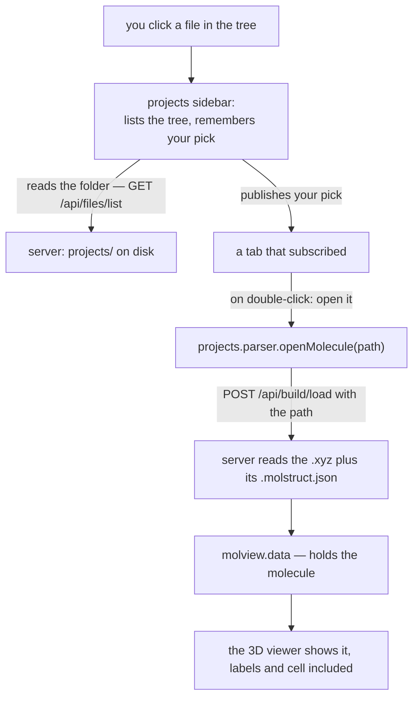

# Projects sidebar — browsing, picking, and opening your files

**Role:** contract
**Domain:** web
**Companions:** [`molview.md`](?doc=web/molview.md) — the open/save doors install
into and read from `molview.data`; [`workspace.md`](?doc=web/workspace.md) — a
different thing (auto-saving in-progress edits, not files). `web-api.md` — the
`/api/files/*`, `/api/build/load`, `/api/structure/save`, and `/api/checkpoint/*`
routes this module calls (web wave);
[`execution/running-a-job.md`](?doc=execution/running-a-job.md) `§ 6` and the
Modify-Save doc own the checkpoint panel and the structure Save panel this doc
only points at.

The **projects sidebar** is the file browser pinned to the left of every tab. It
lists your project tree, remembers **where you are working and what you have
picked**, lets you create/rename/move/delete files and folders, and is the **one
door** every other module uses to open a structure or save one. It is passive:
it *publishes* what you picked and *tabs listen* — the sidebar never decides
which tab wants which file.

It is a plain ES module (all ten of its files) — nothing here is waiting on a
conversion.

## 1. The one door, and the pieces behind it

Everything a tab uses is on **`window.molbuilder.projects`**. Tabs call that and
subscribe to it; they never reach into the sidebar's HTML. (A tab waits for it
with `runtime.whenReady("projects")` instead of polling.)

Behind that one door are ten small files, each with one concern:

| File | What it does |
|---|---|
| `projects-sidebar.js` | the entry point — imports the others and mounts `window.molbuilder.projects` |
| `state.js` | remembers your pick + the file operations; the part tabs subscribe to |
| `api.js` | the thin wrappers around the `/api/files/*` and `/api/projects/*` server calls |
| `list.js` | the tree on screen — breadcrumb, the rows, the `⋯` menu |
| `dialogs.js` | the pop-up dialogs (name a file, pick a folder, confirm a delete) |
| `mutation-bar.js` | the header buttons — New project, New folder, Upload |
| `preview.js` | the file preview/edit pop-up (any file, view or edit) |
| `checkpoint.js` | the run-history panel (git snapshots of a run folder) |
| `parser.js` | the **one** door that understands molecules — open and save |
| `molview-doors.js` | the `files` door every MolView mount hands in — export to project or download |

There are really **two layers**: a **content-blind file layer** (read/write raw
bytes, list folders, rename — it doesn't care what's in a file) that every tab
can use, and **one content-aware door** (`projects.parser`) that knows a
molecule is an `.xyz` paired with a `.molstruct.json`. Only that one door
understands file *contents*; everything else just moves bytes.

## 2. Where you are and what you picked — the selection

The sidebar remembers your place in **two slots** in the browser's short-term
storage (`state.js`):

- **`current_dir`** — the folder you are looking at (always inside your projects
  folder).
- **`current_file`** — the file you have selected, or empty while you are just
  browsing. Picking a new folder clears it.

That is the whole selection — one folder, one file. There is no multi-select.

**And the place is remembered PER TAB** *(user, 2026-08-19: "switching back
and forth should not be trouble")*: each slot is keyed by the page, so the
Results tab keeps its run folder while Modify keeps its structure folder,
and switching between them returns each to its own place. A tab you have
never visited starts at the **most recent place anywhere** — every write
also refreshes a shared most-recent slot, which is exactly the old
behaviour, now the fallback. One reader owns the keying
(`projects.getCurrentDir()` / the module's own slot helpers); nothing reads
the raw storage keys directly, because a second reader is how the keying
would silently fork.

**The one rule to remember: a single click is a *preview*, a double click is
*use it*.**

- **Single-click a file** → it becomes the current selection (a candidate). The
  row highlights and the sidebar announces the change through **`onChange`**.
- **Double-click a file** → you are committing to it. The sidebar announces that
  through **`onCommit`**.
- **Single-click a folder** → the sidebar opens it and lists what's inside.

So a tab that "loads the selected structure when you double-click" listens to
`onCommit`; a tab that just wants to *reflect* the current pick (light up a Load
button) listens to `onChange`.

**How a tab reads and follows the selection:**

- Read it right now, no network: `projects.getCurrentDir()` /
  `projects.getCurrentFile()`.
- Follow changes: `projects.onChange(cb)`. It calls back on every change **and
  once immediately when you subscribe**, so your tab can set itself up from the
  current state. (Registering the same callback twice is an error, on purpose.)
- Follow commits: `projects.onCommit(cb)`. It fires **only** on a real
  double-click — *not* on subscribe, because a commit is a one-off event, not a
  state to mirror.
- Follow **the folder's contents changing underneath you**:
  `projects.onFolderChanged(cb)`, payload `{dir}`. Like `onCommit` it does not
  fire on subscribe. Compare `dir` against the folder your tab is showing and
  re-read only your own.

  **Why this is a channel of its own** *(2026-08-24)*. The other two answer
  *"which folder/file is picked"* — but a checkpoint **restore** rewrites a
  folder while the selection sits still, and can swap `task.json` for
  `task.1st.json` under an open tab. Neither existing channel fires: the
  selection never moved, and nothing was committed. Task setup went on showing
  stages and a bench the folder no longer had.

  Anything that rearranges a folder behind an open tab **publishes**:
  `projects.publishFolderChanged(dir)`. The writer does not know which tabs are
  open or what they cache, so it announces rather than reaching in — the
  checkpoint panel's own refresh repaints only itself, which is precisely how
  this was missed.

**Making and organizing files.** The sidebar drives the create/rename/move/copy/
upload/delete operations against the server (`/api/files/*` and
`/api/projects/create`). Folder names are checked by depth: a **new project**
lays down `projects/<name>/` with a README and the nine standard topic folders
(`structure`, `pseudopotential`, `optimization`, `frequency`, `spectrum`,
`transport`, `single-point`, `scan`, and `user` — `user/` is the free-form
escape hatch), and at that top topic level only those nine names are allowed.
Deleting a project or a topic folder needs a type-the-name confirmation.

## 3. Opening and saving a molecule — the one door

Loading a structure into the viewer and saving one back are the job of the
**`projects.parser`** door. It works in terms of file *paths* and never throws —
it always returns `{ ok, … }`. Opening hands the server only a **path** (the
server reads the bytes); saving hands over the serialized structure, but the
**server** writes the `.xyz` + `.molstruct.json` pair — the browser never
authors the sidecar itself.

**Opening — `projects.parser.openMolecule(path)`:**

1. It hands the path to `molview.data.installMolecule({ path })`.
2. That posts the path to **`/api/build/load`**; the **server** reads the `.xyz`
   *and* its paired `.molstruct.json` and returns the whole enriched molecule —
   atoms, cell, and the region/frozen labels — in one go.
3. MolView installs it, and the 3D viewer paints it with its labels and cell.

If the `.molstruct.json` is missing, the geometry still loads (just without
labels). If the model already has unsaved edits, `openMolecule` can pause and
ask first (pass a `confirmDiscard` function) and returns `{ ok:false,
cancelled:true }` if you decline.

**Saving — `projects.molviewFiles.save("project", stem, payload)`** *(it was
`parser.saveMolecule(path)` until 2026-09-02; that door took a path it was
given, so it needed a UI layer to decide one, and the tab's copy of that layer
went with it — § 5):*

0. It asks **where**: a folder, then a name (`chooseSavePath`). Cancel either
   and nothing is written.
1. The caller has already asked MolView for the file bytes
   (`molview.data.exportFile()` → the `.xyz` plus its sidecar).
2. It posts them to **`/api/structure/save`**; the **server** reconstructs the
   structure and writes the `.xyz` + `.molstruct.json` pair — the server owns
   the pairing *and* the sidecar's format (it stamps the schema version and a
   real content hash).
3. On success the sidebar refreshes, the gate's `notices` ride the result, and
   the calling page records where the bytes went.

Why the server writes the sidecar: a browser-written sidecar had no schema
stamp, so the *load* door rejected it — a save-then-reload trap. Letting the
server own the write closes that. If the file already exists, the
server answers with a "needs overwrite" signal and the door returns
`{ ok:false, needsOverwrite:true }`, so the tab can show its overwrite dialog and
retry with `{ overwrite:true }`.



### A worked example — click a `.xyz`, watch it open

1. You **single-click** `water.xyz`. The sidebar records it as the current
   selection and fires `onChange`; the row highlights and the tab's Load button
   lights up.
2. You **double-click** `water.xyz`. The sidebar fires `onCommit`.
3. The tab's commit handler calls
   `projects.parser.openMolecule("/…/water.xyz")`.
4. The door hands the path to MolView, which posts it to `/api/build/load`; the
   server reads `water.xyz` + `water.molstruct.json` and returns the enriched
   molecule.
5. MolView installs it and the 3D viewer shows the molecule with its labels and
   cell. (Had the `.molstruct.json` been absent, the geometry would still show,
   label-less.)

### The tab-author pattern, in code

```js
const projects = await window.molbuilder.runtime.whenReady("projects");

// reflect the candidate — enable a Load button when a structure is picked:
projects.onChange((sel) => {
  loadBtn.disabled = !(sel.file && /\.(xyz|pdb)$/i.test(sel.file));
});

// act on the double-click:
projects.onCommit(async (sel) => {
  const r = await projects.parser.openMolecule(sel.file, { confirmDiscard: askDiscard });
  if (!r.ok && !r.cancelled) showError(r.error);
});
```

## 4. What the sidebar shows on screen

The sidebar's HTML is rendered by the server and addressed by id; tabs never
touch it. The parts:

- **Breadcrumb** — the folder path as clickable chips (home chip has a ⌂; the
  last chip is the current folder). Click a chip to jump there.
- **The tree** — one row per item, with folders, symlinks, and files marked
  differently and each file showing a human-readable size. Single-click a file
  to preview, double-click to commit, single-click a folder to open it. The
  selected file's row is highlighted.
- **The filter box** — type to hide non-matching files (folders always stay);
  a leading dot matches by extension (`.xyz`). It only hides rows, and the
  filter sticks as you browse.
- **The header buttons** — New project (always available), New folder, Upload and
  Download (available once you are inside a project). The first three open a
  dialog; **Download** compresses the folder you are currently browsing — its
  name is in the tooltip — and saves it as `<folder>.zip`. Because a results
  directory can take minutes to compress, the button says so in its own label
  (*Zipping…*, then *Saving…*) and refuses further clicks until the browser's
  save begins; that is why the door is two calls, `POST /api/files/zip_prepare`
  then `GET /api/files/download_zip?token=`. When it finishes it reports what
  it made — file count and size, in the button's tooltip — and **says out loud
  when anything was left out**: a symlink whose target sits outside the
  projects tree cannot travel, so those are counted and named rather than
  dropped in silence.
  The archive is the folder **as it stands now — the pure execution directory**:
  the workspace store (`.molbuilder_workspace`) and a checkpoint folder's
  history (`.git`, `.binsnapshots`) are left out, while every run file, engine
  restart files (`.DM`, `.TSDE`, `.XV`) included, rides along. *(Not via
  `git archive`: a checkpoint deliberately keeps large files out of git — they
  live in `.binsnapshots` — so a git export would silently drop the heaviest
  outputs the far machine needs.)*
- **The per-row `⋯` menu** — View, Download, Rename, Move, Copy, Delete, with
  only the items that apply shown (a project or topic folder shows just its
  type-to-confirm Delete). No menu appears when nothing applies.
- **Dialogs** — the modal pop-ups for naming a file, choosing a destination
  folder, picking an upload, and confirming a delete. Only one is ever open;
  opening another closes the first.
- **The preview pop-up** — a view/edit window for **any** file (opened from
  View). It uses a code editor loaded on demand. Files up to **1 MB** are
  editable; larger files open **view-only** (and very large files are paged in
  as you scroll). Editing and Save use the file's on-disk timestamp so a
  concurrent change on disk is caught ("file changed on disk; reload") instead
  of being silently overwritten. This is *raw file* editing — not the structure
  Save panel (§ 3).
- **The run-history view** — for a run folder (three levels deep:
  `projects/PROJECT/TOPIC/RUN`), a small round **status button appears beside
  the filter box**, colored by the folder's checkpoint state (gray = no
  history, green = saved, amber = unsaved changes, red = error). Clicking it
  **swaps the file list for the checkpoint view** — status line, the
  checkpoint list, a **commit-graph viewer**, and Checkpoint-now / Tag /
  Restore — in the same space, and clicking again returns the files; the
  choice survives a reload. While the checkpoint view is showing, the filter
  input is disabled — it filters files, and a control acting on a hidden
  list would act invisibly. Outside a run folder the button does not exist.
  It refreshes only when asked (no polling; entering a run folder reads the
  state once so the button's color is honest). Its behavior is owned by
  [`execution/running-a-job.md`](?doc=execution/running-a-job.md) `§ 6` (the
  workflow) and [`execution/checkpointing.md`](?doc=execution/checkpointing.md)
  (the invariants); this doc owns where it sits.
  *(Until 2026-08-19 this was a separate fixed-width panel to the right of
  the sidebar, with no way to reclaim its space.)*
- **Layout** — a drag handle resizes the sidebar (double-click resets), a toggle
  collapses it on desktop, and on a narrow screen it becomes a drawer. A lock
  banner covers the sidebar while an operation is in flight.

## 5. The full public surface (reference)

Everything below is on `window.molbuilder.projects`. The read/subscribe calls
are instant (no network); the file calls each make one server request and return
a uniform `{ ok, … }` result — they never throw.

**Where you are + following it**

| Call | What it does |
|---|---|
| `getCurrentDir()` / `getCurrentFile()` | the current folder / selected file, right now |
| `getProjectsRoot()` / `atRoot()` | your projects folder; whether you're at its top |
| `onChange(cb)` | selection changed — fires once on subscribe too |
| `onCommit(cb)` | a file was committed (double-clicked) — does not fire on subscribe |
| `publishCommit(dir, path)` | commit a file from code (also moves the selection). **`path` is the file's FULL path**, not its name — subscribers use it as one |
| `setShared(dir, file)` | move the selection without re-listing |
| `handOffSelection(route, dir, file)` | write ANOTHER tab's per-tab slots (§ 2), so "Open in Molbuilder"-style links land the target where they point |
| `navigateTo(path)` / `refresh()` | list a folder + move there / re-list the current folder |
| `onProjectsRootResolved(cb)` / `onLockChange(cb)` | one-shot / lock notifications |

**Taking a state — `projects.checkpoint`** (added 2026-08-16)

A **sub-namespace on the one door**, the way `projects.parser` is: the run-history
panel drives these from the sidebar, and a tab that must take a state before it
writes calls the same three. Before this, the panel's save was a private click
handler — so a tab needing it had two bad options, POST the route itself (a
second caller with its own error handling and no sidebar refresh) or reach into
the panel's DOM.

| Call | What it does |
|---|---|
| `checkpoint.status(dir)` | `{ok, initialized, clean, ...}` — does this folder have a history, and does it differ from where it stands? Read-only. *(Served by `GET /api/checkpoint/state`; until 2026-08-19 this called a route that never existed and answered `ok:false` forever)* |
| `checkpoint.init(dir, {engine})` | start a history here. Refuses with a reason a caller can show (a nested repository, a folder that declares nothing) |
| `checkpoint.saveState(dir, note)` | save the folder's current state. **A note is required** — `checkpointing.md` **L4** retired automatic messages, so nothing writes one on your behalf. Returns `{ok, changed}`; **`changed: false` is honest, not a failure** — nothing differed from the state the folder already stands at |

**What it deliberately does not expose:** restore and tag. Restoring rewinds a
folder and tagging writes in the namespace you are meant to be naming things in
yourself (`checkpointing.md` **L4**) — both are decisions a person takes at the
panel, looking at the history, not side effects of another tab's save.

**The rule these serve:** *the checkpoint is offered and never taken silently*
([`checkpointing.md § 9`](?doc=execution/checkpointing.md)). A caller asks; it
does not decide for the user.

**Reading and writing file bytes** (content-blind — any tab)

| Call | What it does |
|---|---|
| `readFile(path, opts)` / `readCurrentFile(opts)` | read a file / the selected file |
| `readRange(path, offset, maxBytes)` | read a byte window (for large files) |
| `listDir(path)` | list a folder for a consumer (e.g. the Results file picker) |
| `writeFile(path, text\|Blob)` | write a file (string → write, Blob → upload) |
| `saveToWorkspace(text, name)` / `safeSave(…)` | write into the current folder (Cancel-aware) |
| `isCancelError(err)` | tell a user-cancel apart from a real error |

**Organizing files** (each refreshes the sidebar on success)

| Call | Server route |
|---|---|
| `createProject(name)` | `POST /api/projects/create` (lays down the topic tree) |
| `mkdir(parent, name)` | `POST /api/files/mkdir` |
| `deleteEntry(path, recursive)` | `DELETE /api/files/delete` |
| `rename(path, newName)` / `move(path, dest)` / `copy(path, dest)` | rename / move / copy |
| `upload(dir, file)` | `POST /api/files/upload` |

**Locking** (local, no network) — `lock(reason)` / `unlock()` / `isLocked()` /
`getLockReason()` / `cancelLockedOperation()`: one operation at a time, with a
Cancel hook.

**The molecule door** — `projects.parser.openMolecule(path, {confirmDiscard})`
(§ 3). **There is no `parser.saveMolecule`** — saving is the files door below.

**The MolView files door** — `projects.molviewFiles` *(2026-08-19)*: the one
implementation of the `files` option every MolView mount hands in
(`molview.md` § 11.4). `save(destination, stem, {structure, frames})` turns
the viewer's truth into the `.xyz` + `.molstruct.json` pair — `"download"`
through `POST /api/structure/export`, delivered as **one `<stem>.zip`**
when it is a pair (a second programmatic download is what browsers
silently swallow; a single file downloads bare), `"project"` through
`chooseSavePath` and `POST /api/structure/save` (the overwrite flow
included). Both `save` shapes carry the periodicity gate's verdicts in the
result — `notices`, verbatim from the server *(2026-08-20: one gate, two
doors — `/api/structure/save` runs the same `checked_periodicity` as
export, refuses the same 400, and says the same warnings; the door drops
none of it)*. `saveBinary(destination, filename, blob)` is
the picture half — a download, or an upload into a dialog-chosen folder —
and the `path` it reports is built from **the server's answer**, because
`auto_rename` may have written `<stem>-2<ext>` and confirming the name we
merely asked for would name a file that does not exist.
MolView holds no file route; this door is where its exports become files.

**The unified save-where question — `projects.chooseSavePath(opts)`**
*(2026-08-19, user)*: the move-to dialog composed with the name dialog, from
the project root, on any tab — `{title?, nameTitle?, initial?, hint?}` →
`"<dir>/<name>"` or `null` on cancel (throws, never a silent nothing, when
the page has no project root yet). **One door for every flow that deposits
artifacts under the root**: the MolView exports ride it today.  *(The
transport calculation was the named future consumer; it shipped 2026-08-29
consolidating NOTHING in the browser — the citation composes at `prep`, so
the tab writes one `task.json` through `projects.safeSave`, the same
content-blind file layer, and this door gained no second caller.)*

*(Whole-file **download** is not a method here — it is a direct browser download
from the row's `⋯` menu.)*

## 6. What is shipped, and what is planned

Everything described above is shipped. A few things named in the old design
reference are **not built yet** — don't rely on them: a cross-tab "storage"
listener that would sync two open tabs, a durable (across-reload) lock, upload/
download progress UX, per-operation timeouts, and the proposed list niceties
(per-file modified-time column, a sort control, and opening a `.md` straight
into the Documents tab). These are tracked as known gaps.

## 7. Test map

- `test_projects_state_lock_guard_js.py` — the selection state + the lock guard.
- `test_projects_public_surface_js.py` — the public API surface stays complete.
- `test_projects_render_sidebar_js.py` — the sidebar render + wiring.
- `test_projects_api_envelope_js.py` — the uniform `{ ok, … }` result shape.
- `test_web_files.py` — the `/api/files/*` server routes.
- The parser doors are covered by the structure load/save tests
  (`/api/build/load` + `/api/structure/save`).
