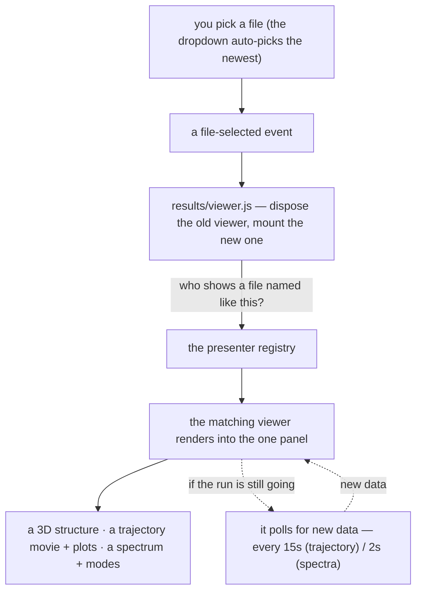
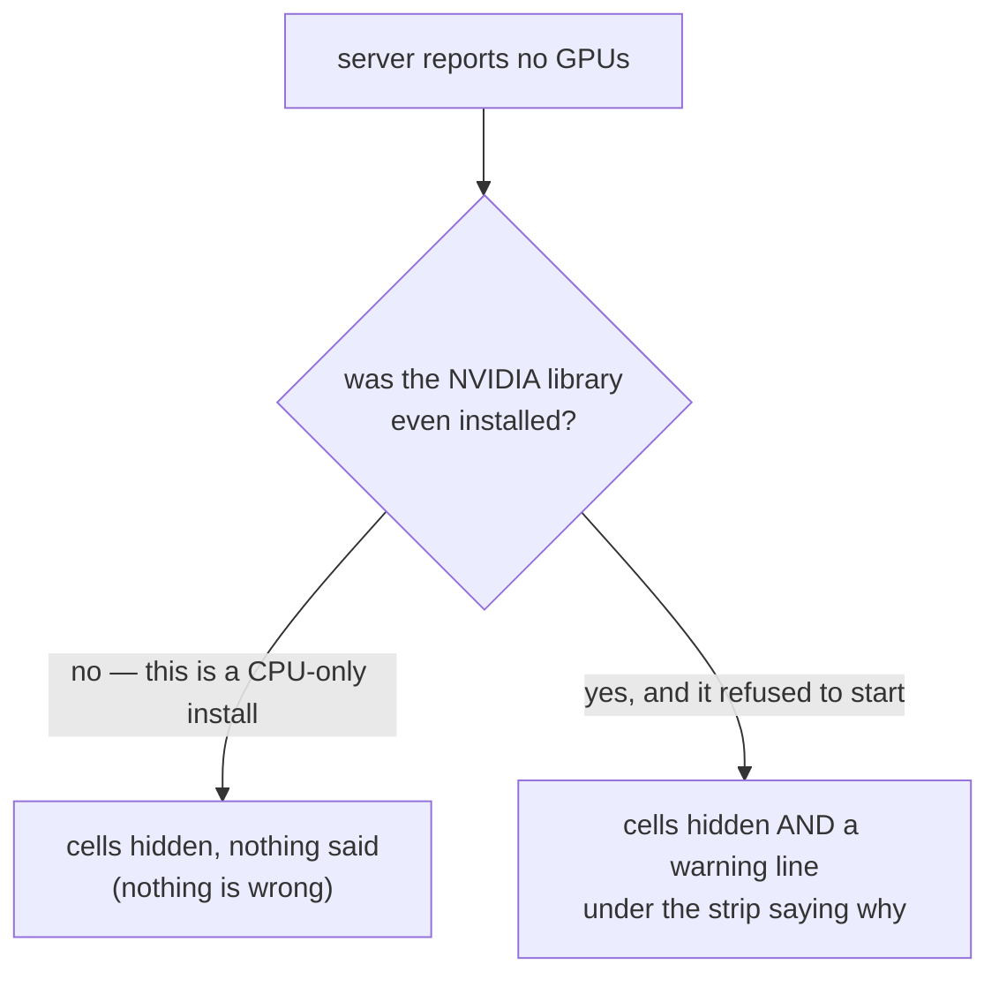

# Results tab — opening a finished calculation

**Role:** contract
**Domain:** web
**Companions:** [`presenters.md`](?doc=web/presenters.md) — the registry that
picks the viewer (this tab drives it); `trajectory.md` and `spectra.md` — the two
heavy viewers this tab hosts (their own docs); [`projects.md`](?doc=web/projects.md)
— the file layer the picker lists through; [`web-api.md`](?doc=web/web-api.md) —
the `/api/watch/*`, `/api/results/bundle` and `/api/system/load` routes.

You ran a calculation; you open it on the **Results** tab. The tab is a
**dispatch shell**: a file picker across the top, and one panel below that
becomes *whatever viewer fits the file you picked* — a 3D structure, a trajectory
movie, or a spectrum. The tab itself draws nothing; it delegates every file type
to a viewer.

## 1. What the page is

`/results` renders a template and does the rest in the browser. Its controller
(`results/viewer.js`) is deliberately tiny — it owns one mount point
(`#inspector-host`), holds exactly one live viewer handle, and does only three
things on each selection: **pick** the viewer for the file, **dispose** the
previous one, and **mount** the new one. All the file-type knowledge lives in the
viewers (the "presenters", [`presenters.md`](?doc=web/presenters.md)), not here —
so adding a result type is a new presenter module, never an edit to this
controller.

## 2. Picking a file

The picker (`lib/results/file-picker.js`) lists the **result-class** files in the
current project folder — the files some presenter has marked as a result
(`isResult`, see presenters.md) — newest first, grouped by kind (the group with
the newest file floats to the top). It **auto-picks the newest** so a viewer
appears without a click, and mirrors your pick to the sidebar so the highlight
matches.

Two details that matter:

- **A file-selected event is the single source of truth.** When you choose from
  the dropdown, it fires a `fileSelected` event that the controller listens for.
  (It used to react to sidebar clicks directly; that was retired because a stray
  single-click could hijack a viewer mid-load. Now only the dropdown drives what
  is mounted.)
- **Refresh re-scans the folder, and tells a live viewer to re-fetch its data
  *now*** rather than waiting for the next poll. The panel isn't torn down and
  rebuilt — the mounted viewer reloads in place — but that reload is a *clean*
  one (§ 4), so a trajectory jumps back to its first frame. The picker stays
  visible even when a folder has zero results, so Refresh is always reachable,
  and it re-scans automatically when you return to the tab (so a file written
  while you were away shows up).

## 3. Showing the file

The controller asks the registry "who shows a file named like this?", disposes
whatever was mounted (dropping its timers and 3D contexts so nothing leaks), and
mounts the chosen viewer into the one panel. For the slow, 3D viewers it first
drops an opaque **"parsing…" cover** over the panel so the *previous* scene can't
be mistaken for the new result while it loads; the cover lifts when the viewer
signals it has painted (or after a 15-second safety timeout).

The three viewers you can land in:

- a **read-only 3D structure** for a `.xyz`/`.pdb` ([`presenters.md`](?doc=web/presenters.md)),
- a **trajectory movie + plots** for an optimization log (`trajectory.md`),
- a **spectrum chart + modes** for a `.spectra.json` (`spectra.md`).

## 4. What a mounted viewer remembers

Each viewer keeps a small amount of state, and it's worth knowing the shape
because it explains how Refresh behaves. A viewer holds: the **parsed file**
(replaced whole on a file switch, never patched), your **per-file view** (which
frame or which mode you're looking at — reset when you switch files), and your
**per-session preferences** (which survive a file switch). If the run is still
going, a **poll timer** is running.

The one rule to remember: **"Refresh = open the same file again."** Refresh is
not a special path — it runs the exact same clean reload a file-switch does
(cancel anything in flight, clear derived data, reset the view, keep your
preferences). That single rule is what eliminated a whole class of
half-refreshed-state bugs. Two guards back it up: a **late response from a
previous file can't write into the current view**, and **partial frames** the
parser flags as in-progress are shown in the list but kept out of the plots.

## 5. Sending a finished run to the next stage — the bundle

Below the viewer sits an always-visible **Bundle** card. When a run has
converged, it hands the finished geometry to your *next* calculation: it posts to
`/api/results/bundle`, and the server reads the run directory, fuses the **final
geometry + the region labels + the frozen-atom set**, and writes a
**`<stem>.xyz` + `<stem>.molstruct.json` pair** into a target folder. The next
tab's ordinary `.xyz` load path picks that pair up unchanged — so your converged,
*labeled* geometry flows straight into the next stage (a transport run, say)
without re-entering anything. If the geometry it found is an *initial* rather than
a converged one, the card says so.

## 6. Watching the machine — the server-load strip

Below the Bundle card sits the second always-visible card: **Server load** — what
the machine itself is doing, as opposed to what your calculation produced. It
mounts on this tab and no other, because this is the tab you sit on while a run
proceeds; putting it on every page meant every page paid for a 1 Hz hardware
probe nobody was reading.

**It is collapsed on your first visit.** You click the `≡` pill to open it, and
that choice is remembered for the rest of the browser session (it resets when you
close the browser — this is a transient view preference, not a setting). The
default is deliberate: an expanded strip used to overlay the bottom of the plots
on every fresh visit, so you opt in to it rather than it opting you in.

While it is open, it asks the server for a fresh reading **once a second** and
keeps the last **600 readings — ten minutes** — as a sparkline behind each
number. It stops asking entirely when you collapse it, and pauses while the
browser tab is in the background: a hidden widget doing 1 Hz server work is pure
waste. Each cell colours its line by the current value — green below 50%, amber
below 80%, red at 80% and above.

### 6.1 The five cells, and the question each answers

| Cell | Number on the strip | The question it answers |
| --- | --- | --- |
| **CPU** | busy %, and `~N/M cores` | Is the run actually using the cores you gave it? |
| **RAM** | busy %, and used/total GB | Is this box about to run out of memory? |
| **GPU** | SM compute % | Are GPU kernels actually running? |
| **GPU BW** | memory-controller % | Is the GPU waiting on memory rather than computing? |
| **VRAM** | busy %, and used/total GB | Will a bigger system fit on this card? |

The GPU cells only appear when the server reports a usable GPU (§ 6.3).

### 6.2 The detail block is the part that diagnoses

Under each number is a text block that is always on screen — it used to be a
hover tooltip, which re-positioned itself on every 1 Hz redraw and was therefore
unreadable. The blocks carry the numbers a percentage alone hides:

- **CPU** — how many physical cores this box has, how many logical ones if SMT
  is on, and how many core-equivalents are busy right now. *Why it matters:*
  "50%" on a 20-physical / 40-logical box could mean ten cores pinned or twenty
  threads half-idle; `~10.0/20 cores` says which. It also prints the Unix load
  average over 1, 5 and 15 minutes and flags **`[over-subscribed: load > physical
  cores]`** — a run queue that is queueing looks identical to a healthy one at
  100% CPU, and only the load average tells them apart.
- **CPU, per socket** — on a multi-socket box, one row per socket. When one
  socket is above 70% and another more than 50 points below it, the block says
  **`[asymmetric: likely NUMA-pinned to one socket]`**. *Why it matters:* a
  SIESTA-GPU run pins its ranks to the socket nearest the GPU, so the other
  socket sitting idle is the sign the pin is **working** — aggregate CPU% reads
  that same healthy state as "the machine is half-used". Both sockets half-busy
  is the bad case: ranks spread across sockets, paying the interconnect penalty.
  (Absent on single-socket hosts and wherever `lscpu` can't be read.)
- **RAM** — used and total in GB.
- **GPU / GPU BW / VRAM** — one breakdown per device: name, SM compute %, memory
  bandwidth %, VRAM used/total, power draw, temperature, SM clock and memory
  clock. *Why those four extras matter:* power dropping mid-run means a thermal
  or power cap has engaged, and the SM clock falling while utilisation stays at
  100% is usually the underlying cause. The GPU BW cell adds the reading that is
  hardest to guess: **high bandwidth with low SM compute means the kernel is
  waiting on memory, not computing — more ranks won't help, a smaller block size
  might.** Fields the chip doesn't expose show as `—` rather than a zero.

### 6.3 When the GPU cells are missing

An empty GPU list has two causes, and they are opposite news:

The server tells them apart with a `gpu_error` field on every reading: `null`
when this host simply has no GPU support installed, and the reason as text when
the NVIDIA library **was** installed — meaning this box is meant to have a GPU —
and could not reach the driver. Only the second case prints anything, because
only the second case is something being wrong.

That distinction was added on 2026-08-04 after the silent version cost real time:
a driver upgrade on the development host left the userspace library ahead of the
loaded kernel module, `nvidia-smi` was dead for five weeks, and all the monitor
did was quietly show a tidy two-cell strip that read as "this machine has no
GPU". The same broken driver would have failed any GPU calculation submitted in
that window, since CUDA reaches the driver the same way.

**You do not have to open the card to find out.** A fault that is only visible
inside a folded-away card is a fault nobody sees, and the card is folded by
default — so when the reading comes back faulted, the `≡` pill itself turns
amber and grows a `!`, and hovering it gives the reason. That is the one part of
the card that is always on screen. To get it, a collapsed card makes **exactly
one** request when the page loads and reads nothing from it but `gpu_error` —
one request per page load, not a stream, so the "collapsed means no polling"
rule still holds.

One more thing to know when you see that warning: **the driver is checked once,
when the server starts.** Fixing the host is not enough on its own — a server
that started while the driver was broken stays GPU-blind for its whole life.
Restart it. The server log carries the same message at warning level, so it is
also in the terminal you started the server from.

## 7. A worked example

You just ran a SIESTA geometry optimization; its `*_optim.molwatch.log` sits in
`projects/BDT/opt/`. Open the **Results** tab. The picker scans that folder, sees
the log is a trajectory-class file, and auto-selects it. The controller mounts the
**trajectory** viewer — a 3D movie of the relaxation plus energy and max-force
plots. Because the run is still going, the viewer polls `/api/watch/data` every
15 seconds and appends new frames live. When it converges you click **Bundle**,
and Results writes `handoff.xyz` + `handoff.molstruct.json` into
`projects/BDT/opt/handoff/`; the sidebar jumps there so you can load the
converged, labeled geometry into your next calculation.

## 8. When there's nothing to show

If no presenter is registered at all, the tab shows a clear configuration warning
rather than a blank panel. If the folder simply has no results yet, the picker
shows a placeholder and stays put — Refresh remains one click away.

## 9. Where the module stands (current → target ESM)

The Results shell is still **classic**: `results/viewer.js` plus
`lib/results/file-picker.js` and `bundle-handoff.js` are global-registered scripts
(`window.molbuilder.*`), not ES modules — they lean on the runtime registry to
load in order. Converting them is task #103 (the "remaining classic modules" pass,
alongside the runtime registry and the shared primitives —
[`roadmap.md § 3`](?doc=roadmap.md)). The heavy viewers this shell *mounts* are on
a different track — the trajectory and spectra engines convert in the #102
file-viewer pass (see [`presenters.md`](?doc=web/presenters.md)).

## 10. Test map

- `test_results_blueprint.py` — the page + the registered presenter set + script
  order.
- `test_results_folder_dispatch_e2e.py` — the pick → mount dispatch end to end.
- `test_inspector_pageshow_refresh_e2e.py` — the re-scan on tab return.
