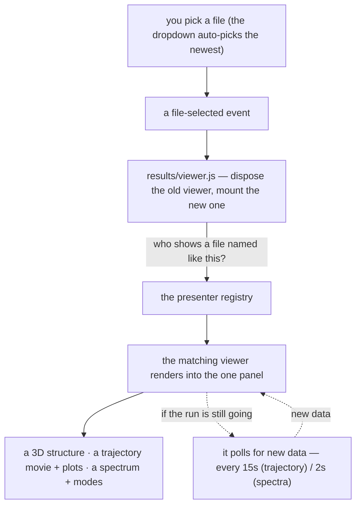

# Results tab — opening a finished calculation

**Role:** contract
**Domain:** web
**Companions:** [`presenters.md`](?doc=web/presenters.md) — the registry that
picks the viewer (this tab drives it); `trajectory.md` and `spectra.md` — the two
heavy viewers this tab hosts (their own docs); [`projects.md`](?doc=web/projects.md)
— the file layer the picker lists through; [`web-api.md`](?doc=web/web-api.md) —
the `/api/watch/*` and `/api/results/bundle` routes.

You ran a calculation; you open it on the **Results** tab. The tab is a
**dispatch shell**: a file picker across the top, and one panel below that
becomes *whatever viewer fits the file you picked* — a 3D structure, a trajectory
movie, or a spectrum. The tab itself draws nothing; it delegates every file type
to a viewer.

## 1. What the page is

`/results` renders a template and does the rest in the browser. Its controller
(`results/viewer.js`) is deliberately tiny — it owns one mount point
(`#inspector-host`), holds exactly one live viewer handle, and does only three
things on each selection: **pick** the viewer for the file, **dispose** the
previous one, and **mount** the new one. All the file-type knowledge lives in the
viewers (the "presenters", [`presenters.md`](?doc=web/presenters.md)), not here —
so adding a result type is a new presenter module, never an edit to this
controller.

## 2. Picking a file

The picker (`lib/results/file-picker.js`) lists the **result-class** files in the
current project folder — the files some presenter has marked as a result
(`isResult`, see presenters.md) — newest first, grouped by kind (the group with
the newest file floats to the top). It **auto-picks the newest** so a viewer
appears without a click, and mirrors your pick to the sidebar so the highlight
matches.

Two details that matter:

- **A file-selected event is the single source of truth.** When you choose from
  the dropdown, it fires a `fileSelected` event that the controller listens for.
  (It used to react to sidebar clicks directly; that was retired because a stray
  single-click could hijack a viewer mid-load. Now only the dropdown drives what
  is mounted.)
- **Refresh re-scans the folder, and tells a live viewer to re-fetch its data
  *now*** rather than waiting for the next poll. The panel isn't torn down and
  rebuilt — the mounted viewer reloads in place — but that reload is a *clean*
  one (§ 4), so a trajectory jumps back to its first frame. The picker stays
  visible even when a folder has zero results, so Refresh is always reachable,
  and it re-scans automatically when you return to the tab (so a file written
  while you were away shows up).

## 3. Showing the file

The controller asks the registry "who shows a file named like this?", disposes
whatever was mounted (dropping its timers and 3D contexts so nothing leaks), and
mounts the chosen viewer into the one panel. For the slow, 3D viewers it first
drops an opaque **"parsing…" cover** over the panel so the *previous* scene can't
be mistaken for the new result while it loads; the cover lifts when the viewer
signals it has painted (or after a 15-second safety timeout).

The three viewers you can land in:

- a **read-only 3D structure** for a `.xyz`/`.pdb` ([`presenters.md`](?doc=web/presenters.md)),
- a **trajectory movie + plots** for an optimization log (`trajectory.md`),
- a **spectrum chart + modes** for a `.spectra.json` (`spectra.md`).

## 4. What a mounted viewer remembers

Each viewer keeps a small amount of state, and it's worth knowing the shape
because it explains how Refresh behaves. A viewer holds: the **parsed file**
(replaced whole on a file switch, never patched), your **per-file view** (which
frame or which mode you're looking at — reset when you switch files), and your
**per-session preferences** (which survive a file switch). If the run is still
going, a **poll timer** is running.

The one rule to remember: **"Refresh = open the same file again."** Refresh is
not a special path — it runs the exact same clean reload a file-switch does
(cancel anything in flight, clear derived data, reset the view, keep your
preferences). That single rule is what eliminated a whole class of
half-refreshed-state bugs. Two guards back it up: a **late response from a
previous file can't write into the current view**, and **partial frames** the
parser flags as in-progress are shown in the list but kept out of the plots.

## 5. Sending a finished run to the next stage — the bundle

Below the viewer sits an always-visible **Bundle** card. When a run has
converged, it hands the finished geometry to your *next* calculation: it posts to
`/api/results/bundle`, and the server reads the run directory, fuses the **final
geometry + the region labels + the frozen-atom set**, and writes a
**`<stem>.xyz` + `<stem>.molstruct.json` pair** into a target folder. The next
tab's ordinary `.xyz` load path picks that pair up unchanged — so your converged,
*labeled* geometry flows straight into the next stage (a transport run, say)
without re-entering anything. If the geometry it found is an *initial* rather than
a converged one, the card says so.

## 6. A worked example

You just ran a SIESTA geometry optimization; its `*_optim.molwatch.log` sits in
`projects/BDT/opt/`. Open the **Results** tab. The picker scans that folder, sees
the log is a trajectory-class file, and auto-selects it. The controller mounts the
**trajectory** viewer — a 3D movie of the relaxation plus energy and max-force
plots. Because the run is still going, the viewer polls `/api/watch/data` every
15 seconds and appends new frames live. When it converges you click **Bundle**,
and Results writes `handoff.xyz` + `handoff.molstruct.json` into
`projects/BDT/opt/handoff/`; the sidebar jumps there so you can load the
converged, labeled geometry into your next calculation.

## 7. When there's nothing to show

If no presenter is registered at all, the tab shows a clear configuration warning
rather than a blank panel. If the folder simply has no results yet, the picker
shows a placeholder and stays put — Refresh remains one click away.

## 8. Where the module stands (current → target ESM)

The Results shell is still **classic**: `results/viewer.js` plus
`lib/results/file-picker.js` and `bundle-handoff.js` are global-registered scripts
(`window.molbuilder.*`), not ES modules — they lean on the runtime registry to
load in order. Converting them is task #103 (the "remaining classic modules" pass,
alongside the runtime registry and the shared primitives —
[`roadmap.md § 3`](?doc=roadmap.md)). The heavy viewers this shell *mounts* are on
a different track — the trajectory and spectra engines convert in the #102
file-viewer pass (see [`presenters.md`](?doc=web/presenters.md)).

## 9. Test map

- `test_results_blueprint.py` — the page + the registered presenter set + script
  order.
- `test_results_folder_dispatch_e2e.py` — the pick → mount dispatch end to end.
- `test_inspector_pageshow_refresh_e2e.py` — the re-scan on tab return.
