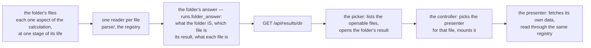
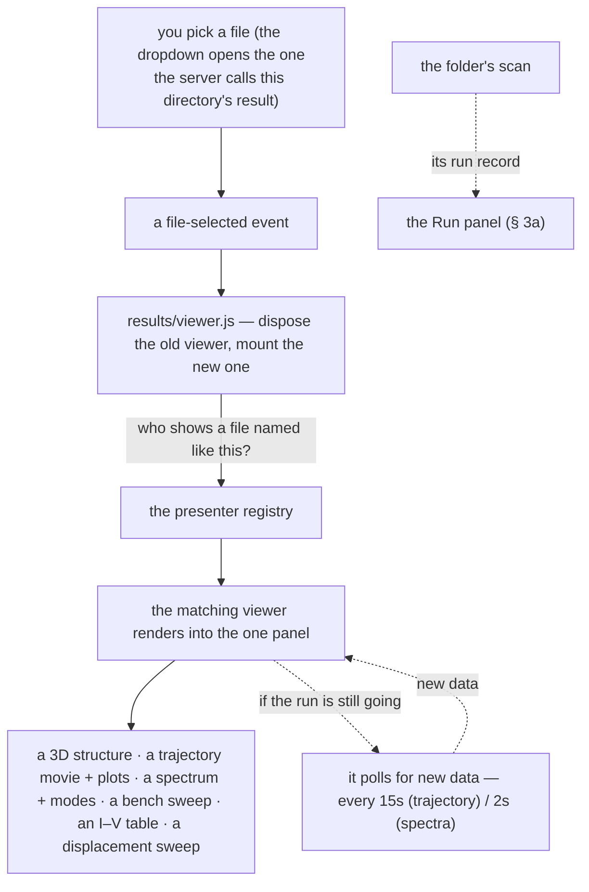
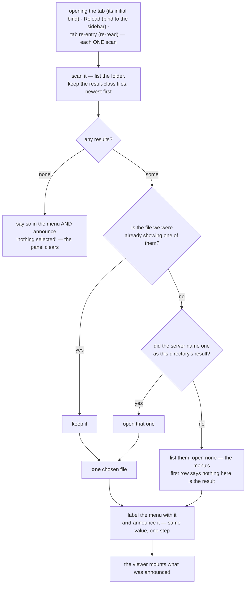
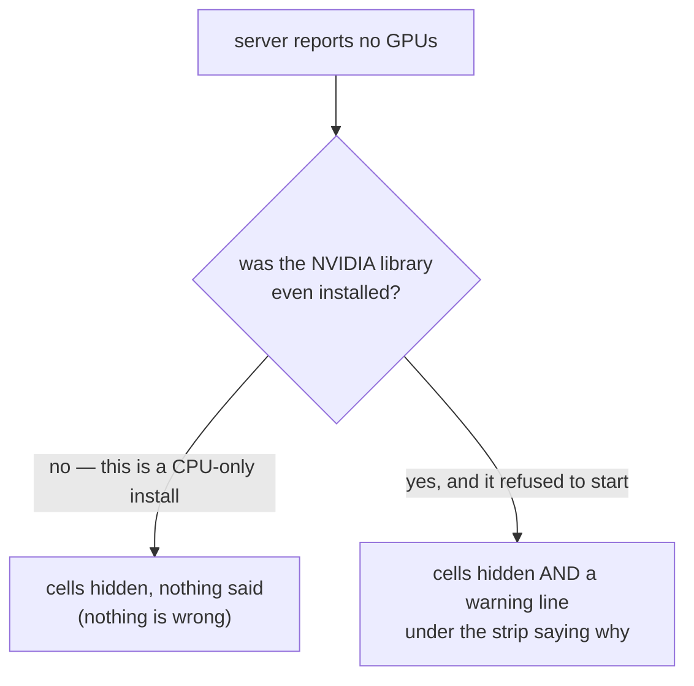

# Results tab — opening a finished calculation

**Role:** contract
**Domain:** web
**Companions:** [`presenters.md`](?doc=web/presenters.md) — the registry that
picks the viewer (this tab drives it); `trajectory.md` and `spectra.md` — the two
heavy viewers this tab hosts (their own docs); [`projects.md`](?doc=web/projects.md)
— the sidebar's file layer, which sets this tab's scope; [`model/parse.md`](?doc=model/parse.md)
§ 5 — the directory reader behind `/api/results/dir`, this tab's primary server
call; [`web-api.md`](?doc=web/web-api.md) — that route, plus `/api/watch/*` and
`/api/system/load`.

You ran a calculation; you open it on the **Results** tab. The tab is a
**dispatch shell**: a file picker across the top, and one panel below that
becomes *whatever viewer fits the file you picked* — a 3D structure, a trajectory
movie, a spectrum, a bench sweep, a transport run's I–V table, or a vibration's
displacement sweep. The tab draws no file itself — every file
type is a viewer's — only the Run panel (§ 3a) and the server-load strip (§ 6).

## 0. The tab as a system — read this first

**What it is.** You open a folder; the tab shows the result that folder holds,
in the way that kind of result is read. It is three parts in a row: the
**server** says what the folder is and what each file in it is; the **picker**
lists what can be opened and opens the folder's own result; a **presenter** —
one per kind of result — shows it.

```mermaid
flowchart LR
  F["the folder's files<br/>each one aspect of the calculation,<br/>at one stage of its life"] --> R["one reader per file<br/>parse/, the registry"]
  R --> D["the folder's answer — runs.folder_answer:<br/>what the folder IS, which file is<br/>its result, what each file is"]
  D --> API["GET /api/results/dir"]
  API --> P["the picker: lists the openable files,<br/>opens the folder's result"]
  P --> C["the controller: picks the presenter<br/>for that file, mounts it"]
  C --> V["the presenter: fetches its own data,<br/>read through the same registry"]
```

### 0.1 Each kind of folder, and what it is shown as

| the folder is | the picker opens | shown by | its data |
|---|---|---|---|
| **one run** — an attempt directory, or one rung's files in a flat calculation | the run's result: its product if it made one (a spectrum, an optimized structure), else the engine's output (`-runN.out`, `-runN.pyscf.log`), else its progress log (§ 2.3) | the viewer for that file — trajectory (steps, energy, forces, SCF, how the run ended), spectra or structure | `/api/watch/*` parses the one file through the registry ([`trajectory.md`](?doc=web/trajectory.md)); `/api/spectra/*`; the structure's file door |
| **a calculation root** | a result file at the root if it holds one, **beside** the **ladder** — each rung's state and **every run of the calculation**, any of which is opened here when picked (§ 2.4) | the ladder card, and the picked run's presenter | `/api/results/dir` → `ladder` (`jobset/runstatus.py`) |
| **a benchmark** | its `job-set.json` (`kind: sweep` — a ladder's `job-set.json` is not openable) | the bench summary: its trials compared ([`bench-summary.md`](?doc=web/bench-summary.md)) | `/api/bench/summary` (`jobset/summarize.py`) |
| **a transport calculation** | its `<label>.transport.json` | the transport report: the I–V table and what is not drawn | the record file itself |
| **a SIESTA vibration with a displacement sweep** | its `<label>.fc-sweep.json`, once `summarize run` has written it | the sweep: each force-constant stage and what it varied, each mode's frequency per stage, the force-constant changes, the paths of each stage's own files ([`engines/vibration.md`](?doc=engines/vibration.md) § 5.9) | the record file itself |
| **a folder not marked as part of a calculation** | whatever result it holds, read alone | as above | as above |

**A single run and a higher-level report are different by nature.** A run is
reported from its own files. A ladder, a benchmark and a transport calculation
are built from their rungs or trials, each by its own presenter, and each
answers its own question — *which rung is next*, *which setting is fastest*,
*what is the conductance*. They are never merged into one report.

### 0.2 How it is built

| part | module | what it does |
|---|---|---|
| the folder's answer | `runs.py` — the run door's `folder_answer` ([`execution/architecture.md`](?doc=execution/architecture.md) § 3.2), served by `web/blueprints/results.py::api_results_dir` | what the folder is (`place`: run · container · not marked), its engine, the file to open (`openable`); per file, its role, label, stage, whether a parser reads it (`parser`) and what it is (`about`, § 3b); for a calculation root, the ladder |
| the picker | `lib/results/file-picker.js` | scans the folder the sidebar scopes, drops files nothing can read and files no presenter calls a result, opens `openable`, and announces the choice with `place`, `ladder` and `record` |
| the file card | `lib/results/file-card.js` (§ 3b) | what the file in hand is — the dropdown's, or one clicked in the sidebar inside the folder the panel shows: what it holds and who wrote it, or *not written by molbuilder* |
| the Run panel | `lib/results/run-panel.js` (§ 3a) | the run the folder's files came from — its `record` — above whichever presenter is mounted; hidden for a container and a folder with no run |
| the controller | `results/viewer.js` | picks the presenter for the announced file, disposes the old one, mounts the new one; with nothing to show, the card that says what the folder is, and its ladder |
| the presenters | `lib/inspectors/*.js`, through `registry.js` ([`presenters.md`](?doc=web/presenters.md)) | one per kind of result; each loads its own data |
| their data | trajectory: `/api/watch/load`, `/api/watch/data` (`watch.py`) · spectra: `/api/spectra/*` · bench: `/api/bench/summary` · transport, the displacement sweep: `/api/files/*` | each reads its file through the registry — the readers the rest of molbuilder uses ([`model/parse.md`](?doc=model/parse.md)) |

### 0.3 The rules that keep it right

- **A run's files do not conflict.** Each is the same calculation reporting
  one aspect at one stage of its life — the deck what was asked, `run.json`
  that it was sent, the engine's output its own account, the monitor the
  machine's, `.concluded` the exit — and the catalogue (`runfiles.WRITTEN`)
  says which is which. Two files stating related facts are two aspects, not
  two answers to reconcile.
- **One reader per file, one presenter per kind of result** — not one
  presenter for everything, and never a second reader beside a file's own.
- **The folder's kind decides its report.** A run's report is not a ladder's,
  a benchmark's or a transport calculation's, and none is built from another.
- **The server says what a file is; the browser does not guess from its
  name** (§ 2.3).

### 0.4 Designed, not built yet

- **`status`**, on the same answer — how the run is doing — is served and not
  yet shown for a run folder beyond the Run panel's verdict; the trajectory
  viewer's badge shows the open file's own ending.

## 1. What the page is

`/results` renders a template and does the rest in the browser. Its controller
(`results/viewer.js`) is deliberately tiny — it owns one mount point
(`#inspector-host`), holds exactly one live viewer handle, and does only three
things on each selection: **pick** the viewer for the file, **dispose** the
previous one, and **mount** the new one. All the file-type knowledge lives in the
viewers (the "presenters", [`presenters.md`](?doc=web/presenters.md)), not here —
so adding a result type is a new presenter module, never an edit to this
controller.

```mermaid
flowchart TD
  U["you pick a file (the dropdown opens the one<br/>the server calls this directory's result)"] --> EV["a file-selected event"]
  SC["the folder's scan"] -. "its run record" .-> RP["the Run panel (§ 3a)"]
  EV --> CTRL["results/viewer.js — dispose the old viewer, mount the new one"]
  CTRL -->|"who shows a file named like this?"| REG["the presenter registry"]
  REG --> ENG["the matching viewer renders into the one panel"]
  ENG --> S["a 3D structure · a trajectory movie + plots · a spectrum + modes · a bench sweep · an I–V table · a displacement sweep"]
  ENG -. "if the run is still going" .-> POLL["it polls for new data — every 15s (trajectory) / 2s (spectra)"]
  POLL -. "new data" .-> ENG
```

## 2. Picking a file

The picker (`lib/results/file-picker.js`) asks **one route** — `GET
/api/results/dir` — what is in the current project folder, and shows what comes
back. Two gates decide the menu, in this order:

1. **the server's**: each file arrives carrying `parser`, the answer to *can
   anything here read this file* (`parse.registry.detect`). `null` is dropped —
   the browser must not offer a file nothing can open.
2. **the presenter's**: of what survives, the files some viewer marks as a
   result (`isResult`, see presenters.md).

What is left is listed newest first, grouped by kind (the group with the newest
file floats to the top). **The opened file is the server's answer, not the
newest** — `openable`, from the run door (`runs.folder_answer`), which opens
the run the folder speaks for at what its *calculation* produces, and looks at
no date (`model/parse.md` § 5.1–§ 5.2). The picker mirrors your pick to
the sidebar so the highlight matches.

*(Both sentences above were the opposite until 2026-09-18: the picker listed
through `/api/files/list`, ran seven filename predicates of its own, and took
the newest survivor. Over 110 real run directories that guess offered 13 files
no parser can read and hid 155 a parser handles, and it differed from the door's
pick on 18 of 96.)*

### 2.1 The sidebar sets the scope; the dropdown decides what you see

These are the only two controls that touch what this tab displays, and they do
**different jobs**. Getting them confused is what produced the worst defect this
tab has had, so the division is written out in full:

| You do this | What happens |
| --- | --- |
| **Navigate the sidebar to another folder** | **nothing here.** The panel stays on the folder it is bound to, and the header says the sidebar has moved on |
| **Single-click a file** in the sidebar | the **file card** says what it is (§ 3b), when it is in the folder the panel shows; nothing else here changes — a single click is a preview, and the mounted viewer stays |
| **Double-click a file** in the sidebar | opens it in the sidebar's own **file viewer** (the same modal the View button opens). It does **not** reach this panel |
| **Pick from the dropdown** | that file is mounted, and everything below follows it |
| **Reload from current project dir** | **binds the panel to wherever the sidebar is now**, lists that folder's results, and tells a live viewer to re-fetch. This is the sidebar's whole authority over this tab |
| **Come back to the browser tab** | re-reads the folder already bound, so files written while you were away appear. It does **not** re-point |
| **Open the tab** | binds the panel to the folder this tab was last pointed at and scans it **once**. The browser's `pageshow` fires on every load, but only a page restored from the back/forward cache comes back holding an old listing, so only that restore re-reads (`file-picker.js::_onPageShow`). Until 2026-09-27 every load scanned twice, and the second scan emptied the menu the first had filled, at the moment the load completed |

**A double-click shows a file; it never mounts one here.** The interaction
model (2026-06-07) says a double-click runs the active tab's *"use this file"*
action. Molbuilder loads the structure onto the canvas, spectra loads the
file; this tab had none, so the gesture did nothing at all. Its action is the
**viewer**, not a mount: the panel is built from the
list and the list is re-read only when you ask, so a sidebar gesture that
mounted something would put back the coupling Reload replaced. You can look
inside any file you like without disturbing what you are reading.

*(**Not every tab is supposed to have one.** This paragraph said "every other
tab has one" until 2026-09-19, and the commit that added it said /results was
"the only tab that ignored the commit gesture" — both false.
`/transport-calculation` shows the sidebar and subscribes to **neither**
channel, deliberately: the citation is that tab's one structure door, and a
sidebar commit would be a second source for one fact (user, 2026-08-29). It is
pinned by `tests/test_transport_blueprint.py::test_core_js_reads_no_sidebar_structure_channel`.
Read as written, the sentence would send someone to wire transport and reverse
a recorded decision.)*

**The panel owns a folder; Reload is the only thing that moves it.** The
button says *"Reload from current project dir"* and not *"Refresh"* for that
reason — the old name described the effect on the listing and said nothing
about *where from*, which is the only part you now have to know. Browsing
is browsing — scrolling the sidebar around to see what is where cannot disturb
a result you are reading. What you get back is an explicit gesture.

**The dropdown dictates the display within that folder.** The four plots, the
run-state badge, the convergence-target card, the 3-D structure and the
trajectory all render the dropdown's current selection and nothing else. There
is no second route to a mounted viewer — the page-load shortcut that mounted a
remembered file before the scan was removed 2026-09-19, because it was one.

> **The defect this prevents** (2026-08-04). The dropdown used to scope itself
> once, when the tab mounted, and never again. Moving the sidebar to a different
> run folder therefore left it enumerating the *previous* folder's files — so the
> plots, the badge, the convergence targets and the structure all kept rendering
> a different run, with nothing on screen saying so. A **live** job was displayed
> as a finished one from another directory, and the numbers looked entirely
> plausible. Reloading the page or re-picking in the dropdown fixed it, because
> both make the picker speak; nothing else did.
>
> **The fix chosen then was to follow the sidebar; the fix now is to say where
> you are** *(2026-09-19)*. Read the note again and the fault is in one clause:
> *with nothing on screen saying so*. Following was one way to keep the panel
> honest, and it cost you your place every time you went looking for something.
> Naming the folder in the header is the other way, and it is the one that
> survives you scrolling around. The two are alternatives, not a pair — **if
> the header readout ever goes away, the subscription has to come back.**
> `results/style.css` carries the same warning where the CSS that hid it used
> to be.

### 2.2 One scan, one choice, one announcement

Everything the picker does is one pass, and the shape matters because two of
this tab's three worst defects came from the same mistake — **deriving "which
file is current" twice, by two different routes.**

```mermaid
flowchart TD
  T["opening the tab (its initial bind) · Reload (bind to the sidebar) ·<br/>tab re-entry (re-read) — each ONE scan"] --> S["scan it — list the folder,<br/>keep the result-class files, newest first"]
  S --> E{"any results?"}
  E -->|"none"| N["say so in the menu AND announce<br/>'nothing selected' — the panel clears"]
  E -->|"some"| K{"is the file we were<br/>already showing one of them?"}
  K -->|"yes"| KEEP["keep it"]
  K -->|"no"| D{"did the server name one<br/>as this directory's result?"}
  D -->|"yes"| NEW["open that one"]
  D -->|"no"| NONE["list them, open none — the menu's<br/>first row says nothing here is the result"]
  NONE --> A
  KEEP --> ONE["<b>one</b> chosen file"]
  NEW --> ONE
  ONE --> A["label the menu with it<br/><b>and</b> announce it — same value, one step"]
  A --> M["the viewer mounts what was announced"]
```

**The chosen file is computed once and used for both.** The menu's label and the
mounted viewer are two uses of one value, never two derivations of "the right
one". Announcing without labelling — or labelling without announcing — is the
bug, not an optimisation.

> **Why this is spelled out.** The picker used to build two orderings of the same
> files: a flat list, newest-first, ties broken **by file name**; and a grouped
> list, ties broken **by category label**. It labelled the menu from the grouped
> one and mounted from the flat one. Those agree right up until several results
> share a timestamp — which is exactly what a job does when it finishes and
> flushes its outputs in the same second. On 2026-08-04 a pySCF run with four
> files stamped `10:31:08` showed `…molwatch.log` in the menu while displaying
> `…_optimized.xyz`. Both orderings were individually correct; having two was the
> defect.
>
> The empty case failed the same way from the other side: a folder with no
> results updated the menu and told nobody, so the previous folder's run stayed
> on screen — plots, badge and all.

### 2.3 A run is one result, not a pile of files

A calculation writes several files, and they are **not peers**. One of them is
the result; the rest are its working parts — the input echoed back, the seed the
next run warm-starts from, the optimizer's own per-stage streams, the engine's
verbose log. The menu lists **the result**, once.

**The master absorbs its satellites.** A presenter that recognises a master file
also says which files in the same folder that master subsumes; those do not get
their own entry. So a PySCF relaxation is one line in the menu, not five.

**Which files are one run is READ, never cut out of the names.** A run file is
`<label>_<stage><role>`, and the boundary between the label and the rest cannot
be found from the string alone — a role may contain `_` (`_geom_optim.xyz`) and
so may a label. The server reads each name back with its run's label — the
description's, through the run door ([`execution/architecture.md`](?doc=execution/architecture.md)
§ 3.2) — and sends `label`, `stage` and `role` per file (`/api/results/dir`), so
a presenter asks *same run?* as an equality:

| the satellite | what it shares | how it is told apart |
|---|---|---|
| `<label>_initial.xyz` · `<label>_optimized.xyz` | the label | it **carries between rungs**, so it has no stage |
| `<label>_<stage>_geom_optim.xyz` | the label | it is **this rung's**, so its stage is the master's |

That second column is why a stage matters here at all: a ladder is *N* results,
one per rung (`stages.md` § 1.1a), so `03_tight`'s master must leave
`01_coarse`'s stream to `01_coarse`'s own master.

> The presenter used to cut the label itself, with a regular expression over
> the master's stem. It matches leftmost, so a chemistry-shaped job name —
> `au_2_bdt_02_fine` — was read as a label of `au`: none of the run's own
> satellites matched, and the relaxation listed as four entries. A different
> job in the same folder actually named `au` would have had **its** files
> absorbed into this run and disappear from the menu. Measured 2026-09-19.

Two rules keep this from hiding anything:

- **Absorption needs the master present.** A satellite is only dropped when the
  file that subsumes it is in the same listing. Delete the master, or run a job
  that never wrote one, and the satellites list normally — you can always reach
  what is on disk.
- **The sidebar still shows every file.** Absorption narrows *the result menu*,
  which is a question about what you'd want to inspect. It is not a permissions
  or visibility rule; open any file from the sidebar as always.

> **What this fixes.** PySCF's generator already nominates a single result: its
> own manifest calls `<label>.molwatch.log` the *"unified per-step log… coords,
> energy (eV), forces (eV/Å), and SCF cycle history — single-file input for
> molwatch"*. The picker ignored that and listed the run's internals beside it,
> because the structure presenter claimed **every** `.xyz` and the trajectory
> presenter claimed `*_optim.xyz` as well. One relaxation therefore appeared as
> five results: the master log, the *input* coordinates, the warm-restart seed,
> and geomeTRIC's two per-stage trajectories. The generator was right; the menu
> was reading it at the wrong granularity.
>
> Note the naming: a staged run's master is `<label>_<stage>.molwatch.log`
> while its carried satellites are plain `<label>_*`, so matching a master to
> its satellites means stripping the stage token first
> (`execution/job-contracts.md § 2.2a`).

> **And absorption cannot express a LADDER — transport is the first run that
> needs it** *(2026-09-17)*. Everything above is about one directory: a master
> and the satellites beside it. A transport run is **five directories that are
> one result** — seed, both leads, device, transmission — each holding a real
> SIESTA run with its own `.out` and `.molwatch.log`. Point the picker at one
> and three things happen, none of which this section's rules can fix:
>
> - its deliverable, `<label>.transport.json`, had **no presenter and no
>   Python reader** — the one result kind understood only in JavaScript;
> - each rung's `.out` is claimed by the trajectory presenter, so the ladder
>   lists as five unrelated entries under *SIESTA optimization*;
> - `absorbs` is asked *"does this master subsume that sibling?"* — a question
>   about one folder. It has no way to say *"these five folders are one run."*
>
> **The first is closed** (2026-09-17): `lib/inspectors/transport.js` is the
> presenter and `parse/sidecars/transport.py` the reader, so the record is
> parsed on the server like every other result. **The second and third are
> not a presenter's to fix**, and the reason they looked unfixable was that
> the picker had nothing to ask. It does now.

#### The door the picker asks

> `GET /api/results/dir` is the HTTP surface over the directory door, the run
> door's `folder_answer` ([`model/parse.md`](?doc=model/parse.md) § 5) —
> **one route, one question, one answer per directory.** It reports what the
> directory IS (`runs.place_of`, as `place`), which engine ran (the
> description's), which file a viewer should open (the run the folder speaks
> for, its result), and — for a run — its
> `status` (`run_status` with its launch record,
> [`running-a-job.md`](?doc=execution/running-a-job.md) § 4.2) and its
> `record` (§ 3a); per file, its `role`, `label`, `stage`, `parser` and `about` (§ 3b). What a
> directory is decides what is asked of it, and that rule is the run door's,
> not the route's: a container has no state and no record; a folder that does
> not say what it is holds no run of ours: listed, with nothing claimed and no
> state asked. The picker is the route's browser consumer and decides nothing from a
> filename; `presenters.md` § 2 is where that answer becomes each viewer's
> `meta`.
>
> **It is not a second ladder reader**: for a calculation root it answers
> `ladder` by consuming `jobset/runstatus.py::jobset_status`, the one ladder
> door (§ 2.4), and copies none of it.
>
> **One question is genuinely still open:** `openable` is one answer per
> DIRECTORY, and a ladder needs one answer across five. Neither `absorbs` nor
> the route can state it today. `stages.md` § 6.7 puts the layout in
> `task.json` and forbids inferring it from data, so the ladder's shape has a
> home already — what is missing is the route saying *which rung speaks for
> the calculation*. It reaches every multi-rung calculation, not just
> transport, so it wants deciding before code moves.

> **✅ That rename landed on 2026-08-10 and this section was not updated
> until 2026-09-08.** The trajectory log is named for **the deck that produced
> it** — `<label>_<stage>.molwatch.log`, the same name whether stages share a
> directory or each has its own — and the `-stage<N>` infix is gone
> ([`execution/job-contracts.md`](?doc=execution/job-contracts.md) § 2.2a).
> The consumer has already moved with it: `lib/inspectors/trajectory.js`'s
> `absorbs()` matches the current grammar. Read the rest of this note as
> history, not as a change to plan for.
> **What that costs here:** the run decoder's stage regex keys on the hyphen
> form, so it changes with the rename, and anything that groups a staged run's
> logs by parsing `N` out of the filename must instead read the stage from the
> deck's name or its directory. Worth knowing before building on the current
> shape.

- **A file-selected event is the single source of truth.** When you choose from
  the dropdown, it fires a `fileSelected` event that the controller listens for.
- **Reload re-scans the folder, and tells a live viewer to re-fetch its data
  *now*** rather than waiting for the next poll. The panel isn't torn down and
  rebuilt — the mounted viewer reloads in place — but that reload is a *clean*
  one (§ 4), so a trajectory jumps back to its first frame. The picker stays
  visible even when a folder has zero results, so Reload is always reachable,
  and it re-scans automatically when you return to the tab (so a file written
  while you were away shows up).

### 2.4 A calculation root shows its LADDER

A **hierarchical** calculation root — the directory holding `task.json` — is a
container, so it has no run state and no record
([`project-layout.md`](?doc=execution/project-layout.md) § 1.4a); what it has
is a **ladder**: N rungs, each a run directory below it. Each rung's run writes
its own result in its directory — a vibration's spectrum in its `freq` attempt
([`engines/vibration.md`](?doc=engines/vibration.md) § 5.5); only a
calculation that GATHERS its rungs into one result has one at the root — a
transport calculation's I–V record, once `summarize` has read its bias points,
and a SIESTA vibration's displacement sweep, once `summarize` has compared its
force-constant stages (§ 5.9 there).
`GET /api/results/dir` answers
such a root with `ladder: {complete, first_incomplete, stages: [{name, seq,
state, detail, dir, attempt, …}], resume_from, resume_refused}` —
`JobSetStatus.to_dict`, the one wire form of `jobset_status`, the ladder door the
CLI's `status` verb reads — consumed, never copied: every stage of the
description, the ones not prepped yet among them
([`execution/job-system.md`](?doc=execution/job-system.md) § 5.3), before
anything is prepped too — and `null` for anything else (a rung's directory). A **flat** calculation
root is itself the run: it answers a state and a record like any run directory
(§ 3a), and no ladder. A bias scan's rung reads from its first point not
finished, and its detail names the point
([`engines/transport.md`](?doc=engines/transport.md) § 2a.11).

The page's empty-state card draws it: one row per rung in ladder order, the
state in the bench summary's own chip (`inspectors.stateChip`), in `jobset
status`'s words ([`running-a-job.md`](?doc=execution/running-a-job.md) § 4.2),
the detail beside it, and the rung to resume from named in the title. A person
who opens a five-rung transport calculation therefore sees which of the five is
outstanding — `engines/transport.md` § 2a.12's third
requirement — instead of *pick a file*. A rung's files are read by opening the
rung's directory; the product, when present, is what `openable` picks at the
root.

**Every run of the calculation, in one place, picked in place** *(W55 B6,
2026-10-03 — user: "this gives a bird's eye of one parent task dir that can
have different run results in one place such that result tab would be able to
show them (don't have to get into individual run dir to probe, and rather
result can display the result by simply select which run to pick")*. The
root's answer lists every run of the calculation under its stage — each stage's
attempts, a benchmark's trials, a bias scan's points — each with its state, its
folder and the file it opens; the states are status's, which reads **every**
attempt, so a launched run that has not ended is never hidden behind a newer
one. **Picking a run shows its result in this panel** — the file that run's
own folder would open, with its Run panel — while the sidebar stays on the
calculation; *back to the calculation* returns to the ladder. A calculation's
own product — a transport I–V, a displacement sweep — is shown **with** the
ladder, never instead of it, and its rows name the attempt and the point each
fact came from. A flat calculation's root lists its stages' runs the same way,
by run number. *(Until 2026-10-03 the ladder's rows were text: a run was read
by moving the sidebar into its folder, a root's product hid the ladder, and
status read only each stage's newest attempt.)*

## 3. Showing the file

The controller asks the registry "who shows a file named like this?", disposes
whatever was mounted (dropping its timers and 3D contexts so nothing leaks), and
mounts the chosen viewer into the one panel. For the slow, 3D viewers
(trajectory, structure, spectra) it first drops a near-opaque **"parsing…"
cover** over the panel — the page's own background at 78 % with a blur — so
the *previous* scene can't be mistaken for the new result while it loads; the
cover lifts when the viewer signals it has painted, or failed to (a viewer
that cannot load its file says so and signals too), or after a 15-second
safety timeout.

The viewers you can land in — **six, all from the result dropdown**
([`presenters.md`](?doc=web/presenters.md) § 1 is the registry's own list).
Each sits on page-shell's `.card` surface: the structure, spectra and the
three record viewers as one card each, the trajectory viewer's 3-D view on
one, with its run badge, notes and plots around it:

- a **read-only 3D structure** for a `.xyz`/`.pdb`,
- a **trajectory movie + plots** for an optimization log (`trajectory.md`),
- the **modes and a chart** — the spectrum where a strength was computed,
  the mode positions where none was — for a `.spectra.json` (`spectra.md`),
- a **bench sweep summary + chart** for a sweep's `job-set.json`
  (`bench-summary.md`),
- an **I–V table + transmission plot** for a `<label>.transport.json`,
- a SIESTA vibration's **displacement sweep** for a `<label>.fc-sweep.json`.

The **markdown editor** and the **plain paginated text pane** are registered
too, `isResult: false`, and the menu never lists them — so on this tab they
never mount: nothing reaches a viewer except through the dropdown (§ 2.1),
and a double-click opens the sidebar's own file viewer instead. No other page
loads the registry, so they mount nowhere; they are kept registered by
decision (2026-09-28) until you decide whether the markdown editor returns to
this tab.

*(This said "the three viewers" until 2026-09-17, "four" until 2026-09-19,
and "five" until 2026-09-28, each time omitting a presenter that had been
registering the whole time — bench-summary, transport, then the displacement
sweep; and until the same day it said the markdown and text viewers mounted
"when the tab reopens on a file you were already looking at", a route removed
on 2026-09-19. `presenters.md` § 1 carries the list that is machine-checked
against the registrations; this prose is not, which is why it drifted three
times. Read it as a tour, and that table as the count.)*

## 3a. The Run panel — what ran, with what, and how it went

**Built** (W35 P2, 2026-09-27): `lib/results/run-panel.js` and its sheet.

**A viewer shows a file; the Run panel shows the run the files came from.**
When the folder the picker is bound to is a run — a run directory, a flat
calculation root, or an unmarked folder holding a run's output, read alone
([`project-layout.md`](?doc=execution/project-layout.md) § 1.4a) —
`/api/results/dir` carries its `record` (`model/parse.md` § 5d), and
the panel sits between the picker and the viewer: the same panel for an
optimization, a vibration, each transport rung and a PySCF run, whichever of
the run's files is open. It is not a presenter — no file picks it — and it is
hidden where there is no record: a container (a stage directory, or a
hierarchical calculation root, whose ladder is § 2.4's), and a folder with no
run in it.

**A fact has one source; the page may show it twice.** The panel and a
viewer that states the same fact read it from the same file through the same
reader — the trajectory viewer's runtime line (SIESTA version · solver) and
the panel's engine and solver are both the SIESTA family's line readers on the
one `.out` (`siesta_grammar`) — so the two cannot disagree, and the viewers
keep their lines: a run directory copied out of its calculation keeps them too
*(user, 2026-09-27: "the key is to have information source unified rather than
worrying about repeats")*. What must not happen is one fact computed from two
kinds of evidence — a rate estimated from timestamps beside the SCF-timing
instrument's, an end time taken from a file's modification time beside the
output's own `>> End of run`. The trajectory viewer did both until
2026-09-27 ([`trajectory.md`](?doc=web/trajectory.md) § 4).

**Closed, it is one line** — the engine and version, the ranks, the engine's
wall time, how the latest run ended, whether each phase converged, and how
many findings — so it never pushes the result off the screen. **Open, it has
four sections**, in the order a person asks them when a number looks wrong:

| section | what it shows | from |
|---|---|---|
| **Verdict** | how the run ended, each phase's convergence, each finding as a sentence with its number; the earlier runs of the attempt and how each ended | `verdict`, `earlier` |
| **Setup** | one table — parameter · default · asked · used — the rows where asked ≠ used first and marked; an item the deck does not set reads *engine default*; a key read to several values shows them all, and the engine's own echo beside them; then, folded with its count, the keys the engine read that no catalogue item names; then the pseudopotentials | `setup` |
| **Computation** | engine, build and solver; host and environment; the launch asked beside the ranks the engine ran on; start, end, engine wall time, seconds per iteration by phase; peak memory against its limit; the exit | `computation` |
| **Deck** | its path and sha256; whether it is still the stage's current deck; for a gathered rung, what was taken from which attempt; **View**, which opens it in the sidebar's text viewer (`projects.showPreview`) | `deck` |

**Generic, so a new fact is a label.** The panel does not know engines or
kinds. It walks the record's parts and renders each field through one table
of labels and formatters keyed by the field's name — a duration as a
duration, a byte count as memory, a time of day as a time of day — so a field
the backend starts stating appears with one label added, and a field the
record leaves out ([`model/parse.md`](?doc=model/parse.md) § 5d.1a: not stated,
so not shown) leaves no row. A field the table has no label for yet shows
under its own name, so nothing the record states is hidden; the table's order
is the rows' order.

**It is re-read with the directory**, not on a timer: the picker's scan is
the one source (§ 2.1). The picker carries the record in the same selection
event as `place` and `ladder` (§§ 2.3–2.4), and forgets it at the start of
every scan, so a failed or superseded scan cannot leave one folder's record
under another folder — the fault § 2.1 records. A live run's panel shows the
record as of the last scan; Reload refreshes it with the menu.

*Module:* `lib/results/run-panel.js` renders into `#results-run-panel`,
listens to the picker's selection event — and to its scope event, because a
scan that fails announces nothing: from the moment the panel is bound to
another folder it is hidden until that folder's scan lands — and owns
`lib/results/run-panel.css`. `results/viewer.js` does not know it: § 1 keeps
it to pick, dispose and mount.

## 3b. The file card — what a file is, and who wrote it *(user, 2026-10-04)*

*("we can have a UI component where it would respond to the currently selected
file under a directory: if it is part of a manifest file, it can explain where
this file comes from and what it contains. if it is generated by the engine,
then the UI would just say this is not part of the file generated by
molbuilder.")*

**One line about the file in hand, beside the picker.** The file in hand is the
dropdown's, or a file single-clicked in the sidebar inside the folder this panel
shows (`projects.onChange`, `web/projects.md`); a click changes the card and
nothing else — the mounted viewer stays (§ 2.1). A file clicked in another
folder leaves the card as it was.

| the file is | the card says |
|---|---|
| **one molbuilder writes** — a row of the catalogue, read back with its run's label | what it holds, who writes it and when: *"the run ended on its own, with its exit code — written by the run script, as its last act"* |
| **anything else** — the engine's, SLURM's, a person's | *not written by molbuilder* |

**The words are the catalogue's, and the card composes none.** Each file of
`/api/results/dir`'s answer carries `about` — `{ours, what, writer, when}`, or
`{ours: false}` — the run door's `about(path)`
([`execution/architecture.md`](?doc=execution/architecture.md) § 3.2) over the
one catalogue, `runfiles.WRITTEN`
([`execution/job-contracts.md`](?doc=execution/job-contracts.md) § 2.2), whose
rows are also the contract's manifest
([`execution/project-layout.md`](?doc=execution/project-layout.md) § 5) and the
Task setup card. A file is the catalogue's only when its name reads back with
its run's label, so SIESTA's `fdf.<stamp>.log` is not taken for a log of ours
by its suffix.

*Module:* `lib/results/file-card.js` renders into `#results-file-card`, listens
to the picker's selection event and to `projects.onChange`, reads the `about`
the picker's scan already holds — no request of its own — and owns
`lib/results/file-card.css`.

## 4. What a mounted viewer remembers

Each viewer keeps a small amount of state, and it's worth knowing the shape
because it explains how Reload behaves. A viewer holds: the **parsed file**
(replaced whole on a file switch, never patched), your **per-file view** (which
frame or which mode you're looking at — reset when you switch files), and your
**per-session preferences** (which survive a file switch). While the run is
live, a **poll timer** is running (§ 4.1).

The one rule to remember: **"Reload = open the same file again."** Reload is
not a special path — it runs the exact same clean reload a file-switch does
(cancel anything in flight, clear derived data, reset the view, keep your
preferences). That single rule is what eliminated a whole class of
half-refreshed-state bugs. Two guards back it up: a **late response from a
previous file can't write into the current view**, and **partial frames** the
parser flags as in-progress are shown in the list but kept out of the plots.

### 4.1 A viewer follows the run, and the server says how the run is doing *(W38 M2f, 2026-10-03)*

A viewer showing a file **follows the run the file belongs to**: it polls
while the run is **live** — queued or running — and stops when it is not:
finished, failed, or never launched, when nothing more will arrive. *Live* is
the run's state, and that state has one door: `run_status`, built on how the
run's process ended (`runrecord.ending` —
[`running-a-job.md`](?doc=execution/running-a-job.md) § 4.2,
[`architecture.md`](?doc=execution/architecture.md) § 3.2), the answer the
Run panel and `jobset status` give. The server sends it with the file:
`/api/watch/load`, `/api/watch/data` and `/api/spectra/load` each carry
`run: {state, detail, live}` for the run the file belongs to — its folder,
and the run its name reads back to (`runs.run_answer`) — or `null` for
a file that belongs to no run, an upload. **A viewer never decides from the
file's own ending**: an output that states its end belongs to a job that may
still be deriving its result, and one killed mid-step states nothing at all —
both viewers followed such a run until the page closed, until 2026-10-03.

**The end is read before the file's last read.** When the server finds the
run no longer live, it reads the file again if it has changed since the read
before — so what a viewer stops on is the file's last state, in the answer
that says the run is over. That is what the trajectory viewer's
two-finished-ticks buffer approximated (*one tick can lie: the parser may
still be flushing trailing output*) and what the spectra viewer's *every
asked-for phase complete* stood in for; both are gone, and a run that stops —
a crash, a kill its monitor saw — stops the polling in the same step as a
finish.

**What a poll costs.** The run's state is asked whenever the file has
nothing new — a load, and a poll that finds it unchanged; a poll that brings
new content leaves it as it was, since the run was writing. Each output's
ending is read once per version of the file (`_run_ending.ending_of` keeps it
by the file's size and modification time), so a quiet poll costs a look at
the run's folder; and an output that states how it ended takes the ending
its own parse just read, so a load reads its file once.

### 4.2 The buckets, and how they are written

**The buckets have names in the code — five, not the four described above.**
Read from `lib/trajectory/core.js`, which is the shipped implementation:

| bucket | holds | reset |
|---|---|---|
| `fileState` | path, mtime, format, label, the parsed data | replaced **atomically** on each `LOADING → LOADED` |
| `viewState` | per-file interaction (first fit, picks) — **not the playhead**, MolView owns that | on a file switch |
| `uiPrefs` | per-session knobs (hide-frozen, …) | never — this is the "survives a file switch" half |
| `lifecycle` | the poll timer and the abort controllers | on `LOADING` |
| `derived` | recomputed from `fileState` (the SCF poll history) | with `fileState` |

#### What "atomically" means, and what it did not mean until 2026-09-03

**A name and the data that belongs to it are written together, or neither
is.** `transition("APPLY", …)` will not accept a payload without a `path`,
and drops one whose path is not the file on screen.

That row said *atomically* from the day the state machine landed, and the
code did not do it. Every caller passed `{results}` or `{mtime, data}` and
let `path` stand — the trajectory core said so in a comment, *"format/label/
path stay because the file identity didn't change"*, which is an assumption
nothing verified. A watch tick fires for file A; the user clicks B; A's
answer resolves and is written under B's name. So a **`fetchSeq` counter**
was added: each caller snapshotted it before its fetch and re-checked it
after, in five places, to notice it had written into the wrong file.

**Where the name comes from — and it is NOT the same on both sides.**
Getting this backwards would break a viewer completely, so it is spelled
out:

| viewer | the name compared | where it comes from |
|---|---|---|
| trajectory | `r.path` | the SERVER's reply — `/api/watch/load` and `/api/watch/data` both carry it, the file the server actually read |
| spectra | the requested path | the browser's own string, echoed by `fetchResults(path)` — **`/api/spectra/load` returns no `path` at all** |

Either way `APPLY` compares against `state.fileState.path`, and either way
a stale reply is refused because its own name no longer matches rather than
because a number moved.

> **Do not "tidy" the spectra side into using a server-echoed path.** There
> is none to use, and adding one would not be equivalent:
> `blueprints/spectra.py` resolves the request through
> `_resolve_within_roots`, which expands `~`, expands `$VARS` and follows
> symlinks. The echoed absolute path would then differ from the string the
> viewer was handed for every one of those cases, `APPLY` would drop
> **every** payload, and the viewer would render nothing at all — in
> silence, because a dropped payload is a `return`, not an error. The
> spectra guard is correct precisely because one string feeds both sides.

**`fetchSeq` is gone** (2026-09-04, a separate change from the correctness
fix above, deliberately). The guards it served — the status banner, the
consecutive-error count, `stopWatch` — ask the same question of the same
fact now: *is `path` still `state.fileState.path`?*

The replacement is **strictly stronger**, which is why this was a deletion
and not a trade. `transition("IDLE")` never bumped the counter, so a fetch
still in flight when the inspector was disposed passed the old guard; it
fails the new one, because `fileState.path` is null by then. The one thing
a path cannot do is tell two loads of the *same* file apart — and
`signal.aborted`, checked beside it, always could, so both halves are kept
and neither is redundant.

Two consequences worth stating, because they are the point:

- **an anonymous write cannot be expressed.** `APPLY` throws without a
  path, so "write this data" with no file attached is not a thing a future
  caller can accidentally do;
- **there is one door per panel to the load endpoint.** `spectra/core.js`
  had two — `loadByPath` read the filename from the DOM input box and
  `watchTick` read it from state, two sources of truth for *which file is
  this*. Both now go through `fetchResults(path, signal)`, which returns
  the answer paired with the name it asked for. *(The box itself went on
  2026-09-28: `loadByPath(path)` takes the dropdown's pick as its argument,
  and a run still going is followed without a button —
  [`spectra.md`](?doc=web/spectra.md) § 7.)*

*This was a static-review finding, not a test one: three tests asserted the
old shape and all three failed on the correction, one of them because a
non-greedy regex stopped at the new guard's `return`.*

**Neither half has a test now.** Removing `path` from either caller was
caught by an e2e test that computed CO2 itself --
`test_the_viewer_draws_the_run_this_suite_just_optimised` (a relaxation,
~4 s) and `test_the_viewer_reads_a_run_this_suite_just_computed` (a
frequency job, ~2 s) -- and both were retired 2026-10-04 with their files:
each ran its deck by hand, outside `init → prep → launch`, and opened that
folder as a run of ours (`process/testing.md` § 6). A relaxation and a
spectrum made on the road and opened in the browser are what prove the two
halves again; until then the load path is uncovered. The calculation is
still the proof *(user ruling, 2026-09-03: "e2e means you can calculate a CO2
molecule within 5 min and use that output to do this. Why do you need
anything copied? That would be true e2e.")* -- the road is how it is made.

The **no-new-content** arm of the trajectory's `APPLY`, which runs only on a
watch tick that finds the file unchanged, was never exercised: reaching it
needs a run that is still going while the page watches it.

*(Before the CO2 runs, no test in this suite had ever loaded a real spectra
result: every spectra e2e mounted a `job.spectra.json` that did not exist,
took the 404 and stopped in `ERROR` without reaching `APPLY`.)*

`derived` is the one the prose above folds into "the parsed file", and it is a
separate bucket for a reason: it is **recomputed**, never written by a
handler, so it resets with its source and cannot outlive it.

One `transition(target)` moves between `IDLE`, `LOADING`, `LOADED`,
`WATCHING` and `ERROR`. **`fileState`, `lifecycle` and `derived` are written
only inside it**; `viewState` and `uiPrefs` are the two an event handler may
touch directly, because a frame scrub and a hide-frozen toggle are not state
transitions.

> **Both shapes exist in the source, on purpose.** About 3,000 lines of render
> code still read the flat `state.X` names, and the buckets carry
> getter/setter aliases so those keep working — the storage moved, the callers
> did not. It is a bridge, not a second design: there is one home for each
> value and the alias reads it.

## 5. Sending a finished run to the next stage — RETIRED (2026-08-29)

The always-visible **Bundle** card that stood below the viewer is gone,
with the whole calculation-to-calculation passing model it served (user
ruling): **one kind of job never bundles itself up for another.**  A
calculation that builds on a finished result CITES it — the transport
tab picks the junction attempt actively and prep fuses the final
geometry with the labels itself, with the sort and the gates the bundle
never had (`archive/2026-09-01-transport-design.md` § 4.1,
`transport/compose.py`).  Structure → execution hand-overs
(builder/modify → parameter tab → Task setup) are a different thing and
remain.  History: `docs/archive/2026-08-29-handoff-bundle.md`.

## 6. Watching the machine — the server-load strip

Below the viewer sits the always-visible **Server load** card — what
the machine itself is doing, as opposed to what your calculation produced. It
mounts on this tab and no other, because this is the tab you sit on while a run
proceeds; putting it on every page meant every page paid for a 1 Hz hardware
probe nobody was reading.

**It is collapsed on your first visit.** You click the `≡` pill to open it, and
that choice is remembered for the rest of the browser session (it resets when you
close the browser — this is a transient view preference, not a setting). The
default is deliberate: an expanded strip used to overlay the bottom of the plots
on every fresh visit, so you opt in to it rather than it opting you in.

While it is open, it asks the server for a fresh reading **once a second** and
keeps the last **600 readings — ten minutes** — as a sparkline behind each
number. It stops asking entirely when you collapse it, and pauses while the
browser tab is in the background: a hidden widget doing 1 Hz server work is pure
waste. Each cell colours its line by the current value — green below 50%, amber
below 80%, red at 80% and above.

### 6.1 The five cells, and the question each answers

| Cell | Number on the strip | The question it answers |
| --- | --- | --- |
| **CPU** | busy %, and `~N/M cores` | Is the run actually using the cores you gave it? |
| **RAM** | busy %, and used/total GB | Is this box about to run out of memory? |
| **GPU** | SM compute % | Are GPU kernels actually running? |
| **GPU BW** | memory-controller % | Is the GPU waiting on memory rather than computing? |
| **VRAM** | busy %, and used/total GB | Will a bigger system fit on this card? |

The GPU cells only appear when the server reports a usable GPU (§ 6.3).

### 6.2 The detail block is the part that diagnoses

Under each number is a text block that is always on screen — it used to be a
hover tooltip, which re-positioned itself on every 1 Hz redraw and was therefore
unreadable. The blocks carry the numbers a percentage alone hides:

- **CPU** — how many physical cores this box has, how many logical ones if SMT
  is on, and how many core-equivalents are busy right now. *Why it matters:*
  "50%" on a 20-physical / 40-logical box could mean ten cores pinned or twenty
  threads half-idle; `~10.0/20 cores` says which. It also prints the Unix load
  average over 1, 5 and 15 minutes and flags **`[over-subscribed: load > physical
  cores]`** — a run queue that is queueing looks identical to a healthy one at
  100% CPU, and only the load average tells them apart.
- **CPU, per socket** — on a multi-socket box, one row per socket. When one
  socket is above 70% and another more than 50 points below it, the block says
  **`[asymmetric: likely NUMA-pinned to one socket]`**. *Why it matters:* a
  SIESTA-GPU run pins its ranks to the socket nearest the GPU, so the other
  socket sitting idle is the sign the pin is **working** — aggregate CPU% reads
  that same healthy state as "the machine is half-used". Both sockets half-busy
  is the bad case: ranks spread across sockets, paying the interconnect penalty.
  (Absent on single-socket hosts and wherever `lscpu` can't be read.)
- **RAM** — used and total in GB.
- **GPU / GPU BW / VRAM** — one breakdown per device: name, SM compute %, memory
  bandwidth %, VRAM used/total, power draw, temperature, SM clock and memory
  clock. *Why those four extras matter:* power dropping mid-run means a thermal
  or power cap has engaged, and the SM clock falling while utilisation stays at
  100% is usually the underlying cause. The GPU BW cell adds the reading that is
  hardest to guess: **high bandwidth with low SM compute means the kernel is
  waiting on memory, not computing — more ranks won't help, a smaller block size
  might.** Fields the chip doesn't expose show as `—` rather than a zero.

### 6.3 When the GPU cells are missing

An empty GPU list has two causes, and they are opposite news:

```mermaid
flowchart TD
  Q["server reports no GPUs"] --> A{"was the NVIDIA library<br/>even installed?"}
  A -->|"no — this is a CPU-only install"| CPU["cells hidden, nothing said<br/>(nothing is wrong)"]
  A -->|"yes, and it refused to start"| ERR["cells hidden AND a warning line<br/>under the strip saying why"]
```

The server tells them apart with a `gpu_error` field on every reading: `null`
when this host simply has no GPU support installed, and the reason as text when
the NVIDIA library **was** installed — meaning this box is meant to have a GPU —
and could not reach the driver. Only the second case prints anything, because
only the second case is something being wrong.

That distinction was added on 2026-08-04 after the silent version cost real time:
a driver upgrade on the development host left the userspace library ahead of the
loaded kernel module, `nvidia-smi` was dead for five weeks, and all the monitor
did was quietly show a tidy two-cell strip that read as "this machine has no
GPU". The same broken driver would have failed any GPU calculation submitted in
that window, since CUDA reaches the driver the same way.

**You do not have to open the card to find out.** A fault that is only visible
inside a folded-away card is a fault nobody sees, and the card is folded by
default — so when the reading comes back faulted, the `≡` pill itself turns
amber and grows a `!`, and hovering it gives the reason. That is the one part of
the card that is always on screen. To get it, a collapsed card makes **exactly
one** request when the page loads and reads nothing from it but `gpu_error` —
one request per page load, not a stream, so the "collapsed means no polling"
rule still holds.

One more thing to know when you see that warning: **the driver is checked once,
when the server starts.** Fixing the host is not enough on its own — a server
that started while the driver was broken stays GPU-blind for its whole life.
Restart it. The server log carries the same message at warning level, so it is
also in the terminal you started the server from.

## 7. A worked example

You just ran a SIESTA geometry optimization; its `*_optim.molwatch.log` sits in
`projects/BDT/opt/`. Open the **Results** tab. The picker scans that folder, sees
the log is a trajectory-class file, and auto-selects it. The controller mounts the
**trajectory** viewer — a 3D movie of the relaxation plus energy and max-force
plots. The structure the viewer holds carries the run's own periodicity,
composed on the server (`/api/watch/load`: the cell from the output logs, the
axis kinds from the run's own deck, `runs.declared`) — so what the Cell
page shows, and what an Export → Data writes, is the run's stated intent
rather than a browser guess *(2026-08-20; before this, every trajectory
export claimed all-isolated beside its own lattice)*. Because the run is
still going, the viewer polls `/api/watch/data` every
15 seconds and appends new frames live.

When it converges, **you do nothing here** — the next calculation CITES this one.
You open the tab that owns it (Transport, for a junction) and pick this attempt;
`prep` fuses the final geometry with the labels itself, with the sort and the
gates a hand-made copy never had (§ 5).

> *This example ended **"you click Bundle, and Results writes `handoff.xyz` +
> `handoff.molstruct.json`"** until 2026-09-17 — a button § 5 of this same
> document records as deleted on 2026-08-29, three weeks earlier. § 5 was
> written and the worked example was not swept, so the document said both
> things at once. Nothing writes a `handoff/` directory today; the grep confirms
> no Bundle card and no handoff route survives.*

## 8. When there's nothing to show

If no presenter is registered at all, the tab shows a clear configuration warning
rather than a blank panel. If the folder simply has no results yet, the picker
shows a placeholder and stays put — Reload remains one click away.

## 9. Where the module stands (current → target ESM)

The Results shell is still **classic**: `results/viewer.js` plus
`lib/results/file-picker.js` are global-registered scripts
(`window.molbuilder.*`), not ES modules — they lean on the runtime registry to
load in order. Converting them is the "remaining classic modules" pass,
alongside the runtime registry and the shared primitives
([`plans/plan.md`](?doc=plans/plan.md) **W15**). The heavy viewers this shell *mounts* are on
a different track — the trajectory and spectra engines convert in W15's
presenters pass (see [`presenters.md`](?doc=web/presenters.md)).

## 10. Test map

- `test_results_blueprint.py` — the page + the registered presenter set + script
  order.
- `test_inspector_pageshow_refresh_e2e.py` — the re-scan on tab return.
- `test_results_file_picker_e2e.py` — the picker: one scan per visit (§ 2.2),
  the re-read on a restore and on tab return, Reload, and the folder it owns
  (§ 2.1).
- `test_siesta_stopped_run_e2e.py::test_the_run_panel_says_what_ran_and_why_it_stopped`
  — the Run panel (§ 3a) on a SIESTA run the road makes and stops: the closed
  line, the four sections, the deck's View, and hidden for a container and
  under a rebind whose scan fails.
- `test_results_state_contract_js.py` — § 4.2's buckets and its two guards,
  on the trajectory side.
- `test_results_state_contract_spectra_js.py` — § 4.2's buckets and guards on
  the spectra side, which is a second inspector and not a copy.
- § 4.1, the run followed by the server's answer:
  `tests/data/hand_overs.toml` (the server's answer for a run that ended --
  not followed),
  `test_trajectory_settle_post_load_js.py` (the trajectory settle, as a case
  table) and `test_trajectory_transition_js.py` (its poll loop takes a quiet
  poll's answer).  *(The run's end read before the file's last read, and the
  spectra viewer letting a run go, had tests that made the run by copying an
  output; they were retired 2026-10-03, `process/testing.md` § 6.)*

*(The last two were missing from this list until 2026-09-02, which is how they
came to be read as tests of a retired design: the vocabulary they use —
`fileState`, `uiPrefs` — appeared in no live document, so a search for it
landed in `archive/` and nowhere else. § 4 names the buckets now, so the
search lands here. One word of that vocabulary has since gone from the code
too: `fetchSeq` was deleted 2026-09-04 and the seven tests pinning it went
with it — a name with no live home is a question, and the answer is
sometimes "because it should not be there".)*
