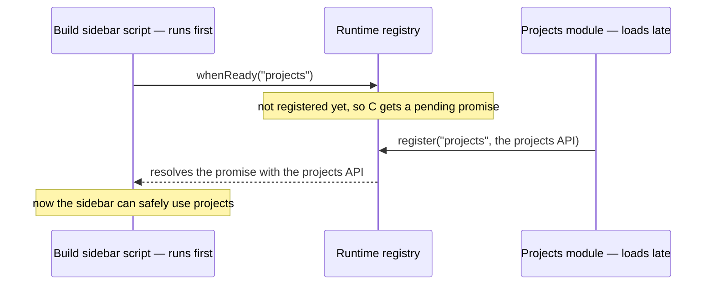

# Runtime registry and the shared building blocks

**Role:** contract
**Domain:** web
**Companions:** every web module registers with the runtime registry and is
found through it — [`molview.md`](?doc=web/molview.md),
[`projects.md`](?doc=web/projects.md), [`workspace.md`](?doc=web/workspace.md),
[`presenters.md`](?doc=web/presenters.md). `form-schema.md` — the engine-config
form builder (its own doc). [`roadmap.md`](?doc=roadmap.md) § 3 — the pending
ES-module conversion of the registry and these primitives.

This doc covers the **runtime registry** — the small piece that lets the web
modules find each other reliably — and a **catalogue of the shared building
blocks** every tab reuses (toasts, the discard modal, the markdown renderer,
and so on).

## 1. The problem the registry solves

A molbuilder page loads a mix of two kinds of script. Classic `<script>` tags
run in order, *during* the page parse. A `<script type="module">` waits until
*after* all the classic scripts and the parse are done. So a classic Build-tab
script that runs early and reaches for `window.molbuilder.projects` can get
**`undefined`** — because the projects module (loaded as a module) hasn't run
yet. You could poll until it appears, but that just papers over the race.

The **runtime registry** fixes the structure instead: **modules announce
themselves, and consumers ask for them** — and the answer arrives whenever the
module is ready, no matter the load order.

## 2. Ask, don't grab

- A module that is ready **announces itself**:
  `window.molbuilder.runtime.register("projects", projectsApi)`.
- Anything that needs it **asks**, and gets a promise:
  `window.molbuilder.runtime.whenReady("projects").then(api => …)`.

The promise resolves whether you asked *before* or *after* the module
registered — which is the whole point. No polling, no guessing script order.



### The five calls

| Call | What it does |
|---|---|
| `register(name, api)` | Announce a ready module. Throws if the name is empty or the api is null; a second `register` of the same name **warns and replaces** (it doesn't crash the page). It then resolves every waiter for that name. |
| `whenReady(name)` → promise | Ask for a module; resolves now if it's already registered, or later when it registers. On a bad name it **rejects** (returns a rejected promise) rather than throwing, so a caller always gets a promise. |
| `get(name)` | A synchronous peek — the api or `undefined`. For devtools and tests, not the load-order-safe path. |
| `listRegistered()` | The names registered so far (a sorted snapshot). |
| `listPending()` | Names something is *waiting* on but nothing has registered — the quick way to diagnose "a consumer hung forever". |

One consumer throwing in its `.then` doesn't affect the others (each runs in its
own microtask); still, attach your own `.catch()`.

### The rules that bite

- **`register` last** in your module — publish only a *finished* api, never a
  half-built one.
- **Consume with `whenReady`**, not `get` or polling.
- **One name, one owner.**
- The registry file (`lib/molbuilder-runtime.js`) must load **before any other
  molbuilder script** — every page template loads it first, in the page head.

### In practice

```js
// PRODUCER — lib/projects/projects-sidebar.js (registers last, once the api is built)
window.molbuilder.runtime.register("projects", projects);

// CONSUMER — the Build tab, which may run before the projects module registered
window.molbuilder.runtime.whenReady("projects").then((proj) => {
  // safe: proj is the fully-built projects API, whatever the load order
});

// DEVTOOLS
molbuilder.runtime.listRegistered();  // e.g. ["molview","projects","viewer", …]
molbuilder.runtime.listPending();     // names still hung, if any
```

*(The registry doesn't pin a fixed list of module names — ask `listRegistered()`
for the live set. `"projects"` is by far the most-awaited.)*

## 3. The shared building blocks

These small helpers live in `lib/*.js` and are reused across tabs. Each publishes
a `window.molbuilder.*` global (a couple also register with the runtime).

| Building block | Reach it as | What it is |
|---|---|---|
| Notification bar | `molbuilder.notify` | The app-wide message framework — a stack of dismissible messages (dedup by id, × / Esc / Clear-all), any tab. It's a **first-class module with its own doc**: [`notifications.md`](?doc=web/notifications.md). |
| Discard-unsaved modal | `molbuilder.warningModal` | The "you have unsaved changes — discard them?" confirm dialog; `confirmDiscardUnsaved()` returns a yes/no promise. |
| Detection chip | `molbuilder.detectionChip` | The one-line chemistry-summary chip shown on workflow cards. |
| Markdown renderer | `molbuilder.markdownRender` | The **one** place markdown becomes safe HTML (sanitized, with lazy diagram support). The Documents tab and the Results markdown viewer both go through it. |
| Path helpers | `molbuilder.path` | Small POSIX path-string helpers (basename, relative-from-dir) — no filesystem. |
| Shared constants | `molbuilder.constants` | The single source of truth for the `sessionStorage` keys and custom-event names the modules agree on. |
| System-load strip | *(self-mounting)* | The 1 Hz strip of CPU/RAM/GPU sparklines from the server; pauses when the tab is hidden. It is included on the **Results tab only** (`results.html`), not on every page. |

Three more loose helpers are named here because they share this folder, but
their substance lives with their real subject:

- **`form-schema.js`** — the schema-driven engine-config form builder (fetch a
  form's shape from the server, render it, collect the values, restore them).
  It's a whole subsystem, not a small block — see **`form-schema.md`**.
- **`region-label-definitions.js`** (+ its popover) — the transport
  region-label vocabulary (L/R-electrode, bridge, interface, with citations).
  Its substance belongs with the transport region-labels doc.
- **`xyz-io.js`** — a small XYZ parse/format helper (data, not UI). It's the one
  building block here that is *already* an ES module (see below); its details
  belong with [`model/structure.md`](?doc=model/structure.md).

## 4. Current → target: ES modules

Almost everything on this page — the runtime registry and the building blocks —
is still a **classic `window.molbuilder.*` script** today. The one exception is
`xyz-io.js`, which is already an ES module (with a classic access door kept for
its not-yet-converted callers).

Converting the registry and these primitives to ES modules is a planned pass
([`roadmap.md § 3`](?doc=roadmap.md)) — grouped **by kind**, not lumped into one
"runtime" bag (a `path.basename` caller shouldn't drag in a notification bar):

- **`notify`** → its own ESM framework + auto-dismiss — **task #105**
  ([`notifications.md`](?doc=web/notifications.md)).
- **`markdownRender`** → ESM — **task #106**.
- the **CodeMirror code-viewer/editor** (today set up twice — in the sidebar
  preview and the markdown presenter) → one concealed ESM module + de-dup —
  **task #107**.
- the **registry itself**, the `results` module, and the pure helpers
  (`path`/`constants`) → **task #103** (the pure helpers stay small standalone
  ESM, not folded into the registry; and the registry's load-order role shrinks
  once everything is a module).

As each one is converted, its "current → target" note here is dropped.
