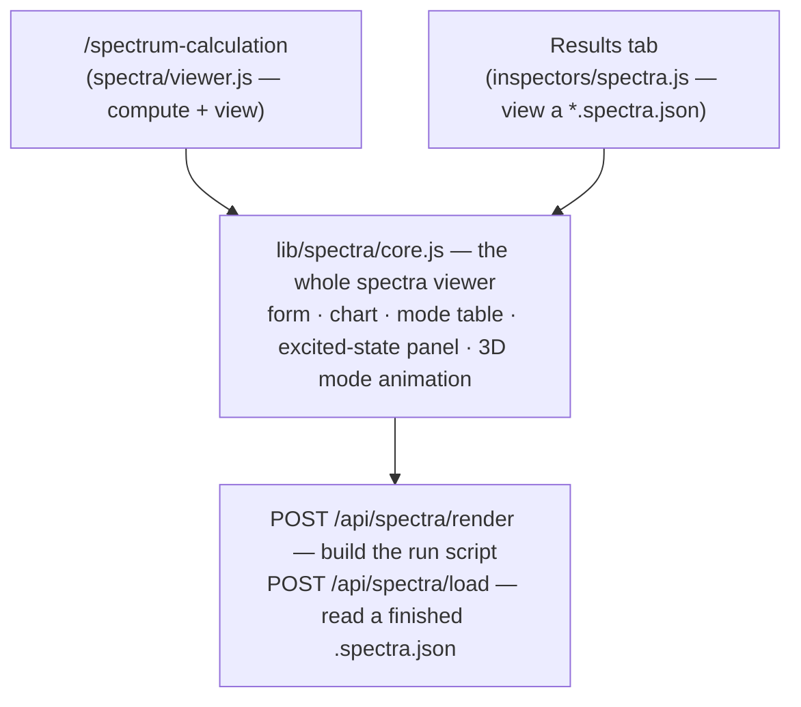

# Spectra — computing and reading a vibrational spectrum

**Role:** contract
**Domain:** web
**Companions:** [`results.md`](?doc=web/results.md) — the Results-tab shell that
hosts the spectra *presenter*; [`presenters.md`](?doc=web/presenters.md) — the
registry that picks it for a `.spectra.json`; [`molview.md`](?doc=web/molview.md)
— the read-only 3D viewer the standalone tab uses to inspect the input structure;
[`web-api.md`](?doc=web/web-api.md) — the `/api/spectra/*` routes;
[`execution/running-a-job.md`](?doc=execution/running-a-job.md) — the run that
produces the `.spectra.json`.

The spectra surface computes a **Raman vibrational spectrum** for a molecule and
then shows it as an interactive chart: a stick spectrum of frequencies, a
sortable table of the vibrational modes, and — when you click a peak — a **3D
animation of that normal mode**. You reach it two ways, but it is the same code
both times.

## 1. Two surfaces, one engine

Everything below is drawn by a single module, `lib/spectra/core.js`. It is
mounted by two different pages, each a thin wrapper:

- **The standalone Spectra tab** (`/spectrum-calculation`) — the full
  *compute-then-view* workflow: inspect a structure, set parameters, generate a
  runnable script, and watch the spectrum appear as the calculation runs. Its
  controller is `spectra/viewer.js`.
- **The Results-tab presenter** — the *view-only* half. When you open a
  `*.spectra.json` result on the Results tab, the presenter
  (`lib/inspectors/spectra.js`, registered as **"Spectra results"**) mounts the
  same engine to display it. It never shows the generate-side form.

Because both wrappers call into one engine, a fix to the chart or the mode table
lands on both pages at once.

## 2. The spectrum chart

The chart plots **frequency (cm⁻¹) on the x-axis against Raman activity
(Å⁴/amu) on the y-axis**, one vertical stick per vibrational mode. A slider
broadens each stick into a smooth **Lorentzian** peak (a single FWHM control,
default 20 cm⁻¹) so overlapping modes read as one band — the broadened envelope
is drawn over the sticks.

Two special cases are worth knowing:

- **Imaginary modes** (a negative frequency — a sign the geometry is a saddle
  point, not a true minimum) are drawn in **red at their negative frequency**, so
  a bad optimization is visible at a glance.
- **"Density" mode.** Early in a run — or if the calculation was set up without
  Raman intensities — no mode has an activity value yet. Rather than a blank
  chart, the viewer draws every mode as a **unit-height stick** so you can still
  see *where* the frequencies are while the intensities are still being computed.

## 3. The mode table and the excited-state panel

Below the chart is a **table of every vibrational mode** — its number,
frequency, Raman activity, whether it's imaginary, and whether it carries
excited-state data — that you can **sort and filter**, export to CSV, and click a
row to select a mode. When the run also computed **excited states**, four more
columns appear (HOMO, LUMO, gap, and the gap's shift), and a small bar panel
draws the molecular-orbital levels. Those columns are always present in the
header; their cells simply fill in once there's excited-state data.

## 4. Clicking a mode — the 3D animation

Click a stick in the chart or a row in the table and that **normal mode animates
in 3D**: the atoms oscillate along the mode's displacement vectors so you can see
which bonds stretch or bend. This 3D box is **not** MolView — it's the concealed
**VibrationView** module ([`vibrationview.md`](?doc=web/vibrationview.md)), a
self-contained viewer built for exactly this one job (it owns the oscillation loop
and greys out frozen atoms). Two sliders, **amplitude** and **speed**, update the
running animation live.

> Two different 3D viewers live on the Spectra tab and it's easy to conflate
> them: the **inspect card at the top** is a read-only *MolView* showing the
> static input structure (§5); the **mode box** is *VibrationView* showing an
> animated eigenvector. Different modules, different jobs.

## 5. The standalone tab — from a structure to a script

On `/spectrum-calculation` the page is a short vertical workflow:

1. **Inspect the structure.** The top card mounts a **read-only MolView**
   ([`molview.md`](?doc=web/molview.md)). Pick a `.xyz`/`.pdb` in the Projects
   sidebar and load it; the card shows the 3D structure plus its atom count and
   formula, read straight off the loaded model.
2. **Auto-detect the chemistry.** The page asks the server
   (`POST /api/structure/analyze`) for a sensible charge, spin, and method for
   this molecule and fills them into the form, with a one-line rationale. You can
   override anything.
3. **Set the parameters.** The rest of the form is **built from a schema** the
   server hands back (`GET /api/build/schema/spectra`) — so the form always
   matches the calculation's real options without being hand-maintained here.
4. **Generate.** Clicking generate posts to `POST /api/spectra/render`, which
   reads the structure *off the loaded model* and returns a **runnable script**
   plus a human-readable "Methods" summary and its citations. **Render does not
   run anything** — it writes the script. **Save** then writes a
   `<job>.spectra.py` into your project and installs a run wrapper so you can
   launch it like any other job.

When the job runs it writes a `.spectra.json`; loading that (here, or on the
Results tab) is what fills the chart.

## 6. The two API doors

The engine talks to exactly two spectra routes (full shapes in
[`web-api.md`](?doc=web/web-api.md)):

| Route | Does | Returns |
|---|---|---|
| `POST /api/spectra/render` | turns *structure + parameters* into a run script (does **not** execute it) | `{ok, script, methods_md, bibliography_keys, job_name, issues}` |
| `POST /api/spectra/load` | parses an existing `.spectra.json` into display data | `{ok, results}` — or a **typed** error carrying a `kind` string (missing → 404, wrong schema version → 422, malformed or bad-field → 400) so the UI can react without reading the message |

Both follow the app's `{ok: …}` envelope convention. A third route,
`GET /api/build/schema/spectra`, returns the form schema (and can **pre-fill the
frozen-atom list** — see §8).

## 7. Live updating, and what a refresh does

If you load a spectrum whose calculation is still running, the viewer **polls
`/api/spectra/load` every 2 seconds** and redraws as new modes arrive. (That's a
faster cadence than the trajectory viewer's 15 seconds — a spectrum job produces
its phases in quicker bursts.) It considers the run done once the result reports
all its phases complete.

Like every Results-tab viewer, the spectra viewer is a small **state machine**
(idle → loading → loaded / watching → error), and **Refresh is a clean reload**
of the same file — the same reset a file-switch does. The full "which state
resets what" rules live in [`results.md § 4`](?doc=web/results.md). One caveat
specific here: your view **preferences** (the broadening width, the animation
amplitude and speed, the table's sort and filter) survive a file-switch but are
held **in memory for the life of the mount only** — a page reload starts them
back at their defaults. (Persisting them to session storage is wired as a
follow-up, not shipped.)

## 8. Frozen atoms come from the structure's sidecar

If the structure you loaded carries a `.molstruct.json` sidecar with a
frozen-atom set (say, atoms you fixed in a previous relaxation), the schema route
reads it and **pre-fills the "frozen indices" field** so those atoms are held
fixed in the spectrum calculation too. This only sets the *default* — the form
stays authoritative, so you can still edit the list. If the sidecar can't be read
the field is simply left blank and a short notice explains why; it never fails
the page.

## 9. Where the module stands — ESM status

The design goal for every front-end module is a **concealed, independently
reusable ES module**. Spectra is **partway there**:

| File | Role | ESM today |
|---|---|---|
| `static/spectra/viewer.js` | the standalone-tab controller | **yes** — a real ES module (it imports MolView) |
| `lib/spectra/core.js` | the shared engine (chart, table, animation, API) | **no** — still a classic global-registered script (`window.molbuilder.spectraInspector`) |
| `lib/inspectors/spectra.js` | the Results-tab presenter | **no** — classic; registers via `molbuilder.inspectors.register` |

So the engine and its Results-tab presenter still load as plain scripts and
publish themselves on `window.molbuilder`, relying on the runtime registry to
sequence them. Converting both to ES modules is a tracked follow-up: they convert
together with the **`inspectors` → `presenters` rename** — one pass (task #102)
that does the file-viewer registry *and* the heavy engine cores it mounts (this
`lib/spectra/core.js` among them), since converting them rewrites those files
anyway. See [`presenters.md`](?doc=web/presenters.md) and
[`roadmap.md § 3`](?doc=roadmap.md).

## 10. Test map

Engine + backend (`tests/spectra/`): `test_blueprint.py` (the three routes +
dispose contract), `test_config.py` (the schema shape), `test_engine.py` (the
PySCF engine), `test_methods.py` (the Methods prose + citations),
`test_parsers_json.py` (the `.spectra.json` round-trip), `test_script.py` (the
emitted script), `test_selection.py` (which modes get computed),
`test_atom_index_contract.py` (the free-atom invariant).

Viewer + integration: `test_results_state_contract_spectra_js.py` (the state
buckets), `test_spectra_phase_indicator_js.py` (the phase indicator),
`test_spectrum_generate_e2e.py` (the end-to-end render flow),
`test_vibrationview_mode_math_js.py` (the animation's eigenvector math).
