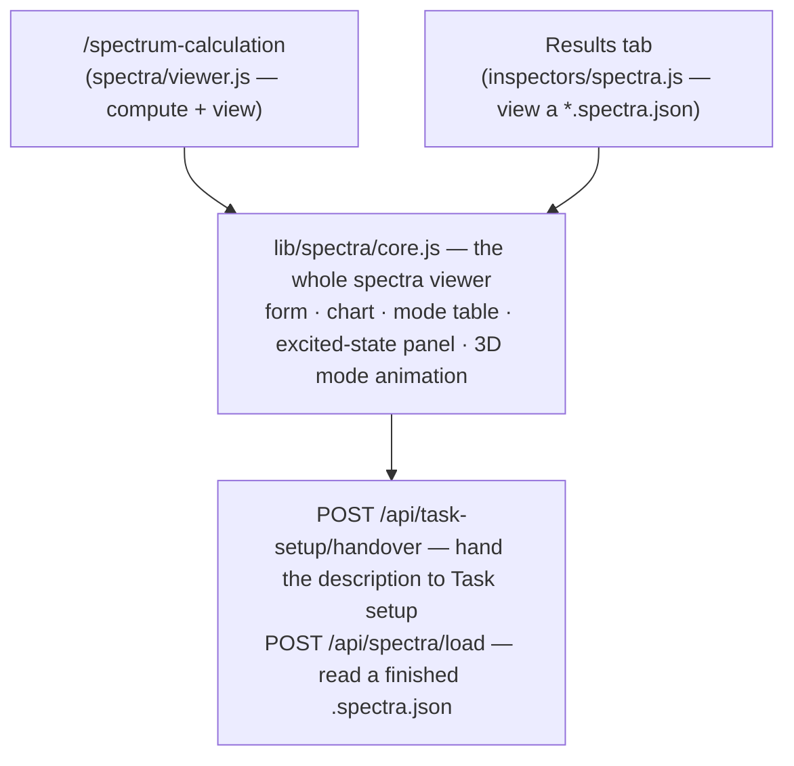

# Spectra — computing and reading a vibrational spectrum

**Role:** contract
**Domain:** web
**Companions:** [`results.md`](?doc=web/results.md) — the Results-tab shell that
hosts the spectra *presenter*; [`presenters.md`](?doc=web/presenters.md) — the
registry that picks it for a `.spectra.json`; [`molview.md`](?doc=web/molview.md)
— the read-only 3D viewer the standalone tab uses to inspect the input structure;
[`web-api.md`](?doc=web/web-api.md) — the `/api/spectra/*` routes;
[`execution/running-a-job.md`](?doc=execution/running-a-job.md) — the run that
produces the `.spectra.json`.

> **Migration status (2026-08-21).** The compute side of this surface is
> **framework-native**: the Send button hands over to Task setup, and the
> vibration deck is a calculation KIND of the PySCF engine, rendered by
> `render_deck` through the same gates as an optimization deck and run
> through `prep`/`launch`. (The old standalone-script path retired at the
> spectra migration's P3.) The *viewing* half — the presenter, the chart,
> the mode table — is unchanged.

The spectra surface computes a **Raman vibrational spectrum** for a molecule and
then shows it as an interactive chart: a stick spectrum of frequencies, a
sortable table of the vibrational modes, and — when you click a peak — a **3D
animation of that normal mode**. You reach it two ways, but it is the same code
both times.

## 1. Two surfaces, one engine

Everything below is drawn by a single module, `lib/spectra/core.js`. It is
mounted by two different pages, each a thin wrapper:

- **The standalone Spectrum tab** (`/spectrum-calculation`) — the full
  *describe-then-view* workflow: inspect a structure, set parameters, Send
  the description to Task setup (this tab renders no deck — § 5), and load
  the spectrum as the prepped calculation runs. Its
  controller is `spectra/viewer.js`.
- **The Results-tab presenter** — the *view-only* half. When you open a
  `*.spectra.json` result on the Results tab, the presenter
  (`lib/inspectors/spectra.js`, registered as **"Spectra results"**) mounts the
  same engine to display it. It never shows the generate-side form.

Because both wrappers call into one engine, a fix to the chart or the mode table
lands on both pages at once.



## 2. The spectrum chart

> **Where this is going.** The chart is drawn today by ~345 lines inside
> `lib/spectra/core.js`, the tab controller. Its design as a sealed module —
> one importable `mount`, one file naming Plotly, a click that leaves as an
> event and returns as an instruction — is written in
> [`spectrumchart.md`](?doc=web/spectrumchart.md). Nothing is built yet: the
> contract was written first so the door could be reviewed before the code
> moves. What this section describes is what the tab does now.


The chart plots **frequency (cm⁻¹) on the x-axis against Raman activity
(Å⁴/amu) on the y-axis**, one vertical stick per vibrational mode. A slider
broadens each stick into a smooth **Lorentzian** peak (a single FWHM control,
default 20 cm⁻¹) so overlapping modes read as one band — the broadened envelope
is drawn over the sticks.

**Picking a mode does not mean hitting the line.** Each mode carries an invisible
band, as wide as the broadening you set (with a floor of 8 cm⁻¹ so bare sticks
stay reachable), and a click anywhere inside it selects that mode. Each band is
clamped to half the distance to its nearer neighbour, so no two overlap and the
band you are in is always the *nearest* mode — crowded regions get tighter
targets, which is where being off by one mode matters. Two modes at the same
frequency (BDT's 31 and 32 are 0.011 cm⁻¹ apart) cannot be separated this way;
that is what the table is for.

Two special cases are worth knowing:

- **Imaginary modes** (a negative frequency — a sign the geometry is a saddle
  point, not a true minimum) are drawn in **red at their negative frequency**, so
  a bad optimization is visible at a glance.
- **"Density" mode.** Early in a run — or if the calculation was set up without
  Raman intensities — no mode has an activity value yet. Rather than a blank
  chart, the viewer draws every mode as a **unit-height stick** so you can still
  see *where* the frequencies are while the intensities are still being computed.

## 3. The three views of one mode

Under the chart sit **three tabs — Modes table, Mode visualisation, Electronic
structure —** all describing the *same* selected mode. They were three bands
stacked down the page, so comparing what a mode looks like against what its
levels do meant scrolling between two places and holding one in memory.

**Selecting a mode never switches tab.** All three update underneath and you stay
where you were looking. Becoming visible is an event rather than a style change:
a 3D canvas and a chart both take their size from a box, and a box in a hidden
tab has none — so opening a tab re-fits the viewer and re-sizes the chart.

The **Modes table** is a table of every vibrational mode — its number,
frequency, Raman activity, whether it's imaginary, and whether it carries
excited-state data — that you can **sort and filter**, export to CSV, and click a
row to select a mode. When the run also computed **excited states**, four more
columns appear (HOMO, LUMO, gap, and the gap's shift). Those columns are always
present in the header; their cells simply fill in once there's excited-state
data.

### 3.1 The level diagram — and why it has to zoom

Under the table, a selected mode with excited-state data draws a **molecular
orbital correlation diagram**: the same levels at three geometries — pushed to
−A, at equilibrium, and pushed to +A — with **every orbital joined across the
three**, so the eye follows one level rather than comparing three separate stacks
of dashes.

```
        E ▲     ─────  ╲___  ─────      each dash is one orbital, in one geometry
          │                              the joins are the same orbital, moving
          │     ═════ ═════ ═════   ← LUMO
          │
          │     ═════ ═════ ═════   ← HOMO
          │     ─────  ___╱  ─────
          └──────  −A    eq    +A
```

**Zoom is not a convenience here, it is the point.** The shifts this panel exists
to show are *small*: in the BDT result, mode 1's HOMO moves **0.018 meV** between
−A and +A, against an 11.4 eV span of drawn levels. That is 1/4000 of a pixel —
literally invisible at full scale. So the figure opens on the whole picture and
then **scroll to zoom the energy axis, drag to pan, double-click to fit**. The
energy axis is free; the horizontal axis is locked, because it is three
geometries rather than a quantity and there is nothing between them.

It is drawn by **Plotly**, the same library as the spectrum above it, and that
choice replaced hand-rolled SVG on 2026-08-05. The SVG was right while the figure
was static; once it needed zoom, pan, a reset and a hover readout, writing those
four by hand beside a chart library already loaded on the page would have been
inventing a wheel in view of the wheel. Plotly takes colours as values rather
than inheriting CSS, so `chartTheme()` in `lib/spectra/core.js` reads the tokens
off the document and hands them over — the tokens stay the one source of truth
for both charts.

Beside the diagram sits a **panel of numbers**, grouped by the question
each answers: where the levels sit, how the gap moves, and the electron–phonon
coupling ΔE/(2A). The displacement A itself is in the panel header, since it is
the input every number below depends on rather than a result among them.

**A fourth, run-level tab: Thermochemistry** *(v5 artifacts)*. Beside the
three per-mode views sits a tab that appears when the results carry a
`thermo` block ([`archive/2026-08-20-spectra-migration-plan.md`](?doc=archive/2026-08-20-spectra-migration-plan.md)
§ 2b): the headline (T, P) numbers with the regime sentence, G/H/T·S curves
over the deck's temperature grid, and the free-energy decomposition bar at the
headline temperature. The **deck computes, the viewer draws** — the only
derived number in JS is the electronic reference, recovered exactly from the
grid's own construction (`h = E_elec + zpe + u_vib + k_B·T`). The phase
indicator gained a **Relaxation** dot the same way (data-driven off
`phase_relaxation`); a v4 file simply shows it empty and hides the thermo tab.

## 4. Clicking a mode — the 3D animation

Click a stick in the chart or a row in the table, open the **Mode visualisation**
tab, and that **normal mode animates in 3D**: the atoms oscillate along the mode's displacement vectors so you can see
which bonds stretch or bend. This 3D box is **not** MolView — it's the concealed
**VibrationView** module ([`vibrationview.md`](?doc=web/vibrationview.md)), a
self-contained viewer built for exactly this one job (it owns the oscillation loop
and greys out frozen atoms).

> Two different 3D viewers live on the Spectra tab and it's easy to conflate
> them: the **inspect card at the top** is a read-only *MolView* showing the
> static input structure (§5); the **mode box** is *VibrationView* showing an
> animated eigenvector. Different modules, different jobs.

### 4.1 How big to draw the motion — and why the choice is not cosmetic

The eigenvector fixes the **shape** of the motion: which atoms move, in which
direction, and how far *relative to each other*. It does not fix the **size**.
An eigenvector's overall scale is arbitrary until something sets it, so the
animation is always a shape multiplied by a number — and where that number comes
from is the whole of this control.

```
   what the diagonalisation gives        what you choose
   ─────────────────────────────         ───────────────
   direction, and relative size     ×    absolute size    =   the animation
```

**Three answers, and only two of them are physics.**

#### exaggerated — a drawing convention

The eigenvector is rescaled so the largest per-atom vector has length 1
(`eigenvector_display`, dimensionless), and the slider states how many ångström
that largest swing is. The default **0.15 Å** is roughly a tenth of a bond
length: visible without looking dislocated.

This is a **visualisation choice and not a result.** Jmol, Avogadro and GaussView
all exaggerate mode animations, for the reason given below — genuine amplitudes
are too small to read on screen. It is the default here because the first
question a user asks of a mode is "which atoms move", and that is a question
about shape.

#### physical, zero-point — the molecule at absolute zero

A quantum harmonic oscillator cannot be at rest. Localising a particle in a
potential well costs kinetic energy, so the lowest state of every mode sits
½ħω above the minimum, and the nuclei retain a spread even at T = 0. That spread
is the **zero-point amplitude**:

```
    ⟨Q²⟩ = ħ / 2ω           Q_rms = √( ħ / 2ω )
```

where **Q** is the mass-weighted normal coordinate. In the units a spectroscopist
works in — a wavenumber ν̃ in cm⁻¹, since ω = 2πcν̃ — this evaluates to

```
    Q_rms = 4.106 / √( ν̃ [cm⁻¹] )        in √amu · Å
```

and the Cartesian displacement of atom *i* is `Q_rms × L_i`, with **L** the
mass-weighted eigenvector normalised so `Σᵢ mᵢ|Lᵢ|² = 1` (`eigenvector_canonical`).
The mass carried in that normalisation is what makes the amplitude **atom-specific**:
a heavier nucleus in the same mode moves as 1/√m.

Two consequences, both visible in the animation:

| ν̃ | H (1 amu) | C (12) | Au (197) |
|---|---|---|---|
| 100 cm⁻¹ — a torsion | 0.41 Å | 0.12 Å | 0.029 Å |
| 1000 cm⁻¹ — a ring breath | 0.13 Å | 0.037 Å | 0.0093 Å |
| 3000 cm⁻¹ — a C–H stretch | 0.075 Å | 0.022 Å | 0.0053 Å |

*(the swing of an atom carrying the entire mode; a real mode distributes it, so
per-atom values are smaller)*

**Stiffer bonds move less** — amplitude falls as 1/√ν̃, so a C–H stretch is half a
torsion. **Heavier atoms move less** — as 1/√m, so gold barely moves in a mode a
hydrogen dominates. Both are why an honest animation of a stretching mode looks
almost still, and why the exaggerated default exists.

#### physical, thermal — the same thing at a temperature

Above absolute zero the excited vibrational states are populated too, and the
thermal average over them raises the mean-square displacement by a factor:

```
    ⟨Q²⟩_T = ( ħ / 2ω ) · coth( ħω / 2k_BT )
```

The amplitude therefore grows by **√coth(x)**, `x = ħω / 2k_BT`. As T → 0,
coth → 1 and this becomes the zero-point expression exactly — the two are one
formula, not two, which is the check that the limit is right.

**The useful question is which modes it changes.** One wavenumber is worth
**1.44 K**, so room temperature is only `k_BT ≈ 207 cm⁻¹`. A mode much stiffer
than that has ħω ≫ k_BT, sits in its ground state whatever the temperature, and
is said to be **frozen out**. At 298 K, as a multiple of the zero-point swing:

| ν̃ (cm⁻¹) | 50 | 100 | 300 | 1000 | 3000 |
|---|---|---|---|---|---|
| ×  zero-point | 2.9 | 2.1 | 1.27 | 1.01 | 1.00 |
| at 500 K | 3.7 | 2.7 | 1.57 | 1.06 | 1.00 |

So temperature is worth setting for **soft modes** — torsions, librations,
metal–ligand bends, lattice modes — and is invisible on a C–H stretch. This is
the same physics that makes the vibrational heat capacity of a stiff mode
approach zero: a mode that cannot be thermally excited neither stores energy nor
moves further.

#### Why the two normalisations must never be crossed

The two physical answers use `eigenvector_canonical`; the exaggerated one uses
`eigenvector_display`. **They are not in the same units**, and the amplitude that
pairs with each differs accordingly:

| | eigenvector | its amplitude is in |
|---|---|---|
| exaggerated | dimensionless (max = 1) | **Å** |
| physical | 1/√mass (`Σ mᵢ\|Lᵢ\|² = 1`) | **√amu·Å** |

Each pairing multiplies out to ångström of motion — but only within itself.
Feeding a display eigenvector into a physical amplitude, or the reverse, produces
a picture that is wrong **without looking wrong**, which is precisely why the
backend ships two fields: schema v1 carried one `eigenvector_free` used for both
animation and Raman projection, and that was recorded as a correctness bug when
the two uses were separated (see the SCHEMA_VERSION history in
`molbuilder/spectra/results.py`).

For the same reason an **export records which pairing produced it**
([`vibrationview.md`](?doc=web/vibrationview.md) § 12.2): the amplitude alone
does not say what it means, so it travels beside its normalisation and neither is
written without the other.

#### Where each piece is computed

The physics is the **tab's**, not the viewer's. VibrationView holds no frequency,
no temperature and no physical constant — it receives a displacement array and a
number and multiplies them ([`vibrationview.md`](?doc=web/vibrationview.md)
§ 12.2). `lib/spectra/core.js` turns a mode's wavenumber into the amplitude above
and chooses the eigenvector that pairs with it.

### 4.2 The sentence under the viewer — which atoms the mode belongs to

Under the 3D box is one line describing what you are watching:

```
the motion is 91% C, 9% H · nothing moves further than 0.173 Å from rest,
16% of that atom's bond · drawn exaggerated
   └── whose mode ──┘        └──── how big, against a yardstick ────┘   └ real? ┘
```

Each part answers a question a bare number leaves open.

**"the motion is 91% C, 9% H" — whose mode is it.** Each element's share of the
mode, computed as its part of the mass-weighted motion:

```
        share of atom i  =   mᵢ|Lᵢ|²  ⁄  Σₖ mₖ|Lₖ|²
```

This is the **kinetic-energy distribution**, the standard way a mode is assigned
to the atoms that carry it. For a harmonic mode the ratio is the same at every
phase of the oscillation, so it is a property of the mode and not of the instant
you look at it. Either stored eigenvector gives the same answer: the two forms
differ by one scalar per mode, and a scalar cancels in a ratio.

> **Why mass-weight it at all — the trap this replaced.** The line used to name
> the atom with the largest displacement. In the benzene-dithiol result that is a
> hydrogen in **32 of 36 modes**, including the 1648 cm⁻¹ ring stretch, where the
> hydrogens move 18% further than the carbons (|L| = 1.15 against 0.98) and carry
> **9%** of the motion. A light atom travels further for the same energy, and
> hydrogen is the lightest thing in most molecules — so "which atom moves
> furthest" answers *hydrogen* almost regardless of the mode, which is a true
> sentence that tells you nothing. Weighting by mass asks the question worth
> asking, and the answers agree with textbook assignments: 92% H for the C–H
> stretches at 3175 cm⁻¹, 91% C for the ring stretch, 49% S for the 205 cm⁻¹ mode.

**"nothing moves further than 0.173 Å from rest" — a ceiling, not a subject.**
Every atom in the picture stays inside it. It is measured to *one extreme* of the
swing, so an atom covers twice this between extremes. The atom concerned is
deliberately **not named**, for the reason above.

**"16% of that atom's bond" — the yardstick.** 0.173 Å is a number; "a sixth of a
bond" is a picture. The comparison is against that atom's own nearest-neighbour
distance, since a C–H bond is short and an Au–Au contact is long. Beyond 3.0 Å
the line says *nearest contact* rather than *bond*, because calling it a bond
would be a claim rather than a label.

**"drawn exaggerated" — is it real.** § 4.1: exaggerated is a drawing convention;
the two physical settings are measurements. This is the one thing a reader must
not get wrong about a number quoted from this panel.

#### Where the composition is computed, and why there

**The server**, in `/api/spectra/load` — not the browser, and not the file.

The share needs atomic masses. The `.spectra.json` stores none, and the browser
has none. The **table already exists**: ASE ships the IUPAC standard atomic
weights, and `chemistry.py` already reaches into `ase.data` for atomic numbers,
so `chemistry.atomic_mass` is a *name for that table* rather than a second copy
of it. Typing 118 masses into this program — in Python or, worse, into
JavaScript — would have been a second source of truth that no test would notice
going stale.

It is computed **when a result is opened, not when it is written**:

| | what it costs | what it means for the results already on disk |
|---|---|---|
| computed at load *(chosen)* | one pass over each eigenvector | every existing result gains the line the moment it is opened |
| written into the file | a schema bump | nothing shows until each result is re-run |

`SpectraResults.to_dict()` is the **on-disk format** and round-trips through
`from_dict`; the share is derived, so it is added to the reply and never to the
file. A result whose shares cannot be worked out — an element ASE does not know,
or no stored geometry — is served without the field, and the panel simply drops
that clause.

The maths lives in `spectra/results.py :: motion_share_by_element`; the sentence
is assembled in `lib/spectra/core.js :: _reportSwing`.

## 5. The standalone tab — from a structure to a script

On `/spectrum-calculation` the page is a short vertical workflow:

1. **Inspect the structure.** The top card mounts a **read-only MolView**
   ([`molview.md`](?doc=web/molview.md)). Pick a `.xyz`/`.pdb` in the Projects
   sidebar and load it; the card shows the 3D structure plus its atom count and
   formula, read straight off the loaded model.
2. **Auto-detect the chemistry.** The page asks the server
   (`POST /api/structure/analyze`) for a sensible charge, spin, and method for
   this molecule and fills them into the form, with a one-line rationale. You can
   override anything.
3. **Set the parameters.** The rest of the form is **built from the
   CATALOGUE**, narrowed to the vibration kind
   (`GET /api/build/schema/pyscf?calculation=vibration`) — the same door and
   the same renderer as the Build tab, so a parameter is defined once and
   rendered the same everywhere
   ([`engines/template.md`](?doc=engines/template.md) § 6.3).
4. **Send to Task setup.** The Send button runs the general hand-over
   ([`handover-procedure.md`](?doc=web/handover-procedure.md), via
   `lib/task-handover.js` — the same door `/structure-optimization` uses):
   the server renders the parameter template, the structure pair and
   `task.1st.json` (carrying `calculation: "vibration"`), the browser writes
   them into the selected folder, and Task setup finishes shape and stages.
   **This tab renders no deck** — the deck is written by `prep`, on the
   machine that runs it
   ([`execution/script-preparation.md`](?doc=execution/script-preparation.md)).

When the job runs it writes a `.spectra.json`; loading that (here, or on the
Results tab) is what fills the chart.

## 6. The API door

One spectra route remains — the ARTIFACT reader (full shape in
[`web-api.md`](?doc=web/web-api.md)); the compute half goes through the
catalogue schema + hand-over doors (§ 5):

| Route | Does | Returns |
|---|---|---|
| `POST /api/spectra/load` | parses an existing `.spectra.json` into display data | `{ok, results}` — or a **typed** error carrying a `kind` string (missing → 404, wrong schema version → 422, malformed or bad-field → 400) so the UI can react without reading the message |

Both follow the app's `{ok: …}` envelope convention. The form schema comes
from the catalogue door (`GET /api/build/schema/pyscf?calculation=vibration`);
(the old `GET /api/build/schema/spectra` route retired at P3; frozen atoms
travel with the structure now — § 8).

## 7. Live updating, and what a refresh does

If you load a spectrum whose calculation is still running, the viewer **polls
`/api/spectra/load` every 2 seconds** and redraws as new modes arrive. (That's a
faster cadence than the trajectory viewer's 15 seconds — a spectrum job produces
its phases in quicker bursts.) It considers the run done once the result reports
all its phases complete.

Like every Results-tab viewer, the spectra viewer is a small **state machine**
(idle → loading → loaded / watching → error), and **Refresh is a clean reload**
of the same file — the same reset a file-switch does. The full "which state
resets what" rules live in [`results.md § 4`](?doc=web/results.md). One caveat
specific here: your view **preferences** (the broadening width, the animation
amplitude and speed, the table's sort and filter) survive a file-switch but are
held **in memory for the life of the mount only** — a page reload starts them
back at their defaults. (Persisting them to session storage is wired as a
follow-up, not shipped.)

## 8. Frozen atoms travel with the structure

Frozen atoms are **structure-side facts**: they live in the model as a region
and ride the structure's own files — the `.molstruct.json` half of the codec
pair the hand-over writes — never a form field
([`archive/2026-08-20-spectra-migration-plan.md`](?doc=archive/2026-08-20-spectra-migration-plan.md)
§ 2). Set them in the viewer, or load a structure whose sidecar already
carries them; the Send button exports the model **in one read**
(`exportFile()`), so what you see frozen is what the calculation holds fixed.

**Frozen means frozen through every phase** (user ruling 2026-08-21). The
pre-Hessian relaxation holds the same set fixed — the deck writes geomeTRIC's
`$freeze` constraints file, the same mechanism the optimization deck uses —
and the Hessian is built over the free atoms only. Which atoms to freeze is
the user's own call: the tab never second-guesses the set, and nothing warns
you off a choice you made on purpose. What the calculation DOES say, out
loud, is what the freeze means for the numbers: the deck states the regime
(partial Hessian, *vibrational-only* thermochemistry — an anchored molecule
does not rotate), the preflight names the frozen count, and the Methods
paragraph spells out that the reported frequencies are those of the free
atoms moving in the field of the fixed ones.

**And the two lists must PARTITION the atoms — checked, not assumed.**
`SpectraResults` refuses at construction unless `free_atom_idxs` and
`frozen_atom_idxs` are disjoint *and* their union is exactly
`range(n_atoms_total)`, and unless every mode's eigenvector carries one row
per free atom. A result that fails either is a parser or programmer error,
and catching it where the object is built beats meeting it when the viewer
tries to draw a displacement.

> **A count-only check is not the same test.** It passed `free=[0,1,5]`,
> `frozen=[]`, `n=3` — three indices for three atoms, one of them not an atom
> — and the frontend then silently dropped that displacement from the
> scatter. Counting says *how many*; a partition says *which*.

The old form field (`frozen_indices`, pre-filled by the schema route from the
sidecar) retired with the P2 substitution: a form default was a **second
copy** of a structure fact, editable into disagreement with the structure it
described.

## 9. Where the module stands — ESM status

The design goal for every front-end module is a **concealed, independently
reusable ES module**. Spectra is **partway there**:

| File | Role | ESM today |
|---|---|---|
| `static/spectra/viewer.js` | the standalone-tab controller | **yes** — a real ES module (it imports MolView) |
| `lib/spectra/core.js` | the shared engine (chart, table, animation, API) | **no** — still a classic global-registered script (`window.molbuilder.spectraInspector`) |
| `lib/inspectors/spectra.js` | the Results-tab presenter | **no** — classic; registers via `molbuilder.inspectors.register` |

So the engine and its Results-tab presenter still load as plain scripts and
publish themselves on `window.molbuilder`, relying on the runtime registry to
sequence them. Converting both to ES modules is a tracked follow-up: they convert
together with the **`inspectors` → `presenters` rename** — one pass (task #102)
that does the file-viewer registry *and* the heavy engine cores it mounts (this
`lib/spectra/core.js` among them), since converting them rewrites those files
anyway. See [`presenters.md`](?doc=web/presenters.md) and
[`archive/2026-09-01-roadmap.md § 3`](?doc=archive/2026-09-01-roadmap.md).

## 9a. Which modes get the expensive treatment, and what the paper says

**Two things the deck decides that nothing else can, and both end up in what
you publish.**

### 9a.1 The five selectors

Electronic structure at a displaced geometry is an SCF per mode, so which
modes get one is a real cost decision. `es_mode_selection` takes one of five
answers:

| | picks |
|---|---|
| `skip` | none |
| `all` | every mode |
| `top_n` | the `es_top_n` strongest by Raman activity |
| `threshold` | every mode above `es_threshold` Raman activity |
| `explicit` | exactly the indices you list |

**The frequency window filters the first four and is IGNORED by `explicit`** —
naming a mode by index is saying *that one*, and a window that silently
dropped it would answer a question you did not ask.

**A mode that already has its electronic structure is skipped on a resume**,
whatever the selector says: the result persists, so re-running it buys
nothing.

### 9a.2 The Methods paragraph is composed, not written

`render_methods_md` builds the Markdown that ships **in the emitted script's
header, in the preview modal, and beside the finished result** — one composer,
so the three cannot describe different calculations. Every prose decision
comes off the config: functional, basis, dispersion, the selector above, the
amplitude convention (§ 4.1) and the frequency window.

It has two forms and takes one optional engine paragraph:

- **before the run** — no results, so it says *what will be done*;
- **after** — the parsed results interpolate real mode counts and frequency
  ranges;
- **the engine fragment** is passed IN by the caller, because this composer is
  engine-ignorant on purpose; the one producer that has an engine knows which
  it is.

`extract_citation_keys` reads the bibliography keys back out of the rendered
prose, so what is cited is what was actually said rather than a second list
kept beside it.

## 10. Test map

Engine + backend (`tests/spectra/`): `test_blueprint.py` (the page +
`/api/spectra/load`), `test_config.py` (defaults + validation metadata),
`test_methods.py` (the Methods prose + citations),
`test_parsers_json.py` (the `.spectra.json` round-trip),
`test_selection.py` (the reference selector + the deck-parity
cross-check), `test_atom_index_contract.py` (the free-atom invariant).
The emitted DECK's tests live with the engine:
`tests/test_vibration_render_gate.py` and `tests/test_vibration_e2e.py`
(`test_engine.py` / `test_script.py` died at P3 with the old generator).

Viewer + integration: `test_results_state_contract_spectra_js.py` (the state
buckets), `test_spectra_phase_indicator_js.py` (the phase indicator, the
relaxation dot included), `test_task_setup_tab.py` (the send flow: the shared
door, the kind, and the browser-vs-CLI byte-compat pin),
`test_vibration_render_gate.py` (the deck runs the science gate — and it
refuses), `tests/test_vibration_e2e.py` (the live water runs),
`test_vibrationview_maths_js.py` (the animation's eigenvector math).
