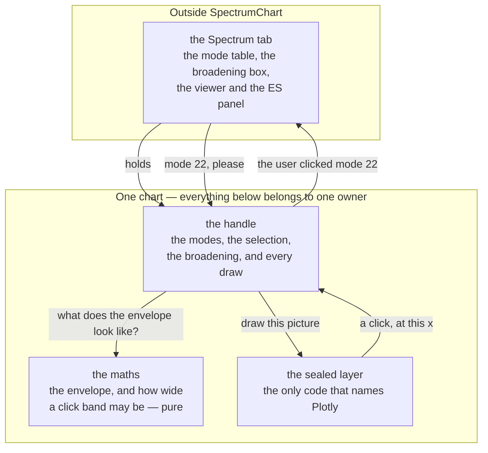

# SpectrumChart — drawing a vibrational spectrum, and picking a mode out of it

**Role:** contract
**Domain:** web
**Companions:** [`vibrationview.md`](?doc=web/vibrationview.md) — its **sibling**,
the module this one's design is derived from (VibrationView animates one mode;
SpectrumChart shows them all and hands one back); [`spectra.md`](?doc=web/spectra.md)
— the tab that drives both, where the modes come from and what a Raman activity
means; [`overview.md`](?doc=web/overview.md) — the module registry and the seam
doctrine.

SpectrumChart is the one component in the browser that draws a vibrational
spectrum. Hand it a list of modes and it draws them as sticks with an optional
broadened envelope over them — and when the user clicks near a peak, it says
which mode they meant.

**This document is the design of that component** — what it is for, what it
refuses to do, what it holds, how it is layered, what each API is for, and how its
tests are derived. It is not a tour of the current code; the code it replaces is
345 lines inside a 3,671-line tab controller. § 14 says which parts are built.

> **Words used in this document.**
>
> - **A chart** — one mounted SpectrumChart: one drawing surface and everything
>   it holds. Two on a page are two of these, sharing nothing.
> - **The handle** — the object you get back from `mount`. It *is* the chart;
>   there is no other way to reach one.
> - **The sealed layer** — the one file in this module allowed to name Plotly.
>   Nothing above it knows that library exists.
> - **A mode** — one row of the spectrum: a wavenumber, optionally a Raman
>   activity, and whether it is imaginary. The chart holds a list of them.
> - **A stick** — one mode drawn: a vertical line at its wavenumber, as tall as
>   its activity.
> - **The envelope** — the smooth curve laid over the sticks, a sum of
>   Lorentzians of a chosen width. It is what a measured spectrum looks like.
> - **The band** — the invisible region around each stick within which a click
>   counts as clicking that mode (§ 6.4). It is the reason picking a mode is not
>   a test of aim.
> - **Activity mode** and **density mode** — whether the run has Raman
>   intensities yet. With them, height means activity; without, every stick is
>   unit height and the chart is a frequency distribution (§ 6.3).

---

## 1. The goal

**One component that draws a spectrum, and turns a click into a mode.**

Here is the whole job in one picture. A calculation produces a list of **modes** —
each one a way the molecule can vibrate, with a frequency and a strength. The
chart draws each as a vertical line, a **stick**, at its frequency and as tall as
its strength, then lays a smooth curve over them so the picture looks like a
spectrum you would measure rather than a barcode:

```
  strength
  (Å⁴/amu)
      │                        ╭─╮  ← the smooth curve: what a real
   14 │                       ╭╯ ╰╮    spectrum looks like, because
      │        ╭╮             │   │    real lines have width
   10 │       ╭╯╰╮            │ ┃ │
      │       │  │           ╭╯ ┃ ╰╮
    6 │      ╭╯  ╰╮      ╭─╮ │  ┃  │
      │      │ ┃  │     ╭╯ ╰╮│  ┃  │
    2 │     ╭╯ ┃  ╰╮   ╭╯ ┃ ╰╯  ┃  ╰╮
      │  ╭──╯  ┃   ╰───╯  ┃     ┃   ╰──╮
      └──┴─────┸──────────┸─────┸──────┴────────────▶  frequency (cm⁻¹)
              323        826   1131
                                ▲
                                └── the selected mode, drawn in its own colour

              each ┃ is one mode;  the curve is their sum
```

**And clicking it is not a test of aim.** A stick is one pixel wide. Around each
one the chart keeps an invisible **band**, as wide as the curve you asked for, so
a click anywhere inside it means *that* mode:

```
        the sticks               what you may click
        ─────────                ──────────────────
             ┃                     ▒▒▒▒▒┃▒▒▒▒▒
             ┃                     ▒▒▒▒▒┃▒▒▒▒▒        ← invisible; the
        ─────┸─────                ▒▒▒▒▒┸▒▒▒▒▒          user just finds
                                                        the peak easy to hit
```

So: a user opens a result, sees where the modes are and how strong they are,
broadens them until it looks like the spectrum they would measure, clicks at a
peak, and the rest of the tab follows to that mode.

**Drawing it honestly means one thing in particular:** nothing is invented. A mode
whose strength has not been computed yet is shown as *not computed*, never as
*weak* (§ 6.3).

---

## 2. What SpectrumChart is not

Each boundary is here because something on the other side of it would plausibly
drift across.

| Not | Whose job it is | Why the boundary is there |
|---|---|---|
| a **mode viewer** | VibrationView | it draws no molecule and holds no geometry. It knows a mode by its index and its frequency, and it never learns where the atoms are |
| a **spectroscopy calculator** | the server, and the Spectrum tab | what a Raman activity is, which normalization produced it, what temperature was assumed. SpectrumChart is handed numbers and draws them |
| a **mode list** | the tab | the sortable table, the filter box, the CSV export. A chart shows a distribution; a table answers "what is mode 22?" — two jobs, two surfaces, and the tab owns the one made of rows |
| the **selection itself** | the tab | it reports a click and is *told* what is selected. Two components that each believed they owned the selection is how the highlight and the viewer drift apart |
| a **control panel** | the tab | the broadening box, the mode filter, the export buttons. SpectrumChart draws no controls (§ 5.4) |

---

## 3. The overall shape



Four things to read off it:

**A tab owns none of it.** A tab has a handle. It does not have the plotting
surface, the marks on it, or a way to reach Plotly.

**The selection is a loop through the tab, not a shortcut inside the chart.** A
click goes *out* as an event and comes *back* as `setSelected`. The chart never
decides that a click changed the selection — because the table, the viewer and
the electronic-structure panel must move together, and only the tab can say when
they have. A chart that highlighted its own stick first would be right most of the
time and out of step exactly when a selection is refused.

**The maths knows nothing about drawing.** It answers two questions — what curve
does this broadening make, and how wide may each band be — with numbers, for
anyone who asks.

**Nothing flows back up past the seal** except a click. The sealed layer is never
asked what is drawn, what the axes are, or where a point landed on screen (§ 9.3).

---

## 4. SpectrumChart is a self-contained module

**SpectrumChart is one ES module, sealed at every edge.** It is imported by name,
it reaches nothing else in the app by name, and nothing in the app can reach
inside it.

**One entry point, and nothing else is importable.**

```js
import { mount } from "/static/lib/spectrumchart/index.js";
```

That is the whole surface. Every other file in the module is internal — the
maths, the sealed layer, the stylesheet. A consumer that imports one of them
directly has broken the module, not found a shortcut.

**A directory is not a seal, so the concealment is made three ways** — the same
three that hold VibrationView together, for the same reasons:

- **Every internal file is underscore-prefixed** — `_maths.js`, `_seal.js`. An
  import of `_maths.js` reads as a violation where it is written.
- **The module links its own stylesheet** (§ 12). No template names it, so no page
  can forget it.
- **A guard test asserts the boundary** — nothing outside the package may name any
  path inside it but `index.js`.

**Nothing it needs comes from a global, and nothing it holds is published to one.**
It does not read `window.molbuilder` and it does not write to it. A chart needs one
thing at mount: an element to live in.

**Nothing leaks out.** No Plotly object, no DOM node, and no internal function ever
appears on the handle. Inside this module the name `Plotly` occurs in exactly one
file, which is also the only place that fails with a clear message when the
library is missing.

That is the practice MolView and VibrationView already follow with 3Dmol: each
module seals the library for itself, because independence beat sharing. The rule
is what the code complies with, not a description of what it currently does.

**No test seam.** Tests import the module and drive the handle, exactly as a page
does (§ 12).

**The test of all of this:** delete every other web module and SpectrumChart still
loads, mounts, draws and reports clicks.

---

## 5. The ideas everything else follows from

Four of them. A design choice that breaks one is wrong no matter how convenient.

### 5.1 The door says the cost

Opening a different result and clicking a different stick are not the same amount
of work, so they are not the same call:

```
   setModes()      rare — you opened a different result
                   → redraw every mark, recompute the curve,
                     and fit both axes to the new numbers

   setSelected()   often — you clicked another stick, or another table row
                   → recolour one mark, and nothing else
                   → no curve, no axis change, no camera move
```

**This is the rule the current code breaks, and the measurement is why the rule is
here.** Today one function draws everything, and selecting a mode calls it: on the
benzene-dithiol result, at the default broadening, a single click recomputes an
806-point envelope from 36 Lorentzians — **29,016 terms** — to change the colour of
one stick. The waste is not the point; the *coupling* is. A chart that cannot
recolour without rebuilding has no way to be told a cheap thing, so every caller
pays for the expensive one and nobody can tell which they asked for.

### 5.2 One place holds each fact

The modes, the selection, the broadening: each has one home inside one chart,
written through one door. Two homes for a fact means a mechanism to keep them in
step, and that mechanism is where they fall out of step.

The **selection lives in the tab** and is mirrored here for drawing — one
direction only, so "mirrored" stays true (§ 3).

**The broadening is the same shape**: the tab owns the control the user types
into, and the chart holds the width it was last told. The mirror is one-way for
the same reason — a chart that changed the width itself would be a second author
of a number the tab displays.

### 5.3 The graphics library is invisible, and the controls are not ours

Nothing above the sealed layer knows the chart is Plotly. And SpectrumChart draws
**no controls** — no heading, no broadening box, no export button. It fills the
element it was given with a spectrum. The drawing library brings a small toolbar
of its own (zoom, reset, save); that is the library's, not a control this module
offers, and what appears on it is decided in the sealed layer and nowhere else.

### 5.4 The host owns the box

The host sizes the element; the chart fills whatever it is given. **This is the
rule that three separate bugs came from breaking**, all on 2026-08-05: a figure
whose height came from a plot that was being sized to it collapsed to a 10-pixel
strip; its SVG then overflowed across the panel beside it; and a chart in a padded
box drew wider than its frame, because the library measures `clientWidth` and
`clientWidth` includes padding.

So: **the box states its size, the module never sets one**, and the module watches
its own box rather than the window — a container query, a collapsing sidebar and a
tab becoming visible all change a box without the window moving.

---

## 6. The data a chart holds

### 6.1 The shapes

```js
mode = {
    index:     22,          // the mode's 1-based number — what a click reports
    freq:      1131.8,      // cm⁻¹; may be negative
    activity:  12.86,       // Å⁴/amu, or null when not computed yet
    imaginary: false,       // a saddle point, not a small number
}
```

`index` is **the caller's numbering**, carried and handed back untouched. The
chart does not renumber, sort or de-duplicate: what comes out of a click is what
went in.

### 6.2 What a chart holds, and what it does not

| Holds | Does not hold |
|---|---|
| the modes it was given | any geometry — no atoms, no eigenvectors, no structure |
| which index is selected (mirrored, § 5.2) | why it is selected, or what else is showing it |
| the broadening width | what the broadening means physically |
| its own box, and a watcher on it | the page's layout |

There is no read-back. Nothing asks a chart what modes it holds or what is
selected, because every caller handed both in.

### 6.3 Two pictures, decided by the data, not by a setting

A run computes frequencies before it computes intensities, so a result can
legitimately arrive with no activities at all:

```
  SOME STRENGTHS KNOWN                  NONE KNOWN YET
  height means strength                 height means nothing, and says so

      │      ┃                              │  ┃ ┃    ┃  ┃ ┃   ┃
      │      ┃   ┃                          │  ┃ ┃    ┃  ┃ ┃   ┃
      │  ┃   ┃   ┃                          │  ┃ ┃    ┃  ┃ ┃   ┃
      │  ┃   ┃   ┃  ×   ×                   │  ┃ ┃    ┃  ┃ ┃   ┃
      └──┸───┸───┸──────────▶               └──┸─┸────┸──┸─┸───┸──▶
                 ↑                           "strengths not computed"
          × = computed as zero?
              No — NOT COMPUTED, and
              marked so it cannot be
              mistaken for silent
```

**This is derived, never configured.** A flag would be a second place to believe
something the data already says, and the failure mode is a flat axis with nothing
on it and no explanation.

### 6.4 A click lands on a band, and no two bands overlap

Each mode gets an invisible band centred on it. Its half-width is the **broadening
width** — *the same number that draws the envelope*, so the region a user aims at
is the region they see. A tolerance set independently of the picture would be a
second fact about the same thing (§ 5.2), and it drifts the moment either is
changed alone. A floor covers broadening being off, since bare sticks still have
to be reachable.

**And each band is clamped to half the distance to its nearer neighbour.**

```
  broadening 20 cm⁻¹, two modes 24 cm⁻¹ apart

  UNCLAMPED — the bands overlap        CLAMPED — they meet and stop
  and the overlap belongs to           at the midpoint, so every point
  whichever was drawn last             belongs to the nearer one

     ▒▒▒▒▒▒▒┃▒▒▒▒▒▒▒                      ▒▒▒▒▒▒▒┃▒▒▒▒▒
     ░░░░░▒▒▒█░░░░░░░░░                   ▒▒▒▒▒▒▒┃▒▒▒▒▒░░░░░░░░░░░
        ░░░░░░┃░░░░░░░                          ░░░░░░┃░░░░░░
              ↑                                       ↑
        clicking HERE could                     clicking HERE is
        select either one                       always the nearer
```

Without that clamp, bands overlap wherever modes are close together — ten of the thirty-five
adjacent pairs in the benzene-dithiol spectrum are closer together than an
unclamped band is wide — and in the overlap the mode you get is whichever band was
drawn last, not the nearer one. Clamped, every point of the plot belongs to at most
one band, so **the band you are in is always the nearest mode**, and crowded
regions get tighter targets, which is exactly where being off by one mode matters.

Two modes at the same frequency cannot be separated by any band. They keep a
minimum width so both stay clickable rather than neither; telling them apart is
the table's job.

---

## 7. The layers

| Level | Knows about | Never |
|---|---|---|
| **the handle** (`index.js`) | the modes, the selection, the broadening, the box | the drawing library, colours, how a mark is shaped |
| **the maths** (`_maths.js`) | numbers | the DOM, the library, the palette |
| **the seal** (`_seal.js`) | Plotly, the palette, the axes, its toolbar | what a mode *is*, why one is selected |

---

## 8. Making and tearing down a chart

```js
const chart = await mount(hostEl, { onSelect: (index) => …, broadening: 20 });
```

**`mount` is asynchronous and always resolves.** The handle it returns is live:
the surface is built, and every door works from the first call. There is no
readiness flag — a chart that is not ready yet is a state a caller can get wrong,
so it is not offered.

**Failure is a handle, never a rejection and never `null`:**

```js
{ ok: false, error: "…", dispose() {} }
```

so a caller branches on `ok` and can call `dispose()` unconditionally. A live
handle carries `ok: true`. Same mount contract as MolView and VibrationView, for
the same reason: teardown must never have to ask whether setup worked.

**A missing library is a failed mount, not a broken page.** If Plotly is absent
the mount resolves with `ok: false` and a message the tab can show — the mode
table beside it still works, which is the behaviour the current code has and
worth keeping.

`dispose()` releases the drawing surface, disconnects the box watcher and leaves
the host element empty. Calling it twice is safe.

---

## 9. The APIs, and who each one serves

### 9.1 The entry point

```js
import { mount } from "/static/lib/spectrumchart/index.js";
```

One name. § 4.

**And that name is all a page needs.** Here is a complete, standalone use — no
framework, no tab, nothing else from this app:

```html
<div id="chart" style="width: 640px; height: 320px"></div>

<script type="module">
import { mount } from "/static/lib/spectrumchart/index.js";

const chart = await mount(document.getElementById("chart"), {
    onSelect: (index) => console.log("the user picked mode", index),
});

chart.setModes([
    { index: 1, freq:  323.5, activity:  2.9, imaginary: false },
    { index: 2, freq:  826.6, activity:  5.4, imaginary: false },
    { index: 3, freq: 1131.8, activity: 12.9, imaginary: false },
    { index: 4, freq: 3175.4, activity:  0.0, imaginary: false },
]);
chart.setBroadening(20);      // draw the curve 20 cm⁻¹ wide
chart.setSelected(3);         // colour mode 3 as the chosen one
</script>
```

That is the whole surface: **five calls and one callback.** The page above styles
a box, hands over four numbers per mode, and gets a spectrum it can click.
It never mentions a drawing library, never reaches into the module, and would
work on a page with nothing else on it.

### 9.2 The handle — for a tab that wants a spectrum

```
setModes(modes)              a different result: redraw, refit the axes (§ 5.1)
setSelected(index | null)    recolour one mark — nothing else moves
setBroadening(width)         how wide to draw each line — and therefore how wide
                             it is to click (§ 6.4).  In cm⁻¹, measured across
                             the peak at half its height
refit()                      re-measure the box and redraw at its size
dispose()                    release, disconnect, empty
```

Five doors. Every one is behaviour; none is a way to read the module's insides.

**`onSelect` is given once, at mount.** It is how a click leaves (§ 3). A chart
with no `onSelect` draws normally and reports nothing — a legitimate thing to be,
for a figure nobody is meant to click.

**`setSelected` never emits `onSelect`.** The event means *a user clicked*, not
*the selection changed*; a caller that wires the two together in the obvious way
would otherwise get an endless round trip. Nothing the tab does to the chart ever
comes back out of it.

There is deliberately **no `getSelected`** and **no `getModes`**: the caller wrote
both.

**`refit` exists because of a rule, not because of a library's behaviour.**

> **The module never draws into a box it cannot measure**, and it cannot know on
> its own when an unmeasurable box becomes real.

A chart in a hidden tab has no box. The module watches its own box (§ 5.4), and
that covers a box that *changes size*; what it cannot be relied on to cover is a
box that did not exist. `refit` is how the host says **the box is real now** — the
same door VibrationView needed, for the same rule.

Justifying this door by what a `ResizeObserver` does instead would put a
library's behaviour into a contract, where it cannot be tested and cannot be
depended on.

### 9.3 The sealed layer — commands down, clicks up

```
draw(picture)                   put this picture on the surface
recolour(marks)                 change the colours already drawn — no rebuild
resize()                        the box changed; fill it
onClick(cb)                     a point was clicked: hand up the token the
                                handle attached to it
purge()                         release the surface
```

It answers **no** question about what is drawn, and it does not know what a mode
is. When the handle draws a mark it attaches a label of its own choosing; a click
hands that label back, unread. The seal never learns that the label means
*mode 22* — working that out is the handle's job, because "mode" is a word from
chemistry and this layer knows none. What a selected stick *looks like*
is decided here — the layer above says *which index is selected*, never what
colour it should be. A colour riding on data is how a drawing decision ends up in
three places.

**The palette is read from the stylesheet, not written in code.** Plotly takes
colours as JavaScript values, so a chart cannot inherit them the way an element
does — which is precisely how two tab controllers ended up carrying private copies
of the same nine hex literals. The sealed layer reads the tokens off the document
and hands the library the answer, so the tokens stay the one source of truth
(§ 12).

**`recolour` is the cheap door § 5.1 is about.** It exists so that the expensive
one does not have to be called for a click.

---

## 10. How a spectrum gets drawn

The sticks are the data. The envelope is a sum of Lorentzians, one per mode with
an activity:

```
                              γ²
     y(x)  =  Σ   A_i  ·  ───────────────      γ = half the width you asked for
              i           (x − x_i)² + γ²
```

so each mode contributes a peak of height `A_i` at `x_i`, and the sum is what a
measured spectrum looks like when lines have width.

**Where the curve is sampled follows the width, not a fixed setting.** Taking
points at a fraction of the width keeps a peak smooth however wide it is drawn, and the grid runs a few half-widths
past the outermost mode so the curve returns to zero at both ends rather than
being cut off mid-peak. A fixed grid is either too coarse for a narrow line or
wasteful for a broad one; the width is the only number that knows which.

**Modes with no activity contribute nothing to the envelope** — not zero-height
peaks. A mode whose intensity has not been computed is missing, not weak (§ 6.3).

---

## 11. Who drives it

The Spectrum tab. It hands the chart a result, tells it what is selected, and
listens for clicks:

```js
const chart = await mount(host, { onSelect: (index) => tab.selectMode(index) });

// a result arrives
chart.setModes(modes);

// the user clicks a stick, or a table row, or arrows through the list
tab.selectMode = (index) => {
    state.selected = index;      // ONE home for the fact (§ 5.2)
    chart.setSelected(index);    // the chart mirrors it
    viewer.showMode(…);          // and so does everything else
    renderEsPanel();
};
```

Read the loop: a click enters the tab and comes back to the chart as an
instruction. The chart never highlights on its own, so the highlight cannot
disagree with the viewer (§ 3).

---

## 12. The module owns its own stylesheet

**The stylesheet is sealed the way the JavaScript is:**

- **One namespace.** Every class is `specchart-…`, so there is no bare name for a
  page to collide with — and a page sheet reaching at one fails a guard, the same
  way a script reaching past `mount` does.
- **No value written twice.** Colours, spacing and type are tokens; the rules read
  them and carry no literals.
- **The module links it, not the page**, at mount, once.

**What the host decides is the box**: how big it is and where it sits (§ 5.4).
Everything inside it is the module's.

**And the mount waits for the stylesheet**, because the sealed layer reads the
palette out of it (§ 9.3) and a `<link>` loads asynchronously. Appending and
carrying on gives the first mount fallback colours, invisibly, for exactly as long
as the two agree — the same trap VibrationView documents, and the same fix.

---

## 13. How the tests are designed

**Every test is derived from this document, never from the source.** A test that
reads the implementation to build its assertion can only confirm that the code
still says what it said.

| Level | Runs | Derived from | Shows |
|---|---|---|---|
| **Behaviour, no browser** | node | § 6, § 10 | the envelope and the band widths — values in, values out |
| **Boundary behaviour** | node, with a stand-in that obeys § 9.3 | § 5, § 7, § 9 | what each door costs, and that each level refuses what its "never" column forbids |
| **End to end** | a real page | § 1, § 6.4 | clicking beside a peak selects that mode; clicking in a gap selects nothing |

### What each rule obliges a test to show

**A rule with no row here is a rule nothing guards.**

| The rule | A test must show |
|---|---|
| § 4 — self-contained | the module mounts given only a host element; it reads no global and writes none |
| § 4 — nothing else is importable | the entry point exports exactly `mount` |
| § 4 — no hatch | the handle's keys are enumerated **unfiltered**: no accessor reaches the drawing surface or the internal state |
| § 5.1 — the door says the cost | `setSelected` computes no curve and changes no axis; `setModes` does both |
| § 5.1 — recolouring is not redrawing | after `setSelected`, the picture handed to the seal is the same picture, with only its colours changed |
| § 5.2 — the selection is mirrored, not owned | a click emits `onSelect` and changes **nothing** on screen until `setSelected` is called; a chart mounted without `onSelect` still draws |
| § 5.3 — one width, two uses | changing the broadening changes both the envelope and the band widths, and there is no way to set either alone |
| § 5.4 — no chrome | a mounted chart contains no heading, button, input or control of any kind |
| § 5.4 — the host owns the box | the module sets no width or height on its host, at mount or ever; and a box that changes size redraws without the window moving |
| § 6.1 — the caller's numbering is carried | the index reported by a click is the index that was handed in, for a list that is unsorted, sparse and 1-based |
| § 6.3 — the picture is derived | a result with no activities anywhere draws unit-height sticks; one with some activities draws the rest at zero, marked as pending — and neither is reachable by a setting |
| § 6.4 — a click lands on the nearest mode | for a spectrum with modes closer together than the broadening, every point in the plot resolves to the nearest mode; no two bands overlap at any width |
| § 6.4 — degenerate modes stay clickable | two modes at the same frequency each keep a band, rather than both collapsing to zero width |
| § 8 — mount always resolves | a mount with no library still resolves with `ok === false` **and** a working `dispose`; nothing rejects and nothing returns null |
| § 9.2 — refit redraws at the box's size | a chart whose box was zero-sized when drawn fills its box after `refit`, with no other call |
| § 9.3 — the seal faces downward | what is drawn, how it is laid out and what the axes span cannot be read out of it |
| § 9.3 — appearance is the seal's | nothing above the seal names a colour, and the palette the seal uses comes from the document's tokens rather than from literals in the module |
| § 10 — the envelope is the sum | the curve at a mode's frequency equals that mode's activity plus the tails of the others, computed independently of the implementation |
| § 10 — the grid follows the width | the sampling step scales with the broadening, and the curve returns to near zero at both ends at every width |
| § 10 — missing is not weak | a mode with no activity contributes nothing to the envelope |
| § 2 — the tab keeps its own | the module contains no table, no filter, no CSV, no poller, and no form |

---

## 14. The file map, and where the code stands

Everything below lives under `lib/spectrumchart/`. **Nothing is built yet** — this
document is the design, written before the code moves, so the door can be reviewed
before anything depends on it.

| File | Holds | Status |
|---|---|---|
| `index.js` | the handle, the state, and every draw it causes | to build |
| `_maths.js` | the envelope, the band widths — pure | to move from `spectra/core.js` (`_lorentzianEnvelope`, `_clickBandWidths`, `_clickTolerance`) |
| `_seal.js` | the only file naming Plotly; the palette read from tokens | to move (`chartTheme`, the `Plotly.react` / `purge` / `Plots.resize` calls, `_watchChartWidth`) |
| `_style.css` | the module's own namespaced sheet | to write |

**What comes out of the tab.** `renderSpectrumChart` (242 lines),
`_lorentzianEnvelope` (37), `chartTheme` (22), `_watchChartWidth` (16),
`_clickBandWidths` (15), `_onChartClick` (7), `_clickTolerance` (6) — 345 lines of
`lib/spectra/core.js`, which is 3,671 lines today.

**What stays.** The mode table, the filter, the CSV export, the selection and its
consumers, the watch poller, the load path, the generator form, the
electronic-structure panel.

**The electronic-structure level diagram is not part of this module** and is not a
module. It is a small figure belonging to the electronic-structure panel, with
different data and a different job; it stays where it is.

**Sequencing.** This extraction comes **before** the planned ESM conversion of
`lib/spectra/core.js` (roadmap #102): converting first would convert the mess and
then re-cut it, while extracting first leaves #102 a smaller file with its hardest
part already sealed.

**No general charting layer.** `_seal.js` is this module's seal over Plotly, not a
shared abstraction waiting for consumers. If another module ever needs the same
seal it gets promoted then, with a real second caller rather than a guessed one —
the same way MolView and VibrationView each kept their own.
