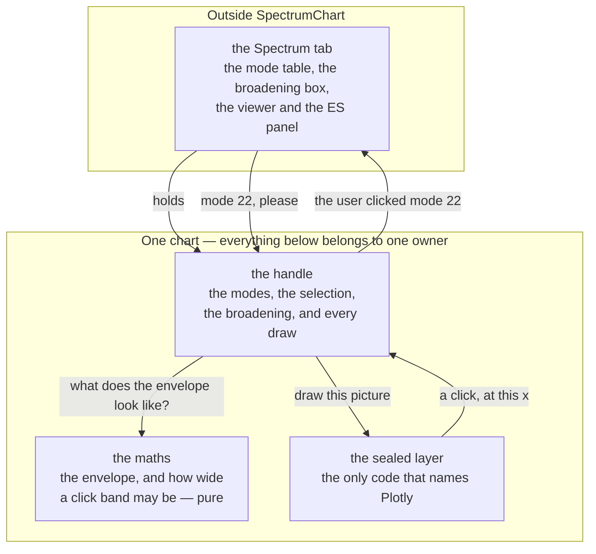

# SpectrumChart — drawing a vibrational spectrum, and picking a mode out of it

**Role:** contract
**Domain:** web
**Companions:** [`vibrationview.md`](?doc=web/vibrationview.md) — its **sibling**,
the module this one's design is derived from (VibrationView animates one mode;
SpectrumChart shows them all and hands one back); [`spectra.md`](?doc=web/spectra.md)
— the tab that drives both, where the modes come from and what a Raman activity
means; [`overview.md`](?doc=web/overview.md) — the module registry and the seam
doctrine.

SpectrumChart is the one component in the browser that draws a vibrational
spectrum. Hand it a list of modes and it draws them as sticks with an optional
broadened envelope over them — and when the user clicks near a peak, it says
which mode they meant.

**This document is the design of that component** — what it is for, what it
refuses to do, what it holds, how it is layered, what each API is for, and how its
tests are derived. It is not a tour of the current code; the code it replaces is
345 lines inside a 3,671-line tab controller. § 13 says which parts are built.

> **Words used in this document.**
>
> - **A chart** — one mounted SpectrumChart: one drawing surface and everything
>   it holds. Two on a page are two of these, sharing nothing.
> - **The handle** — the object you get back from `mount`. It *is* the chart;
>   there is no other way to reach one.
> - **The sealed layer** — the one file in this module allowed to name Plotly.
>   Nothing above it knows that library exists.
> - **A mode** — one row of the spectrum: a wavenumber, optionally a Raman
>   activity, and whether it is imaginary. The chart holds a list of them.
> - **A stick** — one mode drawn: a vertical line at its wavenumber, as tall as
>   its activity.
> - **The envelope** — the smooth curve laid over the sticks, a sum of
>   Lorentzians of a chosen width. It is what a measured spectrum looks like.
> - **The band** — the invisible region around each stick within which a click
>   counts as clicking that mode (§ 6.3). It is the reason picking a mode is not
>   a test of aim.
> - **The two pictures** — with strengths known, a stick's height means its
>   strength; with none known, every stick is the same height (§ 6.2).
> - **An imaginary mode** — one whose frequency came out imaginary, meaning the
>   structure is not sitting at rest (§ 6.4).

---

## 1. The goal

**One component that draws a spectrum, and turns a click into a mode.**

Here is the whole job in one picture. A calculation produces a list of **modes** —
each one a way the molecule can vibrate, with a frequency and a strength. The
chart draws each as a vertical line, a **stick**, at its frequency and as tall as
its strength, then lays a smooth curve over them so the picture looks like a
spectrum you would measure rather than a barcode:

```
  strength
  (Å⁴/amu)
      │                        ╭─╮  ← the smooth curve: what a real
   14 │                       ╭╯ ╰╮    spectrum looks like, because
      │        ╭╮             │   │    real lines have width
   10 │       ╭╯╰╮            │ ┃ │
      │       │  │           ╭╯ ┃ ╰╮
    6 │      ╭╯  ╰╮      ╭─╮ │  ┃  │
      │      │ ┃  │     ╭╯ ╰╮│  ┃  │
    2 │     ╭╯ ┃  ╰╮   ╭╯ ┃ ╰╯  ┃  ╰╮
      │  ╭──╯  ┃   ╰───╯  ┃     ┃   ╰──╮
      └──┴─────┸──────────┸─────┸──────┴────────────▶  frequency (cm⁻¹)
              323        826   1131
                                ▲
                                └── the selected mode, drawn in its own colour

              each ┃ is one mode;  the curve is their sum
```

**And clicking it is not a test of aim.** A stick is one pixel wide. Around each
one the chart keeps an invisible **band**, roughly as wide as the curve you asked
for — § 6.3 says exactly — so a click anywhere inside it means *that* mode:

```
        the sticks               what you may click
        ─────────                ──────────────────
             ┃                     ▒▒▒▒▒┃▒▒▒▒▒
             ┃                     ▒▒▒▒▒┃▒▒▒▒▒        ← invisible; the
        ─────┸─────                ▒▒▒▒▒┸▒▒▒▒▒          user just finds
                                                        the peak easy to hit
```

So: a user opens a result, sees where the modes are and how strong they are,
broadens them until it looks like the spectrum they would measure, clicks at a
peak, and the rest of the tab follows to that mode.

**Drawing it honestly means one thing in particular:** nothing is invented. A mode
whose strength has not been computed yet is shown as *not computed*, never as
*weak* (§ 6.2).

---

## 2. What SpectrumChart is not

Each boundary is here because something on the other side of it would plausibly
drift across.

| Not | Whose job it is | Why the boundary is there |
|---|---|---|
| a **mode viewer** | VibrationView | it draws no molecule and holds no geometry. It knows a mode by its index and its frequency, and it never learns where the atoms are |
| a **spectroscopy calculator** | the server, and the Spectrum tab | what a Raman activity is, which normalization produced it, what temperature was assumed. SpectrumChart is handed numbers and draws them |
| a **mode list** | the tab | the sortable table, the filter box, the CSV export. A chart shows a distribution; a table answers "what is mode 22?" — two jobs, two surfaces, and the tab owns the one made of rows |
| the **selection itself** | the tab | it reports a click and is *told* what is selected. Two components that each believed they owned the selection is how the highlight and the viewer drift apart |
| a **control panel** | the tab | the broadening box, the mode filter, the export buttons. SpectrumChart draws no controls (§ 5.3) |

---

## 3. The overall shape



Four things to read off it:

**A tab owns none of it.** A tab has a handle. It does not have the plotting
surface, the marks on it, or a way to reach Plotly.

**The selection is a loop through the tab, not a shortcut inside the chart.** A
click goes *out* as an event and comes *back* as `setSelected`. The chart never
decides that a click changed the selection — because the table, the viewer and
the electronic-structure panel must move together, and only the tab can say when
they have. A chart that highlighted its own stick first would be right most of the
time and out of step exactly when a selection is refused.

**The maths knows nothing about drawing.** It answers two questions — what curve
does this broadening make, and how wide may each band be — with numbers, for
anyone who asks.

**Nothing flows back up past the seal** except a click. The sealed layer is never
asked what is drawn, what the axes are, or where a point landed on screen (§ 8.4).

---

## 4. SpectrumChart is a self-contained module

**SpectrumChart is one ES module, sealed at every edge.** It is imported by name,
it reaches nothing else in the app by name, and nothing in the app can reach
inside it.

**One entry point, and nothing else is importable.**

```js
import { mount } from "/static/lib/spectrumchart/index.js";
```

That is the whole surface. Every other file in the module is internal — the
maths, the sealed layer, the stylesheet. A consumer that imports one of them
directly has broken the module, not found a shortcut.

**A directory is not a seal, so the concealment is made three ways** — the same
three that hold VibrationView together, for the same reasons:

- **The entry point exports one name.** Importing `index.js` hands back `mount`,
  and there is nothing else on it to find.
- **Every internal file is underscore-prefixed** — `_maths.js`, `_seal.js`. An
  import of `_maths.js` reads as a violation where it is written.
- **A guard test asserts the boundary** — nothing outside the package may name any
  path inside it but `index.js`.

**Nothing it needs comes from the app's globals, and nothing it holds is published
to one.** It does not read `window.molbuilder` and it does not write to it. A chart
needs one thing at mount: an element to live in.

**Nothing leaks out.** No Plotly object, no DOM node, and no internal function ever
appears on the handle. Inside this module the name `Plotly` occurs in exactly one
file.

**And the module brings what it needs.** Nothing else on the page loads Plotly and
no template links a stylesheet: the sealed layer adds both at mount, once (§ 11.6).
A dependency the host has to remember is a dependency some host will forget, and
the result — an empty box or an unstyled one, no error, far from its cause — is
found only by someone looking at the screen. If the library will not load, the
mount fails with a message (§ 7). And if it arrives as a script that publishes
`window.Plotly`, that name is read in the one file already allowed to say it and
nowhere else: no page put it there, and no page can rely on it being there.

That is the practice MolView and VibrationView already follow with 3Dmol: each
module seals the library for itself, because independence beat sharing. The rule
is what the code complies with, not a description of what it currently does.

**No test seam.** Tests import the module and drive the handle, exactly as a page
does (§ 12).

**The test of all of this:** delete every other web module and SpectrumChart still
loads, mounts, draws and reports clicks.

---

## 5. The ideas everything else follows from

Four of them. A design choice that breaks one is wrong no matter how convenient.

### 5.1 The door says the cost

Opening a different result and clicking a different stick are not the same amount
of work, so they are not the same call:

```
   setModes()      rare — you opened a different result
                   → redraw every mark, recompute the curve,
                     and fit both axes to the new numbers

   setSelected()   often — you clicked another stick, or another table row
                   → recolour one mark, and nothing else
                   → no curve, no axis change, no camera move
```

**This is the rule the current code breaks, and the measurement is why the rule is
here.** Today one function draws everything, and selecting a mode calls it: on the
benzene-dithiol result, at the default broadening, a single click recomputes an
806-point envelope from 36 Lorentzians — **29,016 terms** — to change the colour of
one stick. The waste is not the point; the *coupling* is. A chart that cannot
recolour without rebuilding has no way to be told a cheap thing, so every caller
pays for the expensive one and nobody can tell which they asked for.

### 5.2 One place holds each fact

The modes, the selection, the broadening: each has one home inside one chart,
written through one door. Two homes for a fact means a mechanism to keep them in
step, and that mechanism is where they fall out of step.

The **selection lives in the tab** and is mirrored here for drawing — one
direction only, so "mirrored" stays true (§ 3).

**The broadening is the same shape**: the tab owns the control the user types
into, and the chart holds the width it was last told. The mirror is one-way for
the same reason — a chart that changed the width itself would be a second author
of a number the tab displays.

### 5.3 The controls are not ours

SpectrumChart draws **no controls** — no heading, no broadening box, no export
button. It fills the element it was given with a spectrum. The drawing library
brings a small toolbar of its own (zoom, reset, save); that is the library's, not
a control this module offers, and what appears on it is decided in the sealed
layer and nowhere else.

### 5.4 The host owns the box

The host sizes the element and the chart fills whatever it is given: **the box
states its size, the module never sets one.** And the module watches *its own box*
rather than the window — a container query, a collapsing sidebar and a tab
becoming visible all change a box while the window sits still.

Three separate bugs came from breaking this rule, all on 2026-08-05. They are
written down where they can be enforced, as the box rules in § 11.5.

---

## 6. The data a chart holds

### 6.1 The one shape a caller must know

Everything the chart draws comes from a list of these, and nothing else:

```js
mode = {
    index:     22,          // required — the caller's own number for this mode
    freq:      1131.8,      // required — cm⁻¹, may be negative
    activity:  12.86,       // optional — Å⁴/amu; null or absent = not computed
    imaginary: false,       // optional — default false
}
```

| Field | Required | Unit | Absent means | Refused when |
|---|---|---|---|---|
| `index` | **yes** | — | *(the record is refused)* | missing, not a finite number, or repeated within the list |
| `freq` | **yes** | cm⁻¹ | *(the record is refused)* | missing, or not a finite number |
| `activity` | no | Å⁴/amu | **not computed yet** — drawn as pending, never as zero (§ 6.2) | present but not a finite number |
| `imaginary` | no | — | `false` | never — anything truthy is true |

**A record that must be refused takes the whole call with it.** `setModes` draws
the list it was given or it draws none of it; it never quietly skips the bad rows
and renders a spectrum missing modes without saying so. A caller with one
malformed record has a bug one line earlier, and a chart that hides it is a chart
that helped.

**And a refused list leaves an empty chart, not the last one.** The old spectrum
staying on screen is exactly the hiding this rule is against: the caller sees
something plausible and never learns the call did nothing. So the chart empties —
visible, on screen — and the reason for the refusal goes to the console, where a
developer will look, because a caller's bug is not something a user can act on.

**`index` is the caller's numbering, carried and handed back untouched.** The
chart does not renumber and does not sort — it draws the modes in whatever order
they arrive and hands back exactly the number it was given. So a caller may use
1-based mode numbers, row numbers, or any other finite number it can recognise
later; the chart has no opinion about what the number means, because it means
something only to whoever wrote it.

**But the numbers must differ from each other.** A list carrying the same index
twice is refused whole. `setSelected(22)` names one mode and a click hands one
number back; with two modes numbered 22 neither sentence has an answer, and the
chart would have to invent a tie-break no caller could predict.

**Nothing else travels.** No structure, no eigenvector, no run metadata, no
label, no colour. If a future need seems to want a fifth field, the question to
ask first is whether it is a fact about *the picture* or about *the science* —
the second belongs to the tab, and this list is how the boundary in § 2 stays
real rather than aspirational.

### 6.2 Two pictures, decided by the data, not by a setting

A run computes frequencies before it computes intensities, so a result can
legitimately arrive with no activities at all:

```
  SOME STRENGTHS KNOWN                  NONE KNOWN YET
  height means strength                 every stick is height one,
                                        and the picture says why

      │      ┃                              │  ┃ ┃    ┃  ┃ ┃   ┃
      │      ┃   ┃                          │  ┃ ┃    ┃  ┃ ┃   ┃
      │  ┃   ┃   ┃                          │  ┃ ┃    ┃  ┃ ┃   ┃
      │  ┃   ┃   ┃  ×   ×                   │  ┃ ┃    ┃  ┃ ┃   ┃
      └──┸───┸───┸──────────▶               └──┸─┸────┸──┸─┸───┸──▶
                 ↑                           "strengths not computed"
          × = computed as zero?
              No — NOT COMPUTED, and
              marked so it cannot be
              mistaken for silent
```

**The right-hand picture is not a chart with nothing in it.** Every stick stands
at height one, and the curve over them is the sum of those — so the picture
answers *where are the modes, and where do they crowd together*, which is a real
question and the only one the data can answer yet (§ 9).

**Both markings are drawn in the plot**, as the pictures show: the `×` on the
axis, the words along the top. Neither is a label beside the chart or a banner
above it — a chart made of one drawing surface stays a chart made of one drawing
surface, and § 5.3's "no chrome" holds without an exception being carved for it.

**Which picture you get is derived, never configured.** A flag would be a second
place to believe something the data already says, and the failure mode is a flat
axis with nothing on it and no explanation.

### 6.3 A click lands on a band, and no two bands overlap

Each mode gets an invisible band centred on it, and its half-width comes from the
**broadening width** — *the same number that draws the envelope*, so the region a
user aims at is the region they see. A tolerance set independently of the picture
would be a second fact about the same thing (§ 5.2), and it drifts the moment
either is changed alone.

**Two things bend that, and it is worth saying which way each bends.** Below
8 cm⁻¹ the band is *wider* than the curve, because a 3 cm⁻¹ target cannot be hit
with a mouse. Where modes crowd, it is *narrower*, because the alternative is
handing back the wrong mode. What never happens is the picture being changed to
match the band: the curve is the claim about the science, the band is only about
aiming, and where they must differ it is the invisible one that gives way.

**Four steps, in this order, give every band its half-width:**

| | The step | The number | Why it is there |
|---|---|---|---|
| 1 | start at the broadening width | whatever was last set | the region you aim at is the region you see |
| 2 | raise it to the **floor** if it is below | **8 cm⁻¹** | at zero broadening a stick is one pixel wide, and bare sticks still have to be reachable |
| 3 | clamp it to half the gap to the nearer neighbour | — | so no two bands ever overlap |
| 4 | raise it to the **minimum** if step 3 took it below | **0.25 cm⁻¹** | two modes at the same frequency would otherwise clamp each other to nothing |

**The floor and the minimum are numbers this contract fixes, not preferences.** A
click target whose size changes between builds is a click target nobody can test,
and a rule that says only "a floor" cannot have a test derived from it at all.

Step 3 is the one worth a picture:

```
  broadening 20 cm⁻¹, two modes 24 cm⁻¹ apart

  UNCLAMPED — the bands overlap        CLAMPED — they meet and stop
  and the overlap belongs to           at the midpoint, so every point
  whichever was drawn last             belongs to the nearer one

     ▒▒▒▒▒▒▒┃▒▒▒▒▒▒▒                      ▒▒▒▒▒▒▒┃▒▒▒▒▒
     ░░░░░▒▒▒█░░░░░░░░░                   ▒▒▒▒▒▒▒┃▒▒▒▒▒░░░░░░░░░░░
        ░░░░░░┃░░░░░░░                          ░░░░░░┃░░░░░░
              ↑                                       ↑
        clicking HERE could                     clicking HERE is
        select either one                       always the nearer
```

Without that clamp, bands overlap wherever modes are close together — ten of the thirty-five
adjacent pairs in the benzene-dithiol spectrum are closer together than an
unclamped band is wide — and in the overlap the mode you get is whichever band was
drawn last, not the nearer one. Clamped, every point of the plot belongs to at most
one band, so **the band you are in is always the nearest mode**, and crowded
regions get tighter targets, which is exactly where being off by one mode matters.

Two modes at the same frequency cannot be told apart by any band, which is what
step 4 is for: both keep the minimum width, so both stay clickable rather than
neither. Which of the two a click reports is then genuinely undefined — they are
the same distance away — and separating them is the table's job, not the chart's.

### 6.4 An imaginary mode is drawn, marked, and left out of the curve

A mode can come back **imaginary**. That is not a very slow vibration: it means
the structure is not sitting at rest, and the "vibration" is the direction it
would fall away in. No measured spectrum contains such a line.

So the chart does three separate things with one, and each is its own sentence of
the contract:

- **It is drawn**, at the frequency the caller gave, and it is **clickable like
  any other mode** — an imaginary mode is very often the one the user opened the
  result to look at.
- **It is marked apart**, so it can never be read as an ordinary weak line. *How*
  it is marked is the seal's business (§ 8.4); *that* it is marked is this
  contract's.
- **It never joins the envelope** (§ 9), because the envelope is what a
  measurement would look like and no measurement contains this.

**`imaginary` and a negative `freq` are two separate facts, and neither implies
the other.** Runs differ over whether they report these frequencies as negative
numbers. Which convention produced a number is science, and science belongs to the
tab (§ 2): the chart draws the number it is handed and marks the mode the flag
names, and it never infers one from the other.

---

## 7. Making and tearing down a chart

```js
const chart = await mount(hostEl, { onSelect: (index) => …, broadening: 20 });
```

The options are written out in § 8.2; this section is about what `mount` *gives
back* and how it ends.

**`mount` is asynchronous and always resolves.** The handle it returns is live:
the surface is built, and every door works from the first call. There is no
readiness flag — a chart that is not ready yet is a state a caller can get wrong,
so it is not offered.

**Failure is a handle, never a rejection and never `null`:**

```js
{ ok: false, error: "…", dispose() {} }
```

so a caller branches on `ok` and can call `dispose()` unconditionally. A live
handle carries `ok: true`. Same mount contract as MolView and VibrationView, for
the same reason: teardown must never have to ask whether setup worked.

**A failed handle carries those three keys and no others** — no inert `setModes`,
no `setSelected` that quietly does nothing. A caller that skipped the `ok` branch
then fails at its first door, loudly and at the line that made the wrong
assumption, instead of feeding data to a chart that was never there.

**A library that will not load is a failed mount, not a broken page.** The module
fetches Plotly itself (§ 4); if that fails — offline, blocked, the file not
there — the mount resolves with `ok: false` and a message the tab can show. The
mode table beside it still works, which is the behaviour the current code has and
is worth keeping.

**The module owns the inside of its host, and nothing else about it.** `mount`
empties the element it is given before it draws, so whatever was in there — a
placeholder, a spinner, a chart from a previous result — is gone. The element
itself, its size and its place on the page remain the host's (§ 5.4).

`dispose()` releases the drawing surface, disconnects the box watcher and leaves
the host element empty. Calling it twice is safe.

---

## 8. The APIs, and who each one serves

### 8.1 The entry point

```js
import { mount } from "/static/lib/spectrumchart/index.js";
```

One name. § 4.

**And that name is all a page needs.** Here is a complete, standalone use — no
framework, no tab, nothing else from this app:

```html
<div id="chart" style="width: 640px; height: 320px"></div>

<script type="module">
import { mount } from "/static/lib/spectrumchart/index.js";

const chart = await mount(document.getElementById("chart"), {
    onSelect: (index) => console.log("the user picked mode", index),
});

if (chart.ok) {                   // the one branch every caller makes (§ 7)
    chart.setModes([
        { index: 1, freq:  323.5, activity:  2.9, imaginary: false },
        { index: 2, freq:  826.6, activity:  5.4, imaginary: false },
        { index: 3, freq: 1131.8, activity: 12.9, imaginary: false },
        { index: 4, freq: 3175.4, activity:  0.0, imaginary: false },
    ]);
    chart.setBroadening(20);      // draw the curve 20 cm⁻¹ wide
    chart.setSelected(3);         // colour mode 3 as the chosen one
}
</script>
```

That is the whole surface: **five doors and one callback.** The page above styles
a box, hands over four numbers per mode, and gets a spectrum it can click. There
is no stylesheet `<link>` and no library `<script>` — the module brings both
(§ 4) — so this really is the whole page.

### 8.2 What `mount` takes

```js
mount(host, options) -> Promise<handle>
```

| What is passed | What it is | Required | Default |
|---|---|---|---|
| `host` | the element the chart lives in. The **host sizes it** (§ 5.4); the module never writes a width or a height onto it | yes | — |
| `options.onSelect` | `(index) => void`, called when a **user** clicks a mode. Never called by anything the tab does (§ 8.3) | no | nothing is reported |
| `options.modes` | the first mode list, exactly as `setModes` takes it | no | empty — an empty chart, not an error |
| `options.selected` | the first selection, exactly as `setSelected` takes it | no | none chosen |
| `options.broadening` | line width in cm⁻¹, exactly as `setBroadening` takes it | no | `0` — bare sticks, no curve |

**`mount` refuses exactly one thing: a host that is not an element.** Everything
else it is given it can work with, and a missing or wrong host is the one mistake
that leaves it nowhere to draw. It refuses the way every failure here is reported
— a handle with `ok: false` and a message (§ 7), never a throw.

**A mount option is the first write through the door of the same name, not a
second way to hold the fact.** `mount({ broadening: 20 })` and
`setBroadening(20)` reach the same one place; there is no separate "initial"
value kept anywhere, so nothing can disagree with anything (§ 5.2).

Everything else about the chart — its size, its position, when it is visible — is
the host's, and is expressed in CSS rather than passed here.

### 8.3 The handle — the only way data goes in

```
setModes(list)               a different result: redraw, refit the axes (§ 5.1)
setSelected(index | null)    recolour one mark — nothing else moves
setBroadening(width)         how wide to draw each line, in cm⁻¹ — and therefore
                             how wide it is to click (§ 6.3)
refit()                      re-measure the box and redraw at its size
dispose()                    release, disconnect, empty
```

Five doors, and **every fact the chart holds arrives through exactly one of
them.** There is no property to assign, no options object to mutate after the
fact, no global to publish into, and no second path that "also" sets something.
Data goes in one way; nothing comes back out but a click.

**Each door, precisely:**

| Door | Takes | Refuses | Returns |
|---|---|---|---|
| `setModes` | an array of mode records (§ 6.1). An empty array is legal and means *an empty chart* | anything that is not an array; a record missing `index` or `freq`; the same `index` twice — the whole call, and **the chart empties** rather than leaving the last spectrum standing (§ 6.1) | nothing |
| `setSelected` | one `index`, or `null` for *nothing chosen*. It is **remembered whether or not the current list holds it**, and drawn as soon as a list does | nothing — an index no list holds is not an error (below) | nothing |
| `setBroadening` | a width in cm⁻¹, `≥ 0`. Zero means *no curve*: bare sticks, and click bands at their floor (§ 6.3) | a negative number or a value that is not a number — the width already set stands, because substituting a default would hide a caller's bug | nothing |
| `refit` | — | — | nothing |
| `dispose` | — | — | nothing; safe to call twice |

**Order does not matter.** Any door may be called before any other, any number of
times, in any order: selecting before there are modes, broadening an empty chart,
re-selecting the same index. Each call writes one fact and redraws what that fact
affects. A caller that has to remember a sequence is a caller that will get it
wrong.

**Which is why `setSelected` records rather than refuses, and the highlight is
derived from what it recorded.** An index the current list does not hold
highlights nothing; if a later `setModes` brings that index in, the highlight
appears without the tab having to say it again.

> A mirror that refused would be worse than one that shows nothing. The tab does
> `state.selected = 3` and then `chart.setSelected(3)`: a refusal leaves the tab
> believing 3 is selected while the chart still highlights 7 — the two out of step,
> which is the exact drift § 5.2 exists to prevent. And the mistake a refusal was
> meant to catch, choosing a mode that is not there, still shows: as no highlight.

**Nothing is read back.** There is deliberately no `getModes`, no `getSelected`,
no `getBroadening` and no accessor of any kind: every one of those values was
written by the caller, so a second copy inside the module would be a second place
to believe something (§ 5.2). What the module knows that the caller does not is
*where the marks landed on screen*, and that is the seal's business and never
leaves it (§ 8.4).

**`onSelect` is given once, at mount.** It is how a click leaves (§ 3). A chart
with no `onSelect` draws normally and reports nothing — a legitimate thing to be,
for a figure nobody is meant to click.

**`setSelected` never emits `onSelect`.** The event means *a user clicked*, not
*the selection changed*; a caller that wires the two together in the obvious way
would otherwise get an endless round trip. Nothing the tab does to the chart ever
comes back out of it.

**A click that lands in no band reports nothing at all.** `onSelect` is not
called, and nothing on screen changes. It does not report `null`: the event means
*the user picked a mode*, and there is no mode to name — a `null` would oblige
every caller to handle a case whose meaning is "nothing happened". Whether an
empty click should clear the selection is a decision about the whole tab, and the
tab is where the selection lives (§ 5.2).

**`refit` exists because of a rule, not because of a library's behaviour.**

> **The module never draws into a box it cannot measure**, and it cannot know on
> its own when an unmeasurable box becomes real.

A chart in a hidden tab has no box. The module watches its own box (§ 5.4), and
that covers a box that *changes size*; what it cannot be relied on to cover is a
box that did not exist. `refit` is how the host says **the box is real now** — the
same door VibrationView needed, for the same rule.

Justifying this door by what a `ResizeObserver` does instead would put a
library's behaviour into a contract, where it cannot be tested and cannot be
depended on.

### 8.4 The sealed layer — commands down, clicks up

```
draw(picture)                   put this picture on the surface
recolour(marks)                 change the colours already drawn — no rebuild
resize()                        the box changed; fill it
onClick(cb)                     the user clicked: hand up where it landed on
                                the frequency axis, and nothing else
purge()                         release the surface
```

It answers **no** question about what is drawn, and it does not know what a mode
is. **A click comes up as one number** — a position on the frequency axis — and
the handle turns that into a mode through the bands (§ 6.3).

That is deliberately the only mechanism. A drawn mark carrying its own label back
would be the obvious alternative and it cannot work here: the click a band exists
to catch lands in *empty space* beside a peak, where there is no mark to have
carried anything. So the seal reports a position, which is a number, and stays as
ignorant of chemistry as before — "mode" is a word this layer never learns.

What a selected stick *looks like* is decided here too. The layer above says
*which mark* is the chosen one, never what colour it should be: a colour riding on
data is how a drawing decision ends up in three places.

**The palette is read from the stylesheet, not written in code.** Plotly takes
colours as JavaScript values, so a chart cannot inherit them the way an element
does — which is precisely how two tab controllers ended up carrying private copies
of the same nine hex literals. The sealed layer reads **this module's own tokens**
(§ 11.1) off its root and hands the library the answer, so the sheet stays the one
source of truth for how the chart looks.

**`recolour` is the cheap door § 5.1 is about.** It exists so that the expensive
one does not have to be called for a click.

---

## 9. How a spectrum gets drawn

The sticks are the data. The envelope is a sum of Lorentzians, one per mode with
an activity:

```
                              γ²
     y(x)  =  Σ   A_i  ·  ───────────────      γ = half the width you asked for
              i           (x − x_i)² + γ²
```

so each mode contributes a peak of height `A_i` at `x_i`, and the sum is what a
measured spectrum looks like when lines have width.

**Where the curve is sampled follows the width, not a fixed setting.** A fixed
grid is either too coarse for a narrow line or wasteful for a broad one; the width
is the only number that knows which. Two requirements say how far that goes, and
they are stated as accuracy rather than as constants so a test can check the
result instead of the arithmetic:

- **A peak is smooth** — at least **eight samples across the full width** of the
  narrowest peak drawn. Fewer and a Lorentzian shows its corners.
- **The curve ends, rather than being cut off** — the grid extends past the
  outermost mode until the envelope has fallen below **1% of the tallest peak**.

Both are consequences of the width alone, so neither is a number anyone tunes.

**What the sum runs over follows the picture you are in** (§ 6.2), because the sum
has to mean the same thing the stick heights mean:

- **Strengths known** — the sum runs over the modes that have one. A mode whose
  strength has not been computed contributes **nothing**, not a zero-height peak:
  it is missing, not weak.
- **None known** — every mode contributes a peak of height one, and the curve is
  a genuine frequency distribution: where it is high, modes are crowded. Drawing
  unit sticks with no curve over them would leave exactly the barcode § 1 says
  this component exists to avoid.

**No imaginary mode is ever in the sum**, in either picture (§ 6.4).

---

## 10. Who drives it

The Spectrum tab. It hands the chart a result, tells it what is selected, and
listens for clicks:

```js
const chart = await mount(host, { onSelect: (index) => tab.selectMode(index) });
if (!chart.ok) showMessage(chart.error);   // the mode table still works without it

// a result arrives
if (chart.ok) chart.setModes(modes);

// the user clicks a stick, or a table row, or arrows through the list
tab.selectMode = (index) => {
    state.selected = index;      // ONE home for the fact (§ 5.2)
    chart.setSelected(index);    // the chart mirrors it
    viewer.showMode(…);          // and so does everything else
    renderEsPanel();
};
```

Read the loop: a click enters the tab and comes back to the chart as an
instruction. The chart never highlights on its own, so the highlight cannot
disagree with the viewer (§ 3).

---

## 11. The module owns its own stylesheet

**A stylesheet is the seal written in another language.** The JavaScript half of
this module is sealed at `mount`; the CSS half is sealed at its namespace. A page
rule reaching at `spectrumchart-…` is the same category error as a script
importing `_maths.js`, and it is caught the same way — by a guard, not by review.

**It is a short sheet, and it should stay short.** A chart is a box with one
drawing surface in it — there is no toolbar, no legend, no readout panel, no
banner (§ 5.3). What follows is a system for those few rules, not a licence to
grow more of them. It stays a real `.css` file rather than a string inside
JavaScript, so the repository's existing CSS audits can read it.

### 11.1 Where this sheet sits in the app's CSS system

The app's page CSS is a four-tier system ([`css-system-plan.md`](?doc=web/css-system-plan.md)):
**T0** tokens · **T1** the bare document · **T2** shared components · **T3** one
tab's own vocabulary, where the rule is that *a page sheet may contain only T3*.

**A module sheet is none of those tiers — it sits outside the page layer
entirely**, which is exactly why that plan lists module sheets as out of its
scope. It is its own miniature T0 + T3: its own tokens on its own root, then its
own rules reading them.

```
      THE PAGE LAYER                        THIS MODULE
      ──────────────                        ───────────
   T0  tokens.css        scales, palette
   T1  page-shell.css    html, body, type      _style.css
   T2  components        card, status, button    ├── its own root
   T3  <page>/style.css  that tab's parts        ├── its own tokens
                                                 └── its own rules
              │                                        │
              └──────────  ✗  no rule crosses  ✗ ──────┘
       neither reads the other's names, and neither styles the other's markup
```

**Nothing is inherited across that line, and that is what makes § 4's test true.**
The module's tokens are its own — not the page's tokens with a prefix, and not the
page's values read at mount. Delete every page stylesheet in the app and this
chart still looks right, because nothing it needs was ever over there.

**The theme is followed, not copied.** Light and dark are the one thing the page
and the module genuinely share, and they share the *signal*, not the values: the
module's own tokens redefine themselves under the same theme condition the app
uses. No second sheet, no colour set from JavaScript, and no reading of a page
variable — so the chart matches the app without depending on it.

### 11.2 The sheet has one shape, so every rule has one home

Three blocks, in this order, and a rule that fits two of them belongs in the
earlier one:

```
   1  the root      .spectrumchart { … }      every token this module has
   2  the frame     the box the chart lives in, and how it fills its host
   3  the surface   the element the drawing goes on
```

That is the whole sheet. If a fourth block is ever proposed, the question to ask
first is whether the module has genuinely grown a part — or whether something the
plot should be drawing has been moved out into markup instead (§ 6.2).

And the selectors stay flat, because specificity is a budget that can only be
spent once:

- **one class per rule**, nesting at most one level deep;
- **no element selectors** — `div`, `p`, `svg` reach markup this module did not
  write, or markup the library owns and may change;
- **no IDs** — one-use specificity nothing can later override without a second
  hack;
- **no `:nth-child()` standing in for a name** — it encodes the order the markup
  happens to have today, which is not a contract.

### 11.3 No magic numbers

**Every value a rule uses is a token declared in block 1.** A literal inside a
rule is a defect even when it plainly works, because it is a number nobody can
find later — and the second time it is needed it gets retyped, slightly
different, and now the module has two of them.

```css
/*  NO — three literals; none can be found, none can be changed together  */
.spectrumchart { padding: 12px; border: 1px solid #d4d4d8; border-radius: 6px; }

/*  YES — the values live at the root; the rule reads them  */
.spectrumchart {
    padding:       var(--spectrumchart-pad);
    border:        var(--spectrumchart-hairline) solid var(--spectrumchart-edge);
    border-radius: var(--spectrumchart-radius);
}
```

**A number that must be raw is still given a name.** The hairline above is
`--spectrumchart-hairline: 1px`, not `1px` written wherever a border is needed —
so one place says what it is and what it is for.

**What is not a magic number:** `0`, `100%`, `1fr`, `auto`. These say *none*,
*all* or *whatever fits* — they are structure, not measurements, and naming them
would only add a word.

### 11.4 Nothing is patched

Every entry here is banned because of what its presence *means*, not because it
looks untidy:

| Not allowed | What it really says |
|---|---|
| `!important` | this rule is winning an argument the cascade should not be having. The rule is in the wrong block, or it is fighting something outside the seal — and both are bugs one level up |
| a rule that undoes another rule — a negative margin cancelling a margin, a reset of something this sheet set three rules earlier | the first rule was wrong. Two wrongs leave two things to maintain and no way to tell which is load-bearing |
| anything that works only because of link order | this module links exactly one sheet, so order is never the answer. If it is, the specificity is wrong |
| a page sheet styling `spectrumchart-*`, or this sheet styling anything outside its own markup | the seal, from each side |

There is no rule here about `z-index` or about hiding, and that is deliberate: two
elements that never overlap need no stacking order, and a module that hides
nothing needs no way to hide it. Rules for parts that do not exist are the same
mistake as parts that do not exist.

### 11.5 The UI knows its own size

**The chart responds to its own box, never to the window.** Nothing about the
window tells this module how much room it has: the same chart can sit in a
full-width panel, in a half-width tab, beside a sidebar that collapses, or in a
tab that was hidden a moment ago. All four change the box while the window sits
still. So a viewport media query is wrong here even on the day it appears to
work.

**And responding is one thing: redraw at the box's size.** There is nothing to
re-arrange — one surface filling one frame — so the sheet holds no rule that
*changes with* the box, and the response lives where the box is watched (§ 5.4).
Naming steps and writing queries for a layout of one element would be machinery
with nothing to do.

> If the module ever does grow a second part, the rule to reach for is a
> **container query on the frame**, never a viewport one — and the container goes
> on the frame because an element cannot query itself. That is not a preference;
> it is the bug that made an earlier container query silently never match.

Three rules that do earn their place, each from a way a chart has actually broken:

- **The frame states a height; the surface fills it.** Never `height: auto` on a
  box whose content is sized *from* the box — that is a definition in a circle,
  and it resolves to a ten-pixel strip.
- **The drawing surface carries no padding.** The library measures `clientWidth`,
  and `clientWidth` includes padding, so a padded surface draws wider than its
  frame. The frame pads; the surface does not.
- **Nothing here scrolls the page sideways.** Whatever cannot shrink scrolls
  inside its own box.

### 11.6 The module links it, and the mount waits for it

**The module links the sheet, not the page**, at mount, once. No template names
the file, so no page can forget it — the failure mode being an unstyled chart,
with no error, far from its cause, found only by someone looking at the screen.
The drawing library arrives the same way and for the same reason (§ 4), so a host
provides one thing only: an element.

**And `mount` waits for it to load**, because the sealed layer reads the palette
out of it (§ 8.4) and a `<link>` loads asynchronously. Appending and carrying on
gives the first mount fallback colours, invisibly, for exactly as long as the two
agree — the same trap VibrationView documents, and the same fix. `mount` is
asynchronous already (§ 7), so waiting costs a caller nothing.

---

## 12. How the tests are designed

**Every test is derived from this document, never from the source.** A test that
reads the implementation to build its assertion can only confirm that the code
still says what it said.

| Level | Runs | Derived from | Shows |
|---|---|---|---|
| **Behaviour, no browser** | node | § 6, § 9 | the envelope and the band widths — values in, values out |
| **Boundary behaviour** | node, with a stand-in that obeys § 8.4 | § 5, § 8 | what each door costs, and that nothing above the seal names the library, a colour, or a pixel |
| **End to end** | a real page | § 1, § 6.3 | clicking beside a peak selects that mode; clicking in a gap reports nothing |

**The stand-in replaces the drawing library, not a file of this module.** Nothing
inside the module is swappable, and no door exists for a test that does not exist
for a page (§ 4). The stand-in stands where Plotly stands; the module cannot tell
the difference, because § 8.4 is the whole of what it asks of that library.

### What each rule obliges a test to show

**A rule with no row here is a rule nothing guards.**

| The rule | A test must show |
|---|---|
| § 2 — the tab keeps its own | the module contains no table, no filter, no CSV, no poller, and no form |
| § 4 — self-contained | the module mounts given only a host element; it reads no global of the app's and writes none, and the only global name it reads at all is the library's, in the seal |
| § 4 — nothing else is importable | the entry point exports exactly `mount` |
| § 4 — no hatch | the handle's keys are enumerated **unfiltered**: no accessor reaches the drawing surface or the internal state |
| § 4 — the module brings what it needs | a page holding only a host element and one `import` draws a **styled** chart: no `<script>` and no `<link>` of its own, and mounting twice adds one link, not two |
| § 4 — the library name appears once | `Plotly` occurs in exactly one file of the module, and nothing above that file names the library or a colour |
| § 5.1 — the door says the cost | `setSelected` computes no curve and changes no axis; `setModes` does both |
| § 5.1 — recolouring is not redrawing | after `setSelected`, the picture handed to the seal is the same picture, with only its colours changed |
| § 5.2 — the selection is mirrored, not owned | a click emits `onSelect` and changes **nothing** on screen until `setSelected` is called; a chart mounted without `onSelect` still draws |
| § 5.3 — no chrome | a mounted chart contains no heading, button, input or control of any kind |
| § 5.4 — the host owns the box | the module writes no width or height onto its host — not at mount, not at any door — and a box that changes size redraws while the window sits still |
| § 6.1 — the two required fields | a record without `index`, or without `freq`, is refused |
| § 6.1 — a refusal takes the whole call | one malformed record among many draws **nothing**, rather than a spectrum quietly missing that mode |
| § 6.1 — a refused list empties the chart | after a refused `setModes`, the previous spectrum is gone from the screen rather than left standing as though the call had worked |
| § 6.1 — absent is not zero | a mode with no `activity` field, and one with `activity: null`, are treated the same and neither is drawn as a strength of zero |
| § 6.1 — the caller's numbering is carried, not interpreted | an unsorted, sparse, 1-based list draws in the order given, and the index a click reports is the index that was handed in |
| § 6.1 — the indices must differ | a list containing the same index twice is refused whole, rather than resolved by a rule the caller cannot see |
| § 6.2 — the picture is derived | a result with no activities anywhere draws every stick at height one, with a curve over them; one with some activities draws the rest as pending — and neither picture is reachable by a setting |
| § 6.2 — the markings are in the plot | the pending marks and the "not computed" wording are drawn on the surface: the module's markup carries no label, banner or text node beside the chart |
| § 6.3 — one width, two uses | changing the broadening changes both the envelope and the band widths, and there is no way to set either alone |
| § 6.3 — a click lands on the nearest mode | for a spectrum with modes closer together than the broadening, every point in the plot resolves to the nearest mode; no two bands overlap at any width |
| § 6.3 — the floor and the minimum are the stated numbers | at **any** broadening below 8 cm⁻¹, zero included, an isolated band is 8 cm⁻¹ half-wide; no clamp ever takes a band below 0.25 cm⁻¹ |
| § 6.3 — the band bends, never the picture | at a broadening the floor or the clamp overrides, the envelope drawn is still the envelope for the width that was set |
| § 6.3 — degenerate modes stay clickable | two modes at the same frequency each keep a band, rather than both collapsing to zero width |
| § 6.4 — an imaginary mode is drawn and clickable | it appears at its own frequency and a click on it reports its index, exactly like any other mode |
| § 6.4 — an imaginary mode is marked | it is drawn differently from an ordinary mode of the same height |
| § 6.4 — an imaginary mode is not in the curve | adding one to a list leaves the envelope unchanged, in both pictures |
| § 6.4 — the flag and the sign are independent | a negative `freq` without the flag is drawn as an ordinary mode; the flag with a positive `freq` is drawn as imaginary |
| § 7 — mount always resolves | a mount with no library still resolves with `ok === false` **and** a working `dispose`; nothing rejects and nothing returns null |
| § 7 — a failed handle has three keys | its keys are exactly `ok`, `error`, `dispose`: calling any other door throws rather than silently doing nothing |
| § 7 — the module owns the inside of its host | a host with content in it is empty of that content after mount, and empty again after `dispose`; the watcher stops (a resize after `dispose` draws nothing) and a second `dispose` neither acts nor throws |
| § 8.2 — a host that is not an element is the one refusal | `mount(null)` and `mount("#chart")` each resolve with `ok === false` and a message, and neither throws |
| § 8.2 — a mount option is the first write | `mount({ broadening: 20 })` and `mount()` then `setBroadening(20)` leave the chart in the same state, and no "initial" value survives a later write |
| § 8.3 — one way in | the handle exposes no settable property and no options object; changing a fact is possible only by calling its door |
| § 8.3 — nothing is read back | there is no `getModes`, `getSelected` or `getBroadening`, and no accessor returns any of them |
| § 8.3 — order does not matter | selecting before any modes exist, broadening an empty chart, and re-selecting the same index each leave a coherent chart and no error |
| § 8.3 — the selection is recorded, not refused | `setSelected(3)` before any modes exist, followed by a `setModes` containing 3, draws 3 as chosen with no second call; an index no list ever holds highlights nothing and raises nothing |
| § 8.3 — a new list keeps the recorded selection | `setModes` with a list that still holds the selected index leaves it drawn as chosen; with a list that does not, nothing is drawn as chosen and the recorded value stands |
| § 8.3 — a bad width keeps the old one | a negative width, and a value that is not a number, each leave the width already set standing |
| § 8.3 — an empty list is a state, not a failure | `setModes([])` draws an empty chart and does not error |
| § 8.3 — an empty click is silent | a click landing in no band calls `onSelect` **not at all** — not with `null` — and changes nothing on screen |
| § 8.3 — refit redraws at the box's size | a chart whose box was zero-sized when drawn fills its box after `refit`, with no other call |
| § 8.4 — the seal faces downward | what is drawn, how it is laid out and what the axes span cannot be read out of it |
| § 8.4 — a click comes up as a position | the seal reports where the click landed on the frequency axis and nothing more; a click in empty space beside a peak still reaches the handle |
| § 8.4 — appearance is the seal's | nothing above the seal names a colour, and the palette the seal uses comes from the module's own tokens (§ 11.1) — never from a page variable, never from a literal in the module |
| § 9 — the envelope is the sum | the curve at a mode's frequency equals that mode's activity plus the tails of the others, computed independently of the implementation |
| § 9 — the sum follows the picture | with strengths known, a mode without one adds nothing; with none known anywhere, every mode adds a peak of height one |
| § 9 — a peak is smooth at every width | at any broadening, the narrowest peak drawn carries at least eight samples across its full width |
| § 9 — the curve ends rather than being cut off | at any broadening, the envelope at both ends of the grid is below 1% of the tallest peak |
| § 11 — one namespace | every class the module writes begins `spectrumchart-`, and no rule in the sheet selects anything else |
| § 11.1 — nothing is inherited across the line | with every page stylesheet removed, the chart's tokens still resolve and the colours handed to the library are unchanged |
| § 11.1 — the theme is followed, not copied | the sheet redefines its own tokens under the theme condition, and no page variable is named anywhere in the module |
| § 11.2 — the selectors stay flat | the sheet contains no ID selector, no element selector and no `:nth-child()`, and nests at most one level |
| § 11.2 — the sheet stays short | it styles the frame and the surface and nothing else: no rule names a part this contract does not describe |
| § 11.3 — no magic numbers | every value in a rule is a `var()` or one of `0` · `100%` · `1fr` · `auto`: no colour, length, duration or font size appears as a literal outside the root block |
| § 11.4 — nothing is patched | the sheet contains no `!important` and no negative margin, and no rule in it depends on the order sheets were linked |
| § 11.5 — the chart responds to its own box | the sheet contains no viewport media query, and a box that changes size while the window does not causes a redraw at the new size |
| § 11.5 — the box traps | the frame declares a height and never `auto`; the drawing surface carries no padding; nothing in the module makes the page scroll sideways |
| § 11.6 — the mount waits for the sheet | the first chart on a cold page draws with the token palette, not with fallback colours |

---

## 13. The file map, and where the code stands

Everything below lives under `lib/spectrumchart/`. **Nothing is built yet** — this
document is the design, written before the code moves, so the door can be reviewed
before anything depends on it.

| File | Holds | Status |
|---|---|---|
| `index.js` | the handle, the state, and every draw it causes | to build |
| `_maths.js` | the envelope, the band widths — pure | starts from `spectra/core.js` (`_lorentzianEnvelope`, `_clickBandWidths`, `_clickTolerance`), **then satisfies rules those functions predate** |
| `_seal.js` | the only file naming Plotly — it fetches the library, links the sheet, and reads the palette from the tokens | to move (`chartTheme`, the `Plotly.react` / `purge` / `Plots.resize` calls, `_watchChartWidth`), plus the two loaders, which are new |
| `_style.css` | the module's own namespaced sheet | to write |

**Which parts of this are new specification, not relocation** — worth knowing
before anyone sizes the work from the line counts below:

| New | Where |
|---|---|
| the four-step band rule, with the floor and the minimum as fixed numbers | § 6.3 |
| the sum following the picture — unit heights when no strength is known | § 9 |
| imaginary modes marked, and kept out of the envelope | § 6.4, § 9 |
| the grid stated as accuracy: eight samples a peak, ends below 1% | § 9 |
| the selection recorded rather than refused | § 8.3 |
| a refused list emptying the chart | § 6.1 |
| the module fetching its own library and sheet | § 4, § 11.6 |

**What comes out of the tab.** `renderSpectrumChart` (242 lines),
`_lorentzianEnvelope` (37), `chartTheme` (22), `_watchChartWidth` (16),
`_clickBandWidths` (15), `_onChartClick` (7), `_clickTolerance` (6) — 345 lines of
`lib/spectra/core.js`, which is 3,671 lines today.

**What stays.** The mode table, the filter, the CSV export, the selection and its
consumers, the watch poller, the load path, the generator form, the
electronic-structure panel.

**The electronic-structure level diagram is not part of this module** and is not a
module. It is a small figure belonging to the electronic-structure panel, with
different data and a different job; it stays where it is.

**Sequencing.** This extraction comes **before** the planned ESM conversion of
`lib/spectra/core.js` (roadmap #102): converting first would convert the mess and
then re-cut it, while extracting first leaves #102 a smaller file with its hardest
part already sealed.

**No general charting layer.** `_seal.js` is this module's seal over Plotly, not a
shared abstraction waiting for consumers. If another module ever needs the same
seal it gets promoted then, with a real second caller rather than a guessed one —
the same way MolView and VibrationView each kept their own.
