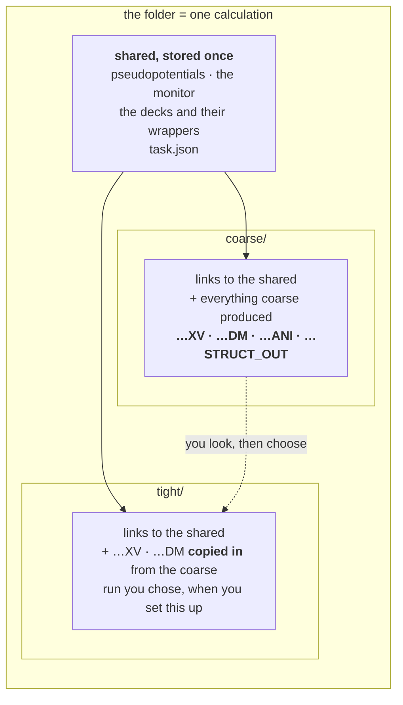
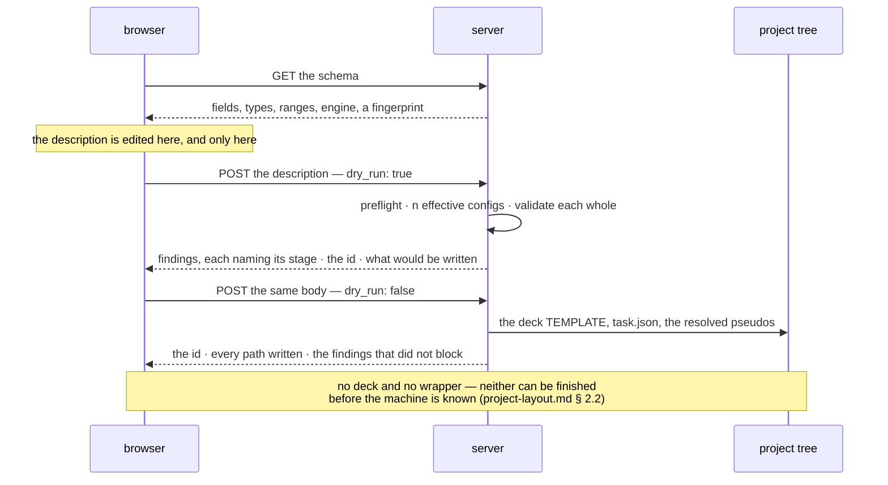

# Staged runs — one system, several parameter sets, one folder

**Role:** plan
**Domain:** web — **but the work it schedules is mostly not**. It began as the
backend behind one tab and grew into the plan for the whole staged-runs feature,
so its items now reach across three domains: `web/` (the tab, the routes),
`execution/` (the folder, the checkpoint module, the wrapper) and `engines/` (the
stage and its description). It stays here because the tab is what motivates it
and because moving it would break every inbound link; **read the domain label as
where the file lives, not as the boundary of what it covers.** The per-item
pointers below say which module each one touches.

**Companions:** the two contracts this plan exists to schedule —
[`engines/stages.md`](?doc=engines/stages.md) (what a stage is, the effective
config, `task.json`) and
[`execution/run-identity.md`](?doc=execution/run-identity.md) (the id, and the
engine parameters that decide whether a stage continues);
[`web/structure-optimization-ui-plan.md`](?doc=web/structure-optimization-ui-plan.md)
— the surface;
[`execution/job-contracts.md`](?doc=execution/job-contracts.md) +
[`execution/running-a-job.md`](?doc=execution/running-a-job.md) — the shipped
ground everything rests on.

**Status: a proposal.** Nothing here is built. This document holds the *why*, the
order of work, and the open questions. **It holds no durable decisions** — those
moved into the two contracts above, and where this plan and a contract disagree,
the contract wins (R3).

> **Reading the cross-references.** A bare `§ n` is a section of *this*
> document. A section of another document is always named with its file —
> `job-contracts.md § 2.3` — because several documents number their sections.

---

## 1. The one sentence

**A user describes one system and the parameter sets they mean to tune it
through; molbuilder writes one correct input file per set into one folder, where
they can be run, switched between, and continued from.**

**What this is not.** It is not an execution system. Nothing here submits a job,
chains one job to the next, or decides when the following thing runs. The
pipeline ends at correct files on disk. Running one is
[`running-a-job.md`](?doc=execution/running-a-job.md)'s job; having a scheduler
run several without you is [`job-system.md`](?doc=execution/job-system.md)'s,
reachable from here as an **export** (§ 7) and never as the destination.

---

## 2. Where the truth lives

Every layer below has exactly one document that decides it. **An implementer
reads that document, not this one.**

| Layer | Sole source of truth | What it fixes |
|---|---|---|
| what a stage is; the effective config; where a promoted field lands; `task.json` and its preflight | [`engines/stages.md`](?doc=engines/stages.md) | the model, the file, the merge, the three destinations |
| the run id, its normalisation, the folder name, the engine's identity group | [`execution/run-identity.md`](?doc=execution/run-identity.md) | what decides whether a calculation continues |
| the run directory, filenames, the stage suffix, reserved script blocks, warm files, the artifact registry | [`execution/job-contracts.md`](?doc=execution/job-contracts.md) | the on-disk shapes — **unchanged by this work** |
| the project tree: its four levels, who writes at each, how stages and benchmarks compose, where the history sits | [`execution/project-layout.md`](?doc=execution/project-layout.md) | the whole picture the rest of this plan sits inside |
| what a checkpoint history must always hold: the separations, the immutabilities, the atomicity rules | [`execution/checkpointing.md`](?doc=execution/checkpointing.md) | the invariants to review backend behaviour against |
| environments, activation, wrappers, `molbuilder.json`, watching a run, checkpoints | [`execution/running-a-job.md`](?doc=execution/running-a-job.md) | how a run actually happens. The environment half is **unchanged by this work** (§ 4); `running-a-job.md § 2.2a` is new — **what a wrapper may do**, and why everything else is Python |
| what *values* a stage should carry | [`engines/tuning.md`](?doc=engines/tuning.md) | the science of the dial |
| findings: their shape, their one renderer, what blocks | [`science/validation.md`](?doc=science/validation.md) | delivery — a stage label travels beside `where`, never inside it |
| the dependency chain, carry-forward, scheduler resources | [`execution/job-system.md`](?doc=execution/job-system.md) | the optional export (§ 7) |
| the panel, the stage table, the operations on it | [`structure-optimization-ui-plan.md`](?doc=web/structure-optimization-ui-plan.md) | the surface — still a plan, deliberately (§ 8) |

This plan owns only what is left: why the shape is this shape, the order the work
goes in, and what is still undecided.

**To see it whole rather than layer by layer**,
[`execution/worked-example.md`](?doc=execution/worked-example.md) follows one
molecule from a structure file to a published geometry — describe, generate,
benchmark, run, checkpoint, branch. It is where items 12b and 16–18 below came
from: five of the seven gaps it found are **joins between parts that each work**,
which is what a table of layers cannot show you.

**Three rules cut across every item below.** Stated once each, not repeated:

- **The wrapper activates an environment and execs an engine; every directory and
  every link is made by Python**
  ([`running-a-job.md`](?doc=execution/running-a-job.md) § 2.2a). The system was
  already built that way, and item 12a is where it drifted.
- **Stages do not chain** — each is set up and submitted on its own, after you
  have looked at the last ([`project-layout.md`](?doc=execution/project-layout.md)
  § 1.3). That is § 1 above taken literally.
- **The browser writes a portable package; the target machine finishes it**
  (`project-layout.md` § 2). Data files, a deck template, `task.json` and
  resource intent — none of it naming a machine. `prep`, on the machine that will
  run it, renders the deck and wrapper and builds the run directory, because
  `BlockSize` comes from the rank count and the eigensolver picks the conda
  environment: a deck finished on a laptop is guessing. **And `prep` is a hub you
  return to** — for a benchmark, for the real run using what it measured, for a
  redo, for the next stage — which is where the user does the joining.

---

## 3. Why a stage is ours, not the engine's

The reframe that produced the two contracts, in one paragraph, because everything
else follows from it.

**No engine has a concept of a stage.** SIESTA reads a `.fdf`; PySCF runs a
`.py`. Neither knows the file it was handed is the second of three. So a stage is
molbuilder's own device for holding the parameters a mission tunes over the
shared description of the system it does not — and it must resolve completely at
generate time, leaving an ordinary engine input behind (`engines/stages.md § 1`).

Three consequences shaped everything:

- **The stage object is tiny** — a name, an enabled flag, an overlay. The
  eight-field type shrank because two questions sort every field, and neither
  question asks where the field ends up (`engines/stages.md § 3`).
- **"Switch" and "continue" rest on one basename, not on one directory.**
  `job-contracts.md § 2.1` Rule 2 keeps the basename identical across stages,
  *"which is exactly what lets SIESTA pick up `<basename>.XV` / `.DM` from the
  previous stage."* Continuing is what the **engine** does; molbuilder makes the
  id right and puts the files where it will look (`run-identity.md § 1`). The
  *layout* that puts them there is a stage per subdirectory with the shared files
  above — `engines/stages.md § 7.1`, which is `job-system.md § 5.2`'s materializer
  reused rather than a second one. What stays outside is the **scheduling** half:
  edges, `dep_kind`, submission.
- **Correctness is the deliverable, not a step.** Two gates, both in
  `engines/stages.md`: the deck is complete and stands alone
  (`engines/stages.md § 7`), and every config that will be rendered gets the full
  findings pass — *validated as a resolved whole, never as a diff*
  (`engines/stages.md § 4`, R2).

### 3.1 The folder: common above, one subdirectory per stage



**Every stage keeps its own results.** That is the whole reason for the shape,
and it is the shipped `prep` layout (`job-system.md § 5.2`) reused rather than
reinvented: shared files stored once and linked in.

What differs from that layout is the **carry**. `prep` lays a link into the
producer's directory because it expects the whole chain to be submitted at once.
Here nothing is chained: you set up the tight stage *after* looking at coarse, so
the file you want is already sitting there and gets **copied in** — a real file,
put there when you chose it (`project-layout.md § 1.3`). Nothing points at a
result that does not exist yet, so nothing has to be repaired later.

A flat directory was the earlier answer here and it was wrong. A shared basename
does make continuing free — and it also means every stage overwrites the last.
Not only the restart files: `.ANI`, `.STRUCT_OUT`, `.EIG` and every other engine
output is keyed by `SystemLabel`, which is *identical* across stages by design.
Three stages flat leaves one set of results. For a framework whose point is
managing a mission across several parameter sets, that is a defect rather than a
trade (`engines/stages.md § 7.1`).

**The history is `molbuilder snapshot`, and it is explicit.**
`running-a-job.md § 6` already puts a run directory under git with the small
`.XV`/`.CG` tracked as text *"so a restore brings back a resumable state"* and
big binaries archived by content. `engines/stages.md § 7.3` names the two
boundaries that matter — before a replacing produce, and when a stage's run
finishes — and **`prep`, running interactively, asks at each of them**, showing
the message it would write. molbuilder never takes one on its own
(`checkpointing.md § 6`). A folder then stops being a state and becomes a chain
of states you can re-enter: branch at coarse, try a different tight, keep both.

Which is why **`snapshot branch` having no HTTP route** (`running-a-job.md § 6.2`)
is the most consequential gap in this design rather than a loose end, and why
`engines/stages.md § 7.4` has to change the checkpoint side: its archive globs
were written flat (`*.DM`), and in this layout the big binaries are one level
down, where those patterns do not reach.

## 4. The environment: nothing here changes it

The execution domain already defines how a job finds its software, for
workstations and for HPC alike, and **this work re-invents none of it.** Stated
once so no reader has to guess, every line citing
[`running-a-job.md`](?doc=execution/running-a-job.md):

| Assumption | Where it is fixed |
|---|---|
| **molbuilder is installed on the machine that generates.** It is not needed on the compute node | `running-a-job.md § 2` — the wrapper is self-contained *at run time* |
| **Everything site-specific is baked at generate/prep.** At run time the wrapper may read only the allocation and the hardware, and only to tune the launch | `running-a-job.md § 2.1` — the T/M/C/A/H rule |
| **The activation form comes from config and has no default.** `script_generation.activation` is `conda activate` or `source activate`; `preamble` carries the `module load` lines. Generating an HPC wrapper **refuses** without an activation | `running-a-job.md § 5.2` |
| **Config is `molbuilder.json` (cwd, then the XDG fallback) plus a project `.molbuilder.json`; project wins** | `running-a-job.md § 5.1` |
| **Environment names are configurable per category** — the four defaults are defaults, not facts. Nothing may hard-code one | `running-a-job.md § 5.4` (`envs`) and `running-a-job.md § 2.3` |
| **Routing is by the script's own content.** A `.fdf` asking for ELPA or GPU routes to the GPU build; a missing environment raises at generate with an install hint | `running-a-job.md § 2.3` |
| **`.sbatch` is emitted only when a `scheduler` block is configured.** A workstation gets `.run.sh` and runs it directly | `running-a-job.md § 5.3` |
| **The doctor verifies and never installs** | `running-a-job.md § 2.2` |

**What this framework adds is exactly one thing:** a folder holds *several*
decks, so it holds several wrappers, and each is routed by its own deck's content
(`engines/stages.md § 5.1`). A coarse stage on ScaLAPACK and a tight stage on
ELPA-GPU activate different environments in the same folder, and nothing in the
machinery above has to change for that to work.

**Two implications, because they are gates rather than conveniences:**

- **The deck is portable; the wrapper is baked.** A deck runs on any machine that
  has the engine. A wrapper carries one target's activation, which is why
  generation happens where that target's config is known.
- **A stage that asks for an absent environment refuses the whole generate — but
  it refuses late.** The install-hint raise (`running-a-job.md § 2.3`) belongs to
  *wrapper* generation, which happens after the decks are rendered, so the failure
  arrives with files already made. That is why the produce is transactional:
  built elsewhere, moved into place only when every part succeeded
  (`engines/stages.md § 7.2`). A folder that is only partly runnable is worse than
  one that was not written.

---

## 5. The two sides, and what crosses

### 5.1 The boundary, as a rule

| | Owns | May **not** |
|---|---|---|
| **the browser** | the description while it is edited: values, which fields vary, the stages and their order | render a deck, resolve a pseudopotential, compute a cell, install a wrapper, read or write the project tree, decide an id's final form |
| **the server** | turning a description into effective configs, validating them, resolving structure and pseudos, computing the cell, writing the folder and its wrappers | hold description state between requests, or invent a value the description did not carry |

**The browser decides what is wanted; the server decides what that means and
whether it can be done correctly.** Neither guesses on the other's behalf — which
is why the description travels whole rather than as a diff, and why nothing the
server derives is sent back for the browser to store.

**One prerequisite falls out of that boundary and belongs to neither side.** A
description *points at* a structure in the tree (`engines/stages.md § 6.3`), so
the structure has to be in the tree before a description can name it. A geometry
the user just loaded from their disk, or edited in the viewer, is not — it lives
in the workspace. Saving it into `projects/<project>/structure/` is therefore a
step of this workflow, not a thing that happens to have happened already, and the
tab has to be able to say so rather than failing at produce with a path that does
not resolve.

The id is the case that tests the rule. `run-identity.md § 3` puts one normaliser
in the system, and it is the server's — so **the tab shows the id the last check
returned**, and an edit that would change it marks it stale until the next check
clears it. The browser displays and invalidates; it never normalises.

### 5.2 What crosses



**One route, one flag.** Check and produce take the identical body, so they are
the same route with `dry_run` — the CLI's idiom already
(`jobset submit --dry-run`) — which makes it impossible for a description that
checks clean to then fail to produce.

**And a fourth exchange, which the design has been assuming without naming:
reopening.** `engines/stages.md § 6.2` justifies `varies` on the grounds that
intent *"cannot be inferred"* from anything downstream — which is only worth
anything if a description can be read back into the tab. So there is a **GET**
that returns a stored `task.json` for a folder, and the tab restores the values,
the promoted set, the stages and their order from it. Without it the file is
written and never read by the surface that wrote it, and `varies` is a field whose
only reader is a future nobody scheduled.

Two rules it inherits rather than invents: the reopened description goes through
the same preflight (`engines/stages.md § 6.6`), because a file that has sat on
disk is exactly the one whose schema may have moved; and the id is **not**
recomputed — it is read (`run-identity.md § 3`, rule 1), or reopening a folder
would rename it.

```jsonc
{
  "ok": true,
  "id": "BDT_Au_relax_Au38C6H4S2",
  "written": { "folder":      "projects/BDT-Au/optimization/BDT_Au_relax_Au38C6H4S2/",
               "template":    "…/BDT_Au_relax_Au38C6H4S2.fdf.template",
               "description": "…/task.json",
               "data":        ["Au.psml", "S.psml", "C.psml", "H.psml"] },
  "findings": [ /* warnings that did not block, each naming its stage */ ]
}
```

The paths come back because the browser cannot know them: the id's final form and
the tree's layout are both the server's. A refusal is the same shape with
`ok: false` and the findings that caused it — never a bare error string, because
a preflight that names a field is worth nothing if the surface cannot show which
field.

---

## 6. The decision chain — who dictates what, in order

Overlap between modules is fine. A **loop** is not: if two parties can each
overrule the other, nobody can predict the outcome and nobody can test it. So the
whole system is one sequence, and the rule that keeps it one is:

> **Each step decides within what the steps above it already fixed, and nothing
> later rewrites something earlier.**

| # | Who decides | What it fixes | Fixed by |
|---|---|---|---|
| 1 | the **project tree** | where anything may live: the nine topics, `[A-Za-z0-9_-]+` per segment | `job-contracts.md § 2.5` |
| 2 | the **structure** | which atoms exist — an input, never edited by the generator | `model/structure.md` |
| 3 | **2 + the user's name**, within 1's character set | the **id**, normalised once and then quoted by everything after | `run-identity.md § 2–3` |
| 4 | the **schema** | which fields exist, their types, ranges and `engine_key`s | `web/form-schema.md` |
| 5 | the **description** | values, which fields vary, the stages and their order | `engines/stages.md § 6` |
| 6 | the **preflight** | whether this file can be read here at all | `engines/stages.md § 6.5` |
| 7 | **validation** | whether it may be written: `error` blocks, per stage, on the resolved whole | `science/validation.md` |
| 8 | the **generator** | the decks and their wrappers — the merge, the cell, the pseudos, the identity group, BENCH-MARKS | `engines/stages.md § 7` |
| 9 | the **target's config** | the wrapper's shell: preamble and activation — and generation refuses without an activation, which has no default | `running-a-job.md § 5.2` |
| 10 | the **user** | which deck to run, and when | — this is the point of the framework |
| 11 | the **wrapper**, at run time | ranks, threads, GPU pinning, the run index, the restart banner | `running-a-job.md § 3` |
| 12 | the **engine** | whether warm files are honoured, given those parameters | `job-contracts.md § 4` |

Read it downward and the entanglements disappear:

- **The browser lives entirely in rows 3–5.** That is why § 5.1 can say it never
  renders a deck or computes a cell — those are row 8.
- **The id is fixed at row 3 and quoted by everything after.** No later step
  derives it again, which is why normalising once is a rule rather than an
  optimisation.
- **Row 10 is a person, and that is deliberate.** Every earlier row exists to
  make row 10's choice safe; none of them makes it.
- **Nothing in rows 1–8 knows what a cluster is.** Target isolation is not a
  policy anyone has to remember; it falls out of where row 9 sits.

Rows 6 and 7 both refuse things, and both belong — one asks *can this file be
read here at all*, the other *is this a sound calculation*. They are ordered, so
a description aimed at an engine this backend does not have never receives a
lecture about its mesh cutoff.

---

## 7. Exporting to a scheduler — optional, and downstream

Some day a user will want a scheduler to run the decks in order without being
asked twice, and that framework ships: `job-system.md`'s `stages_to_jobset` turns
a staged config into a ladder, and `prep` / `plan` / `submit` / `status` run it.

**It is an export, not a destination**, and the difference is what it needs that
this framework does not:

| The export needs | Where it comes from |
|---|---|
| `on_nonconvergence` per stage | **only the export.** It becomes the scheduler edge — `proceed → afterany`, `halt → afterok` — and there is no edge without a scheduler (`engines/stages.md § 3`) |
| `Job.carry` per stage | **already in the layout.** Carry is a *layout* mechanism, not a scheduling one — § 3.1 uses it — so the export inherits it rather than asking for it (`engines/stages.md § 7.1`) |
| `Job.resources` per stage | **already in the description.** The export applies the translation `job-contracts.md § 6.2` already fixes, at its own boundary |

Only the first describes *having something else run it* rather than the
calculation, and it is the only thing the export has to ask for. The other two
are already here — carry because the layout needs it whether or not a scheduler
exists, resources because they change the deck (`engines/stages.md § 5`). The
export threads edges through a tree this framework already built.

Two facts to carry forward when it is built:

- **The hierarchy is the flat shape nested, not a rival to it.**
  `job-contracts.md § 2.5`'s `<structure>/` and `job-system.md § 5.2`'s
  `point-<name>/` tree are the same layout at two levels: each leaf is the
  one-job-per-directory shape `job-contracts.md § 2.1` describes, and the tree is
  a directory *of* those. `project-layout.md § 1` makes the choice between them
  explicit; nothing about the export changes which one you are in. This framework
  and the export produce the same tree — the export adds edges to it.
- **`JobSet.name` should be the id**, and the submitter's `-J` should carry it.
  Today a ladder's scheduler name is the bare stage name
  (`job-contracts.md § 6.3`), so three concurrent ladders show
  `coarse coarse coarse` in `squeue`.

---

## 8. The work, item by item

> **The *order* moved out of this section on 2026-08-07.** It lives in
> [`execution/staged-runs-implementation-plan.md`](?doc=execution/staged-runs-implementation-plan.md)
> — the phases, the milestones, the gates, and the three reviews at each one.
> **What stays here is each item's *"Done when:"* sentence**, which the plan
> cites rather than copies, and the audit evidence in § 8a–8b that produced the
> items. Read this section to know *what an item is and when it is finished*;
> read the plan to know *when it gets built and how it is checked*.

**Step 1 — the two contracts.** Done: [`engines/stages.md`](?doc=engines/stages.md)
and [`execution/run-identity.md`](?doc=execution/run-identity.md). What remains
is agreeing them and answering § 9.

**Step 1a — the repo-scope blocker.** ~~`Repo.init` refuses a directory whose
subdirectories hold a working-dir marker, and the staged layout is exactly such a
directory~~ — **fixed 2026-08-06** (`execution/checkpointing.md` L1). A root
carrying its description (`task.json`, `job-set.json`, `bench-manifest.json`)
now owns its subdirectories; a directory declaring nothing is still refused, and
a subdirectory that is already a repository is refused in either case. The fix
also unblocked something already shipped: `jobset prep` bundles had never been
checkpointable. Eight tests in `tests/test_checkpoint_repo_scope.py`, including a
hierarchical round-trip — init, checkpoint, change a later stage, restore, and
the first stage's `.DM` two levels down comes back.

**Step 1b — the questions that gate code, in one place.** These are decisions
rather than research, and each names what it holds up:

| # | Question | Where | Blocks |
|---|---|---|---|
| 1 | ~~**The command shapes**~~ — **decided 2026-08-07**, step 1c. One group (`jobset`), one grammar (`<verb> <kind> [<stage>]`), and `molbuilder bench` folds in | step 1c below | ~~12a~~ — unblocked |
| 2 | ~~**How you ask for the shape**~~ — **decided 2026-08-07: a required field in the description**, never inferred, fixed once the calculation has produced. A shape chosen at the first `prep` and not written down is one the second `prep` cannot know | `engines/stages.md § 6.7` | ~~12b, 12d~~ — unblocked |
| 3 | **Is `task.json` the right name**, and **is the folder named by the id** | § 9 q1–q2 | 6, 8 |

**One was fixed rather than decided, one is answered, and one is left.** The
repo-scope blocker that used to lead this table was **fixed** (step 1a).
Question 1 was *what is the entry point at all* until `project-layout.md § 2`
answered it; what is left is how it is spelled (step 1c). Question 2 — how a
user asks for the shape — was, for a day, the single decision holding up five
items; it is answered, and the answer is the smallest one available: **the
description carries it**, because the description is the one artifact every
`prep` reads.

**None of them blocked the checkpoint work, and that work is now done.** Items 10
and 15 are complete, and item 11's two buildable parts landed on 2026-08-06 — the
naming and `branch` over HTTP. What is left of 11 needs the producer, not a
decision. Items 10a, 12c, 14 and 14a are unblocked cleanup found by the
2026-08-07 cross-check and can be taken in any order — they are Track Z of the
implementation plan.

**Step 1c — the commands, which fall out of the workflow.**
`project-layout.md` § 2 puts the boundary between what a laptop can know and what
only the target machine can. The browser writes a **portable package** — data
files, a deck template, `task.json`, resource intent, and nothing that names a
machine. Everything after that is `prep` on the target, and `prep` is a **hub you
return to**, not step four of a line.

| | Command | Status |
|---|---|---|
| write the portable package | `molbuilder jobset describe` | **new** — the verb `stages.md § 6.4`'s *one producer for both surfaces* requires, finally named |
| **prep a benchmark** for a stage | `molbuilder jobset prep bench <stage>` | absorbs `bench generate` + `bench prep` |
| **run it** | `molbuilder jobset submit bench <stage>` | `submit` ships; the grammar is new |
| **read the timings** | `molbuilder jobset summarize bench <stage>` | absorbs `bench summarize` |
| **prep the real run** | `molbuilder jobset prep run <stage>` | absorbs `bench prep-run`; **asks** whether to use the stage's benchmark verdict |
| **prep a redo / the next stage** | `molbuilder jobset prep run <stage> --from <run>` | new |
| run it | `molbuilder jobset submit run <stage> --mode direct\|submit` | `submit` ships |
| look | `molbuilder jobset status [<stage>]` · `molbuilder snapshot …` | ship |

**One group, one grammar: `jobset <verb> <kind> [<stage>]`.** `describe` and
`status` take no kind, because they are about the calculation rather than one run
of it. Everything else names the verb, then what is being prepped or submitted,
then which stage.

**`bench` stops being a top-level group**, and that is the point rather than a
side effect. Four of its six verbs fold into the table above — and one of them,
`bench prep-run` (*"bench-result.json → production run-script for this machine"*),
**is `jobset prep run` written a second time**. Two names for one act is what the
old split cost. `probe-scheduler` is a config helper rather than part of this
loop and stays outside it; `siesta-gpu` needs its own decision.

**Why the kind is a positional and not `--bench`.** A flag makes benchmarking a
*modifier* of the real thing. It is not: `prep bench` and `prep run` are peers,
because measuring and running are the same act over different parameters
(`project-layout.md § 2.3.1a`). The grammar should say so.

**`summarize` is a verb of its own** because it *writes a file* — the verdict —
and because you are meant to read that verdict and decide. Folding it into
`status` would make it a display; it is a step.

**`prep run` asks rather than reading the verdict silently.** A benchmark lives
inside the stage it measured, so prep can always *find* one — but finding is not
permission. It says a verdict exists and waits, the same way it asks before
changing a directory that already holds results (`checkpointing.md § 6`).
Explicit over implicit, every time.

**Those four preps are one command because they are one act** — *assemble a
runnable directory from a template, a source of earlier results, and this
machine's resolved parameters*. `--from run-0` and `--from 01_coarse/run-0` are
the same instruction pointing at different directories; `--bench-result` is the
same kind of input as `--from`, carrying numbers instead of a geometry. Four
commands would be four spellings of one thing.

What `prep` does that nothing does today: **render the stage's deck**, because
`BlockSize` comes from the rank count and the eigensolver picks the conda
environment, so the deck is not finishable until the machine is known
(`project-layout.md § 2.2`). `bench prep` already has this shape — detect the
target, write `environment.json`, format the scripts for it — and the staged path
should use it rather than growing a second one.

A session, from inside the calculation folder on the target:

```
molbuilder jobset prep bench tight            # measure first
molbuilder jobset submit tight --mode direct
molbuilder bench summarize --bundle 02_tight/bench

molbuilder jobset prep run tight \
                            --from 01_coarse/run-0
    reading from 01_coarse/run-0  (finished, converged)
    resources  elpa · G=1 K=4 C=6 · mem 96G     (measured here, 2026-08-06)
    02_tight/<id>.fdf   rendered   BlockSize 256, Diag.Algorithm elpa
    02_tight/run-0/     ready      copied in: <id>.XV  <id>.DM
molbuilder jobset submit tight --mode submit --domain public
```

**Prep printing what it resolved is what makes submit a plain yes** — and it is
the only place the measured numbers, the chosen geometry and the rendered deck
appear together, which is exactly where a person should be looking.

**Three shapes still open**, all cosmetic:

1. **Stage as the positional** (`jobset prep tight`, folder defaults to cwd), or
   folder positional with `--stage`? Pre-1.0, so changing it is allowed.
2. **`jobset`, or promote `prep` to top level?** It is no longer really about job
   *sets* — it is the one verb of the execution loop, and `molbuilder prep tight`
   reads like what it is. Against: `jobset` also serves benchmark sweeps, and a
   second surface over one mechanism is duplication.
3. **`molbuilder run` does not run** — it writes a wrapper, which `prep` now
   subsumes for staged calculations. It stays for the flat single-job path, but
   the name will confuse someone.

**Step 2 — the backend, built to those contracts.**

1. **Settle which of the duplicated fields wins today.** `relax_force_tol` and
   `relax_max_displ` sit on the shared config *and* on the stage spec. *Done
   when:* a test says which value a staged render uses when the two disagree —
   because that is the behaviour anyone relying on it has already built on.
2. **The stage spec shrinks to three fields** (`engines/stages.md § 2–3`). Five
   of the eight become ordinary shared-config fields — the four relaxation values
   plus `continue_retries`, routed to the wrapper-install surface that already
   honours it. `on_nonconvergence` moves to the JobSet producer's own input.
   *Done when:* a stage with no overrides renders exactly what it renders today,
   no field of the shared schema has a second home, a per-stage
   `continue_retries` reaches that stage's wrapper, and the ladder producer still
   derives the same edges.

   ⚠ **`continue_retries` is not merely unrouted — it is silently dropped, and
   everything upstream validates** (found 2026-08-07, § 8a D). The field is on
   `SiestaStageSpec`, defaults to 1 and is range-checked 1..5
   (`config/siesta.py:1304, :1401`), and `runwrap.py` **does** implement the
   SIESTA retry loop. But `stages_to_jobset` never reads the field, `Resources`
   has no slot for it, and `prep_jobset` never passes it — so on the ladder path
   every stage renders with no retry loop and **nothing reports the loss**. Set
   three retries on the tight stage; the form accepts it, the description
   round-trips it, and the run gets none. So the routing has a prerequisite:
   `Resources` must be able to carry it, or a stage needs a different road to its
   wrapper. *Also done when:* a stage asking for retries renders a wrapper that
   has them, asserted on the rendered text rather than on the object.
2a. **Retire the redundant ways to say "stage" — the subtraction this plan was
   missing** (§ 8b). Nine mechanisms exist; this design adds a tenth and the plan
   retired none. Each is listed with a proposed disposition, because *"keep it,
   it is still useful"* is how nine happened:

   | Mechanism | Proposal |
   |---|---|
   | `--stage N` overlay + `SIESTA_STAGE_PRESETS` | **keep the presets, retire the flag.** The tier *values* are real science (`tuning.md § 2.3.1`) and become the defaults a new stage is created with; the one-shot flag is `task.json` with one stage |
   | `--stage-strategy` | **retire.** A named set of enable flags is three lines of a description |
   | `--stages-json` | **becomes** `task.json` (item 6) |
   | `--stage-resources` | **folds into** `task.json` |
   | `SiestaStageSpec` | **deleted** (item 2, corrected 2026-08-07) — the stage list moves to `task.json`; an engine config is one parameter set |
   | flat `render_siesta_stage_fdfs` + `..._runner` | **the runner goes** (12f); the deck renderer stays, rendering from the effective config |
   | `stages_to_jobset` | **stays**, minus the inter-stage edges (12b) |
   | PySCF `StageSpec` | **stays as it is.** PySCF's ladder runs inside one process, so it is genuinely a different shape — `stages.md` already says so. It should read the same description, not the same runner |
   | the browser's `p-stage-preset` → a number | **retire the number** (item 2b) |

   *Done when:* one description format, one model, one deck renderer, one
   producer per shape — and `grep -rn "stage" molbuilder/` reads like one idea
   rather than nine.
   ⛔ Gated by 6 and 3: nothing can be retired until the thing replacing it can
   express what it expressed.
2b. **A stage's position must stop reaching filenames** (§ 8b). The browser writes
   `<label>-stage<N>.fdf`, with N from a preset dropdown — and it *already has
   names*, because the presets are literally *coarse*, *medium* and *tight*. It
   throws them away in favour of the position, which `stages.md` forbids for a
   concrete reason: insert a stage and every later file silently renames, so
   outputs that already exist are reassigned to a stage that did not produce
   them.
   There is a second half. Three conventions are live at once — the flat ladder
   writes `bdt_au_coarse.fdf`/`.out` (`_` + name), the browser writes
   `bdt_au-stage1.fdf` (`-stage` + number), and `trajectory_log/format.py` writes
   `bdt_au-stage1.molwatch.log` (`-stage` + number). **So in a ladder run a
   stage's deck and its own log cannot be matched by name.**
   *Done when:* one convention, keyed on the **name**, used by the deck, the
   output and the log; and inserting a stage renames nothing that already exists.
3. **`overrides` and the effective-config merge** (`engines/stages.md § 4`).
   *Done when:* a stage with `{mesh_cutoff: 300}` renders a deck carrying 300
   while the shared config still says 150, and the object validated is the object
   rendered.

   ⚠ **`overrides` does not exist in any form today** (found 2026-08-07, § 8b) —
   this is not a widening of something partial. A stage can vary exactly four
   values, and they are not a mechanism but a literal `dataclasses.replace` in
   `render_siesta_stage_fdfs`:
   ```python
   staged_cfg = dataclasses.replace(cfg,
       relax_type=stage.relax_type, relax_steps=stage.relax_steps,
       relax_force_tol=stage.relax_force_tol,
       relax_max_displ=stage.relax_max_displ)
   ```
   So `mesh_cutoff: 300` on a stage has **nowhere to be written and nothing that
   would read it**. That is also why the plan's gate between step 2 and step 3
   matters as much as it does: *the backend must be able to render a stage that
   overrides a parameter the stage type never carried* — today it cannot render
   one that overrides anything but those four.
4. **`restart` and the engine identity group** (`run-identity.md § 4`). *Done
   when:* a two-stage description whose second stage continues renders every
   bound parameter set, and a stage set to `clean` renders none — asserted
   together, since the failure mode is that they disagree — **and** the group is
   written down beside the warm files it governs, which is `job-contracts.md § 4`
   and therefore a doc change in the same commit as the code (`§ 7` there).
5. **Resource-shaped overrides reach all three destinations**
   (`engines/stages.md § 5`). *Done when:* a description asking for ScaLAPACK
   then ELPA renders two decks whose solver differs **and** two wrappers
   activating different environments; and a stage varying `mpi_np` renders a deck
   whose `BlockSize` came from *that* stage's rank count, with BENCH-MARKS
   declaring it.
6. **`task.json`, its reader, and the preflight** (`engines/stages.md § 6`).

   ⚠ **This is a replacement, not an addition** (found 2026-08-07, § 8b). Two
   files already ship for this job: **`--stages-json`** (the whole ladder, a JSON
   list-of-dicts, accepted as a literal *or a path*) and **`--stage-resources`**
   (`{stage_name: {…}}`, the per-stage scheduler asks). So item 6 is *fold two
   files into one and reverse their unknown-key rule* — `--stages-json`'s help
   says **"Unknown keys ignored"**, and the design says **refused**. Pre-1.0 that
   is a clean break, not a migration. The new file must also carry the two things
   neither of the old ones can: **which directory shape** the calculation uses,
   and a per-stage `continue_retries` that reaches the wrapper (item 2).
   Note also that `checkpoint.py`'s `_is_bundle_root` **already looks for
   `task.json`** and finds nothing, because no producer writes one — that arm
   stays dead until this item lands.

   *Done when:* a description round-trips — read, rendered, re-read — one naming
   a dead field fails with that field's name, one with a repeated stage name fails
   naming the repeat, and the artifact registry (`job-contracts.md § 6.1`) has its
   row. **One reader, used by both surfaces** (`engines/stages.md § 6.4`) — that
   is what makes item 8's byte comparison meaningful rather than a coincidence.
7. **Validation, per stage and across them** (`engines/stages.md § 4`). *Done
   when:* a description whose coarse stage is under-converged reports against
   `coarse` alone, through the one renderer, with the stage beside `where` — and a
   ladder that *loosens* between stages reports once, with **no** stage label,
   because that is a fact about the sequence rather than about a member of it
   (R3).
8. **The route, both directions.** *Done when:* a description posted to it writes
   the same bytes the CLI writes for the same stages — compared file by file,
   **excluding PROVENANCE's `generated-at`**, which stamps generation time
   (`job-contracts.md § 3.2`) and so differs between any two produces; that is the
   only legitimate exclusion. The folder holds a **runnable wrapper per deck**, not
   decks alone, and a **GET returns a written description** such that reopening it
   and producing again yields the identical folder (§ 5.2).
9. **The second surface.** "One reader for both" (`engines/stages.md § 6.4`) needs
   a CLI verb that writes and consumes a description, or item 8's byte comparison
   has nothing to compare against. *Done when:* the same description produces the
   same folder from a terminal and from the browser, and neither path has a
   renderer the other lacks.
10. ~~**Archive only what is new**~~ — **done (2026-08-06)**,
    `checkpointing.md` L5. Content already in the archive is **hard-linked**
    rather than copied, so a checkpoint of unchanged binaries costs no disk: the
    test that pins it went from 800 KB of growth to under 10 KB on the same
    fixture. Nothing downstream changed — the archive still holds a real file at
    `<sha>/<key>`, so restore, verify and the MANIFEST format are untouched and
    no existing archive needs migrating. **Reuse is by content**, which is what
    makes one mechanism serve both directory shapes: a hierarchical attempt is
    immutable and links forever, a flat `<id>.DM` overwritten each stage
    genuinely differs and is copied. Three guard tests stop the cure being worse
    than the disease — a changed binary is stored again, two checkpoints never
    alias different content, and a rotted candidate is copied past rather than
    linked to. The shipped guide's *"deduped by content"* is now true rather
    than aspirational. **Still open: `snapshot verify`** (L6) — the check exists
    and is reachable only by attempting a restore.
10a. **A display prints a number that is not true** — small, and smaller than an
    earlier draft of this item claimed. `archive_bytes` and `archive_total_bytes`
    sum file sizes, counting every hard link in full, so ten checkpoints of an
    unchanged 2 GB binary read as 20 GB while the disk holds 2.
    **Who needs the number?** Nobody anyone could name. It appears in five places
    — three CLI lines, two in the sidebar — and feeds no decision: the only one it
    could feed is *"delete some old checkpoints"*, and there is **no `prune`
    verb**. *Done when:* it stops claiming what it cannot support — either drop
    the display, or make the repository total count each inode once so it matches
    `du`. **Not** the two-number scheme this item used to propose (a *logical*
    per-checkpoint size and a *physical* folder total, each with its own
    explanation); that was inventing vocabulary for a readout nobody reads.
    ⚠ Two older faults to fix if this is touched at all: the wire field
    `archive_total_bytes` in `_serialise_state` is **structurally always zero**
    (`state()` leaves it at its default and nothing on the frontend reads it), and
    `missing_archive_warning` names `.DM/.HSX/.TSHS` whatever the engine, so a
    PySCF repository is warned about files it never had.
11. **Checkpoints at the two stage boundaries, and `branch` over HTTP.**
    **Two of the four parts are done (2026-08-06); the two that remain are the
    triggers, and they are the part that needs the producer.**

    ✅ **The naming.** `checkpoint_message()` and `stage_completion_tag()` in
    `checkpoint.py` produce `<id> · <stage> · <what happened>` and
    `<id>/<stage>/<UTC>`, matching `engines/stages.md § 7.3`'s worked examples
    byte for byte — the document's own strings are the test fixture, so the two
    cannot drift. Names are **refused rather than normalised**, tags are
    hierarchical and sort oldest-to-newest under
    `git tag --list '<id>/tight/*'` (asserted against real git), a collision
    inside one second is refused, and a hand-made tag is not mistaken for an
    automatic one. `checkpointing.md` L3/L4.

    ✅ **`branch` over HTTP.** `POST /api/checkpoint/branch` — the CLI has had
    `Repo.branch` since Phase 4, so the browser was the only surface that could
    tell you a stage finished and not let you fork from it. An existing name is
    a **bucket-B advisory** (HTTP 200 + `ok:false`, `where: "name"`), because the
    user picked it and can pick another; uncommitted work carries onto the
    branch, which is git's default and what lets someone branch mid-edit.

    ⬜ **The prompt** (was "the triggers" — **user decision 2026-08-07**, and it
    is a subtraction). A checkpoint stays an **explicit act**; molbuilder never
    takes one on its own. What it gains is a **question at interactive `prep`**,
    when prep is about to change a directory that already holds results — with
    the message it would write, and the tag if a stage finished. Never at run or
    submit time: that may be a scheduled job, and blocking a queue to ask is the
    wrong party at the wrong moment. Non-interactive prep proceeds without one
    and **says so**.
    This **deletes** the hard part rather than solving it. The old wording needed
    something to *observe* a run finishing, which is unachievable on a cluster —
    the job ends at 3am with nothing local watching. Asking at the next prep needs
    no observer, because a finished run's state stays intact until prep touches
    it, which is exactly when the question is asked
    (`checkpointing.md § 6`). Still needs `task.json` and the producer, but
    for the *message* — knowing which stage, and how the run went — not for a
    trigger.

    ⬜ **The branch-name proposal.** `stages.md § 7.3` proposes
    `<stage>-<what you are trying>`, editable. That is the tab's to offer; the
    route deliberately takes the name it is given and only refuses a bad one
    clearly.

11a. **A checkpoint before each stage, in the flat shape, is not the same
    feature.** Item 11 is about a *staged* folder's history. The flat
    shape needs the same trigger for a different reason: it is the **only** way
    back to a previous state, because each stage overwrites the last's warm files
    (`checkpointing.md § 5.1`). A missed checkpoint there is not a thinner history
    — it is a state that no longer exists anywhere. *Done when:* the same
    boundary that triggers a checkpoint in a staged folder triggers one in a flat
    one, and the surface says plainly that this is the save point rather than
    housekeeping.
12. **The archive covers runs, not containers**
    (`execution/project-layout.md` § 6.1). Every directory is one or the other,
    so the classification is positional and needs no marker file: a flat root or
    a stage's `run-N/` is archived; a benchmark's `point-*/`, two levels down, is
    not. *Done when:* a produced folder with a bench bundle archives the stage's
    results and none of the trials', and the rule is depth rather than a name.
12a. **One run directory per attempt — built in the wrong layer, and being
    moved.** `render_run_wrapper(..., attempt_dirs=True)` (2026-08-06) resolves
    the attempt, creates `run-<n>/`, links inputs, copies warm state and cds in —
    all in shell, inside the wrapper. That is `jobset/materialize.py` written a
    second time in bash, one level down, in the layer that
    [`running-a-job.md`](?doc=execution/running-a-job.md) § 2.2a keeps free of
    filesystem logic. **It is retired, not extended.** The behaviour it
    established is right and stays: an attempt per invocation, immutable once
    written, inputs linked, the previous attempt's warm state copied, `--force`
    gone. Only the address changes. Its eleven tests move with it — they assert
    *outcomes on disk*, so most survive re-pointing at the Python entry point
    rather than at rendered bash, and the two that assert wrapper text retire
    with the block.

    ✅ **And it is the only thing in the system that breaks a rule everything
    else holds** (2026-08-07). Both launchers put the engine in its directory the
    same way — the workstation path runs `.run.sh` with the working directory set
    to the job's, the SLURM path runs `sbatch` from it so the job lands in
    `SLURM_SUBMIT_DIR` — and **neither the wrapper nor the engine ever
    navigates**. The generated wrapper states it in its own header: *"this wrapper
    does NOT change cwd… the caller's cwd is the contract."* This block `cd`s into
    an attempt it created, which is that rule broken in exactly one place. So
    retiring it is not tidying — **it restores an invariant the rest of the system
    already keeps** (`job-contracts.md § 2.1`).

    ✅ **Nothing calls it** (verified 2026-08-07). `attempt_dirs` defaults to
    `False` and **no production caller passes `True`** — the only callers are its
    own eleven tests. So the ~130 lines of generated bash are dead in every folder
    a user has, and retiring them cannot regress a shipped path. That does not
    make the gate below moot: the gate is about what replaces the *capability*,
    not about protecting the current callers, of which there are none.

    ⛔ **Gated, and this is the sequencing that matters:** retiring the block
    removes the only way to run a stage by hand, and nothing replaces it yet.
    `project-layout.md` § 8 question 4 — what the entry point is, and where
    `--cold` goes once it stops being a wrapper flag — **must be answered first**,
    or this step breaks the manual path with nothing behind it. Answer, then
    12b, then this.
12b. **Attempt resolution moves into submit — and the chain goes away.**
    ⚠ The regression that exposed all of this: `materialize` writes a stage's
    carry as a symlink to `../<producer>/<id>.XV`, which is where a stage's
    output lived until 12a moved it into `run-N/`. But the fix is not a better
    link. **Stages do not chain**
    ([`project-layout.md`](?doc=execution/project-layout.md) § 1.3, and § 1 of
    this plan, which said so from the start and which I drifted from): each stage
    is set up and submitted on its own, after the user has looked at the previous
    one. A stage is a long job, and a chain that continues by itself can spend a
    week computing from a geometry you would have rejected in a minute.
    ⚠ **Widened 2026-08-07 — there are TWO chaining producers, not one** (§ 8a B).
    This item was written against `stages_to_jobset` alone. The flat path chains
    too, and more tightly: `render_siesta_stages_runner` emits a bash `for` loop
    that runs every stage back to back **in one invocation**, with no pause and no
    separate submission. That is the path the web UI ships today, so removing only
    the JobSet edges would leave the rejected behaviour standing in the more
    common case. **The rule reaches both producers or it has not landed.**

    So `stages_to_jobset` stops emitting `depends_on` and `Carry` edges between
    stages, **and the flat runner stops being a ladder driver** — it runs the one
    stage it was asked for. When you set up the next stage, **the run it continues from has
    already finished** — you just looked at it and named it — so its files are
    **copied in, for real, then**. Nothing points at a file that does not exist;
    nothing has to be swapped at run time; `carry_deref` is no longer part of
    this story (it stays for the chained ladder `jobset` can still build).
    `submit` resolves **one** attempt for the stage it is starting: next unused
    number, create, link the deck and package, copy what was named, launch there.
    **Gap 6 rides along** — `materialize.job_dir_name` returns `point-<name>` for
    every job and must branch on `JobSet.kind` (`project-layout.md § 4.4`).
    *Done when:* setting up the tight stage against a named coarse run puts real
    files in its attempt, not links; the stage directories are
    `01_<name>`/`02_<name>` while a benchmark's points still read `point-*`; no
    stage job carries a `depends_on`; and no directory in a produced tree
    contains a dangling symlink.
12c. **One warm-file inventory per engine, not two** (found 2026-08-07 — and the
    finding is a comment of mine that says the opposite of what the code does).
    `_SIESTA_WARM_SUFFIXES` was added on this branch with the note *"the SAME
    inventory the `--cold` move-aside covers — one list, so a new warm hook cannot
    be carried without also being moved aside, or vice versa."* It is not one
    list. `_cold_restart_aside_block` keeps its own hardcoded copy, and so does
    the PySCF branch beside `_PYSCF_WARM_FILES`:

    | Engine | Carried into the next attempt | Moved aside on `--cold` |
    |---|---|---|
    | SIESTA | `_SIESTA_WARM_SUFFIXES` — 13 suffixes | `exts = ("DM", "CG", …)` — the same 13, without dots |
    | PySCF | `_PYSCF_WARM_FILES` — 5 names | `suffixes = (".chk", …)` — the same 5 |

    **They agree today and nothing keeps them agreeing.** This is S1a's failure
    mode — *derived, never kept beside* — in a second module: add a warm hook to
    the carry list alone and a `--cold` run silently warm-starts from it, which is
    a contaminated calculation that reports success. Add it to the aside list
    alone and an attempt loses state it should have inherited, which is merely
    slow. The first is the one that matters, and it is the direction a person
    fixing a carry bug would naturally take.

    ⚠ **Do not fix this by deleting the carry lists**: they belong to the
    `attempt_dirs` block that 12a retires, so the two interact. Retire 12a first
    and the SIESTA/PySCF carry constants go with it, leaving one list per engine
    by subtraction. Only if 12a's replacement in Python still needs a carry
    inventory does this become a real extraction — and then it is one list in
    Python that both the mover and the carrier read, not two tuples in two
    functions. *Done when:* there is exactly one warm-file inventory per engine,
    both surfaces read it, and a test adds a suffix to it and sees both behaviours
    change. Also rename `_SIESTA_WARM_SUFFIX_FILES` and `_PYSCF_WARM_FILES` if
    they survive — they are functions wearing constant names.
12d. **The producer must be told which shape, and emit one** (§ 8a A–C).
    `build_siesta_stage_bundle` currently returns the flat decks, the flat
    runner **and** a hierarchical JobSet, all at once, so the shape is decided by
    whichever command the user types next. That is not a choice made at `prep`;
    it is no choice at all. It also means `on_nonconvergence` is read twice —
    once into a SLURM dependency kind, once into bash — with the two disagreeing
    about whether the last stage force-halts (the bash runner does it, and is
    right; the JobSet producer has no equivalent).
    *Done when:* the producer takes the shape as an input and emits the artifacts
    for **that shape only**; a bundle never contains both a flat runner and a
    `job-set.json`; `on_nonconvergence` is read in one place, with the
    last-stage force-halt applying whichever shape is chosen; and a produced
    folder can be told apart by looking at it rather than by remembering what was
    typed.
    ⛔ Gated by the same decision as 12b: **how a user asks for the shape**
    (step 1b question 2). Until that is answered the producer has nothing to be
    told.
12e. **The checkpoint panel appears at a fixed depth instead of where a
    repository is** (§ 8a F). `checkpoint.js`'s `_isRunDir` requires depth
    **exactly** 3 below the projects root. Under L1 the repository sits at a
    calculation root that *has* subdirectories, so browsing into `01_coarse/`
    (depth 4) or `run-0/` (depth 5) makes the panel disappear — in the shape
    where a checkpoint is load-bearing, at the moment you are looking at results
    and might want one. The flat shape is unaffected, which is why it went
    unnoticed: there, the calculation is the leaf.
    *Done when:* the panel is offered for any directory **inside** a checkpoint
    repository rather than at a fixed depth, and it names the repository root it
    acts on, so a user standing in a stage knows the checkpoint covers the whole
    calculation and not just the folder they can see.
12f. **The flat ladder runner bypasses the wrapper contract entirely** (§ 8b).
    `render_siesta_stages_runner` emits `siesta < "$fdf" > "$log"` — the engine
    called directly. The template contains **no** `conda activate`, no
    `source activate`, no `module load`, no `.run.sh`, no `mb_monitor`, no
    `.molwatch.log`. So a ladder run gets no environment (and `siesta` is not on
    a clean `PATH` — it lives in `molbuilder-siesta`, so this fails on stage 1),
    no rank clamp, no GPU pinning, no `--cold`/`--continue`, no retry budget, and
    **the Results tab and trajectory viewer see nothing**, because nothing writes
    the log they read.
    This contradicts `job-system.md`'s decision #2 — *reuse the single-job
    wrapper unchanged* — and `running-a-job.md § 2.2a` — *bash is a bootstrap,
    not a program*. It also explains why the flat shape has looked cheap: **its
    runner does almost nothing.** Give it activation, rank resolution, a monitor
    and a trajectory log and it *is* the wrapper, which is the argument for
    deleting it rather than teaching it.
    *Done when:* no generated script invokes an engine directly — a stage runs
    through the same `.run.sh` every other job uses, and a ladder run appears in
    the Results tab like any other run. Most likely this item **disappears into
    12d**: once the producer emits one shape and stages no longer chain, there is
    nothing left for a ladder runner to do.
13. ~~**The archive globs reach into the subdirectories**~~ — **done
    (2026-08-06)**, together with L7. The MANIFEST key is a repo-relative path,
    the walk is recursive and skips symlinks and dot-directories, a binary-only
    change now produces a checkpoint, and every commit gets an archive so a
    missing one is evidence rather than a hint. `job-contracts.md § 6.1` updated
    in the same commit; 119 checkpoint tests pass.
14. **Repoint the checkpoint subsystem's dead doc references — five times bigger
    than this item said** (re-counted 2026-08-07). `run-checkpoints.md` was
    removed by the 2026-07 migration, and the subsystem still cites it and, worse,
    still cites **its section numbers**.

    | Where | Live `run-checkpoints.md` refs | Dead `§` numbers |
    |---|--:|---|
    | `molbuilder/checkpoint.py` | 5 | **48 lines** — 33 citing `§ 10.1`–`§ 10.4`, 14 citing `§ 9` / `§ 11 decision 1/3` / `§ 4.5` / `§ 4.6` / `§ 5.2` / `§ 6.2` / `P3` / `P5` |
    | `molbuilder/cli.py` | 5 | `§ P5`, `§ 9`, `§ 4.5`, `§ 10.4` |
    | `molbuilder/web/blueprints/checkpoint.py` | 3 | `§ 6.2`, `§ 9`, `§ 11 decision 7` |
    | `molbuilder/web/static/lib/projects/checkpoint.js` | 5 | `§ 6.1`, `§ 6.2`, `§ 8`, `§ 11.7` |
    | `tests/` (3 files) | ~13 | `§ 5.2`, `§ 10.2`, `§ 10.4`, `§ 10.5`, `§ 12` |
    | `docs/web/web-api.md`, `docs/web/projects.md` | 3 | — |

    **Twenty-one of `checkpoint.py`'s are inside error messages a user reads.**
    Hand a malformed MANIFEST to the parser and it explains itself by citing
    § 10.2 of a document that is not in the tree — the citation was added
    precisely so the user could go read the rule, and that is the one thing it can
    no longer do.

    ⚠ **One string that looks like a reference must not be touched.**
    `_GITIGNORE_LEGACY_HEAD = "# molbuilder run-checkpoints contract:"` is not a
    citation — it is the **marker this module greps for in a user's existing
    `.gitignore`** to excise a pre-marker block. Renaming it means the old block
    is no longer recognised, so it is left in force beside the new section, and
    S1a's data-losing branch opens: a file ignored by the stale block and no
    longer archived is in no snapshot at all. The same words in
    `_render_gitignore`'s emitted header are likewise format, not prose.

    **Done 2026-08-08.** Every reference now points at the section that owns it:
    [`checkpointing.md`](?doc=execution/checkpointing.md) for the invariants
    (cited by rule id — `A1`, `A2`, `I1`, `L1`, `L3/L4` — so a renumbering
    cannot break them again),
    [`job-contracts.md`](?doc=execution/job-contracts.md) `§ 6.1` for the
    MANIFEST and archive formats, `docs/web/projects.md` for the sidebar panel
    and its refresh model, and `web-api.md § 1` for the envelope. Nothing in the
    subsystem names a file that is not in the tree.

    **The MANIFEST's format had no live home to point at** — `job-contracts.md
    § 6.1` held one table row, while the twenty error messages cited rules
    (ASCII-only, trailing LF, sorted, no duplicates, no dot-components) that
    existed in full *only* in the deleted document. Repointing them required
    writing the spec there first, which is now done.

    `_GITIGNORE_LEGACY_HEAD` and `_render_gitignore`'s emitted header were left
    byte-for-byte, per the warning above.

14a. **The module's own hygiene, found by the same pass.** All predate this branch
    except the last; none is urgent and all are one-liners.
    * `checkpoint.py:1272` annotates `data: Dict[str, Any]` and **`Any` is not
      imported** — pyflakes reports an undefined name. It cannot raise today,
      because a local variable annotation is never evaluated, which is exactly why
      it survived: it is a real error that no test can reach.
    * `dataclasses.field` is imported and unused; `state()` binds `p` and never
      uses it.
    * `__all__` lists eight names and omits the four public ones added on
      2026-08-06 — `utc_stamp`, `checkpoint_message`, `stage_completion_tag`,
      `parse_stage_completion_tag`. They are the naming API L3/L4 rest on, so a
      star-import of the module gets everything *except* the part item 11 added.
    * `tests/test_checkpoint_invariants.py`'s header names the wrong file for I1
      (`manifest_format`, actually `nested_layout`) and still describes a
      twelve-invariant split that L3, L4 and L5 have outgrown.
    * `list_checkpoints` and `_checkpoint_from_sha` each split the same
      `%H|||%h|||%aI|||%s|||%D` line and each recompute archive size the same way
      — two copies of one `Checkpoint`-from-git-log builder, differing only in
      that one tolerates a short field list and the other does not. One builder
      taking the log line, with **the strict field handling**, is the fix.
    * While in there: `list_checkpoints` walks and stats *every* commit's archive
      to fill `archive_bytes`, so listing 50 checkpoints is 50 `rglob`s over
      `.binsnapshots/`. That is the sidebar's list path, and item 10a is about to
      change what that number means anyway — worth resolving both at once, rather
      than leaving a size pass that is both duplicated and eagerly recomputed.
15. **The checkpoint invariants become tests**
    ([`checkpointing.md`](?doc=execution/checkpointing.md) `§ 6`). **Twenty-two**,
    of which **fifteen can be asserted against the code as it stands** and need
    none of this project's other work — **and all fifteen now have one**
    (2026-08-06): nine in `tests/test_checkpoint_invariants.py`, five in
    `tests/test_checkpoint_nested_layout.py`, **L1** in
    `tests/test_checkpoint_repo_scope.py`. It was thirteen until **L3** and **L4**
    split: their *forms* are pure functions of an id, a stage and a clock, so they
    became assertable while their *triggers* still wait for the producer.
    *Done when:* all twenty-two have an assertion; **each one
    names the shape it holds in** (`project-layout.md § 7` marks them `[both]` or
    `[hierarchical]`), because a check written for one shape that fails the other
    is worse than no check — it fails a directory that is working correctly; and
    the two that catch silent failures run over a real produced folder rather
    than a fixture — **I2** (every MANIFEST entry matches its file by name, size
    and sha256) and **S1** (tracked XOR archived, never both, never neither).
    Worth starting **before** step 2 rather than after it: they are the check that
    tells you whether items 10 and 11 broke anything.

16. **Saving a structure into the project tree.** The description *points at* a
    structure (`engines/stages.md § 6.3`), so a geometry that only exists in the
    workspace cannot be described — and today no surface owns putting it
    somewhere with a path, which makes it the first wall a user hits
    ([`worked-example.md`](?doc=execution/worked-example.md) § 2). *Done when:*
    a loaded or edited structure can be written to
    `<project>/structure/<name>.xyz` with its sidecar, and the description form
    can pick it without the user typing a path.
17. **Connect a benchmark to the stage it measures.** Every part exists —
    `bench generate` takes a deck and an output directory — but nothing composes
    them, records which stage a bundle measures, or notices when the pairing is
    wrong. *Done when:* one command derives a stage's benchmark into
    `<stage>/bench/` from that stage's own deck, and the bundle names the stage
    it came from.
18. **The measured answer reaches the description, not just a script.** The
    shipped chain stops one step short: `bench summarize` writes
    `bench-result.json` and `bench prep-run` turns it into `run-production.sh`,
    but `task.json` never learns — so the next `generate`, which rebuilds
    everything from the description, silently reverts to the defaults. *Done
    when:* a benchmark verdict can be written back as that stage's resource
    overrides, and re-producing keeps the measured configuration.

19. ~~**The return leg**~~ — **withdrawn 2026-08-07. The premise was wrong.**
    This item claimed the design had "no inward boundary" and listed four
    promises it supposedly broke when the run happened on another machine. Three
    were false and the fourth was already settled:
    * the checkpoint history **does** travel — `.git` is a directory *in* the
      calculation folder, so copying the folder copies the history;
    * a benchmark verdict travels for the same reason — it is written inside the
      stage it measured;
    * *"prep is a hub you return to"* is satisfied by returning to it over ssh,
      which is how people who run on clusters already work;
    * *"who notices a run finished"* had shipped before the question was asked:
      **`mb_monitor.py`** follows the launcher's PID, parses the outputs, and
      carries a user-registered notifier hook precisely so a finish can reach you
      (`job-contracts.md § 2.1`).
    The error was treating a technical fact — two copies of a folder exist — as a
    user problem, for a user who dispatched the job and knows where it ran. What
    survives is one paragraph, not an item:
    [`project-layout.md`](?doc=execution/project-layout.md) § 2.7 — the folder is
    the unit of transport in both directions, and everything is inside it.

**Step 3 — the surface, which is two tabs and not one** (user decision,
2026-08-07). Collecting the physics and deciding what varies is one job; giving
those parameters their per-stage values, days later, having seen how the first
stage went, is another.

- a **generating tab per engine** writes the description — the physics, the
  column set, the shape, the stage names:
  [`structure-optimization-ui-plan.md`](?doc=web/structure-optimization-ui-plan.md);
- **one shared tab** starts from a folder and fills the cells:
  [`task-setup-plan.md`](?doc=web/task-setup-plan.md). Its columns are read from
  the form schema rather than from a list, which is what lets one implementation
  serve every producer.

Both stay **plans** rather than contracts until step 2 is done — a module
contract is written when the module is about to be built, the way
[`spectrumchart.md`](?doc=web/spectrumchart.md) was.

**The gate between 2 and 3:** the backend must be able to render a stage that
overrides a parameter the stage type never carried, before any of it is drawn —
or the UI will be designed around what the model happens to allow rather than
what a user needs.

---

## 8a. The code audit — this plan read against what is actually built

*2026-08-07. Every claim below was checked by reading the module, and each names
the file and the function so it can be checked again.*

The plan held up on the things it already tracked. It missed one thing entirely,
and that miss is the most important item on this page.

### A. One producer emits two incompatible execution models, and nothing chooses

`build_siesta_stage_bundle` (`molbuilder/siesta/stages.py`) returns **both
layouts in one object**, and both are produced by default:

| What it returns | Which shape it is | How it runs the stages |
|---|---|---|
| `fdf_files` = `{<label>_<stage>.fdf: text}` + `runner_text` = `<label>.run.sh` | **flat** — every stage in one directory, all sharing `cfg.system_label` so `.XV` is found automatically | a bash `for` loop over `STAGES=(…)`, **one stage straight after the next, in one process** |
| `jobset` = a `ladder` JobSet | **hierarchical** — `materialize` gives each stage `point-<name>/` and symlinks the carry across | the **scheduler**, via `depends_on` + `Carry` |

So a produced bundle contains, side by side: N decks named for the flat shape, a
runner that runs them all flat, and a `job-set.json` saying each stage has its own
directory. **Which shape you are in is decided by which command you happen to type
next** — `bash <label>.run.sh` or `molbuilder jobset prep`. Nothing records the
choice, nothing warns, and the two disagree about where a stage's output lives.

`project-layout.md § 1` says the shape is **declared in the description**
(`engines/stages.md § 6.7`, decided 2026-08-07). Today it is neither declared nor
chosen — it is
chosen implicitly, after the fact, by the user's next keystroke, and the producer
has already committed to both.

### B. Both models chain automatically — and this plan only noticed one of them

This is the miss. **Item 12b says stages must stop chaining, and addresses only
the JobSet edges.** The flat runner chains too, and harder:

```bash
for i in "${!STAGES[@]}"; do          # _STAGES_RUNNER_TEMPLATE
    stage="${STAGES[$i]}"             # …runs every stage back to back
```

There is no pause, no look, no separate submission — the whole ladder runs in one
invocation. That is *exactly* the thing this design rejects, in the path the web
UI ships today, and item 12b as written would leave it standing. **The rule has
to reach both producers or it has not landed.**

### C. `on_nonconvergence` is implemented twice, in two languages

| Where | What it becomes |
|---|---|
| `stages.py::_dep_kind` | a SLURM dependency kind — `proceed` → `afterany`, else `afterok` |
| `_STAGES_RUNNER_TEMPLATE` | bash control flow over an `ON_NONCONV=(…)` array |

One policy field, two independent readings, no shared code. They also **disagree
on one rule**: the bash runner force-halts the last enabled stage regardless of
what the spec said (*"the final tier of any ladder is the publishable result;
falling through silently is a bug"* — a good rule), and the JobSet producer has no
equivalent. The rule is right; having it in only one of the two is the defect.

### D. A per-stage `continue_retries` is silently dropped on the ladder path

The worst kind of bug, because everything upstream validates:

```
SiestaStageSpec.continue_retries   exists, defaults to 1, validated 1..5
        │                          (config/siesta.py:1304, :1401)
        ▼
stages_to_jobset(...)              never reads it
        ▼
Resources                          has no field for it — mpi_np, cpus_per_task,
        │                          time, mem, gres, exclusive, domain, and that is all
        ▼
prep_jobset → write_run_wrapper(   passes 8 arguments, not this one
        ▼
rendered wrapper                   continue_retries=None → NO retry loop
```

`runwrap.py` **does** implement the SIESTA retry loop (`_siesta_retry_max`, and
the retry block around line 2904) — it is reached by the single-job
wrapper-install path (`/api/run/install-wrapper`) and never by the ladder. So the
user sets three retries on the tight stage, the form accepts it, the description
round-trips, and the stage runs with none. **Nothing anywhere reports the loss.**

This is item 2's *"a per-stage `continue_retries` reaches that stage's wrapper"*,
and it is now specific: the gap is that `Resources` cannot carry it, so it has
nowhere to ride between the producer and the wrapper.

### E. Item 12a's claim, confirmed against both sides

`prep_jobset` (`jobset/prep.py`) already does, in Python: create each job's
directory, link the shared package in, link the script, link `mb_monitor.py`,
render the wrapper. `_attempt_dir_block` (`runwrap.py`) emits bash that creates a
directory, links the script, links `mb_monitor.py`, links the pseudopotentials and
copies the warm files. **Same job, two languages, two layers** — the plan's
description of it as *"`materialize.py` written a second time in bash"* is
accurate, and reading both confirmed it rather than softened it.

### F. The browser panel's activation gate contradicts the new repository scope

`checkpoint.js:121` — `_isRunDir` — accepts a directory only when its depth below
the projects root is **exactly** 3:

```js
const RUN_DIR_DEPTH = 3;
return rel.split("/").filter(Boolean).length === RUN_DIR_DEPTH;
```

That was right when a run directory was always a leaf. Under L1 a repository now
sits at a **calculation root whose subdirectories are its own stages**, so
`…/bdt_au/01_coarse/` is depth 4 and `…/01_coarse/run-0/` is depth 5. Browse into
either — which is exactly where you go to look at a stage's results — and **the
checkpoint panel vanishes**, with nothing saying a repository exists above you.

In the flat shape it works, because the calculation *is* the leaf. So the gate
silently supports one of the two shapes. *Done when:* the panel is offered for a
directory that is inside a checkpoint repository, not for one at a fixed depth,
and it names the repository root it is acting on so a user in `01_coarse/` knows
the checkpoint covers the whole calculation.

### G. Two claims this plan makes that the code confirms

- **No web route drives a JobSet.** Verified by search: the only occurrence of
  `jobset` anywhere under `molbuilder/web/` is a comment in `trajectory/core.js`.
  The current→target picture in `overview.md` is honest.
- **`branch` has no control in the browser.** `checkpoint.js` mentions branches
  only when *drawing* the commit graph; the panel's buttons are Init, Commit, Tag
  and Restore. That matches item 11's open ⬜ rather than contradicting it.

### Where these land

| Finding | Disposition |
|---|---|
| **A** two shapes emitted at once | **new item 12d** — the producer must be told which shape, and emit one |
| **B** the flat runner also chains | **item 12b is widened** — the rule reaches both producers |
| **C** `on_nonconvergence` twice | folds into 12d: one reading, and the last-stage force-halt applies to both |
| **D** `continue_retries` dropped | sharpens item 2 — `Resources` needs the field, or the stage needs another route to the wrapper |
| **E** attempt-dir duplication | confirms item 12a; no change |
| **F** the panel's depth gate | **new item 12e** |
| **G** the two honest claims | none — recorded so a later reader need not re-check |

## 8b. The design against the code, element by element

*2026-08-07, second pass — this time reading every mechanism the design touches,
not just the ones the plan already named. It changed what several items mean.*

### What the design specifies, and what is actually there

> **This table is a dated snapshot — the audit of 2026-08-07 morning — and its
> right-hand column is kept as written.** Three of its six rows were closed the
> same afternoon by P2 unit 2, and the ✅ notes say which; rewriting the column
> would erase the finding that motivated the work. Read it as *what was true
> when the design was checked against the code*, not as current state.

| The design says | The code has |
|---|---|
| A stage is **three fields** — name, enabled, `overrides` — and lives in `task.json`, never in an engine config | `SiestaConfig` **has a `stages` field**, so the engine config carries the ladder. `SiestaStageSpec` has **eight** fields and **`overrides` does not exist in any form**. A stage can vary exactly four values (`relax_type`, `relax_steps`, `relax_force_tol`, `relax_max_displ`), hard-coded as a `dataclasses.replace` in `render_siesta_stage_fdfs`. There is no path by which a stage varies `mesh_cutoff` — **and the four are four because they are the fields somebody typed into that class**, which the web form then re-published as the columns a user may vary (`stages.md § 1.2`). **✅ CLOSED 2026-08-07** — the field, the type, its default factory, its validator and its parser are deleted; a stage is `task.py::Stage` and `overrides` may name any schema field, `mesh_cutoff` included |
| `task.json` (`molbuilder/task@1`), unknown keys **refused rather than ignored** | **No such file.** But **`--stages-json` ships** — a JSON list-of-dicts of `SiestaStageSpec` fields, accepted as a literal *or a path*, and its help text said **"Unknown keys ignored"**. **✅ HALF-CLOSED 2026-08-07** — `--stages-json` now takes the three-field shape and goes through `task.py`'s codec, so an unknown key is refused **by name**. `task.json` itself exists (P1); what is still missing is a surface that WRITES one (P10) |
| Per-stage resources ride in the description | a **second** file, `--stage-resources`, `{stage_name: {…}}` |
| **One reader, used by both surfaces** | no reader at all: the CLI parsed `--stages-json` inline, the browser assembles `params` in JavaScript. **◐ HALF-CLOSED 2026-08-07** — the CLI now goes through `task.py::stages_from_dicts`, the one codec; the browser still assembles `params` (P10) |
| **Names are stable, positions are not — a stage's position must never reach a filename** | the browser writes **`<label>-stage<N>.fdf`**, N from a preset dropdown |
| `checkpoint.py` treats `task.json` as a bundle descriptor | **that arm is dead** — nothing in the tree writes one, so today only `job-set.json` and `bench-manifest.json` reach it |

**Item 6 is therefore not "add a file". It is "replace two shipped files with
one, and reverse their unknown-key rule."** That is a bigger, and better-defined,
piece of work than the plan described, and pre-1.0 it is a clean break rather
than a migration — molbuilder does not carry compatibility shims across a rename
([`process/conventions.md`](?doc=process/conventions.md)).

### There are already ten ways to say "stage". The design adds an eleventh.

| # | Mechanism | Shape | Where |
|--:|---|---|---|
| 1 | `--stage N` single-shot overlay | one deck, tier values from `SIESTA_STAGE_PRESETS` | `config/siesta.py` |
| 2 | `--stage-strategy` | named presets over the *enable* flags | `cli.py` |
| 3 | `--stages-json` | the whole ladder, from a file | `cli.py` |
| 4 | `--stage-resources` | per-stage scheduler asks, a second file | `cli.py` |
| ~~5~~ | ~~`cfg.stages` / `SiestaStageSpec`~~ | the in-memory model 1–4 all fed — **✅ DELETED 2026-08-07**, not reshaped (`stages.md § 1.1`). The mechanism count is **ten**, and `tests/test_stage_vocabulary.py` is what says so | ~~`config/siesta.py`~~ |
| 6 | `render_siesta_stage_fdfs` + `..._runner` | **flat** — decks + a bash loop | `siesta/input.py` |
| 7 | `stages_to_jobset` | **hierarchical** — a ladder JobSet | `siesta/stages.py` |
| 8 | PySCF `StageSpec` | an in-script Python loop, **one file** | `config/pyscf.py` |
| 9 | the browser's `p-stage-preset` | a stage **number**, into a filename | `structure-optimization/viewer.js` |
| 10 | the `stage-table` field kind | a per-stage grid from a `List[<dataclass>]`. **No longer generic in practice**: `PySCFConfig.stages` is the only such field left, so it is PySCF's mechanism rather than a shared one | `web/blueprints/_shared.py` → `static/lib/form-schema.js` |

Ten mechanisms, one word. The design's `task.json` + `overrides` would be the
eleventh, **and the plan currently retires none of them.** That is the single
largest thing missing from this document: not a feature, a subtraction.

> **Corrected 2026-08-07 (P0 of the implementation plan), and the correction is
> good news.** This table said *nine* until P0 counted mechanically instead of by
> hand — scanning for every click option, class, module function and constant
> whose name carries *stage*, then attributing each hit. The pass added **row 10**,
> which the first reading missed because it lives in the form builder rather than
> anywhere the word *ladder* appears: `_field_to_schema` turns any
> `List[<dataclass>]` field into `kind: "stage-table"`, and `form-schema.js`
> renders it as a grid whose **rows are the per-stage parameters and whose columns
> are the stages** — with a preset dropdown over the enable flags. It is already
> contracted, in [`web/form-schema.md`](?doc=web/form-schema.md)'s field-kind list.
>
> That orientation is the panel [`task-setup-plan.md`](?doc=web/task-setup-plan.md)
> § 6 describes, which changes what P11 is: **the shared tab's grid mostly exists
> already, in the one place general enough to serve every engine.** What it does
> not have is the tab's data source — it lays out a schema's `default`, not a
> `task.json` read off a folder — so P11's real question is whether that widget can
> be fed from a description without being rewritten. Answering it is P11's first
> unit, not a foregone conclusion.
>
> The same pass found two *false* hits worth naming, because both are the
> keyword-matching trap: `DIAG_1STAGE` / `DIAG_2STAGE` (`bench/__init__.py`) and
> `ELPA-1STAGE` (the browser) are **SIESTA diagonalisation** stages, and
> `molviewer-window-stage` is a CSS layer. Same word, unrelated role.

**`build_siesta_stage_bundle` is not an eleventh mechanism, and is worse than
one.** It is a *composition* of rows 6 and 7 that calls **both** — emitting flat
decks with a flat bash runner *and* a hierarchical ladder JobSet from one
invocation, so the shape is never actually chosen. `engines/stages.md § 6.7` makes
`shape` a required field precisely so that something decides; this is the code
that decides by not deciding. P5 (*one shape in, one shape out*) is where it is
resolved.

The code even says so itself. `config/siesta.py` on mechanism 1: *"This overlay
is the minimum-viable precursor… **Do NOT delete the overlay** during the #542
refactor."* That instruction was right when written and is the reason nine
survive.

### Three filename conventions, all live

| Producer | Emits | Convention |
|---|---|---|
| flat ladder (`render_siesta_stage_fdfs`) | `bdt_au_coarse.fdf`, `bdt_au_coarse.out` | `_` + **name** |
| the browser tab | `bdt_au-stage1.fdf` | `-stage` + **number** |
| the trajectory log (`trajectory_log/format.py`) | `bdt_au-stage1.molwatch.log` | `-stage` + **number** |

So in the flat ladder a stage's **deck and its own log cannot be matched by
name** — one is `_coarse`, the other `-stage1`. And the browser, which already
*has* names (its presets are literally *coarse*, *medium*, *tight*), throws them
away in favour of the position — the exact thing `stages.md` forbids, because
inserting a stage then silently reassigns outputs that already exist.

### The flat ladder runner bypasses the wrapper contract entirely

This is the most serious finding of the pass, and nothing in this plan had it.

`render_siesta_stages_runner` emits a bash script whose loop body is:

```bash
fdf="${BASENAME}_${stage}.fdf"
log="${BASENAME}_${stage}.out"
if ! siesta < "$fdf" > "$log"; then      # ← siesta_cmd, injected as "siesta"
```

It calls the engine **directly**. A grep of the whole template for
`conda activate`, `source activate`, `module load`, `run.sh`, `mb_monitor` or
`molwatch` returns **zero hits**. So this runner has:

| | |
|---|---|
| **no environment activation** | `siesta` must already be on `PATH`. It normally is not — it lives in the `molbuilder-siesta` conda env — so on a clean shell this script fails on stage 1 |
| **no wrapper** | none of `running-a-job.md`'s runtime resolution: no MPI rank clamp, no OMP/BLAS setting, no GPU pinning, no `--cold`/`--continue`, no retry budget |
| **no monitor, no `.molwatch.log`** | so the Results tab and the trajectory viewer see **nothing** from a ladder run |

That directly contradicts `job-system.md`'s decision #2 — *"Reuse the single-job
wrapper unchanged… everything true of a single run is automatically true of every
job in a batch"* — and `running-a-job.md § 2.2a`, *"bash is a bootstrap, not a
program."* This runner is a program, and it is not bootstrapped.

It also explains something the design has been circling: **the flat shape looks
cheap because its runner does almost nothing.** Once it activates an environment,
resolves ranks, starts a monitor and writes a trajectory log, it is the wrapper —
which is the argument for deleting it rather than fixing it.

## 8c. What is missing, and what "done" means

Reading § 8a and § 8b together, the design is **further from done than the item
list suggested**, and the remaining work has a shape: **it is mostly removal.**

**The decision that used to lead this section is answered.** *How does a user ask
for flat or hierarchical?* held up five items for a day. The answer is a
**required field in the description** (`engines/stages.md § 6.7`) — it travels
with the calculation, every `prep` on every machine reads the same value, and it
is a fact about the work rather than about a machine. The two rejected options
each fail on one sentence: a `--flat` flag at `prep` lets the same folder be
prepped twice differently, putting two layouts in one history; and inferring it
from the stage count hands somebody a directory tree they never asked for.

**The order in which the remaining items get built, the milestones, and the
review at each one are** [`execution/staged-runs-implementation-plan.md`](?doc=execution/staged-runs-implementation-plan.md).
Its § 5 carries the milestone map, its § 4 the phases, and its Track Z the five
items that are gated by nothing — **14** and **14a** (dead citations and module
hygiene), **10a** (archive size reporting), **12c** (the warm-file lists),
**12e** (the panel's depth gate) — plus **16** (saving a structure into the
tree), which the plan pulls to the front of the web phase because it is the first
wall a user actually hits.

### What "done" would look like

A reader should be able to check the design landed with four questions:

1. **Is there one way to say "stage"?** `grep -rn "stage" molbuilder/` should find
   one description format, one model, one producer per shape — not nine.
2. **Does a stage's name survive?** No file anywhere is named by a stage's
   *position*; deck, output and log all agree.
3. **Does everything run through the wrapper?** No generated script invokes an
   engine directly.
4. **Does each stage start because someone said so?** No `depends_on` between
   stages, no loop over stages in a runner.

## 9. Open questions

1. **Is `task.json` the right name?** It sidesteps the four-way collision the
   word *plan* already has in this domain (`jobset plan` the verb,
   `STAGE-PLAN.md` the file, "Job-set plan" the registry label for
   `job-set.json`).
2. **Should the folder really be named by the id** (`run-identity.md § 3`)? It
   removes a second name and makes a directory listing self-describing, at the
   cost of a folder called `BDT_Au_relax_Au38C6H4S2` where someone would have
   typed `bdt-relax`.
3. ~~**Is the user's half of the id editable after the fact?**~~ **Answered
   2026-08-07: it is set once, and after that changing it makes a new job set.**
   The reason is the engine's, not a policy: the id keys every warm file, so a
   calculation continues **only** while the name stays put. Edit it and the engine
   stops finding the state it was going to resume from — the calculation does not
   fail, it silently starts over. So the id is editable **once**, before anything
   has run, and a later change is not a rename but a different calculation, which
   is what the surface should say when asked.

   That also removes the temptation in the old wording. "Letting it be typed keeps
   a door open to deliberately continuing from an unrelated run's state" — that
   door leads somewhere bad: it is how you get a run that warm-starts from a
   geometry belonging to a different system, with nothing reporting it
   (`job-contracts.md § 4.4` calls that case `WARM-RESTART (silent)`).
4. **What are the "components" of a composite system?** A junction is a molecule
   *and* two electrodes; naming it by total formula loses that structure, and
   naming it by parts needs a convention for what a part is.
5. **When does the readable id stop being enough?** A formula does not tell two
   isomers apart, and does not pin the *order* species are declared in — and a
   `.XV` read against a different order lands every coordinate on the wrong atom.
   The likely answer is a short pin appended when and only when the readable part
   cannot separate two things in the same project.
6. ~~**Do the cell *parameters* belong in the identity?**~~ **Answered
   2026-08-07: no — putting them there would be an illusion of control.** The
   cell is already written in the deck and carried in the results, and on a
   continue the saved `.XV`'s cell is the one that wins. So an id that named the
   cell would look like it governed something it does not: the number in the
   identity and the box the calculation actually used could differ, and the id
   would be quietly wrong rather than protective. Report it instead
   (`run-identity.md § 5`), which is what the design already does.
7. **Is a description editable by hand?** It is JSON beside the decks, so it will
   be. If yes, the reader owes the same errors to a person as to the browser — an
   argument for the refusal rule being loud rather than tolerant.
8. ~~**The trajectory log's stage naming does not match the deck's**~~ —
   **answered.** A stage carries a `seq` assigned once and never reassigned
   (`project-layout.md § 4.1`), and that *is* the `N` in `<label>-stage<N>`. The
   deck keeps the name, the log and the directory carry the number, and because
   the number never moves, an output written under it stays attached to the stage
   that produced it.

   **What remains is smaller, and is verification rather than a decision.** The
   deck is now rendered into its own stage directory (`project-layout.md § 2.2`),
   so the directory already says which stage it is and the deck can simply be
   `<id>.fdf` — no suffix, and the per-stage trajectory separation comes free
   instead of being carried by filenames. The run decoder's stage regex reads
   those names (`job-contracts.md § 2.3`), so that is to check against the
   decoder. `project-layout.md § 8` q3.
9. **May two enabled stages be identical?** Nothing forbids it, and the answer is
   probably "warn": two decks differing in nothing but their name produce the
   same calculation twice into the same warm state.
10. ~~**Who creates the stage containers when host and target are the same
    machine?**~~ — **answered** (`project-layout.md § 2.1`). **`prep` does,
    always, on the machine that will run it.** The question only looked open
    while "produce" and "prep" were both thought of as writing directories. They
    are not: the browser writes a portable package that names no machine, and
    `prep` turns it into a runnable tree — on a workstation that machine simply
    happens to be the same one. There is no copy step to hang the boundary on
    because the boundary was never about copying.
11. **The two directory shapes have their own open questions**, and they live
    with the contract that owns them rather than here: how a user asks for the
    shape, and whether a flat directory can become hierarchical later —
    `execution/project-layout.md § 8`, questions 5 and 6. Both are listed in
    step 1b above because they gate item 12b.
