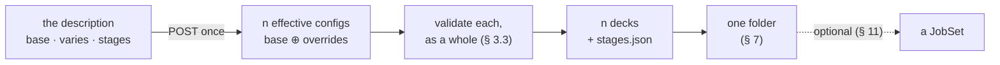
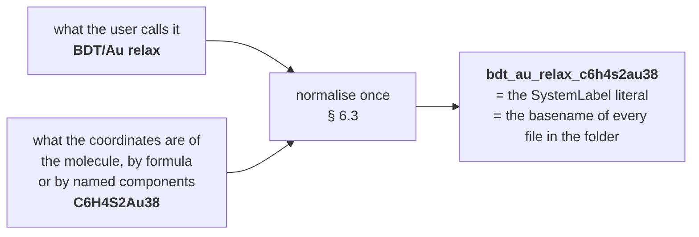
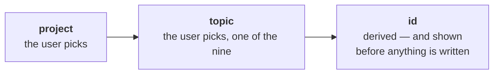
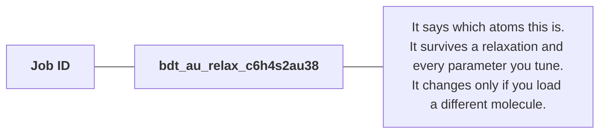
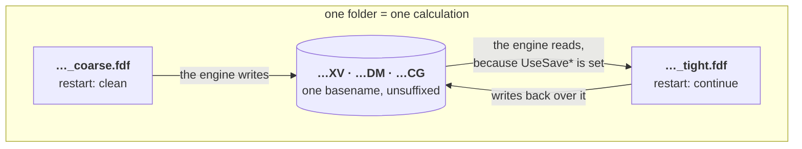
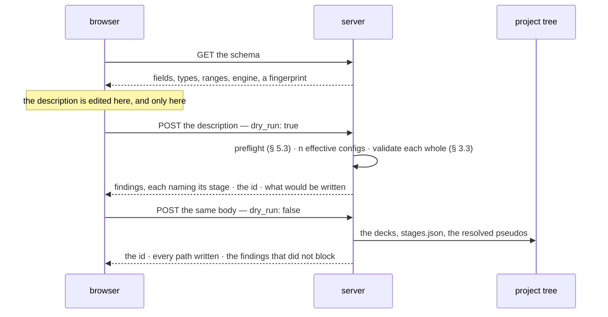

# Staged runs — one system, several parameter sets, one folder

**Role:** plan
**Domain:** web
**Companions:** [`structure-optimization-ui-plan.md`](?doc=web/structure-optimization-ui-plan.md)
— the surface this describes the inside of;
[`job-contracts.md`](?doc=execution/job-contracts.md) — the run directory, the
basename rule and warm restart, all of which this rests on;
[`job-system.md`](?doc=execution/job-system.md) — the JobSet framework, where
§ 11's optional export lands.

**Status: a proposal.** Nothing here is built. It fixes the shape before either
end is written, and names the order the work goes in: this document, then the
backend, then the surface.

> **Reading the cross-references.** A bare `§ n` is a section of *this*
> document. A section of another contract is always named with its file —
> `job-contracts.md § 2.3` — because both documents number their sections and a
> bare number would be ambiguous.

---

## 1. The one sentence

**A user describes one system and the parameter sets they mean to tune it
through; molbuilder writes one correct input file per set into one folder, where
they can be run, switched between, and continued from.**

Three words in that sentence carry the design, and each has a section of its
own: *correct* (§ 3), *one folder* (§ 7), *continued* (§ 6).

**What this is not.** It is not an execution system. Nothing here submits a job,
chains one job to the next, or decides when the following thing runs. The
pipeline ends at correct files on disk. Running one is
[`running-a-job.md`](?doc=execution/running-a-job.md)'s job; having a scheduler
run several without you is [`job-system.md`](?doc=execution/job-system.md)'s,
reachable from here as an **export** (§ 11) and never as the destination.

---

## 2. A stage is ours, not the engine's

**No engine has a concept of a stage.** SIESTA reads a `.fdf`; PySCF runs a
`.py`. Neither knows that the file it was handed is the second of three, or that
anything preceded it. The word exists only inside molbuilder, and it exists for
one reason:

> **A stage is a named set of the parameters a mission tunes, laid over the
> shared description of the system it does not.**

The base is *what the system is*. A stage is *how we are approaching it this
time*. That is the entire model, and it makes the object small:

```jsonc
{ "name": "coarse", "enabled": true,
  "overrides": { "mesh_cutoff": 150, "relax_force_tol": 0.04 } }
```

**Three fields**: a name, whether it gets written, and the overlay.

### 2.1 Why nothing else belongs on it

The stage type ships with **eight** settable fields. Two questions, asked in
order, decide all of them — and it matters that they are two, because one alone
gives the wrong answer for the last row:

> **1. Does this describe the calculation, or something that runs it?**
> Only the first belongs here at all.
>
> **2. Of what is left: can a single run mean it?**
> If yes it is an ordinary field of the shared schema, which a stage may
> override like any other. **A stage types only what a single run cannot mean.**

| Field today | Describes the calculation? | Can a single run mean it? | Lands |
|---|:--:|:--:|---|
| `name` | yes | no — a single run is named by its id | **typed** |
| `enabled` | yes | no — there is nothing to enable | **typed** |
| `relax_type` | yes | yes | an override |
| `relax_steps` | yes | yes | an override |
| `relax_force_tol` | yes | yes | an override |
| `relax_max_displ` | yes | yes | an override |
| `on_nonconvergence` | **no** — it is what a scheduler should do next | — | **leaves entirely** |
| `continue_retries` | **no** — it is how the wrapper reruns | — | **not a stage field** |

The last two rows are worth reading twice.

**`on_nonconvergence` leaves** — and note it fails the *first* question, not the
second. It was typed because it *becomes the scheduler edge* — `proceed →
afterany`, `halt → afterok` (`job-system.md § 4.1`). There is no edge here,
because there is no chain, and a setting whose only effect is on a scheduler is
not part of describing a calculation. The setting is real and keeps its home in
`job-system.md`; § 11 is where it applies.

**`continue_retries` was never a stage field.** `running-a-job.md § 3.5` is
explicit: a *single* SIESTA run whose wrapper was installed with a retry budget
re-runs itself with `--continue`. It is a **wrapper-install** parameter, which
is exactly why `job-system.md § 4.1` has to record that the SIESTA ladder does
not implement it — the field is on the stage, and the stage is not what honours
it. It moves to the wrapper layer, where it already works.

So: **eight fields become two typed ones, plus the overlay.** The "which side of
the line is this field on" question — a whole section of the previous draft —
stops existing, because the line is derivable rather than argued.

**One field arrives rather than leaves.** Whether a stage continues from what is
already in the folder or starts clean has to be sayable, and by question 2 it is
*not* a stage field: a single run can mean it too. So `restart`
(`continue` | `clean`) joins the **shared schema**, a stage overrides it like
anything else, and § 6.2 is where the generator turns that one word into every
parameter the engine binds to it.

### 2.2 The stage does not survive generation

The consequence of *the engine has no such concept* is a hard boundary:

> **A stage resolves completely at generate time. Nothing downstream knows the
> word.**

What comes out is an ordinary, complete engine input. It does not need
molbuilder to be interpreted, does not refer to a stage it follows, and carries
no marker a reader must first understand. This is `running-a-job.md § 2`'s
standalone contract — *"the compute node needs nothing but the files in the
directory"* — applied one level up, and it is what makes § 3 checkable at all.

---

## 3. Correctness is the deliverable

Everything else here exists to serve this section. A stage that is elegantly
modelled and renders a deck the engine mis-reads has failed completely.

**Two levels, and both are gates.**

### 3.1 Script-level — the file is complete and stands alone

The engine sees only the deck, so the deck must carry everything the calculation
needs:

- **the cell, explicit.** The UI holds cell *parameters*; the generator computes
  the vectors and shifts the atoms into the all-positive, right-handed frame the
  deck must carry (`?doc=model/cell-plan.md`, § 6.5).
- **pseudopotentials resolved**, per species, through the path that already
  refuses a run on `xc_family_mismatch` — and placed as
  `job-contracts.md § 2.7` describes.
- **every field the schema declares**, with defaults resolved rather than
  omitted-and-hoped-for.
- **the engine's identity group set as one** (§ 6.2), never key by key.
- **the lines derived from a launch quantity, declared** in BENCH-MARKS so they
  can be re-derived if the launch changes under them (§ 4.2).

The test is blunt: **copy the folder to a machine with no molbuilder on it and
the engine must run it correctly.**

### 3.2 Scientific-level — the values are defensible

Each stage gets the full findings pass, delivered through the one channel the
validation contract fixes (§ 9). `error` blocks; nothing downstream downgrades a
severity to keep a screen quiet.

### 3.3 The rule that makes per-stage validation honest

> **A stage is validated as a resolved whole, never as a diff.**

Two overrides can each be individually reasonable and jointly wrong: a mesh
cutoff that is fine, a basis that is fine, and a pair that is under-converged
together. So validation never sees the overlay. It sees `base ⊕ overrides` as
one config — **the same object the deck is rendered from**, so what was checked
and what was written cannot come apart.

---

## 4. The three objects

| Object | What it is | Who owns it | Lives where |
|---|---|---|---|
| **the description** | the structure it is *of*, the `base` values, which fields `vary`, and the stages | the browser while it is edited; the folder once written | the tab, then `stages.json` (§ 5) |
| **the effective config** | one `SiestaConfig` per stage: `base` overlaid with that stage's overrides | the server | per request, never stored |
| **the deck** | one complete engine input per enabled stage | the generator | the folder (§ 7) |

Only the first is new. The second is a merge of a shipped dataclass; the third
is what molbuilder already writes. The whole design is a bet that a description
can produce the decks without changing what a deck means.

**A fourth thing lands in the folder and is not a new object**: the run wrapper,
one per deck, built by the shipped builder (`job-contracts.md § 2.6`). It is
named here because a folder of decks with no wrappers is not something a user can
run, and § 12.2's done-test says so.



### 4.1 Where an override lands — three destinations, not two

It is tempting to say a promoted field is either *a line in the deck* or *a
resource*. It is not that clean, and getting it wrong writes decks that are
subtly wrong for the machine they run on.

| Kind | Examples | Lands |
|---|---|---|
| an ordinary deck line | `mesh_cutoff` → `MeshCutoff` | the stage's deck, and nowhere else |
| **a deck line that is also a resource decision** | `diag_algorithm` → `Diag.Algorithm`; `enable_gpu` | the deck **and** the wrapper's env routing **and** the scheduler's `--gres` |
| a launch quantity | `mpi_np`, `omp_threads` | not the deck — the wrapper at run time, and a scheduler's `-n` / `-c` if one is asked |

The middle row is the one that matters, and the shipped contracts already
describe it from two sides. `job-contracts.md § 6.2` lists the eigensolver as a
config value that becomes a `.fdf` keyword, and the GPU request as one *derived
from* the `.fdf`. `running-a-job.md § 2.3` then says what that costs: **any**
`Diag.Algorithm elpa*` — even CPU-ELPA — routes the wrapper to
`molbuilder-siesta-gpu`, because ELPA is linked only in that build, and
generation *raises with an install hint* if that env is absent.

Two consequences worth stating plainly:

- **Two stages in one folder may need two different environments.** A coarse
  stage on ScaLAPACK and a tight stage on ELPA-GPU is an ordinary thing to want,
  and it works: each deck gets its own wrapper, and routing is by the deck's own
  content. This is a good check on § 7's shape — per-deck wrappers are the right
  granularity, not per-folder.
- **A resource-shaped field is still a scientific choice.** ScaLAPACK versus ELPA
  changes numerics, not only speed. It belongs in the description with everything
  else the mission tunes, and § 3.2's findings pass sees it.

### 4.2 When a deck line depends on the launch

The harder half: **a deck's own values can be derived from resources the deck
does not contain.** SIESTA's `BlockSize` is the standing example — the
PROVENANCE snapshot records it as `auto -> 256 (10 * 212 atoms / mpi_np, capped
pow2)` (`job-contracts.md § 3.2`). A deck rendered for 8 ranks is not the right
deck for 16.

And the rank count is genuinely not settled at generate time.
`running-a-job.md § 2.1` fixes the rule: at run time the wrapper may read **A**
(the scheduler's allocation) and **H** (the local hardware), *"only to tune the
launch (rank counts, GPU pinning) or to log — never to decide whether the job
can run"*. § 3.1 then gives the precedence — `-np` beats `MB_NP` beats
`SLURM_NTASKS` beats the baked default — so the ranks a job runs with are
routinely not the ranks its deck was rendered against.

**The shipped system already answers this, and the answer is a contract, not a
convention.** `job-contracts.md § 3.3`'s BENCH-MARKS block is a machine-readable
declaration of *which engine-body fields a tool may override, and within what
limits* — anchor-based, so it survives layout drift — and `BlockSize` is one of
its declared fields, with `type=pow2 range=[16,256]`. That block exists because
the benchmark sweep varies ranks per point and must fix the coupled deck lines
to match.

So the rule this framework adopts, rather than invents:

> **A deck states which of its lines were derived from a launch quantity.** The
> generator renders for the resources the description asked for, and BENCH-MARKS
> declares the coupled fields so anything that later changes the launch can
> re-derive them instead of silently leaving them stale.

The alternative — forbidding ranks from varying per stage — would be simpler and
wrong: a coarse stage and a tight stage wanting different node sizes is one of
the honest reasons to have stages at all.

---

## 5. `stages.json` — the description, written down

The description should not live only in a browser tab. Written beside the decks
it produced, it becomes the record of what was meant:

```jsonc
{
  "schema": "molbuilder/stages@1",

  "engine": { "name": "siesta" },

  // What identifies this calculation, and what the user called it (§ 6).
  "run": { "name": "BDT/Au relax",                        // typed, kept verbatim
           "id":   "bdt_au_relax_c6h4s2au38",             // normalised once, then quoted
           "created": "2026-08-06T22:14:03-07:00" },      // for tracing, not identity

  // Which schema the values were entered against — a witness, not a definition.
  "schema_fingerprint": "sha256:1f0c…",

  // What this is a calculation OF: a reference into the tree, plus a witness of
  // what was there when it was written (§ 8.2).
  "structure": { "source": "projects/BDT-Au/structure/bdt_au.xyz",
                 "formula": "C6H4S2Au38", "atoms": 46 },

  // Every schema field, one value. A one-stage description stops here (§ 5.2).
  "base": { "mesh_cutoff": 150, "relax_type": "CG", "restart": "clean", … },

  // WHICH fields the user chose to tune. Intent — it cannot be inferred (§ 5.4).
  "varies": ["mesh_cutoff", "relax_force_tol", "relax_type", "restart"],

  "stages": [
    { "name": "coarse", "enabled": true,
      "overrides": { "mesh_cutoff": 150, "relax_force_tol": 0.04,
                     "relax_type": "CG",      "restart": "clean" } },

    { "name": "tight",  "enabled": true,
      "overrides": { "mesh_cutoff": 300, "relax_force_tol": 0.01,
                     "relax_type": "Broyden", "restart": "continue" } }
  ]
}
```

### 5.1 Three rules, each load-bearing

**It names fields; it never defines them.** Every key in `base` and in an
`overrides` map must resolve to a field the **shared** schema already declares —
and never to `name` or `enabled`, the stage's own two typed fields, which is the
ambiguity that would let one fact have two homes again. A key the schema does not know is
**refused, not ignored**: an ignored key is a calculation quietly different from
the one that was asked for. This is what keeps the file from becoming a second
schema, which is how the idea fails.

**It is parsed *into* the typed config, not around it.** The generator keeps
rendering from a `SiestaConfig` and its stage specs; this file is how a
description travels and how it persists. A generator that rendered whatever keys
the JSON happened to carry would throw away validation, defaulting and the
`engine_key` mapping, and re-implement all three badly.

**It carries the schema convention, not a bespoke one.**
`job-contracts.md § 6.1` fixes it for every persisted artefact —
`molbuilder/<name>@<major>`, checked **major-only** through the one shared helper
`molbuilder/persist.py`, and *"New persisted artifacts must use it."* That check
is not a promise that somebody writes migrations; it is *"refuses with a clear
message rather than mis-parsing"*, which is the behaviour this file wants. So
`stages.json` joins the registry table rather than inventing a `format` key and
an argument for why it needs no version.

### 5.2 One stage is no stages

**`stages` may be absent, and absent means one.** A description with no `stages`
key is a calculation with a single parameter set — `base`, exactly — and it
produces one deck named `<id>.fdf`, with no stage suffix, which is what the tab
writes today. Nothing about stages has to be understood to read or write it.

Three things follow, and they are the same fact seen three times: the deck takes
no suffix (`job-contracts.md § 2.3`'s `<label>_<stagename>` applies when there
*are* stage names), findings carry no `stage` (§ 9), and `varies` is empty or
absent because there is nothing to vary across.

A description *with* `stages` has at least one — dropping the last is refused,
because a description of no calculation is not a smaller description.

### 5.3 What the preflight checks, before anything is rendered

In order, and all of it up front rather than halfway through writing a folder:

| Check | On failure |
|---|---|
| the schema string is `molbuilder/stages@<known major>` | refuse — this is not a description, or not one this reader knows |
| the engine is one this backend has a generator for | refuse, naming what it has |
| the schema fingerprint matches | proceed, and say plainly that the description was written against a different schema |
| every named field exists | refuse, naming the field |
| every value is inside the schema's bounds | refuse, naming the field and both bounds |

**What is deliberately *not* checked here, and why:**

- **the engine's version.** Nothing in the shipped system records or gates one.
  The version is known where the binary is — `running-a-job.md § 4.1`'s run
  banner prints it — and the host writing a description often has no engine
  installed at all. Gating on it here would break design decision 3, *the
  machine's knowledge lives on the machine*.
- **declared requirements** (MPI, NetCDF, a GPU). Already answered twice, at
  well-defined moments: env routing derives the requirement from the deck
  (`running-a-job.md § 2.3` — an ELPA or GPU `.fdf` routes to
  `molbuilder-siesta-gpu`, and a missing env raises at generate with an install
  hint), and the **doctor** verifies prerequisites on the target at prep
  (`running-a-job.md § 2.2`). A third, hand-maintained list would only drift
  from what the deck actually asks for.

**The fingerprint's claim is deliberately weak.** One string can say *this was
written against a different schema*; it cannot say which fields moved. The
per-field rows below it do that work. Carrying each promoted field's type and
range alongside would be a witness to three fields while claiming to watch
thirty-eight.

### 5.4 What writing it down buys

- **One producer for both surfaces.** The CLI and the browser stop being two
  paths to a staged calculation: the browser writes a description, and the same
  reader turns it into decks from either.
- **Reopening restores intent.** The decks can be re-read for their values, but
  nothing in them says *which parameters the user meant to tune* — a mesh cutoff
  that happens to be equal in every stage is indistinguishable from one never
  promoted. That is why `varies` is in the file: it cannot be inferred from
  anything else.
- **It diffs.** Two runs that differ can be compared as intent rather than by
  reading two directories of decks.

**PROVENANCE stays exactly what it is** — a generation snapshot,
`job-contracts.md § 3.2` — and gains a use for a key it already reserves:
`form-config-hash` becomes the hash of the description that produced the deck,
so any deck in a project traces back to it, and a hand-edited deck can be told
apart from one this file would reproduce.

### 5.5 What it is not

It is not an engine input format: no engine reads it. It is not a replacement
for `SiestaConfig` — that dataclass remains the definition of what a field *is*.
It is not a new persistence layer for projects; it is one file written beside
the decks it produced.

---

## 6. Identity — the basename every stage shares

This is the mechanism the whole framework turns on, and it is engine-side.

A generated script *"declares its ID in one literal (`SystemLabel` / `JOB`)"*,
and **that ID keys every warm file as `<ID>.<ext>`**
(`job-contracts.md § 4.1`). `job-contracts.md § 2.1` Rule 2 then says the part
that matters here:

> Across the stages of one staged relaxation the basename **stays identical**
> (only parameters change); that is exactly what lets SIESTA pick up
> `<basename>.XV` / `.DM` from the previous stage.

So **continuing is not something molbuilder does.** It is what the engine does
when it finds warm files keyed by the id it was given and its own bound
parameters say to load them (§ 6.2). molbuilder's whole contribution is to make
the id right and put the decks where the files are.

Two failures follow directly, and both are real today:

- two different calculations given the same label in one directory: the second
  **silently warm-starts from the first's geometry**, and the banner says
  `WARM-RESTART (silent)` because that is exactly what it is;
- a label edited between runs: the warm files no longer match, and a run that
  should have resumed starts cold instead.

An id derived from the description fixes both, and one rule decides every case:

> **The id is built from inputs, never from anything a run produced.**
>
> It must be knowable *before* the calculation exists — it names the folder and
> the basename of every file in it (§ 6.3). An id that depended on a result would change
> the moment a stage succeeded, orphaning the state it exists to continue from.
> So: no coordinates, no energies, no convergence status, nothing read back off
> a `.XV`.

That leaves simple parameters, which is all it needs. The id is **readable, not
cryptographic** — made of things a person already knows:



A hash would be exact and unreadable. A formula is neither, and that is the
trade made on purpose: an id you can recognise in a directory listing and in a
filename is worth more day to day than one that resolves every possible
ambiguity. **This is a starting point, agreed as one**; § 13 records what would
force it to grow.

That one id **is** the `SystemLabel` / `JOB` literal. There is no second name.

**The timestamp is recorded but is not part of it.** It lives as `run.created`,
for tracing a folder back to when it was written, and it stays out of the id
because putting it in would make every regeneration a new identity and therefore
a cold start. Two generations of the same calculation *should* land on the same
id: that is not a collision, it is the same calculation, and warm files being
found is the right outcome.

**What tells two invocations apart, then?** The wrapper already does it — each
run carries an index (`-run0`, `-run1`, …) and never clobbers a prior one
(`job-contracts.md § 2.6`). That is invocation-level bookkeeping; the id is
calculation-level and does not repeat it.

### 6.1 What the identity is tied to — as little as possible

Overstating this is not a safe error: every extra thing in the pin is a case
where a user tunes something reasonable and loses a geometry they should have
kept.

Start from what a run *produces*. **The result is a set of coordinates.** So:

> **Coordinates cannot be in the identity.** They are the output. Bind them in
> and the pin changes every time a stage succeeds — the identity would break
> precisely when the calculation worked.

What is left is what those coordinates are *of*:

| Considered | In the pin? | Why |
|---|:--:|---|
| the molecule — its formula, or its named components | **yes** | a `.XV` is a list of positions for *these* atoms. Different atoms, and every coordinate lands somewhere it does not belong |
| the positions | no | the output (above) |
| the cell | undecided (§ 13) | a `.XV` carries the cell too, so a changed cell is overridden on restart rather than mismatched — a different failure, and possibly not one the id should solve |
| basis, spin, XC | no | the geometry stays valid across all of them, and tuning the electronics while continuing is ordinary practice. A `.DM` of the wrong shape is caught by the engine — a failure it already reports, traded for one it cannot |
| mesh, tolerances, force, steps, algorithm | no | **exactly what the stages vary** |
| ranks, threads, GPU | no | how fast it ran says nothing about whether the answer may be continued |

So the id covers one thing beyond the user's own name for it: **which atoms
these coordinates belong to.** A differing atom *count* the engine already
refuses, so the id is not there for that; it is there for the cases the engine
cannot see.

Note the fifth row: the id is deliberately blind to everything a stage tunes.
That is not an oversight — it is what makes several stages one calculation.

### 6.2 Every engine has an internal identity, and parameters bound to it

The id is only half of a warm start, and this is not a SIESTA quirk — **every
engine has its own internal notion of "which job is this, and may I continue
it", and a set of parameters tied to that notion.** A design that names only the
filename has described none of it.

Two things, per engine, always:

| | What it settles | SIESTA | PySCF |
|---|---|---|---|
| **the engine's job identity** | which prior state belongs to this run | the `SystemLabel` literal | the `JOB = "…"` literal |
| **the parameters bound to it** | whether that state is honoured when found | `DM.UseSaveDM`, `MD.UseSaveXV`, `MD.UseSaveCG` — SIESTA reads the files *only* when these are set (`job-contracts.md § 4.2`) | the resume branches the generated script carries: `mf.chkfile = JOB + ".chk"` with `init_guess = "chkfile"` when it exists, and `<JOB>_optimized.xyz` overriding the literal geometry |

Read across: the identity is the same *idea* in both columns and a different
*mechanism*; the bound parameters are a declared flag family in one and
generated control flow in the other. Neither is a filesystem fact.

**So the design treats them as one named group per engine**, and — this is the
part the reframe moves — **the group is the generator's, not the description's**:

1. **An engine declares its group.** Its identity literal, the parameters bound
   to it, and the warm files they govern belong together in that engine's
   contract — the same place `job-contracts.md § 4.2` already inventories the
   files. A new engine that cannot fill this in is a new engine whose restart
   behaviour nobody has thought about yet.
2. **The user says one thing; the generator sets the group.** `restart` is a
   single schema field — `continue` or `clean` — that a stage overrides like any
   other. The renderer expands it into every bound parameter for that engine.
   Nobody keeps three keys in step by hand, and no description can carry them
   individually and disagree with itself.
3. **It is per-stage, because it is a field.** A first stage is normally `clean`
   and everything after it `continue`. Nothing special is needed to say so.

**Why rule 2 is not tidiness.** The two ways the flags can be wrong are both
silent, and opposite: **honoured with nothing to load** (the parameter is on, no
prior state exists, the engine cold-starts while the deck says it resumed), and
**present but not honoured** (the files are right there, the parameter is off,
and the stage starts from scratch looking like it continued). One field cannot
produce either.

### 6.3 The id is a filename, so it is normalised once and checked

The id becomes the `SystemLabel`, and that becomes the stem of every file in the
folder: `<id>.XV`, `<id>.DM`, `<id>_tight.fdf`. A name with a space or a slash
in it breaks a shell line, a glob or a scheduler argument. So what the user
types is **never used raw**.

**It also names the folder.** `job-contracts.md § 2.1` Rule 1 says a directory
holds one job, so the innermost segment of the tree and the calculation are the
same thing — and giving them the same name means there is no second name to keep
in step, and a directory listing identifies what is in it:



That is a stricter rule than the tree needs (`job-contracts.md § 2.5` only
requires
`[A-Za-z0-9_-]+` per segment) and it is the point: a folder whose name is not
the id is a folder whose contents cannot be identified from outside it. § 13
records the alternative.

**The allowed set is not a new decision.** `job-contracts.md § 2.1` Rule 2 fixes
it: the basename is a single token matching `[A-Za-z0-9_-]+`, rejected at the
form/CLI boundary by `molbuilder/projects.py::_NAME_PATTERN`, with the wrapper
accepting the slightly wider `[A-Za-z0-9._-]+` because a `SystemLabel` may
legitimately carry a dot (and sanitising it there is also what blocks shell
injection from a hostile script, `job-contracts.md § 4.3`). The project tree
uses the same set per segment (`job-contracts.md § 2.5`).

So the normalisation is: **anything outside `[A-Za-z0-9_-]` to `_`, runs
collapsed, leading and trailing separators trimmed, length capped** with room
for the suffixes the stages will add. No lowercasing rule — that would make the
id the one name in the system that forbids capitals; the case-insensitive
filesystem worry is handled where it actually bites, by making the **collision
check** case-insensitive.

**Three rules keep it from becoming a source of surprise:**

1. **It is normalised once, when the description is written, and stored.** The
   id in the file *is* the id — nothing downstream re-derives it from the user's
   raw text, because two components normalising slightly differently is a silent
   divergence between what the browser shows and what the engine writes.
2. **The result is shown, not hidden** (§ 6.4).
3. **A normalisation that loses the name is refused, not patched.** If what a
   user typed reduces to nothing, or collides with another calculation in the
   same project, the answer is to say so and ask — never to append a digit and
   carry on, which produces `bdt_2` and no explanation of what it differs from.

### 6.4 The id is on screen, and its changes are visible

An identity the user cannot see is one they cannot reason about, and this one
decides whether their run continues. So the tab shows it, always:



**How the tab knows it**, given that § 8.1 forbids the browser from deciding an
id's final form: the id shown is the one the **last check returned** (§ 8.3), and
an edit that would change it — a different molecule, a different name — marks it
*stale* until the next check clears it. The browser never normalises; it displays
and invalidates. That keeps one normaliser in the system, which is rule 1 above.

Two behaviours make it worth showing rather than merely correct:

- **When a different molecule is loaded, the id visibly changes**, at that
  moment — the UI saying *this has become a different calculation and it will
  start cold*, before anything is written rather than after a run behaves oddly.
- **When the folder already holds warm files**, the tab can say whether they
  match: *"prior state found for this key — the next run continues"*, or
  *"prior state found, but from a different calculation"*. That is the sentence
  the wrapper's banner prints (`job-contracts.md § 4.4`), moved to where the
  decision is being made.

**The description beside the decks is the record**, which lets the banner say
*which* description produced the state it is about to resume from. That is the
existing doctrine — **molbuilder informs, and the user decides to continue** —
reaching a case it does not cover today: `WARM-RESTART (silent)` cannot tell you
the state came from a different calculation, because nothing beside it recorded
which one made it.

### 6.5 The cell is generated, not typed

SIESTA needs an explicit lattice. The UI holds **cell parameters** — the kind of
cell, the vacuum padding, whatever the user actually reasons about — and the
generator computes the vectors from those parameters and the structure, shifting
the atoms out of an origin-centred frame into the all-positive, right-handed one
the deck must carry (`?doc=model/cell-plan.md`).

Two consequences:

- **The cell in the deck is derived, so it is not an input to the identity.**
  What could be is the cell *parameters*, and § 13 keeps that open — the vectors
  themselves are output, and § 6 already refuses output in the id.
- **The frame shift is why a `.XV` and changed cell parameters are worth a
  warning.** A `.XV` holds coordinates in the frame the run wrote them in.
  Change the padding, regenerate, and the deck's atoms move while the restart
  file's do not. The id cannot prevent it (the atoms are the same atoms), so it
  is the banner's to report: *state found, written under different cell
  parameters*.

---

## 7. The folder — what "switch" and "continue" mean on disk

Nothing here is new. `job-contracts.md § 2.1` and `job-contracts.md § 2.3`
already describe exactly this shape, and reading them as the design rather than
as background is most of the work:

> **Rule 1 — one job per directory.** A directory may hold *several inputs* (one
> per stage of a staged relaxation) plus the engine's outputs and restart files,
> but never inputs for a **different** job.

What one folder holds — `projects/BDT-Au/optimization/bdt_au_relax_c6h4s2au38/`,
where the last segment is the id itself (§ 6.3):

| | Named | Fixed by |
|---|---|---|
| the decks, one per enabled stage | `<id>_coarse.fdf`, `<id>_tight.fdf` | `job-contracts.md § 2.3` — an underscore plus the stage's *name* |
| the warm state, **shared and unsuffixed** | `<id>.XV`, `<id>.DM`, `<id>.CG` | `job-contracts.md § 2.1` Rule 2 — this is what "continue" *is* |
| the final geometry | `<id>.STRUCT_OUT` | `job-contracts.md § 2.2` |
| engine output, per deck, run-indexed | `<id>_coarse-run0.out` | `job-contracts.md § 2.6` — re-running never clobbers |
| the description | `stages.json` | § 5 |
| the pseudopotentials | `Au.psml`, `S.psml`, … | `job-contracts.md § 2.7` — named by element, shared |
| a wrapper per deck | `<id>_coarse.run.sh`, and `.sbatch` where a scheduler is configured | `job-contracts.md § 2.6` — routed by the deck's own content, so two stages may activate two different environments (§ 4.1) |
| the checkpoint config, if used | `.mbcheckpoint.json` | § 7.2 |

**Switch** = run a different deck. **Continue** = the engine finds the warm
files, because every deck carries the same `SystemLabel` and each one's
`restart` field says whether to load them:



That is the whole mechanism — no carry list, no symlinks, no dependency edge.
Those exist in `job-system.md` only because its bundle splits stages across
*separate* folders, which is a scheduler's requirement and not this
framework's.

### 7.1 The cost of sharing one folder, stated plainly

The warm files are unsuffixed and shared, so **running a second stage overwrites
the first stage's restart state.** That is the same property that makes
continuing free; it cannot be had one way only. It means the folder holds *the
current state of one calculation*, not a history of every setup tried in it.

This is not a gap to design around — the answer already ships.

### 7.2 Keeping a result before switching — `molbuilder snapshot`

`running-a-job.md § 6` puts a run directory under a git-backed checkpoint
system: snapshot a converged state, tag it (*"ready for transport"*), **branch a
what-if**, restore — with the large binaries archived by content and the small
warm-restart files (`.XV`, `.CG`) kept in the text history *"so a restore brings
back a resumable state"*.

That is precisely *switch between setups without losing the previous one*, and
it is shipped on the CLI. **`snapshot branch` has no HTTP route** — a gap
`running-a-job.md § 6.2` records — which makes it the single most relevant
missing piece for this framework, ahead of anything in the JobSet migration.

### 7.3 Producing twice into the same folder

The id is stable by design, so a second generate targets the folder the first
one wrote. The answer is the one the handoff writer already gives
(`job-contracts.md § 5.4`): **refuse unless the user says overwrite, and never
rename.** A UI *"SHOULD warn before targeting a stem that already exists"*.
Rewriting decks does not touch the warm files — which is the point, since they
are what the next run continues from.

---

## 8. The two sides, and what crosses

### 8.1 The boundary, as a rule

| | Owns | May **not** |
|---|---|---|
| **the browser** | the description while it is edited: values, which fields vary, the stages and their order | render a deck, resolve a pseudopotential, compute a cell, read or write the project tree, decide an id's final form |
| **the server** | turning a description into effective configs, validating them, resolving structure and pseudos, computing the cell, writing the folder | hold description state between requests, or invent a value the description did not carry |

One sentence each: **the browser decides what is wanted; the server decides what
that means and whether it can be done correctly.** Neither guesses on the
other's behalf — which is why the description travels whole rather than as a
diff, and why nothing the server derives is sent back for the browser to store.

### 8.2 A description points at a structure; it does not contain one

```jsonc
"structure": {
    "source": "projects/BDT-Au/structure/bdt_au.xyz",   // in the project tree
    "formula": "C6H4S2Au38",                            // what the id is built from
    "atoms": 46
}
```

- **Coordinates are what runs produce** (§ 6), and a description that embedded
  them would be a second copy of a file the tree already holds, drifting from it
  the moment either moved.
- **The formula and atom count travel as a witness**, not as data. They are what
  the id was built from, so a description opened against a structure that has
  since changed can *say so* rather than silently building a different
  calculation under the same id.
- **Pseudopotentials are resolved, never carried.** The server resolves them per
  species through the existing path — the one that already refuses on
  `xc_family_mismatch` — and places them as `job-contracts.md § 2.7` describes.
  There is no field for this: the project's own `pseudopotential` cache is where
  they come from, and a one-key object saying so would be a setting with one
  legal value.

### 8.3 What crosses, in both directions

Three exchanges, and nothing else:



**One route, one flag.** Check and produce take the identical body, so they are
the same route with `dry_run` — which is the CLI's idiom already
(`jobset submit --dry-run`), and which makes it impossible for a description
that checks clean to then fail to produce.

**What comes back:**

```jsonc
{
  "ok": true,
  "id": "bdt_au_relax_c6h4s2au38",
  "written": { "folder": "projects/BDT-Au/optimization/bdt_au_relax_c6h4s2au38/",
               "decks":  ["…_coarse.fdf", "…_tight.fdf"],
               "description": "…/stages.json" },
  "findings": [ /* warnings that did not block, each naming its stage */ ]
}
```

The paths are returned because the browser cannot know them: the id's final form
and the tree's layout are both the server's (§ 8.1). A refusal comes back the
same shape with `ok: false` and the findings that caused it — never a bare error
string, because a preflight that names a field is worth nothing if the surface
cannot show which field.

---

## 9. Validation names the stage beside `where`, not in it

A findings list points at a field. With several stages, "mesh cutoff is too low
for this basis" is true of *coarse* and false of *tight*, and a finding that
cannot say which is one a user cannot act on.

**But it must not say so in `where`.** The delivery contract
(`science/validation.md § 4.1`) fixes the shape: every finding is
`{severity, message, where, workflow_group?}` from one serializer, and **`where`
is the stable machine-readable identifier** — `config.mesh_cutoff`,
`geometry.min_distance` — which *the UI binds behaviour to*. Writing
`tight.config.mesh_cutoff` would break that binding on purpose: the one client
module routes on `where`, and an id it has never seen routes nowhere.

So the stage travels the way `workflow_group` already does — **as its own
optional field beside `where`**, leaving the identifier untouched:

```
{ severity, message, where: "config.mesh_cutoff", workflow_group: "stage",
  stage: "coarse" }        ← new, optional, absent when there are no stages (§ 5.2)
```

Three consequences, all inherited rather than invented:

- **One channel still.** `lib/validation-findings.js` remains the only renderer;
  it gains a column to route into, not a rival implementation.
- **`error` still blocks.** A stage that fails validation blocks the whole
  generate, because severity means the same everywhere and no surface downgrades
  one to keep a screen quiet.
- **One shared value, one complaint.** A base field wrong for three stages says
  so once, with no `stage` — it is a fact about the shared config, not about a
  stage.

---

## 10. The decision chain — who dictates what, in order

Overlap between modules is fine. A **loop** is not: if two parties can each
overrule the other, nobody can predict the outcome and nobody can test it. So
the whole system is one sequence, and the rule that keeps it one is:

> **Each step decides within what the steps above it already fixed, and nothing
> later rewrites something earlier.**

| # | Who decides | What it fixes | And may not |
|---|---|---|---|
| 1 | the **project tree** | where anything may live: the nine topics, `[A-Za-z0-9_-]+` per segment | be widened by a description or a route |
| 2 | the **structure** | which atoms exist | be edited by the generator — it is an input, and the description points at it |
| 3 | **2 + the user's name**, within 1's character set | the **id** — normalised once, then quoted | be recomputed downstream: every later step reads it |
| 4 | the **schema** | which fields exist, their types, ranges and `engine_key`s | be added to by a description — a key it does not know is refused |
| 5 | the **description** | values, which fields vary, the stages and their order | contradict 4, or invent a field |
| 6 | the **preflight** | whether this file can be read here at all | pass silently — it refuses, naming what it found |
| 7 | **validation** | whether it may be written: `error` blocks, per stage, on the resolved whole | be downgraded by a surface to keep a screen quiet |
| 8 | the **generator** | the decks — `base ⊕ overrides`, the cell made explicit, the pseudos resolved, the engine's identity group set as one | leave anything for a later step to fill in |
| 9 | the **target's config** (`molbuilder.json`, then the project's, project wins) | the wrapper's shell: preamble and activation — and wrapper generation **refuses** without an activation, which has no default (`running-a-job.md § 5.2`) | be supplied from the browser: the machine's knowledge stays on the machine |
| 10 | the **user** | which deck to run, and when | — this is the point of the framework |
| 11 | the **wrapper**, at run time | ranks, threads, GPU pinning, the run index, the restart banner | override the engine's own bound parameters |
| 12 | the **engine** | whether warm files are honoured, given those parameters | be second-guessed by anything above |

Read it downward and the entanglements disappear:

- **The browser lives entirely in rows 3–5.** That is why § 8.1 can say it never
  renders a deck or computes a cell — those are row 8.
- **The id is fixed at row 3 and quoted by everything after.** No later step
  derives it again, which is why normalising once (§ 6.3) is a rule rather than
  an optimisation.
- **Row 10 is a person, and that is deliberate.** Every earlier row exists to
  make row 10's choice safe; none of them makes it.
- **Nothing in rows 1–8 knows what a cluster is.** Target isolation is not a
  policy anyone has to remember; it falls out of where row 9 sits.

**Where an overlap is real and correct:** rows 6 and 7 both refuse things, and
both belong — one asks *can this file be read here at all*, the other *is this a
sound calculation*. They are ordered, so a description aimed at an engine this
backend does not have never receives a lecture about its mesh cutoff.

---

## 11. Exporting to a scheduler — optional, and downstream

Everything above ends at decks in a folder. Some day a user will want a
scheduler to run them in order without being asked twice, and that framework
ships: `job-system.md`'s `stages_to_jobset` turns a staged config into a
**ladder**, and `prep` / `plan` / `submit` / `status` run it.

**It is an export, not a destination**, and the difference shows up in what it
needs that this framework does not:

| The export needs | Where it comes from |
|---|---|
| `on_nonconvergence` per stage | **only the export.** It becomes the scheduler edge — `proceed → afterany`, `halt → afterok` (`job-system.md § 4.1`) — and there is no edge without a scheduler |
| `Job.carry` per stage | **only the export.** Its `prep` lays out *separate folders* per job, so the warm files § 7 shares must be carried explicitly and localised on run |
| `Job.resources` per stage | **already in the description** — § 4.1's third row. The export does not ask for a new field; it applies the translation `job-contracts.md § 6.2` already fixes (`omp_threads` → `cpus_per_task`, and so on) at its own boundary |

The first two describe *having something else run it*, not the calculation.
Keeping them on every stage would serve a path most users never take, and would
make § 7's folder — the actual product — look like an intermediate step toward
it. The third is the reminder that resources were never purely downstream: they
are in the description because they change the deck (§ 4.1), and the export
reads them from there.

So: the export reads the same `stages.json`, asks for the two things the
description does not carry, and produces a bundle in the shape
`job-system.md § 5.2` defines. Two facts to
carry forward when it is built:

- **The two directory shapes are not in conflict, they are two products.**
  `job-contracts.md § 2.5`'s flat `<structure>/` is this framework's folder;
  `job-system.md § 5.2`'s `point-<name>/` tree is a bundle. A bundle is not a
  run directory — it is a directory *of* run directories, each obeying
  `job-contracts.md § 2.1` exactly. Nothing needs to move, and the earlier reading of these as a
  contradiction was wrong.
- **`JobSet.name` should be the id**, and the submitter's `-J` should carry it.
  Today a ladder's scheduler name is the bare stage name
  (`job-contracts.md § 6.3`), so three concurrent ladders show
  `coarse coarse coarse` in `squeue`.

---

## 12. The work

### 12.1 The modules — what each is given, and what it may assume

One table, because "which module" and "which layer" were the same question asked
twice. Every row can be built and tested against values alone, and the two
browser rows can be built before any route exists.

| Module | Today | What this needs | May assume nothing about |
|---|---|---|---|
| **config** | `SiestaConfig`; `SiestaStageSpec` (8 fields) | **stage spec → `{name, enabled, overrides}`**; the four value fields become ordinary shared-config fields; `continue_retries` moves to the wrapper layer and `on_nonconvergence` to the JobSet producer's input; **+ a `restart` field** on the shared config | which surface set it |
| **engine contract** (per engine) | the warm files, inventoried (`job-contracts.md § 4.2`) | **+ the identity literal and the parameters bound to it**, declared beside them as one group (§ 6.2) | the scheduler |
| **description reader** (server) | — | **new**: read `molbuilder/stages@1` into a `SiestaConfig` plus stage specs, or refuse naming the key | how the description was produced |
| **effective config** (server) | — | **new**: base ⊕ one stage's overrides → one config to validate *and* render from | which stage it is |
| **generator** (server) | `render_siesta_stage_fdfs`; BENCH-MARKS for SIESTA | renders from the *effective* config; expands `restart` into the engine's group; keeps BENCH-MARKS honest for every line derived from a launch quantity (§ 4.2) | who asked |
| **validation** | one config → findings | per-stage effective configs → findings **with a stage coordinate** (§ 9) | which surface will show them |
| **web API** | `/api/build/*` renders one deck | **+ one route**, `dry_run` flag, that takes a description and writes a folder | — |
| **description model** (browser, pure) | schema-driven form, one flat config | **+ pure data and pure operations**: promote, demote, add, remove, reorder, apply preset | the DOM, the network, the engine |
| **matrix view** (browser) | — | **+ renders the description** and calls those operations, and nothing else | how it is stored or sent |

### 12.2 The order, and what "done" means

**Step 1 — this document.** Done when the shape is agreed and § 13 is answered.

**Step 2 — the backend.**

1. **Settle which of the duplicated fields wins today.** `relax_force_tol` and
   `relax_max_displ` sit on the shared config *and* on the stage spec. *Done
   when:* a test says which value a staged render uses when the two disagree —
   because that is the behaviour anyone relying on it has already built on.
2. **The stage spec shrinks to three fields.** The four value fields become
   ordinary shared-config fields; `continue_retries` moves to the wrapper-install
   surface that already honours it; `on_nonconvergence` moves to the JobSet
   producer's own input, since `stages_to_jobset` is its only reader (§ 11).
   *Done when:* a stage with no overrides renders exactly what it renders today,
   no field of the shared schema has a second home, and the ladder producer still
   derives the same edges it derives now.
3. **`overrides` and the merge.** *Done when:* a stage with `{mesh_cutoff: 300}`
   renders a deck carrying 300 while the shared config still says 150.
4. **The `restart` field and the engine group.** *Done when:* a two-stage
   description whose second stage continues renders every `UseSave*` set, and a
   stage set to `clean` renders none — asserted together, since the failure mode
   is that they disagree.
5. **Resource-shaped overrides reach all three destinations** (§ 4.1). *Done
   when:* a two-stage description asking for ScaLAPACK then ELPA renders two
   decks whose `Diag.Algorithm` differs **and** two wrappers activating
   different environments; and a stage varying `mpi_np` renders a deck whose
   `BlockSize` was derived from *that* stage's rank count, with BENCH-MARKS
   declaring it (§ 4.2).
6. **`stages.json`, its reader, and the preflight** (§ 5). *Done when:* a
   description round-trips — read, rendered, re-read — and one naming a dead
   field fails with that field's name.
7. **Per-stage validation on the resolved whole** (§ 3.3). *Done when:* a
   description whose coarse stage is under-converged reports against `coarse`
   alone, and the config that was validated is the object that was rendered.
8. **The route.** *Done when:* a description posted to it writes the same bytes
   the CLI writes for the same stages — compared file by file, because "the web
   is additive on top of the CLI" is only true if the output is identical — and
   the folder holds a **runnable wrapper per deck**, not decks alone.
9. **`snapshot branch` over HTTP** (§ 7.2). *Done when:* the folder can be
   branched from the browser, because that is what switching setups without
   losing one requires.

**Step 3 — the surface.** The description model first (pure, tested), then the
matrix view, then the subtabs. The UI plan's § 7 specifies the first.

The gate between 2 and 3: **the backend must be able to render a stage that
overrides a parameter the stage type never carried** before any of it is drawn,
or the UI will be designed around what the model happens to allow rather than
what a user needs.

---

## 13. Open questions

1. **Is `stages.json` the right name?** It sidesteps the four-way collision the
   word *plan* already has in this domain (`jobset plan` the verb,
   `STAGE-PLAN.md` the file, "Job-set plan" the registry label for
   `job-set.json`). *setup* is the user's own word for what one stage is, which
   argues against using it for the file that holds all of them.
2. **Should the folder really be named by the id (§ 6.3)?** It removes a second
   name and makes a directory listing self-describing, at the cost of a folder
   called `bdt_au_relax_c6h4s2au38` where someone would have typed `bdt-relax`.
   The alternative — the user names the folder, the id names the files — is one
   more thing to keep in step and one more way for a listing to lie.
3. **Is the user's half of the id editable after the fact?** Note this compounds
   with the question above: if the folder carries the id, renaming moves the
   folder as well as orphaning the warm files. Renaming changes
   the id and so orphans the warm files, which is right in principle and will
   surprise someone who meant to fix a typo. Deriving it makes it consistent;
   letting it be typed keeps a door open to deliberately continuing from an
   unrelated run's state, which is occasionally what a person wants and is
   otherwise impossible to ask for.
4. **What are the "components" of a composite system?** A junction is a molecule
   *and* two electrodes; naming it by total formula loses that structure, and
   naming it by parts needs a convention for what a part is.
5. **When does the readable id stop being enough?** A formula does not tell two
   isomers apart, and does not pin the *order* species are declared in — and a
   `.XV` read against a different order lands every coordinate on the wrong
   atom. The likely answer is a short pin appended when and only when the
   readable part cannot separate two things in the same project, so the ugly
   form appears where it earns its place rather than everywhere.
6. **Do the cell *parameters* belong in the identity (§ 6.5)?** The vectors are
   generated, so they cannot be — but padding that changes the frame the atoms
   are written in makes a prior `.XV` continue from a different origin. Reporting
   it is cheap; putting it in the id would orphan a geometry every time somebody
   widened a box, which is the overstatement § 6.1 is about.
7. **Is a description editable by hand?** It is JSON beside the decks, so it
   will be. If yes, the reader owes the same errors to a person as to the
   browser — an argument for § 5.1's refusal rule being loud rather than
   tolerant.
8. **The trajectory log's stage naming does not match the deck's.** A stage deck
   is `<label>_<stagename>` — an underscore and a *name* — while the molwatch log
   is `<label>-stage<N>`, a hyphen and a *number*, and the run decoder's stage
   regex keys on that hyphen form (`job-contracts.md § 2.3`). User-named stages
   cannot be expressed in a number. Either the log takes the name, or a name
   maps to an index somewhere, and whichever it is, `job-contracts.md § 2.3` is
   where it is decided.
9. **May two enabled stages be identical?** Nothing above forbids it, and the
   answer is probably "warn": two decks that differ in nothing but their name
   produce the same calculation twice into the same warm state.

*Answered by § 5, which is why it was worth writing:* whether `varies` travels
to the server (yes — it cannot be inferred), what happens when the schema moves
on (say so, then let the per-field checks refuse), and whether the description
persists beside the decks (yes — it is the only record of intent).
