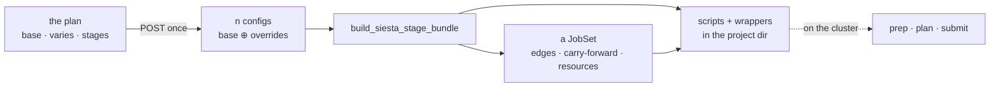

# Staged runs — the architecture, from a form to a chain of jobs

**Role:** plan
**Domain:** web
**Companions:** [`structure-optimization-ui-plan.md`](?doc=web/structure-optimization-ui-plan.md)
— the surface this describes the inside of; [`job-system.md`](?doc=execution/job-system.md)
— the JobSet model and the migration's phases; [`job-contracts.md`](?doc=execution/job-contracts.md)
— what lands on disk.

**Status: a proposal.** Nothing here is built. It fixes the shape of the thing
before either end is written, and names the order the work goes in: this
document, then the backend, then the surface.

---

## 1. The one sentence

**A user describes one calculation and how it should tighten; the browser turns
that into a chain of jobs the shipped job system already knows how to run.**

Everything below is about where each part of that sentence lives.

---

## 2. The four objects

| Object | What it is | Who owns it | Lives where |
|---|---|---|---|
| **the plan** | `base` values + which fields `vary` + the stages | the browser | the tab, while you work |
| **the config** | one `SiestaConfig` per stage: `base` overlaid with that stage's overrides | the server | per request |
| **the JobSet** | jobs, dependency edges, carry-forward sets, resources | `stages_to_jobset` | in the bundle |
| **the bundle** | scripts, wrappers, `job-set.json` | `build_siesta_stage_bundle` | the project directory |

The plan is the only new object. The other three ship today, and the whole
design is a bet that the plan can be turned into them without changing what
they mean.



---

## 3. What the model can express today — and the two gaps

A stage is a typed object with **eight** settable fields:

```
name · enabled · relax_type · relax_steps · relax_force_tol
     · relax_max_displ · on_nonconvergence · continue_retries
```

Everything else in a stage's `.fdf` comes from the one shared config. That
yields two gaps, and they are the reason this is a backend job before it is a
UI job.

**Gap 1 — most parameters cannot vary at all.** The mesh cutoff, the energy
shift and the DM tolerances live on the shared config, so every stage of a
ladder uses the same ones. The tab's preset menu *appears* to change them per
stage; what it actually does is rewrite the single shared value. A ladder that
coarsens the grid for stage 1 and sharpens it for stage 3 — the ordinary thing
to want — cannot be described today.

**Gap 2 — resources can be carried but not asked for.** The JobSet gives every
job its own resources, and `stages_to_jobset` says they are per-stage,
defaulting to inherit. But no field on a stage says what they should be, so
nothing can populate them differently. The *transport* exists; the *request*
has nowhere to live.

---

## 4. The one change: a stage carries overrides

> **Behaviour stays typed. Values become open.**
>
> `SiestaStageSpec` keeps its eight fields, because each one changes what the
> chain *does*: the policy becomes the scheduler edge, the relaxation method
> decides whether `.CG` carries forward, `enabled` decides whether the stage
> exists. It gains **one** new field:
>
> ```python
> overrides: Dict[str, Any] = field(default_factory=dict)
> ```
>
> — a map from schema field name to that stage's value, applied over the shared
> config when this stage is rendered.

Why not the alternatives:

- **A full config per stage** — thirty-eight values repeated per stage, where
  thirty-five of them are the same. Every shared edit becomes a fan-out, and the
  first missed one is a stage quietly running different physics.
- **Widen the typed spec, field by field** — every new per-stage parameter
  becomes a schema change, a migration and a UI change. The set of things
  someone wants to vary is not knowable in advance; that is the whole point.
- **Let the browser send n complete configs** — the server would lose the notion
  of a ladder entirely, and with it the edges, the carry-forward rules and the
  resources it derives from stage structure.

### 4.1 An override lands in one of two places

This is the part that is easy to get wrong. A promoted field is not always a
line in the script:

| The field's group | Example | Where its override goes |
|---|---|---|
| `profile` / `stage` | mesh cutoff, DM tolerance | the stage's **`.fdf`**, via the same renderer as the shared value |
| `budget` | MPI ranks, threads, wall time | the stage's **job** in the JobSet — its resources, its wrapper |

The schema already knows which is which: a field carries an `engine_key` when it
is a line in the deck, and a `workflow_group` that says whose decision it is. So
the routing is derivable and must not be a second list someone maintains by
hand.

---

## 5. The plan is a file

The plan should not live only in a browser tab. Written down, it becomes the
thing the generator reads:

```jsonc
{
  "format": "molbuilder/stage-plan",
  "version": 1,
  "engine": "siesta",

  // Every schema field, one value. A one-stage plan is just this.
  "base": { "system_label": "bdt", "mesh_cutoff": 150, "mpi_ranks": 8, … },

  // WHICH fields the user chose to vary. Intent, not values — this is the
  // part no bundle on disk can recover once it is thrown away.
  "varies": ["mesh_cutoff", "relax_force_tol", "mpi_ranks"],

  "stages": [
    { "name": "coarse", "enabled": true,
      "relax_type": "CG",      "relax_steps": 600,
      "on_nonconvergence": "proceed",
      "overrides": { "mesh_cutoff": 150, "relax_force_tol": 0.04, "mpi_ranks":  8 } },

    { "name": "tight",  "enabled": true,
      "relax_type": "Broyden", "relax_steps": 200,
      "on_nonconvergence": "halt",
      "overrides": { "mesh_cutoff": 300, "relax_force_tol": 0.01, "mpi_ranks": 16 } }
  ]
}
```

### 5.1 Three rules, and each one is load-bearing

**It names fields; it never defines them.** Every key in `base`, `varies` and
`overrides` must resolve to a field the schema already declares — with its type,
its bounds, its help text and its `engine_key`. A plan carrying a key the schema
does not know is **refused, not ignored**: an ignored key is a calculation
quietly different from the one that was asked for. This is the rule that keeps
the JSON from becoming a second schema, which is the way this idea fails.

**It is parsed *into* the typed config, not around it.** The generator keeps
rendering from a `SiestaConfig` and its stage specs; the file is how a plan
travels and how it persists. The alternative — a generator that renders whatever
keys the JSON happens to carry — throws away validation, defaulting and the
`engine_key` mapping, and re-implements all three badly.

**It is versioned**, because a plan outlives a schema. A plan naming a field
that no longer exists fails to load and *says which field*, rather than dropping
it: § 9's question 3, answered.

### 5.2 What it buys

- **One producer for both surfaces.** The CLI and the browser stop being two
  paths to a ladder; the browser writes a plan, and the same reader turns it into
  a bundle from either.
- **Reopening a run restores intent.** A bundle can be re-read for its values,
  but nothing in it says *which parameters the user meant to vary* — a mesh
  cutoff that happens to be equal in all three stages is indistinguishable from
  one never promoted. § 9's questions 1 and 4, answered: `varies` is in the file
  because it cannot be inferred from anything else.
- **A plan is reviewable.** It diffs. Two runs that differ can be compared as
  intent rather than by reading two directories of decks.

### 5.3 Where it sits among the artefacts

One direction, no loops:

```
    plan.json          ← intent: what was asked for, including what may vary
       │  (read once)
       ▼
    n effective configs → n scripts + wrappers      ← derived
       │
       ▼
    job-set.json       ← the execution graph: jobs, edges, carry-forward
```

`job-set.json` is not a rival: it holds what the scheduler needs and nothing
about promotion or intent. It is downstream, and it stays derived.

**PROVENANCE stays exactly what it is** — a generator snapshot, not a config —
and gains a use for a key it already reserves. `form-config-hash` becomes the
hash of the plan that produced the script, so any deck in a project can be traced
back to the plan it came from, and a deck edited by hand can be told apart from
one a plan would reproduce.

### 5.4 What this is not

It is not an engine input format: no engine reads it. It is not a replacement
for `SiestaConfig` — that dataclass remains the definition of what a field *is*.
And it is not a new persistence layer for projects; it is one file written beside
the bundle it produced.

---

## 6. Validation has to name the stage

A findings list today points at a field. With a ladder, "mesh cutoff is too low
for this basis" is true of *stage 1* and false of *stage 3*, and a finding that
cannot say which is a finding a user cannot act on.

So each stage's **effective** config — `base ⊕ overrides` — is validated as a
config in its own right, and every finding carries the stage it came from in its
`where`. One shared value producing the same complaint in three stages should
say so once, not three times.

This is the existing findings contract extended by a coordinate, not a second
validation path.

---

## 7. The module map

| Layer | Today | What this needs |
|---|---|---|
| config | `SiestaConfig`, `SiestaStageSpec` (8 fields) | **+ `overrides` map**, and the merge that applies it |
| ladder | `render_siesta_stage_fdfs`, `stages_to_jobset` | renders from the *effective* config per stage; routes `budget` overrides into job resources |
| bundle | `build_siesta_stage_bundle` | unchanged — it is already the seam § 8 named |
| plan file | — | **new**: the `stage-plan` format, its reader, and the refusal of unknown keys |
| web API | `/api/build/*` renders one script | **+ one route** that takes a plan and writes a bundle |
| validation | one config → findings | per-stage effective configs → findings **with a stage coordinate** |
| browser | schema-driven form, one flat config | **+ the plan model**: pure data, pure operations (promote, demote, add, remove, reorder, apply preset) |
| browser | — | **+ the matrix view**, which renders the plan and calls those operations |

The last two are deliberately separate. The plan model is arithmetic on a data
structure: no DOM, no fetch, testable as values in and values out — the same
split that made SpectrumChart's maths layer the easy part to trust. The view
renders it and nothing else.

---

## 8. The order of work, and what "done" means

**Step 1 — this document.** Done when the shape is agreed and the open questions
in § 9 are answered.

**Step 2 — the backend, tuned and validated.** In order:

1. The **plan format and its reader** (§ 5), including the refusal of a key the
   schema does not know. *Done when:* a plan round-trips — read, rendered,
   re-read — and a plan naming a dead field fails with that field's name.
2. `overrides` on the stage spec, and the merge that produces an effective
   config. *Done when:* a stage with `{mesh_cutoff: 300}` renders a `.fdf`
   carrying 300 while the shared config still says 150, and a stage with no
   overrides renders exactly what it renders today.
3. Override routing for `budget` fields into job resources. *Done when:* a
   two-stage plan asking for 8 ranks then 16 produces a JobSet whose two jobs
   differ in resources, with the `.fdf`s unchanged.
4. Per-stage validation with the stage coordinate. *Done when:* a plan whose
   stage 1 is under-converged reports against stage 1 alone.
5. The bundle route. *Done when:* a plan posted to it writes the same bytes the
   CLI writes for the same ladder — compared file by file, because "the web is
   additive on top of the CLI" is only true if the output is identical.

**Step 3 — the surface.** The plan model first (pure, tested), then the matrix
view, then the subtabs. The UI plan's § 7 is the specification for the first of
those.

The gate between 2 and 3 is worth stating: **the backend must be able to express
a ladder that varies a non-stage parameter before any of it is drawn**, or the
UI will be designed around what the model happens to allow rather than what a
user needs.

---

## 9. Open questions this document cannot settle

1. **Does a stage's override of a `budget` field also change the wrapper it gets
   installed with**, or only the scheduler request?
2. **Is a plan editable by hand?** It is JSON beside a bundle, so it will be. If
   yes, the reader owes the same errors to a person as to the browser — which is
   an argument for the refusal rule in § 5.1 being loud rather than tolerant.
3. **Does a plan pin the engine version it was written against?** `format` and
   `version` describe the file; nothing yet describes the SIESTA it was aimed at.

*Answered by § 5, which is why it was worth writing:* whether `varies` travels to
the server (yes — it cannot be inferred), what happens when the schema moves on
(refuse, and name the field), and whether the plan persists beside the bundle
(yes — it is the only record of intent).
