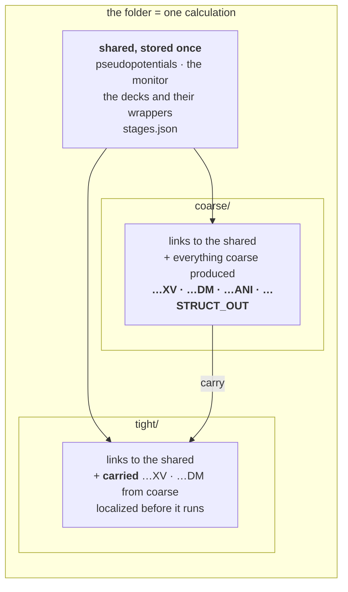
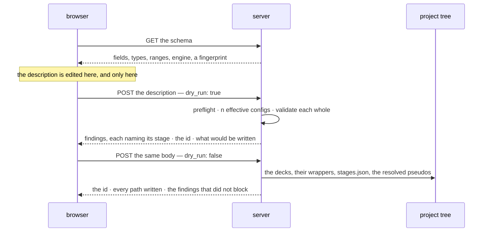

# Staged runs — one system, several parameter sets, one folder

**Role:** plan
**Domain:** web
**Companions:** the two contracts this plan exists to schedule —
[`engines/stages.md`](?doc=engines/stages.md) (what a stage is, the effective
config, `stages.json`) and
[`execution/run-identity.md`](?doc=execution/run-identity.md) (the id, and the
engine parameters that decide whether a stage continues);
[`web/structure-optimization-ui-plan.md`](?doc=web/structure-optimization-ui-plan.md)
— the surface;
[`execution/job-contracts.md`](?doc=execution/job-contracts.md) +
[`execution/running-a-job.md`](?doc=execution/running-a-job.md) — the shipped
ground everything rests on.

**Status: a proposal.** Nothing here is built. This document holds the *why*, the
order of work, and the open questions. **It holds no durable decisions** — those
moved into the two contracts above, and where this plan and a contract disagree,
the contract wins (R3).

> **Reading the cross-references.** A bare `§ n` is a section of *this*
> document. A section of another document is always named with its file —
> `job-contracts.md § 2.3` — because several documents number their sections.

---

## 1. The one sentence

**A user describes one system and the parameter sets they mean to tune it
through; molbuilder writes one correct input file per set into one folder, where
they can be run, switched between, and continued from.**

**What this is not.** It is not an execution system. Nothing here submits a job,
chains one job to the next, or decides when the following thing runs. The
pipeline ends at correct files on disk. Running one is
[`running-a-job.md`](?doc=execution/running-a-job.md)'s job; having a scheduler
run several without you is [`job-system.md`](?doc=execution/job-system.md)'s,
reachable from here as an **export** (§ 7) and never as the destination.

---

## 2. Where the truth lives

Every layer below has exactly one document that decides it. **An implementer
reads that document, not this one.**

| Layer | Sole source of truth | What it fixes |
|---|---|---|
| what a stage is; the effective config; where a promoted field lands; `stages.json` and its preflight | [`engines/stages.md`](?doc=engines/stages.md) | the model, the file, the merge, the three destinations |
| the run id, its normalisation, the folder name, the engine's identity group | [`execution/run-identity.md`](?doc=execution/run-identity.md) | what decides whether a calculation continues |
| the run directory, filenames, the stage suffix, reserved script blocks, warm files, the artifact registry | [`execution/job-contracts.md`](?doc=execution/job-contracts.md) | the on-disk shapes — **unchanged by this work** |
| the project tree: its four levels, who writes at each, how stages and benchmarks compose, where the history sits | [`execution/project-layout.md`](?doc=execution/project-layout.md) | the whole picture the rest of this plan sits inside |
| what a checkpoint history must always hold: the separations, the immutabilities, the atomicity rules | [`execution/checkpointing.md`](?doc=execution/checkpointing.md) | the invariants to review backend behaviour against |
| environments, activation, wrappers, `molbuilder.json`, watching a run, checkpoints | [`execution/running-a-job.md`](?doc=execution/running-a-job.md) | how a run actually happens — **unchanged by this work** (§ 4) |
| what *values* a stage should carry | [`engines/tuning.md`](?doc=engines/tuning.md) | the science of the dial |
| findings: their shape, their one renderer, what blocks | [`science/validation.md`](?doc=science/validation.md) | delivery — a stage label travels beside `where`, never inside it |
| the dependency chain, carry-forward, scheduler resources | [`execution/job-system.md`](?doc=execution/job-system.md) | the optional export (§ 7) |
| the panel, the stage table, the operations on it | [`structure-optimization-ui-plan.md`](?doc=web/structure-optimization-ui-plan.md) | the surface — still a plan, deliberately (§ 8) |

This plan owns only what is left: why the shape is this shape, the order the work
goes in, and what is still undecided.

**To see it whole rather than layer by layer**,
[`execution/worked-example.md`](?doc=execution/worked-example.md) follows one
molecule from a structure file to a published geometry — describe, generate,
benchmark, run, checkpoint, branch. It is where items 12b and 16–18 below came
from: five of the seven gaps it found are **joins between parts that each work**,
which is what a table of layers cannot show you.

---

## 3. Why a stage is ours, not the engine's

The reframe that produced the two contracts, in one paragraph, because everything
else follows from it.

**No engine has a concept of a stage.** SIESTA reads a `.fdf`; PySCF runs a
`.py`. Neither knows the file it was handed is the second of three. So a stage is
molbuilder's own device for holding the parameters a mission tunes over the
shared description of the system it does not — and it must resolve completely at
generate time, leaving an ordinary engine input behind (`engines/stages.md § 1`).

Three consequences shaped everything:

- **The stage object is tiny** — a name, an enabled flag, an overlay. The
  eight-field type shrank because two questions sort every field, and neither
  question asks where the field ends up (`engines/stages.md § 3`).
- **"Switch" and "continue" rest on one basename, not on one directory.**
  `job-contracts.md § 2.1` Rule 2 keeps the basename identical across stages,
  *"which is exactly what lets SIESTA pick up `<basename>.XV` / `.DM` from the
  previous stage."* Continuing is what the **engine** does; molbuilder makes the
  id right and puts the files where it will look (`run-identity.md § 1`). The
  *layout* that puts them there is a stage per subdirectory with the shared files
  above — `engines/stages.md § 7.1`, which is `job-system.md § 5.2`'s materializer
  reused rather than a second one. What stays outside is the **scheduling** half:
  edges, `dep_kind`, submission.
- **Correctness is the deliverable, not a step.** Two gates, both in
  `engines/stages.md`: the deck is complete and stands alone
  (`engines/stages.md § 7`), and every config that will be rendered gets the full
  findings pass — *validated as a resolved whole, never as a diff*
  (`engines/stages.md § 4`, R2).

### 3.1 The folder: common above, one subdirectory per stage



**Every stage keeps its own results.** That is the whole reason for the shape,
and it is the shipped `prep` layout (`job-system.md § 5.2`) reused rather than
reinvented: shared files stored once and linked in, carried files **localized on
run** so a stage never writes through a link into the stage before it.

A flat directory was the earlier answer here and it was wrong. A shared basename
does make continuing free — and it also means every stage overwrites the last.
Not only the restart files: `.ANI`, `.STRUCT_OUT`, `.EIG` and every other engine
output is keyed by `SystemLabel`, which is *identical* across stages by design.
Three stages flat leaves one set of results. For a framework whose point is
managing a mission across several parameter sets, that is a defect rather than a
trade (`engines/stages.md § 7.1`).

**The history is `molbuilder snapshot`, and it is automatic.**
`running-a-job.md § 6` already puts a run directory under git with the small
`.XV`/`.CG` tracked as text *"so a restore brings back a resumable state"* and
big binaries archived by content. `engines/stages.md § 7.3` takes a checkpoint at
the two boundaries that matter — before a replacing produce, and when a stage's
run finishes, tagged with its name — **automatically, whenever the folder is
under checkpoint**. A folder then stops being a state and becomes a chain of
states you can re-enter: branch at coarse, try a different tight, keep both.

Which is why **`snapshot branch` having no HTTP route** (`running-a-job.md § 6.2`)
is the most consequential gap in this design rather than a loose end, and why
`engines/stages.md § 7.4` has to change the checkpoint side: its archive globs
were written flat (`*.DM`), and in this layout the big binaries are one level
down, where those patterns do not reach.

## 4. The environment: nothing here changes it

The execution domain already defines how a job finds its software, for
workstations and for HPC alike, and **this work re-invents none of it.** Stated
once so no reader has to guess, every line citing
[`running-a-job.md`](?doc=execution/running-a-job.md):

| Assumption | Where it is fixed |
|---|---|
| **molbuilder is installed on the machine that generates.** It is not needed on the compute node | `running-a-job.md § 2` — the wrapper is self-contained *at run time* |
| **Everything site-specific is baked at generate/prep.** At run time the wrapper may read only the allocation and the hardware, and only to tune the launch | `running-a-job.md § 2.1` — the T/M/C/A/H rule |
| **The activation form comes from config and has no default.** `script_generation.activation` is `conda activate` or `source activate`; `preamble` carries the `module load` lines. Generating an HPC wrapper **refuses** without an activation | `running-a-job.md § 5.2` |
| **Config is `molbuilder.json` (cwd, then the XDG fallback) plus a project `.molbuilder.json`; project wins** | `running-a-job.md § 5.1` |
| **Environment names are configurable per category** — the four defaults are defaults, not facts. Nothing may hard-code one | `running-a-job.md § 5.4` (`envs`) and `running-a-job.md § 2.3` |
| **Routing is by the script's own content.** A `.fdf` asking for ELPA or GPU routes to the GPU build; a missing environment raises at generate with an install hint | `running-a-job.md § 2.3` |
| **`.sbatch` is emitted only when a `scheduler` block is configured.** A workstation gets `.run.sh` and runs it directly | `running-a-job.md § 5.3` |
| **The doctor verifies and never installs** | `running-a-job.md § 2.2` |

**What this framework adds is exactly one thing:** a folder holds *several*
decks, so it holds several wrappers, and each is routed by its own deck's content
(`engines/stages.md § 5.1`). A coarse stage on ScaLAPACK and a tight stage on
ELPA-GPU activate different environments in the same folder, and nothing in the
machinery above has to change for that to work.

**Two implications, because they are gates rather than conveniences:**

- **The deck is portable; the wrapper is baked.** A deck runs on any machine that
  has the engine. A wrapper carries one target's activation, which is why
  generation happens where that target's config is known.
- **A stage that asks for an absent environment refuses the whole generate — but
  it refuses late.** The install-hint raise (`running-a-job.md § 2.3`) belongs to
  *wrapper* generation, which happens after the decks are rendered, so the failure
  arrives with files already made. That is why the produce is transactional:
  built elsewhere, moved into place only when every part succeeded
  (`engines/stages.md § 7.2`). A folder that is only partly runnable is worse than
  one that was not written.

---

## 5. The two sides, and what crosses

### 5.1 The boundary, as a rule

| | Owns | May **not** |
|---|---|---|
| **the browser** | the description while it is edited: values, which fields vary, the stages and their order | render a deck, resolve a pseudopotential, compute a cell, install a wrapper, read or write the project tree, decide an id's final form |
| **the server** | turning a description into effective configs, validating them, resolving structure and pseudos, computing the cell, writing the folder and its wrappers | hold description state between requests, or invent a value the description did not carry |

**The browser decides what is wanted; the server decides what that means and
whether it can be done correctly.** Neither guesses on the other's behalf — which
is why the description travels whole rather than as a diff, and why nothing the
server derives is sent back for the browser to store.

**One prerequisite falls out of that boundary and belongs to neither side.** A
description *points at* a structure in the tree (`engines/stages.md § 6.3`), so
the structure has to be in the tree before a description can name it. A geometry
the user just loaded from their disk, or edited in the viewer, is not — it lives
in the workspace. Saving it into `projects/<project>/structure/` is therefore a
step of this workflow, not a thing that happens to have happened already, and the
tab has to be able to say so rather than failing at produce with a path that does
not resolve.

The id is the case that tests the rule. `run-identity.md § 3` puts one normaliser
in the system, and it is the server's — so **the tab shows the id the last check
returned**, and an edit that would change it marks it stale until the next check
clears it. The browser displays and invalidates; it never normalises.

### 5.2 What crosses



**One route, one flag.** Check and produce take the identical body, so they are
the same route with `dry_run` — the CLI's idiom already
(`jobset submit --dry-run`) — which makes it impossible for a description that
checks clean to then fail to produce.

**And a fourth exchange, which the design has been assuming without naming:
reopening.** `engines/stages.md § 6.2` justifies `varies` on the grounds that
intent *"cannot be inferred"* from anything downstream — which is only worth
anything if a description can be read back into the tab. So there is a **GET**
that returns a stored `stages.json` for a folder, and the tab restores the values,
the promoted set, the stages and their order from it. Without it the file is
written and never read by the surface that wrote it, and `varies` is a field whose
only reader is a future nobody scheduled.

Two rules it inherits rather than invents: the reopened description goes through
the same preflight (`engines/stages.md § 6.6`), because a file that has sat on
disk is exactly the one whose schema may have moved; and the id is **not**
recomputed — it is read (`run-identity.md § 3`, rule 1), or reopening a folder
would rename it.

```jsonc
{
  "ok": true,
  "id": "bdt_au_relax_c6h4s2au38",
  "written": { "folder":   "projects/BDT-Au/optimization/bdt_au_relax_c6h4s2au38/",
               "decks":    ["…_coarse.fdf", "…_tight.fdf"],
               "wrappers": ["…_coarse.run.sh", "…_tight.run.sh"],
               "description": "…/stages.json" },
  "findings": [ /* warnings that did not block, each naming its stage */ ]
}
```

The paths come back because the browser cannot know them: the id's final form and
the tree's layout are both the server's. A refusal is the same shape with
`ok: false` and the findings that caused it — never a bare error string, because
a preflight that names a field is worth nothing if the surface cannot show which
field.

---

## 6. The decision chain — who dictates what, in order

Overlap between modules is fine. A **loop** is not: if two parties can each
overrule the other, nobody can predict the outcome and nobody can test it. So the
whole system is one sequence, and the rule that keeps it one is:

> **Each step decides within what the steps above it already fixed, and nothing
> later rewrites something earlier.**

| # | Who decides | What it fixes | Fixed by |
|---|---|---|---|
| 1 | the **project tree** | where anything may live: the nine topics, `[A-Za-z0-9_-]+` per segment | `job-contracts.md § 2.5` |
| 2 | the **structure** | which atoms exist — an input, never edited by the generator | `model/structure.md` |
| 3 | **2 + the user's name**, within 1's character set | the **id**, normalised once and then quoted by everything after | `run-identity.md § 2–3` |
| 4 | the **schema** | which fields exist, their types, ranges and `engine_key`s | `web/form-schema.md` |
| 5 | the **description** | values, which fields vary, the stages and their order | `engines/stages.md § 6` |
| 6 | the **preflight** | whether this file can be read here at all | `engines/stages.md § 6.5` |
| 7 | **validation** | whether it may be written: `error` blocks, per stage, on the resolved whole | `science/validation.md` |
| 8 | the **generator** | the decks and their wrappers — the merge, the cell, the pseudos, the identity group, BENCH-MARKS | `engines/stages.md § 7` |
| 9 | the **target's config** | the wrapper's shell: preamble and activation — and generation refuses without an activation, which has no default | `running-a-job.md § 5.2` |
| 10 | the **user** | which deck to run, and when | — this is the point of the framework |
| 11 | the **wrapper**, at run time | ranks, threads, GPU pinning, the run index, the restart banner | `running-a-job.md § 3` |
| 12 | the **engine** | whether warm files are honoured, given those parameters | `job-contracts.md § 4` |

Read it downward and the entanglements disappear:

- **The browser lives entirely in rows 3–5.** That is why § 5.1 can say it never
  renders a deck or computes a cell — those are row 8.
- **The id is fixed at row 3 and quoted by everything after.** No later step
  derives it again, which is why normalising once is a rule rather than an
  optimisation.
- **Row 10 is a person, and that is deliberate.** Every earlier row exists to
  make row 10's choice safe; none of them makes it.
- **Nothing in rows 1–8 knows what a cluster is.** Target isolation is not a
  policy anyone has to remember; it falls out of where row 9 sits.

Rows 6 and 7 both refuse things, and both belong — one asks *can this file be
read here at all*, the other *is this a sound calculation*. They are ordered, so
a description aimed at an engine this backend does not have never receives a
lecture about its mesh cutoff.

---

## 7. Exporting to a scheduler — optional, and downstream

Some day a user will want a scheduler to run the decks in order without being
asked twice, and that framework ships: `job-system.md`'s `stages_to_jobset` turns
a staged config into a ladder, and `prep` / `plan` / `submit` / `status` run it.

**It is an export, not a destination**, and the difference is what it needs that
this framework does not:

| The export needs | Where it comes from |
|---|---|
| `on_nonconvergence` per stage | **only the export.** It becomes the scheduler edge — `proceed → afterany`, `halt → afterok` — and there is no edge without a scheduler (`engines/stages.md § 3`) |
| `Job.carry` per stage | **already in the layout.** Carry is a *layout* mechanism, not a scheduling one — § 3.1 uses it — so the export inherits it rather than asking for it (`engines/stages.md § 7.1`) |
| `Job.resources` per stage | **already in the description.** The export applies the translation `job-contracts.md § 6.2` already fixes, at its own boundary |

Only the first describes *having something else run it* rather than the
calculation, and it is the only thing the export has to ask for. The other two
are already here — carry because the layout needs it whether or not a scheduler
exists, resources because they change the deck (`engines/stages.md § 5`). The
export threads edges through a tree this framework already built.

Two facts to carry forward when it is built:

- **There is one directory shape, not two.** Earlier drafts read
  `job-contracts.md § 2.5`'s flat `<structure>/` and `job-system.md § 5.2`'s
  `point-<name>/` tree as rival layouts needing reconciliation. They are the same
  layout at two levels: `<structure>/` is a directory **of** run directories, and
  each per-stage subdirectory is the flat one-job-per-directory shape
  `job-contracts.md § 2.1` describes. This framework and the export produce the
  same tree; the export adds edges to it.
- **`JobSet.name` should be the id**, and the submitter's `-J` should carry it.
  Today a ladder's scheduler name is the bare stage name
  (`job-contracts.md § 6.3`), so three concurrent ladders show
  `coarse coarse coarse` in `squeue`.

---

## 8. The order of work

**Step 1 — the two contracts.** Done: [`engines/stages.md`](?doc=engines/stages.md)
and [`execution/run-identity.md`](?doc=execution/run-identity.md). What remains
is agreeing them and answering § 9.

**Step 1a — one blocking decision, before any code.** `Repo.init` refuses a
directory whose subdirectories hold a working-dir marker
(`NestedRepoRefusedError`, *"each lowest-directory must be its own checkpoint
repo"*), and `engines/stages.md § 7.1`'s layout is exactly such a directory —
**verified, not inferred**. So the folder this design specifies cannot be
checkpointed at all, and every item below that touches history depends on the
answer. `execution/checkpointing.md` L1 states the three options and recommends
one: teach the guard that a parent holding a description is one calculation
rather than several. *Done when:* a produced two-stage folder can be
`snapshot init`-ed, and a folder holding two unrelated run directories still
cannot.

**Step 2 — the backend, built to those contracts.**

1. **Settle which of the duplicated fields wins today.** `relax_force_tol` and
   `relax_max_displ` sit on the shared config *and* on the stage spec. *Done
   when:* a test says which value a staged render uses when the two disagree —
   because that is the behaviour anyone relying on it has already built on.
2. **The stage spec shrinks to three fields** (`engines/stages.md § 2–3`). Five
   of the eight become ordinary shared-config fields — the four relaxation values
   plus `continue_retries`, routed to the wrapper-install surface that already
   honours it. `on_nonconvergence` moves to the JobSet producer's own input.
   *Done when:* a stage with no overrides renders exactly what it renders today,
   no field of the shared schema has a second home, a per-stage
   `continue_retries` reaches that stage's wrapper, and the ladder producer still
   derives the same edges.
3. **`overrides` and the effective-config merge** (`engines/stages.md § 4`).
   *Done when:* a stage with `{mesh_cutoff: 300}` renders a deck carrying 300
   while the shared config still says 150, and the object validated is the object
   rendered.
4. **`restart` and the engine identity group** (`run-identity.md § 4`). *Done
   when:* a two-stage description whose second stage continues renders every
   bound parameter set, and a stage set to `clean` renders none — asserted
   together, since the failure mode is that they disagree — **and** the group is
   written down beside the warm files it governs, which is `job-contracts.md § 4`
   and therefore a doc change in the same commit as the code (`§ 7` there).
5. **Resource-shaped overrides reach all three destinations**
   (`engines/stages.md § 5`). *Done when:* a description asking for ScaLAPACK
   then ELPA renders two decks whose solver differs **and** two wrappers
   activating different environments; and a stage varying `mpi_np` renders a deck
   whose `BlockSize` came from *that* stage's rank count, with BENCH-MARKS
   declaring it.
6. **`stages.json`, its reader, and the preflight** (`engines/stages.md § 6`).
   *Done when:* a description round-trips — read, rendered, re-read — one naming
   a dead field fails with that field's name, one with a repeated stage name fails
   naming the repeat, and the artifact registry (`job-contracts.md § 6.1`) has its
   row. **One reader, used by both surfaces** (`engines/stages.md § 6.4`) — that
   is what makes item 8's byte comparison meaningful rather than a coincidence.
7. **Validation, per stage and across them** (`engines/stages.md § 4`). *Done
   when:* a description whose coarse stage is under-converged reports against
   `coarse` alone, through the one renderer, with the stage beside `where` — and a
   ladder that *loosens* between stages reports once, with **no** stage label,
   because that is a fact about the sequence rather than about a member of it
   (R3).
8. **The route, both directions.** *Done when:* a description posted to it writes
   the same bytes the CLI writes for the same stages — compared file by file,
   **excluding PROVENANCE's `generated-at`**, which stamps generation time
   (`job-contracts.md § 3.2`) and so differs between any two produces; that is the
   only legitimate exclusion. The folder holds a **runnable wrapper per deck**, not
   decks alone, and a **GET returns a written description** such that reopening it
   and producing again yields the identical folder (§ 5.2).
9. **The second surface.** "One reader for both" (`engines/stages.md § 6.4`) needs
   a CLI verb that writes and consumes a description, or item 8's byte comparison
   has nothing to compare against. *Done when:* the same description produces the
   same folder from a terminal and from the browser, and neither path has a
   renderer the other lacks.
10. **Archive only what is new** (`checkpointing.md` L5) — **before** item 11,
    because it gates it. Immutable attempts
    (`execution/project-layout.md` § 1.2) make this structural: an archived
    attempt cannot change, so a save stores the attempts that appeared since the
    last one and references the rest. No content-addressed store needed. The archive is keyed by commit sha and copies
    every big binary on every checkpoint; automatic checkpoints fire twice per
    stage, and `prune` is unbuilt, so the two together grow the disk without
    bound. *Done when:* a second checkpoint with the binaries untouched costs
    near-zero incremental disk, and the shipped guide's *"deduped by content"*
    becomes true rather than aspirational. Add **`snapshot verify`** while there
    (L6): the check already exists and is reachable only by attempting a restore.
11. **Checkpoints at the two stage boundaries, and `branch` over HTTP** — gated
    on **step 1a**, without which none of it can run
    (`engines/stages.md § 7.3`). *Done when:* a replacing produce leaves a commit
    holding the folder as it was; a stage seen to finish leaves a commit **and a
    tag named `<id>/<stage>/<UTC>`**, with a message carrying the id, the stage
    and how the run went; `git tag --list '<id>/<stage>/*'` answers "every
    checkpoint of this stage"; a folder molbuilder produces into is initialised
    if it was not already; and the browser can branch from a tag, with the branch
    name proposed from the stage it forks. **The wrapper does none of it**
    (`running-a-job.md § 6.2`: it is deliberately git-agnostic), so the finish is
    observed where the run is already watched.
12. **The archive covers runs, not containers**
    (`execution/project-layout.md` § 6.1). Every directory is one or the other,
    so the classification is positional and needs no marker file: a flat root or
    a stage's `run-N/` is archived; a benchmark's `point-*/`, two levels down, is
    not. *Done when:* a produced folder with a bench bundle archives the stage's
    results and none of the trials', and the rule is depth rather than a name.
12a. ~~**One run directory per attempt**~~ — **the wrapper half is done**
    (2026-08-06). `render_run_wrapper(..., attempt_dirs=True)` resolves the next
    attempt, builds `run-<n>/`, links inputs, copies the previous attempt's warm
    state, and cds in; `--force` **refuses** rather than being ignored. Ten tests
    run it for real against a fake engine that writes nothing, so a carried file
    can only have been carried. A flat directory is untouched. **What remains:**
    the producer passing the flag, and the run decoder learning that a stage's
    attempts are `run-N/` rather than `-runN.out`.
12b. **The carry has to survive attempt directories — a regression, so it goes
    first.** ⚠ Found by walking the workflow end to end
    ([`worked-example.md`](?doc=execution/worked-example.md) § 6). `materialize`
    writes a stage's carry as a symlink to `../<producer>/<id>.XV`, which is
    where a stage's output lived until 12a moved it into `run-N/`. The link now
    dangles, and *which* attempt is the right one cannot be known when `prep`
    runs, because the runs have not happened. **The fix is a stable name, now
    specified** — [`project-layout.md`](?doc=execution/project-layout.md) § 1.3:
    the wrapper writes `run-latest -> run-<n>` in the container as its last act,
    **only when the engine exits 0**, and the carry targets
    `../<producer>/run-latest/<id>.XV`. Resolvable at prep time, correct at run
    time, no hashing and no registry, and a crashed attempt leaves the pointer
    where it was. It pays twice: the viewer and the status roll-up both currently
    have to guess which attempt is current. **Two things ride along.** First,
    gap 6, because it is the same expression: `materialize.job_dir_name` returns
    `point-<name>` for every job, so a ladder gets the sweep's naming — it must
    branch on `JobSet.kind` (§ 4.4 there). Second, ⚠ **the from-inside-an-attempt
    guard has to move to the physical path first** (§ 1.3, *One guard has to be
    fixed first*): it matches `${PWD##*/}` against `run-[0-9]*`, and `$PWD` is
    logical, so `cd run-latest` defeats it and the wrapper nests `run-0/` inside
    the attempt — **verified, not inferred**. `$(pwd -P)` fixes it, and is worth
    it regardless: any symlink route in defeats the logical form. *Done when:* a
    two-stage folder prepped before either stage runs, then run in order, starts
    the second stage from the first stage's geometry; the stage directories are
    `01_<name>`/`02_<name>`; a benchmark's points still read `point-*`; a failed
    attempt does not move the pointer; a stage with no completed attempt has none;
    and running the wrapper from inside `run-latest/` exits 2 like running it
    from inside `run-0/`.
13. ~~**The archive globs reach into the subdirectories**~~ — **done
    (2026-08-06)**, together with L7. The MANIFEST key is a repo-relative path,
    the walk is recursive and skips symlinks and dot-directories, a binary-only
    change now produces a checkpoint, and every commit gets an archive so a
    missing one is evidence rather than a hint. `job-contracts.md § 6.1` updated
    in the same commit; 119 checkpoint tests pass.
14. **Repoint `checkpoint.py`'s dead doc references.** It cites
    `run-checkpoints.md` five times — a document the 2026-07 migration removed —
    and cites numbered principles from it that nothing now defines. *Done when:*
    each reference points at the section that owns it today
    ([`checkpointing.md`](?doc=execution/checkpointing.md) for the invariants,
    [`running-a-job.md`](?doc=execution/running-a-job.md) `§ 6` for the workflow),
    and no docstring names a file that is not in the tree.
15. **The checkpoint invariants become tests**
    ([`checkpointing.md`](?doc=execution/checkpointing.md) `§ 6`). Eighteen, of
    which **eleven can be asserted against the code as it stands** and need none
    of this project's other work. *Done when:* all eighteen have an assertion, and
    the two that catch silent failures run over a real produced folder rather than
    a fixture — **I2** (every MANIFEST entry matches its file by name, size and
    sha256) and **S1** (tracked XOR archived, never both, never neither).
    Worth starting **before** step 2 rather than after it: they are the check that
    tells you whether items 10 and 11 broke anything.

16. **Saving a structure into the project tree.** The description *points at* a
    structure (`engines/stages.md § 6.3`), so a geometry that only exists in the
    workspace cannot be described — and today no surface owns putting it
    somewhere with a path, which makes it the first wall a user hits
    ([`worked-example.md`](?doc=execution/worked-example.md) § 2). *Done when:*
    a loaded or edited structure can be written to
    `<project>/structure/<name>.xyz` with its sidecar, and the description form
    can pick it without the user typing a path.
17. **Connect a benchmark to the stage it measures.** Every part exists —
    `bench generate` takes a deck and an output directory — but nothing composes
    them, records which stage a bundle measures, or notices when the pairing is
    wrong. *Done when:* one command derives a stage's benchmark into
    `<stage>/bench/` from that stage's own deck, and the bundle names the stage
    it came from.
18. **The measured answer reaches the description, not just a script.** The
    shipped chain stops one step short: `bench summarize` writes
    `bench-result.json` and `bench prep-run` turns it into `run-production.sh`,
    but `stages.json` never learns — so the next `generate`, which rebuilds
    everything from the description, silently reverts to the defaults. *Done
    when:* a benchmark verdict can be written back as that stage's resource
    overrides, and re-producing keeps the measured configuration.

**Step 3 — the surface.** The description model first (pure, tested), then the
matrix view, then the subtabs.
[`structure-optimization-ui-plan.md`](?doc=web/structure-optimization-ui-plan.md)
§ 7 specifies the first, and it stays a **plan** rather than a contract until
step 2 is done — a module contract is written when the module is about to be
built, the way [`spectrumchart.md`](?doc=web/spectrumchart.md) was.

**The gate between 2 and 3:** the backend must be able to render a stage that
overrides a parameter the stage type never carried, before any of it is drawn —
or the UI will be designed around what the model happens to allow rather than
what a user needs.

---

## 9. Open questions

1. **Is `stages.json` the right name?** It sidesteps the four-way collision the
   word *plan* already has in this domain (`jobset plan` the verb,
   `STAGE-PLAN.md` the file, "Job-set plan" the registry label for
   `job-set.json`).
2. **Should the folder really be named by the id** (`run-identity.md § 3`)? It
   removes a second name and makes a directory listing self-describing, at the
   cost of a folder called `bdt_au_relax_c6h4s2au38` where someone would have
   typed `bdt-relax`.
3. **Is the user's half of the id editable after the fact?** Renaming orphans the
   warm files, which is right in principle and will surprise someone who meant to
   fix a typo — and if question 2 is yes, it moves the folder too. Letting it be
   typed keeps a door open to deliberately continuing from an unrelated run's
   state, which is occasionally what a person wants.
4. **What are the "components" of a composite system?** A junction is a molecule
   *and* two electrodes; naming it by total formula loses that structure, and
   naming it by parts needs a convention for what a part is.
5. **When does the readable id stop being enough?** A formula does not tell two
   isomers apart, and does not pin the *order* species are declared in — and a
   `.XV` read against a different order lands every coordinate on the wrong atom.
   The likely answer is a short pin appended when and only when the readable part
   cannot separate two things in the same project.
6. **Do the cell *parameters* belong in the identity?** `run-identity.md § 5`
   says report rather than pin. Putting them in the id would orphan a geometry
   every time somebody widened a box.
7. **Is a description editable by hand?** It is JSON beside the decks, so it will
   be. If yes, the reader owes the same errors to a person as to the browser — an
   argument for the refusal rule being loud rather than tolerant.
8. ~~**The trajectory log's stage naming does not match the deck's**~~ —
   **answered** by `execution/project-layout.md § 4.1`: a stage carries a `seq`
   assigned once and never reassigned, and that *is* the `N` in
   `<label>-stage<N>`. The deck keeps the name, the log and the directory carry
   the number, and because the number never moves, an output written under it
   stays attached to the stage that produced it. What remains is the code change
   in `job-contracts.md § 2.3`, not a decision.

   *(The original wording, for the record:)* **the two conventions do not agree.** A stage deck is `<label>_<stagename>`, an underscore and a *name*;
   the molwatch log is `<label>-stage<N>`, a hyphen and a *number*, and the run
   decoder's stage regex keys on the hyphen form (`job-contracts.md § 2.3`).
   User-named stages cannot be expressed in a number. **The consequence is not
   cosmetic:** `job-contracts.md § 2.3` merges a directory's logs into one
   trajectory with a boundary per stage — the exact reading a folder of stages
   wants — and that only works while each deck writes its own. Two decks resolving
   to one basename interleave into a single file and the boundary is gone. So this
   is decided before decks are generated, not after, and `job-contracts.md § 2.3`
   is where.
9. **May two enabled stages be identical?** Nothing forbids it, and the answer is
   probably "warn": two decks differing in nothing but their name produce the
   same calculation twice into the same warm state.
10. **Who creates the stage containers when the host and the target are the same
    machine?** The producer writes the calculation level; `prep` lays out the
    per-stage directories — but `prep` is a *target-side* verb, meant to run
    after the folder is copied to a cluster. On a workstation there is no copy,
    and nothing says whether generate should have done it already
    ([`worked-example.md`](?doc=execution/worked-example.md) § 4). One sentence
    either way; it is unstated rather than contested.
