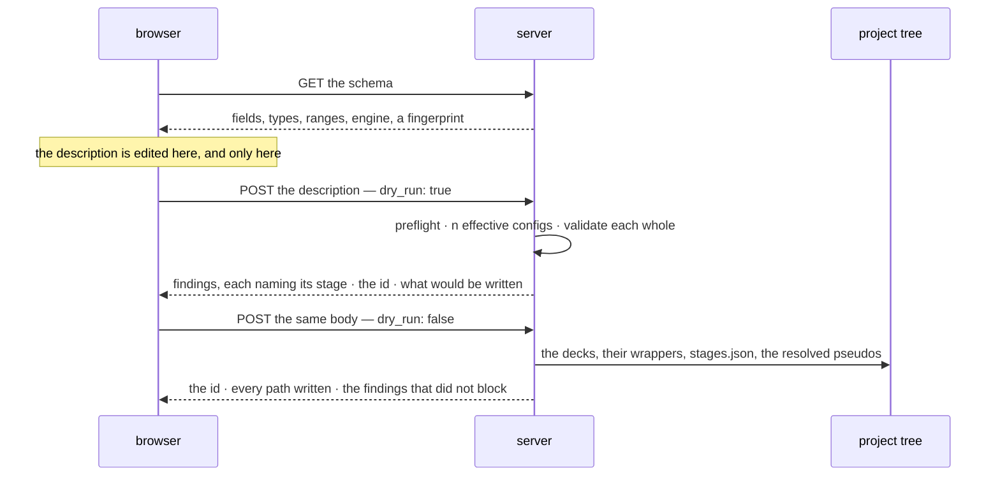

# Staged runs — one system, several parameter sets, one folder

**Role:** plan
**Domain:** web
**Companions:** the two contracts this plan exists to schedule —
[`engines/stages.md`](?doc=engines/stages.md) (what a stage is, the effective
config, `stages.json`) and
[`execution/run-identity.md`](?doc=execution/run-identity.md) (the id, and the
engine parameters that decide whether a stage continues);
[`web/structure-optimization-ui-plan.md`](?doc=web/structure-optimization-ui-plan.md)
— the surface;
[`execution/job-contracts.md`](?doc=execution/job-contracts.md) +
[`execution/running-a-job.md`](?doc=execution/running-a-job.md) — the shipped
ground everything rests on.

**Status: a proposal.** Nothing here is built. This document holds the *why*, the
order of work, and the open questions. **It holds no durable decisions** — those
moved into the two contracts above, and where this plan and a contract disagree,
the contract wins (R3).

> **Reading the cross-references.** A bare `§ n` is a section of *this*
> document. A section of another document is always named with its file —
> `job-contracts.md § 2.3` — because several documents number their sections.

---

## 1. The one sentence

**A user describes one system and the parameter sets they mean to tune it
through; molbuilder writes one correct input file per set into one folder, where
they can be run, switched between, and continued from.**

**What this is not.** It is not an execution system. Nothing here submits a job,
chains one job to the next, or decides when the following thing runs. The
pipeline ends at correct files on disk. Running one is
[`running-a-job.md`](?doc=execution/running-a-job.md)'s job; having a scheduler
run several without you is [`job-system.md`](?doc=execution/job-system.md)'s,
reachable from here as an **export** (§ 7) and never as the destination.

---

## 2. Where the truth lives

Every layer below has exactly one document that decides it. **An implementer
reads that document, not this one.**

| Layer | Sole source of truth | What it fixes |
|---|---|---|
| what a stage is; the effective config; where a promoted field lands; `stages.json` and its preflight | [`engines/stages.md`](?doc=engines/stages.md) | the model, the file, the merge, the three destinations |
| the run id, its normalisation, the folder name, the engine's identity group | [`execution/run-identity.md`](?doc=execution/run-identity.md) | what decides whether a calculation continues |
| the run directory, filenames, the stage suffix, reserved script blocks, warm files, the artifact registry | [`execution/job-contracts.md`](?doc=execution/job-contracts.md) | the on-disk shapes — **unchanged by this work** |
| the project tree: its four levels, who writes at each, how stages and benchmarks compose, where the history sits | [`execution/project-layout.md`](?doc=execution/project-layout.md) | the whole picture the rest of this plan sits inside |
| what a checkpoint history must always hold: the separations, the immutabilities, the atomicity rules | [`execution/checkpointing.md`](?doc=execution/checkpointing.md) | the invariants to review backend behaviour against |
| environments, activation, wrappers, `molbuilder.json`, watching a run, checkpoints | [`execution/running-a-job.md`](?doc=execution/running-a-job.md) | how a run actually happens. The environment half is **unchanged by this work** (§ 4); `running-a-job.md § 2.2a` is new — **what a wrapper may do**, and why everything else is Python |
| what *values* a stage should carry | [`engines/tuning.md`](?doc=engines/tuning.md) | the science of the dial |
| findings: their shape, their one renderer, what blocks | [`science/validation.md`](?doc=science/validation.md) | delivery — a stage label travels beside `where`, never inside it |
| the dependency chain, carry-forward, scheduler resources | [`execution/job-system.md`](?doc=execution/job-system.md) | the optional export (§ 7) |
| the panel, the stage table, the operations on it | [`structure-optimization-ui-plan.md`](?doc=web/structure-optimization-ui-plan.md) | the surface — still a plan, deliberately (§ 8) |

This plan owns only what is left: why the shape is this shape, the order the work
goes in, and what is still undecided.

**To see it whole rather than layer by layer**,
[`execution/worked-example.md`](?doc=execution/worked-example.md) follows one
molecule from a structure file to a published geometry — describe, generate,
benchmark, run, checkpoint, branch. It is where items 12b and 16–18 below came
from: five of the seven gaps it found are **joins between parts that each work**,
which is what a table of layers cannot show you.

**Three rules cut across every item below.** Stated once each, not repeated:

- **The wrapper activates an environment and execs an engine; every directory and
  every link is made by Python**
  ([`running-a-job.md`](?doc=execution/running-a-job.md) § 2.2a). The system was
  already built that way, and item 12a is where it drifted.
- **Stages do not chain** — each is set up and submitted on its own, after you
  have looked at the last ([`project-layout.md`](?doc=execution/project-layout.md)
  § 1.3). That is § 1 above taken literally.
- **The browser writes a portable package; the target machine finishes it**
  (`project-layout.md` § 2). Data files, a deck template, `stages.json` and
  resource intent — none of it naming a machine. `prep`, on the machine that will
  run it, renders the deck and wrapper and builds the run directory, because
  `BlockSize` comes from the rank count and the eigensolver picks the conda
  environment: a deck finished on a laptop is guessing. **And `prep` is a hub you
  return to** — for a benchmark, for the real run using what it measured, for a
  redo, for the next stage — which is where the user does the joining.

---

## 3. Why a stage is ours, not the engine's

The reframe that produced the two contracts, in one paragraph, because everything
else follows from it.

**No engine has a concept of a stage.** SIESTA reads a `.fdf`; PySCF runs a
`.py`. Neither knows the file it was handed is the second of three. So a stage is
molbuilder's own device for holding the parameters a mission tunes over the
shared description of the system it does not — and it must resolve completely at
generate time, leaving an ordinary engine input behind (`engines/stages.md § 1`).

Three consequences shaped everything:

- **The stage object is tiny** — a name, an enabled flag, an overlay. The
  eight-field type shrank because two questions sort every field, and neither
  question asks where the field ends up (`engines/stages.md § 3`).
- **"Switch" and "continue" rest on one basename, not on one directory.**
  `job-contracts.md § 2.1` Rule 2 keeps the basename identical across stages,
  *"which is exactly what lets SIESTA pick up `<basename>.XV` / `.DM` from the
  previous stage."* Continuing is what the **engine** does; molbuilder makes the
  id right and puts the files where it will look (`run-identity.md § 1`). The
  *layout* that puts them there is a stage per subdirectory with the shared files
  above — `engines/stages.md § 7.1`, which is `job-system.md § 5.2`'s materializer
  reused rather than a second one. What stays outside is the **scheduling** half:
  edges, `dep_kind`, submission.
- **Correctness is the deliverable, not a step.** Two gates, both in
  `engines/stages.md`: the deck is complete and stands alone
  (`engines/stages.md § 7`), and every config that will be rendered gets the full
  findings pass — *validated as a resolved whole, never as a diff*
  (`engines/stages.md § 4`, R2).

### 3.1 The folder: common above, one subdirectory per stage


**Every stage keeps its own results.** That is the whole reason for the shape,
and it is the shipped `prep` layout (`job-system.md § 5.2`) reused rather than
reinvented: shared files stored once and linked in.

What differs from that layout is the **carry**. `prep` lays a link into the
producer's directory because it expects the whole chain to be submitted at once.
Here nothing is chained: you set up the tight stage *after* looking at coarse, so
the file you want is already sitting there and gets **copied in** — a real file,
put there when you chose it (`project-layout.md § 1.3`). Nothing points at a
result that does not exist yet, so nothing has to be repaired later.

A flat directory was the earlier answer here and it was wrong. A shared basename
does make continuing free — and it also means every stage overwrites the last.
Not only the restart files: `.ANI`, `.STRUCT_OUT`, `.EIG` and every other engine
output is keyed by `SystemLabel`, which is *identical* across stages by design.
Three stages flat leaves one set of results. For a framework whose point is
managing a mission across several parameter sets, that is a defect rather than a
trade (`engines/stages.md § 7.1`).

**The history is `molbuilder snapshot`, and it is automatic.**
`running-a-job.md § 6` already puts a run directory under git with the small
`.XV`/`.CG` tracked as text *"so a restore brings back a resumable state"* and
big binaries archived by content. `engines/stages.md § 7.3` takes a checkpoint at
the two boundaries that matter — before a replacing produce, and when a stage's
run finishes, tagged with its name — **automatically, whenever the folder is
under checkpoint**. A folder then stops being a state and becomes a chain of
states you can re-enter: branch at coarse, try a different tight, keep both.

Which is why **`snapshot branch` having no HTTP route** (`running-a-job.md § 6.2`)
is the most consequential gap in this design rather than a loose end, and why
`engines/stages.md § 7.4` has to change the checkpoint side: its archive globs
were written flat (`*.DM`), and in this layout the big binaries are one level
down, where those patterns do not reach.

## 4. The environment: nothing here changes it

The execution domain already defines how a job finds its software, for
workstations and for HPC alike, and **this work re-invents none of it.** Stated
once so no reader has to guess, every line citing
[`running-a-job.md`](?doc=execution/running-a-job.md):

| Assumption | Where it is fixed |
|---|---|
| **molbuilder is installed on the machine that generates.** It is not needed on the compute node | `running-a-job.md § 2` — the wrapper is self-contained *at run time* |
| **Everything site-specific is baked at generate/prep.** At run time the wrapper may read only the allocation and the hardware, and only to tune the launch | `running-a-job.md § 2.1` — the T/M/C/A/H rule |
| **The activation form comes from config and has no default.** `script_generation.activation` is `conda activate` or `source activate`; `preamble` carries the `module load` lines. Generating an HPC wrapper **refuses** without an activation | `running-a-job.md § 5.2` |
| **Config is `molbuilder.json` (cwd, then the XDG fallback) plus a project `.molbuilder.json`; project wins** | `running-a-job.md § 5.1` |
| **Environment names are configurable per category** — the four defaults are defaults, not facts. Nothing may hard-code one | `running-a-job.md § 5.4` (`envs`) and `running-a-job.md § 2.3` |
| **Routing is by the script's own content.** A `.fdf` asking for ELPA or GPU routes to the GPU build; a missing environment raises at generate with an install hint | `running-a-job.md § 2.3` |
| **`.sbatch` is emitted only when a `scheduler` block is configured.** A workstation gets `.run.sh` and runs it directly | `running-a-job.md § 5.3` |
| **The doctor verifies and never installs** | `running-a-job.md § 2.2` |

**What this framework adds is exactly one thing:** a folder holds *several*
decks, so it holds several wrappers, and each is routed by its own deck's content
(`engines/stages.md § 5.1`). A coarse stage on ScaLAPACK and a tight stage on
ELPA-GPU activate different environments in the same folder, and nothing in the
machinery above has to change for that to work.

**Two implications, because they are gates rather than conveniences:**

- **The deck is portable; the wrapper is baked.** A deck runs on any machine that
  has the engine. A wrapper carries one target's activation, which is why
  generation happens where that target's config is known.
- **A stage that asks for an absent environment refuses the whole generate — but
  it refuses late.** The install-hint raise (`running-a-job.md § 2.3`) belongs to
  *wrapper* generation, which happens after the decks are rendered, so the failure
  arrives with files already made. That is why the produce is transactional:
  built elsewhere, moved into place only when every part succeeded
  (`engines/stages.md § 7.2`). A folder that is only partly runnable is worse than
  one that was not written.

---

## 5. The two sides, and what crosses

### 5.1 The boundary, as a rule

| | Owns | May **not** |
|---|---|---|
| **the browser** | the description while it is edited: values, which fields vary, the stages and their order | render a deck, resolve a pseudopotential, compute a cell, install a wrapper, read or write the project tree, decide an id's final form |
| **the server** | turning a description into effective configs, validating them, resolving structure and pseudos, computing the cell, writing the folder and its wrappers | hold description state between requests, or invent a value the description did not carry |

**The browser decides what is wanted; the server decides what that means and
whether it can be done correctly.** Neither guesses on the other's behalf — which
is why the description travels whole rather than as a diff, and why nothing the
server derives is sent back for the browser to store.

**One prerequisite falls out of that boundary and belongs to neither side.** A
description *points at* a structure in the tree (`engines/stages.md § 6.3`), so
the structure has to be in the tree before a description can name it. A geometry
the user just loaded from their disk, or edited in the viewer, is not — it lives
in the workspace. Saving it into `projects/<project>/structure/` is therefore a
step of this workflow, not a thing that happens to have happened already, and the
tab has to be able to say so rather than failing at produce with a path that does
not resolve.

The id is the case that tests the rule. `run-identity.md § 3` puts one normaliser
in the system, and it is the server's — so **the tab shows the id the last check
returned**, and an edit that would change it marks it stale until the next check
clears it. The browser displays and invalidates; it never normalises.

### 5.2 What crosses



**One route, one flag.** Check and produce take the identical body, so they are
the same route with `dry_run` — the CLI's idiom already
(`jobset submit --dry-run`) — which makes it impossible for a description that
checks clean to then fail to produce.

**And a fourth exchange, which the design has been assuming without naming:
reopening.** `engines/stages.md § 6.2` justifies `varies` on the grounds that
intent *"cannot be inferred"* from anything downstream — which is only worth
anything if a description can be read back into the tab. So there is a **GET**
that returns a stored `stages.json` for a folder, and the tab restores the values,
the promoted set, the stages and their order from it. Without it the file is
written and never read by the surface that wrote it, and `varies` is a field whose
only reader is a future nobody scheduled.

Two rules it inherits rather than invents: the reopened description goes through
the same preflight (`engines/stages.md § 6.6`), because a file that has sat on
disk is exactly the one whose schema may have moved; and the id is **not**
recomputed — it is read (`run-identity.md § 3`, rule 1), or reopening a folder
would rename it.

```jsonc
{
  "ok": true,
  "id": "bdt_au_relax_c6h4s2au38",
  "written": { "folder":   "projects/BDT-Au/optimization/bdt_au_relax_c6h4s2au38/",
               "decks":    ["…_coarse.fdf", "…_tight.fdf"],
               "wrappers": ["…_coarse.run.sh", "…_tight.run.sh"],
               "description": "…/stages.json" },
  "findings": [ /* warnings that did not block, each naming its stage */ ]
}
```

The paths come back because the browser cannot know them: the id's final form and
the tree's layout are both the server's. A refusal is the same shape with
`ok: false` and the findings that caused it — never a bare error string, because
a preflight that names a field is worth nothing if the surface cannot show which
field.

---

## 6. The decision chain — who dictates what, in order

Overlap between modules is fine. A **loop** is not: if two parties can each
overrule the other, nobody can predict the outcome and nobody can test it. So the
whole system is one sequence, and the rule that keeps it one is:

> **Each step decides within what the steps above it already fixed, and nothing
> later rewrites something earlier.**

| # | Who decides | What it fixes | Fixed by |
|---|---|---|---|
| 1 | the **project tree** | where anything may live: the nine topics, `[A-Za-z0-9_-]+` per segment | `job-contracts.md § 2.5` |
| 2 | the **structure** | which atoms exist — an input, never edited by the generator | `model/structure.md` |
| 3 | **2 + the user's name**, within 1's character set | the **id**, normalised once and then quoted by everything after | `run-identity.md § 2–3` |
| 4 | the **schema** | which fields exist, their types, ranges and `engine_key`s | `web/form-schema.md` |
| 5 | the **description** | values, which fields vary, the stages and their order | `engines/stages.md § 6` |
| 6 | the **preflight** | whether this file can be read here at all | `engines/stages.md § 6.5` |
| 7 | **validation** | whether it may be written: `error` blocks, per stage, on the resolved whole | `science/validation.md` |
| 8 | the **generator** | the decks and their wrappers — the merge, the cell, the pseudos, the identity group, BENCH-MARKS | `engines/stages.md § 7` |
| 9 | the **target's config** | the wrapper's shell: preamble and activation — and generation refuses without an activation, which has no default | `running-a-job.md § 5.2` |
| 10 | the **user** | which deck to run, and when | — this is the point of the framework |
| 11 | the **wrapper**, at run time | ranks, threads, GPU pinning, the run index, the restart banner | `running-a-job.md § 3` |
| 12 | the **engine** | whether warm files are honoured, given those parameters | `job-contracts.md § 4` |

Read it downward and the entanglements disappear:

- **The browser lives entirely in rows 3–5.** That is why § 5.1 can say it never
  renders a deck or computes a cell — those are row 8.
- **The id is fixed at row 3 and quoted by everything after.** No later step
  derives it again, which is why normalising once is a rule rather than an
  optimisation.
- **Row 10 is a person, and that is deliberate.** Every earlier row exists to
  make row 10's choice safe; none of them makes it.
- **Nothing in rows 1–8 knows what a cluster is.** Target isolation is not a
  policy anyone has to remember; it falls out of where row 9 sits.

Rows 6 and 7 both refuse things, and both belong — one asks *can this file be
read here at all*, the other *is this a sound calculation*. They are ordered, so
a description aimed at an engine this backend does not have never receives a
lecture about its mesh cutoff.

---

## 7. Exporting to a scheduler — optional, and downstream

Some day a user will want a scheduler to run the decks in order without being
asked twice, and that framework ships: `job-system.md`'s `stages_to_jobset` turns
a staged config into a ladder, and `prep` / `plan` / `submit` / `status` run it.

**It is an export, not a destination**, and the difference is what it needs that
this framework does not:

| The export needs | Where it comes from |
|---|---|
| `on_nonconvergence` per stage | **only the export.** It becomes the scheduler edge — `proceed → afterany`, `halt → afterok` — and there is no edge without a scheduler (`engines/stages.md § 3`) |
| `Job.carry` per stage | **already in the layout.** Carry is a *layout* mechanism, not a scheduling one — § 3.1 uses it — so the export inherits it rather than asking for it (`engines/stages.md § 7.1`) |
| `Job.resources` per stage | **already in the description.** The export applies the translation `job-contracts.md § 6.2` already fixes, at its own boundary |

Only the first describes *having something else run it* rather than the
calculation, and it is the only thing the export has to ask for. The other two
are already here — carry because the layout needs it whether or not a scheduler
exists, resources because they change the deck (`engines/stages.md § 5`). The
export threads edges through a tree this framework already built.

Two facts to carry forward when it is built:

- **The hierarchy is the flat shape nested, not a rival to it.**
  `job-contracts.md § 2.5`'s `<structure>/` and `job-system.md § 5.2`'s
  `point-<name>/` tree are the same layout at two levels: each leaf is the
  one-job-per-directory shape `job-contracts.md § 2.1` describes, and the tree is
  a directory *of* those. `project-layout.md § 1` makes the choice between them
  explicit; nothing about the export changes which one you are in. This framework
  and the export produce the same tree — the export adds edges to it.
- **`JobSet.name` should be the id**, and the submitter's `-J` should carry it.
  Today a ladder's scheduler name is the bare stage name
  (`job-contracts.md § 6.3`), so three concurrent ladders show
  `coarse coarse coarse` in `squeue`.

---

## 8. The order of work

**Step 1 — the two contracts.** Done: [`engines/stages.md`](?doc=engines/stages.md)
and [`execution/run-identity.md`](?doc=execution/run-identity.md). What remains
is agreeing them and answering § 9.

**Step 1a — the repo-scope blocker.** ~~`Repo.init` refuses a directory whose
subdirectories hold a working-dir marker, and the staged layout is exactly such a
directory~~ — **fixed 2026-08-06** (`execution/checkpointing.md` L1). A root
carrying its description (`stages.json`, `job-set.json`, `bench-manifest.json`)
now owns its subdirectories; a directory declaring nothing is still refused, and
a subdirectory that is already a repository is refused in either case. The fix
also unblocked something already shipped: `jobset prep` bundles had never been
checkpointable. Eight tests in `tests/test_checkpoint_repo_scope.py`, including a
hierarchical round-trip — init, checkpoint, change a later stage, restore, and
the first stage's `.DM` two levels down comes back.

**Step 1b — the questions that gate code, in one place.** These are decisions
rather than research, and each names what it holds up:

| # | Question | Where | Blocks |
|---|---|---|---|
| 1 | **The command shapes** — stage as positional, `jobset` vs promoting `prep` to top level, and whether `molbuilder run` keeps a name that does not run | step 1c below | **12a** — retiring the shell block removes the only way to run a stage by hand |
| 2 | **How you ask for the shape** — `--flat`, a field in the description, or inferred | `project-layout.md § 8` q5 | **12b** — `prep` cannot build a tree without knowing which |
| 3 | **Is `stages.json` the right name**, and **is the folder named by the id** | § 9 q1–q2 | 6, 8 |

**Two of the three are smaller than they were, and one is gone.** The repo-scope
blocker that used to lead this table was **fixed rather than decided** (step 1a).
Question 1 was *what is the entry point at all* until `project-layout.md § 2`
answered it; what is left is how it is spelled. Question 2 is new — it did not
exist until the shape became a choice made at `prep` rather than a consequence of
how many stages you wrote.

**None of them blocked the checkpoint work, and that work is now done.** Items 10
and 15 are complete, and item 11's two buildable parts landed on 2026-08-06 — the
naming and `branch` over HTTP. What is left of 11 needs the producer, not a
decision. So the three questions above are the *only* thing between here and
12a–12c, and answering them is the next move. Items 10a, 12c, 14 and 14a are
unblocked cleanup found by the 2026-08-07 cross-check and can be taken in any
order.

**Step 1c — the commands, which fall out of the workflow.**
`project-layout.md` § 2 puts the boundary between what a laptop can know and what
only the target machine can. The browser writes a **portable package** — data
files, a deck template, `stages.json`, resource intent, and nothing that names a
machine. Everything after that is `prep` on the target, and `prep` is a **hub you
return to**, not step four of a line.

| | Command | Status |
|---|---|---|
| write the portable package | the tab, or `molbuilder fdf …` | ships (renders finished decks today — that moves) |
| **prep a benchmark** for a stage | `molbuilder jobset prep <stage> --bench` | `bench generate`/`prep` ship; the wiring is new |
| **prep the real run** with what you measured | `molbuilder jobset prep <stage> --bench-result <path>` | new |
| **prep a redo** | `molbuilder jobset prep <stage> --from run-0` | new |
| **prep the next stage** | `molbuilder jobset prep <stage> --from 01_coarse/run-0` | new |
| run it | `molbuilder jobset submit <stage> --mode direct\|submit` | `submit` ships; the stage argument is new |
| look | `molbuilder jobset status` · `molbuilder snapshot checkpoint` | ship |

**Those four preps are one command because they are one act** — *assemble a
runnable directory from a template, a source of earlier results, and this
machine's resolved parameters*. `--from run-0` and `--from 01_coarse/run-0` are
the same instruction pointing at different directories; `--bench-result` is the
same kind of input as `--from`, carrying numbers instead of a geometry. Four
commands would be four spellings of one thing.

What `prep` does that nothing does today: **render the stage's deck**, because
`BlockSize` comes from the rank count and the eigensolver picks the conda
environment, so the deck is not finishable until the machine is known
(`project-layout.md § 2.2`). `bench prep` already has this shape — detect the
target, write `environment.json`, format the scripts for it — and the staged path
should use it rather than growing a second one.

A session, from inside the calculation folder on the target:

```
molbuilder jobset prep tight --bench          # measure first
molbuilder jobset submit tight --mode direct
molbuilder bench summarize --bundle 02_tight/bench

molbuilder jobset prep tight --bench-result 02_tight/bench/bench-result.json \
                            --from 01_coarse/run-0
    reading from 01_coarse/run-0  (finished, converged)
    resources  elpa · G=1 K=4 C=6 · mem 96G     (measured here, 2026-08-06)
    02_tight/<id>.fdf   rendered   BlockSize 256, Diag.Algorithm elpa
    02_tight/run-0/     ready      copied in: <id>.XV  <id>.DM
molbuilder jobset submit tight --mode submit --domain public
```

**Prep printing what it resolved is what makes submit a plain yes** — and it is
the only place the measured numbers, the chosen geometry and the rendered deck
appear together, which is exactly where a person should be looking.

**Three shapes still open**, all cosmetic:

1. **Stage as the positional** (`jobset prep tight`, folder defaults to cwd), or
   folder positional with `--stage`? Pre-1.0, so changing it is allowed.
2. **`jobset`, or promote `prep` to top level?** It is no longer really about job
   *sets* — it is the one verb of the execution loop, and `molbuilder prep tight`
   reads like what it is. Against: `jobset` also serves benchmark sweeps, and a
   second surface over one mechanism is duplication.
3. **`molbuilder run` does not run** — it writes a wrapper, which `prep` now
   subsumes for staged calculations. It stays for the flat single-job path, but
   the name will confuse someone.

**Step 2 — the backend, built to those contracts.**

1. **Settle which of the duplicated fields wins today.** `relax_force_tol` and
   `relax_max_displ` sit on the shared config *and* on the stage spec. *Done
   when:* a test says which value a staged render uses when the two disagree —
   because that is the behaviour anyone relying on it has already built on.
2. **The stage spec shrinks to three fields** (`engines/stages.md § 2–3`). Five
   of the eight become ordinary shared-config fields — the four relaxation values
   plus `continue_retries`, routed to the wrapper-install surface that already
   honours it. `on_nonconvergence` moves to the JobSet producer's own input.
   *Done when:* a stage with no overrides renders exactly what it renders today,
   no field of the shared schema has a second home, a per-stage
   `continue_retries` reaches that stage's wrapper, and the ladder producer still
   derives the same edges.
3. **`overrides` and the effective-config merge** (`engines/stages.md § 4`).
   *Done when:* a stage with `{mesh_cutoff: 300}` renders a deck carrying 300
   while the shared config still says 150, and the object validated is the object
   rendered.
4. **`restart` and the engine identity group** (`run-identity.md § 4`). *Done
   when:* a two-stage description whose second stage continues renders every
   bound parameter set, and a stage set to `clean` renders none — asserted
   together, since the failure mode is that they disagree — **and** the group is
   written down beside the warm files it governs, which is `job-contracts.md § 4`
   and therefore a doc change in the same commit as the code (`§ 7` there).
5. **Resource-shaped overrides reach all three destinations**
   (`engines/stages.md § 5`). *Done when:* a description asking for ScaLAPACK
   then ELPA renders two decks whose solver differs **and** two wrappers
   activating different environments; and a stage varying `mpi_np` renders a deck
   whose `BlockSize` came from *that* stage's rank count, with BENCH-MARKS
   declaring it.
6. **`stages.json`, its reader, and the preflight** (`engines/stages.md § 6`).
   *Done when:* a description round-trips — read, rendered, re-read — one naming
   a dead field fails with that field's name, one with a repeated stage name fails
   naming the repeat, and the artifact registry (`job-contracts.md § 6.1`) has its
   row. **One reader, used by both surfaces** (`engines/stages.md § 6.4`) — that
   is what makes item 8's byte comparison meaningful rather than a coincidence.
7. **Validation, per stage and across them** (`engines/stages.md § 4`). *Done
   when:* a description whose coarse stage is under-converged reports against
   `coarse` alone, through the one renderer, with the stage beside `where` — and a
   ladder that *loosens* between stages reports once, with **no** stage label,
   because that is a fact about the sequence rather than about a member of it
   (R3).
8. **The route, both directions.** *Done when:* a description posted to it writes
   the same bytes the CLI writes for the same stages — compared file by file,
   **excluding PROVENANCE's `generated-at`**, which stamps generation time
   (`job-contracts.md § 3.2`) and so differs between any two produces; that is the
   only legitimate exclusion. The folder holds a **runnable wrapper per deck**, not
   decks alone, and a **GET returns a written description** such that reopening it
   and producing again yields the identical folder (§ 5.2).
9. **The second surface.** "One reader for both" (`engines/stages.md § 6.4`) needs
   a CLI verb that writes and consumes a description, or item 8's byte comparison
   has nothing to compare against. *Done when:* the same description produces the
   same folder from a terminal and from the browser, and neither path has a
   renderer the other lacks.
10. ~~**Archive only what is new**~~ — **done (2026-08-06)**,
    `checkpointing.md` L5. Content already in the archive is **hard-linked**
    rather than copied, so a checkpoint of unchanged binaries costs no disk: the
    test that pins it went from 800 KB of growth to under 10 KB on the same
    fixture. Nothing downstream changed — the archive still holds a real file at
    `<sha>/<key>`, so restore, verify and the MANIFEST format are untouched and
    no existing archive needs migrating. **Reuse is by content**, which is what
    makes one mechanism serve both directory shapes: a hierarchical attempt is
    immutable and links forever, a flat `<id>.DM` overwritten each stage
    genuinely differs and is copied. Three guard tests stop the cure being worse
    than the disease — a changed binary is stored again, two checkpoints never
    alias different content, and a rotted candidate is copied past rather than
    linked to. The shipped guide's *"deduped by content"* is now true rather
    than aspirational. **Still open: `snapshot verify`** (L6) — the check exists
    and is reachable only by attempting a restore.
10a. **What item 10 saves, nothing reports** (found 2026-08-07). `archive_bytes`
    and `archive_total_bytes` both sum `st_size`, so a hard link counts in full.
    The second checkpoint of an unchanged 2 GB density matrix costs nothing and is
    still displayed as 2 GB — by `snapshot list`, by `snapshot init`, and by the
    sidebar panel. The whole user-visible point of item 10 is currently invisible,
    and the number presented as *what this folder occupies* is the one that
    contradicts it. Not a defect in the saving: the disk measurement is real and
    tested by inode, which is how the gap was noticed at all — the test knows
    about links and the accessor does not.

    The two are not one fix, because they answer different questions. Per
    checkpoint, `archive_bytes` should stay a **logical** size: *"how much comes
    back if I restore this"* is what a person reading a history wants, and it must
    not change when a neighbouring checkpoint is deleted. `archive_total_bytes` is
    the one that is now wrong — it is presented as disk occupancy, so it should
    count each inode once. *Done when:* the repository total counts by inode,
    per-checkpoint size keeps its present meaning and the surface says which it
    is, and a folder with ten checkpoints of one unchanged binary reports a total
    near that binary's size rather than ten times it.

    ⚠ Two older faults to fix in the same pass, both predating this branch: the
    wire field `archive_total_bytes` in `_serialise_state` is **structurally
    always zero** — `state()` deliberately leaves it at its default to keep the
    directory-enter read cheap (`running-a-job.md § 6`), and nothing on the
    frontend reads it, so it is a field that has never once carried a value; and
    `missing_archive_warning` names `.DM/.HSX/.TSHS` in its message whatever the
    engine, so a PySCF repository is warned about files it was never going to
    have, while the `.chk` that actually went missing is not mentioned.
11. **Checkpoints at the two stage boundaries, and `branch` over HTTP.**
    **Two of the four parts are done (2026-08-06); the two that remain are the
    triggers, and they are the part that needs the producer.**

    ✅ **The naming.** `checkpoint_message()` and `stage_completion_tag()` in
    `checkpoint.py` produce `<id> · <stage> · <what happened>` and
    `<id>/<stage>/<UTC>`, matching `engines/stages.md § 7.3`'s worked examples
    byte for byte — the document's own strings are the test fixture, so the two
    cannot drift. Names are **refused rather than normalised**, tags are
    hierarchical and sort oldest-to-newest under
    `git tag --list '<id>/tight/*'` (asserted against real git), a collision
    inside one second is refused, and a hand-made tag is not mistaken for an
    automatic one. `checkpointing.md` L3/L4.

    ✅ **`branch` over HTTP.** `POST /api/checkpoint/branch` — the CLI has had
    `Repo.branch` since Phase 4, so the browser was the only surface that could
    tell you a stage finished and not let you fork from it. An existing name is
    a **bucket-B advisory** (HTTP 200 + `ok:false`, `where: "name"`), because the
    user picked it and can pick another; uncommitted work carries onto the
    branch, which is git's default and what lets someone branch mid-edit.

    ⬜ **The triggers**, which need `stages.json` and the producer: a replacing
    produce leaves a commit holding the folder as it was; a stage seen to finish
    leaves a commit **and** its tag, with a message saying how the run went (the
    decoder already knows *converged* from *hit the step cap*); and a folder
    molbuilder produces into is initialised if it was not already. **The wrapper
    does none of it** (`running-a-job.md § 6.2`: it is deliberately
    git-agnostic), so the finish is observed where the run is already watched.

    ⬜ **The branch-name proposal.** `stages.md § 7.3` proposes
    `<stage>-<what you are trying>`, editable. That is the tab's to offer; the
    route deliberately takes the name it is given and only refuses a bad one
    clearly.

11a. **A checkpoint before each stage, in the flat shape, is not the same
    feature.** Item 11 is about a *staged* folder's automatic history. The flat
    shape needs the same trigger for a different reason: it is the **only** way
    back to a previous state, because each stage overwrites the last's warm files
    (`checkpointing.md § 5.0`). A missed checkpoint there is not a thinner history
    — it is a state that no longer exists anywhere. *Done when:* the same
    boundary that triggers a checkpoint in a staged folder triggers one in a flat
    one, and the surface says plainly that this is the save point rather than
    housekeeping.
12. **The archive covers runs, not containers**
    (`execution/project-layout.md` § 6.1). Every directory is one or the other,
    so the classification is positional and needs no marker file: a flat root or
    a stage's `run-N/` is archived; a benchmark's `point-*/`, two levels down, is
    not. *Done when:* a produced folder with a bench bundle archives the stage's
    results and none of the trials', and the rule is depth rather than a name.
12a. **One run directory per attempt — built in the wrong layer, and being
    moved.** `render_run_wrapper(..., attempt_dirs=True)` (2026-08-06) resolves
    the attempt, creates `run-<n>/`, links inputs, copies warm state and cds in —
    all in shell, inside the wrapper. That is `jobset/materialize.py` written a
    second time in bash, one level down, in the layer that
    [`running-a-job.md`](?doc=execution/running-a-job.md) § 2.2a keeps free of
    filesystem logic. **It is retired, not extended.** The behaviour it
    established is right and stays: an attempt per invocation, immutable once
    written, inputs linked, the previous attempt's warm state copied, `--force`
    gone. Only the address changes. Its eleven tests move with it — they assert
    *outcomes on disk*, so most survive re-pointing at the Python entry point
    rather than at rendered bash, and the two that assert wrapper text retire
    with the block.

    ✅ **Nothing calls it** (verified 2026-08-07). `attempt_dirs` defaults to
    `False` and **no production caller passes `True`** — the only callers are its
    own eleven tests. So the ~130 lines of generated bash are dead in every folder
    a user has, and retiring them cannot regress a shipped path. That does not
    make the gate below moot: the gate is about what replaces the *capability*,
    not about protecting the current callers, of which there are none.

    ⛔ **Gated, and this is the sequencing that matters:** retiring the block
    removes the only way to run a stage by hand, and nothing replaces it yet.
    `project-layout.md` § 8 question 4 — what the entry point is, and where
    `--cold` goes once it stops being a wrapper flag — **must be answered first**,
    or this step breaks the manual path with nothing behind it. Answer, then
    12b, then this.
12b. **Attempt resolution moves into submit — and the chain goes away.**
    ⚠ The regression that exposed all of this: `materialize` writes a stage's
    carry as a symlink to `../<producer>/<id>.XV`, which is where a stage's
    output lived until 12a moved it into `run-N/`. But the fix is not a better
    link. **Stages do not chain**
    ([`project-layout.md`](?doc=execution/project-layout.md) § 1.3, and § 1 of
    this plan, which said so from the start and which I drifted from): each stage
    is set up and submitted on its own, after the user has looked at the previous
    one. A stage is a long job, and a chain that continues by itself can spend a
    week computing from a geometry you would have rejected in a minute.
    So `stages_to_jobset` stops emitting `depends_on` and `Carry` edges between
    stages. When you set up the next stage, **the run it continues from has
    already finished** — you just looked at it and named it — so its files are
    **copied in, for real, then**. Nothing points at a file that does not exist;
    nothing has to be swapped at run time; `carry_deref` is no longer part of
    this story (it stays for the chained ladder `jobset` can still build).
    `submit` resolves **one** attempt for the stage it is starting: next unused
    number, create, link the deck and package, copy what was named, launch there.
    **Gap 6 rides along** — `materialize.job_dir_name` returns `point-<name>` for
    every job and must branch on `JobSet.kind` (`project-layout.md § 4.4`).
    *Done when:* setting up the tight stage against a named coarse run puts real
    files in its attempt, not links; the stage directories are
    `01_<name>`/`02_<name>` while a benchmark's points still read `point-*`; no
    stage job carries a `depends_on`; and no directory in a produced tree
    contains a dangling symlink.
12c. **One warm-file inventory per engine, not two** (found 2026-08-07 — and the
    finding is a comment of mine that says the opposite of what the code does).
    `_SIESTA_WARM_SUFFIXES` was added on this branch with the note *"the SAME
    inventory the `--cold` move-aside covers — one list, so a new warm hook cannot
    be carried without also being moved aside, or vice versa."* It is not one
    list. `_cold_restart_aside_block` keeps its own hardcoded copy, and so does
    the PySCF branch beside `_PYSCF_WARM_FILES`:

    | Engine | Carried into the next attempt | Moved aside on `--cold` |
    |---|---|---|
    | SIESTA | `_SIESTA_WARM_SUFFIXES` — 13 suffixes | `exts = ("DM", "CG", …)` — the same 13, without dots |
    | PySCF | `_PYSCF_WARM_FILES` — 5 names | `suffixes = (".chk", …)` — the same 5 |

    **They agree today and nothing keeps them agreeing.** This is S1a's failure
    mode — *derived, never kept beside* — in a second module: add a warm hook to
    the carry list alone and a `--cold` run silently warm-starts from it, which is
    a contaminated calculation that reports success. Add it to the aside list
    alone and an attempt loses state it should have inherited, which is merely
    slow. The first is the one that matters, and it is the direction a person
    fixing a carry bug would naturally take.

    ⚠ **Do not fix this by deleting the carry lists**: they belong to the
    `attempt_dirs` block that 12a retires, so the two interact. Retire 12a first
    and the SIESTA/PySCF carry constants go with it, leaving one list per engine
    by subtraction. Only if 12a's replacement in Python still needs a carry
    inventory does this become a real extraction — and then it is one list in
    Python that both the mover and the carrier read, not two tuples in two
    functions. *Done when:* there is exactly one warm-file inventory per engine,
    both surfaces read it, and a test adds a suffix to it and sees both behaviours
    change. Also rename `_SIESTA_WARM_SUFFIX_FILES` and `_PYSCF_WARM_FILES` if
    they survive — they are functions wearing constant names.
13. ~~**The archive globs reach into the subdirectories**~~ — **done
    (2026-08-06)**, together with L7. The MANIFEST key is a repo-relative path,
    the walk is recursive and skips symlinks and dot-directories, a binary-only
    change now produces a checkpoint, and every commit gets an archive so a
    missing one is evidence rather than a hint. `job-contracts.md § 6.1` updated
    in the same commit; 119 checkpoint tests pass.
14. **Repoint the checkpoint subsystem's dead doc references — five times bigger
    than this item said** (re-counted 2026-08-07). `run-checkpoints.md` was
    removed by the 2026-07 migration, and the subsystem still cites it and, worse,
    still cites **its section numbers**.

    | Where | Live `run-checkpoints.md` refs | Dead `§` numbers |
    |---|--:|---|
    | `molbuilder/checkpoint.py` | 5 | **48 lines** — 33 citing `§ 10.1`–`§ 10.4`, 14 citing `§ 9` / `§ 11 decision 1/3` / `§ 4.5` / `§ 4.6` / `§ 5.2` / `§ 6.2` / `P3` / `P5` |
    | `molbuilder/cli.py` | 5 | `§ P5`, `§ 9`, `§ 4.5`, `§ 10.4` |
    | `molbuilder/web/blueprints/checkpoint.py` | 3 | `§ 6.2`, `§ 9`, `§ 11 decision 7` |
    | `molbuilder/web/static/lib/projects/checkpoint.js` | 5 | `§ 6.1`, `§ 6.2`, `§ 8`, `§ 11.7` |
    | `tests/` (3 files) | ~13 | `§ 5.2`, `§ 10.2`, `§ 10.4`, `§ 10.5`, `§ 12` |
    | `docs/web/web-api.md`, `docs/web/projects.md` | 3 | — |

    **Twenty-one of `checkpoint.py`'s are inside error messages a user reads.**
    Hand a malformed MANIFEST to the parser and it explains itself by citing
    § 10.2 of a document that is not in the tree — the citation was added
    precisely so the user could go read the rule, and that is the one thing it can
    no longer do.

    ⚠ **One string that looks like a reference must not be touched.**
    `_GITIGNORE_LEGACY_HEAD = "# molbuilder run-checkpoints contract:"` is not a
    citation — it is the **marker this module greps for in a user's existing
    `.gitignore`** to excise a pre-marker block. Renaming it means the old block
    is no longer recognised, so it is left in force beside the new section, and
    S1a's data-losing branch opens: a file ignored by the stale block and no
    longer archived is in no snapshot at all. The same words in
    `_render_gitignore`'s emitted header are likewise format, not prose.

    *Done when:* each reference points at the section that owns it today —
    [`checkpointing.md`](?doc=execution/checkpointing.md) for the invariants,
    [`job-contracts.md`](?doc=execution/job-contracts.md) `§ 6.1` for the MANIFEST
    columns and `.mbcheckpoint.json`,
    [`running-a-job.md`](?doc=execution/running-a-job.md) `§ 6` for the workflow
    and the CLI — no docstring or error message names a file that is not in the
    tree, and the two live docs stop routing readers to a deleted one.

14a. **The module's own hygiene, found by the same pass.** All predate this branch
    except the last; none is urgent and all are one-liners.
    * `checkpoint.py:1272` annotates `data: Dict[str, Any]` and **`Any` is not
      imported** — pyflakes reports an undefined name. It cannot raise today,
      because a local variable annotation is never evaluated, which is exactly why
      it survived: it is a real error that no test can reach.
    * `dataclasses.field` is imported and unused; `state()` binds `p` and never
      uses it.
    * `__all__` lists eight names and omits the four public ones added on
      2026-08-06 — `utc_stamp`, `checkpoint_message`, `stage_completion_tag`,
      `parse_stage_completion_tag`. They are the naming API L3/L4 rest on, so a
      star-import of the module gets everything *except* the part item 11 added.
    * `tests/test_checkpoint_invariants.py`'s header names the wrong file for I1
      (`manifest_format`, actually `nested_layout`) and still describes a
      twelve-invariant split that L3, L4 and L5 have outgrown.
    * `list_checkpoints` and `_checkpoint_from_sha` each split the same
      `%H|||%h|||%aI|||%s|||%D` line and each recompute archive size the same way
      — two copies of one `Checkpoint`-from-git-log builder, differing only in
      that one tolerates a short field list and the other does not. One builder
      taking the log line, with **the strict field handling**, is the fix.
    * While in there: `list_checkpoints` walks and stats *every* commit's archive
      to fill `archive_bytes`, so listing 50 checkpoints is 50 `rglob`s over
      `.binsnapshots/`. That is the sidebar's list path, and item 10a is about to
      change what that number means anyway — worth resolving both at once, rather
      than leaving a size pass that is both duplicated and eagerly recomputed.
15. **The checkpoint invariants become tests**
    ([`checkpointing.md`](?doc=execution/checkpointing.md) `§ 6`). **Twenty-two**,
    of which **fifteen can be asserted against the code as it stands** and need
    none of this project's other work — **and all fifteen now have one**
    (2026-08-06): nine in `tests/test_checkpoint_invariants.py`, five in
    `tests/test_checkpoint_nested_layout.py`, **L1** in
    `tests/test_checkpoint_repo_scope.py`. It was thirteen until **L3** and **L4**
    split: their *forms* are pure functions of an id, a stage and a clock, so they
    became assertable while their *triggers* still wait for the producer.
    *Done when:* all twenty-two have an assertion; **each one
    names the shape it holds in** (`project-layout.md § 7` marks them `[both]` or
    `[hierarchical]`), because a check written for one shape that fails the other
    is worse than no check — it fails a directory that is working correctly; and
    the two that catch silent failures run over a real produced folder rather
    than a fixture — **I2** (every MANIFEST entry matches its file by name, size
    and sha256) and **S1** (tracked XOR archived, never both, never neither).
    Worth starting **before** step 2 rather than after it: they are the check that
    tells you whether items 10 and 11 broke anything.

16. **Saving a structure into the project tree.** The description *points at* a
    structure (`engines/stages.md § 6.3`), so a geometry that only exists in the
    workspace cannot be described — and today no surface owns putting it
    somewhere with a path, which makes it the first wall a user hits
    ([`worked-example.md`](?doc=execution/worked-example.md) § 2). *Done when:*
    a loaded or edited structure can be written to
    `<project>/structure/<name>.xyz` with its sidecar, and the description form
    can pick it without the user typing a path.
17. **Connect a benchmark to the stage it measures.** Every part exists —
    `bench generate` takes a deck and an output directory — but nothing composes
    them, records which stage a bundle measures, or notices when the pairing is
    wrong. *Done when:* one command derives a stage's benchmark into
    `<stage>/bench/` from that stage's own deck, and the bundle names the stage
    it came from.
18. **The measured answer reaches the description, not just a script.** The
    shipped chain stops one step short: `bench summarize` writes
    `bench-result.json` and `bench prep-run` turns it into `run-production.sh`,
    but `stages.json` never learns — so the next `generate`, which rebuilds
    everything from the description, silently reverts to the defaults. *Done
    when:* a benchmark verdict can be written back as that stage's resource
    overrides, and re-producing keeps the measured configuration.

**Step 3 — the surface.** The description model first (pure, tested), then the
matrix view, then the subtabs.
[`structure-optimization-ui-plan.md`](?doc=web/structure-optimization-ui-plan.md)
§ 7 specifies the first, and it stays a **plan** rather than a contract until
step 2 is done — a module contract is written when the module is about to be
built, the way [`spectrumchart.md`](?doc=web/spectrumchart.md) was.

**The gate between 2 and 3:** the backend must be able to render a stage that
overrides a parameter the stage type never carried, before any of it is drawn —
or the UI will be designed around what the model happens to allow rather than
what a user needs.

---

## 9. Open questions

1. **Is `stages.json` the right name?** It sidesteps the four-way collision the
   word *plan* already has in this domain (`jobset plan` the verb,
   `STAGE-PLAN.md` the file, "Job-set plan" the registry label for
   `job-set.json`).
2. **Should the folder really be named by the id** (`run-identity.md § 3`)? It
   removes a second name and makes a directory listing self-describing, at the
   cost of a folder called `bdt_au_relax_c6h4s2au38` where someone would have
   typed `bdt-relax`.
3. **Is the user's half of the id editable after the fact?** Renaming orphans the
   warm files, which is right in principle and will surprise someone who meant to
   fix a typo — and if question 2 is yes, it moves the folder too. Letting it be
   typed keeps a door open to deliberately continuing from an unrelated run's
   state, which is occasionally what a person wants.
4. **What are the "components" of a composite system?** A junction is a molecule
   *and* two electrodes; naming it by total formula loses that structure, and
   naming it by parts needs a convention for what a part is.
5. **When does the readable id stop being enough?** A formula does not tell two
   isomers apart, and does not pin the *order* species are declared in — and a
   `.XV` read against a different order lands every coordinate on the wrong atom.
   The likely answer is a short pin appended when and only when the readable part
   cannot separate two things in the same project.
6. **Do the cell *parameters* belong in the identity?** `run-identity.md § 5`
   says report rather than pin. Putting them in the id would orphan a geometry
   every time somebody widened a box.
7. **Is a description editable by hand?** It is JSON beside the decks, so it will
   be. If yes, the reader owes the same errors to a person as to the browser — an
   argument for the refusal rule being loud rather than tolerant.
8. ~~**The trajectory log's stage naming does not match the deck's**~~ —
   **answered.** A stage carries a `seq` assigned once and never reassigned
   (`project-layout.md § 4.1`), and that *is* the `N` in `<label>-stage<N>`. The
   deck keeps the name, the log and the directory carry the number, and because
   the number never moves, an output written under it stays attached to the stage
   that produced it.

   **What remains is smaller, and is verification rather than a decision.** The
   deck is now rendered into its own stage directory (`project-layout.md § 2.2`),
   so the directory already says which stage it is and the deck can simply be
   `<id>.fdf` — no suffix, and the per-stage trajectory separation comes free
   instead of being carried by filenames. The run decoder's stage regex reads
   those names (`job-contracts.md § 2.3`), so that is to check against the
   decoder. `project-layout.md § 8` q3.
9. **May two enabled stages be identical?** Nothing forbids it, and the answer is
   probably "warn": two decks differing in nothing but their name produce the
   same calculation twice into the same warm state.
10. ~~**Who creates the stage containers when host and target are the same
    machine?**~~ — **answered** (`project-layout.md § 2.1`). **`prep` does,
    always, on the machine that will run it.** The question only looked open
    while "produce" and "prep" were both thought of as writing directories. They
    are not: the browser writes a portable package that names no machine, and
    `prep` turns it into a runnable tree — on a workstation that machine simply
    happens to be the same one. There is no copy step to hang the boundary on
    because the boundary was never about copying.
11. **The two directory shapes have their own open questions**, and they live
    with the contract that owns them rather than here: how a user asks for the
    shape, and whether a flat directory can become hierarchical later —
    `execution/project-layout.md § 8`, questions 5 and 6. Both are listed in
    step 1b above because they gate item 12b.
