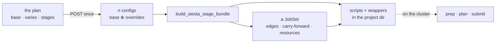

# Staged runs — the architecture, from a form to a chain of jobs

**Role:** plan
**Domain:** web
**Companions:** [`structure-optimization-ui-plan.md`](?doc=web/structure-optimization-ui-plan.md)
— the surface this describes the inside of; [`job-system.md`](?doc=execution/job-system.md)
— the JobSet model and the migration's phases; [`job-contracts.md`](?doc=execution/job-contracts.md)
— what lands on disk.

**Status: a proposal.** Nothing here is built. It fixes the shape of the thing
before either end is written, and names the order the work goes in: this
document, then the backend, then the surface.

**This is the spine.** The surface it describes the inside of is
[`structure-optimization-ui-plan.md`](?doc=web/structure-optimization-ui-plan.md);
read that one for the panel and this one for what the panel is editing. § 7 is
the reconciliation with the shipped contracts, and § 7.3 names the one place
where two of them disagree.

---

## 1. The one sentence

**A user describes one calculation and how it should tighten; the browser turns
that into a chain of jobs the shipped job system already knows how to run.**

Everything below is about where each part of that sentence lives.

---

## 2. The four objects

| Object | What it is | Who owns it | Lives where |
|---|---|---|---|
| **the plan** | `base` values + which fields `vary` + the stages | the browser | the tab, while you work |
| **the config** | one `SiestaConfig` per stage: `base` overlaid with that stage's overrides | the server | per request |
| **the JobSet** | jobs, dependency edges, carry-forward sets, resources | `stages_to_jobset` | in the bundle |
| **the bundle** | scripts, wrappers, `job-set.json` | `build_siesta_stage_bundle` | the project directory |

The plan is the only new object. The other three ship today, and the whole
design is a bet that the plan can be turned into them without changing what
they mean.



---

## 3. What the model can express today — and the two gaps

A stage is a typed object with **eight** settable fields:

```
name · enabled · relax_type · relax_steps · relax_force_tol
     · relax_max_displ · on_nonconvergence · continue_retries
```

Everything else in a stage's `.fdf` comes from the one shared config. That
yields two gaps, and they are the reason this is a backend job before it is a
UI job.

**Gap 1 — most parameters cannot vary at all.** The mesh cutoff, the energy
shift and the DM tolerances live on the shared config, so every stage of a
ladder uses the same ones. The tab's preset menu *appears* to change them per
stage; what it actually does is rewrite the single shared value. A ladder that
coarsens the grid for stage 1 and sharpens it for stage 3 — the ordinary thing
to want — cannot be described today.

**Gap 2 — resources can be carried but not asked for.** The JobSet gives every
job its own resources, and `stages_to_jobset` says they are per-stage,
defaulting to inherit. But no field on a stage says what they should be, so
nothing can populate them differently. The *transport* exists; the *request*
has nowhere to live.

---

## 4. The one change: a stage carries overrides

> **Behaviour stays typed. Values become open.**
>
> `SiestaStageSpec` keeps its eight fields, because each one changes what the
> chain *does*: the policy becomes the scheduler edge, the relaxation method
> decides whether `.CG` carries forward, `enabled` decides whether the stage
> exists. It gains **one** new field:
>
> ```python
> overrides: Dict[str, Any] = field(default_factory=dict)
> ```
>
> — a map from schema field name to that stage's value, applied over the shared
> config when this stage is rendered.

Why not the alternatives:

- **A full config per stage** — thirty-eight values repeated per stage, where
  thirty-five of them are the same. Every shared edit becomes a fan-out, and the
  first missed one is a stage quietly running different physics.
- **Widen the typed spec, field by field** — every new per-stage parameter
  becomes a schema change, a migration and a UI change. The set of things
  someone wants to vary is not knowable in advance; that is the whole point.
- **Let the browser send n complete configs** — the server would lose the notion
  of a ladder entirely, and with it the edges, the carry-forward rules and the
  resources it derives from stage structure.

### 4.1 An override lands in one of two places

This is the part that is easy to get wrong. A promoted field is not always a
line in the script:

| The field's group | Example | Where its override goes |
|---|---|---|
| `profile` / `stage` | mesh cutoff, DM tolerance | the stage's **`.fdf`**, via the same renderer as the shared value |
| `budget` | `mpi_np`, `cpus_per_task`, `time`, `mem`, `gres`, `exclusive`, `domain` | the stage's **job** in the JobSet — `Job.resources`, in the scheduler's own vocabulary |

The schema already knows which is which: a field carries an `engine_key` when it
is a line in the deck, and a `workflow_group` that says whose decision it is. So
the routing is derivable and must not be a second list someone maintains by
hand.

---

## 5. The plan is a file

The plan should not live only in a browser tab. Written down, it becomes the
thing the generator reads:

```jsonc
{
  "format": "molbuilder/stage-plan",

  // What this plan is FOR, and what it needs to run. The backend checks these
  // before it renders anything (§ 5.3).
  "engine":  { "name": "siesta", "version": "5.0", "requires": ["mpi", "netcdf"] },

  // What produced it, and what identifies the run it describes (§ 6).
  "run":     { "name": "BDT/Au relax",             // what the user typed, kept verbatim
               "id":   "bdt_au_relax_c6h4s2au38",   // normalised once, then used as-is
               "created": "2026-08-06T22:14:03-07:00" },  // for tracing, not identity

  // Which schema the values were entered against. Not a definition — a witness,
  // so a disagreement between the browser and the backend is caught, not obeyed.
  "schema":  { "fingerprint": "sha256:1f0c…" },

  // Every schema field, one value. A one-stage plan is just this.
  "base": { "mesh_cutoff": 150, "mpi_np": 8, … },

  // WHICH fields the user chose to vary, with the bounds the UI enforced when
  // the values were typed. Intent plus evidence — neither is in a bundle.
  "varies": [
    { "field": "mesh_cutoff",     "type": "float", "min": 50, "max": 1000, "unit": "Ry" },
    { "field": "relax_force_tol", "type": "float", "min": 0.001, "max": 1.0, "unit": "eV/Ang" },
    { "field": "mpi_np",          "type": "int",   "min": 1,  "max": 256 }
  ],

  "stages": [
    { "name": "coarse", "enabled": true,
      "relax_type": "CG",      "relax_steps": 600,
      "on_nonconvergence": "proceed",
      "overrides": { "mesh_cutoff": 150, "relax_force_tol": 0.04, "mpi_np":  8 } },

    { "name": "tight",  "enabled": true,
      "relax_type": "Broyden", "relax_steps": 200,
      "on_nonconvergence": "halt",
      "overrides": { "mesh_cutoff": 300, "relax_force_tol": 0.01, "mpi_np": 16 } }
  ]
}
```

### 5.1 Three rules, and each one is load-bearing

**It names fields; it never defines them.** Every key in `base`, `varies` and
`overrides` must resolve to a field the schema already declares. A plan carrying
a key the schema does not know is **refused, not ignored**: an ignored key is a
calculation quietly different from the one that was asked for. This is the rule
that keeps the JSON from becoming a second schema, which is how the idea fails.

**The bounds it carries are a witness, not a law.** The UI validated those
values against a schema that knows the engine; recording the type and range it
enforced lets the backend check that it is looking at the same field it was —
and *disagreement is an error, never a silent overwrite*. A plan saying
`mesh_cutoff ≤ 1000` against a backend that now says `≤ 600` is a report about
drift between two components, which is exactly the thing that otherwise goes
unnoticed until a run behaves oddly. The **schema fingerprint** makes the common
case one comparison instead of thirty-eight.

**It is parsed *into* the typed config, not around it.** The generator keeps
rendering from a `SiestaConfig` and its stage specs; the file is how a plan
travels and how it persists. A generator that rendered whatever keys the JSON
happened to carry would throw away validation, defaulting and the `engine_key`
mapping, and re-implement all three badly.

### 5.2 There is no format version, on purpose

A version number is a promise that somebody will write migrations, and nobody
does. It also buys nothing here that the content does not already buy: a reader
that **refuses a key it does not know** fails safely on a file from the future,
and names what it could not understand — which is the same outcome a version
check gives, arrived at with more information.

What *does* need checking is checked directly: **the engine and its version**,
the requirements it declares, and the schema fingerprint. Those are real facts
about whether this plan can run here. A number counting revisions of a file
layout is not.

The `format` name stays — one string, so a plan cannot be mistaken for some
other JSON that happens to have a `stages` key.

### 5.3 What the backend checks before it renders

In order, and all of it up front rather than halfway through writing a bundle:

| Check | On failure |
|---|---|
| `format` is a stage-plan | refuse — this is not a plan |
| the engine is one this backend has | refuse, naming what it has |
| the engine **version** satisfies the plan | refuse, naming both — a deck written for 5.0 keywords is not a 4.1 deck |
| declared `requires` are present (MPI, NetCDF, a GPU) | refuse, naming what is missing |
| the schema fingerprint matches | proceed, but report the fields that differ |
| every named field exists | refuse, naming the field |
| every value inside the schema's bounds | refuse, naming the field and both bounds |

The order matters: an engine mismatch makes every field question moot, and
answering the moot ones first buries the real message.

### 5.4 What it buys

- **One producer for both surfaces.** The CLI and the browser stop being two
  paths to a ladder; the browser writes a plan, and the same reader turns it into
  a bundle from either.
- **Reopening a run restores intent.** A bundle can be re-read for its values,
  but nothing in it says *which parameters the user meant to vary* — a mesh
  cutoff that happens to be equal in all three stages is indistinguishable from
  one never promoted. § 11's questions 1 and 4, answered: `varies` is in the file
  because it cannot be inferred from anything else.
- **A plan is reviewable.** It diffs. Two runs that differ can be compared as
  intent rather than by reading two directories of decks.

### 5.5 Where it sits among the artefacts

One direction, no loops:

```
    plan.json          ← intent: what was asked for, including what may vary
       │  (read once)
       ▼
    n effective configs → n scripts + wrappers      ← derived
       │
       ▼
    job-set.json       ← the execution graph: jobs, edges, carry-forward
```

`job-set.json` is not a rival: it holds what the scheduler needs and nothing
about promotion or intent. It is downstream, and it stays derived.

**PROVENANCE stays exactly what it is** — a generator snapshot, not a config —
and gains a use for a key it already reserves. `form-config-hash` becomes the
hash of the plan that produced the script, so any deck in a project can be traced
back to the plan it came from, and a deck edited by hand can be told apart from
one a plan would reproduce.

### 5.6 What this is not

It is not an engine input format: no engine reads it. It is not a replacement
for `SiestaConfig` — that dataclass remains the definition of what a field *is*.
And it is not a new persistence layer for projects; it is one file written beside
the bundle it produced.

---

## 6. Identity: the run id, and the key warm restart turns on

A generated script "declares its ID in one literal (`SystemLabel` / `JOB`)", and
**that ID keys every warm file as `<ID>.<ext>`**. So the value a user types is
what decides whether a run resumes from state already on disk. Two
consequences, both real today:

- two different calculations given the same label in one directory: the second
  **silently warm-starts from the first's geometry**, and the banner says
  `WARM-RESTART (silent)` because that is exactly what it is;
- a label edited between runs: the warm files no longer match, and a run that
  should have resumed starts cold instead.

An id derived from the plan fixes both, and one rule decides every case:

> **The id is built from inputs, never from anything a run produced.**
>
> It has to be knowable *before* the calculation exists — it names the directory
> the run will be written into and the job the scheduler will be handed. And an
> id that depended on a result would change the moment a stage succeeded,
> orphaning the state it exists to continue from. So: no coordinates, no
> energies, no convergence status, nothing read back off a `.XV`.

That leaves simple parameters, which is all it needs.

So the id is **readable, not cryptographic** — a starting point deliberately
made of things a person already knows:

```
   run.id  =  bdt_au_relax _ C6H4S2Au38
              └─────┬─────┘   └────┬────┘
                    │              what the coordinates are of: the molecule,
                    │              by formula or by named components
                    the project / experiment name — what the user calls it
```

A hash would be exact and unreadable. A formula is neither, and that is the
trade being made on purpose: an id you can recognise in a directory listing, in
a queue, and in a filename is worth more day to day than one that resolves every
possible ambiguity. **This is a starting point, agreed as one**, and § 11 records
what would force it to grow. What it may contain is not open, though: § 6.1.

That one id **is** the `SystemLabel` / `JOB` literal. There is no second name.

**The timestamp is recorded but is not part of it.** It lives in the plan as
`run.created`, for tracing a directory back to the moment it was written — and
it stays out of the id on purpose, because putting it in would make every
regeneration a new identity, and therefore a cold start. Two generations of the
same calculation *should* land on the same id: that is not a collision, it is
the same calculation, and warm files being found is the right outcome.

**What tells two invocations apart, then?** The run wrapper already does it —
each run carries an index (`-run0`, `-run1`, …), and `--force` resets it. That is
invocation-level bookkeeping and it exists; the id is calculation-level and does
not need to repeat it.

### 6.1 The id is a filename, so it is normalised once and checked

The id becomes the `SystemLabel` literal, and that literal becomes the stem of
every file the run writes: `<id>.XV`, `<id>.DM`, `<id>_stage1.fdf`,
`<id>-run0.molwatch.log`. A name with a space or a slash in it does not merely
look untidy — it breaks a shell line, a glob, or a scheduler argument. So what
the user types is **never used raw**.

**What the allowed set is, and where it comes from** — none of it is taste:

| Constraint | Set | Source |
|---|---|---|
| the wrapper reads the id back out of the script and interpolates it | `[A-Za-z0-9._-]` | § 4.3, where sanitising it is also what blocks shell injection from a hostile script |
| a stage name is appended to it | `[A-Za-z0-9_]+` | the stage-name pattern in the config |
| files land on disks that may not distinguish case | one case only | a `BDT.XV` and a `bdt.XV` are one file on macOS |

So the normalisation is: **lowercase, anything outside `[a-z0-9_-]` to `_`,
runs collapsed, leading and trailing separators trimmed, length capped** with
room left for the suffixes the run will add.

**Three rules keep it from becoming a source of surprise:**

1. **It is normalised once, when the plan is written, and stored.** The id in the
   plan is the id — nothing downstream re-derives it from the user's raw text,
   because two components normalising slightly differently is a silent
   divergence between what the browser shows and what the engine writes.
2. **The result is shown, not hidden.** § 6.3 already puts the id on screen; a
   user who types `BDT/Au relax` sees `bdt_au_relax_c6h4s2au38` and can object
   there and then, rather than discovering it in a filename later.
3. **A normalisation that loses the name is refused, not patched.** If what a
   user typed reduces to nothing, or collides with another run in the same
   project, the answer is to say so and ask — never to append a digit and carry
   on, which produces `bdt_2` and no explanation of what it differs from.

### 6.2 What the identity is tied to — as little as possible

It is easy to overstate this, and overstating it is not a safe error: every
extra thing in the pin is a case where a user tunes something reasonable and
loses a geometry they should have kept.

Start from what a run *produces*. **The result is a set of coordinates.** So:

> **Coordinates cannot be in the identity.** They are the output. Bind them in
> and the pin changes every time a stage succeeds — regenerate a plan from the
> relaxed structure and it would orphan the very state it exists to continue
> from. The identity would break precisely when the calculation worked.

What is left is what those coordinates are *of*:

| Considered | In the pin? | Why |
|---|:--:|---|
| the molecule — its formula, or its named components | **yes** | a `.XV` is a list of positions for *these* atoms. Different atoms, and every coordinate lands somewhere it does not belong |
| the positions | no | the output (above) |
| the cell | undecided (§ 11) | a `.XV` carries the cell too, so a changed cell is overridden on restart rather than mismatched — a different failure, and possibly not one the id should be solving |
| basis, spin, XC | no | the geometry stays valid across all of them, and tuning the electronics while continuing is ordinary practice. A `.DM` of the wrong shape is caught by the engine — a failure it already reports, traded for one it cannot |
| mesh, tolerances, force, steps, algorithm | no | exactly what a ladder varies |
| ranks, threads, GPU | no | how fast it ran says nothing about whether the answer may be continued |

So the id covers one thing beyond the user's own name for it: **which atoms
these coordinates belong to.** A differing atom *count* the engine already
refuses, so the id is not there for that; it is there for the cases the engine
cannot see.

And it is deliberately the *readable* form of that claim. A formula does not
separate two isomers, and does not pin the order the species are declared in —
both of which a `.XV` is sensitive to. That is the known gap in the starting
point, and § 11 is where it waits.

### 6.3 The id is on screen, and its changes are visible

An identity the user cannot see is one they cannot reason about, and this one
decides whether their run resumes. So the tab shows both, always:

```
   ┌────────────────────────────────────────────────────────────┐
   │  Job ID   bdt_au_relax_c6h4s2au38     ← from "BDT/Au relax" │
   │           it says which atoms this is. It survives a         │
   │           relaxation and every tuning; it changes only if    │
   │           you load a different molecule                      │
   └────────────────────────────────────────────────────────────┘
```

Two behaviours that make it worth showing rather than merely correct:

- **When a different molecule is loaded, the id visibly changes**, at that
  moment. That is the UI saying *this has become a different
  calculation and it will start cold* — before a bundle is written, not after a
  run behaves oddly.
- **When a run directory already holds warm files**, the tab can say whether
  they match the current id: *"prior state found for this key — the next run
  resumes"*, or *"prior state found, but from a different calculation"*. That is
  the same sentence the wrapper's banner prints, moved to where the decision is
  actually being made.


**The plan itself is the record, so nothing else needs hashing.** It is written
beside the bundle (§ 5), which means the wrapper's banner can say *which plan*
produced the state it is about to resume from, rather than only that it is
resuming. That is the existing doctrine — **molbuilder informs, and the user
decides to continue** — reaching a case it does not cover today: `WARM-RESTART
(silent)` cannot tell you the state came from a different calculation, because
nothing beside it recorded which one made it.

What this replaces: a free-typed name that had to do the job with no help — the
user both inventing an identity and remembering to change it when the thing
being calculated changed. The id now carries the two facts that matter, and the
user still gets to say what it is called.

---

---

## 7. Consolidation: saying it the way the shipped system says it

This plan sits on top of contracts that already name most of what it needs. Where
they have a word, it uses that word.

### 7.1 The six decisions, and how this honours them

`job-system.md § 2` fixes six decisions. A design that quietly breaks one is
wrong however good it looks:

| Decision | What this plan does about it |
|---|---|
| **1. Work is data; the engine stays out of orchestration** | the plan file is *engine-specific* on purpose — it is a **producer input**, the layer above the JobSet. The JobSet it produces stays engine-agnostic, so `prep`/`plan`/`submit`/`status` never learn what SIESTA is |
| **2. Reuse the single-job wrapper unchanged** | nothing here reaches inside a wrapper. A `budget` override becomes `Job.resources`, which the existing submitter already turns into scheduler flags |
| **3. The machine's knowledge lives on the machine** | the plan carries no cluster facts. `Job.resources` fields left unset stay unset, and are resolved at `prep`/submit on the target — which is also the answer to "may a cell be blank": **blank means inherit**, and the model already spells that `None` |
| **4. Fail early, never guess** | § 5.3's preflight, in that order, before anything is written |
| **5. molbuilder informs; the user decides** | the id makes a wrong warm-start impossible, and the plan beside the bundle lets the banner name the state it is resuming. Neither auto-resumes anything |
| **6. One parent; ladder or sweep** | a steps list is a **ladder**, which is exactly the shape decision 6 allows. Nothing in the UI can express a branch, and it should not until the diamond case is real |

### 7.2 The names, normalised

Four names, four jobs, none of them new:

| Name | What it identifies | Fixed by |
|---|---|---|
| **the id** | the calculation — becomes `SystemLabel` / `JOB`, keys every warm file | § 2.2 Rule 2, § 4.1 |
| **the stage name** | one step — becomes `Job.name`, which is *both* its folder and its `squeue` name | job-system § 3 |
| **the script name** | `<id>_<stage>.fdf` | § 2.3 |
| **the run index** | one invocation — `-run0`, `-run1` | § 4.4 |

So this plan invents no directory naming and no job naming. It supplies an id
and a list of stage names; everything downstream is already decided.

### 7.3 Where a bundle lands — and the one thing that needs settling

A run directory sits at `projects/<project>/<topic>/<structure>/`, where
`<topic>` is one of nine canonical names (`optimization` for this tab), and each
segment matches `[A-Za-z0-9_-]+`.

**And here the two shipped contracts disagree, which this plan cannot paper
over.** `job-contracts.md § 2.5` says the innermost directory is *"exactly the
flat one-job-per-directory shape — no sub-directories, no nesting of restart
files"*, and § 2.1 says a directory may hold several inputs, one per stage.
`job-system.md § 5.2` has `prep` lay out **per-job folders**, and the `Job.carry`
list only makes sense across a boundary — files already sharing a directory need
no carrying.

Both are true of something: the **in-place ladder** is flat, and the **JobSet
bundle** is foldered. What is not written down anywhere is *which one a project
directory is allowed to contain*, and a plan that produces the second into a
place documented as the first will look correct and be wrong.

**This is the first thing to settle in step 2**, and it is a question for the
contracts, not for this document. The likely answer is that a bundle is a fourth
level under `<structure>/`, or a sibling of it, and § 2.5 says so.

## 8. Validation has to name the stage

A findings list today points at a field. With a ladder, "mesh cutoff is too low
for this basis" is true of *stage 1* and false of *stage 3*, and a finding that
cannot say which is a finding a user cannot act on.

So each stage's **effective** config — `base ⊕ overrides` — is validated as a
config in its own right, and every finding carries the stage it came from in its
`where`. One shared value producing the same complaint in three stages should
say so once, not three times.

This is the existing findings contract extended by a coordinate, not a second
validation path.

---

## 9. The module map

| Layer | Today | What this needs |
|---|---|---|
| config | `SiestaConfig`, `SiestaStageSpec` (8 fields) | **+ `overrides` map**, and the merge that applies it |
| ladder | `render_siesta_stage_fdfs`, `stages_to_jobset` | renders from the *effective* config per stage; routes `budget` overrides into job resources |
| bundle | `build_siesta_stage_bundle` | unchanged — it is already the seam § 8 named |
| plan file | — | **new**: the `stage-plan` format, its reader, and the refusal of unknown keys |
| web API | `/api/build/*` renders one script | **+ one route** that takes a plan and writes a bundle |
| validation | one config → findings | per-stage effective configs → findings **with a stage coordinate** |
| browser | schema-driven form, one flat config | **+ the plan model**: pure data, pure operations (promote, demote, add, remove, reorder, apply preset) |
| browser | — | **+ the matrix view**, which renders the plan and calls those operations |

The last two are deliberately separate. The plan model is arithmetic on a data
structure: no DOM, no fetch, testable as values in and values out — the same
split that made SpectrumChart's maths layer the easy part to trust. The view
renders it and nothing else.

---

## 10. The order of work, and what "done" means

**Step 1 — this document.** Done when the shape is agreed and the open questions
in § 11 are answered.

**Step 2 — the backend, tuned and validated.** In order:

1. The **plan format and its reader** (§ 5), including the refusal of a key the
   schema does not know. *Done when:* a plan round-trips — read, rendered,
   re-read — and a plan naming a dead field fails with that field's name.
2. `overrides` on the stage spec, and the merge that produces an effective
   config. *Done when:* a stage with `{mesh_cutoff: 300}` renders a `.fdf`
   carrying 300 while the shared config still says 150, and a stage with no
   overrides renders exactly what it renders today.
3. Override routing for `budget` fields into job resources. *Done when:* a
   two-stage plan asking for 8 ranks then 16 produces a JobSet whose two jobs
   differ in resources, with the `.fdf`s unchanged.
4. Per-stage validation with the stage coordinate. *Done when:* a plan whose
   stage 1 is under-converged reports against stage 1 alone.
5. The bundle route. *Done when:* a plan posted to it writes the same bytes the
   CLI writes for the same ladder — compared file by file, because "the web is
   additive on top of the CLI" is only true if the output is identical.

**Step 3 — the surface.** The plan model first (pure, tested), then the matrix
view, then the subtabs. The UI plan's § 7 is the specification for the first of
those.

The gate between 2 and 3 is worth stating: **the backend must be able to express
a ladder that varies a non-stage parameter before any of it is drawn**, or the
UI will be designed around what the model happens to allow rather than what a
user needs.

---

## 11. Open questions this document cannot settle

1. **Does a stage's override of a `budget` field also change the wrapper it gets
   installed with**, or only the scheduler request?
2. **Is the user's half of the id editable after the fact?** Renaming it changes
   the id and so orphans the warm files, which is right in principle and will
   surprise someone who meant only to fix a typo. Deriving it makes it consistent;
   letting it be typed keeps a door open to deliberately resuming from an
   unrelated run's state, which is occasionally what a person wants and is
   otherwise impossible to ask for.
3. **What are the "components" of a composite system?** A junction is a molecule
   *and* two electrodes; naming it by total formula loses that structure, and
   naming it by parts needs a convention for what a part is.
4. **When does the readable id stop being enough?** A formula does not tell two
   isomers apart, and does not pin the *order* species are declared in — and a
   `.XV` read against a different order lands every coordinate on the wrong atom.
   The likely answer is a short pin appended when and only when the readable
   part cannot separate two things in the same project, so the ugly form appears
   where it earns its place rather than everywhere. Agreed to be revisited.
5. **Does the cell belong in the identity?** A `.XV` carries the cell as well as the
   positions, so a changed cell is *overridden* on restart rather than
   mismatched. That is a real surprise — you asked for more vacuum and the
   restart quietly kept the old box — but it may be the wrapper's to report
   rather than the id's to prevent.
6. **Is a plan editable by hand?** It is JSON beside a bundle, so it will be. If
   yes, the reader owes the same errors to a person as to the browser — which is
   an argument for the refusal rule in § 5.1 being loud rather than tolerant.
7. **How strict is the engine-version check?** § 5.3 refuses on mismatch, which
   is right for a major change and heavy-handed for a patch release. A range, or
   a "warn below, refuse across major", needs deciding by someone who knows what
   SIESTA changes between versions.

*Answered by § 5, which is why it was worth writing:* whether `varies` travels to
the server (yes — it cannot be inferred), what happens when the schema moves on
(refuse, and name the field), and whether the plan persists beside the bundle
(yes — it is the only record of intent).
