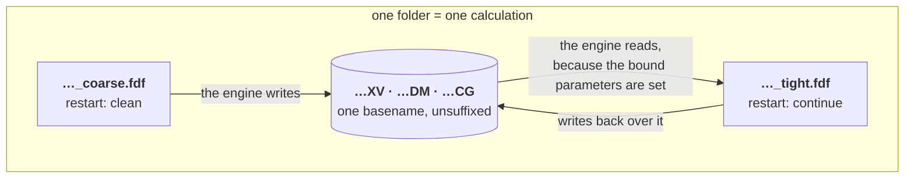
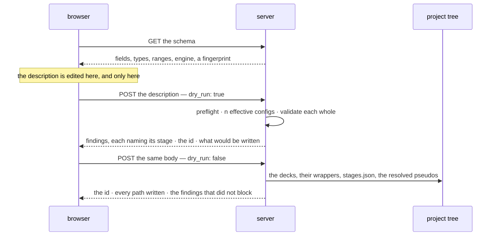

# Staged runs — one system, several parameter sets, one folder

**Role:** plan
**Domain:** web
**Companions:** the two contracts this plan exists to schedule —
[`engines/stages.md`](?doc=engines/stages.md) (what a stage is, the effective
config, `stages.json`) and
[`execution/run-identity.md`](?doc=execution/run-identity.md) (the id, and the
engine parameters that decide whether a stage continues);
[`web/structure-optimization-ui-plan.md`](?doc=web/structure-optimization-ui-plan.md)
— the surface;
[`execution/job-contracts.md`](?doc=execution/job-contracts.md) +
[`execution/running-a-job.md`](?doc=execution/running-a-job.md) — the shipped
ground everything rests on.

**Status: a proposal.** Nothing here is built. This document holds the *why*, the
order of work, and the open questions. **It holds no durable decisions** — those
moved into the two contracts above, and where this plan and a contract disagree,
the contract wins (R3).

> **Reading the cross-references.** A bare `§ n` is a section of *this*
> document. A section of another document is always named with its file —
> `job-contracts.md § 2.3` — because several documents number their sections.

---

## 1. The one sentence

**A user describes one system and the parameter sets they mean to tune it
through; molbuilder writes one correct input file per set into one folder, where
they can be run, switched between, and continued from.**

**What this is not.** It is not an execution system. Nothing here submits a job,
chains one job to the next, or decides when the following thing runs. The
pipeline ends at correct files on disk. Running one is
[`running-a-job.md`](?doc=execution/running-a-job.md)'s job; having a scheduler
run several without you is [`job-system.md`](?doc=execution/job-system.md)'s,
reachable from here as an **export** (§ 7) and never as the destination.

---

## 2. Where the truth lives

Every layer below has exactly one document that decides it. **An implementer
reads that document, not this one.**

| Layer | Sole source of truth | What it fixes |
|---|---|---|
| what a stage is; the effective config; where a promoted field lands; `stages.json` and its preflight | [`engines/stages.md`](?doc=engines/stages.md) | the model, the file, the merge, the three destinations |
| the run id, its normalisation, the folder name, the engine's identity group | [`execution/run-identity.md`](?doc=execution/run-identity.md) | what decides whether a calculation continues |
| the run directory, filenames, the stage suffix, reserved script blocks, warm files, the project tree, the artifact registry | [`execution/job-contracts.md`](?doc=execution/job-contracts.md) | the on-disk shapes — **unchanged by this work** |
| environments, activation, wrappers, `molbuilder.json`, watching a run, checkpoints | [`execution/running-a-job.md`](?doc=execution/running-a-job.md) | how a run actually happens — **unchanged by this work** (§ 4) |
| what *values* a stage should carry | [`engines/tuning.md`](?doc=engines/tuning.md) | the science of the dial |
| findings: their shape, their one renderer, what blocks | [`science/validation.md`](?doc=science/validation.md) | delivery — a stage label travels beside `where`, never inside it |
| the dependency chain, carry-forward, scheduler resources | [`execution/job-system.md`](?doc=execution/job-system.md) | the optional export (§ 7) |
| the panel, the stage table, the operations on it | [`structure-optimization-ui-plan.md`](?doc=web/structure-optimization-ui-plan.md) | the surface — still a plan, deliberately (§ 8) |

This plan owns only what is left: why the shape is this shape, the order the work
goes in, and what is still undecided.

---

## 3. Why a stage is ours, not the engine's

The reframe that produced the two contracts, in one paragraph, because everything
else follows from it.

**No engine has a concept of a stage.** SIESTA reads a `.fdf`; PySCF runs a
`.py`. Neither knows the file it was handed is the second of three. So a stage is
molbuilder's own device for holding the parameters a mission tunes over the
shared description of the system it does not — and it must resolve completely at
generate time, leaving an ordinary engine input behind (`engines/stages.md § 1`).

Three consequences shaped everything:

- **The stage object is tiny** — a name, an enabled flag, an overlay. The
  eight-field type shrank because two questions sort every field, and neither
  question asks where the field ends up (`engines/stages.md § 3`).
- **"Switch" and "continue" were already contractual.** `job-contracts.md § 2.1`
  Rule 1 lets one directory hold several inputs; Rule 2 makes them share one
  basename *"which is exactly what lets SIESTA pick up `<basename>.XV` / `.DM`
  from the previous stage."* Continuing is what the **engine** does; molbuilder
  makes the id right and puts the files where it will look
  (`run-identity.md § 1`). No carry list, no symlinks, no dependency edge — those
  exist in `job-system.md` only because its bundle splits stages across separate
  folders.
- **Correctness is the deliverable, not a step.** Two gates, both in
  `engines/stages.md`: the deck is complete and stands alone (§ 7), and every
  config that will be rendered gets the full findings pass — *validated as a
  resolved whole, never as a diff* (§ 4 R2).

### 3.1 The folder, and the one cost it carries



The warm files are unsuffixed and shared, so **running a second stage overwrites
the first stage's restart state.** That is the same property that makes
continuing free; it cannot be had one way only. The folder holds *the current
state of one calculation*, not a history of every setup tried in it.

The answer already ships. `running-a-job.md § 6` puts a run directory under a
git-backed checkpoint system — snapshot a converged state, tag it, **branch a
what-if**, restore, with the small warm-restart files kept in the text history
*"so a restore brings back a resumable state."* That is switching between setups
without losing one. **`snapshot branch` has no HTTP route**
(`running-a-job.md § 6.2`), which
makes it the most relevant missing piece for this framework — ahead of anything
in the JobSet migration.

---

## 4. The environment: nothing here changes it

The execution domain already defines how a job finds its software, for
workstations and for HPC alike, and **this work re-invents none of it.** Stated
once so no reader has to guess, every line citing
[`running-a-job.md`](?doc=execution/running-a-job.md):

| Assumption | Where it is fixed |
|---|---|
| **molbuilder is installed on the machine that generates.** It is not needed on the compute node | `running-a-job.md § 2` — the wrapper is self-contained *at run time* |
| **Everything site-specific is baked at generate/prep.** At run time the wrapper may read only the allocation and the hardware, and only to tune the launch | `running-a-job.md § 2.1` — the T/M/C/A/H rule |
| **The activation form comes from config and has no default.** `script_generation.activation` is `conda activate` or `source activate`; `preamble` carries the `module load` lines. Generating an HPC wrapper **refuses** without an activation | `running-a-job.md § 5.2` |
| **Config is `molbuilder.json` (cwd, then the XDG fallback) plus a project `.molbuilder.json`; project wins** | `running-a-job.md § 5.1` |
| **Environment names are configurable per category** — the four defaults are defaults, not facts. Nothing may hard-code one | `running-a-job.md § 5.4` (`envs`) and `running-a-job.md § 2.3` |
| **Routing is by the script's own content.** A `.fdf` asking for ELPA or GPU routes to the GPU build; a missing environment raises at generate with an install hint | `running-a-job.md § 2.3` |
| **`.sbatch` is emitted only when a `scheduler` block is configured.** A workstation gets `.run.sh` and runs it directly | `running-a-job.md § 5.3` |
| **The doctor verifies and never installs** | `running-a-job.md § 2.2` |

**What this framework adds is exactly one thing:** a folder holds *several*
decks, so it holds several wrappers, and each is routed by its own deck's content
(`engines/stages.md § 5.1`). A coarse stage on ScaLAPACK and a tight stage on
ELPA-GPU activate different environments in the same folder, and nothing in the
machinery above has to change for that to work.

**Two implications, because they are gates rather than conveniences:**

- **The deck is portable; the wrapper is baked.** A deck runs on any machine that
  has the engine. A wrapper carries one target's activation, which is why
  generation happens where that target's config is known.
- **A stage that asks for an absent environment refuses the whole generate.** The
  install-hint raise (`running-a-job.md § 2.3`) fires per script; a description
  is produced as a
  whole, so the alternative would be a folder that is only partly runnable —
  worse than one that was not written.

---

## 5. The two sides, and what crosses

### 5.1 The boundary, as a rule

| | Owns | May **not** |
|---|---|---|
| **the browser** | the description while it is edited: values, which fields vary, the stages and their order | render a deck, resolve a pseudopotential, compute a cell, install a wrapper, read or write the project tree, decide an id's final form |
| **the server** | turning a description into effective configs, validating them, resolving structure and pseudos, computing the cell, writing the folder and its wrappers | hold description state between requests, or invent a value the description did not carry |

**The browser decides what is wanted; the server decides what that means and
whether it can be done correctly.** Neither guesses on the other's behalf — which
is why the description travels whole rather than as a diff, and why nothing the
server derives is sent back for the browser to store.

The id is the case that tests the rule. `run-identity.md § 3` puts one normaliser
in the system, and it is the server's — so **the tab shows the id the last check
returned**, and an edit that would change it marks it stale until the next check
clears it. The browser displays and invalidates; it never normalises.

### 5.2 What crosses



**One route, one flag.** Check and produce take the identical body, so they are
the same route with `dry_run` — the CLI's idiom already
(`jobset submit --dry-run`) — which makes it impossible for a description that
checks clean to then fail to produce.

```jsonc
{
  "ok": true,
  "id": "bdt_au_relax_c6h4s2au38",
  "written": { "folder":   "projects/BDT-Au/optimization/bdt_au_relax_c6h4s2au38/",
               "decks":    ["…_coarse.fdf", "…_tight.fdf"],
               "wrappers": ["…_coarse.run.sh", "…_tight.run.sh"],
               "description": "…/stages.json" },
  "findings": [ /* warnings that did not block, each naming its stage */ ]
}
```

The paths come back because the browser cannot know them: the id's final form and
the tree's layout are both the server's. A refusal is the same shape with
`ok: false` and the findings that caused it — never a bare error string, because
a preflight that names a field is worth nothing if the surface cannot show which
field.

---

## 6. The decision chain — who dictates what, in order

Overlap between modules is fine. A **loop** is not: if two parties can each
overrule the other, nobody can predict the outcome and nobody can test it. So the
whole system is one sequence, and the rule that keeps it one is:

> **Each step decides within what the steps above it already fixed, and nothing
> later rewrites something earlier.**

| # | Who decides | What it fixes | Fixed by |
|---|---|---|---|
| 1 | the **project tree** | where anything may live: the nine topics, `[A-Za-z0-9_-]+` per segment | `job-contracts.md § 2.5` |
| 2 | the **structure** | which atoms exist — an input, never edited by the generator | `model/structure.md` |
| 3 | **2 + the user's name**, within 1's character set | the **id**, normalised once and then quoted by everything after | `run-identity.md § 2–3` |
| 4 | the **schema** | which fields exist, their types, ranges and `engine_key`s | `web/form-schema.md` |
| 5 | the **description** | values, which fields vary, the stages and their order | `engines/stages.md § 6` |
| 6 | the **preflight** | whether this file can be read here at all | `engines/stages.md § 6.5` |
| 7 | **validation** | whether it may be written: `error` blocks, per stage, on the resolved whole | `science/validation.md` |
| 8 | the **generator** | the decks and their wrappers — the merge, the cell, the pseudos, the identity group, BENCH-MARKS | `engines/stages.md § 7` |
| 9 | the **target's config** | the wrapper's shell: preamble and activation — and generation refuses without an activation, which has no default | `running-a-job.md § 5.2` |
| 10 | the **user** | which deck to run, and when | — this is the point of the framework |
| 11 | the **wrapper**, at run time | ranks, threads, GPU pinning, the run index, the restart banner | `running-a-job.md § 3` |
| 12 | the **engine** | whether warm files are honoured, given those parameters | `job-contracts.md § 4` |

Read it downward and the entanglements disappear:

- **The browser lives entirely in rows 3–5.** That is why § 5.1 can say it never
  renders a deck or computes a cell — those are row 8.
- **The id is fixed at row 3 and quoted by everything after.** No later step
  derives it again, which is why normalising once is a rule rather than an
  optimisation.
- **Row 10 is a person, and that is deliberate.** Every earlier row exists to
  make row 10's choice safe; none of them makes it.
- **Nothing in rows 1–8 knows what a cluster is.** Target isolation is not a
  policy anyone has to remember; it falls out of where row 9 sits.

Rows 6 and 7 both refuse things, and both belong — one asks *can this file be
read here at all*, the other *is this a sound calculation*. They are ordered, so
a description aimed at an engine this backend does not have never receives a
lecture about its mesh cutoff.

---

## 7. Exporting to a scheduler — optional, and downstream

Some day a user will want a scheduler to run the decks in order without being
asked twice, and that framework ships: `job-system.md`'s `stages_to_jobset` turns
a staged config into a ladder, and `prep` / `plan` / `submit` / `status` run it.

**It is an export, not a destination**, and the difference is what it needs that
this framework does not:

| The export needs | Where it comes from |
|---|---|
| `on_nonconvergence` per stage | **only the export.** It becomes the scheduler edge — `proceed → afterany`, `halt → afterok` — and there is no edge without a scheduler (`engines/stages.md § 3`) |
| `Job.carry` per stage | **only the export.** Its `prep` lays out *separate folders* per job, so the warm files § 3.1 shares must be carried explicitly and localised on run |
| `Job.resources` per stage | **already in the description.** The export applies the translation `job-contracts.md § 6.2` already fixes, at its own boundary |

Two facts to carry forward when it is built:

- **The two directory shapes are not in conflict; they are two products.**
  `job-contracts.md § 2.5`'s flat `<structure>/` is this framework's folder;
  `job-system.md § 5.2`'s `point-<name>/` tree is a bundle. A bundle is not a run
  directory — it is a directory *of* run directories, each obeying
  `job-contracts.md § 2.1` exactly. Nothing needs to move.
- **`JobSet.name` should be the id**, and the submitter's `-J` should carry it.
  Today a ladder's scheduler name is the bare stage name
  (`job-contracts.md § 6.3`), so three concurrent ladders show
  `coarse coarse coarse` in `squeue`.

---

## 8. The order of work

**Step 1 — the two contracts.** Done: [`engines/stages.md`](?doc=engines/stages.md)
and [`execution/run-identity.md`](?doc=execution/run-identity.md). What remains
is agreeing them and answering § 9.

**Step 2 — the backend, built to those contracts.**

1. **Settle which of the duplicated fields wins today.** `relax_force_tol` and
   `relax_max_displ` sit on the shared config *and* on the stage spec. *Done
   when:* a test says which value a staged render uses when the two disagree —
   because that is the behaviour anyone relying on it has already built on.
2. **The stage spec shrinks to three fields** (`engines/stages.md § 2–3`). Five
   of the eight become ordinary shared-config fields — the four relaxation values
   plus `continue_retries`, routed to the wrapper-install surface that already
   honours it. `on_nonconvergence` moves to the JobSet producer's own input.
   *Done when:* a stage with no overrides renders exactly what it renders today,
   no field of the shared schema has a second home, a per-stage
   `continue_retries` reaches that stage's wrapper, and the ladder producer still
   derives the same edges.
3. **`overrides` and the effective-config merge** (`engines/stages.md § 4`).
   *Done when:* a stage with `{mesh_cutoff: 300}` renders a deck carrying 300
   while the shared config still says 150, and the object validated is the object
   rendered.
4. **`restart` and the engine identity group** (`run-identity.md § 4`). *Done
   when:* a two-stage description whose second stage continues renders every
   bound parameter set, and a stage set to `clean` renders none — asserted
   together, since the failure mode is that they disagree.
5. **Resource-shaped overrides reach all three destinations**
   (`engines/stages.md § 5`). *Done when:* a description asking for ScaLAPACK
   then ELPA renders two decks whose solver differs **and** two wrappers
   activating different environments; and a stage varying `mpi_np` renders a deck
   whose `BlockSize` came from *that* stage's rank count, with BENCH-MARKS
   declaring it.
6. **`stages.json`, its reader, and the preflight** (`engines/stages.md § 6`).
   *Done when:* a description round-trips — read, rendered, re-read — one naming
   a dead field fails with that field's name, and the artifact registry
   (`job-contracts.md § 6.1`) has its row.
7. **Per-stage validation on the resolved whole** (`engines/stages.md § 4`).
   *Done when:* a description whose coarse stage is under-converged reports
   against `coarse` alone, through the one renderer, with the stage beside
   `where`.
8. **The route.** *Done when:* a description posted to it writes the same bytes
   the CLI writes for the same stages — compared file by file — and the folder
   holds a **runnable wrapper per deck**, not decks alone.
9. **`snapshot branch` over HTTP** (§ 3.1). *Done when:* the folder can be
   branched from the browser, because that is what switching setups without
   losing one requires.

**Step 3 — the surface.** The description model first (pure, tested), then the
matrix view, then the subtabs.
[`structure-optimization-ui-plan.md`](?doc=web/structure-optimization-ui-plan.md)
§ 7 specifies the first, and it stays a **plan** rather than a contract until
step 2 is done — a module contract is written when the module is about to be
built, the way [`spectrumchart.md`](?doc=web/spectrumchart.md) was.

**The gate between 2 and 3:** the backend must be able to render a stage that
overrides a parameter the stage type never carried, before any of it is drawn —
or the UI will be designed around what the model happens to allow rather than
what a user needs.

---

## 9. Open questions

1. **Is `stages.json` the right name?** It sidesteps the four-way collision the
   word *plan* already has in this domain (`jobset plan` the verb,
   `STAGE-PLAN.md` the file, "Job-set plan" the registry label for
   `job-set.json`).
2. **Should the folder really be named by the id** (`run-identity.md § 3`)? It
   removes a second name and makes a directory listing self-describing, at the
   cost of a folder called `bdt_au_relax_c6h4s2au38` where someone would have
   typed `bdt-relax`.
3. **Is the user's half of the id editable after the fact?** Renaming orphans the
   warm files, which is right in principle and will surprise someone who meant to
   fix a typo — and if question 2 is yes, it moves the folder too. Letting it be
   typed keeps a door open to deliberately continuing from an unrelated run's
   state, which is occasionally what a person wants.
4. **What are the "components" of a composite system?** A junction is a molecule
   *and* two electrodes; naming it by total formula loses that structure, and
   naming it by parts needs a convention for what a part is.
5. **When does the readable id stop being enough?** A formula does not tell two
   isomers apart, and does not pin the *order* species are declared in — and a
   `.XV` read against a different order lands every coordinate on the wrong atom.
   The likely answer is a short pin appended when and only when the readable part
   cannot separate two things in the same project.
6. **Do the cell *parameters* belong in the identity?** `run-identity.md § 5`
   says report rather than pin. Putting them in the id would orphan a geometry
   every time somebody widened a box.
7. **Is a description editable by hand?** It is JSON beside the decks, so it will
   be. If yes, the reader owes the same errors to a person as to the browser — an
   argument for the refusal rule being loud rather than tolerant.
8. **The trajectory log's stage naming does not match the deck's.** A stage deck
   is `<label>_<stagename>` — an underscore and a *name* — while the molwatch log
   is `<label>-stage<N>`, a hyphen and a *number*, and the run decoder's stage
   regex keys on that hyphen form (`job-contracts.md § 2.3`). User-named stages
   cannot be expressed in a number. Either the log takes the name, or a name maps
   to an index somewhere, and `job-contracts.md § 2.3` is where it is decided.
9. **May two enabled stages be identical?** Nothing forbids it, and the answer is
   probably "warn": two decks differing in nothing but their name produce the
   same calculation twice into the same warm state.
