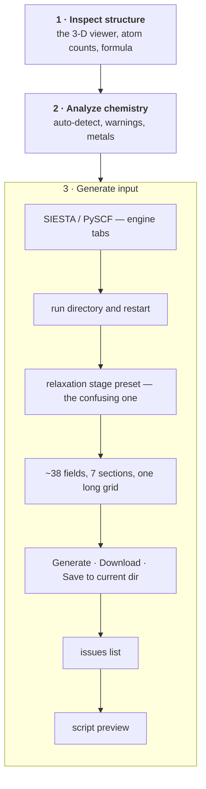
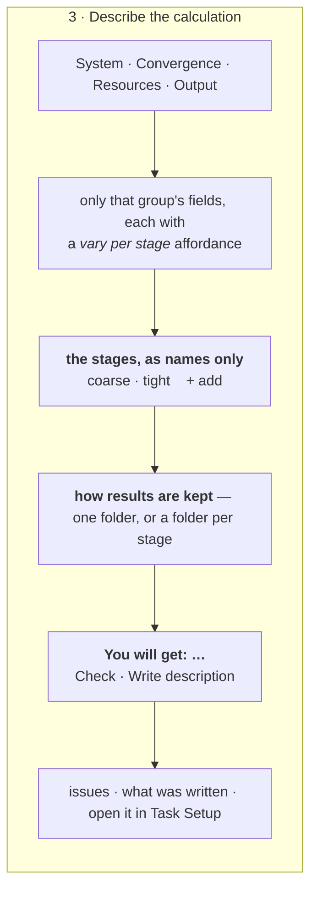

# The Structure-optimization tab — writing the description

**Role:** plan
**Domain:** web
**Companions — the contracts this surface is built against, and where the two
disagree those win:** [`engines/stages.md`](?doc=engines/stages.md) — what a
stage is, the effective config, `task.json`;
[`execution/run-identity.md`](?doc=execution/run-identity.md) — the id this page
displays and the parameters that decide whether a stage continues;
[`staged-runs-architecture.md`](?doc=web/staged-runs-architecture.md) — the plan
that schedules both, and the order this page comes in;
[`job-contracts.md`](?doc=execution/job-contracts.md) — what a stage *is* on disk
(`job-contracts.md § 2.1` and `job-contracts.md § 2.3`);
[`form-schema.md`](?doc=web/form-schema.md) — how this tab's fields get on
screen at all;
[`task-setup-plan.md`](?doc=web/task-setup-plan.md) — **the shared tab this one
hands off to**.

**Status: a proposal.** Nothing here is built.

> **The page was split in two (user decision, 2026-08-07), and this document is
> now the first half.** Collecting the physics and deciding which parameters vary
> is one job; giving those parameters their per-stage values, days later, having
> seen how the first stage went, is another. They shared a card because they
> happen in one sitting the first time — not because they are one job.
>
> **This tab writes a description. [`Task Setup`](?doc=web/task-setup-plan.md)
> finishes it.** The line falls where `task.json` already draws it: `varies` is
> the column set and `overrides` are the cells, so **this page defines the
> columns and the shared tab fills them** (`engines/stages.md § 6.2`).
>
> Everything about the stage table, the seven operations that can silently
> destroy a value, and what a promoted resource field means has moved to that
> document — one place, not two. What stays here is the page that collects the
> physics, decides what varies, and writes the folder.
>
> **A one-stage calculation never leaves this tab**
> (`engines/stages.md § 6.5`: one stage is no stages), so today's whole workflow
> is untouched by the split.

---

## 1. The two complaints, stated exactly

**"The stage drop menu is not obvious what it does."** It is a *form autofill*.
Choosing "Stage 2 — Medium" rewrites nine convergence fields and does nothing
else — no second file, no folder, no chain. The template says as much in a
comment: *a UI shortcut, NOT a SiestaConfig field*.

That would be forgivable if the word meant one thing. It means three:

| Where | What "stage" means there |
|---|---|
| this dropdown | a preset that bulk-fills nine fields |
| a stage of the ladder | a real step with its own deck, named `<label>_<stagename>`. It lives in `task.json`, never in the engine config — `cfg.stages` was **deleted** 2026-08-07 (`stages.md § 1.1`) |
| `fdf --stage N` | emit one step's file alone, under a *different* naming convention (`<label>-stage<N>`) |

So the control reads as *make me stage 2 of a sequence* and delivers *one file
with different numbers in it*.

**This design collapses the first two.** The dropdown becomes the act of naming
a stage, and a named stage is a real one that produces its own deck — so choosing
"tight" and getting `<id>_tight.fdf` is one act rather than two unrelated ones.
The third (`fdf --stage N`) retires: the implementation plan's P5 keeps the tier
*values* as the defaults a new stage is created with and drops the one-shot flag.

**"The UI is very jammed."** One card carries the run directory, the restart
policy, the stage preset, ~38 schema fields in seven sections, the engine
switch, four action buttons, an issues list and a script preview — all at once,
all always.

**The split answers the second complaint by subtraction.** Half of that card is
not this page's work at all: the per-stage values belong to a page you open on a
folder, not to the form where you chose the functional. What is left here fits in
one column.

---

## 2. What the page is made of today



Everything in card 3 is visible at once, and the only thing that ever *acts* —
the button row — sits below the longest thing on the page.

---

## 3. The three ideas the design rests on

### 3.1 A single script is a system with one stage

A stage is molbuilder's own way of holding the parameters a mission tunes over
the shared description of the system it does not
([`engines/stages.md § 1`](?doc=engines/stages.md)). The engine has no such
concept, so a one-stage description is not a degenerate case of anything —
it is the ordinary case, and it produces exactly the file the tab produces
today.

**One list of stages, whose one-row case is today's behaviour**, and the page
says what you are getting. No toggle, no "batch mode", nothing to explain about
which system you are in.

### 3.2 Subtab what you *set*; never subtab what you *do*

Parameters can hide behind tabs because you visit them once and leave. The
stages and the actions cannot: they are the reason the page exists, and a button
you have to go looking for is a button that gets missed.

So the fields are tabbed and nothing else is: the stage names, the shape, the
outcome line and the action row all stay on screen.

### 3.3 The schema already knows which fields a stage usually tunes

Every SIESTA field carries a `workflow_group`, and there are exactly three:

| group | fields | what it describes | how often it changes |
|---|--:|---|---|
| `profile` | 20 | the system and its physics | once per molecule |
| `budget` | 9 | cores, memory, wall time, SCF ceiling | once per machine — **but see § 7.5** |
| `stage` | 9 | convergence targets — mesh, k-grid, DM tolerances, energy shift, force, displacement | **once per stage** |

That is not a UI invention: it is the grouping the config already carries, and
it is what the stage preset already writes to.

> **Those counts are today's.** This plan moves five fields off the stage type
> into the shared schema and adds `restart`
> (`engines/stages.md § 3`), so the groups grow. Nothing below depends
> on the totals — only on there being three groups and on `stage` being the useful
> default.

But those nine are a **default proposal, not the definition of a stage** — which
parameters vary is the user's to choose, and choosing is this page's job (§ 7).
What those parameters are *set to*, per stage, is
[`task-setup-plan.md`](?doc=web/task-setup-plan.md).

---

## 4. The layout, now that half the content left

Three arrangements of one card were proposed here — subtabs above with the stage
list below, a two-column split, and the stage list as the page's spine. **All
three are withdrawn**, because they were solving the jamming complaint by
*folding* content, and the split solves it by *removing* content. Half the card
went to [`Task Setup`](?doc=web/task-setup-plan.md).

What is left is one column, in reading order:



**The stage list here is names, not values.** Naming the rungs is part of saying
what the mission is; giving them numbers is the other tab's job, and it is the
job you come back to. A row here carries a name, and nothing else.

**One column survives a narrow panel**, which matters because this tab already
competes with the projects sidebar for width — and the two-column arrangement
fell back to one below about 900 px anyway.

---

## 6. What each part says

**The subtab bar** carries the sections the schema already declares, folded to
the `workflow_group` axis where they disagree — four tabs, not seven:
*System* (system, spin, XC, basis) · *Convergence* (the stage-group fields, for
the selected stage) · *Resources* (compute and budget) · *Output* (output and
positioning, and the project and topic the folder goes under).

> **The run directory is no longer typed.** The user picks the project and the
> topic; the last segment is the id, derived and shown
> (`execution/run-identity.md § 3`). One name fewer to keep in step, and a
> folder listing that identifies what is in it.

**The stage list** is names only. One row by default, and that row is today's
behaviour. A row names itself — *coarse* / *medium* / *tight*, or a name you type
— and can be removed. Naming the rungs is part of saying what the mission is;
**giving them values is [`Task Setup`](?doc=web/task-setup-plan.md)'s job**, and
it is the job you come back to days later with a finished stage to look at.

> **The row presets keep their names but not their old job.** Choosing *tight*
> here creates a stage called `tight`; it does not fill nine convergence fields
> into the form, which is what the dropdown does today and what made it
> confusing. Filling a stage's values happens where the values live.
>
> **And two different things are called a preset.** The shipped *strategy* preset
> (`--stage-strategy loose-only | publishable | vib-quality`) chooses **which
> stages are enabled**; the row preset (coarse / medium / tight) fills **one
> stage's values**. The UI should not use one word for both.

**How results are kept** — flat or hierarchical — is asked here, because
`shape` is required with no default (`engines/stages.md § 6.7`) and this page is
what writes the file first. It is phrased as what it does rather than by its
name: *everything in one folder*, or *a folder for each stage*.

**The outcome line** is the sentence that fixes the original complaint. It says
what will exist when you press the button, in the terms the folder actually uses:

```
You will get:  2 decks in projects/BDT-Au/optimization/BDT_Au_relax_C6H4S2Au38/
               BDT_Au_relax_C6H4S2Au38_coarse.fdf
               BDT_Au_relax_C6H4S2Au38_tight.fdf
               sharing one basename, so tight continues from coarse
```

It changes as rows come and go, so the connection between the stage list and the
files is never in doubt. A one-stage description says `1 deck`, and that is the
whole difference.

> **What the outcome line may promise, and what it may not** (corrected
> 2026-08-07 — see § 8). The page writes a **template plus `task.json`**, not
> the rendered decks: a deck cannot be finished until the machine is known
> (`project-layout.md` § 2.2). So the deck names above are what **`prep` will
> produce**, and the line should say that rather than implying the files appear
> now. Naming them is still worth doing — it is how a user connects the stage
> list to the files they will get.
>
> Nor may it promise a subdirectory per stage. **That is one of the two shapes**,
> and the choice is a **field in the description** (`engines/stages.md § 6.7`),
> which this page is what writes — so the tab must ask for it (`project-layout.md`
> § 1). A
> flat calculation keeps every stage in one directory, told apart by the
> filename suffix. A page that draws three directories has picked a shape it does
> not get to pick. What it can honestly say is *what will be produced*: one deck
> per enabled stage, sharing one basename so a later stage can continue from an
> earlier one.

**The action row** is Check and Generate, in that order, always visible.

**And the page has to be reachable from an existing folder**, not only from a
blank form — that is the *open* operation in
[`task-setup-plan.md`](?doc=web/task-setup-plan.md) § 7, and it is what makes the
promoted set worth storing at all (`staged-runs-architecture.md § 5.2`). A user
who ran a two-stage relaxation last week and wants a third stage should reopen the
description, not rebuild it from a screenshot of the old one.

---

## 7. The hard part: which parameters vary, and who decides

The layout above is the easy half. The real difficulty is that **the set of
per-stage parameters cannot be fixed in advance**. One run wants the grid
density to sharpen across stages; another wants the compute budget to grow with
the tightening; another wants only a convergence threshold to move. A design
that ships one blessed list is wrong for every second user.

### 7.1 What this page decides, and what it does not

The architecture settles what a stage is (§ 2): **a name, whether it gets
written, and an overlay.** Everything a single run can also mean is an ordinary
field of the shared schema, which a stage may override like any other. So there
is no second class of per-stage setting to find a different control for.

**This page owns the column set.** Every field in the four subtabs carries a
*vary per stage* affordance; using it moves that field into the description's
`varies` list. The alternative — a long "add a parameter" menu of all 38 — is a
second place to find a field, and the wrong one to reach for.

Its default is the fields the schema tags `workflow_group: "stage"`, because
that is the useful starting point, not because those nine are special.

**It does not own the values.** The model, the per-stage table, and the seven
operations that can each silently destroy a value are
[`task-setup-plan.md`](?doc=web/task-setup-plan.md) § 5–§ 7 — one place, because
a rule stated twice is a rule that will disagree with itself.

Two of those operations are performed *here*, since promotion happens where the
parameter lives:

- **promote** — **seeds every stage with the current base value**, so promoting
  changes nothing on screen. It is a statement about *structure*, never about
  values.
- **demote** — the stages disagree and one value must survive: **the last enabled
  stage wins**, because that is the production stage and the value a single run
  would use. The page says which value it kept, and says it *before* the click.

### 7.5 Resources are not only a budget

The `budget` group looks like it belongs to the machine rather than the science,
and mostly it does. Two of its fields do not, and the UI must not hide them
behind a "resources" label that reads as *speed only*
(`engines/stages.md § 5`):

- **The eigensolver** (`Diag.Algorithm` — ScaLAPACK vs ELPA) is a line in the
  deck and a numerical choice, and it also decides which environment the wrapper
  activates: any ELPA variant routes to `molbuilder-siesta-gpu`
  (`running-a-job.md § 2.3`). A coarse stage on ScaLAPACK and a tight stage on
  ELPA-GPU is an ordinary thing to want, and it works — each deck gets its own
  wrapper.
- **The rank count** feeds a deck line. `BlockSize` is derived from ranks and
  atom count, so varying `mpi_np` per stage changes each stage's deck, not only
  its launch (`engines/stages.md § 5.2`).

So the table above puts *MPI ranks* among the ordinary rows, and the Resources
subtab should say plainly which of its fields reach the deck. A field that
changes the file is not a preference.

### 7.6 What gets written

A column is a config: the template overlaid with that stage's `overrides`. So **n
columns produce n decks**, written into one folder with one shared basename
(`job-contracts.md § 2.1` Rule 2) — and one column produces one deck with no
suffix, because one column is the template as-is (`task-setup-plan.md` § 5). Nothing here
invents a directory
layout: it is `job-contracts.md § 2.1` Rule 1 and Rule 2, which is what makes
continuing free.

---

## 7.6 How a parameter is promoted: a checkbox, in place

*User decision, 2026-08-07.* **There is no separate list of stage-able
settings anywhere in the UI.** The form already lists every parameter this
engine has; each one carries a **"vary per stage" checkbox beside it**, and what
is ticked **is** `varies` in the description.

Three things follow, and they are why this is the shape rather than a panel:

- **No second copy of the field set.** A curated list of "settings you may vary"
  would be the field list written twice, drifting from the first the moment
  anyone adds a parameter — the exact duplication that limited a stage to four
  values (`engines/stages.md § 1.2`).
- **The default is what is pre-ticked, not what is offered.** The engine's
  `workflow_group: "stage"` group starts checked; every other parameter is
  checked-able. Nothing is withheld.
- **Selection happens where the value already is.** The user is looking at
  `mesh_cutoff` when they decide it should vary, so the control belongs there —
  not on another screen that names it a second time.

```text
    Mesh cutoff        [ 300 ] Ry        [x] vary per stage
    Basis size         [ DZP ▾]          [x] vary per stage
    XC functional      [ GGA ▾]          [ ] vary per stage
    Relaxation         [ CG  ▾]          [x] vary per stage
```

The tab writes the ticked names into `varies` and the stage list into
`task.json`; the per-stage **values** are given in Task Setup
([`task-setup-plan.md`](?doc=web/task-setup-plan.md)), whose columns are exactly
these ticks.

---

## 8. Where the machine comes in — not here, and that is the design

> **Rewritten 2026-08-07.** This section described the page writing finished
> decks, per-stage subdirectories and wrappers, and a second stage that
> *"carries coarse's `.XV`/`.DM`, localized first"*. All three were overtaken by
> [`project-layout.md`](?doc=execution/project-layout.md) § 2, and this document's
> own header says the contracts win. Corrected below.

**The page's job ends at a portable package — not at runnable decks.** That is
not a limitation of the tab; it is a boundary the science puts there. A deck
carries values that depend on *how it will be launched* — a block size derived
from the rank count, an eigensolver that also decides which environment the
wrapper activates — and **a parameter that depends on the launch cannot be
decided before the launch is known** (`project-layout.md` § 2.2). A browser on a
laptop does not know the machine, so a deck it "finished" would be full of
guesses.

So the page writes what any machine can read, and stops:

```text
Written to  projects/BDT-Au/optimization/BDT_Au_relax_C6H4S2Au38/

    BDT_Au_relax_C6H4S2Au38.fdf.template   the science backbone
    task.json                            what each stage tunes
    Au.psml  S.psml  C.psml  H.psml        the data files
    mb_monitor.py

Then, in Task Setup, give each stage its values.
Then, on the machine that will run it:

    molbuilder jobset prep run coarse      resolves this machine, renders the
                                           deck and wrapper, builds the attempt
    molbuilder jobset submit run coarse
```

**What `prep` adds is the whole second half**, and none of it is the tab's: it
detects the target, renders `<id>_<name>.fdf` with the machine's numbers in it,
renders the wrapper with the activation baked in, creates the stage directory and
the attempt, and copies in whatever the user named to continue from
(`project-layout.md` § 2.3).

**Three specific corrections, because each was a real claim:**

| The old text said | What the contracts say |
|---|---|
| the page writes `coarse/` and `tight/` subdirectories | **`prep` creates stage directories**, named `<seq>_<name>` — `01_coarse`, not `coarse` (`project-layout.md` § 4.1) |
| the page writes a `.run.sh` per stage | a wrapper is baked for **a target**, so it cannot exist before the target is known (`project-layout.md` § 2.2) |
| run tight after coarse; it *"carries coarse's `.XV`/`.DM`, localized first"* | **stages do not chain** (`project-layout.md` § 1.6). Each is prepped and submitted on its own, *after you have looked at the previous one*, and what it continues from is a **real file copied in at prep** — there is nothing to localize at run time |

**Why the last one matters to this page in particular.** The tab is where a user
would most naturally expect a "run all stages" button, and the design deliberately
does not have one: a stage is a long job, and a chain that continues by itself can
spend a week refining a geometry you would have rejected in a minute. **The page
should not offer what the design removed on purpose** — what it can offer is the
next single command, which is what the block above shows.

**Handing a sequence to a scheduler remains a separate, later feature** — the
JobSet export in `staged-runs-architecture.md` § 7 — and it is gated on proving
the SIESTA ladder end-to-end on a real cluster first. A page that led with it
would be describing a system the user did not ask for.

> **Still open, and it reaches this page:** where the results come back to. Every
> file movement in the design points *outward*, and `prep` is a hub you return to
> — over ssh, on the target, not in this tab
> ([`project-layout.md`](?doc=execution/project-layout.md) § 2.7). Until that is
> decided, this page cannot honestly promise to show a run's results when the run
> happened somewhere else.

---

## 9. Open decisions

1. ~~**Does one stage still emit a bare `<id>.fdf`?**~~ **Answered** by
   `engines/stages.md § 6.4`: a description with no `stages` key is one
   parameter set and writes `<id>.fdf`, unsuffixed — today's behaviour, reachable
   without understanding stages at all. The suffix appears the moment a second
   stage does.
2. **Do the four subtabs remember which was open?** The tab already persists form
   values in `sessionStorage`; the open subtab is the same kind of fact.
3. **Does PySCF get the same treatment now or later?** Its staged relaxation runs
   inside one process and writes one log (`job-contracts.md § 2.3`), so "one deck
   per stage" is not true there. Recommended: SIESTA only, until the model is
   proven.
4. **Where do "Inspect structure" and "Analyze chemistry" go?** Untouched by this
   plan, but if the page is still jammed with card 3 tamed, they are the next
   candidates for folding.
5. **Does demote really keep the last stage's value?** (§ 7.1) The alternative is
   asking every time, which is safer and more tiring. A third option is keeping
   the *first* stage's, on the grounds that it is what a coarse single run wants.
6. ~~**Is the promoted set saved with the project?**~~ **Answered by the split.**
   It is written to `task.json` when the description is written, and the tab
   holds nothing across reloads that the folder does not — the same rule
   [`task-setup-plan.md`](?doc=web/task-setup-plan.md) § 3.1 states for the
   shared tab, and for the same reason.
7. **How does the tab show that two stages need different environments?** § 7.5
   makes it possible; a folder whose decks activate two different conda envs is
   correct but surprising if nothing says so.

---

## 10. What this plan is not

It does not change what a stage means on disk, or the naming conventions. It
reuses the shipped run-directory contract exactly as the CLI does: one job per
directory, several inputs allowed, one basename shared by all of them.

It is **not** free of backend work, and saying otherwise would be the easy lie.
The generator has to render from an effective config, expand `restart` into the
engine's bound parameters, route a promoted `continue_retries` to that stage's
wrapper, and derive `BlockSize` from that stage's rank count. Those are
`engines/stages.md` and `execution/run-identity.md`, and they come before any of
this is drawn — milestone **M2** of
[`staged-runs-implementation-plan.md`](?doc=execution/staged-runs-implementation-plan.md),
which is the gate that plan puts in front of every UI item.
