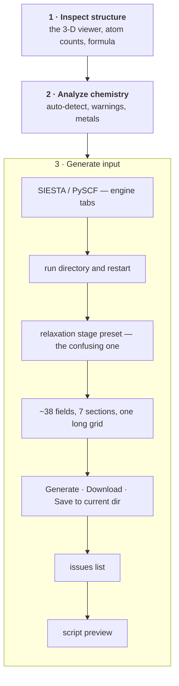
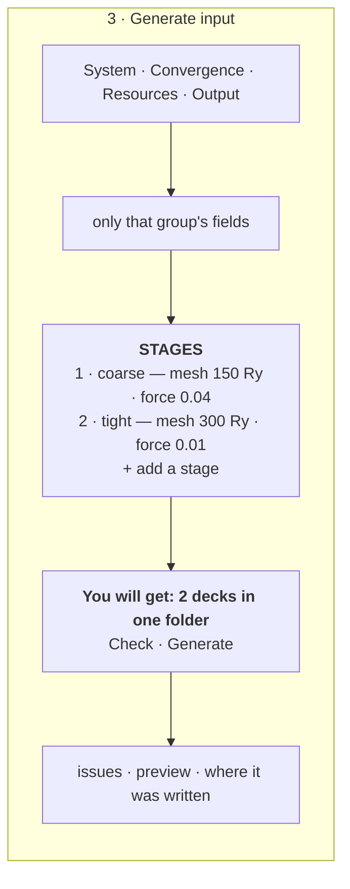
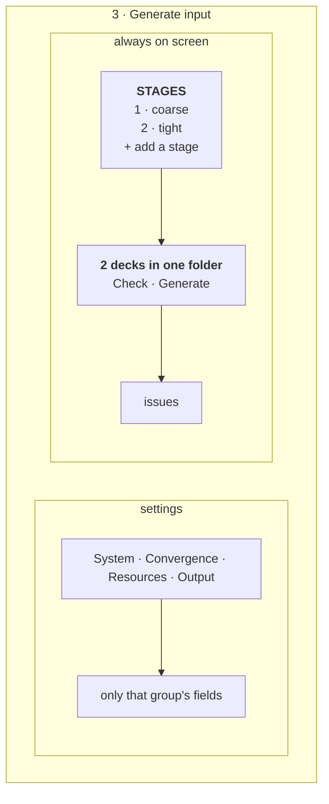
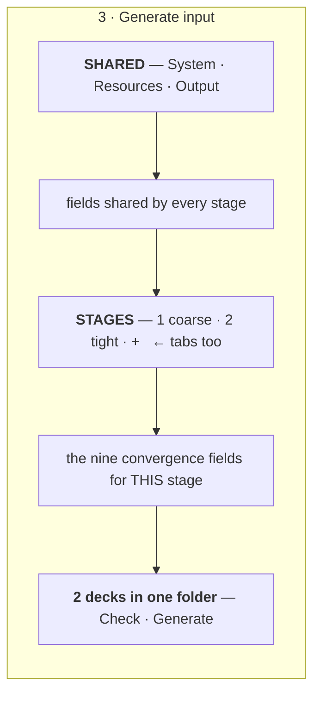

# The Structure-optimization tab — one page for one parameter set and for several

**Role:** plan
**Domain:** web
**Companions — the contracts this surface is built against, and where the two
disagree those win:** [`engines/stages.md`](?doc=engines/stages.md) — what a
stage is, the effective config, `stages.json`;
[`execution/run-identity.md`](?doc=execution/run-identity.md) — the id this page
displays and the parameters that decide whether a stage continues;
[`staged-runs-architecture.md`](?doc=web/staged-runs-architecture.md) — the plan
that schedules both, and the order this page comes in;
[`job-contracts.md`](?doc=execution/job-contracts.md) — what a stage *is* on disk
(`job-contracts.md § 2.1` and `job-contracts.md § 2.3`);
[`form-schema.md`](?doc=web/form-schema.md) — how this tab's fields get on
screen at all.

**Status: a proposal.** Nothing here is built. It offers three arrangements of
one page and recommends one; the decisions still open are listed at the end.

---

## 1. The two complaints, stated exactly

**"The stage drop menu is not obvious what it does."** It is a *form autofill*.
Choosing "Stage 2 — Medium" rewrites nine convergence fields and does nothing
else — no second file, no folder, no chain. The template says as much in a
comment: *a UI shortcut, NOT a SiestaConfig field*.

That would be forgivable if the word meant one thing. It means three:

| Where | What "stage" means there |
|---|---|
| this dropdown | a preset that bulk-fills nine fields |
| `cfg.stages` | a real step with its own deck, named `<label>_<stagename>` |
| `fdf --stage N` | emit one step's file alone, under a *different* naming convention (`<label>-stage<N>`) |

So the control reads as *make me stage 2 of a sequence* and delivers *one file
with different numbers in it*.

**This design collapses the first two.** The dropdown becomes a preset that fills
a row of the stage table, and a row is a real stage that produces its own deck —
so choosing "tight" and getting `<id>_tight.fdf` is one act rather than two
unrelated ones. The third (`fdf --stage N`) is a CLI overlay under its own
naming convention and stays where it is; `staged-runs-architecture.md § 9`
records that the two conventions do not yet agree.

**"The UI is very jammed."** One card carries the run directory, the restart
policy, the stage preset, ~38 schema fields in seven sections, the engine
switch, four action buttons, an issues list and a script preview — all at once,
all always.

---

## 2. What the page is made of today



Everything in card 3 is visible at once, and the only thing that ever *acts* —
the button row — sits below the longest thing on the page.

---

## 3. The three ideas the design rests on

### 3.1 A single script is a system with one stage

A stage is molbuilder's own way of holding the parameters a mission tunes over
the shared description of the system it does not
([`engines/stages.md § 1`](?doc=engines/stages.md)). The engine has no such
concept, so a one-stage description is not a degenerate case of anything —
it is the ordinary case, and it produces exactly the file the tab produces
today.

**One list of stages, whose one-row case is today's behaviour**, and the page
says what you are getting. No toggle, no "batch mode", nothing to explain about
which system you are in.

### 3.2 Subtab what you *set*; never subtab what you *do*

Parameters can hide behind tabs because you visit them once and leave. The
stages and the actions cannot: they are the reason the page exists, and a button
you have to go looking for is a button that gets missed.

So the page splits in two, and only the first half is tabbed.

### 3.3 The schema already knows which fields a stage usually tunes

Every SIESTA field carries a `workflow_group`, and there are exactly three:

| group | fields | what it describes | how often it changes |
|---|--:|---|---|
| `profile` | 20 | the system and its physics | once per molecule |
| `budget` | 9 | cores, memory, wall time, SCF ceiling | once per machine — **but see § 7.5** |
| `stage` | 9 | convergence targets — mesh, k-grid, DM tolerances, energy shift, force, displacement | **once per stage** |

That is not a UI invention: it is the grouping the config already carries, and
it is what the stage preset already writes to.

> **Those counts are today's.** This plan moves five fields off the stage type
> into the shared schema and adds `restart`
> (`engines/stages.md § 3`), so the groups grow. Nothing below depends
> on the totals — only on there being three groups and on `stage` being the useful
> default.

But those nine are a **default proposal, not the definition of a stage** — which
parameters vary is the user's to choose, and that is the hard part of the
design. § 7 is about nothing else.

---

## 4. Three arrangements

All three keep card 1 and card 2 as they are. All three replace card 3.

### Option A — Subtabs above, stages below



*For it:* smallest change from today; one column, so it survives a narrow panel;
the reading order is still top-to-bottom.
*Against it:* the stage list scrolls away while you edit parameters — the thing
you are building is out of sight exactly when you are changing it.

### Option B — Settings left, stages right



*For it:* the stage list never leaves the screen; editing a convergence field
and watching the row change is one glance.
*Against it:* needs width, and this tab already competes with the projects
sidebar; below about 900 px it falls back to Option A's stacking anyway.

### Option C — The stage list is the spine



*For it:* the clearest statement of what a stage *is* — shared settings above,
per-stage settings below, and the difference visible in the layout itself.
*Against it:* two tab strips on one card is a lot of chrome, and the one-stage
case — today's whole workflow — pays for machinery it does not use.

---

## 5. The recommendation

**Option A, with B's split adopted as a container query when the box is wide
enough.** They are the same content; B is A after a `@container` flip, so this
is one layout with a width rule rather than two designs.

And **Option C's insight without its second tab strip**: the stage table shows
each stage's promoted values *inline and editable* in the row. A stage is small
enough to be a row — a handful of numbers — so it does not need a panel of its
own. The "Convergence" subtab then edits the *selected* row, and the table is
both the list and the summary.

Why not C proper: the one-stage case is the common case, and C makes it look
like a sequence with one step rather than a script with some settings.

---

## 6. What each part says

**The subtab bar** carries the sections the schema already declares, folded to
the `workflow_group` axis where they disagree — four tabs, not seven:
*System* (system, spin, XC, basis) · *Convergence* (the stage-group fields, for
the selected stage) · *Resources* (compute and budget) · *Output* (output and
positioning, and the project and topic the folder goes under).

> **The run directory is no longer typed.** The user picks the project and the
> topic; the last segment is the id, derived and shown
> (`execution/run-identity.md § 3`). One name fewer to keep in step, and a
> folder listing that identifies what is in it.

**The stage table** is the description. One row by default, and that row is
today's behaviour. A row names itself (coarse / medium / tight / a name you
type), shows its promoted values, and can be removed. The presets fill a row —
which is what the dropdown always did, now attached to the thing it fills.

> **Two different things are called a preset.** The shipped *strategy* preset
> (`--stage-strategy loose-only | publishable | vib-quality`) chooses **which
> stages are enabled**; the row preset (coarse / medium / tight) fills **one
> stage's values**. The UI should not use one word for both.

**The outcome line** is the sentence that fixes the original complaint. It says
what will exist when you press the button, in the terms the folder actually uses:

```
You will get:  2 decks in projects/BDT-Au/optimization/bdt_au_relax_c6h4s2au38/
               bdt_au_relax_c6h4s2au38_coarse.fdf
               bdt_au_relax_c6h4s2au38_tight.fdf
               sharing one basename, so tight continues from coarse
```

It changes as rows come and go, so the connection between the stage list and the
files is never in doubt. A one-stage description says `1 deck`, and that is the
whole difference.

Each stage gets its **own subdirectory**, so its results stay its own
(`engines/stages.md § 7.1`) — and the outcome line should say so, because a user
expecting one directory and finding three needs to have been told once.

**The action row** is Check and Generate, in that order, always visible.

**And the page has to be reachable from an existing folder**, not only from a
blank form — that is the *open* operation in § 7.3, and it is what makes the
promoted set worth storing at all (`staged-runs-architecture.md § 5.2`). A user
who ran a two-stage relaxation last week and wants a third stage should reopen the
description, not rebuild it from a screenshot of the old one.

---

## 7. The hard part: which parameters vary, and who decides

The layout above is the easy half. The real difficulty is that **the set of
per-stage parameters cannot be fixed in advance**. One run wants the grid
density to sharpen across stages; another wants the compute budget to grow with
the tightening; another wants only a convergence threshold to move. A design
that ships one blessed list is wrong for every second user.

### 7.1 What a stage is, on this page

The architecture settles it (§ 2): **a stage is a name, whether it gets written,
and an overlay.** Everything a single run can also mean is an ordinary field of
the shared schema, which a stage may override like any other.

That is what makes the table below possible. There is no second class of
per-stage setting to find a different control for — a promoted field looks the
same in the table whatever group it came from.

### 7.2 The model

```js
description = {
    base:   { …every field in the schema, one value each… },   // the shared system
    varies: ["mesh_cutoff", "relax_force_tol", "relax_type", "restart"],
    stages: [
        { name: "coarse", enabled: true,
          overrides: { mesh_cutoff: 150, relax_force_tol: 0.04,
                       relax_type: "CG",      restart: "clean"    } },
        { name: "tight",  enabled: true,
          overrides: { mesh_cutoff: 300, relax_force_tol: 0.01,
                       relax_type: "Broyden", restart: "continue" } },
    ],
}
```

Three rules keep it honest:

1. **`varies` is the column set.** Every stage's `overrides` holds exactly those
   keys — no more, so a demoted parameter cannot leave a value hiding in a stage
   nobody can see.
2. **`base` holds a value for every field, always**, including the promoted ones.
   A one-stage description is then just `base`, which is what makes § 3.1 true —
   and it is literally true on disk: **with a single stage there is nothing to
   vary across, so its overrides and `base` are the same thing.** The tab always
   shows at least one row, but a description with one row is written with no
   `stages` key at all and produces `<id>.fdf`
   (`engines/stages.md § 6.4`). The suffix, and the `stages` key, appear
   together the moment a second row does.
3. **The default `varies` is a proposal, not a law.** It starts as the fields the
   schema tags `workflow_group: "stage"` — the ones the preset writes to —
   because that is the useful default, not because they are special.

### 7.3 The operations, and what each one must not lose

This is where the care goes: every one of these can silently destroy a value if
its rule is not stated.

| Operation | What it does | The rule that keeps it safe |
|---|---|---|
| **promote** a field | adds it to `varies` | **seeds every stage with the current base value**, so promoting changes nothing on screen. Promotion is a statement about *structure*, never about values |
| **demote** a field | removes it from `varies` | the stages disagree and one value must survive: **the last enabled stage wins**, because that is the production stage and the value a single run would use. The UI says which value it kept, and says it *before* the click, not after |
| **add a stage** | appends a row | **copies the previous stage's overrides**. A refinement starts from what came before; a stage that inherits nothing is a different calculation, not a next step |
| **remove a stage** | drops a column | refused when it is the last one — a description has at least one stage |
| **reorder** | moves a stage | the files are written in order and `restart` reads that order, so this is a real edit, not a display preference |
| **edit a cell** | sets one stage's value | nothing else moves. A cell equal to `base` is drawn quietly; one that differs is drawn plainly, so *progressive change is visible as a shape* |
| **apply a row preset** | fills a column | a preset knows nine fields. If some are not promoted it **promotes them first** — a preset that half-applied would be worse than one that refused |
| **open** an existing description | replaces the whole table from a folder's `stages.json` | it is a **load, not a merge**: values, promoted set, stages and order all come from the file, because a half-loaded description is one nobody can reason about. The id is read, never recomputed (`execution/run-identity.md § 3`), and the file goes through the same preflight as a fresh one — a description that has sat on disk is exactly the one whose schema may have moved |

### 7.4 The panel

One table, rows are parameters and columns are stages — the shape the data
already has:

| Parameter | | coarse | tight | final |
|---|---|---|---|---|
| mesh cutoff | Ry | 150 | 300 | 300 |
| force tolerance | eV/Å | 0.04 | 0.02 | 0.01 |
| relaxation | | CG | Broyden | Broyden |
| MPI ranks | | 8 | 16 | 16 |
| **start from** | | **clean** | **continue** | **continue** |
| | | `+ add a parameter` | `row preset ▾` | `+ stage` · `remove` |

*shared with every stage: everything else → System · Resources · Output*

Three things the table has to get right:

- **"Start from" is one control, and it is one field.** Saying a stage continues
  sets the engine's own restart parameters — for SIESTA, `DM.UseSaveDM`,
  `MD.UseSaveXV` and `MD.UseSaveCG` together. The user states the intent once and
  the **generator** expands it (`execution/run-identity.md § 4`); nothing asks
  anyone to keep three keys in step. It is drawn emphasised because it is the
  one row that decides whether the folder's shared warm files are read.
- **It never names *which* stage to continue from.** "Continue" means *from the
  stage before this one* — a fact about the description, not about what happened
  to run last (`engines/stages.md § 7.1`). Offering a choice of predecessor would
  make the carry graph diverge from the stage order, which is the one thing a
  single ordered list cannot express and should not learn to.
- **Promotion happens where the parameter lives.** Every field in the other
  subtabs carries a "vary per stage" affordance; using it moves that field into
  this table. The alternative — a long "add a parameter" menu of all 38 — is a
  second place to find a field, and the wrong one to reach for.

### 7.5 Resources are not only a budget

The `budget` group looks like it belongs to the machine rather than the science,
and mostly it does. Two of its fields do not, and the UI must not hide them
behind a "resources" label that reads as *speed only*
(`engines/stages.md § 5`):

- **The eigensolver** (`Diag.Algorithm` — ScaLAPACK vs ELPA) is a line in the
  deck and a numerical choice, and it also decides which environment the wrapper
  activates: any ELPA variant routes to `molbuilder-siesta-gpu`
  (`running-a-job.md § 2.3`). A coarse stage on ScaLAPACK and a tight stage on
  ELPA-GPU is an ordinary thing to want, and it works — each deck gets its own
  wrapper.
- **The rank count** feeds a deck line. `BlockSize` is derived from ranks and
  atom count, so varying `mpi_np` per stage changes each stage's deck, not only
  its launch (`engines/stages.md § 5.2`).

So the table above puts *MPI ranks* among the ordinary rows, and the Resources
subtab should say plainly which of its fields reach the deck. A field that
changes the file is not a preference.

### 7.6 What gets written

A column is a config: `base` overlaid with that stage's `overrides`. So **n
columns produce n decks**, written into one folder with one shared basename
(`job-contracts.md § 2.1` Rule 2) — and one column produces one deck with no
suffix, because one column is `base` (§ 7.2). Nothing here invents a directory
layout: it is `job-contracts.md § 2.1` Rule 1 and Rule 2, which is what makes
continuing free.

---

## 8. Where the cluster comes in — later, and optionally

The page's job ends at correct decks in a folder. Running them is the user's,
and the tab should say how without pretending to do it:

```
Written to  projects/BDT-Au/optimization/bdt_au_relax_c6h4s2au38/

              coarse/  tight/           ← one subdirectory per stage
              shared:  Au.psml  S.psml  …  mb_monitor.py

Run one:    cd coarse && bash ../bdt_au_relax_c6h4s2au38_coarse.run.sh
Then:       cd tight  && bash ../bdt_au_relax_c6h4s2au38_tight.run.sh
                                       ← carries coarse's .XV/.DM, localized first
```

Those wrappers exist because the server generated them, which means an activation
was configured — `script_generation.activation` has no default and generation
refuses without it (`running-a-job.md § 5.2`). That is the operator's setup, not
the tab's, and this page neither asks for it nor works around it. On a machine
with a `scheduler` block the same generate also writes `.sbatch` files
(`running-a-job.md § 5.3`); the tab shows whichever it wrote.

**Handing the sequence to a scheduler is a separate, later feature** — the
JobSet export in `staged-runs-architecture.md § 7` — and it is gated on proving
the SIESTA ladder end-to-end on a real cluster first. It is not what this page
is for, and a page that led with it would be describing a system the user did
not ask for.

---

## 9. Open decisions

1. ~~**Does one stage still emit a bare `<id>.fdf`?**~~ **Answered** by
   `engines/stages.md § 6.4`: a description with no `stages` key is one
   parameter set and writes `<id>.fdf`, unsuffixed — today's behaviour, reachable
   without understanding stages at all. The suffix appears the moment a second
   stage does.
2. **Do the four subtabs remember which was open?** The tab already persists form
   values in `sessionStorage`; the open subtab is the same kind of fact.
3. **Does PySCF get the same treatment now or later?** Its staged relaxation runs
   inside one process and writes one log (`job-contracts.md § 2.3`), so "one deck
   per stage" is not true there. Recommended: SIESTA only, until the model is
   proven.
4. **Where do "Inspect structure" and "Analyze chemistry" go?** Untouched by this
   plan, but if the page is still jammed with card 3 tamed, they are the next
   candidates for folding.
5. **Does demote really keep the last stage's value?** (§ 7.3) The alternative is
   asking every time, which is safer and more tiring. A third option is keeping
   the *first* stage's, on the grounds that it is what a coarse single run wants.
6. **Is the promoted set saved with the project?** It is a description of intent,
   not a value, and losing it on reload would be worse than losing a field.
   (The architecture answers the *file* half — `varies` is in `stages.json`
   because it cannot be inferred. This is about the tab between reloads.)
7. **How does the tab show that two stages need different environments?** § 7.5
   makes it possible; a folder whose decks activate two different conda envs is
   correct but surprising if nothing says so.

---

## 10. What this plan is not

It does not change what a stage means on disk, or the naming conventions. It
reuses the shipped run-directory contract exactly as the CLI does: one job per
directory, several inputs allowed, one basename shared by all of them.

It is **not** free of backend work, and saying otherwise would be the easy lie.
The generator has to render from an effective config, expand `restart` into the
engine's bound parameters, route a promoted `continue_retries` to that stage's
wrapper, and derive `BlockSize` from that stage's rank count. Those are
`engines/stages.md` and `execution/run-identity.md`, scheduled by
`staged-runs-architecture.md § 8`, and they come before any of this is drawn.
