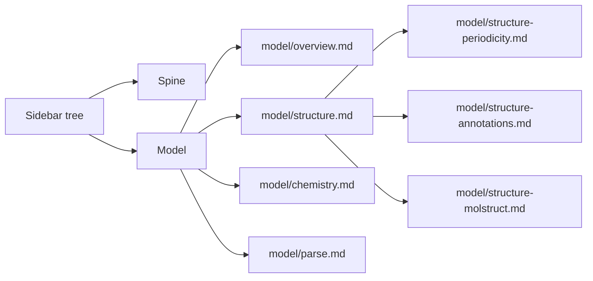

# Tabs — how the pages compose the modules

**Role:** contract
**Domain:** web
**Companions:** [`molview.md`](?doc=web/molview.md) — the 3D viewer every
build/edit tab mounts; [`projects.md`](?doc=web/projects.md) — the sidebar file
browser + the load/save doors; [`form-schema.md`](?doc=web/form-schema.md) — the
engine-option forms; [`spectra.md`](?doc=web/spectra.md) and
[`results.md`](?doc=web/results.md) — the two tabs with their own docs;
[`web-api.md`](?doc=web/web-api.md) — every route named below.

The reusable modules each have their own doc. **This doc is about the *pages*** —
the handful of tabs a user actually clicks between — and how each one is a thin
controller that *wires the modules together*. A tab owns almost no logic of its
own: it mounts MolView, drops in a schema-built form, subscribes to the projects
sidebar, and routes button clicks to the server. The interesting, reusable parts
live in the module docs; here we map **which tab wires which modules, and the
three protocols that cut across all of them**.

## 1. The tab roster and the shared shell

There are **seven tabs**, and their order is defined in exactly one place — the
`TABS` list in `tabs.py`. In canonical order:

| Tab | Path | What it's for | Own doc |
|---|---|---|---|
| **Molbuilder** | `/molbuilder` | build / edit / assemble a structure | this doc § 2 |
| **Structure optimization** | `/structure-optimization` | collect a SIESTA/PySCF relaxation's parameters and Send them to Task setup (the deck itself is written by `prep`, on the machine that runs it) | this doc § 3 |
| **Spectrum** | `/spectrum-calculation` | describe a vibrational-spectrum calculation (the vibration kind) and Send it to Task setup; view any `.spectra.json` | [`spectra.md`](?doc=web/spectra.md) |
| **Transport** | `/transport-calculation` | describe the transport COMPOSITE: cite a finished junction attempt, set the bias, and write the finished `task.json` directly (no hand-over) | this doc § 4 |
| **Task setup** | `/task-setup` | read a calculation folder's description — its stages, and the machine settings you chose or measured — and edit `task.json` | [`task-setup.md`](?doc=web/task-setup.md) |
| **Results** | `/results` | open a finished calculation | [`results.md`](?doc=web/results.md) |
| **Documents** | `/documents` | read the in-app docs (this page!) | this doc § 5 |

> **Task setup is a shared surface** that starts from a calculation folder
> rather than from a form, so every describing tab above feeds one
> implementation instead of each growing its own stage table. Its design is
> [`task-setup.md`](?doc=web/task-setup.md).
>
> **It reads AND writes.** It follows the projects sidebar's selected folder,
> resolves a hand-over (`task.1st.json`) or an existing description, offers
> the stage table, the machine card and the benchmark panel as views of the
> editor buffer, and **Save writes `task.json` through its own door**
> (`POST /api/task-setup/save`) — the same reader and the same preflight the
> CLI uses, so a description that fails its own checks is refused with the
> findings, not repaired. *(It shipped read-only on 2026-08-16; the write
> door landed with the U1 wave.)* Pinned by `tests/test_task_setup_tab.py`.
>
> **Why it is not called "prep".** `prep` is the CLI verb that resolves the
> machine and renders the deck — *exactly what this tab does not do* — so a user
> standing in a tab called "Job Prep" would reasonably expect it to prep. *Job*
> is taken twice over besides: a `Job` is a member of a `JobSet`, and it is the
> scheduler's word. **Task** is the file the tab edits (`task.json`,
> `molbuilder/task@1`), chosen for the same reason: it describes one task, and
> the stage list is *how* that task is broken up. The reasoning is
> `archive/2026-08-16-task-setup-plan.md` § 8. *(The tab shipped as "Job Prep"
> for one commit on 2026-08-16 and was renamed the same day — the name was taken
> off a mock-up's title without checking that record.)*

**Molbuilder is the landing tab** — a bare `/` redirects to whatever is first in
`TABS`. The tab nav bar itself is injected into every page from that one list (a
Flask context processor hands `tabs` to every template, and the shared
`_app_header.html` renders them), so adding or reordering a tab is a one-line
edit to `TABS`, never a template hunt.

Every build/edit tab also mounts the **projects sidebar**
([`projects.md`](?doc=web/projects.md)) down the left — the file browser you pick
a structure from. The one exception is Documents, which needs no files of yours.

**Each route spells out its tab's visible label** — `/structure-optimization`,
not `/optimize`. The URL is then self-describing in browser history and a shared
link carries its own intent. It is also a maintenance discipline: renaming a tab
without renaming its route quietly recreates the "*Build* — what does that do?"
problem the long names were introduced to solve.

### Why the tabs don't hand each other data

Two rules shape everything below:

1. **Molbuilder is the only interactive workspace.** It holds a live in-memory
   canvas. Every other tab reads from disk.
2. **The task tabs are file-driven.** Structure optimization and Spectrum
   take their input structure from a file you picked in the sidebar;
   Transport takes its ONE input from the citation its picker names (the
   viewer follows the cited calculation's structure — there is no sidebar
   commit channel on that tab).  None of them reads Molbuilder's in-memory
   canvas.

So the way to move a structure between tabs is to **save it** — there is no
in-memory "send to" hand-off (`modify.html`: *"all cross-tab transfer now goes
THROUGH a saved project file"*). One extra click, deliberately.

That click buys four things. If a task tab generated its script from "whatever
is in the Molbuilder tab right now", then:

- the script would depend on hidden state you can't see in the project
  directory;
- re-running the same task tab *after* an edit would silently produce a
  different script;
- two people working from the same project would get different scripts;
- exporting or re-importing the project directory would lose information.

Reading from disk removes all four at once: **the same project directory always
produces the same script**, no matter which tab you came from. That is the whole
reason the save step exists, and why no "send to tab" button will be added.

## 2. Molbuilder — build, edit, assemble

This is the workbench. Its page is a **"Init structure" source bar** across the
top, a **fused MolView card** in the middle, and a row of **Modify op-tabs**
below. The controller code is deliberately thin glue:

- **The 3D viewer is mounted by `selection-bootstrap.js`**, not by the tab's main
  `viewer.js`. One call — `mount(host, workspace, {mode: "modify", owner:
  "modify"})` — and the **MolView module builds the entire fused card itself**:
  the viewer, the selection panel, the view toggles, the cell panel. The tab
  hand-builds no viewer chrome. `selection-bootstrap.js` does only page glue:
  mount the module, turn a sidebar file-pick into a *candidate* (you still click
  "Load" to commit — a stray click can't swap your structure mid-edit), and
  respect a restored canvas so a reload doesn't clobber it.
- **`modify/viewer.js` wires the Modify op-tabs** — Atom (add/delete), Transform
  (translate/center/rotate/orient), Junction (electrode), plus the state timeline
  (save-state / undo). Crucially, applying an op does **not** hand-roll a fetch:
  it calls `molview.data.applyOp(op)` and lets the module talk to the server
  (`/api/modify/<op>`). The only route this controller fetches directly is
  `GET /api/modify/meta`, to fill the electrode dropdowns.
- **`modify/periodicity.js`** is the Cell op-tab — vacuum, per-axis periodicity,
  the unit cell, the cell origin — and commits through
  `molview.data.commitPeriodicity` (the server re-resolves the effective cell).

### Creating a structure — the in-gate

The "Init structure" bar is how a molecule *first appears* on the canvas. Every
source in that bar, no matter how different, funnels through **one gate**:
`structurePage.loadIntoCanvas(structure, source)` → `molview.data.installMolecule`.
That single funnel runs the dirty-canvas check ("you have unsaved edits —
replace them?") so no Init source can bypass it.

The sources, and what each produces (all POST `/api/build/molecule` with
`{kind, input}` unless noted):

| Source | `kind` | Backend | Notes |
|---|---|---|---|
| **SMILES** | `smiles` | RDKit first, **OpenBabel fallback** | the fallback rescues big/awkward molecules RDKit chokes on; the response says which backend won |
| **By name** | `name` | PubChem → SMILES → (same fallback) | type "aspirin", get a structure |
| **File upload** | — (`/api/build/load`) | loads your `.xyz`/`.pdb` text as-is | |
| **DNA** | `dna` | 3DNA (X3DNA) / AmberTools / RDKit | B/A/Z forms, single strand or duplex, optional clash relief |
| **RNA** | `rna` | A-form canonical | |
| **Peptide** | `peptide` | AmberTools `tleap` | extended chain from a sequence |

Loading a project file from the sidebar is a *separate* loader
(`projects.parser.openMolecule` reads the `.xyz` + its `.molstruct.json` sidecar,
with its own discard-unsaved check), but it lands the molecule on the canvas
through the very same `installMolecule` step — that call, not `loadIntoCanvas`, is
the one door every path shares.

## 3. Structure optimization — generate a relaxation script

`/structure-optimization` is a **three-card generator**: inspect a structure,
auto-detect its chemistry, generate an input script. It mounts:

- a **read-only MolView** (`mode: "readonly", owner: "structure-opt"`) — you look,
  you don't edit;
- two **schema-built forms** (one SIESTA, one PySCF), rendered by form-schema from
  `GET /api/build/schema/siesta` and `.../pyscf`;
- the **detection chip** that shows the auto-detected charge/spin/method.

The flow: **inspect** → **Auto-detect** (`POST /api/structure/analyze` pre-fills
both sub-forms) → ~~**Generate**~~ *(the two emit routes were **deleted**
2026-08-17; a deck is rendered by `prep`, never by a browser)* →
**Save to current dir**. There is no browser render route at all — both
engines' were deleted with the same rule (a deck is rendered by `prep`).
Live validation runs against `/api/build/preflight` as you edit.

What the tab writes today is the DESCRIPTION, via Send to Task setup: the
parameter template, the structure pair and the hand-over.  Everything a run
needs beyond that — the deck, the pseudopotentials beside it, the `.run.sh`
wrapper — is written by `prep` on the machine that runs it (the old
`/api/siesta/install-pseudos` and `/api/run/install-wrapper` doors retired
2026-08-21 with zero browser callers).  These files are written through the projects module's
`safeSave` file-writer — note that's a *different* door from the structure-save in
§6 (`saveMolecule` → `/api/structure/save`, which writes a molecule + sidecar
pair); a script isn't a molecule, so it takes the plain file-write door.

## 4. Transport — the composite's describe surface

> **Rewired 2026-08-29** ([`plans/transport-design.md`](?doc=plans/transport-design.md)
> P7b + the same-day rulings).  The old Generate lane — sidebar pick, form,
> device-`.fdf` preview, Copy/download — is gone; decks render at `prep`, on
> the machine that runs them, like every other kind.

**The four cards, driven by ONE fact — the citation:**

1. **The junction** — the shared tree-picker cites a finished relaxation
   directory (ANY directory is choosable — the 4.1b FILE condition decides what qualifies: a finished relaxation's `.fdf`+`.XV`, or a labeled `.xyz`+`.molstruct.json` pair; the meta line classifies each selection and reads the
   attempt's own `.fdf`, and says NOT CONCLUDED honestly).  Electrode
   labels the reverse of the usual convention (`L-electrode` low z) are
   **warned about, never blocked** — the junction cites and runs, the
   meta line states which lead ends up biased positive, and a *Swap
   L-electrode and R-electrode* button offers the rename for whoever
   wants it (`transport-design.md` § 4.1a).  A read-only
   **MolView** follows the citation: it re-opens the cited calculation's
   labeled structure on every cite and every reload (labels are assigned
   where the junction is built — never here).
2. **Analyze chemistry** — the shared open-shell check, run on the CITED
   structure; informational only.
3. **Parameters** — the OVERRIDE lane only (`GET /api/transport/schema`
   filters the sealed electronic-contract fields: those are the citation's
   to say).  Overrides travel as device-stage `varies` promotions.
4. **Describe** — the bias list plus one button.  `POST
   /api/transport/describe` answers with the finished `task.json`; the
   browser writes it into the selected folder and does NOT navigate, and
   the status names the folder it wrote.  The destination must be the
   calculation's OWN folder: describing into the cited directory is
   refused, because the calculation never lives inside its citation
   (`transport-design.md` § 4.1b) — the sidebar selection lingers on the
   attempt the person just browsed to cite, so this is the easy mistake.
   Task setup then reads it as an ordinary description (the run surface,
   not a hand-over target).

**Still open** (honest residue): the Results-tab transmission inspector
(reading the shipped `<label>.transport.json`), and
`TransiestaEngine.parse_output`, which raises by design and points at the
record.  `POST /api/transport/render` survives as the engine registry's
validation surface only — no UI calls it.

## 5. Documents — the in-app reader (this page)

### 5.1 The sidebar — a tree, not a list

The left rail shows the document tree as **collapsible folders**. Each folder
is a domain (Model, Engines, Web, …) or a parent document with sub-documents.
Click `▾` to collapse a folder, `▸` to expand it. Click a leaf to open the
doc in the right pane.

The tree is NOT a flat alphabetical dump. The order — spine first, then
domain by domain, then archive last — is deliberate, and parent-child
nesting (e.g. `structure.md` with `structure-periodicity.md` under it) shows
which documents belong together.



### 5.2 `toc.json` — the table of contents

The tree shape lives in `docs/toc.json`. It is a single JSON file —
human-readable, hand-editable in any text editor — that lists every domain
folder and every document in display order:

```json
{
  "tree": [
    {
      "label": "Spine",
      "children": [
        { "path": "README.md" },
        { "path": "design.md" },
        …
      ]
    },
    {
      "label": "Model",
      "children": [
        { "path": "model/overview.md" },
        { "path": "model/structure.md", "children": [
          { "path": "model/structure-periodicity.md" },
          …
        ]},
        …
      ]
    },
    …
    {
      "label": "Archive",
      "collapsed": true,
      "children": []
    }
  ]
}
```

Each entry is either a **document** (has `path` — `docs/`-relative) or a
**folder** (has `label` + `children`). A folder with `"collapsed": true`
starts hidden. The Archive folder's children are left empty — the server
fills them in automatically by scanning the `archive/` directory.

The root project `README.md` (`../README.md`) gets its own entry at the very
top of the tree, above the spine.

### 5.3 The tree stays in sync — auto-discovery

When the Documents tab loads, the server reads `toc.json` and then checks
every domain directory for `.md` files that are **not** listed in the TOC.
New files are added to the tree automatically, and written back to
`toc.json` so the file stays in sync.

A new file named `model/structure-symmetry.md` would be discovered and
nested under `model/structure.md` — because the name starts with
`structure-`, the same prefix as its parent. This is the same filename
convention R5 describes: sub-documents share the master's filename as a
prefix.

The server writes back to `toc.json` atomically (temp file + rename), so a
crash during refresh never leaves a half-written TOC.

> **When you write a new document:** drop the `.md` file in the right
> directory (e.g. `docs/model/`), open or refresh the Documents tab, and
> it appears.  If the name follows the `parent-` prefix convention, it
> nests under its parent.  `toc.json` is updated automatically — no
> manual editing needed.

### 5.4 Portable links and the root README

Docs stored under `docs/` use internal links in the form
`?doc=<path-relative-to-docs>`. The root `README.md` intentionally uses normal
GitHub-relative links such as `docs/ops/installation.md`, because those links
must work when the README is viewed directly in the repository.

The Documents tab supports both forms. After rendering Markdown, it rewrites
the root README's relative `docs/<path>.md` links to
`?doc=<path-relative-to-docs>` and its `LICENSE` link to `?doc=../LICENSE`,
then opens the result in the reader. External links are left external. This
mirrors the existing image rewrite: source Markdown stays portable, while the
rendered in-app view receives the API route it needs.

The root README and repository `LICENSE` are the only intentional path
exceptions. The sidebar obtains the README from `/api/docs/toc` as
`../README.md`; `/api/docs/read` accepts that value and `../LICENSE` exactly.
All other paths containing `..` are rejected, and every regular document must
resolve to a real Markdown file inside `docs/`. Opening a doc
writes `?doc=...` back into the URL; loading a URL with `?doc=...` opens that
doc and expands every folder along the path so you can see where it lives in
the tree.

## 6. Save flow — the out-gate

Every tab that saves a structure uses **one path out**, mirroring the one gate in
(§2):

1. You click **Save to project**; a dialog asks for a name (no default — you name
   it deliberately). The target folder is **always the sidebar's current project
   dir**.
2. The model **serialises itself** — `molview.data.exportFile()` — so what's saved
   is exactly what's on screen ("viewer is truth"). The tab does *not* scan the
   structure for regions or frozen atoms; the model already knows them.
3. That goes to **`POST /api/structure/save`** with `{path, blob, overwrite}`.
   **The server writes the pair** — `<stem>.xyz` + `<stem>.molstruct.json` — and
   stamps the sidecar's schema version and structure hash itself. The browser
   never authors the sidecar (a past bug wrote a sidecar the load door then
   rejected; the server-writes-it rule closed it).
4. If the file exists and you didn't pass `overwrite`, the server replies
   **`409 {needsOverwrite: true}`**; the tab pops an overwrite confirm and retries
   with `overwrite: true`. On success the dirty bit clears and the sidebar
   refreshes.

`saveMolecule` itself is documented in [`projects.md`](?doc=web/projects.md);
here we've described the *page-level* save UX that calls it.

## 7. Data coherence — one rule, enforced server-side

The invariant that keeps a tab's form and its structure from ever disagreeing:

> **What is in the viewer at generate/save time *is* the input.** The frozen-atom
> and region labels travel in the request body and are applied to the structure
> verbatim — and **every label index must be a valid atom of the current
> structure**, or the server rejects it.

This is enforced where it can't be bypassed — on the server:

- The labels ride **inside the structure envelope**, not beside it, so there is
  one place they can arrive and no second place to drop them. `struct_from_body`
  rebuilds the `Structure` from that one object, and the model validates each
  index itself (`Structure._validate_regions`: `0 ≤ idx < n_atoms`, else a
  visible refusal). Every emitting door goes through it.
- `struct_from_body` honours a per-atom metadata array **only if its length
  equals the atom count** — a malformed array can't corrupt the structure; the
  default is kept.
- On any atom-count change (an add or delete), the client **clears the selection**
  — so no stale index can point at an atom that no longer exists.

There's a **chemistry** half too: a single analyzer (`analyze_structure`) is the
one source of truth for open- vs closed-shell, every generator tab shows its
verdict through the same `detection-chip`, and a validator finding attaches to the
workflow card it belongs to. (The *visual* coherence rules — palette, role
vocabulary — live in [`ui-contract.md`](?doc=web/ui-contract.md), not here.)

## 8. Where the tab controllers stand — ESM status

The design goal is concealed, independently reusable ES modules. The **modules**
are largely there; the **tab controllers that consume them** are half-migrated:

| Controller | ESM today |
|---|---|
| `modify/selection-bootstrap.js`, `modify/viewer.js`, `structure-optimization/viewer.js`, `transport/core.js` | **hybrid** — a top-level `import` of MolView, but a classic IIFE body that still publishes a global (e.g. `window.molbuilder.molbuilderTab`); loaded as `type="module"` |
| `modify/structure/*.js` (the generators), `documents/page.js` | **no** — classic global scripts |
| `modify/periodicity.js` | classic body, but served with a `type="module"` tag (a harmless mismatch) |

So **none of the tab controllers is a pure ES module yet**: the MolView-consuming
ones (`selection-bootstrap` and the three viewers) have one foot in ESM — they
`import` the viewer — while their own bodies are still legacy IIFEs that publish
globals; the structure-generation set plus the Documents controller are fully
classic. Finishing these off is part of the "remaining classic modules" ESM
workstream (`roadmap.md § 3`).

## 9. Test map

- `test_tab_routes.py` — every canonical tab path renders + the nav contract
  (paths read from `TABS`).
- `test_docs_tab.py` — the Documents tab: the list groups every `docs/*.md`,
  `read` returns text + title, and the path-safety gate rejects traversal /
  non-`.md` / outside-`docs`.
- `test_transport_render_endpoint.py`, `test_transport_transiesta.py`,
  `test_transport_generate_e2e.py`, `test_transport_preflight.py` — the transport
  render path, the engine, end-to-end generate, preflight.
- `test_structure_save_endpoint.py`, `test_structure_save_js.py`,
  `test_structure_save_dialog_js.py` — the save flow + its dialog.
- `test_smiles_fallback.py`, `test_structure_smiles_js.py` — the SMILES
  generator + the OpenBabel fallback.
- `test_modify.py` — the Modify ops.
- `test_molbuilder_e2e.py` — the Molbuilder tab end to end.
