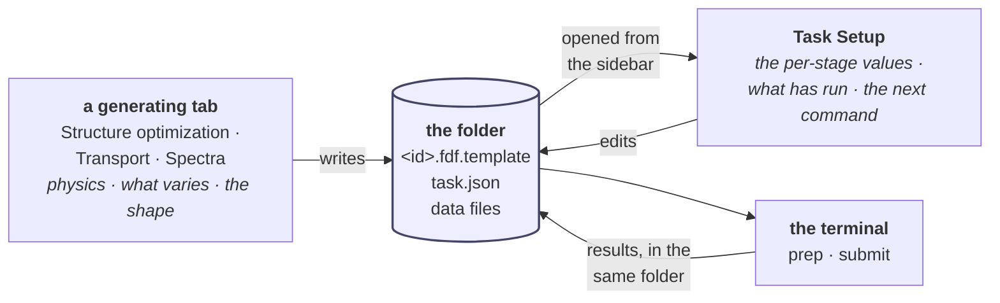

# Task Setup — the shared tab that finishes a description

**Role:** plan
**Domain:** web
**Companions — the contracts this surface is built against, and where the two
disagree those win:** [`engines/stages.md`](?doc=engines/stages.md) — the
description on disk, `varies`, `shape`, one stage is no stages;
[`execution/project-layout.md`](?doc=execution/project-layout.md) — what `prep`
does and why the browser cannot do it;
[`execution/run-identity.md`](?doc=execution/run-identity.md) — the id, and what
`start from` expands into;
[`web/form-schema.md`](?doc=web/form-schema.md) — where this tab's columns come
from;
[`web/structure-optimization-ui-plan.md`](?doc=web/structure-optimization-ui-plan.md)
— the tab that writes the description this one edits;
[`execution/staged-runs-implementation-plan.md`](?doc=execution/staged-runs-implementation-plan.md)
— when it gets built.

**Status: a proposal** (2026-08-07). Nothing here is built. The name *Task
Setup* is a working name; see § 8.

---

## 1. Why there are two tabs and not one

The Structure-optimization tab currently does three jobs at once: it collects the
physics, it decides which parameters vary across a sequence, and it generates a
script. Those look like one page because they happen in one sitting the first
time. They are not one job, and three things separate them:

| | writing the description | finishing it |
|---|---|---|
| **its unit** | a structure and a physics setup | **a folder that already exists on disk** |
| **when** | once, at the start | revisited — often days later, after a stage has run |
| **whose** | one per engine: relaxation, transport, spectra each have their own physics | **one tab, shared by all of them** |

That last row is the reason this is a separate page rather than a rearrangement.
A stage table living inside the Structure-optimization tab would have to be
copied into Transport and into Spectra — the exact duplication pattern this
codebase has three documented cases of. A tab that starts from a **folder**
instead of from a form is written once and serves every producer.

**A one-stage calculation never opens this tab.** `engines/stages.md § 6.5`:
one stage is no stages — a description with no `stages` key is a single parameter
set, and the generating tab alone is sufficient. Today's whole workflow is
untouched.



---

## 2. The rule the whole tab rests on

> **The browser describes and observes. The terminal acts.**

This is not a limitation of the tab; it is
[`project-layout.md`](?doc=execution/project-layout.md) § 2.2 seen from the other
side. A deck carries values that depend on *how it will be launched* — a block
size derived from the rank count, an eigensolver that also decides which conda
environment the wrapper activates — and **a parameter that depends on the launch
cannot be decided before the launch is known.** A browser cannot know the
machine, so a deck it "finished" would be a guess.

So this tab has no Run button, no Submit button, and no Prep button. What it
produces is a **complete description** and **the next command**.

That has a consequence worth stating rather than discovering: **if the browser
cannot act, its hand-off has to be excellent.** Not a generic snippet — the exact
command for the stage you are looking at, with what it will do.

---

## 3. Two properties that make it shareable

### 3.1 It holds no state of its own

Everything the tab shows comes from the selected folder. There is no remembered
form, no in-progress buffer that outlives a directory change, nothing that has to
be reconciled on reload.

That is not tidiness. It is *the folder is the only link*
(`project-layout.md § 2.7`) applied one level up, and it pre-empts a whole class
of bug this codebase has already hit: the Molbuilder tab has six things that look
like saving and silently drops two of them, because the tab's context lived in
closure variables that nothing wrote down
([`modify-persistency-investigation.md`](?doc=web/modify-persistency-investigation.md)).
**A tab whose truth is entirely on disk cannot have that problem.**

### 3.2 Its columns are the user's selection; the schema only says how to draw them

The table's rows are parameters. **Which** parameters is read from `varies` in
the description — the user picked them. What each one is **called**, what unit it
carries, what values it accepts, is read from the generated form schema
(`form-schema.md`: the config form is built from the Python dataclass, and every
field carries its label, help, choices and `workflow_group`).

> **Corrected 2026-08-07 (user).** This section used to say *"which parameters …
> all of that is read from the generated form schema"*, fusing two questions that
> have different answers — and it is the same fusion that limited a stage to four
> values in the shipped code (`engines/stages.md § 1.2`). The schema is the
> **catalogue** a user chooses from and the instructions for rendering each
> choice. It is not the choice. Had this sentence survived, the new tab would
> have inherited the bug it was written to remove.

**This is the single rule that keeps the tab general while only one producer
exists.** Read the columns from the schema and the tab is engine-agnostic without
containing one line written for a producer that has not been built. Hardcode a
list of relaxation fields and it quietly becomes the relaxation tab, and Transport
needs a second copy.

> **And nothing is added for producers that do not exist yet.** A `kind` field
> with one legal value, a sweep branch with no sweep — those are speculative
> generality, and the review lens in the implementation plan says to delete them.
>
> **The format already reaches further than it looks**, which is why nothing needs
> adding. A bias sweep is `varies: ["bias_voltage", "restart"]` with one member per
> voltage, each saying `clean` — every member is still a name, an enabled flag and
> an overlay, and nothing in the structure requires ordering or continuation. **A
> ladder's members say `continue` and a sweep's all say `clean`, and that is the
> whole difference**: it lives in the values, not the schema.

---

## 4. Getting in: one check, one message

The tab operates on whatever directory is selected in the **projects sidebar** —
which already owns directory selection, so there is no second file browser here.

**A directory is a calculation, or it is not.** The check is the one that already
ships: `checkpoint.py`'s `_is_bundle_root`, which looks for a description
(`task.json` / `job-set.json` / `bench-manifest.json`) and is what
`checkpointing.md` L1 uses to decide that a root carrying its description owns
its subdirectories.

**That rule must not be written a second time.** Two answers to *"is this a
calculation?"* would give you a folder this tab opens but the checkpoint system
does not cover, or the reverse — and neither would be visible until somebody lost
work.

If the folder is not a calculation, the tab says so and stops. It does not offer
to adopt a folder of finished decks, and the reason is already written:
`engines/stages.md § 6.2` — **`varies` cannot be inferred.** A folder of decks
does not record which parameters were *meant* to vary, and reconstructing that
would be inventing intent.

**Only a generating tab creates a description.** This one edits.

---

## 5. What it edits, and who owns which key

The description, as the two tabs see it:

```js
description = {
    shape:  "flat",                                            // or "hierarchical"
    base:   { …every field in the schema, one value each… },   // the shared system
    varies: ["mesh_cutoff", "relax_force_tol", "relax_type", "restart"],
    stages: [
        { name: "coarse", enabled: true,
          overrides: { mesh_cutoff: 150, relax_force_tol: 0.04,
                       relax_type: "CG",      restart: "clean"    } },
        { name: "tight",  enabled: true,
          overrides: { mesh_cutoff: 300, relax_force_tol: 0.01,
                       relax_type: "Broyden", restart: "continue" } },
    ],
}
```

Three rules keep it honest:

1. **`varies` is the column set.** Every stage's `overrides` holds exactly those
   keys — no more, so a demoted parameter cannot leave a value hiding in a stage
   nobody can see.
2. **The template holds a value for every field, always**, including the promoted
   ones. A one-stage description is then just the template — and that is literally true on
   disk: with a single stage there is nothing to vary across, so a description
   with one stage is written **with no `stages` key at all** and produces
   `<id>.fdf`, unsuffixed (`engines/stages.md § 6.5`). The suffix and the
   `stages` key appear together, the moment a second stage does.
3. **The default `varies` is a proposal, not a law.** It starts as the fields the
   schema tags `workflow_group: "stage"` because that is the useful starting
   point, not because those are special — and the generating tab lets the user
   tick any parameter at all, in place, beside its value
   (`structure-optimization-ui-plan.md § 7.6`). **This tab does not choose the
   columns; it renders the ones already chosen.**

`task.json`'s keys then split cleanly between the two tabs, and the line falls
where the file already draws it: **`varies` is the column set, `overrides` are
the cells** (`engines/stages.md § 6.2`).

**The generating tab defines the columns. This tab fills them.**

| Key | Owner | Why |
|---|---|---|
| `structure`, the **template** | generating tab | the physics — once per molecule |
| `varies` | generating tab | promotion happens *where the parameter lives*, and those fields are on that page |
| `shape` | generating tab — **forced** | it is required with no default (`stages.md § 6.7`), so whoever writes the file first has to ask |
| stage **names** | generating tab creates the skeleton; **this tab may append** — `stages.md § 7` already says the list is appended to and three rungs is a default, not a bound. Neither may renumber: a stage's `seq` is assigned once |
| `overrides` — the cells | **this tab** | the per-stage values, which is the whole reason it exists |
| `enabled` | **this tab** | *"run tight now"* is a decision you make having seen coarse |

**Promoting a new column from here is possible but named.** *"tight needs to
change mesh cutoff, which isn't varying yet — add it as a column?"* — because
that is a structural edit hiding inside a value edit, and the one thing that must
not happen silently.

---

## 6. The panel

One table. Rows are parameters, columns are stages — the shape the data already
has:

| Parameter | | coarse | tight | final |
|---|---|---|---|---|
| mesh cutoff | Ry | 150 | 300 | 300 |
| force tolerance | eV/Å | 0.04 | 0.02 | 0.01 |
| relaxation | | CG | Broyden | Broyden |
| MPI ranks | | 8 | 16 | 16 |
| **start from** | | **clean** | **continue** | **continue** |
| **run this stage** | | ☑ | ☑ | ☐ |
| | | | `row preset ▾` | `+ stage` · `remove` |

*everything else is shared by every stage, and is set in the generating tab*

Four things the table has to get right:

- **A cell equal to the template's value is drawn quietly; one that differs is drawn plainly.**
  Progressive tightening then reads as a *shape* rather than as a wall of
  numbers.

- **"Start from" is one control and one field.** Saying a stage continues sets
  the engine's own restart parameters — for SIESTA, `DM.UseSaveDM`,
  `MD.UseSaveXV` and `MD.UseSaveCG` together. The user states the intent once and
  the generator expands it (`run-identity.md § 4`); nothing asks anyone to keep
  three keys in step. It is drawn emphasised because it is the row that decides
  whether the folder's shared warm files are read.

- **It never names *which* stage to continue from.** "Continue" means *from the
  stage before this one* — a fact about the description, not about what happened
  to run last (`stages.md § 7.1`). Offering a choice of predecessor would make the
  carry graph diverge from the stage order, which is the one thing a single
  ordered list cannot express and should not learn to.

- **Two different things are called a preset**, and the UI must not use one word
  for both: the *strategy* preset chooses **which stages are enabled**; the *row*
  preset fills **one stage's values**.

> **Most of this table already exists, and it is generic.** `form-schema.js`'s
> `stage-table` field kind renders any `List[<dataclass>]` field as exactly this
> orientation — rows the per-stage parameters, columns the stages — with a preset
> dropdown over the enable flags; the Python end (`_field_to_schema` →
> `_stagespec_to_field_schemas`) already emits the per-column field shape, and
> [`web/form-schema.md`](?doc=web/form-schema.md) contracts it as one of the field
> kinds. Found by P0's mechanical count, recorded as mechanism 10 in
> [`staged-runs-architecture.md`](?doc=web/staged-runs-architecture.md) § 8b.
>
> **The gap is the data source, not the layout.** That widget lays out a schema's
> `default`; this tab lays out a `task.json` read off a folder, and the two
> differ on three of the four bullets above — the quiet-vs-plain drawing of a cell
> that equals the template's value, the *start from* row, and the column headers, which the
> widget deliberately takes from the index rather than the stage's name. So the
> first thing this tab does is ask whether the widget can be fed a description
> without being rewritten — and if it cannot, say why in writing.

### 6.1 What has already run

Beside each column, what the folder says: whether that stage has outputs, how many
attempts exist, and whether the last one converged. Read from the directory —
**no target machine required**, which is why it is available even with `prep` and
`submit` on the terminal.

This is not a dashboard. It is there because **you cannot decide what tight should
be without seeing how coarse went**, and that decision is the tab's entire
purpose.

### 6.2 The hand-off

The next command, for the stage you are looking at, with what it will do:

```
Next, on the machine that will run it:

    molbuilder jobset prep run tight --from 01_coarse/run-0
        resolves this machine, renders the deck and the wrapper,
        builds the attempt, and copies in coarse's converged geometry

    molbuilder jobset submit run tight
```

**No "run all stages" button, and that is deliberate.** A stage is a long job, and
a chain that continues by itself can spend a week refining a geometry you would
have rejected in a minute (`project-layout.md § 1.6`). The page should not offer
what the design removed on purpose.

---

## 7. The operations, and what each one must not lose

Every one of these can silently destroy a value if its rule is not stated. The
**Where** column says which tab performs it; the rule is the same wherever it
runs.

| Operation | Where | What it does | The rule that keeps it safe |
|---|---|---|---|
| **promote** a field | generating tab, or named here | adds it to `varies` | **seeds every stage with the current base value**, so promoting changes nothing on screen. Promotion is a statement about *structure*, never about values |
| **demote** a field | generating tab | removes it from `varies` | the stages disagree and one value must survive: **the last enabled stage wins**, because that is the production stage and the value a single run would use. The UI says which value it kept, and says it *before* the click |
| **add a stage** | either | appends a row | **copies the previous stage's overrides**. A refinement starts from what came before; a stage that inherits nothing is a different calculation, not a next step |
| **remove a stage** | Task Setup | drops a column | refused when it is the last one — a description has at least one stage |
| **reorder** | Task Setup | moves a stage | the files are written in order and `start from` reads that order, so this is a real edit, not a display preference |
| **enable / disable** | Task Setup | marks a stage to run or skip | it changes what `prep` will build and what the hand-off says; it does **not** delete the column's values |
| **edit a cell** | Task Setup | sets one stage's value | nothing else moves |
| **apply a row preset** | Task Setup | fills a column | a preset knows nine fields. If some are not promoted it **promotes them first** — a preset that half-applied would be worse than one that refused |
| **open** a folder | Task Setup | replaces the whole table from that folder's description | a **load, not a merge**: values, promoted set, stages and order all come from the file, because a half-loaded description is one nobody can reason about. The id is read, never recomputed (`run-identity.md § 3`), and the file goes through the same preflight as a fresh one — a description that has sat on disk is exactly the one whose schema may have moved |

**Two tabs write one file**, so ownership per key (§ 5) covers most of it — but not
the case where the folder changed on disk between loads, because a `prep` ran or
somebody edited by hand. That needs the same stale-file handshake the save
out-gate already uses (`tabs.md § 6`), not last-write-wins.

---

## 8. Open decisions

1. **The name.** *Task Setup* is a working name. **Not** *Task Prep* — `prep` is
   the CLI verb that resolves the machine and renders the deck, which is exactly
   what this tab does not do, and a user standing in "Task Prep" would reasonably
   expect it to prep. *Job* is taken twice over (a `Job` is a member of a
   `JobSet`, and it is the scheduler's word). *Calculation* names the unit and
   covers a sweep as well as a ladder.
2. ~~**The description file's name.**~~ **Decided 2026-08-07: `task.json`**
   (`molbuilder/task@1`). The file describes **one task** — relax this molecule —
   and the stage list is *how* that task is broken up, so a one-stage description
   and a three-stage one are equally a task. The word was already in use loosely
   (`execution/overview.md`: *"one task at a time"*), collides with nothing taken
   (`Job` is a dataclass and the scheduler's unit; *plan* is taken four ways;
   *prep* is a verb), and it pairs with the tab that edits it.
   **The `stages` key inside it does not change.** A stage is established
   vocabulary with its own contract; only the *file* needed a name that covers a
   sweep as well as a ladder.
3. **Does it show a run's live progress**, or only what the folder holds when you
   open it? Reading the folder needs no target machine; polling a run that is
   happening on a cluster is a different feature and belongs with the Results tab.
   Recommended: what the folder holds, plus Refresh.
4. **Where a benchmark verdict appears.** `prep` can find one and asks before
   using it (`project-layout.md § 2.3.2`). This tab could show that a stage has
   been measured and what the measurement said — which is also the only place a
   user would notice that item 18's write-back is missing.
5. **Which engines feed it first.** All generating tabs follow the same framework
   (user decision 2026-08-07), but **Structure optimization is built first and
   made to work**; Transport and Spectra follow. Transport's variation is a bias
   *sweep* — which § 3.2 shows the format already expresses, so what those tabs
   owe is a producer, not a new file. The one thing a sweep might eventually want
   is a way to say *these members are independent* rather than leaving it implied
   by every `restart` being `clean`; that is a `@2` if it turns out to be needed,
   not a field added now.

---

## 9. What this plan is not

It does not change what a stage means on disk, or any naming convention. It
introduces no new persisted format: it edits the description
`engines/stages.md § 6` already defines.

It is **not** free of backend work. The tab is only worth building once a stage
can override a parameter the stage type never carried — which is milestone **M2**
of [`staged-runs-implementation-plan.md`](?doc=execution/staged-runs-implementation-plan.md),
and the gate that plan puts before any UI work for a reason: draw first, and the
page gets designed around what the model happens to allow rather than what a user
needs.
