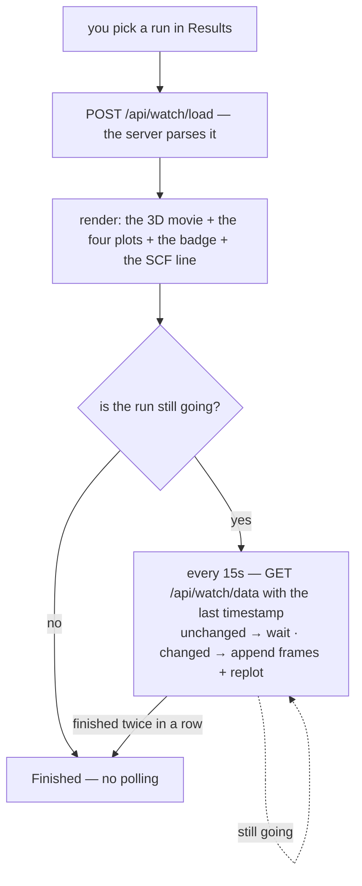

# Trajectory viewer — watching an optimization run

**Role:** contract
**Domain:** web
**Companions:** [`results.md`](?doc=web/results.md) — the Results-tab shell that
hosts this viewer; [`presenters.md`](?doc=web/presenters.md) — how a run file
picks this viewer; [`molview.md`](?doc=web/molview.md) — the 3D viewer that owns
the movie; [`web-api.md`](?doc=web/web-api.md) — the `/api/watch/*` routes;
[`execution/running-a-job.md`](?doc=execution/running-a-job.md) — the run that
produces the file.

Open a geometry-optimization run on the Results tab and this viewer shows it as
a **3D movie of the relaxation, with live convergence plots** that update while
the run is still going. It lands here when you pick a `.molwatch.log`, a SIESTA
`.out`, or a `*_optim.xyz` file. It is a Results-tab viewer only.

## 1. What it is — a data feeder, not a viewer

The trajectory engine doesn't draw the 3D scene itself. It mounts the shared
**MolView** viewer read-only ([`molview.md`](?doc=web/molview.md)) and *feeds* it
the frames and the per-atom forces. MolView owns everything you interact with in
the 3D box — the playback bar, the frame slider, the loop and speed, the unit
cell, atom labels, selection, and measurements. The engine's own job is the
**plots, the run badge, the SCF line, and the live polling**.

Three force controls do belong to the engine (they shape the arrows MolView
draws): a **scale** (Å per eV/Å), a **minimum** (hide arrows below a force),
and **exclude frozen atoms** (skip the constraint-artifact forces on fixed
atoms — this affects the arrows only; hiding atoms in the 3D box is MolView's).

> **This is the trajectory surface, and there is no second one coming**
> *(retired 2026-09-03, user: "retire all of them")*. A separate **MD
> viewer/editor** was named in the design and never built. A relaxation and an
> MD run both arrive as frames with forces, which is exactly what this reads —
> a second viewer would be a second answer to *show me the frames*, and the
> thing that would actually differ (editing a trajectory) belongs to whatever
> writes one, not to the reader.

## 2. The four plots

Below the movie are up to four plots, each answering one question about the run:

| Plot | Shows | Answers |
|---|---|---|
| **Total energy** | energy vs optimization step | is it settling to a minimum? |
| **Max force** | the largest force vs step | is the geometry converging? |
| **SCF energy** | energy across the current step's SCF cycles | is this step's electronic loop settling? |
| **SCF residual** | the SCF gradient/residual (log scale) | is the electronic loop converging? |

Two of them hide themselves when there's no data (the SCF plots only appear once
a run reports SCF cycles), and the grid reflows to fill the gap.

**The max-force plot has two lines when the run has frozen atoms** — a thin
dashed line for *all atoms* (informational, includes the fixed ones) and a solid
line for the *free atoms* (the real convergence signal, since fixed atoms carry
forces that don't matter). With no frozen atoms it collapses to a single line.

## 3. Convergence targets

The viewer reads the **targets the run was chasing** and draws them as green
threshold lines — so you can see how far the max force or the SCF residual still
is from the goal. You don't have to keep the input file around: the targets come
from the run's own **output**. A SIESTA run echoes them into its `.out` (the
`redata:` preamble), and a PySCF/geomeTRIC run — whose bare `*_optim.xyz` carries
no targets — gets them from the sibling `*.molwatch.log` the builder writes next
to it. A small label under the plot even says which of these it read them from
("from SIESTA input echo", "from molwatch log header", "from geomeTRIC log").

A summary band above the plots names the targets and the current distance. When a
value sits far above its target, the plot switches to a **log y-axis** so the
early approach is readable; as it converges the curve heads toward the line.

## 4. Is it done, and how fast?

The **run badge** reads *Running*, *Finished*, or *Stopped*, and carries a
detail line beneath it with two different facts:

| detail | reads | where it comes from |
|---|---|---|
| **when** — "ended 14:32" | a *time of day* | the run's own per-step clock if it has one, else the file's modification time |
| **total** — "total 2h 15m" | a *duration* | how far into the run the last step was |

**Those are two separate readings and neither substitutes for the other.** A
PySCF run writes a real timestamp into its `.molwatch.log`, so it can say when.
A SIESTA `.out` contains no time of day anywhere — only a timer counting from
the start of the run — so for SIESTA the "when" falls back to the file's
mtime, deliberately. The parser says *"this engine cannot tell you the time of
day"* rather than handing over its elapsed seconds; when it did hand them over,
a run six minutes old displayed **"last result Dec 31, 5:06 PM"** — six minutes
after epoch zero, a duration printed as a date
([`model/parse.md § 2a`](?doc=model/parse.md)).

And the SCF line gives a live per-iteration wall-time — "~16 s/iter" — with its
source spelled out, because it comes from whichever estimate is most
trustworthy at the moment:

1. best: the **server's own refresh-delta** (the wall-clock time between two file
   flushes, divided by the iterations added), which survives a page reload;
2. early on, before the server has two timestamps to compare, a **client-side
   estimate** from the last couple of polls;
3. as a fallback, **SIESTA's own once-per-run timer** snapshot — and it is
   SIESTA's alone. That rung divides a cumulative time by a call count, which
   is arithmetic on a duration; a PySCF log carries a timestamp instead, and
   dividing one of those by a call count is arithmetic on a date. So a PySCF
   run simply has no third rung, and the line stays quiet rather than
   printing a number that means nothing.

The line says which one it used, so a rough early number isn't mistaken for a
precise one.

A *crashed or non-converged* run settles like a finished one: the badge shows
**Stopped** and the polling stops. It gets there in one step rather than the two
a normal finish takes — a crash doesn't un-crash on the next poll, so there is
nothing to confirm.

## 5. Live updating

The viewer **loads once** (`POST /api/watch/load`), renders, and then — if the
run is still going — **polls every 15 seconds** (`GET /api/watch/data`). Each
poll sends the last timestamp it saw; the server replies "nothing changed" (and
the viewer waits) or "here's the new data" (and the viewer appends the new
frames and redraws only what moved). A run counts as done only after **two
"finished" replies in a row** — a single one can be the parser mid-flush.

Appending is the cheap path: the movie keeps playing, the camera holds still,
and your frame position stays put (if you were watching the newest frame, it
follows the tail). One case costs a visible rebuild instead — the poll that
turns a **single**-frame load into a trajectory. A run caught at its very first
geometry has no movie to extend yet, so the viewer builds one from the whole
series and you see the brief "Updating view…" overlay. Before this, that append
went nowhere: the frame counter and slider grew while every position showed the
first geometry, until you hit Refresh.

**Refresh is a clean reload**, not a nudge: it re-runs the whole load, so the
movie returns to its first frame and the camera refits — the same reset a
file-switch does. This is deliberate (it closed a class of half-refreshed-state
bugs); a couple of guards make sure a late reply from a previous file can never
paint into the current view, and partial (mid-write) frames are listed but kept
out of the plots.

### 5.1 Omitting a field and clearing it are different answers

A poll's reply is applied field by field, and **a field the server leaves out
is kept, not cleared** — `undefined` means *no news*. Clearing something takes
an explicit `null`.

That is what lets the two calls carry different amounts. The **load** always
sends the run's metadata block — the region labels from the input script, the
cell from the output logs, and `info` from the deck's stated parameters. A
**poll** always omits it, because those three answer *what does this directory
say about the structure it ran on?*, and that does not change while frames
arrive. A poll that sent the block anyway would rewrite it on every tick; a
poll that sent it as `null` would erase what the load recovered.

The one caller with no run directory to search — an uploaded file — answers
**deliberately**: `null` in every field, which reads as *nothing available*.
Saying nothing would have meant *unchanged*, and there is nothing to be
unchanged from.

## 6. Export

One button, **Export all plot data (CSV)**, writes every plotted column (step,
energy, both max-force traces, and the SCF-cycle values) with a self-describing
header. The header's source-path line has the username redacted.

## 7. Under the hood, briefly

- Two endpoints: `POST /api/watch/load` (parse a run) and
  `GET /api/watch/data?mtime=…` (poll for growth) — see
  [`web-api.md`](?doc=web/web-api.md).
- **A parse is cached by (path, mtime, size), and a just-written file is not
  cached at all.** A snapshot taken within 200 ms of the file's own mtime is
  read but not stored, because a growing log is often replaced atomically and a
  parse of the half-written version would then answer for the whole one. The
  cache holds 64 entries.
- The viewer is a small **state machine** (idle → loading → loaded / watching →
  error). All the "which state resets what" rules — why a file-switch clears the
  view but keeps your preferences, why Refresh is a full reload — live in that
  machine; `results.md § 4` has the plain-language summary.
- **Where the module stands (current → target ESM).** The engine
  `lib/trajectory/core.js` already `import`s MolView as an ES module, but its own
  body is still a classic script that publishes `window.molbuilder.trajectoryInspector`
  — a **hybrid**, not yet a clean module. It converts to a full ES module in the
  file-viewer registry + `inspectors` → `presenters` pass (task #102,
  [`archive/2026-09-01-roadmap.md § 3`](?doc=archive/2026-09-01-roadmap.md)), the same pass that converts the sibling
  spectra engine. See [`presenters.md`](?doc=web/presenters.md).

## 8. Test map

- `test_trajectory_hide_frozen_invariants_js.py` — the force-filter (hide-frozen)
  behavior.
- `test_trajectory_csv_redaction_js.py` — the CSV export + path redaction.
- **The poll loop.** `test_live_poll_invariants_audit.py` was retired
  2026-09-03: 18 of its 21 tests asserted on the spelling of lines in
  `lib/trajectory/core.js` (`process/testing.md` § 3a). What replaced it is
  a **real optimisation**, not a fixture — `test_trajectory_from_a_real_run
  _e2e.py` stretches CO2 to 1.30 Å, relaxes it through the production deck
  in the env the four-env model routes PySCF to (~4 s), and opens the
  `*_geom_optim.xyz` it wrote on /results. It checks the physics (the bond
  comes back to ~1.19 Å, the energy falls monotonically) and then the
  drawing (the energy curve has one point per step, falling).
  `test_inspector_registry_e2e.py`'s poll-timer fixture runs the same
  optimisation and keeps the trajectory alone, because a finished run's log
  says finished and stops the poll the test exists to watch.

  **Which file the viewer is showing, and why it is the log.**
  *(Corrected 2026-09-04: an earlier note here said "the discovery chain
  prefers the richer per-step log". That is wrong and was written from
  observation instead of from the contract. `/api/watch/load` returns
  exactly the file you ask for -- measured: 5 frames for the `.xyz`, 6 for
  the `.molwatch.log`.)*

  The reason a PySCF relaxation shows the log is **absorption**, not
  preference. `lib/inspectors/trajectory.js`'s `absorbs()` subsumes
  `<stem>_initial.xyz`, `<stem>_optimized.xyz` and
  `<stem>_geom_*_optim.xyz` into the `.molwatch.log` master, so the picker
  offers ONE entry for the run (`results.md` § 2.3, "a run is one result,
  not a pile of files") and that entry is the log. Absorption narrows the
  MENU; it does not narrow what can be opened -- hand the viewer the
  `.xyz` path and it renders the `.xyz`.

  The two files differ by one frame on purpose. The log's first record is
  `step_index: 0, kind: initial_preview` -- the geometry as handed in,
  before any SCF -- so it has **no energy** and plots as a null. The
  `.xyz` carries geomeTRIC's iterations only. Both counts are right for
  what they are; which you see is decided by which file you opened.

- `test_trajectory_clocks_js.py` — the two clocks: that the badge's "when"
  reads the timestamp series and its "total" reads the duration series, and
  that the per-iteration rung refuses a timestamp.
