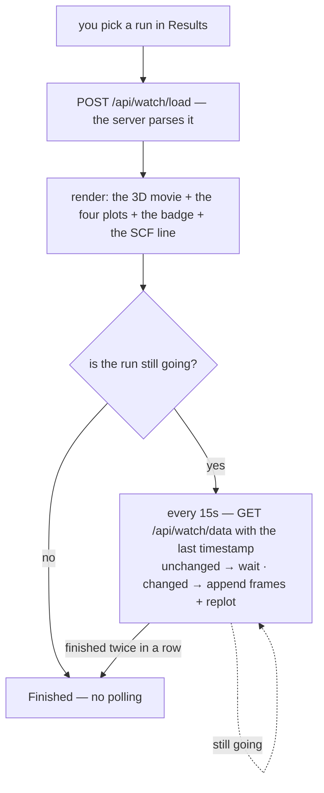

# Trajectory viewer — watching an optimization run

**Role:** contract
**Domain:** web
**Companions:** [`results.md`](?doc=web/results.md) — the Results-tab shell that
hosts this viewer; [`presenters.md`](?doc=web/presenters.md) — how a run file
picks this viewer; [`molview.md`](?doc=web/molview.md) — the 3D viewer that owns
the movie; [`web-api.md`](?doc=web/web-api.md) — the `/api/watch/*` routes;
[`execution/running-a-job.md`](?doc=execution/running-a-job.md) — the run that
produces the file.

Open a geometry-optimization run on the Results tab and this viewer shows it as
a **3D movie of the relaxation, with live convergence plots** that update while
the run is still going. It lands here when you pick a `.molwatch.log`, a SIESTA
`.out`, or a `*_optim.xyz` file. It is a Results-tab viewer only.

## 1. What it is — a data feeder, not a viewer

The trajectory engine doesn't draw the 3D scene itself. It mounts the shared
**MolView** viewer read-only ([`molview.md`](?doc=web/molview.md)) and *feeds* it
the frames and the per-atom forces. MolView owns everything you interact with in
the 3D box — the playback bar, the frame slider, the loop and speed, the unit
cell, atom labels, selection, and measurements. The engine's own job is the
**plots, the run badge, the SCF line, and the live polling**.

Three force controls do belong to the engine (they shape the arrows MolView
draws): a **scale** (Å per eV/Å), a **minimum** (hide arrows below a force),
and **exclude frozen atoms** (skip the constraint-artifact forces on fixed
atoms — this affects the arrows only; hiding atoms in the 3D box is MolView's).

## 2. The four plots

Below the movie are up to four plots, each answering one question about the run:

| Plot | Shows | Answers |
|---|---|---|
| **Total energy** | energy vs optimization step | is it settling to a minimum? |
| **Max force** | the largest force vs step | is the geometry converging? |
| **SCF energy** | energy across the current step's SCF cycles | is this step's electronic loop settling? |
| **SCF residual** | the SCF gradient/residual (log scale) | is the electronic loop converging? |

Two of them hide themselves when there's no data (the SCF plots only appear once
a run reports SCF cycles), and the grid reflows to fill the gap.

**The max-force plot has two lines when the run has frozen atoms** — a thin
dashed line for *all atoms* (informational, includes the fixed ones) and a solid
line for the *free atoms* (the real convergence signal, since fixed atoms carry
forces that don't matter). With no frozen atoms it collapses to a single line.

## 3. Convergence targets

The viewer reads the **targets the run was chasing** and draws them as green
threshold lines — so you can see how far the max force or the SCF residual still
is from the goal. You don't have to keep the input file around: the targets come
from the run's own **output**. A SIESTA run echoes them into its `.out` (the
`redata:` preamble), and a PySCF/geomeTRIC run — whose bare `*_optim.xyz` carries
no targets — gets them from the sibling `*.molwatch.log` the builder writes next
to it. A small label under the plot even says which of these it read them from
("from SIESTA input echo", "from molwatch log header", "from geomeTRIC log").

A summary band above the plots names the targets and the current distance. When a
value sits far above its target, the plot switches to a **log y-axis** so the
early approach is readable; as it converges the curve heads toward the line.

## 4. Is it done, and how fast?

The **run badge** reads *Running*, *Finished*, or *Stopped*. And the SCF line
gives a live per-iteration wall-time — "~16 s/iter" — with its source spelled
out, because it comes from whichever estimate is most trustworthy at the moment:

1. best: the **server's own refresh-delta** (the wall-clock time between two file
   flushes, divided by the iterations added), which survives a page reload;
2. early on, before the server has two timestamps to compare, a **client-side
   estimate** from the last couple of polls;
3. as a fallback, the engine's own **once-per-run timer** snapshot.

The line says which one it used, so a rough early number isn't mistaken for a
precise one.

> **A known gap.** A *crashed or non-converged* run is a rough edge today. The
> badge correctly shows **Stopped** (it reads the run's `error` state), but the
> viewer keeps polling every 15 seconds anyway instead of settling — the code
> that should stop it checks for a state string (`"errored"`) that the backend
> never emits (it emits `"error"`). So the badge looks right, but the timer
> doesn't stop until you leave the tab. This is the same class of run-state
> vocabulary mismatch as the [decoder `failed` gap that was fixed](?doc=execution/running-a-job.md);
> it's recorded as a code follow-up.

## 5. Live updating

The viewer **loads once** (`POST /api/watch/load`), renders, and then — if the
run is still going — **polls every 15 seconds** (`GET /api/watch/data`). Each
poll sends the last timestamp it saw; the server replies "nothing changed" (and
the viewer waits) or "here's the new data" (and the viewer appends the new
frames and redraws only what moved). A run counts as done only after **two
"finished" replies in a row** — a single one can be the parser mid-flush.

**Refresh is a clean reload**, not a nudge: it re-runs the whole load, so the
movie returns to its first frame and the camera refits — the same reset a
file-switch does. This is deliberate (it closed a class of half-refreshed-state
bugs); a couple of guards make sure a late reply from a previous file can never
paint into the current view, and partial (mid-write) frames are listed but kept
out of the plots.

## 6. Export

One button, **Export all plot data (CSV)**, writes every plotted column (step,
energy, both max-force traces, and the SCF-cycle values) with a self-describing
header. The header's source-path line has the username redacted.

## 7. Under the hood, briefly

- Two endpoints: `POST /api/watch/load` (parse a run) and
  `GET /api/watch/data?mtime=…` (poll for growth) — see
  [`web-api.md`](?doc=web/web-api.md).
- The viewer is a small **state machine** (idle → loading → loaded / watching →
  error). All the "which state resets what" rules — why a file-switch clears the
  view but keeps your preferences, why Refresh is a full reload — live in that
  machine; `results.md § 4` has the plain-language summary.

## 8. Test map

- `test_trajectory_hide_frozen_invariants_js.py` — the force-filter (hide-frozen)
  behavior.
- `test_trajectory_csv_redaction_js.py` — the CSV export + path redaction.
- `test_live_poll_invariants_audit.py` — the poll-loop invariants.
