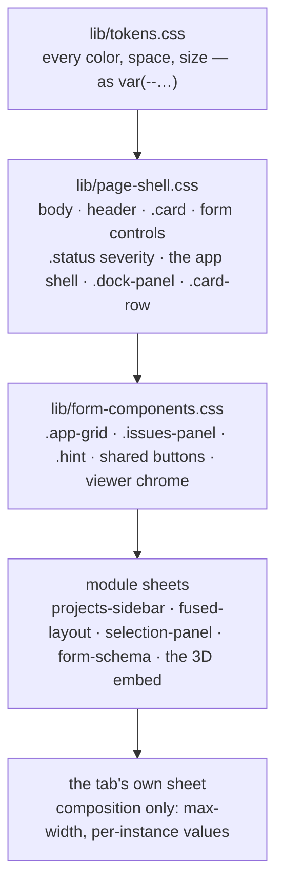

# UI contract — how the pages stay one consistent app

**Role:** contract
**Domain:** web
**Companions:** [`web-api.md`](?doc=web/web-api.md) § security — the CSP that
decides what markup may inline (§ 7 here). Every web module ships its own
stylesheet under the rules below; this doc is the cross-cutting layer, not any
one module.

Every tab in molbuilder should feel like **one application**, not a pile of
separately-styled pages. That consistency isn't luck — it comes from a few CSS
rules the whole frontend obeys: one place decides each color, one place owns each
shared widget, and layouts respond to their *content* rather than to hard-coded
screen sizes. This doc is those rules.

## 1. The five stylesheet layers

Stylesheets load in a fixed order, lowest layer first, and **each layer owns a
distinct thing**:



| Layer | Owns |
|---|---|
| `lib/tokens.css` | **only** the design tokens — every color, spacing, size, and type value (§ 2). Nothing else. |
| `lib/page-shell.css` | the shell (`body`, `header`, `main`), the generic form controls, `.card`, the `.status` message severities, the app-shell + sidebar dock geometry, `.card-row`, the spinner. |
| `lib/form-components.css` | the **shared form-page widgets** — the form grid, the issues panel, hints, the shared buttons, the viewer chrome. |
| `lib/<module>/*.css` | one self-contained component each (the projects sidebar, the fused MolView card, the selection panel, the form renderer, the embed), class-prefixed so they don't collide. |
| `<tab>/style.css` | **composition only** — arranging a page: max-width, centering, per-instance token values. |

**The one rule to remember: a widget used on more than one page lives in a
*shared* sheet (page-shell or form-components); a page's own sheet only arranges
things.** A shared element has exactly one owner — its rules are declared in one
place, and other sheets don't redeclare them.

## 2. Design tokens — the one palette file

`lib/tokens.css` names every color, spacing, size, and type value once, in a
`:root` block that every page loads first. Components reference them with
`var(--token)` and **never write a raw palette color**. Change a value there and
it shifts everywhere at once.

Two naming tiers:

- **Global (unprefixed)** — the shared vocabulary: surfaces (`--bg-page`,
  `--bg-card`, …), text (`--text-primary/-secondary/-muted`), the accent
  (`--accent`), the severities (`--success`, `--error`, `--warning`), and the
  layout/spacing/type scales (`--radius`, `--gap`, `--space-xs…xl`,
  `--text-2xs…xl`).
- **Module-private (prefixed)** — a module's own tokens, kept out of the shared
  namespace: `--ps-*` (projects sidebar), `--ts-*` (task setup), and so on.
  These live in the same one file, promoted out of scattered per-file blocks.

> **`:root` is not component-scoped, and that is why there is no exception.**
> A `:root` block matches the document wherever its sheet is loaded, so a
> token defined in a component file is set for every page that loads it — and
> two components setting the same name differently is decided by `<head>`
> order. `test_css_no_hex_literals` enforces the rule as stated: **no token
> definition outside `tokens.css`, prefixed or not.** It used to exempt any
> name that was not already canonical, on the reasoning that a per-file
> namespaced palette is legitimate; what that exemption actually protected on
> 2026-09-02 was three tokens with no prefix at all — `--page-max-width` and
> `--focus-ring` in `modify/style.css`, `--shadow-soft` in the trajectory
> inspector under the heading *"inspector-only token additions"*. All three
> are here now.

**The embed-safety pattern.** A component that can be dropped into a foreign host
(the 3D embed, an inspector) writes `var(--token, #fallback)` — the token if the
palette is loaded, a literal that *mirrors the token's real value* if it isn't.
That is the main place a literal color appears. The only others are a tagged
set of `/* exempt: */` colors that aren't UI palette at all: a WebGL scene
color (the viewer's wireframe, its canvas clear color), a decorative
gradient, and a couple of lightened text tints on dark severity rows.
**40 of them as of 2026-08-25**, and 32 sit in `molview.css` alone — a
WebGL scene's palette is its own, not the page's. Outside those documented
exceptions, a component never writes a raw palette color.

## 3. Responsive — content decides, not the viewport

The layouts reflow because their *content* stops fitting, not because a phone
hits a magic width. Three mechanisms carry most of it:

- **Grids with a `min()` floor.** An equal-track grid uses
  `minmax(min(340px, 100%), 1fr)` — so a track can shrink to the container width
  instead of forcing a horizontal scrollbar on a narrow phone.
- **`.card-row`** — a flex row whose children declare a weight, a preferred
  width, and a minimum; it wraps at the content minimum with **no media query at
  all**, so a card never squeezes below its minimum into its neighbor.
- **Container queries** — an embeddable sizes itself to *its own* width, not the
  page's. The fused MolView card flips from side-by-side to stacked at
  `@container (max-width: 692px)` (the sum of the viewer minimum, the rail, the
  handle, and the panel minimum). The Task-setup **asks** (`.ts-asks`) do the
  same at `34rem`, and they are the cautionary case: that started as a viewport
  media query, and a viewport query cannot see a block that is only ~318 px wide
  *because* it sits in a card in a column beside a sidebar. At a 1024 px
  viewport the three-column layout stayed in force where it did not fit and the
  row overflowed its container by 10 px — `test_content_fits_its_box` caught it.
  **If a block's width is set by its container rather than the window, a media
  query is the wrong instrument**, and a `minmax(0, 1fr)` floor does not save it
  (measured: it does not).

There are still a handful of real screen-width breakpoints for the things that
genuinely depend on the whole viewport: **786px** (at and above, the projects
sidebar docks in-flow; below, it becomes a slide-in **drawer**) — and that
number is *derived*, not chosen: sidebar `18rem` + the shell's insets + the
widest embed's own declared floor (`--molviewer-size-card-min-width`). It was
641px until 2026-08-23, a value that predated the 3-D viewer having a floor,
so between those widths the page docked a sidebar and then had less room than
its content declared it needed — the viewer card, correctly refusing to shrink
past its floor, overflowed its host by exactly the shortfall. A media query
cannot read a custom property, so the literal stays; the arithmetic lives
beside it in `page-shell.css`. Also **720px**
(the parameter grid flattens to one column so labels sit above inputs), plus the
module-specific ones: **960px** (task-setup), **900px** (the spectra
inspector), **768px** (markdown), **480px** (the load monitor and MolView)
and **40rem** (form-schema). All animation honors `prefers-reduced-motion`.

*(Recounted 2026-08-25. This listed `1100`, which is in no stylesheet, and
omitted three that are — a doc inventory drifts silently because nothing
fails when it does.)*

## 4. Staying visually consistent

- **Message severities have one owner.** `.status.error` / `.ok` / `.warn` /
  `.muted` are declared in exactly one place (page-shell) and map to the severity
  tokens. See § 5 for why this matters.
- **The issues panel** is the other severity surface — each issue gets a
  colored left bar and a leading glyph (⚠ / ✗ / i) from the same tokens, owned in
  form-components.
- **Cards** — `.card` in page-shell is the canonical surface (background, border,
  radius, padding, shadow), and **it is the only one**. Two tabs used to
  restyle it "deliberately"; on inspection (2026-08-24) both copies restated
  the shell's background / radius / shadow verbatim and *then* drifted — a
  softer border in one, `--radius-lg` and its own padding in the other — so
  one class had three looks and source order picked the winner. Deleting the
  copies was the fix, and `test_css_no_duplicate_selectors` now enforces it
  rather than excusing it.
- **One owner survives a rename** (2026-08-31). That check asks whether one
  *selector* has two homes, and there is a second shape it cannot see: the
  same reasoning and the same declaration under two *different* selectors.
  The MolView host's `overflow-x` rule was eighteen identical lines in
  `structure-optimization/style.css` and `transport/style.css`, differing
  only in the id — invisible to a per-selector check, because neither
  selector was ever duplicated. It lives in the module sheet now
  (`.molviewer-host`) and pages opt in with the class, so a third page needs
  no third copy. `test_no_long_block_is_copied_between_stylesheets` fails on
  ten identical non-blank lines shared by two sheets.
- **One inset per card** (2026-08-30). A card states its inset once, on
  itself; everything inside it — title, rule, tab row, fieldsets, form rows —
  **begins at that inset and adds none of its own**. A nested block may add
  *vertical* space; horizontal indentation is a deliberate signal of hierarchy,
  never a by-product of nesting.

  Measured on `/molbuilder` the day this was written: six left edges inside one
  600 px card — 18.8 (the card) · 34.8 (+ the panel's 16) · 38.8 (+ the header's
  20) · 42.8 (+ the tab row's 8) · 51.6 (+ the fieldset's 16 and the legend's 4)
  — so the card's title, the rule under it and its first form row each started
  somewhere different, and **8.6 % of the card's width was accumulated left
  margin**. Every one of those paddings is defensible alone; the sum was nobody's
  decision, which is the whole failure mode this rule names. `/task-setup` is the
  counter-example and the proof the rule is already the norm: five cards, five
  titles, all at 18.8.

  It is a rule rather than a fix because a fix cannot hold. Subtracting the
  header's 20 lines up a header inside a `.card` and **breaks** one whose parent
  is not a card and has no inset underneath to absorb it — the same component
  has to serve both.
- **One gutter per tab** (2026-08-30). Every top-level block on a page shares one
  left edge, one right edge and one max-width; nothing sits outside the page's
  own container. The Molbuilder tab had its Init-structure card as a *sibling* of
  `<main>` rather than a child, so it rendered flush while every card below it was
  inset by main's padding — a 16 px step at a narrow window and a 506 px one at a
  wide one, where only the inner row carried the max-width.
- **One family, and the shorthand is where it escapes** (2026-08-30).
  `--font-sans` in `tokens.css` is the app's sans stack. **A `font:` shorthand
  resets `font-family`**, so every rule that uses the shorthand has to retype the
  stack — and retyping is how the app came to spell one typeface five ways:
  the token, page-shell's hand-written body stack, `system-ui, sans-serif` in six
  `modify` rules, `"Inter", system-ui, sans-serif` on the page title, and
  `--font-sans` again in `task-setup` and `dialog`.

  Measured on `/molbuilder` they all render **the same face** (289.98 px for one
  string, every stack) — because the Apple and Windows names miss on that machine
  and each stack falls through to `system-ui`. **That is agreement by luck.**
  Five spellings can be edited independently, and on a machine where an earlier
  name hits they stop agreeing, in a way no one is looking for. The rule: *a
  `font:` shorthand names `var(--font-sans)`, or it is not written* — reach for
  the longhands instead, which leave the family alone.
- **Rhythm** — spacing, type sizes, and radii all come from the `--space-*` /
  `--text-*` / `--radius*` scales. **Spacing is a 4px grid** (2026-08-23):
  every step is a whole number of 4px units, so any two spacings are
  commensurable and a rhythm is either kept or visibly broken. It ran
  4 · 8 · 14 · 20 · 28 until then, and 14 was the only value off any grid —
  the gaps it left were filled by hand, with 6, 10 and 12 appearing hundreds
  of times as literals because the nearest token was wrong by enough to
  matter. Two steps were added, one value moved, and ~350 literals were
  rounded onto the grid.

  Two things are **not** rhythm and stay literal: a **hairline** (under 3px —
  a 1px nudge, a 2px inset under a border) is an optical adjustment, and
  snapping it to the grid would quadruple it; a value **over 40px** is a real
  dimension, not spacing. And a deliberate calm: no harsh gradients,
  and no animation longer than ~120 ms on a hover.

## 5. Why an error looks the same on every tab

A validation error uses `class="status error"`. Only `lib/page-shell.css` defines
`.status.error { color: var(--error) }`, and **every** page loads page-shell —
so the same red (`--error`) appears whether the message is on the Build form, the
Modify action row, the Spectra form, or the structure-optimization page. A page
sheet may nudge *where* the status sits (Modify right-aligns it) but never
re-picks the color. Change `--error` once in `tokens.css` and every error on
every tab moves together. That is the whole contract in one example: **one
owner, one token, consistent everywhere.**

**That line is sharper than *"is this selector duplicated?"*, and the
difference matters.** Four sheets declare `.status` and three of them are
*fine*:

| a page sheet declares | verdict |
|---|---|
| `margin-top`, `margin-left`, `min-height` — **where it sits, how much room it takes** | composition. Legal, and deleting it moves the page. |
| `color`, `font-size`, `font-weight` — **what it looks like** | a second owner. Illegal, however sincere. |

Both mistakes were live here until 2026-08-25. `modify/style.css` set
`color: var(--text-muted)` + `font-size: var(--text-base)`, so every status
on that page rendered `#6c7280`/15.2px where every other page rendered
`#a8aebb`/14px — dimmer, on the page that shows the most of them, and
unnoticed for months because each page looked internally consistent.
`spectra/style.css` restated the shell's two values *verbatim*, which
changes nothing until one of them drifts. And
`structure-optimization/style.css` was nearly deleted as "a duplicate" when
it declares only `margin-top` + `min-height` — pure composition; removing it
would have shifted the page by 8px.

So **read the properties, not the selector.** A duplicated selector is a
prompt to look; only a re-picked *appearance* is the defect.

### 5.1 And why a *finding* looks the same on every tab

The same rule, one layer up. A scientific finding (a validator `Issue`) is
rendered by exactly one module — `lib/validation-findings.js` — which every page
that shows findings mounts. One row shape
(`li.issue-item[data-severity]`), styled once in `lib/form-components.css`;
`workflow_group` puts a finding on its form card, everything else lands in the
page's residual panel, and **nothing is dropped**.

This was four implementations until 2026-07-29 — one per tab plus the per-card
panels `form-schema.js` creates — and the drift was not cosmetic. All three tab
copies silently discarded a finding whose `workflow_group` named a card the form
schema had not rendered (they iterated the card *panels*, so a bucket with no
panel was built and never read); the Spectra copy also dropped any severity
outside `error`/`warn`/`info`, re-ordered the rest, and carried a second row
vocabulary (`div.issue` + `.badge`) plus a competing `.issues-panel {display:
grid}` that beat the shared sheet on that one page. Deleting the copies fixed
all of it at once.

The full producer-to-panel contract — where the facts come from, how the finding
travels, and what the UI must do with it — is
[`science/validation.md` § 4.1](?doc=science/validation.md).

## 6. The `[hidden]` gotcha

One trap worth knowing, because it bites every contributor once. When JavaScript
hides an element by setting the `hidden` attribute, the browser's default
`[hidden] { display: none }` is *low specificity*. So if a class on that element
sets a `display` (say `.dock-panel { display: flex }`), the class **wins** and
the element never hides.

The rule: whenever a class sets a non-`none` `display` on an element that gets
toggled by `hidden`, **pair it with a guard** — `.dock-panel[hidden] { display:
none }`. This is done consistently across the tree — **83 guards** as of
2026-08-25, most with a comment explaining why. (It said "about thirty" until
then: the rule kept being applied and the figure stopped describing it.)

## 7. What may be inline — the CSP boundary

The security policy (owned by the server — see
[`web-api.md`](?doc=web/web-api.md) § security) draws a sharp line:

- **Inline `style=` is allowed** — the 3D embed and some inspector cards set a
  small amount of inline style (a viewer height, say). The risk is small (a CSS
  injection at worst, never JavaScript). *(This is why the token rule bans inline
  **colors** but not inline layout: a color belongs to the palette, a one-off
  height is a composition detail.)*
- **Inline `<script>` is banned** — `script-src 'self'` has no `unsafe-inline`.
  All behavior lives in linked `.js` files; no `<script>` blocks, no `onclick=`
  attributes. If an XSS payload ever landed, the CSP would block it.

## 8. Is a rule dead? — how to tell, and how not to

Unused CSS is worth removing and **very easy to get wrong**, because every
cheap way of asking gives a confidently wrong answer. All four traps below
produced one here on 2026-08-25, and two of them nearly deleted live styling.

**Trap 1 — grepping for the class name.** A class can be *composed*:

```js
{ class: "workflow-group workflow-group--" + role }   // form-schema.js
el("div", "schema-field-" + f.kind)                   // form-schema.js
```

`.workflow-group--stage` appears in no JS file and is live on the Build form
for **11 fields** — `stage` is a member of `template.GROUPS`. The same trick
had already hidden `.schema-field-checkbox` from an earlier sweep. A grep can
only ever say *"no literal reference"*, which is not the question asked.

**Trap 2 — one page, one state.** Most rules match nothing most of the time.
`form-components.css` reports 42 of its 55 selectors unmatched on
`/molbuilder` — because the Build form lives on other pages. Dialogs are
closed, panels are collapsed, and error rules (`.structure-error`,
`.source-body-error`) match only when something has *failed*, which no page
walk reaches by accident.

**Trap 3 — `querySelectorAll` cannot evaluate everything.** `::backdrop`,
`::before`, `:hover`, `:focus-visible` and friends are not selectable, so a
zero there is an artefact of the instrument, not a finding.
`.mb-dialog::backdrop` reads "dead" and is live on every modal.

**Trap 4 — the shell lies quietly.** `**/*.js` does **not** recurse without
`globstar`, and an unquoted `--include=*.js` is glob-expanded by the shell
before grep ever sees it. Both search the wrong thing and report success.

### What actually settles it

Load the page, put the component **into the state that uses the rule**, then
read the DOM:

```js
for (const r of sheet.cssRules) {
  // Trap 3: these cannot be evaluated, so a zero would be meaningless.
  if (/::|:hover|:focus|:active|:checked|:not\(/.test(r.selectorText)) continue;
  if (!document.querySelectorAll(r.selectorText).length)
      console.log("unmatched here:", r.selectorText);
}
```

Unmatched in **every** state you can reach is evidence; unmatched once is
not. If a rule guards a failure path you cannot trigger, **leave it** — a
dead rule costs bytes, a deleted live one breaks the UI in exactly the states
nobody is watching.

**And "unmatched" still is not "delete it".** A shared sheet may declare a
*vocabulary* on purpose — `dialog.css` lists the seven parts a modal has,
precisely because the failure it was written to end was JS emitting class
names no stylesheet answered. An unused member of a declared vocabulary is a
promise kept, not residue; if the markup and the vocabulary disagree, **the
markup is the thing to change.** Ask what the sheet's header says it is for
before concluding anything.

### Standing verdicts, so they are not re-derived

| rule | verdict | how it was settled |
|---|---|---|
| `.workflow-group--stage` | **live** | composed from `role`; 11 SIESTA fields carry it; 2 matches measured on the Build form |
| `.mb-dialog-title`, `.mb-dialog-field` | **declared API — keep** | both dialog modes opened; neither uses them. But `dialog.css`'s own header names them as the component's vocabulary, and that sheet exists *because* JS once wrote ten classes no stylesheet answered and the browser painted its own chrome. The one file that put a bare `<h2>` where the vocabulary says `.mb-dialog-title` was `modify/structure/save-dialog.js`, **retired 2026-09-02** when the Save panel moved onto `projects.chooseSavePath` — so the drift left with it rather than being patched. Any new dialog uses the vocabulary. |
| `.mb-dialog::backdrop` | **live** | Trap 3 — not selectable, matches on every modal |
| `.inspector-section{,-header,-hint}`, `.fdf-actions`, `.fdf-output`, `.disabled-tip`, `.workflow-group-apply-btn`, `.structure-error`, `.source-body-error` | **no builder found — deliberately NOT deleted** | no literal reference and no composition prefix, but never observed in their own state either |

## 9. Checklist for changing the UI

- A new **color / size / spacing** value → add it to `tokens.css`; reference it
  with `var(--…)`. No raw palette `#hex` (a `var(--token, #fallback)` in an
  embeddable, or a tagged `/* exempt: */` scene/decorative color, are the only
  literals).
- A widget used on **more than one page** → a shared sheet (page-shell or
  form-components), not a page sheet. One owner.
- A page's own sheet → **arrangement only** (max-width, per-instance values).
- A layout that must reflow → prefer a `min()` grid floor or `.card-row` over a
  new media-query breakpoint.
- A class that sets `display` on a `hidden`-toggled element → add the
  `[hidden]` guard.
- A **negative** token value → `calc(-1 * var(--token))`. **`-var(--token)` is
  not valid CSS**: the minus does not bind to the function, so the browser
  discards the *whole declaration* — including any other values on the same
  line. Nothing errors, nothing renders differently enough to notice, and the
  comment beside it goes on describing a layout that never shipped. One shipped
  this way for months (`modify/style.css`'s op-tab strip, "bleed to card edges",
  found 2026-08-30 and pinned by `test_css_negated_var_is_calc`).
- Behavior → a linked `.js` file; never an inline `<script>` or `onclick=`.
- A page sheet that repeats a shared selector → **read its properties** (§ 5).
  Position is composition and stays; `color` / `font-size` is a second owner
  and goes.
- About to delete a rule as unused → **§ 8 first.** A grep cannot see a
  composed class, one page state cannot see a dialog or an error, and
  `querySelectorAll` cannot see `::backdrop`. § 8 also carries the verdicts
  already reached, so they are not worked out a fourth time.

## 10. The page busy fence — one cover for every heavy click

*(2026-08-28, user design: "blocking the window is going to block switching —
make it simple".  Replaces the sidebar-scoped lock of 2026-05-27, which
shipped a banner, a Cancel and three recovery layers and then never gained a
production caller.)*

**The problem it solves.**  A user clicks something that makes the server
work for seconds — generate 3-D coordinates from a SMILES, a multi-step
save.  While that runs, every other control is still live: switching the
sidebar directory mid-save retargets the operation's later steps; switching
tabs abandons the result.  Guarding each control separately is
micromanagement that never ends.

**The rule.**  One shell primitive: behavior and DOM in
`lib/page-busy.js`; styles in `lib/page-shell.css` § 2.1 beside the
spinner, because a widget used on every page lives in a shared sheet
(§ 1) — and that sheet loads in every page's `<head>`, so the cover's
geometry exists before the first claim can raise it.  Visibility is the
`hidden` attribute with its § 6 guard, nothing else:

```js
import { pageBusy } from "../lib/page-busy.js";

pageBusy.claim("Generating 3-D structure…", [() => controller.abort()]);
try   { ... the operation ... }
finally { pageBusy.release(); }
```

While claimed, a full-window cover shows the reason, a spinner, and a
**Cancel** button.  The whole window is covered, so *everything* — tabs,
sidebar, forms — is blocked by construction; nothing is wired per-control.

**The recovery contract** (carried over from the sidebar lock, verbatim):
`release()` sits in a `finally`, so a thrown operation still releases;
the cancelers abort the in-flight request; and Cancel is the human
override, always clickable — it runs the cancelers but does **not**
release (the operation's own `finally` does, after its abort unwinds).
There is no silent stuck state.  `claim()` while claimed **throws** —
one heavy operation at a time is the design, not a limitation.

**Who claims it.**  User-*triggered* heavy or risky operations only.
Periodic or automatic work (the GPU sampler, status polling) never
claims: there is no click to block, and freezing the page on a timer
would be the bug.  That class is protected server-side instead
(subprocess + timeout — the 2026-08-28 GPU fence).

**Programmatic races.**  The cover blocks clicks, not code.  The one
programmatic mover of shared state, `projects.navigateTo`, refuses while
the fence is claimed (§ 8.5 defense-in-depth) — a future module that
moves shared state from code should do the same.

**The honest limit.**  The fence protects this window against its own
user.  A second browser tab, or another user of a shared server, still
reaches the backend — that class stays server-side, case by case.
