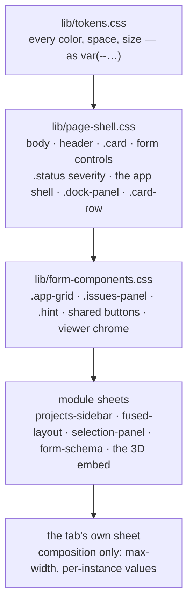

# UI contract — how the pages stay one consistent app

**Role:** contract
**Domain:** web
**Companions:** [`web-api.md`](?doc=web/web-api.md) § security — the CSP that
decides what markup may inline (§ 7 here). Every web module ships its own
stylesheet under the rules below; this doc is the cross-cutting layer, not any
one module.

Every tab in molbuilder should feel like **one application**, not a pile of
separately-styled pages. That consistency isn't luck — it comes from a few CSS
rules the whole frontend obeys: one place decides each color, one place owns each
shared widget, and layouts respond to their *content* rather than to hard-coded
screen sizes. This doc is those rules.

## 1. The five stylesheet layers

Stylesheets load in a fixed order, lowest layer first, and **each layer owns a
distinct thing**:

| Layer | Owns |
|---|---|
| `lib/tokens.css` | **only** the design tokens — every color, spacing, size, and type value (§ 2). Nothing else. |
| `lib/page-shell.css` | the shell (`body`, `header`, `main`), the generic form controls, `.card`, the `.status` message severities, the app-shell + sidebar dock geometry, `.card-row`, the spinner. |
| `lib/form-components.css` | the **shared form-page widgets** — the form grid, the issues panel, hints, the shared buttons, the viewer chrome. |
| `lib/<module>/*.css` | one self-contained component each (the projects sidebar, the fused MolView card, the selection panel, the form renderer, the embed), class-prefixed so they don't collide. |
| `<tab>/style.css` | **composition only** — arranging a page: max-width, centering, per-instance token values. |

**The one rule to remember: a widget used on more than one page lives in a
*shared* sheet (page-shell or form-components); a page's own sheet only arranges
things.** A shared element has exactly one owner — its rules are declared in one
place, and other sheets don't redeclare them.

## 2. Design tokens — the one palette file

`lib/tokens.css` names every color, spacing, size, and type value once, in a
`:root` block that every page loads first. Components reference them with
`var(--token)` and **never write a raw palette color**. Change a value there and
it shifts everywhere at once.

Two naming tiers:

- **Global (unprefixed)** — the shared vocabulary: surfaces (`--bg-page`,
  `--bg-card`, …), text (`--text-primary/-secondary/-muted`), the accent
  (`--accent`), the severities (`--success`, `--error`, `--warning`), and the
  layout/spacing/type scales (`--radius`, `--gap`, `--space-xs…xl`,
  `--text-2xs…xl`).
- **Module-private (prefixed)** — a module's own tokens, kept out of the shared
  namespace: `--ps-*` (projects sidebar), `--sp-*` (selection panel), and so on.
  These live in the same one file, promoted out of scattered per-file blocks.

**The embed-safety pattern.** A component that can be dropped into a foreign host
(the 3D embed, an inspector) writes `var(--token, #fallback)` — the token if the
palette is loaded, a literal that *mirrors the token's real value* if it isn't.
That is the main place a literal color appears. The only others are a small,
tagged set of `/* exempt: */` colors that aren't UI palette at all — a WebGL
scene color (the viewer's wireframe, its canvas clear color), a decorative
gradient, and a couple of lightened text tints on dark severity rows. Outside
those documented exceptions, a component never writes a raw palette color.

## 3. Responsive — content decides, not the viewport

The layouts reflow because their *content* stops fitting, not because a phone
hits a magic width. Three mechanisms carry most of it:

- **Grids with a `min()` floor.** An equal-track grid uses
  `minmax(min(340px, 100%), 1fr)` — so a track can shrink to the container width
  instead of forcing a horizontal scrollbar on a narrow phone.
- **`.card-row`** — a flex row whose children declare a weight, a preferred
  width, and a minimum; it wraps at the content minimum with **no media query at
  all**, so a card never squeezes below its minimum into its neighbor.
- **Container queries** — an embeddable sizes itself to *its own* width, not the
  page's. The fused MolView card flips from side-by-side to stacked at
  `@container (max-width: 692px)` (the sum of the viewer minimum, the rail, the
  handle, and the panel minimum).

There are still a handful of real screen-width breakpoints for the things that
genuinely depend on the whole viewport: **641px** (at and above, the projects
sidebar docks in-flow; below, it becomes a slide-in **drawer**), **720px**
(the parameter grid flattens to one column so labels sit above inputs), plus a
few module-specific ones (`1100`, `768`, `480`). All animation honors
`prefers-reduced-motion`.

## 4. Staying visually consistent

- **Message severities have one owner.** `.status.error` / `.ok` / `.warn` /
  `.muted` are declared in exactly one place (page-shell) and map to the severity
  tokens. See § 5 for why this matters.
- **The issues panel** is the other severity surface — each issue gets a
  colored left bar and a leading glyph (⚠ / ✗ / i) from the same tokens, owned in
  form-components.
- **Cards** — `.card` in page-shell is the canonical surface (background, border,
  radius, padding, shadow). A couple of tabs deliberately restyle it in their own
  vocabulary, which the shell documents as intentional.
- **Rhythm** — spacing, type sizes, and radii all come from the `--space-*` /
  `--text-*` / `--radius*` scales. And a deliberate calm: no harsh gradients,
  and no animation longer than ~120 ms on a hover.

## 5. Why an error looks the same on every tab

A validation error uses `class="status error"`. Only `lib/page-shell.css` defines
`.status.error { color: var(--error) }`, and **every** page loads page-shell —
so the same red (`--error`) appears whether the message is on the Build form, the
Modify action row, the Spectra form, or the structure-optimization page. A page
sheet may nudge *where* the status sits (Modify right-aligns it) but never
re-picks the color. Change `--error` once in `tokens.css` and every error on
every tab moves together. That is the whole contract in one example: **one
owner, one token, consistent everywhere.**

### 5.1 And why a *finding* looks the same on every tab

The same rule, one layer up. A scientific finding (a validator `Issue`) is
rendered by exactly one module — `lib/validation-findings.js` — which every page
that shows findings mounts. One row shape
(`li.issue-item[data-severity]`), styled once in `lib/form-components.css`;
`workflow_group` puts a finding on its form card, everything else lands in the
page's residual panel, and **nothing is dropped**.

This was four implementations until 2026-07-29 — one per tab plus the per-card
panels `form-schema.js` creates — and the drift was not cosmetic. All three tab
copies silently discarded a finding whose `workflow_group` named a card the form
schema had not rendered (they iterated the card *panels*, so a bucket with no
panel was built and never read); the Spectra copy also dropped any severity
outside `error`/`warn`/`info`, re-ordered the rest, and carried a second row
vocabulary (`div.issue` + `.badge`) plus a competing `.issues-panel {display:
grid}` that beat the shared sheet on that one page. Deleting the copies fixed
all of it at once.

The full producer-to-panel contract — where the facts come from, how the finding
travels, and what the UI must do with it — is
[`science/validation.md` § 4.1](?doc=science/validation.md).

## 6. The `[hidden]` gotcha

One trap worth knowing, because it bites every contributor once. When JavaScript
hides an element by setting the `hidden` attribute, the browser's default
`[hidden] { display: none }` is *low specificity*. So if a class on that element
sets a `display` (say `.dock-panel { display: flex }`), the class **wins** and
the element never hides.

The rule: whenever a class sets a non-`none` `display` on an element that gets
toggled by `hidden`, **pair it with a guard** — `.dock-panel[hidden] { display:
none }`. This is done consistently across the tree (about thirty guards, most
with a comment explaining why).

## 7. What may be inline — the CSP boundary

The security policy (owned by the server — see
[`web-api.md`](?doc=web/web-api.md) § security) draws a sharp line:

- **Inline `style=` is allowed** — the 3D embed and some inspector cards set a
  small amount of inline style (a viewer height, say). The risk is small (a CSS
  injection at worst, never JavaScript). *(This is why the token rule bans inline
  **colors** but not inline layout: a color belongs to the palette, a one-off
  height is a composition detail.)*
- **Inline `<script>` is banned** — `script-src 'self'` has no `unsafe-inline`.
  All behavior lives in linked `.js` files; no `<script>` blocks, no `onclick=`
  attributes. If an XSS payload ever landed, the CSP would block it.

## 8. Checklist for changing the UI

- A new **color / size / spacing** value → add it to `tokens.css`; reference it
  with `var(--…)`. No raw palette `#hex` (a `var(--token, #fallback)` in an
  embeddable, or a tagged `/* exempt: */` scene/decorative color, are the only
  literals).
- A widget used on **more than one page** → a shared sheet (page-shell or
  form-components), not a page sheet. One owner.
- A page's own sheet → **arrangement only** (max-width, per-instance values).
- A layout that must reflow → prefer a `min()` grid floor or `.card-row` over a
  new media-query breakpoint.
- A class that sets `display` on a `hidden`-toggled element → add the
  `[hidden]` guard.
- Behavior → a linked `.js` file; never an inline `<script>` or `onclick=`.
