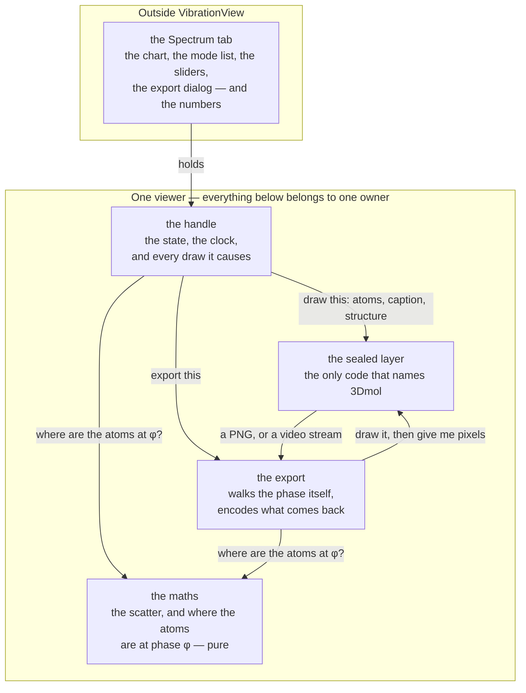

# VibrationView — animating a vibrational normal mode

**Role:** contract
**Domain:** web
**Companions:** [`molview.md`](?doc=web/molview.md) — its **sibling** viewer, and the
module this one's design is derived from (MolView never animates; VibrationView
never selects or edits); [`spectra.md`](?doc=web/spectra.md) — the tab that drives
it, and where the modes come from and what the two normalizations mean;
[`overview.md`](?doc=web/overview.md) — the module registry and the seam doctrine.

VibrationView is the one component in the browser that makes a molecule vibrate.
Hand it a structure and a normal mode, and it shows the atoms oscillating along
that mode's displacement vectors — and, on request, exports the oscillation as a
file you can put in a talk or a paper.

**This document is the design of that component** — what it is for, what it
refuses to do, what it holds, how it is layered, what each API is for, and how its
tests are derived. It is not a tour of the current code. § 15 says which parts are
built.

> **Words used in this document.**
>
> - **A viewer** — one mounted VibrationView: one 3D window and everything it
>   holds. Two on a page are two of these, sharing nothing.
> - **The handle** — the object you get back from `mount`. It *is* the viewer;
>   there is no other way to reach one.
> - **The sealed layer** — the one file in this module allowed to name 3Dmol.js.
>   Nothing above it knows that library exists.
> - **The equilibrium** — the structure the mode is defined against: the atoms at
>   rest. The animation swings around it and always returns to it.
> - **A mode** — one normal mode: a displacement vector for each atom that was
>   allowed to move, saying which way it goes and how far relative to the others.
> - **The basis** — how to read a mode's array. A vibrational calculation is run
>   over the atoms that were allowed to move, so the mode has one row per *free*
>   atom, and the basis says which atom each row belongs to (§ 6.3).
> - **Held still** — an atom the calculation froze. It has no row in the mode, so
>   it does not move, and it is drawn dead to say so.
> - **The phase** — where in the cosine cycle the animation currently is. It
>   advances one step per frame; pausing keeps it, so resuming never jumps.
> - **`fps`** — how many frames one second of animation contains. Since a cycle
>   lasts one second by default, it is also **how many frames one oscillation is
>   drawn in**, which is what makes the motion smooth (§ 10.1).
> - **Display** and **physical** — the two ways a mode's size can be read
>   (§ 12.2). Display is a drawing choice; physical is a quantity.

---

## 1. The goal

**One component that animates a normal mode, and gets that animation out at
publication quality.**

A user clicks a mode in a spectrum and sees the molecule move the way that mode
moves. They set how big the swing is and how fast, and they export what they are
looking at as a file they can drop into a slide or submit as supplementary
material — with the animation's own settings recorded, so the figure caption can
be true.

---

## 2. What VibrationView is not

Each boundary is here because something on the other side of it would plausibly
drift across.

| Not | Whose job it is | Why the boundary is there |
|---|---|---|
| a **structure viewer** | MolView | selecting, measuring, editing, trajectories, cells, labels. VibrationView shows one structure moving one way; anything a user does *to* a structure belongs next door |
| a **spectroscopy calculator** | the server, and the Spectrum tab | where modes come from, what a frequency means, which normalization to use, what temperature to quote. VibrationView is handed numbers and a sentence; it moves atoms and draws the sentence |
| a **source** for a structure | whoever mounted it | it keeps one, to animate from — and answers no question about it. Nothing can read a structure, a mode or a camera back out (§ 6.4). A caller that needs to know what is loaded already knows: it did the handing |
| a **control panel** | the tab | the sliders, the play button, the export dialog and the mode list are the tab's. VibrationView draws no controls (§ 5.4) |

---

## 3. The overall shape



Four things to read off it:

**A tab owns none of it.** A tab has a handle. It does not have the drawing
surface, the clock, or a way to reach 3Dmol.

**The maths knows nothing about drawing, and nothing about time.** It answers one
question — where are the atoms at phase φ — with numbers, for anyone who asks. The
handle asks it once per frame; the export asks it once per frame it encodes. That
is why a file records what was on screen: not because two paths were kept in step,
but because there is one answer and both read it.

**The export lives inside the module** for the same reason. An encoder outside it
would need that maths handed out, and then two places would own how a frame is
built.

**Nothing flows back up past the seal** except pixels. The sealed layer is never
asked where an atom is or which frame is showing (§ 9.3).

**Everything inside the box belongs to one owner.** Mount twice and you get two of
these, sharing nothing.

---

## 4. VibrationView is a self-contained module

**VibrationView is one ES module, sealed at every edge.** It is imported by name,
it reaches nothing else in the app by name, and nothing in the app can reach
inside it.

**One entry point, and nothing else is importable.**

```js
import { mount } from "/static/lib/vibrationview/index.js";
```

That is the whole surface. Every other file in the module is internal — the
maths, the export, the sealed layer, the stylesheet. A consumer that imports one
of them directly has broken the module, not found a shortcut.

**A directory is not a seal, so the concealment is made three ways.** Everything
under `web/static/` is served, which means an internal file has a URL and any
script could reach for it. Convention alone did not hold last time.

- **Every internal file is underscore-prefixed** — `_maths.js`, `_export.js`. An
  import of `_maths.js` reads as a violation where it is written; an import of
  `maths.js` reads as ordinary code. The door is the one file without the mark.
- **The module links its own stylesheet** (§ 13). No template names it, so no page
  can forget it and no page has to know it exists.
- **A guard test asserts the boundary** — nothing outside the package may name any
  path inside it but `index.js`. It runs in one direction and does not read the
  module's own files, because that is the reach it exists to forbid.

**Nothing it needs comes from a global, and nothing it holds is published to
one.** It does not read `window.molbuilder` and it does not write to it. A viewer
needs one thing at mount: an element to live in. Everything else arrives through
the handle.

This is the rule the previous design broke in both directions, and the reason
this document exists (§ 15).

**Nothing leaks out.** No 3Dmol object, no DOM node, and no internal function ever
appears on the handle. The name `3Dmol` occurs in exactly one file, which is also
the only place that fails with a clear error when the library is missing.

**No test seam.** Nothing is published for a test to reach, because a seam a test
can reach is a seam anything can reach. Tests import the module and drive the
handle, exactly as a page does (§ 14).

**The test of all of this:** delete every other web module and VibrationView still
loads, mounts, animates and exports.

---

## 5. The ideas everything else follows from

Four of them. A design choice that breaks one is wrong no matter how convenient.

### 5.1 A mode is shown against a structure, and the structure is the slower fact

Installing a structure is rare — it happens when you open a different result.
Showing a mode is frequent — it happens every time you click a row in the mode
list. So they are two doors, and **the door you call is what says what it costs**:
`setStructure` redraws and refits, `showMode` does not.

The alternative — one door that takes both and works out whether the structure
changed — makes the cost of a click depend on a comparison, and puts the
question "is this the same molecule?" inside a viewer that has no business having
an opinion about it.

It follows that **a new structure ends the current mode.** `setStructure` stops
the clock and forgets the mode, because a mode belongs to the structure it was
computed against and means nothing against another one. A viewer holding a
structure and no mode is a still molecule — a coherent thing to be. A viewer
animating structure B with structure A's eigenvector is not, and it would look
entirely plausible on screen.

### 5.2 One place holds each fact

The equilibrium, the current mode, the amplitude, the frame rate, the phase: each has
one home inside one viewer, written through one door. Two homes for a fact means a
mechanism to keep them in step, and that mechanism is where they fall out of step.

This is why **amplitude is not a mount option that `showMode` can also set**
(§ 6.2), and why **the held-still set is derived and never given** (§ 6.3).

### 5.3 What is animated is what is exported

The file records the same maths, the same amplitude and the same frame sequence
as the screen. There is no second render path and no separate "export quality" geometry.
An export differs from the screen in exactly three ways: **its size, its
background, and where the bytes go.** Naming the three is what stops a fourth
joining them quietly.

It follows that the export carries **what it was set to** in its own metadata, so a
caption written from the file is true without the writer having to remember.

### 5.4 The graphics library is invisible, and the controls are not ours

Nothing above the sealed layer knows the viewer is 3Dmol. And VibrationView draws
**no controls** — no heading, no toolbar, no menu, no buttons. It fills the element
it was given with a moving molecule. The tab that mounted it already has a heading
and controls; a component that brings its own is a component that appears twice on
screen.

**A caption drawn inside the picture is not a control** (§ 12.3). The line is
between things that *are* the picture and things that *operate on* it: the first
must be here, because only this module can put marks on the canvas and therefore
into an exported file; the second must be the tab's, for the reason above.

---

## 6. The data a viewer holds

### 6.1 The shapes

```js
structure = {
    elements:  ["O", "H", "H"],        // one symbol per atom
    positions: [[x, y, z], ...],       // Å, one row per atom, the EQUILIBRIUM
}

mode = {
    index:         7,                  // which mode this is; carried into the export stamp
    displacements: [[dx, dy, dz], ...],// one row per FREE atom (or per atom — § 6.3)
    basis:         [0, 1, 4, 5],       // row k belongs to atom basis[k]; optional
    norm:          "display",          // free text — carried, never interpreted (§ 6.2)
    label:         "Mode 7 · 1584.2 cm⁻¹",   // free text — drawn in the picture (§ 12.3)
}
```

**A displacement array is a shape, not a size.** It says which way each atom
moves and how far *relative to the others* — nothing about ångström. That is what
an eigenvector is: its overall scale is arbitrary until something fixes it. The
size arrives separately, as the amplitude, and the animation is their product:

```
position_i(φ) = equilibrium_i  +  amplitude · cos(φ) · displacement_i
                └ where it   ┘     └ how big ┘        └ which way, and how far
                  rests                                  relative to the others ┘
```

Keeping those two apart is the whole reason amplitude has its own home (§ 6.2)
and the reason "display" and "physical" are a choice of *pair* rather than a
setting (§ 12.2).

Held inside one viewer, and nowhere else:

| Fact | Written by | Read by |
|---|---|---|
| the equilibrium structure | `setStructure` | the maths, the baseline draw |
| the current mode's per-atom displacement | `showMode` | the maths |
| the amplitude | `setAmplitude` | the maths, the export stamp |
| the frame rate, and the cycle length | `setFps` / `setCycleSec` | the clock, the export stamp |
| the frame number, and whether it is running | `play` / `pause`, and the loop | the maths, the export stamp |
| the normalization label | `showMode` | the export stamp only |
| the caption, and whether it is shown | `showMode` / `setLabelVisible` | the drawing (§ 12.3) |

### 6.2 Amplitude has one home, and the caller decides what goes in it

Amplitude is a handle-level setting written through `setAmplitude` and read fresh
on every tick. It is **not** carried on a mode.

That matters because the two normalizations want different amplitudes and would
otherwise each need their own door: a display animation uses one amplitude for
every mode, while a physical animation uses an amplitude that depends on the
mode's own frequency (§ 12.2). Both are the caller's arithmetic. It sets the
number before it shows the mode, and there is still exactly one place the number
lives.

`norm` travels beside the mode so the export can say which convention was on
screen. **VibrationView never acts on it** — it does not scale, convert or refuse
anything because of it. It is carried the way a label is carried: stored, stamped,
and never interpreted.

Which is why it is **free text and not a fixed set of values.** "Physical" is not
one claim — zero-point and thermal at 298 K are different statements, and a
caption needs the difference. A module that enumerated the legal values would be
deciding which claims may be made, which is the tab's business. The tab writes
whatever is true; this module copies it into the export and reads no meaning from
it.

### 6.3 The free/held-still partition is one fact, given once

A vibrational calculation is run over the atoms that were allowed to move, so a
mode has one row per free atom. `basis` says which atom each row belongs to.

**The held-still set is the complement of the basis, derived here and never
given.** Two lists that must partition the atoms are two facts that can
contradict, and nothing downstream could tell which was right — an atom named in
both would be greyed as frozen while being moved as free.

The mode arrives one of two ways, and both are honest:

| `basis` | Means | Held still |
|---|---|---|
| given | row *k* is atom `basis[k]` | every atom not named in it |
| absent | the rows are already one per atom, in order | nothing |

The scatter — turning free-atom rows into a full per-atom array with zeros where
nothing moves — is the one science-shaped piece of arithmetic this module owns.
It is authoritative even when the free set is not a sorted run, which is why the
basis is used whenever it is present rather than being second-guessed by a length
check.

**A mode that does not fit the structure is refused, never padded.** A basis that
names an atom the structure does not have, or more rows than there are atoms, is
a mode computed against a different molecule. Filling the gap with zeros produces
a molecule that animates — partially, plausibly, and wrongly. So the door says no,
and nothing is drawn.

This is a boundary the caller currently has to defend for itself: the Spectrum tab
compares atom counts before it hands a mode over, precisely because the viewer
will presently accept anything. Refusing here retires that guard, and an atom
count was never much of one — any two molecules of the same size pass it.

### 6.4 What a viewer does not hold

- **A file name, a path, or anything about where the structure came from.**
- **A frequency, a temperature, an intensity, or a mode list.** It holds one
  mode's displacements, an index it does not interpret, and a caption it draws
  without reading (§ 12.3). A sentence containing a frequency is not a frequency:
  nothing here can compare, round, convert or compute with it, which is what the
  distinction is for.
- **Any answer about the structure.** There is no `getStructure`. The caller
  handed it in; asking for it back would create a second place to believe.
- **A camera position.** The camera is fitted when the structure changes, and
  otherwise left where the user put it.

---

## 7. The layers

| Level | What it is | Never |
|---|---|---|
| 1 | **the handle** — the doors a tab calls, the state, the clock | works out where an atom goes, or names 3Dmol's own vocabulary |
| 2 | **the maths** — the scatter, and the atoms' positions at a phase | touches the DOM, keeps state, or reads a clock; it is values in, values out |
| 3 | **the export** — walks the phase, encodes what the seal returns | works out a position itself; it asks level 2, exactly as level 1 does |
| 4 | **the sealed layer** — the drawing surface | keeps a frame number, answers where an atom is, or knows what a vibration is |

**Level 2 holds no clock**, which is the point of it: a `requestAnimationFrame` in
the maths would mean every test of an eigenvector scatter had to fake a browser
first. Timing is *when* to draw and the maths is *what* to draw, and only the
second is a pure function of its inputs.

Level 3 sits *above* the seal rather than inside it, because encoding a GIF is not
knowledge about a graphics library — it is knowledge about GIFs.

---

## 8. Making and tearing down a viewer

```js
const vib = await mount(hostEl, { amplitude: 0.15, fps: 30, showLabel: true });
```

**`mount` is asynchronous and always resolves.** The handle it returns is live: the
surface is built, and every door works from the first call. There is no readiness
callback, no readiness flag, and nothing to defer — a viewer that is not ready yet
is a state a caller can get wrong, so it is not offered.

**Failure is a handle, never a rejection and never `null`:**

```js
{ ok: false, error: "…", dispose() {} }
```

so a caller branches on `ok` and can call `dispose()` unconditionally. A live
handle carries `ok: true`. This is the same mount contract MolView uses, for the
same reason: teardown must never have to ask whether setup worked.

`dispose()` stops the clock, releases the drawing surface, and leaves the host
element empty. Calling it twice is safe.

Defaults: amplitude **0.15 Å**, **30 fps**, cycle **1.0 s**, caption **shown**.

---

## 9. The APIs, and who each one serves

### 9.1 The entry point

```js
import { mount } from "/static/lib/vibrationview/index.js";
```

One name. § 4.

### 9.2 The handle — for a tab that wants an animation

```
setStructure({ elements, positions })      install the equilibrium; redraw + refit,
                                           and end whatever mode was running (§ 5.1)
showMode({ index, displacements, basis?, norm?, label? })
                                           scatter, mark what is held still, animate
play()  pause()  isPlaying()               the clock
setAmplitude(Å)                            live: the next frame reads it
setFps(n)  setCycleSec(s)                  how smooth, and how long a cycle (§ 10.1)
setLabelVisible(on)                        show or hide the caption (§ 12.3)
exportAnimation(opts) -> Promise<result>   § 12
dispose()                                  stop, release, empty
```

Eleven doors. Every one is behaviour; none is a way to read the module's insides.
`isPlaying` is the single exception and it earns its place: a play/pause button
has to draw itself from somewhere, and the alternative is the host keeping a
mirror of a fact it does not own.

There is deliberately **no `getMode`**. The caller passed the index in; handing it
back would be a second place to believe something, for a caller that already knows.

**The live knobs are live.** `setAmplitude`, `setFps` and `setCycleSec` are plain
writes that the running loop picks up on its next frame — no rebuild, no
re-registration, and **a slider drag never stops the animation**.

A rate change keeps the phase, by re-expressing the frame number against the new
count. Where the new rate can express the old phase — every finer grid contains a
coarser one's positions — the molecule does not move at all. Where it cannot, the
phase lands on the **nearest frame the new rate has**, which is off by at most
half a step and never accumulates, because each change re-anchors from the phase
rather than from a running offset. Without any of this, nudging a smoothness
slider would visibly throw the animation to a different part of its cycle.

**`showMode` before a structure does nothing**, and says so; it is not an error and
not a queue. A caller that has a mode but no structure has a bug one line earlier.
A mode that does not fit the structure it *does* have is refused outright (§ 6.3).
`play()` with no mode to animate is the same kind of nothing — a still molecule
stays still rather than starting a clock with nothing attached to it.

### 9.3 The sealed layer — commands down, pixels up

```
setStructure(elements, positions)    draw one frame
setAtomCoords(coords)                move the atoms already drawn — no rebuild
setHeldStill(indices)                mark these atoms as not moving
setLabel(text | null)                the caption in the corner, or none
refit()                              fit the camera to what is drawn
beginCapture({ width, height, background }) -> endCapture()
                                     draw for a picture instead of for a screen
snapshot() -> Blob                   one PNG of what is drawn, right now
stream(fps) -> MediaStream           a live video stream of the same canvas
dispose()
```

It answers **no** question about the structure, the frame, or the camera. What
"held still" *looks like* is decided here and nowhere else — the layer above says
*which atoms are held still*, never what colour they should be. A colour riding on
data is how a drawing decision ends up in three places. The caption is the same
bargain: the layer above supplies the words, this layer decides the font, the size,
the corner and the padding.

**`beginCapture` takes exactly the two things an export may change** (§ 5.3), which
is how that rule stops being a sentence someone has to remember. A third thing
cannot join the list without a door being widened on purpose.

**It hands back the undo rather than remembering what to undo.** `endCapture`
restores the size and the background because it closed over them — so nothing ever
has to *ask* this layer how big it was or what colour it had, and those two
questions can go on being refused like all the others.

`snapshot` and `stream` take no size of their own for the same reason: the picture
is of whatever is drawn, and changing what is drawn is `beginCapture`'s job.

They are the two ways pixels leave, and both are requests for a picture of what is
already drawn — not a second render path (§ 5.3).

---

## 10. How a frame gets drawn

One equation, applied per atom:

```
position_i(φ)  =  equilibrium_i  +  amplitude · cos(φ) · displacement_i
```

Held-still atoms have a zero displacement row, so they are not a special case in
the loop — they simply do not move.

Per frame, in order:

1. advance to the next frame number, and take its phase (§ 10.1);
2. ask the maths where the atoms are at that phase;
3. hand them to the seal through `setAtomCoords`.

**Step 3 moves atoms; it does not reload the structure.** The parse, the element
identities and the bond topology are established once, when the structure is
installed, and every frame after that is coordinates.

**It is not free, though, and the document said otherwise until the drawing layer
was written.** The library caches its representation meshes when a style is
applied, so writing new coordinates updates the data and *not* the picture — the
molecule stands perfectly still while the numbers advance underneath it. Making
the new positions appear means re-applying the style, which regenerates the
geometry. So a frame costs **one pass over the atoms**, not a constant: O(atoms),
at the few hundred atoms this project works with, which is the difference between
smooth and smooth. Recorded here because it is a property of the drawing library
rather than a choice, and because the alternative reading — that a frame is free —
is what let an animation sit motionless through ten rounds of fixes before anyone
found the cause.

**What costs what:**

| Change | Cost |
|---|---|
| a frame | one coordinate write and one style pass — O(atoms), no reload, no reparse |
| `setAmplitude` / `setFps` / `setCycleSec` | a variable write; the next frame differs |
| `showMode` on the same structure | a scatter and a held-still mark — **no redraw, no refit** |
| `setStructure` | a full redraw and a camera refit |

Browsing mode to mode of one result never disturbs the camera, because nothing in
that path touches it.

### 10.1 Frames, not a wall clock

**A cycle lasts one second, and `fps` says how many frames it is drawn in.**

```
frames per cycle = fps × cycleSec
phase of frame n = 2π · n / (fps × cycleSec)
```

`cycleSec` defaults to **1.0** and most callers never touch it. So by default
`fps` *is* frames per cycle: 30 gives a 12° step, 60 gives 6°, and either way the
molecule completes one oscillation per second.

**This is the reason there is no speed knob fighting a smoothness knob.** With a
single rate, asking for a slower animation means fewer frames per second, which is
slower *and* stutterier. Here the two are separated: `fps` decides only how finely
the cycle is sliced, `cycleSec` decides only how long it takes, and lowering
either does not make the other worse.

**The default is 30 fps.** At 30 frames per cycle the phase moves 12° per frame,
and the largest per-frame motion — at the zero crossing, where the atoms are
moving fastest — is about **10% of the amplitude**: at the default 0.15 Å that is
0.03 Å between frames, under a pixel at normal zoom. It is also the rate every
encoder expects, it keeps a one-cycle export to 30 frames, and on a 60 Hz display
it lands on every second repaint, so nothing beats against the refresh.

**A cycle is a whole number of frames, and the rounding goes into the cycle
length.** `fps × cycleSec` need not come out even — 25 fps over 0.3 s is 7.5 — so
the frame count is rounded when it is set and the effective cycle length follows
from the rounding rather than from the request. At 30 fps a 0.3 s cycle is 9
frames and lasts 0.3 s; at 25 fps it is 8 frames and lasts 0.32 s. The error is a
few percent of a duration nobody is measuring, it never accumulates because each
cycle is the same whole number of frames, and in exchange **every loop closes
exactly** — frame 0 of the next cycle is frame 0 of this one, on screen and in a
file. The alternative, refusing rates that do not divide evenly, would make a
smoothness control throw errors at a user for moving a slider.

**The rate is clamped, and the clamp is the module's.** `setFps(2)` is a
slideshow; `setFps(10000)` burns a core drawing frames no display will show. So the
door holds the value inside a band it can honour and the tab's control stays
within it. This is not the module interpreting anything — it is a door refusing a
value it cannot deliver, the same as the ones that refuse a mode which does not
fit its structure (§ 6.3).

**Below about 15 frames per cycle it starts to look stepped** — the phase moves
more than 24° at a time, and at large amplitudes the eye follows the jumps instead
of the motion. That is the floor a control should respect, not a number to leave
open to a slider.

**The phase comes from the frame number, not from the clock.** A frame is a
position in the cycle, so the sequence on screen and the sequence in an exported
file are the same sequence — § 5.3 as arithmetic rather than as a promise. When
the browser cannot keep up, the animation slows a little rather than skipping
ahead, which for a vibration nobody is timing is the better failure. It also makes
pausing trivial: the frame number stays where it is.

The animation rate is a **viewing** choice throughout. It has no relationship to
the mode's real frequency — a 300 cm⁻¹ mode and a 3000 cm⁻¹ one both take one
second on screen — which is the other reason the knob is named for frames and not
for hertz.

---

## 11. Who drives it

The Spectrum tab ([`spectra.md`](?doc=web/spectra.md)), and nothing else.

The tab owns the spectrum chart, the mode list, the amplitude and smoothness
controls, the caption switch, the play button and the export dialog. It reads a `.spectra.json`, cuts out the
three things an animation needs, and hands them over:

```js
vib.setStructure({ elements, positions });            // when the result changes
vib.setAmplitude(A);                                  // display slider, or § 12.2
vib.showMode({ index, displacements, basis, norm,     // on every mode click
               label: `Mode ${n} · ${f} cm⁻¹` });
```

**That cut is one function in the tab**, not four reads scattered through it — the
tab is the only place that is allowed to know both the shape of a spectra result
and the shape of a mode. VibrationView never names spectra; the server never names
VibrationView.

**How the tab gets `mount` is the tab's problem, not this module's.** The page's
module script imports it and hands it to whichever code owns the host element.
Nothing is published to a global for a consumer to find (§ 4).

**A result with no stored equilibrium geometry cannot be animated**, and the tab
says so. It does not borrow a structure from another viewer to fill the gap: a
mode animated against a molecule it was not computed for is a picture that is
wrong without looking wrong.

---

## 12. Exporting the animation

`exportAnimation` produces **bytes**, and the caller decides where they go — saving
to a project and downloading differ only in destination.

```js
const out = await vib.exportAnimation({
    format:     "png-zip",   // "gif" | "webm" | "png-zip"
    width:      1600,        // pixels; independent of the on-screen box
    height:     1200,
    background: "transparent",// or a colour
    cycles:     1,           // whole cycles, so the loop is seamless
    onProgress: (fraction, label) => {…},   // optional
    signal:     controller.signal,          // optional — cancels
});
// out = { blob, filename, meta }
```

It runs the same maths the screen runs (§ 5.3): open a capture, step the phase
across the requested number of whole cycles, hand each frame's positions to the
seal, take the picture back, close the capture.

**An export changes exactly two things about the picture: its size and its
background.** Everything else — the maths, the amplitude, the speed, the style, the
caption — is what was on screen. `beginCapture` (§ 9.3) takes those two and nothing
else, so the rule is enforced by the shape of the door rather than by memory.

**There is no frame rate on the export.** It uses the viewer's, because the frames
*are* the viewer's (§ 10.1): `cycles × fps × cycleSec` of them, played back at
`fps`. A file that ran at its own rate would be a second animation that merely
resembled the first.

**Capturing changes the real drawing surface**, because the picture comes from the
canvas that is already there rather than a second one built for the occasion. So
the viewer visibly changes while an export runs, and **`endCapture` must run on
every path out — success, failure, cancellation, and a viewer disposed part-way
through.** Playback is restored the same way: whatever it was before, it is again
after.

**One export at a time.** A second `exportAnimation` while one is in flight is
refused. Two captures would each resize the same canvas and each restore it to what
*it* believed was the original, and the loser leaves the viewer wrong.

**It reports progress and it can be cancelled.** Both matter more than they look:
a five-second clip at 30 fps is 150 frames to encode, and a GIF encode holds the
main thread. Without progress there is nothing to show a user who is waiting;
without cancellation there is no way out of a wait they did not want. A cancelled
export **rejects rather than resolving** — it never hands back a short file, and the
next export begins as though it had not happened.

**The result names itself.** `filename` is derived from what the module knows — the
mode index and the format, as in `vibration-mode-7.gif` — so the tab has a sensible
default to offer and no reason to invent a second naming scheme. It is a
suggestion, not a destination.

### 12.1 The three formats

| Format | One file | Colour | Transparency | Use it for |
|---|---|---|---|---|
| **GIF** | yes | 256 max | 1-bit — a pixel is opaque or gone | slide decks, anywhere at all |
| **WebM** | yes | full | not relied on | a talk, a supplementary movie |
| **PNG sequence in a `.zip`** | one download, N frames inside | full 24-bit | full 8-bit alpha | **anything that must be publication quality** |

GIF is the compatibility answer and it has a real ceiling: 256 colours band a
smooth-shaded sphere, and 1-bit alpha cannot hold the semi-transparent pixels at
an antialiased atom edge, so a transparent GIF fringes. It ships because it works
everywhere.

**All three step the same clock**, frame by frame, so all three record what § 5.3
promises. They differ in what it costs to wait: GIF and the PNG sequence encode as
fast as the machine manages, while **WebM runs in wall-clock time** — its recorder
samples the canvas as it changes, so a three-second clip takes about three seconds
to make. That is a fact about the progress bar, not about the file.

**GIF cannot express every rate.** Its per-frame delay is stored in hundredths of a
second, so only rates that divide 100 are exact — 50, 25, 20, 10. At the default 30
fps the delay is 3.33 hundredths and the encoder rounds it, so a GIF plays a few
percent off the cycle length it was asked for. Invisible in practice, and not worth
moving the default for; worth knowing before someone measures a GIF and reports it
as a bug.

**The background is a capture option, and it has three useful values:**

| `background` | Gives you |
|---|---|
| omitted | whatever is on screen — the stylesheet's ground (§ 13). The what-you-see default |
| a colour | a solid ground, for a figure that must not be transparent |
| `"transparent"` | alpha, so the molecule drops onto any slide or page |

There is no background control **on screen** — the module has no menu (§ 5.4), and
its ground is the stylesheet's, following the app's light or dark theme. The choice
appears at export, which is the only place it changes an outcome.

**Transparency and format interact, and only one pairing is clean.** A transparent
PNG sequence is exactly right. A transparent GIF fringes, because 1-bit alpha
cannot hold an antialiased edge. A transparent WebM is not reliable at all. The
module does what it is asked — it interprets nothing — so it is the export dialog's
job to say which combinations are worth choosing.

The **PNG sequence is the quality answer**: lossless, full alpha, any resolution,
and it is what an encoder wants as input. The zip carries a `manifest.json` beside
the frames recording the frame count, fps, cycles, amplitude, normalization and
resolution — plus the `ffmpeg` line that turns the frames into whatever a journal
asked for. The point is that six months later the zip still explains itself.

### 12.2 The two amplitudes

A mode's eigenvector fixes the *shape* of the motion — which atoms move, which
way, and how far relative to each other. It does not fix the *size*. Two ways to
choose the size, and they answer different questions:

**Display** — the largest-moving atom swings by the slider value, whatever the
mode. This is a drawing choice: real vibrational amplitudes are small, and a
faithful one is often too subtle to read on screen, so the motion is exaggerated
the way Jmol, Avogadro and Gaussian all exaggerate it. It uses the display-normalized
eigenvector (largest per-atom vector = 1), and the amplitude in ångström is
whatever the user dragged.

**Physical** — the atoms swing by as much as they actually do. The size comes from
the mode's own frequency, using the mass-weighted eigenvector:

```
zero-point:          Q_rms = √( ħ / 2ω )
at temperature T:    Q_rms = √( ħ / 2ω · coth( ħω / 2k_BT ) )
```

and the per-atom Cartesian displacement is `Q_rms × L_canonical`, where
`L_canonical` is normalized so that `Σᵢ mᵢ|Lᵢ|² = 1`. The thermal form reduces to
the zero-point form as T → 0, which is the check that they are one expression and
not two.

Both are computed by the **tab**, from the frequency and the canonical eigenvector
the backend already ships. VibrationView receives displacements and a number and
animates them; the physics of how big a vibration is belongs with the spectrum,
not with the viewer (§ 2).

A physical amplitude is small but not invisible — hydrogen in a stiff stretch has
a zero-point RMS around a tenth of an ångström, heavier atoms considerably less.
That is the honest picture, not the legible one, which is exactly why both are
offered and why **the export records which was used**.

**The recorded amplitude means nothing on its own.** The two pairings do not share
a unit:

| | eigenvector | amplitude is in |
|---|---|---|
| display | dimensionless, largest per-atom vector = 1 | **Å** |
| physical | 1/√mass, `Σᵢ mᵢ\|Lᵢ\|² = 1` | **√amu·Å** |

Both give ångström of motion, because the units multiply correctly *within* each
pairing — and only within it. So the export stamps the amplitude **and** `norm`
together, and neither is to be read without the other. A manifest that said
`amplitude: 0.13` and nothing else would be an invitation to write "0.13 Å" into a
caption, which is true for one pairing and wrong for the other. This module cannot
tell them apart, and does not try: it stores both strings and interprets neither
(§ 6.2).

### 12.3 The caption

A vibration on its own does not say which vibration it is. So the mode carries a
caption — free text, drawn in a corner of the picture:

```js
vib.showMode({ …, label: "Mode 7 · 1584.2 cm⁻¹" });
vib.setLabelVisible(false);     // the tab's switch
```

**It is an overlay over the canvas, and an export composites it in on purpose.**

That is a correction. The design said to draw it *inside* the 3D scene, so that it
would ride into an exported picture for free — and measured against a real browser
that is not possible with this drawing library. A screen-positioned label draws
**nothing at all**: the call returns an object, the render runs, and the pixels are
byte-identical with the caption and without it, on screen and in a captured image
alike. A label positioned in the *scene* does draw — and then swings away with the
camera, which is not a caption.

So the caption is an ordinary element over the 3D window, exactly like MolView's
"Unsaved changes" badge, and every export draws the window and the caption onto
one surface before encoding. **The rule the design wanted is intact — the caption
is in the file — and only the mechanism changed.** It is also the better mechanism
on its own terms: text drawn by the browser is crisper than text baked into a 3D
scene, it takes its appearance from the stylesheet like everything else here, and
a long caption wraps instead of running off the edge.

Two things follow, and both are the kind that are cheaper to write down than to
rediscover. It **never intercepts a pointer** — the window beneath it turns under
the mouse, and a caption that swallowed drags would put a dead patch in the corner
of it. And **one place composites**, feeding both a still and a recording, because
two paths would eventually become two different pictures — the recording being the
one that silently lost its caption.

**It is text, not a frequency.** Handing over a number would make this module
decide how many significant figures a frequency gets, how to write `cm⁻¹`, and
what to do about a negative one — and that last is not formatting. The backend
reports an imaginary mode as a negative real with `has_imag` set, meaning the
geometry is a saddle point, and the tab already renders "(imag)" beside it. A
viewer inventing its own frequency formatting would sooner or later present a
saddle-point mode as an ordinary one. So the tab writes the sentence and this
module copies it, exactly as it does with `norm`.

**The switch is the tab's; the drawing is ours** (§ 5.4). And two consequences that
are easier to write down than to rediscover:

- **The caption scales with the canvas.** On screen the box is a few hundred pixels
  and an export may be several thousand. A caption sized in fixed pixels is legible
  in one and a speck in the other.
- **Off means off, in the file too.** Hide it and the export has no caption — § 5.3
  holds here like everywhere else, with no special case.

---

## 13. The module owns its own stylesheet

`_style.css` holds the drawing surface's ground and the positioning its canvas
needs. A host stylesheet that knows how the canvas positions itself is the seal
leaking into another language; the host decides how big the box is, and nothing
more.

**The module links it, not the page.** At mount the sealed layer adds its own
`<link>` once, so no template names the file and none can forget it. This is the
one place the design departs from MolView deliberately: `molview.css` is linked by
six templates, so a page that mounts a viewer and omits the `<link>` renders it
unstyled — a failure with no error, far from its cause, that only a person looking
at the screen will find. A stylesheet stays a real `.css` file rather than a string
inside JavaScript, so the repository's existing CSS audits still read it.

**The on-screen background lives here and only here** — declared in this
stylesheet, read by the sealed layer at paint time, following the app's light or
dark theme. There is no background setting on the handle and no picker in the
viewer, because there is no menu to put one in (§ 5.4). The one place a background
is chosen rather than inherited is an export (§ 12.1), and that choice lasts as
long as the capture does.

---

## 14. How the tests are designed

**Every test is derived from this document, never from the source.** A test that
reads the implementation to build its assertion can only confirm that the code
still says what it said — it passes for a surface that has drifted from this
document and fails for a rename that changed nothing.

A stand-in takes the place of a level, so it must obey **that level's rules from
this document**. A stand-in for the sealed layer that answers a question the
sealed layer refuses to answer describes something this design forbids.

One kind of test does read the source, and says so: a **structural invariant** —
"this module names no physical constant", "this layer imports nothing outside the
package". It is the same kind of check the repository already applies to layering
and to file access. It is not an exception to the rule above, because it asserts
nothing about behaviour; it guards a boundary that no behaviour can reveal until
the day it is crossed.

| Level | Runs | Derived from | Shows |
|---|---|---|---|
| **Behaviour, no browser** | node | § 6, § 10 | the scatter and the positions at a phase — values in, values out, with no clock to fake |
| **Boundary behaviour** | node, with a stand-in that obeys § 9.3 | § 5, § 7, § 10 | what each change costs, and that each level refuses what its "never" column forbids |
| **End to end** | a real page | § 1, § 12 | clicking a mode makes it move; exporting produces a file that plays |

### What each rule obliges a test to show

**A rule with no row here is a rule nothing guards.**

| The rule | A test must show |
|---|---|
| § 4 — self-contained | the module mounts given only a host element; it reads no global and writes none, so a page that never touched `window.molbuilder` animates normally |
| § 4 — nothing else is importable | the entry point exports exactly `mount` |
| § 4 — no test seam | the tests themselves reach the module only through `import` and the handle |
| § 5.1 — the door says the cost | `showMode` on an installed structure issues no redraw and no refit; `setStructure` issues both |
| § 5.1 — a new structure ends the mode | after `setStructure` the clock is stopped and nothing is animating, whatever was running before — so no eigenvector can survive onto a molecule it was not computed for |
| § 5.2 — amplitude has one home | there is no way to set amplitude except `setAmplitude`, and what the tick uses is always what was last written there |
| § 5.3 — what is animated is what is exported | frame *n* of an export holds exactly the positions frame *n* shows on screen, at every amplitude and every rate |
| § 5.4 — no chrome | a mounted viewer contains no heading, button, menu or control of any kind |
| § 6.2 — `norm` is carried, not interpreted | changing `norm` changes the export's metadata and **nothing** about what is drawn |
| § 6.3 — one partition | held-still atoms are exactly the complement of the basis; a mode with no basis holds nothing still; a basis that is not a sorted run still scatters each row to the right atom |
| § 6.3 — a mode that does not fit is refused | a basis naming an atom the structure lacks, and a mode with more rows than atoms, are each turned away with nothing drawn — never padded with zeros into a partial animation |
| § 6.4 — it holds no structure | the handle offers no read of the structure, the mode's vectors, the mode's index, or the camera |
| § 8 — mount always resolves | a mount that cannot build a surface still resolves with `ok === false` **and** a working `dispose`; nothing rejects and nothing returns null |
| § 8 — the handle is live | every door works on the first call after `await`, with no readiness wait and nothing deferred |
| § 9.2 — the knobs are live | amplitude, fps and cycle-length changes take effect on the next frame, issue no call to the drawing surface, and never stop a running animation |
| § 9.2 — the phase is continuous | pause then play resumes on the frame it stopped on |
| § 9.2 — a rate change keeps the phase | going to a finer rate moves the atoms not at all, and going to a coarser one moves them by at most half a frame of phase — read off what is drawn, not off the frame number |
| § 10.1 — a cycle is whole | a cycle is a whole number of frames at every rate, and frame 0 of the next cycle holds exactly the positions of frame 0 of this one — so a one-cycle export loops without a seam |
| § 10.1 — the rounding lands on the duration | a rate whose frames-per-cycle is fractional is accepted, and what shifts is the cycle length, not the frame count; the shift does not grow over repeated cycles |
| § 10.1 — the rate is clamped at the door | a frame rate below the floor or above the ceiling is brought into range rather than honoured or refused, and the animation keeps running across the change |
| § 10.1 — the phase is the frame number | dropping or delaying a frame slows the animation and never skips a position; the sequence is the same one an export encodes |
| § 9.3 — the seal faces downward | coordinates, the current frame and the camera cannot be read out of it |
| § 9.3 — appearance is the seal's | nothing above the seal names a colour for a held-still atom, or a font, size or corner for the caption |
| § 9.2 — nothing animates with nothing to animate | `play()` before a mode is shown starts no clock and draws no frame |
| § 10 — a tick moves atoms, it does not rebuild | an animating viewer issues one coordinate update per frame and no structure load |
| § 10 — browsing modes keeps the camera | a mode change on an installed structure issues no refit |
| § 12 — whole cycles | a one-cycle export's last frame joins its first without a jump, at any fps |
| § 12 — the export records itself | the metadata carries the amplitude, the frame rate, the cycle length, the normalization, the resolution and the frame count that produced the file, read from the same places the animation reads |
| § 12 — an export changes two things | the picture differs from the screen in size and background, and in nothing else — same maths, same amplitude, same rate, same style, same caption |
| § 12 — the surface is put back | after an export the drawing surface is the size and colour it was, and playback is what it was — on success, on failure, on cancel, and when the viewer is disposed part-way through |
| § 12 — one export at a time | a second export started while one is running is refused, and the running one finishes with the viewer restored exactly once |
| § 12 — cancelling yields nothing | an aborted export rejects; it never returns a short file, and a second export after a cancelled one behaves as though the first never ran |
| § 12 — progress is honest | the reported fraction reaches 1 exactly when the last frame is encoded, and never for an export that failed |
| § 12.2 — amplitude travels with its norm | the export's metadata carries both, and carries them for every format; neither is recorded without the other |
| § 12.3 — the caption is in the file | a caption shown on screen appears in every exported frame; hidden, it appears in none — the export is not asked separately |
| § 12.3 — the caption is text | a mode's label is drawn exactly as given: no rounding, no unit added, no sign reinterpreted |
| § 12.1 — the zip explains itself | the manifest's frame count equals the number of PNGs in the zip |
| § 12.2 — the two amplitudes are the caller's arithmetic | the module contains no frequency, no temperature and no physical constant |

---

## 15. The file map, and where the code stands

Everything below lives under `lib/vibrationview/`.

| File | Owns |
|---|---|
| `index.js` | the entry point — `mount`, and nothing else (§ 4, § 9.1); the handle, the state and the frame loop (§ 7 level 1) |
| `_maths.js` | the scatter and the atoms' positions at a phase (§ 6.3, § 10) — pure: no clock, no DOM, no state |
| `_export.js` | the three encoders and the manifest (§ 12) |
| `_style.css` | the drawing surface's ground and sizing (§ 13) |

**One file has no underscore, and that is the whole convention** (§ 4): `index.js`
is the door, everything else is a room.

**Deliberately not listed:** the sealed layer. No consumer names its file and
neither does this document (§ 4).

> **What this replaces.** The previous VibrationView borrowed its drawing surface
> from a shared 3Dmol embed found at runtime through `window.molbuilder.viewer`.
> That global's publisher was retired and loaded by no page, so **the module could
> not mount at all** — every attempt returned a failure handle and the Spectrum
> tab showed "vibration viewer unavailable". Its own tests passed because they
> supplied the missing global themselves. The design above removes the dependency
> rather than restoring the global: the seal comes inside, the export machinery is
> carried in with it, and the retired embed is deleted once nothing needs it.
>
> The animation export (GIF and WebM) is **carried, not invented** — it worked in
> the retired embed and is brought across intact. **New** are the PNG sequence with
> its manifest, and the caption (§ 12.3), which no previous version had in any
> form.
>
> The work is tracked in task #19 (#104), and the tab-side wiring it depends on —
> handing `mount` to the code that owns the mode-viewer element on `/results` — in
> [`audit-2026-08-05-tab-ui.md`](?doc=web/audit-2026-08-05-tab-ui.md) § A1.
