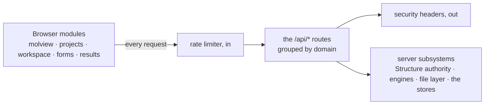

# Web API — the server routes the browser calls

**Role:** contract
**Domain:** web
**Companions:** the module docs own their own routes' consumer-side detail —
[`molview.md`](?doc=web/molview.md) (`/api/build/load`, `/api/modify/*`),
[`projects.md`](?doc=web/projects.md) (`/api/files/*`),
[`workspace.md`](?doc=web/workspace.md) (`/api/state-timeline/*`),
[`form-schema.md`](?doc=web/form-schema.md) (`/api/build/schema/*`). This doc is
the **shared contract** those routes obey and the one **complete catalogue**.

The molbuilder web app is a single server process that serves the tab pages and
a set of `/api/*` JSON routes the browser modules call. This doc has three
jobs: the **conventions** every route obeys (§ 1–2), the **complete route
catalogue** (§ 3, cross-linking each route's owner doc), and the **full request
/ response shapes** for the routes that have no module-doc home (§ 4). It closes
with a worked round-trip (§ 5) and a list of removed routes (§ 6).

## 1. The response envelope

Every JSON route returns a top-level `ok`:

- **Success** — `{ "ok": true, …payload }`, HTTP 200.
- **Failure** — `{ "ok": false, "error": "<a human message>" }`, a non-200 status.

There is exactly one error builder and one structure-success builder, both in
`blueprints/_shared.py`:

- `err(msg, code=400)` → `{ "ok": false, "error": msg }` at the given status.
- `ok_structure_response(struct, extra)` → the success envelope for any route
  that returns a molecule (`/api/build/load`, `/api/build/molecule`, all
  `/api/modify/*`).

**The canonical structure shape.** A molecule crosses the wire in one shape,
built by `workspace_payload()` (the single serializer):

```json
{ "text": "<xyz/pdb bytes>", "source_format": "xyz",
  "title": "…", "n_atoms": 42,
  "atoms": [ { "…per-atom row…" } ],
  "lattice": null,
  "periodicity": { "…cell / origin / axis_kind / vacuum…" },
  "annotations": { "…regions / frozen / channels…" },
  "issues": [ "…" ],
  "extra": { "…endpoint add-ons…" } }
```

Two notes that matter for a reader of the code: `lattice` is now **always
`null`** (the geometry moved into `periodicity`), and `structure_to_dict` also
mirrors several **legacy aliases** at the root — `xyz` (= `text`), `elements`,
`atom_names`, `residue_ids`, `residue_names`, `chain_ids`, `n_residues` — that
the Modify tab's older `applyStructure(r)` reads. The inverse, rebuilding a
`Structure` from a request body, is `struct_from_body()`; metadata arrays are
honored only when their length matches the atom count.

### The client mirror

The browser never wraps these calls in `try/catch`. `projects/api.js`'s
`_fetchEnvelope` **normalizes every failure into `{ ok: false, error }`** —
a dropped network, an abort (`{ ok:false, error:"aborted", aborted:true }`), or a
non-JSON 5xx/HTML error page (`{ ok:false, error:"server returned non-JSON…" }`)
all come back in the same shape. GETs default to `cache: "no-store"`. So both
ends of every call speak the one envelope.

### Status codes

| Status | Meaning |
|---|---|
| 400 | bad body / validation / parse failure (the default of `err()`) |
| 403 | forbidden — a path escaping the allowed roots, or an admin-gate reject |
| 404 | no such file / directory / route |
| 409 | conflict — a rename/move/copy/mkdir/write whose destination exists |
| 413 | payload too large — over the 50 MB global upload cap |
| 422 | unprocessable (spectra) |
| 500 | internal / I/O / parse fault |
| 501 | a stubbed endpoint |

### The non-JSON routes

Most routes speak the envelope, but a few do not — call these out so nothing
assumes `{ ok, … }`: the **tab pages** (`/`, `/molbuilder`, …), the HTML
**`/partials/*`** fragments, **`/api/files/download`** (a raw byte stream), and
**`/vendor/plotly.min.js`**.

## 2. Security posture

Set on every response by an `after_request` hook (`app.py`):

- **Content-Security-Policy** — `default-src 'self'; script-src 'self';
  style-src 'self' 'unsafe-inline'; img-src 'self' data:; connect-src 'self';
  font-src 'self'; object-src 'none'; frame-ancestors 'none'; base-uri 'self';
  form-action 'self'`. There is **no `script-src 'unsafe-inline'`** — no inline JavaScript
  anywhere (a hard rule the whole frontend obeys). Inline `style=` is allowed
  (3Dmol and some inspectors need it); `img-src data:` is for Plotly.
- `X-Content-Type-Options: nosniff`, `X-Frame-Options: DENY`,
  `Referrer-Policy: same-origin`, and — over HTTPS only —
  `Strict-Transport-Security`.
- **CSRF** — there is no token layer. The defense is `connect-src 'self'` (the
  CSP blocks cross-origin fetches) plus `SameSite=Lax` session cookies on
  auth-enabled deployments. No CORS headers are sent (same-origin only). The
  single-user localhost default runs auth-free.
- **Rate limiting is always on** (`rate_limit.py`, a per-IP `before_request`
  check). By default it blocks on a **404 storm** (≥ 20 4xx in 30 s → a 1-hour
  cooldown) and on **attack-string signatures** — XSS / SQLi / path-traversal
  fingerprints in the URL, like `<script`, `union select`, or `/etc/passwd`; the
  total-request cap is **off by default** (`threshold_total = 0`) unless an
  operator sets it. `127.0.0.1`/`::1` are allowlisted; a blocked IP gets an
  empty **429**. The threat model and the two `/api/admin/rate_limit/*` routes
  live in the ops-wave rate-limit doc.
- The global upload cap is **50 MB** (`MAX_CONTENT_LENGTH`).

## 3. The route catalogue

Every route, grouped by domain. Routes with a module-doc home link to it; the
rest are documented in full in § 4.

**Structure + edits** — return the canonical structure envelope (§ 1);
owned by [`molview.md`](?doc=web/molview.md):

| Method · Path | Purpose |
|---|---|
| POST `/api/build/load` | Load a structure (path / upload / raw text) |
| POST `/api/build/molecule` | Build a molecule from a backend |
| GET `/api/modify/meta` | Element/tool metadata for the Modify UI |
| POST `/api/modify/{delete,add_atom,orient,rotate,translate,calibrate,electrode,symmetric_electrodes}` | The eight structure edits |
| POST `/api/selection/atoms` | Per-atom payload for a structure |
| POST `/api/selection/eval` | Evaluate a selection expression |

**Files + projects** — owned by [`projects.md`](?doc=web/projects.md):

| Method · Path | Purpose |
|---|---|
| GET `/api/files/{roots,list,stat,read,read_range}` | Browse + read |
| GET `/api/files/download` | Raw byte download (non-JSON) |
| POST `/api/files/{mkdir,upload,write,rename,move,copy}` · DELETE `/api/files/delete` | Mutations |
| POST `/api/projects/create` | Create a project (the topic tree) |
| POST `/api/structure/save` | Save a structure + its sidecar to a path |

**Session timeline** — owned by [`workspace.md`](?doc=web/workspace.md):
POST `/api/state-timeline/{write,read,prune}`.

**Config forms** — owned by [`form-schema.md`](?doc=web/form-schema.md):
GET `/api/build/schema/<engine>`, GET `/api/build/schema/spectra`,
GET `/api/transport/schema`.

**Results + trajectory + spectra + transport** — the Results/Spectra/Transport
tabs (their docs, this wave):

| Method · Path | Purpose |
|---|---|
| POST `/api/watch/load` · GET `/api/watch/data` | Register + poll a trajectory |
| GET `/partials/{trajectory-inspector,spectra-inspector,selection-panel}` | HTML fragments |
| POST `/api/results/bundle` | Build a results bundle |
| POST `/api/spectra/{render,load}` | Spectrum plot data |
| POST `/api/transport/render` | Generate transport script/data |

**No module-doc home — documented in full in § 4:** the app-level routes
(`/api/health`, `/api/backends`, the tab pages), the build env/script routes
(`/api/build/{fdf,pyscf,preflight}`, `/api/structure/{analyze,resolve-cell}`,
`/api/run/install-wrapper`, `/api/siesta/install-pseudos`), `/api/checkpoint/*`,
`/api/system/load`, `/api/docs/*`, `/api/admin/rate_limit/*`, and the optional
auth routes.

## 4. Full reference — the un-owned routes

**App-level** — `GET /` (redirect to the landing tab); `GET /molbuilder`,
`/structure-optimization`, `/transport-calculation`, `/documents`,
`/molview-demo` (tab pages); `GET /api/health` → `{ ok, version }`;
`GET /api/backends` → `{ ok, available, auto_name }`;
`GET /vendor/plotly.min.js` (the Plotly bundle, 404 if absent).

**Build — generate + validate** (all take a structure + config, return
`{ ok, … }`):

| Method · Path | Body → response |
|---|---|
| POST `/api/build/fdf` | `{ structure, config }` → the generated SIESTA `.fdf` text |
| POST `/api/build/pyscf` | `{ structure, config }` → the generated PySCF `.py` text |
| POST `/api/build/preflight` | `{ structure, config, engine }` → the pre-run validation report (pseudos + config gates) |
| POST `/api/structure/analyze` | `{ structure }` → the geometry/chemistry report + summary |
| POST `/api/structure/resolve-cell` | `{ structure, … }` → the resolved periodic cell |
| POST `/api/run/install-wrapper` | install the run-wrapper script into a run dir |
| POST `/api/siesta/install-pseudos` | install SIESTA pseudopotentials |

**Checkpoint** — the run-history panel (its behavior is the run-checkpoints
doc; the routes are `GET /api/checkpoint/{state,list,diff,config}` and
`POST /api/checkpoint/{init,config,commit,tag,restore,migrate-manifest}`).

**System** — `GET /api/system/load` → `{ ok, data: { cpu, ram, gpu, … } }`, the
1 Hz load strip's source.

**Docs** — `GET /api/docs/list` (the docs tree) and `GET /api/docs/read` (one
markdown doc) — what the Documents tab reads.

**Admin** (rate-limit; admin-gated) — `GET /api/admin/rate_limit/status` (the
blocked-IP list) and `POST /api/admin/rate_limit/clear` (unblock an IP, or
`{ "all": true }` to wipe).

**Auth** (only when an `auth` config is present) — `GET /login`,
`/login/<provider>`, `/oauth-callback/<provider>`, `/cas-callback/<provider>`,
`/logout`. Deployment concern; see the auth/deployment doc.

## 5. How it fits together — and one round-trip



A concrete round-trip — loading a structure by project path:

```
POST /api/build/load      Content-Type: application/json
{ "path": "MyProject/optimization/final.xyz" }
```

The server resolves the path *inside* the allowed roots, reads the `.xyz` and
its paired `.molstruct.json` through `StructureCodec.read` (the one authority),
and returns the canonical envelope:

```json
{ "ok": true, "text": "<xyz bytes>", "source_format": "xyz",
  "title": "final.xyz", "n_atoms": 42, "atoms": [ … ], "lattice": null,
  "periodicity": { … }, "annotations": { … }, "issues": [ … ],
  "xyz": "<xyz bytes>", "elements": [ … ], "n_residues": 1, "extra": { … } }
```

Failures come back in the envelope: a path escaping the roots → 403/404, a
missing file → 404 `no such file: <path>`, a parse/sidecar fault → 400. (The
same route also accepts a multipart `file=` upload or a raw
`{ text, format, filename?, sidecar? }` body.)

## 6. Removed routes

So a reader of older code or bookmarked URLs isn't lost, these routes are
**gone**:

| Old route | What happened |
|---|---|
| `/api/workingcopy/*` | renamed to `/api/state-timeline/*`; the working-copy blueprint and module were deleted |
| `/api/selection/save-sidecar` | removed (no code remains) |
| `/api/selection/refresh-hash` | removed (no code remains) |
| `/api/files/result-list` | retired 2026-06-01 with its single consumer |
