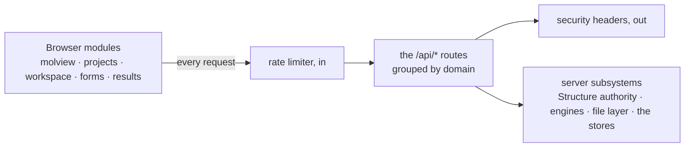

# Web API — the server routes the browser calls

**Role:** contract
**Domain:** web
**Companions:** the module docs own their own routes' consumer-side detail —
[`molview.md`](?doc=web/molview.md) (`/api/build/load`, `/api/modify/*`),
[`projects.md`](?doc=web/projects.md) (`/api/files/*`),
[`workspace.md`](?doc=web/workspace.md) (`/api/state-timeline/*`),
[`form-schema.md`](?doc=web/form-schema.md) (`/api/build/schema/*`). This doc is
the **shared contract** those routes obey and the one **complete catalogue**.

The molbuilder web app is a single server process that serves the tab pages and
a set of `/api/*` JSON routes the browser modules call. This doc has three
jobs: the **conventions** every route obeys (§ 1–2), the **complete route
catalogue** (§ 3, cross-linking each route's owner doc), and the **full request
/ response shapes** for the routes that have no module-doc home (§ 4). It closes
with a worked round-trip (§ 5) and a list of removed routes (§ 6).

## 1. The response envelope

Every JSON route returns a top-level `ok`:

- **Success** — `{ "ok": true, …payload }`, HTTP 200.
- **Failure** — `{ "ok": false, "error": "<a human message>" }`, a non-200 status.

There is exactly one error builder and one structure-success builder, both in
`blueprints/_shared.py`:

- `err(msg, code=400)` → `{ "ok": false, "error": msg }` at the given status.
- `ok_structure_response(struct, extra)` → the success envelope for any route
  that returns a molecule (`/api/build/load`, `/api/build/molecule`, all
  `/api/modify/*`).

**The canonical structure shape.** A molecule crosses the wire in one shape,
built by `workspace_payload()` (the single serializer):

```json
{ "text": "<xyz/pdb bytes>", "source_format": "xyz",
  "title": "…", "n_atoms": 42,
  "atoms": [ { "…per-atom row…" } ],
  "lattice": null,
  "periodicity": { "…cell / origin / axis_kind / vacuum…" },
  "annotations": { "…regions / frozen / channels…" },
  "issues": [ "…" ],
  "extra": { "…endpoint add-ons…" } }
```

Two notes that matter for a reader of the code: `lattice` is now **always
`null`** (the geometry moved into `periodicity`), and `structure_to_dict` also
mirrors several **legacy aliases** at the root — `xyz` (= `text`), `elements`,
`atom_names`, `residue_ids`, `residue_names`, `chain_ids`, `n_residues` — that
the Modify tab's older `applyStructure(r)` reads. The inverse, rebuilding a
`Structure` from a request body, is `struct_from_body()`; metadata arrays are
honored only when their length matches the atom count.

### The request envelope — four shapes today, one by design

The paragraph above is true of **responses**. It is not true of requests: a
structure goes *out* of the browser in four different shapes, one per door
family.

| door | how the structure is sent today |
|---|---|
| `/api/build/load` | `{path}` — a file the server reads — or `{text, filename, format, sidecar}` |
| `/api/modify/*` | `{xyz, atom_names, residue_ids, residue_names, chain_ids, regions, frozen_atoms, periodicity, annotations, title, …the op's own arguments}` — flattened columns |
| `/api/structure/periodicity`, `/api/structure/save` | `{xyz, sidecar}` — a coordinate document plus the sidecar's metadata fields |
| `/api/selection/eval` | `{atoms: [{element, labels, residueName}], rule}` — a cut-down atom list |

Two things follow, and both have cost real defects:

- **A caller must know four shapes** to use four doors, and nothing makes them
  agree. A field added to one is absent from the others until somebody notices.
- **Two of the four require the caller to write a coordinate document.** The
  browser holds coordinates as numbers, so it serialises them to text, the server
  parses that straight back into numbers, and numbers come back. That round trip
  is the only reason a `.xyz` writer exists in the browser at all — and the
  browser's writer has already drifted from `Structure.to_xyz` (no title line, raw
  precision where Python writes six decimals), so the same structure saved from
  two halves of the application produces two different files.

> **The rule.** **A structure crosses in one envelope, in both directions, at every
> door — and the server is the only thing that turns it into a file.** The browser
> sends what it holds; it never sends a document it wrote.

**The envelope is the structure's own canonical dict** — `Structure.to_dict()`,
whose inverse is `Structure.from_dict()`:

```json
{
  "structure": {
    "title": "",
    "elements":  ["C", "O"],
    "positions": [[0.0, 0.0, 0.0], [1.4, 0.0, 0.0]],
    "atom_names": [], "residue_ids": [], "residue_names": [], "chain_ids": [],
    "metadata": { "regions": {"L-electrode": [0]}, "frozen_atoms": [1],
                  "cell": null, "cell_origin": null, "pbc": [false,false,false],
                  "axis_kind": ["isolated","isolated","isolated"],
                  "vacuum": [0.0, 0.0, 0.0], "annotations": {} }
  },
  "…": "the call's own arguments — indices, anchors, op, path, …"
}
```

**That it is not a new shape is the whole point.** `to_dict` is the ONE
serialiser the persistence, sidecar and CLI layers already round-trip through,
and its own rule is that **nobody outside the class assembles or picks apart a
structure dict** — every hand-rolled repack is where a field goes missing, which
`cell_origin` has already done. A wire shape invented beside it would need a web-
layer edit every time the structure gains a field, and would silently omit it
until someone noticed.

So a field added to the structure appears on the wire for free, and the
serialiser is the same one the file on disk goes through.

| part | what it is |
|---|---|
| `elements` + `positions` | the atoms as **numbers**, never text |
| the identity columns | per-atom facts a coordinate file cannot hold — full-length or `[]` |
| `metadata` | the block the codec owns: regions, frozen atoms, the periodicity fields, annotation channels |

The **coordinate document** is not here. It is what the **export** door answers
with — that door's whole job — and it is absent everywhere else for a reason that
is easy to get wrong: a caller sends the envelope back, never a document, so
nothing needs the text until somebody asks for a file. Putting it on every
response would pay a full serialisation and a content hash per load and per edit
to carry something no request will ever contain.

`document` is not part of a structure response. It is what the **export** door
answers with — that door's whole job — and it is absent everywhere else for a
reason that is easy to get wrong: a caller sends `geometry` and `metadata` back,
never a document, so nothing needs the text until somebody asks for a file.
Putting it on every response would pay a full serialisation and a content hash
per load and per edit to carry something no request will ever contain.

A request that does contain a `document` is a request from something that wrote a
file it should not have; the reader ignores it.

A **metadata column is sent only when every atom has one**, otherwise `[]` —
never a list with holes. The server takes `[]` as "absent" and applies its own
default; a list containing `null` poisons comparisons like `max(residue_ids)`,
which is a bug this project has already shipped once.

**Responses** are the same envelope plus whatever the call has to say:

```json
{ "ok": true, "structure": { "geometry": …, "metadata": …, "document": … },
  "notices": [ "…heals and warnings…" ] }
```

**What this replaces, door by door.**

| door | request | response |
|---|---|---|
| `load` | `{path}` **or** `{document, filename, format}` for a paste — the only place raw text is legitimate, because a user supplied it | the envelope |
| `modify/<op>` | the envelope + the op's arguments | the envelope |
| `periodicity/<op>` | the envelope + `op`, `payload` | the envelope |
| `save` | the envelope + `path`, `overwrite` | `{ok, path}` |
| `export` | the envelope | the files as bytes, from the one generator the save uses |
| `selection/eval` | the envelope + `rule` | `{selected_indices}` |

### How the two shapes coexist

The envelope is **added, not swapped**, and that has to be mechanical rather than
aspirational or the transition is a second protocol in disguise.

**Which shape a request is.** A body carrying a `structure` key is an envelope; a
body without one is read the old way. That is the whole test — one key, present or
absent.

**If a body carries both**, the envelope wins and the legacy fields are ignored
entirely. Not merged: a caller that sends both is a caller mid-migration, and
merging would let a stale field silently override a fresh one. Nothing is
inferred from the pair.

**Responses always carry both**, for as long as the legacy keys exist. A response
is `structure` **plus** today's `text` / `atoms` / `periodicity` / `annotations`
and the root aliases, derived from the same Structure, so the two can never
disagree — they are two views of one object, not two objects.

**What ends the legacy.** Not a date: the condition is *no reader left*. A key
goes when nothing reads it, which is a question the code can answer — and until
then a browser tab that was loaded before a deploy keeps working, which is the
actual risk this rule exists for.

### What the envelope must be able to carry

A protocol is judged by what it can express without being amended. These are the
cases the current designs need, and the answer for each is part of the contract:

| Case | How the envelope carries it |
|---|---|
| **a new kind of per-atom fact** | added to the **structure**, in the one place its codec lives (`to_dict` + the two metadata methods) — and it is then on the wire, in the sidecar and through every edit, with no door touched. What the envelope does *not* do is carry a field the structure does not model: `apply_metadata_dict` reads the set it knows, so an unrecognised key is dropped rather than smuggled through. That is deliberate — a fact worth surviving a round trip is a fact worth the structure knowing about |
| **part of a structure** — a partial translate or rotate, where the edit routes act on the whole structure they are given | an envelope may describe a **subset**, with `source_index` giving each atom's number in the structure it came from. The receiver answers about the subset; the caller maps the coordinates back. Without this the caller sends a bare document and re-checks element-by-element that nothing was reordered, which is what the previous implementation had to do |
| **one frame, or many** | `positions` is **one frame** — the one the user is looking at (§ 5.1). A trajectory is not a wire concern: its frames come from a run file the tab owns, and what leaves a viewer is the frame that was chosen. A door that ever needs many is a new door, not a wider envelope |
| **where a structure lives** | **not in the envelope.** A path is an argument to the call — `save` takes one, `load` takes one — because the envelope describes a *structure*, never a location. A structure that carries its own path is one that can be saved to the wrong place by being copied |
| **what the server wants to say** | `notices` beside `ok` — the heals and warnings a door produces (a cell corrected to contain its atoms, a vacuum too thin). They belong to the *call*, not to the structure, so they never ride inside it |

**The envelope is not versioned, and that is a decision.** The sidecar on disk
carries `schema_version` because a file outlives the program that wrote it. The
wire does not: client and server ship together, and the one case where they differ
— a tab loaded before a deploy — is exactly what "added, not swapped" already
covers, because the old shape keeps working. A version number would give a false
sense that mismatches are handled when the additive rule is what actually handles
them.

> **Status: agreed, not implemented.** This is the protocol the front end and the
> back end are being brought to; today's four shapes are what ships. The
> conversion is tracked in
> [`molview-corrections-plan.md`](?doc=web/molview-corrections-plan.md).

### The client mirror

The browser never wraps these calls in `try/catch`. `projects/api.js`'s
`_fetchEnvelope` **normalizes every failure into `{ ok: false, error }`** —
a dropped network, an abort (`{ ok:false, error:"aborted", aborted:true }`), or a
non-JSON 5xx/HTML error page (`{ ok:false, error:"server returned non-JSON…" }`)
all come back in the same shape. GETs default to `cache: "no-store"`. So both
ends of every call speak the one envelope.

### Status codes

| Status | Meaning |
|---|---|
| 400 | bad body / validation / parse failure (the default of `err()`) |
| 403 | forbidden — a path escaping the allowed roots, or an admin-gate reject |
| 404 | no such file / directory / route |
| 409 | conflict — a rename/move/copy/mkdir/write whose destination exists |
| 413 | payload too large — over the 50 MB global upload cap |
| 422 | unprocessable (spectra) |
| 500 | internal / I/O / parse fault |
| 501 | a stubbed endpoint |

### The non-JSON routes

Most routes speak the envelope, but a few do not — call these out so nothing
assumes `{ ok, … }`: the **tab pages** (`/`, `/molbuilder`, …), the HTML
**`/partials/*`** fragments, **`/api/files/download`** (a raw byte stream), and
**`/vendor/plotly.min.js`**.

## 2. Security posture

Set on every response by an `after_request` hook (`app.py`):

- **Content-Security-Policy** — `default-src 'self'; script-src 'self';
  style-src 'self' 'unsafe-inline'; img-src 'self' data:; connect-src 'self';
  font-src 'self'; object-src 'none'; frame-ancestors 'none'; base-uri 'self';
  form-action 'self'`. There is **no `script-src 'unsafe-inline'`** — no inline JavaScript
  anywhere (a hard rule the whole frontend obeys). Inline `style=` is allowed
  (3Dmol and some inspectors need it); `img-src data:` is for Plotly.
- `X-Content-Type-Options: nosniff`, `X-Frame-Options: DENY`,
  `Referrer-Policy: same-origin`, and — over HTTPS only —
  `Strict-Transport-Security`.
- **CSRF** — there is no token layer. The defense is `connect-src 'self'` (the
  CSP blocks cross-origin fetches) plus `SameSite=Lax` session cookies on
  auth-enabled deployments. No CORS headers are sent (same-origin only). The
  single-user localhost default runs auth-free.
- **Rate limiting is always on** (`rate_limit.py`, a per-IP `before_request`
  check). By default it blocks on a **404 storm** (≥ 20 4xx in 30 s → a 1-hour
  cooldown) and on **attack-string signatures** — XSS / SQLi / path-traversal
  fingerprints in the URL, like `<script`, `union select`, or `/etc/passwd`; the
  total-request cap is **off by default** (`threshold_total = 0`) unless an
  operator sets it. `127.0.0.1`/`::1` are allowlisted; a blocked IP gets an
  empty **429**. The full threat model and the two `/api/admin/rate_limit/*` routes
  live in [`ops/deployment.md § 4`](?doc=ops/deployment.md).
- The global upload cap is **50 MB** (`MAX_CONTENT_LENGTH`).

## 2. Endpoint index — all 78 routes

The application currently has 78 non-static Flask routes. Section 3 groups the
full catalogue by owner and purpose; update this count whenever a route is added
or removed. (The count — pinned by `test_http_status_contract.py` — is taken
with the rate limiter disabled, the test-config default; a production config
with rate limiting on registers a few additional admin/auth routes.)

## 3. The route catalogue

Every route, grouped by domain. Routes with a module-doc home link to it; the
rest are documented in full in § 4.

**Structure + edits** — return the canonical structure envelope (§ 1);
owned by [`molview.md`](?doc=web/molview.md):

| Method · Path | Purpose |
|---|---|
| POST `/api/build/load` | Load a structure (path / upload / raw text) |
| POST `/api/build/molecule` | Build a molecule from a backend |
| GET `/api/modify/meta` | Element/tool metadata for the Modify UI |
| POST `/api/modify/{delete,add_atom,orient,rotate,translate,calibrate,electrode,symmetric_electrodes}` | The eight structure edits |
| POST `/api/selection/atoms` | Per-atom payload for a structure |
| POST `/api/selection/eval` | Evaluate a selection expression |

**Files + projects** — owned by [`projects.md`](?doc=web/projects.md):

| Method · Path | Purpose |
|---|---|
| GET `/api/files/{roots,list,stat,read,read_range}` | Browse + read |
| GET `/api/files/download` | Raw byte download (non-JSON) |
| POST `/api/files/{mkdir,upload,write,rename,move,copy}` · DELETE `/api/files/delete` | Mutations |
| POST `/api/projects/create` | Create a project (the topic tree) |
| POST `/api/structure/save` | Save a structure + its sidecar to a path |

**Session timeline** — owned by [`workspace.md`](?doc=web/workspace.md):
POST `/api/state-timeline/{write,read,prune}`.

**Config forms** — owned by [`form-schema.md`](?doc=web/form-schema.md):
GET `/api/build/schema/<engine>`, GET `/api/build/schema/spectra`,
GET `/api/transport/schema`.

**Results + trajectory + spectra + transport** — the Results/Spectra/Transport
tabs (their docs, this wave):

| Method · Path | Purpose |
|---|---|
| POST `/api/watch/load` · GET `/api/watch/data` | Register + poll a trajectory |
| GET `/partials/{trajectory-inspector,spectra-inspector,selection-panel}` | HTML fragments |
| POST `/api/results/bundle` | Build a results bundle |
| POST `/api/spectra/{render,load}` | Spectrum plot data |
| POST `/api/transport/render` | Generate transport script/data |

**No module-doc home — documented in full in § 4:** the app-level routes
(`/api/health`, `/api/backends`, the tab pages), the build env/script routes
(`/api/build/{fdf,pyscf,preflight}`, `/api/structure/{analyze,periodicity}`,
`/api/run/install-wrapper`, `/api/siesta/install-pseudos`), `/api/checkpoint/*`,
`/api/system/load`, `/api/docs/*`, `/api/admin/rate_limit/*`, and the optional
auth routes.

## 4. Full reference — the un-owned routes

**App-level** — `GET /` (redirect to the landing tab); `GET /molbuilder`,
`/structure-optimization`, `/transport-calculation`, `/documents`,
`/molview-demo` (tab pages); `GET /api/health` → `{ ok, version }`;
`GET /api/backends` → `{ ok, available, auto_name }`;
`GET /vendor/plotly.min.js` (the Plotly bundle, 404 if absent).

**Build — generate + validate** (all take a structure + config, return
`{ ok, … }`):

| Method · Path | Body → response |
|---|---|
| POST `/api/build/fdf` | `{ structure, config }` → the generated SIESTA `.fdf` text |
| POST `/api/build/pyscf` | `{ structure, config }` → the generated PySCF `.py` text |
| POST `/api/build/preflight` | `{ structure, config, engine }` → the pre-run validation report (pseudos + config gates) |
| POST `/api/structure/analyze` | `{ structure }` → the geometry/chemistry report + summary |
| POST `/api/structure/periodicity` | the unified periodicity door (`?doc=model/structure-periodicity.md` § 6.2): one op per Cell-page edit (vacuum / axis_kind / cell / cell_origin / calibrate) through the frame-contract gate — returns the corrected truth blob + resolved views + heal notices |
| POST `/api/run/install-wrapper` | install the run-wrapper script into a run dir (optional `continue_retries` 1–5 bakes the SIESTA warm-retry budget — `?doc=execution/running-a-job.md` § 3.5) |
| POST `/api/siesta/install-pseudos` | install SIESTA pseudopotentials |

**Checkpoint** — the run-history panel (its behavior is the run-checkpoints
doc; the routes are `GET /api/checkpoint/{state,list,diff,config}` and
`POST /api/checkpoint/{init,config,commit,tag,restore,migrate-manifest}`).

**System** — `GET /api/system/load` → `{ ok, data: { cpu, ram, gpu, … } }`, the
1 Hz load strip's source.

**Docs** — `GET /api/docs/list` (the flat docs listing), `GET /api/docs/read`
(one markdown doc; also serves the whitelisted root `../README.md` /
`../LICENSE`), `GET /api/docs/toc` (the sidebar tree from `docs/toc.json`;
auto-discovers new domain docs and best-effort persists the repaired tree —
read-only installs are served from memory), and `GET /api/docs/img/<path>`
(images only, contained to `docs/img/`) — what the Documents tab reads.

**Admin** (rate-limit; admin-gated) — `GET /api/admin/rate_limit/status` (the
blocked-IP list) and `POST /api/admin/rate_limit/clear` (unblock an IP, or
`{ "all": true }` to wipe).

**Auth** (only when an `auth` config is present) — `GET /login`,
`/login/<provider>`, `/oauth-callback/<provider>`, `/cas-callback/<provider>`,
`/logout`. Deployment concern; see the auth/deployment doc.

## 5. How it fits together — and one round-trip



A concrete round-trip — loading a structure by project path:

```
POST /api/build/load      Content-Type: application/json
{ "path": "MyProject/optimization/final.xyz" }
```

The server resolves the path *inside* the allowed roots, reads the `.xyz` and
its paired `.molstruct.json` through `StructureCodec.read` (the one authority),
and returns the canonical envelope:

```json
{ "ok": true, "text": "<xyz bytes>", "source_format": "xyz",
  "title": "final.xyz", "n_atoms": 42, "atoms": [ … ], "lattice": null,
  "periodicity": { … }, "annotations": { … }, "issues": [ … ],
  "xyz": "<xyz bytes>", "elements": [ … ], "n_residues": 1, "extra": { … } }
```

Failures come back in the envelope: a path escaping the roots → 403/404, a
missing file → 404 `no such file: <path>`, a parse/sidecar fault → 400. (The
same route also accepts a multipart `file=` upload or a raw
`{ text, format, filename?, sidecar? }` body.)

## 6. Removed routes

So a reader of older code or bookmarked URLs isn't lost, these routes are
**gone**:

| Old route | What happened |
|---|---|
| `/api/workingcopy/*` | renamed to `/api/state-timeline/*`; the working-copy blueprint and module were deleted |
| `/api/selection/save-sidecar` | removed (no code remains) |
| `/api/selection/refresh-hash` | removed (no code remains) |
| `/api/files/result-list` | retired 2026-06-01 with its single consumer |
