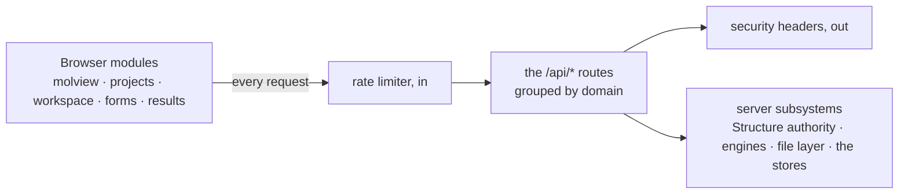

# Web API — the server routes the browser calls

**Role:** contract
**Domain:** web
**Companions:** the module docs own their own routes' consumer-side detail —
[`molview.md`](?doc=web/molview.md) (`/api/build/load`, `/api/modify/*`),
[`projects.md`](?doc=web/projects.md) (`/api/files/*`),
[`workspace.md`](?doc=web/workspace.md) (`/api/workspace-storage/*`),
[`form-schema.md`](?doc=web/form-schema.md) (`/api/build/schema/*`). This doc is
the **shared contract** those routes obey and the one **complete catalogue**.

The molbuilder web app is a single server process that serves the tab pages and
a set of `/api/*` JSON routes the browser modules call. This doc has three
jobs: the **conventions** every route obeys (§ 1) and the **security posture**
they are served under (§ 2), the **complete route catalogue** (§ 3–4,
cross-linking each route's owner doc), and the **full request / response shapes**
for the routes that have no module-doc home (§ 5). It closes with a worked
round-trip (§ 6) and a list of removed routes (§ 7).

## 1. The response envelope

Every JSON route returns a top-level `ok`:

- **Success** — `{ "ok": true, …payload }`, HTTP 200.
- **Failure** — `{ "ok": false, "error": "<a human message>" }`, a non-200 status.

There is exactly one error builder and one structure-success builder, both in
`blueprints/_shared.py`:

- `err(msg, code=400)` → `{ "ok": false, "error": msg }` at the given status.
- `ok_structure_response(struct, extra)` → the success envelope for any route
  that returns a molecule (`/api/build/load`, `/api/build/molecule`, all
  `/api/modify/*`). **It validates what it is about to send** — being the only
  way out, it is the one place that can be done once, and what the check finds
  arrives in `notices` (`?doc=model/structure-periodicity.md` § 8.1 seam 2).

**The canonical structure shape.** A molecule crosses the wire in one shape,
built by `workspace_payload()` (the single serializer):

```json
{ "text": "<xyz/pdb bytes>", "source_format": "xyz",
  "title": "…", "n_atoms": 42,
  "atoms": [ { "…per-atom row…" } ],
  "lattice": null,
  "periodicity": { "…cell / origin / axis_kind / vacuum…" },
  "annotations": { "…regions / frozen / channels…" },
  "issues": [ "…" ],
  "notices": [ { "level": "info|warn", "message": "…", "about": "cell" } ],
  "extra": { "…endpoint add-ons…" } }
```

`notices` and `issues` are different channels and do not overlap. An **issue**
is a validation finding about a calculation you are about to run — it is what
the Generate panel lists, and it carries a `where` naming the field to fix. A
**notice** is what the periodicity gate says about the box on the structure in
this answer; it is absent when there is nothing to say.

**A notice says what it is ABOUT**, and that is what decides where it is shown:
`about: "cell"` puts it beside the cell rows, on the page whose controls can
change what it complains about; anything else goes above the tabs, visible on
either page (`?doc=web/molview.md` § 6.8). The subject is the notice's own, not
the door's — the same sentence about the same box belongs in the same place
whether it arrived with a file load or with an edit.

**Whether a bad box REFUSES or merely reports depends on what the request is
for**, and that rule lives in one place:
`?doc=model/structure-periodicity.md` § 8.2. Short version: a door that emits
something you would run refuses (400); a door that loads or modifies reports and
carries on, so the user can see the problem and fix it.

Two notes that matter for a reader of the code: `lattice` is now **always
`null`** (the geometry moved into `periodicity`), and `structure_to_dict` also
mirrors several **legacy aliases** at the root — `xyz` (= `text`), `elements`,
`atom_names`, `residue_ids`, `residue_names`, `chain_ids`, `n_residues` — that
the Modify tab's older `applyStructure(r)` reads. The inverse, rebuilding a
`Structure` from a request body, is `struct_from_body()`; metadata arrays are
honored only when their length matches the atom count.

### The request envelope — one shape at every door that carries a structure

**Every door that takes a structure now takes the envelope**, and the browser
writes no coordinate document to reach any of them (`molview.md` § 11.7). Two
doors deliberately take something else, and neither is carrying a structure the
caller holds.

| door | how the structure is sent |
|---|---|
| `/api/modify/*` | `{structure: <envelope>, …the op's own arguments, and the selection under its own key}` |
| `/api/structure/periodicity` | `{structure: <envelope>, op, payload}` |
| `/api/structure/save` | `{structure: <envelope>, path, overwrite, frames?}` |
| `/api/structure/export` | `{structure: <envelope>, name?, frames?}` |
| ~~`/api/build/fdf`~~ · ~~`/api/build/pyscf`~~ · `/api/build/preflight` | `{structure: <envelope>, params, structure_path?}` — the **emit** doors. `structure_path` is provenance and a dest-dir anchor, never a source of geometry or labels |
| `/api/transport/render` | `{structure: <envelope>, params, structure_path?}` — the region-labeled device. Took the path as its GEOMETRY with the labels beside it until 2026-08-03; it was the last door on that shape |
| `/api/build/load` | `{path}` — a file the server reads — or `{text, filename, format?, sidecar?, atom_metadata?, periodicity?, info?}`. **Not the envelope, and right not to be:** nothing is being sent back, a file or a paste is being *parsed*, and raw text is what a user supplied. The optional blocks beside the text are **what the caller already knew about these atoms** and the text has no room for — the labels, the cell, and the free `info` store (`?doc=web/molview.md` § 8.4a). A `path` load reads all three off disk and a `{structure}` restore carries them in its envelope; the text branch is the one shape with no document behind it, so a host that knows them states them. `info` must be an object of key → value: a non-object is a 400, never a silent drop. It ALSO takes `{structure: <envelope>}` on one branch: a tab **putting back** the structure it was showing before the page was left, which is not a parse — `exportFile`'s exact inverse, through the one entrance so the same checks run |
| `/api/selection/eval` | `{atoms: [{element, labels, residueName}], rule}`. **Not the envelope:** no rule matches on position (`molview.md` § 9.5), so no coordinates are sent — the cut-down list is the whole of what a filter needs |

> **The old shapes are gone, not deprecated.** `/api/structure/periodicity` used
> to take `{data: {xyz, sidecar}}`; it now answers 400 to that, which is how the
> defect was found — the one caller that exists could not produce a coordinate
> document, so the door had never once opened. `/api/modify/*` still accepts its
> old flattened `{xyz, atom_names, …}` columns for callers that have not moved;
> a body carrying both keys takes the envelope and ignores the rest, never merges
> (`_shared.py::struct_from_body`).

Both of the defects that drove this are worth keeping, because each was silent:

- **A caller had to know four shapes** to use four doors, and nothing made them
  agree. A field added to one was absent from the others until somebody noticed.
- **Two of the four required the caller to write a coordinate document.** The
  browser holds coordinates as numbers, so it serialised them to text, the server
  parsed that straight back into numbers, and numbers came back. That round trip
  was the only reason a `.xyz` writer existed in the browser at all — and that
  writer had drifted from `Structure.to_xyz` (no title line, raw precision where
  Python writes six decimals), so the same structure saved from two halves of the
  application produced two different files. The writer is gone.

> **The rule.** **A structure crosses in one envelope, in both directions, at every
> door — and the server is the only thing that turns it into a file.** The browser
> sends what it holds; it never sends a document it wrote.

**The envelope is the structure's own canonical dict** — `Structure.to_dict()`,
whose inverse is `Structure.from_dict()`:

```json
{
  "structure": {
    "title": "",
    "elements":  ["C", "O"],
    "positions": [[0.0, 0.0, 0.0], [1.4, 0.0, 0.0]],
    "atom_names": [], "residue_ids": [], "residue_names": [], "chain_ids": [],
    "metadata": { "regions": {"L-electrode": [0], "frozen_atoms": [1]},
                  "cell": null, "cell_origin": null, "pbc": [false,false,false],
                  "axis_kind": ["isolated","isolated","isolated"],
                  "vacuum": [0.0, 0.0, 0.0], "annotations": {} }
  },
  "…": "the call's own arguments — indices, anchors, op, path, …"
}
```

**That it is not a new shape is the whole point.** `to_dict` is the ONE
serialiser the persistence, sidecar and CLI layers already round-trip through,
and its own rule is that **nobody outside the class assembles or picks apart a
structure dict** — every hand-rolled repack is where a field goes missing, which
`cell_origin` has already done. A wire shape invented beside it would need a web-
layer edit every time the structure gains a field, and would silently omit it
until someone noticed.

So a field added to the structure appears on the wire for free, and the
serialiser is the same one the file on disk goes through.

| part | what it is |
|---|---|
| `elements` + `positions` | the atoms as **numbers**, never text |
| the identity columns | per-atom facts a coordinate file cannot hold — full-length or `[]` |
| `metadata` | the block the codec owns: regions, frozen atoms, the periodicity fields, annotation channels |

`document` is not part of a structure response. It is what the **export** door
answers with — that door's whole job — and it is absent everywhere else for a
reason that is easy to get wrong: a caller sends `geometry` and `metadata` back,
never a document, so nothing needs the text until somebody asks for a file.
Putting it on every response would pay a full serialisation and a content hash
per load and per edit to carry something no request will ever contain.

A request that does contain a `document` is a request from something that wrote a
file it should not have; the reader ignores it.

A **metadata column is sent only when every atom has one**, otherwise `[]` —
never a list with holes. The server takes `[]` as "absent" and applies its own
default; a list containing `null` poisons comparisons like `max(residue_ids)`,
which is a bug this project has already shipped once.

**Responses** are the same envelope plus whatever the call has to say:

```json
{ "ok": true, "structure": { "geometry": …, "metadata": …, "document": … },
  "notices": [ { "level": "info|warn", "message": "…", "about": "cell" } ] }
```

**What this replaces, door by door.**

| door | request | response |
|---|---|---|
| `load` | `{path}` **or** `{document, filename, format}` for a paste — the only place raw text is legitimate, because a user supplied it | the envelope |
| `modify/<op>` | the envelope + the op's arguments | the envelope |
| `periodicity/<op>` | the envelope + `op`, `payload` | the envelope |
| `save` | the envelope + `path`, `overwrite`, `frames?` | `{ok, path}` |
| `export` | the envelope + `name?` (the stem), `frames?` | `{ok, files: [{name, text}], frames, notices}` — the same generator the save uses, **named** |
| `selection/eval` | the envelope + `rule` | `{selected_indices}` |

**The export door answers with named files, and that is not cosmetic.** Each
entry is `{name, text}` — the file as it would exist on disk, under the name it
would exist as. The caller supplies `name` as a **stem** (`wire_frame40-120`,
no extension) because only the caller knows what the export *is*; the server
completes it, because the extension follows from the format and the format
follows from the frame count, which `StructureCodec.pair` already decided.

Both files come back under `.xyz` — extended XYZ is a strict superset of plain
XYZ, so the same extension covers one frame or four hundred, which is the
ordinary convention and what our own load door accepts. A caller that builds the
names itself is keeping a second copy of the pairing rule; the one that did also
re-serialised the sidecar's JSON, a second answer to a question
`molstruct.dumps` owns. Both now come out of the codec together — see
[`molview.md`](?doc=web/molview.md) § 11.7 and
[`model/structure.md`](?doc=model/structure.md) § 2.4.

### How the two shapes coexist

The envelope is **added, not swapped**, and that has to be mechanical rather than
aspirational or the transition is a second protocol in disguise.

**Which shape a request is.** A body carrying a `structure` key is an envelope; a
body without one is read the old way. That is the whole test — one key, present or
absent.

**If a body carries both**, the envelope wins and the legacy fields are ignored
entirely. Not merged: a caller that sends both is a caller mid-migration, and
merging would let a stale field silently override a fresh one. Nothing is
inferred from the pair.

**Responses always carry both**, for as long as the legacy keys exist. A response
is `structure` **plus** today's `text` / `atoms` / `periodicity` / `annotations`
and the root aliases, derived from the same Structure, so the two can never
disagree — they are two views of one object, not two objects.

**What ends the legacy.** Not a date: the condition is *no reader left*. A key
goes when nothing reads it, which is a question the code can answer — and until
then a browser tab that was loaded before a deploy keeps working, which is the
actual risk this rule exists for.

### What the envelope must be able to carry

A protocol is judged by what it can express without being amended. These are the
cases the current designs need, and the answer for each is part of the contract:

| Case | How the envelope carries it |
|---|---|
| **a new kind of per-atom fact** | added to the **structure**, in the one place its codec lives (`to_dict` + the two metadata methods) — and it is then on the wire, in the sidecar and through every edit, with no door touched. What the envelope does *not* do is carry a field the structure does not model: `apply_metadata_dict` checks against `METADATA_FIELDS` and **REFUSES** an unrecognised key, naming it. *(This said "dropped" until 2026-08-04, and the code said refuse — changed for #41, where a key that was dropped rather than refused is how frozen atoms vanished from a real run. A fact worth surviving a round trip is a fact worth the structure knowing about; a fact the structure does not know about is worth saying so about, not swallowing.)* |
| **part of a structure** — a partial translate or rotate, where the edit routes act on the whole structure they are given | an envelope may describe a **subset**, with `source_index` giving each atom's number in the structure it came from. The receiver answers about the subset; the caller maps the coordinates back. Without this the caller sends a bare document and re-checks element-by-element that nothing was reordered, which is what the previous implementation had to do |
| **one frame, or many** | `positions` is **one frame** — the one the user is looking at (§ 6). A trajectory is not a wire concern: its frames come from a run file the tab owns, and what leaves a viewer is the frame that was chosen. A door that ever needs many is a new door, not a wider envelope |
| **where a structure lives** | **not in the envelope.** A path is an argument to the call — `save` takes one, `load` takes one — because the envelope describes a *structure*, never a location. A structure that carries its own path is one that can be saved to the wrong place by being copied |
| **what the server wants to say** | `notices` beside `ok` — `{level, message, where, about}` rows (`where` is the stable finding id; `about` is the subject that decides where it is shown) the door produces about the structure it is answering with: a box that no longer contains its atoms, a corner that had to be worked out because none was stored. Nothing is corrected, so a notice never reports a repair. They belong to the *call*, not to the structure, so they never ride inside it |

### Strict where a file is read, lenient where the wire is

The two are not the same problem, and treating them as one was a real mistake
(made and reverted 2026-08-04).

**A `.molstruct.json` sidecar is a FILE.** It outlives the program that wrote
it, which is why it is versioned — and why `Structure.apply_metadata_dict`,
which reads it, **REFUSES** a key it does not know, naming it. A key it cannot
map is a fact the author believes is stored, and dropping one is how frozen
atoms vanished from a real run (#41).

**The wire is not a file.** Client and server ship together; the envelope is
deliberately unversioned for that reason (below). An unrecognised key on a
request is our own client disagreeing with our own server *in the same build* —
a defect to fix in development, not a condition to turn into a 400 for someone
running a calculation. Readers of wire-only blocks take the names they set and
leave the rest.

**The `periodicity` block is the case that shows why.** `Structure.to_wire`
sends what the caller stated (`cell`, `cell_origin`, `axis_kind`, `vacuum`)
BESIDE the server's own derived answers (`resolved_cell`,
`resolved_cell_origin`, `resolved_vacuum`) so a page can show the box *as it
will be used*. MolView keeps that block verbatim and hands the whole thing back
through the load door. A reader made strict here would refuse the viewer's own
structure — the derived fields are the traffic, not an anomaly.

The same applies to `document` (the export door's answer) and `source_index`
(the caller's own bookkeeping): both named in the envelope reader's `known` set
so they are **ignored on purpose** rather than refused.

**The envelope is not versioned, and that is a decision.** The sidecar on disk
carries `schema_version` because a file outlives the program that wrote it. The
wire does not: client and server ship together, and the one case where they differ
— a tab loaded before a deploy — is exactly what "added, not swapped" already
covers, because the old shape keeps working. A version number would give a false
sense that mismatches are handled when the additive rule is what actually handles
them.

> **Status: shipped at every door that carries a structure** (2026-08-04). This
> read "agreed, not implemented — today's four shapes are what ships" while the
> conversion was under way; leaving it there after the fact is worse than having
> never written it, because a reader checking the contract is told the code has
> not been brought to it yet and goes looking for the old shapes.
>
> `/api/transport/render` was the last door across, and its migration is the
> case the rule is for: it took a file PATH as its geometry with the labels
> beside it, so one request came from two sources read at two moments — and
> being the last caller of that shape was the only reason the server still had a
> second place labels could arrive from, and so a place they could be dropped
> from without a word (#41). The cell had the identical split one day later.
>
> **Neither was fixable by ranking the two sources.** "The envelope stated
> nothing" and "the envelope stated something different" are one input to any
> precedence rule that can be written; an attempt at one silently discarded a
> label set. A structure crosses once, or the question has no correct answer.

### The client mirror

The browser never wraps these calls in `try/catch`. `projects/api.js`'s
`_fetchEnvelope` **normalizes every failure into `{ ok: false, error }`** —
a dropped network, an abort (`{ ok:false, error:"aborted", aborted:true }`), or a
non-JSON 5xx/HTML error page (`{ ok:false, error:"server returned non-JSON…" }`)
all come back in the same shape. GETs default to `cache: "no-store"`. So both
ends of every call speak the one envelope.

### Status codes

| Status | Meaning |
|---|---|
| 400 | bad body / validation / parse failure (the default of `err()`) |
| 403 | forbidden — a path escaping the allowed roots, or an admin-gate reject |
| 404 | no such file / directory / route |
| 409 | conflict — a rename/move/copy/mkdir/write whose destination exists |
| 413 | payload too large — over the 50 MB global upload cap |
| 422 | unprocessable (spectra) |
| 500 | internal / I/O / parse fault |
| 501 | a stubbed endpoint |

### The non-JSON routes

Most routes speak the envelope, but a few do not — call these out so nothing
assumes `{ ok, … }`: the **tab pages** (`/`, `/molbuilder`, …), the HTML
**`/partials/*`** fragments, **`/api/files/download`** (a raw byte stream), and
**`/vendor/plotly.min.js`**.

## 2. Security posture

Set on every response by an `after_request` hook (`app.py`):

- **Content-Security-Policy** — `default-src 'self'; script-src 'self';
  style-src 'self' 'unsafe-inline'; img-src 'self' data:; connect-src 'self';
  font-src 'self'; object-src 'none'; frame-ancestors 'none'; base-uri 'self';
  form-action 'self'`. There is **no `script-src 'unsafe-inline'`** — no inline JavaScript
  anywhere (a hard rule the whole frontend obeys). Inline `style=` is allowed
  (3Dmol and some inspectors need it); `img-src data:` is for Plotly.
- `X-Content-Type-Options: nosniff`, `X-Frame-Options: DENY`,
  `Referrer-Policy: same-origin`, and — over HTTPS only —
  `Strict-Transport-Security`.
- **CSRF** — there is no token layer. The defense is `connect-src 'self'` (the
  CSP blocks cross-origin fetches) plus `SameSite=Lax` session cookies on
  auth-enabled deployments. No CORS headers are sent (same-origin only). The
  single-user localhost default runs auth-free.
- **Rate limiting is always on** (`rate_limit.py`, a per-IP `before_request`
  check). By default it blocks on a **404 storm** (≥ 20 4xx in 30 s → a 1-hour
  cooldown) and on **attack-string signatures** — XSS / SQLi / path-traversal
  fingerprints in the URL, like `<script`, `union select`, or `/etc/passwd`; the
  total-request cap is **off by default** (`threshold_total = 0`) unless an
  operator sets it. `127.0.0.1`/`::1` are allowlisted; a blocked IP gets an
  empty **429**. The full threat model and the two `/api/admin/rate_limit/*` routes
  live in [`ops/deployment.md § 4`](?doc=ops/deployment.md).
- The global upload cap is **50 MB** (`MAX_CONTENT_LENGTH`).

### 2.1 A path from the browser is fenced at the ROUTE — the rule

**Every route that takes a filesystem path from the browser resolves it
through `projects.contain` (in the web layer: `files._resolve_within_roots`,
which adds the several allowed roots and an HTTP-shaped refusal) BEFORE it
calls anything else.** There is one fence and this is it — the same primitive
the `jobset` CLI's `--bundle` uses, so "may this be read" has one answer.

**And the modules it calls stay generic, deliberately.** A parser parses
whatever file it is handed; `molbuilder/checkpoint.py` inspects whatever
directory it is given, exactly as `git status` does — it reads files there to
work out whether it is a directory it can work with at all. That is the right
shape for a module, and it is why the check cannot live inside one: a module
fencing its own inputs would be a second fence with its own idea of the roots,
and the CLI (which legitimately runs outside them) would have to argue with
it. **The boundary is where the untrusted path arrives, and that is the
route.**

Two consequences worth stating, because both were live defects:

- A generic module that does a bare `open()` is **not** the bug — the route
  that handed it an unchecked path is. `/api/spectra/load` passed
  `body["path"]` straight into `parse_spectra_json`, and the parser was doing
  precisely its job.
- The rate limiter's attack-string screen reads the **URL**. A path that
  arrives in a JSON body is not screened by it, so the fence is the only thing
  standing there.

This section exists because the rule was not written down and two blueprints
cited this document for opposite readings of it: `watch.py` for requiring the
fence (its own 2026-06-18 fix, after a logged-in user could POST
`{"path": "/etc/shadow"}` and have the parser read it), `checkpoint.py` for
skipping it. Neither rule was here to cite. **An exception is legitimate, but
it is named here with its reason — not decided per blueprint.**

**Auditing it — the fence is reached under four names**, which is why a grep
for one of them reads as a clean bill of health when it is not:

| entry point | who uses it |
|---|---|
| `files._resolve_within_roots` | `files`, `results`, `watch`, `docs`, `bench`, `spectra`, `checkpoint` |
| `build._resolve_path_within_roots` | `build`, `transport` — a `require="file"/"dir"` wrapper |
| `selection._load_structure` | `selection` — resolves, then loads |
| `checkpoint._resolve_path` | `checkpoint` — resolves, then requires a directory |

And the parameter is not always called `path`: `structure_path`, `run_dir`,
`target_dir`, `dest`, `dir` and `filename` all carry one somewhere. An audit
that greps `get("path")` alone misses three blueprints.

*Current exceptions: none.* Every route that takes a filesystem path from the
browser goes through one of the four above — checked 2026-08-25, which is when
`/api/spectra/load` (1 route) and `/api/checkpoint/*` (6) were brought onto it.

## 3. Endpoint index — all 90 routes

> **Three routes below no longer exist** (found 2026-08-10 while correcting
> an earlier count): `/api/files/result-list`,
> `/api/selection/refresh-hash` and `/api/selection/save-sidecar`. The count
> test compares a NUMBER against Flask's URL map, so it caught that the total
> had drifted but not which rows were stale — and the heading had been wrong
> long enough that the removals are not this session's. Each needs checking for
> *retired* versus *renamed* before its row is deleted, which is task #38's
> sweep, not a silent edit here.

Section 4 groups the full catalogue by owner and purpose; update this count
whenever a route is added or removed. (The count — pinned by `test_http_status_contract.py` — is taken
with the rate limiter disabled, the test-config default; a production config
with rate limiting on registers a few additional admin/auth routes.)

## 4. The route catalogue

Every route, grouped by domain. Routes with a module-doc home link to it; the
rest are documented in full in § 5.

**Run reports** — setting up *where* a calculation's reports go; owned by
[`run-reports.md`](?doc=execution/run-reports.md) § 3.1. **Signed-in only**,
and separate from the listener on purpose: that one is the public *receiving*
end (§ 4 there), this is about *sending* from this machine.

| Method · Path | Purpose |
|---|---|
| GET `/api/notify/destination` | Is one set up, where, and is a key present. **Never the key itself** — a page that can show you a secret can leak one |
| POST `/api/notify/destination` | Write it, `0600`, at `config_dir()/notify` — the path taken from the monitor's own function so the two cannot disagree |
| DELETE `/api/notify/destination` | Remove it. **Absent is off**, and off is a state you can reach without a shell |
| POST `/api/notify/destination/test` | Send one report and say what happened — the only check that exercises the file, the url, the segment, the signature, egress and TLS together |

**Structure + edits** — return the canonical structure envelope (§ 1);
owned by [`molview.md`](?doc=web/molview.md):

| Method · Path | Purpose |
|---|---|
| POST `/api/build/load` | Load a structure (path / upload / raw text) |
| POST `/api/build/molecule` | Build a molecule from a backend |
| GET `/api/modify/meta` | Element/tool metadata for the Modify UI |
| POST `/api/modify/{delete,add_atom,orient,rotate,translate,calibrate,electrode,symmetric_electrodes}` | The eight structure edits |
| POST `/api/selection/atoms` | Per-atom payload for a structure |
| POST `/api/selection/eval` | Evaluate a selection expression |
| POST `/api/structure/periodicity` | The four Cell-page edits, through the frame-contract gate |
| POST `/api/structure/export` | The pair a save would write, **named and returned** instead of written |

**Files + projects** — owned by [`projects.md`](?doc=web/projects.md):

| Method · Path | Purpose |
|---|---|
| GET `/api/files/{roots,list,stat,read,read_range}` | Browse + read |
| GET `/api/files/download` | Raw byte download (non-JSON) |
| POST `/api/files/zip_prepare` · GET `/api/files/download_zip` | Take a folder to another machine without ssh. The POST compresses it and answers `{token, name, files, bytes, skipped, excluded}`; the GET streams that archive by **token** (single-use, non-JSON) and deletes it. Split so the sidebar button can say *Zipping…* and stay unclickable through a build that takes minutes. The archive is the folder **as it stands now**: the three storage subtrees (`.molbuilder_workspace`, `.git`, `.binsnapshots`) never enter it, engine restart files do |
| POST `/api/files/{mkdir,upload,write,rename,move,copy}` · DELETE `/api/files/delete` | Mutations |
| POST `/api/projects/create` | Create a project (the topic tree) |
| POST `/api/structure/save` | Save a structure + its sidecar to a path |
| POST `/api/task-setup/handover` | **Render** the parameter tab's work — returns `<label>.template.toml` and `task.1st.json` as TEXT. Writes nothing: the browser puts them where the user chose, through `projects.safeSave` ([`task-setup.md`](?doc=web/task-setup.md)) |
| POST `/api/task-setup/save` | Validate a description through `task.read_task` and write `task.json`. A **content-aware door**, for the same reason `/api/structure/save` is one: a browser-authored schema-stamped file the loader would reject is the save-then-reload trap. It reports a hand-over rather than deleting it — moving bytes is the file layer's job |
| POST `/api/task-setup/prep` | **Run `prep` for one stage** — the same `prep_calculation` the terminal runs, for the machine named in `target` (a record name, or `this` for the machine the server is on). `plan: true` answers WITHOUT writing: which stage, which machine, the bench axes, and what the description asks the scheduler for — so nothing is prepped unseen, the rule the launch door keeps ([`submission.md`](?doc=execution/submission.md) S4). **Prep, never launch**: prep writes files and may be run again, while launch spends a queue slot and refuses batch submission by design, so only the cheap verb has a door here. Refusals come back as the reader's own words with 400 — a browser that repaired one would be the second, drifting decider. Why a browser may trigger this at all when [`project-layout.md § 2.2`](?doc=execution/project-layout.md) says the deck cannot be finished in the browser: that section constrains whose FACTS the deck is rendered from, and a named record supplies the machine half |
| GET `/api/task-setup/sweepable` | Which parameters a stage may vary — the catalogue's `execution`/`stage` items for one engine, so the tab's columns are **picked from the catalogue** rather than from a list in the browser ([`template.md § 6.2`](?doc=engines/template.md)) |
| GET `/api/task-setup/columns` | Which settings may become a column of the stage table — everything the description is allowed to hold, with the settings the machine answers left out ([`stages.md § 6.2`](?doc=engines/stages.md)). Separate from `sweepable`, which answers what a benchmark may MEASURE: filtering a panel and limiting a table are different questions, and borrowing one answer for the other cost the table `restart` |
| GET `/api/task-setup/resolved` | What a `prep` would resolve for a folder and from which file — the same `config_provenance` block `prep` prints, served rather than restated so the tab and the terminal cannot drift. It carried a `bootstrap_warning` field until 2026-08-25; that rule was retracted ([`§ 3`](?doc=execution/preparing-for-another-machine.md)) and the field is gone |
| POST `/api/task-setup/bench-grid` | The bench grid these axes would produce on this target, cell by cell, with the queues that would take each — the report `_bench_inputs` already computes, served as data. Body `{dest, target?, bench}`; `bench` is the axis map **as it is being edited**, so the card's list tracks typing rather than the last save. 200 with `cells` even when none survive (*nothing here fits* is a result); 400 only for a description that cannot be resolved at all, carrying the reader's own words. **The browser never enumerates the grid** — a second enumerator is the drifting decider [`generator.md § 4.3a`](?doc=execution/generator.md) was rebuilt to remove |
| GET `/api/task-setup/machines` | Which machines a calculation could be prepared FOR — the records `jobset probe --write --name NAME` wrote, plus this machine, each with what it measured. `choice_required` is computed by the same rule the CLI refuses on, so the tab and the terminal cannot disagree about what is ambiguous ([`preparing-for-another-machine.md § 4`](?doc=execution/preparing-for-another-machine.md)) |
| GET `/api/task-setup/presets` | A shipped tier's values for one stage (`coarse` / `medium` / `tight`), so a row can be filled from [`tuning.md § 4`](?doc=engines/tuning.md) instead of typed |
| GET `/api/task-setup/template-values` | The FOLDER's `<label>.template.toml`, parsed by `read_template` — the same reader `prep` opens it with. It is what an empty stage cell shows, so the number on screen is the one the job will run rather than the catalogue's recommendation ([`task-setup.md § 5.1`](?doc=web/task-setup.md)). Server-side because TOML is a format, and [`projects.md § 3`](?doc=web/projects.md) keeps a format's correctness off the browser |

**Session timeline** — owned by [`workspace.md`](?doc=web/workspace.md):
POST `/api/workspace-storage/{write,read,prune}`.

**Config forms** — owned by [`form-schema.md`](?doc=web/form-schema.md):
GET `/api/build/schema/<engine>` (`?calculation=` narrows to a kind;
the spectra tab renders `pyscf?calculation=vibration`),
GET `/api/transport/schema`.  (`/api/build/schema/spectra` and
`/api/spectra/render` retired at the spectra migration's P3.)

**Results + trajectory + spectra + transport** — the Results/Spectra/Transport
tabs (their docs, this wave):

| Method · Path | Purpose |
|---|---|
| POST `/api/watch/load` · GET `/api/watch/data` | Register + poll a trajectory. The load response carries ONE metadata block — `atom_metadata` (the input script's ATOM-METADATA block), `periodicity`, and `info` (what the run says ABOUT itself; today the electronic contract its deck records, as `info.calculation`) — from **one composer keyed by the run directory**, so all three of this route's builders answer the same thing and an upload, which has no run directory, states `null` in each rather than omitting them. Omission means KEEP on this route: `/api/watch/data` deliberately leaves the block out so the 200 ms poll re-sends the frames without re-sending the metadata. `periodicity` is composed ON THE SERVER: the cell from the output logs, the axis kinds / origin / vacuum from the run directory's `.source` pair (job-contracts § 6.3). The viewer passes the block through verbatim; until it existed the browser composed `{cell}` alone, and an export from the Results tab stamped a lattice-bearing junction `isolated` on every axis |
| GET `/partials/{trajectory-inspector,spectra-inspector,selection-panel}` | HTML fragments |
| GET `/api/results/contract` | The electronic contract recorded by the ONE deck beside a structure (`parse/contract.py::contract_of`) — the block the structure inspector records into the viewer's `info` store so an export carries it (`plans/structure-info-plan.md` I5); `null` is a real answer (no deck / several / nothing stated) |
| ~~POST `/api/results/bundle`~~ | *retired 2026-08-29 — calculation-to-calculation passing is gone; the composite cites (`POST /api/transport/describe`)* |
| GET `/api/bench/summary` | One benchmark **sweep**, composed: every trial's knobs / coordinate / measurement, where each run is now, and the verdict. Takes the sweep's `job-set.json`; the CALCULATION it belongs to is derived from it, because the file's own directory is not the bundle. Read-only and safe to poll — it never writes the record or the `run-config.toml` proposal, which are `jobset summarize`'s to write ([`bench-summary.md`](?doc=web/bench-summary.md)) |
| POST `/api/spectra/load` | Parse an uploaded `<job>.spectra.json` into typed results (`/api/spectra/render` retired at the spectra migration's P3 — the deck computes; the tab only loads) |
| GET `/api/transport/describe_attempt` | Classify a picked directory against the § 4.1b FILE condition: `?path=` (tree-relative) → the form (`relaxation` \| `structure` \| null with the refusal naming the missing file), the contract lane (`cited` \| `open`), the honest convergence state, the deck summary, the labeled `structure` envelope the viewer installs — answered **whether or not the citation composes**, so a refusal is read over the junction it is about — and `fix`, a word the tab acts on (today `"swap_electrodes"`; see `/api/transport/swap_electrodes`) |
| POST `/api/transport/describe` | The composite's ONE door from the tab: junction citation + bias + overrides → the finished `task.json` text (same codec + refusals as `jobset init`); the browser writes it via the content-blind file layer, no navigation |
| POST `/api/transport/swap_electrodes` | Rename `L-electrode` ↔ `R-electrode` on a cited junction — the rename `describe_attempt` offers as `fix: "swap_electrodes"` when the labels run the reverse of the usual convention (`L` = low z). Consults **no geometry**: whether they *should* be the other way round is the author's call, so the tab warns and this performs. Rewrites only the file the labels live in (the deck's atom-metadata block, or the `.molstruct.json` beside it); no coordinate, keyword or result is touched |
| POST `/api/transport/render` | The engine registry's validation surface (single-deck render + preflight); no UI calls it — the composite's decks render at `prep` |

**No module-doc home — documented in full in § 5:** the app-level routes
(`/api/health`, `/api/backends`, the tab pages), the build env/script routes
(`/api/build/{fdf,pyscf,preflight}`, `/api/structure/{analyze,periodicity}`
— `/api/run/install-wrapper` and `/api/siesta/install-pseudos` retired
2026-08-21: zero browser callers; `prep` writes the wrapper and installs the
pseudopotentials on the described route), `/api/checkpoint/*`,
`/api/system/load`, `/api/docs/*`, `/api/admin/rate_limit/*`, and the optional
auth routes.

## 5. Full reference — the un-owned routes

**App-level** — `GET /` (redirect to the landing tab); `GET /molbuilder`,
`/structure-optimization`, `/spectrum-calculation`, `/transport-calculation`,
`/results`, `/documents`, `/molview-demo` (tab pages);
`GET /api/health` → `{ ok, version }`;
`GET /api/backends` → `{ ok, available, auto_name }`;
`GET /vendor/plotly.min.js` (the Plotly bundle, 404 if absent).

**Build — generate + validate** (all take a structure + config, return
`{ ok, … }`):

| Method · Path | Body → response |
|---|---|
| ~~POST `/api/build/fdf`~~ | **deleted 2026-08-17** — rendered a deck in the browser; zero JS callers. A deck is rendered by `prep`, on the machine that will run it |
| ~~POST `/api/build/pyscf`~~ | **deleted 2026-08-17** — same, and it had no caller at all |
| POST `/api/build/preflight` | `{ structure, config, engine }` → the pre-run validation report (pseudos + config gates) |
| POST `/api/structure/analyze` | `{ structure }` → the geometry/chemistry report + summary |
| POST `/api/structure/periodicity` | `{structure, op, payload}` → `{ok, periodicity, notices}`. The unified periodicity door (`?doc=model/structure-periodicity.md` § 6.2): **four** ops — `vacuum` · `axis_kind` · `cell` · `cell_origin` — through the frame-contract gate. There is deliberately **no** `calibrate`: moving atoms is not a periodicity edit and lives at `/api/modify/calibrate`. The answer is the cell block in the same shape `/api/build/load` sends it — raw values with the `resolved_*` views beside them — so a client adopts it verbatim through the path a load already takes, and `notices` carries `{level, message, where, about}` rows — first what the edit did (RECEIPTS, `where: "cell.edit"`), then what is now true of the result (CONDITIONS, each with its own `cell.*` id) |
| ~~POST `/api/run/install-wrapper`~~ · ~~POST `/api/siesta/install-pseudos`~~ | **retired 2026-08-21** — zero browser callers; the described route owns both (`prep` writes the wrapper beside every deck and installs the pseudopotentials itself) |

**Checkpoint** — the run-history panel (its behavior is
[`execution/running-a-job.md`](?doc=execution/running-a-job.md) `§ 6`, its
invariants [`execution/checkpointing.md`](?doc=execution/checkpointing.md);
the routes are `GET /api/checkpoint/{state,list,config}` and
`POST /api/checkpoint/{init,save,tag,restore}`. `config` is **read-only** — the
classification has one home, `molbuilder.json`).

**System** — `GET /api/system/load` → `{ ok, data: { cpu, ram, gpu, … } }`, the
1 Hz load strip's source. An empty `gpus` list has two causes, so the snapshot
also carries `gpu_error`: `null` when this host simply has no GPU support
installed, and the reason as a string when NVML was installed and refused to
start. The strip hides its GPU cells either way; only the second case prints
anything, because only the second case is something being wrong.

**Docs** — `GET /api/docs/list` (the flat docs listing), `GET /api/docs/read`
(one markdown doc; also serves the whitelisted root `../README.md` /
`../LICENSE`), `GET /api/docs/toc` (the sidebar tree from `docs/toc.json`;
auto-discovers new domain docs and best-effort persists the repaired tree —
read-only installs are served from memory), and `GET /api/docs/img/<path>`
(images only, contained to `docs/img/`) — what the Documents tab reads.

**Admin** (admin-gated) — `GET /api/admin/rate_limit/status` (the blocked-IP
list) and `POST /api/admin/rate_limit/clear` (unblock an IP, or
`{ "all": true }` to wipe).

**Admin — server reload** (2026-08-03). `GET /api/admin/reload/available` is
**always registered** and always answers `200 {available: bool}`: "no" is not a
refusal, it is the honest state of a server started without a supervisor or with
nobody named as an admin, and a page that got a `403` here could not tell "you
may not" from "the server is broken". `POST /api/admin/reload` restarts the
process, and is **not registered at all** unless there is a supervisor *and* at
least one named admin — so a misconfiguration reads as "the button is missing",
never as "anyone can restart the server". Who counts as an admin comes from the
top-level `admin.emails` list, and **absent or empty means anyone who can sign in**; see
[`ops/access-control.md`](?doc=ops/access-control.md).

**Auth** (only when an `auth` config is present) — `GET /login`,
`/login/<provider>`, `/oauth-callback/<provider>`, `/cas-callback/<provider>`,
`/logout`. Deployment concern; see the auth/deployment doc.

## 6. How it fits together — and one round-trip



A concrete round-trip — loading a structure by project path:

```
POST /api/build/load      Content-Type: application/json
{ "path": "MyProject/optimization/final.xyz" }
```

The server resolves the path *inside* the allowed roots, reads the `.xyz` and
its paired `.molstruct.json` through `StructureCodec.read` (the one authority),
and returns the canonical envelope:

```json
{ "ok": true, "text": "<xyz bytes>", "source_format": "xyz",
  "title": "final.xyz", "n_atoms": 42, "atoms": [ … ], "lattice": null,
  "periodicity": { … }, "annotations": { … }, "issues": [ … ],
  "xyz": "<xyz bytes>", "elements": [ … ], "n_residues": 1, "extra": { … } }
```

Failures come back in the envelope: a path escaping the roots → 403/404, a
missing file → 404 `no such file: <path>`, a parse/sidecar fault → 400. (The
same route also accepts a multipart `file=` upload or a raw
`{ text, format, filename?, sidecar? }` body.)

## 7. Removed routes

So a reader of older code or bookmarked URLs isn't lost, these routes are
**gone**:

| Old route | What happened |
|---|---|
| `/api/workingcopy/*` | renamed to `/api/state-timeline/*`, then to `/api/workspace-storage/*` (2026-08-02) — the middle name said *timeline*, which is MolView's, not the workspace's; the working-copy blueprint and module were deleted |
| `/api/selection/save-sidecar` | removed (no code remains) |
| `/api/selection/refresh-hash` | removed (no code remains) |
| `/api/files/result-list` | retired 2026-06-01 with its single consumer |
