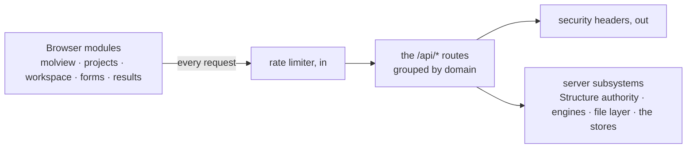

# Web API — the server routes the browser calls

**Role:** contract
**Domain:** web
**Companions:** the module docs own their own routes' consumer-side detail —
[`molview.md`](?doc=web/molview.md) (`/api/build/load`, `/api/modify/*`),
[`projects.md`](?doc=web/projects.md) (`/api/files/*`),
[`workspace.md`](?doc=web/workspace.md) (`/api/workspace-storage/*`),
[`form-schema.md`](?doc=web/form-schema.md) (`/api/build/schema/*`). This doc is
the **shared contract** those routes obey and the one **complete catalogue**.

The molbuilder web app is a single server process that serves the tab pages and
a set of `/api/*` JSON routes the browser modules call. This doc has three
jobs: the **conventions** every route obeys (§ 1) and the **security posture**
they are served under (§ 2), the **complete route catalogue** (§ 3–4,
cross-linking each route's owner doc), and the **full request / response shapes**
for the routes that have no module-doc home (§ 5). It closes with a worked
round-trip (§ 6) and a list of removed routes (§ 7).

## 1. The response envelope

Every JSON route returns a top-level `ok`:

- **Success** — `{ "ok": true, …payload }`, HTTP 200.
- **Failure** — `{ "ok": false, "error": "<a human message>" }`, a non-200 status.

There is exactly one error builder and one structure-success builder, both in
`blueprints/_shared.py`:

- `err(msg, code=400)` → `{ "ok": false, "error": msg }` at the given status.
- `ok_structure_response(struct, extra)` → the success envelope for any route
  that returns a molecule (`/api/build/load`, `/api/build/molecule`, all
  `/api/modify/*`). **It validates what it is about to send** — being the only
  way out, it is the one place that can be done once, and what the check finds
  arrives in `notices` (`?doc=model/structure-periodicity.md` § 8.1 seam 2).

**The canonical structure shape.** A molecule crosses the wire in one shape,
built by `workspace_payload()` (the single serializer):

```json
{ "text": "<xyz/pdb bytes>", "source_format": "xyz",
  "title": "…", "n_atoms": 42,
  "atoms": [ { "…per-atom row…" } ],
  "structure": { "…the structure's own dict, to_dict (model/structure.md § 2.1):
                  positions — or frames for a frame set — and metadata,
                  customized included…" },
  "lattice": null,
  "periodicity": { "…cell / engine_offset / axis_kind / vacuum…" },
  "annotations": { "…regions / frozen / channels…" },
  "issues": [ "…" ],
  "notices": [ { "severity": "info|warn", "message": "…", "about": "cell" } ],
  "extra": { "…endpoint add-ons…" } }
```

`notices` and `issues` are different channels and do not overlap. An **issue**
is a validation finding about a calculation you are about to run — it is what
the Generate panel lists, and it carries a `where` naming the field to fix. A
**notice** is what the server says about the structure in this answer — the
periodicity gate on its box, a merge on what it did not carry, a load on how it
read the file (`structure.lone_file`, `cell.origin_retired`); it is absent when
there is nothing to say.

**A notice says what it is ABOUT**, and that is what decides where it is shown:
`about: "cell"` puts it beside the cell rows, on the page whose controls can
change what it complains about; anything else goes above the tabs, visible on
either page (`?doc=web/molview.md` § 6.8). The subject is the notice's own, not
the door's — the same sentence about the same box belongs in the same place
whether it arrived with a file load or with an edit.

**Whether a bad box REFUSES or merely reports depends on what the request is
for**, and that rule lives in one place:
`?doc=model/structure-periodicity.md` § 8.2. Short version: a door that emits
something you would run refuses (400); a door that loads or modifies reports and
carries on, so the user can see the problem and fix it.

Two notes that matter for a reader of the code: `lattice` is now **always
`null`** (the geometry moved into `periodicity`), and `structure_to_dict` also
mirrors several **legacy aliases** at the root — `xyz` (= `text`), `elements`,
`atom_names`, `residue_ids`, `residue_names`, `chain_ids`, `n_residues` — that
the Modify tab's older `applyStructure(r)` reads. The inverse, rebuilding a
`Structure` from a request body, is `struct_from_body()`; metadata arrays are
honored only when their length matches the atom count.

### The request envelope — one shape at every door that carries a structure

**Every door that takes a structure now takes the envelope**, and the browser
writes no coordinate document to reach any of them (`molview.md` § 11.7). Two
doors deliberately take something else, and neither is carrying a structure the
caller holds.

| door | how the structure is sent |
|---|---|
| `/api/modify/*` | `{structure: <envelope>, …the op's own arguments, and the selection under its own key}` |
| `/api/structure/periodicity` | `{structure: <envelope>, op, payload}` |
| `/api/structure/save` | `{structure: <envelope>, path, overwrite}` — a frame set's frames and rows inside the envelope (`model/structure.md` § 2.2e) |
| `/api/structure/export` | `{structure: <envelope>, name?}` — the same |
| ~~`/api/build/fdf`~~ · ~~`/api/build/pyscf`~~ · `/api/build/preflight` | `{structure: <envelope>, params, structure_path?}` — the **emit** doors. `structure_path` is provenance and a dest-dir anchor, never a source of geometry or labels |
| ~~`/api/transport/render`~~ | **DELETED 2026-09-17.** It rendered a device deck and handed the text back; no browser had called it since 2026-08-29, and a browser renders no deck (`tabs.md`) — the same ruling that retired `/api/build/fdf` and `/api/build/pyscf` on 2026-08-17. It was the last door to take a file PATH as its geometry, which is the migration described in § 2's envelope rule below |
| `/api/build/load` | `{path}` — a file the server reads — or `{text, filename}`. **Not the envelope** — nothing is being sent back, something is being *parsed*, and the text carries atoms only: no labels, no cell, no `info` rides beside it, because nothing sends them (plan § 5q D15). A `path` load reads all three off disk, and says when the pair carried a retired `cell_origin` it did not apply (`cell.origin_retired`, `info`, naming the corner; D14); a lone file — no `.molstruct.json` beside it — is atoms and coordinates, and the answer says so (`structure.lone_file`, `info`, about `structure`, quoting the comment line it did not read as metadata; `model/structure.md` § 2.3). **Which frame** (`model/structure.md` § 2.3): `frame: i` answers that frame alone; `frames: true` the whole set, inside the envelope (`frames` in place of `positions`, each frame's rows in `metadata.customized.frames`); neither, frame 0 — as `StructureCodec.load`. Every answer carries `n_frames`, the count the file holds, so a tab can ask which frame (`tabs.md` § 2) and a viewer can ask for the set (`molview.md` § 9.4). It ALSO takes `{structure: <envelope>}` on one branch: a tab **putting back** the structure it was showing before the page was left, which is not a parse — `exportFile`'s exact inverse, through the one entrance so the same checks run, and answered whole (a frame set with every frame; no frame is chosen) |
| `/api/selection/eval` | `{atoms: [{element, labels, residueName, atomName, chainId}], rule}`. **Not the envelope:** no rule matches on position (`molview.md` § 9.5), so no coordinates are sent — the cut-down list is the whole of what a filter needs. `atomName` / `chainId` joined it 2026-09-07: they are what `by_atom_name` and `by_chain_id` match on, and without them the server rebuilt the structure with `Structure`'s defaults — atom name = element symbol, chain = `"A"` — so both rules answered **200 with a wrong answer** rather than refusing (`by_atom_name "CA"` never matched an alpha carbon; `by_chain_id "B"` never matched anything). Both keys are optional and fall back to those same defaults, so an older caller is unaffected |

> **The text branch of `/api/build/load` is down to callers that should not be
> using it** *(2026-09-07)*. This table justified it as *"a file or a paste is
> being parsed, and raw text is what a user supplied"*, and neither half is
> true. There has never been a paste UI. The local-file panel that read a
> user's disk with `FileReader` was removed the same day — nothing in any
> contract asked for it, and it silently ignored the `.molstruct.json` sitting
> beside the file it opened, which is the one loss the pair rule exists to
> prevent. The five Sources generators were the other users, and they now send
> `{structure}`: the envelope was already in the same response, and posting the
> `xyz` string beside it had been costing every generated peptide its residue
> names.
>
> The **trajectory tab** posted text too, a single-frame XYZ it wrote in the
> browser, with `atom_metadata` / `periodicity` / `info` beside it to restore
> what that flattening destroyed. It now installs the server's own envelope
> for frame 0 (`/api/watch/load` composes it), so the three side-blocks had no
> sender and are gone (2026-09-25, plan § 5q D15). What still posts text is the
> component demo's hard-coded sample XYZ.

> **The old shapes are gone, not deprecated.** `/api/structure/periodicity` used
> to take `{data: {xyz, sidecar}}`; it now answers 400 to that, which is how the
> defect was found — the one caller that exists could not produce a coordinate
> document, so the door had never once opened. **`/api/modify/*`'s flattened
> `{xyz, atom_names, …}` columns are gone too**: `struct_from_body` refuses a
> body with no `structure` key, by name, and there is no second shape left for
> a both-keys rule to arbitrate. *(This paragraph said the flattened columns
> were still accepted "for callers that have not moved" until 2026-09-02. They
> were not — the transition finished and the sentence did not, which is the
> drift a migration note is most prone to: it is written while both shapes are
> live and reads as true long after one is gone.)*

Both of the defects that drove this are worth keeping, because each was silent:

- **A caller had to know four shapes** to use four doors, and nothing made them
  agree. A field added to one was absent from the others until somebody noticed.
- **Two of the four required the caller to write a coordinate document.** The
  browser holds coordinates as numbers, so it serialised them to text, the server
  parsed that straight back into numbers, and numbers came back. That round trip
  was the only reason a `.xyz` writer existed in the browser at all — and that
  writer had drifted from `Structure.to_xyz` (no title line, raw precision where
  Python writes six decimals), so the same structure saved from two halves of the
  application produced two different files. The writer is gone.

> **The rule.** **A structure crosses in one envelope, in both directions, at every
> door — and the server is the only thing that turns it into a file.** The browser
> sends what it holds; it never sends a document it wrote.

**The envelope is the structure's own canonical dict** — `Structure.to_dict()`,
whose inverse is `Structure.from_dict()`:

```json
{
  "structure": {
    "title": "",
    "elements":  ["C", "O"],
    "positions": [[0.0, 0.0, 0.0], [1.4, 0.0, 0.0]],
    "atom_names": [], "residue_ids": [], "residue_names": [], "chain_ids": [],
    "metadata": { "regions": {"L-electrode": [0], "frozen_atoms": [1]},
                  "cell": null, "engine_offset": null,
                  "axis_kind": ["isolated","isolated","isolated"],
                  "vacuum": [0.0, 0.0, 0.0], "annotations": {} }
  },
  "…": "the call's own arguments — indices, anchors, op, path, …"
}
```

**That it is not a new shape is the whole point.** `to_dict` is the ONE
serialiser the persistence, sidecar and CLI layers already round-trip through,
and its own rule is that **nobody outside the class assembles or picks apart a
structure dict** — every hand-rolled repack is where a field goes missing, which
`cell_origin` has already done. A wire shape invented beside it would need a web-
layer edit every time the structure gains a field, and would silently omit it
until someone noticed.

So a field added to the structure appears on the wire for free, and the
serialiser is the same one the file on disk goes through.

| part | what it is |
|---|---|
| `elements` + `positions` | the atoms as **numbers**, never text |
| the identity columns | per-atom facts a coordinate file cannot hold — full-length or `[]` |
| `metadata` | the block the codec owns: regions, frozen atoms, the periodicity fields, annotation channels |

`document` is not part of a structure response. It is what the **export** door
answers with — that door's whole job — and it is absent everywhere else for a
reason that is easy to get wrong: a caller sends `geometry` and `metadata` back,
never a document, so nothing needs the text until somebody asks for a file.
Putting it on every response would pay a full serialisation and a content hash
per load and per edit to carry something no request will ever contain.

A request that does contain a `document` is a request from something that wrote a
file it should not have; the reader ignores it.

A **metadata column is sent only when every atom has one**, otherwise `[]` —
never a list with holes. The server takes `[]` as "absent" and applies its own
default; a list containing `null` poisons comparisons like `max(residue_ids)`,
which is a bug this project has already shipped once.

**Responses** are the same envelope plus whatever the call has to say:

```json
{ "ok": true, "structure": { "geometry": …, "metadata": …, "document": … },
  "notices": [ { "severity": "info|warn", "message": "…", "about": "cell" } ] }
```

**What this replaces, door by door.**

| door | request | response |
|---|---|---|
| `load` | `{path}` **or** `{text, filename}` for a paste — the only place raw text is legitimate, because a user supplied it — **or** `{structure}`, a structure put back; `frame` / `frames` say which frame a path or a text answers with (§ 1's `/api/build/load` row) | the envelope, `n_frames`, and `notices` (a lone file's `structure.lone_file`, a retired corner's `cell.origin_retired`) |
| `modify/<op>` | the envelope + the op's arguments | the envelope |
| `periodicity/<op>` | the envelope + `op`, `payload` | the envelope |
| `save` | the envelope + `path`, `overwrite` — a frame set's frames and rows inside the envelope | `{ok, path, notices}` |
| `export` | the envelope + `name?` (the stem) — the range's frames and rows inside the envelope | `{ok, files: [{name, text}], frames, notices}` — `frames` the count the files hold; the same generator the save uses, **named** |
| `selection/eval` | the envelope + `rule` | `{selected_indices}` |

**The export door answers with named files, and that is not cosmetic.** Each
entry is `{name, text}` — the file as it would exist on disk, under the name it
would exist as. The caller supplies `name` as a **stem** (`wire_frame40-120`,
no extension) because only the caller knows what the export *is*; the server
completes it, because the extension follows from the format, which
`StructureCodec.pair` already decided.

The geometry comes back under `.xyz` — plain XYZ, a block per frame, so the same
extension covers one frame or four hundred, which is the ordinary convention
and what our own load door accepts. A caller that builds the
names itself is keeping a second copy of the pairing rule; the one that did also
re-serialised the sidecar's JSON, a second answer to a question
`molstruct.dumps` owns. Both now come out of the codec together — see
[`molview.md`](?doc=web/molview.md) § 11.7 and
[`model/structure.md`](?doc=model/structure.md) § 2.4.

### How the two shapes coexist

The envelope is **added, not swapped**, and that has to be mechanical rather than
aspirational or the transition is a second protocol in disguise.

**Which shape a request is.** There is one shape: a body carries `structure`,
or it is refused. The two-shape test — *"a body without one is read the old
way"* — described the migration window, and the window is closed.

**If a body carries both**, the envelope wins and the legacy fields are ignored
entirely. Not merged: a caller that sends both is a caller mid-migration, and
merging would let a stale field silently override a fresh one. Nothing is
inferred from the pair.

**Responses always carry both**, for as long as the legacy keys exist. A response
is `structure` **plus** today's `text` / `atoms` / `periodicity` / `annotations`
and the root aliases, derived from the same Structure, so the two can never
disagree — they are two views of one object, not two objects.

**What ends the legacy.** Not a date: the condition is *no reader left*. A key
goes when nothing reads it, which is a question the code can answer — and until
then a browser tab that was loaded before a deploy keeps working, which is the
actual risk this rule exists for.

### What the envelope must be able to carry

A protocol is judged by what it can express without being amended. These are the
cases the current designs need, and the answer for each is part of the contract:

| Case | How the envelope carries it |
|---|---|
| **a new kind of per-atom fact** | added to the **structure**, in the one place its codec lives (`to_dict` + the two metadata methods) — and it is then on the wire, in the sidecar and through every edit, with no door touched. What the envelope does *not* do is carry a field the structure does not model: `apply_metadata_dict` checks against `METADATA_FIELDS` and **REFUSES** an unrecognised key, naming it. *(This said "dropped" until 2026-08-04, and the code said refuse — changed for #41, where a key that was dropped rather than refused is how frozen atoms vanished from a real run. A fact worth surviving a round trip is a fact worth the structure knowing about; a fact the structure does not know about is worth saying so about, not swallowing.)* |
| **part of a structure** — a partial translate or rotate, where the edit routes act on the whole structure they are given | an envelope may describe a **subset**, with `source_index` giving each atom's number in the structure it came from. The receiver answers about the subset; the caller maps the coordinates back. Without this the caller sends a bare document and re-checks element-by-element that nothing was reordered, which is what the previous implementation had to do |
| **one frame, or many** | ONE KEY OR THE OTHER, as `Structure.to_dict` writes it (`model/structure.md` § 2.1, § 2.2e): `positions` for one frame, `frames` for a frame set — every frame inside the envelope, each frame's rows in `metadata.customized.frames`, never a `frames` list beside it. `/api/build/load` answers frame 0 unless asked, one frame with `frame`, the whole set with `frames: true`, and always the file's `n_frames`; a structure put back (`{structure}`) is answered whole. An export carries the range the viewer asked for (`molview.md` § 11.7). A run's own trajectory is the one thing that arrives outside the envelope: its frames are parsed from a run file the tab owns (`/api/watch/*`) and handed to the viewer by that tab |
| **where a structure lives** | **not in the envelope.** A path is an argument to the call — `save` takes one, `load` takes one — because the envelope describes a *structure*, never a location. A structure that carries its own path is one that can be saved to the wrong place by being copied |
| **what the server wants to say** | `notices` beside `ok` — `{severity, message, where, about}` rows (`where` is the stable finding id; `about` is the subject that decides where it is shown) the door produces about the structure it is answering with: a box that no longer contains its atoms, a vacuum a typed cell has made inert (the full set is `model/structure-periodicity.md` § 6.1a, table B). Nothing is corrected, so a notice never reports a repair. They belong to the *call*, not to the structure, so they never ride inside it |

### Strict where a file is read, lenient where the wire is

The two are not the same problem, and treating them as one was a real mistake
(made and reverted 2026-08-04).

**A `.molstruct.json` sidecar is a FILE.** It outlives the program that wrote
it, which is why it is versioned — and why `Structure.apply_metadata_dict`,
which reads it, **REFUSES** a key it does not know, naming it. A key it cannot
map is a fact the author believes is stored, and dropping one is how frozen
atoms vanished from a real run (#41).

**The wire is not a file.** Client and server ship together; the envelope is
deliberately unversioned for that reason (below). An unrecognised key on a
request is our own client disagreeing with our own server *in the same build* —
a defect to fix in development, not a condition to turn into a 400 for someone
running a calculation. Readers of wire-only blocks take the names they set and
leave the rest.

**The envelope reader is the case that shows why.** `document` (the export
door's answer) and `source_index` (the caller's own bookkeeping) are both named
in its `known` set, so they are **ignored on purpose** rather than refused.

**The envelope is not versioned, and that is a decision.** The sidecar on disk
carries `schema_version` because a file outlives the program that wrote it. The
wire does not: client and server ship together, and the one case where they differ
— a tab loaded before a deploy — is exactly what "added, not swapped" already
covers, because the old shape keeps working. A version number would give a false
sense that mismatches are handled when the additive rule is what actually handles
them.

> **Status: shipped at every door that carries a structure** (2026-08-04). This
> read "agreed, not implemented — today's four shapes are what ships" while the
> conversion was under way; leaving it there after the fact is worse than having
> never written it, because a reader checking the contract is told the code has
> not been brought to it yet and goes looking for the old shapes.
>
> `/api/transport/render` was the last door across (the route itself is
> deleted, 2026-09-17), and its migration is the
> case the rule is for: it took a file PATH as its geometry with the labels
> beside it, so one request came from two sources read at two moments — and
> being the last caller of that shape was the only reason the server still had a
> second place labels could arrive from, and so a place they could be dropped
> from without a word (#41). The cell had the identical split one day later.
>
> **Neither was fixable by ranking the two sources.** "The envelope stated
> nothing" and "the envelope stated something different" are one input to any
> precedence rule that can be written; an attempt at one silently discarded a
> label set. A structure crosses once, or the question has no correct answer.

### The client mirror

The browser never wraps these calls in `try/catch`. `projects/api.js`'s
`_fetchEnvelope` **normalizes every failure into `{ ok: false, error }`** —
a dropped network, an abort (`{ ok:false, error:"aborted", aborted:true }`), or a
non-JSON 5xx/HTML error page (`{ ok:false, error:"server returned non-JSON…" }`)
all come back in the same shape. GETs default to `cache: "no-store"`. So both
ends of every call speak the one envelope.

### Status codes

**Four buckets, and `ok:false` is not the same as an HTTP error.**

| what happened | HTTP | `ok` |
|---|---|---|
| **it worked** | 2xx (200 in practice) | `true` |
| **advisory** — the request was well-formed and the *validator* refused it | **200** | `false` |
| **protocol** — the body was bad, the path escaped, the file was not there | 4xx | `false` |
| **server fault** — an I/O error, an engine that fell over, a bug | 5xx | `false` |

The advisory row is the one worth stating out loud. A deck that fails
validation is a **successful answer to a valid question** — the caller asked
*"is this all right?"* and got a complete reply saying no, with the findings
in it. Returning 4xx there tells the browser's transport layer that the
*request* was wrong, and a client that retries on 4xx, or a proxy that
swallows the body, then loses the very list the user needed to read.

**A failure states its status; a success does not have to.** Flask answers
**200 when a view returns a bare body**, which is the right answer for
`ok:true` — so those returns are written plainly, and 52 of them are. An
`ok:false` return never relies on that default: forgetting `, 500` would ship
an HTTP 200 carrying a server fault, silently, and read as correct. Nothing
in the value distinguishes a deliberate advisory 200 from a forgotten one;
the only difference is whether the author wrote it, so the author always
writes it.

**What the blueprints hold today**, counted from the source: envelope returns
carrying a literal status are `400`×153, `500`×44, `404`×25, `409`×16,
`403`×8, `200`×4, and one each of `413`, `422`, `501`; another 32 pass the
status as a value — `err(msg, code)`'s default of 400, or a path error's own
`status`. The advisory bucket is **four sites**: the notify channel probe,
twice — *"could not reach it"* is news about somewhere else, and a 5xx there
would claim this server broke — transport's preflight, whose issue list
IS the answer, and the Build route's missing tool (`POST /api/build/molecule`),
which is the person's install, not this server's fault.

> *(The four buckets were settled by an audit on 2026-06-17 that found five
> misclassifications, including a catch-all `except Exception` returning 400
> for what was plainly a server fault. They were written down here on
> 2026-09-02 — until then the rule lived in that audit's commit messages, and
> `notify_setup.py` carried a comment citing "§ 1's advisory bucket" that
> § 1 did not contain.)*

| Status | Meaning |
|---|---|
| 400 | bad body / validation / parse failure (the default of `err()`) — **including a path escaping the allowed roots**: the picker roots are an addressable-space boundary, not a permission model, so a path outside them is a malformed request rather than a forbidden one *(corrected 2026-09-09; this row said 403 while `files._resolve_within_roots` had always raised 400 across eight routes, and one test hedged `in (400, 403)`, which is how the disagreement stayed invisible)* |
| 403 | forbidden — an admin-gate reject. **Authorization only**: the caller is known and may not do this |
| 404 | no such file / directory / route |
| 409 | conflict — a rename/move/copy/mkdir/write whose destination exists |
| 413 | payload too large — over the 50 MB global upload cap |
| 422 | unprocessable (spectra) |
| 500 | internal / I/O / parse fault |
| 501 | a stubbed endpoint |

### The non-JSON routes

Most routes speak the envelope, but a few do not — call these out so nothing
assumes `{ ok, … }`: the **tab pages** (`/`, `/molbuilder`, …), the HTML
**`/partials/*`** fragments, **`/api/files/download`** (a raw byte stream), and
**`/vendor/plotly.min.js`**.

## 1a. What may run inside a request — the three-second rule

**Anything that can take more than three seconds runs as a job, and the page
shows progress** *(user ruling, 2026-09-03)*. A request thread is a seat in a
waiting room: while it is occupied the person who opened it is looking at a
spinner, and — for some work — so is everybody else.

**Two different costs, and they are not the same problem.** Measured on this
tree, 2026-09-03:

| work | time | what it costs |
|---|---|---|
| an RDKit embed (a C₆₀ alkane from SMILES) | **4.5 s** | one thread. RDKit releases the GIL, so other requests run at 99% of full speed |
| a SIESTA `.out` parse, 25 MB | **4.7 s** | **every other request drops to ~8% speed** for the whole time — it is pure Python and holds the GIL |
| the same parse, 51 MB | 9.6 s | the same, for twice as long |

**Nobody has ever hit this** *(user, 2026-09-03)*, and the numbers are here so
that stays the answer rather than being re-derived: this is a small-lab server,
concurrent heavy requests are not a thing it sees. The rule is what to do IF
the case arises — not a defect waiting for a fix.

**The rule that follows has two halves:**

1. **Over three seconds → not in a request.** Whatever it costs others, it has
   already cost the person waiting. It runs as a job and the page shows
   progress rather than a spinner that cannot say how far along it is.
2. **Pure-Python heavy work is off the request thread even under three
   seconds**, because the cost is not its own: it holds the GIL, so it is
   *everyone's* three seconds. The remedy is a **subprocess**, not a thread —
   a thread would hold the same lock. This is the shape the GPU half already
   took: every driver read is a timed subprocess behind a cache, after a frozen
   child holding `/dev/nvidia*` froze the page widget.

**A timeout is a failure of the inquiry, never of the system** — the same rule
the GPU reads follow. A job that overruns says so and the page stays usable.

---

## 2. Security posture

Set on every response by an `after_request` hook (`app.py`):

- **Content-Security-Policy** — `default-src 'self'; script-src 'self';
  style-src 'self' 'unsafe-inline'; img-src 'self' data:; connect-src 'self';
  font-src 'self'; object-src 'none'; frame-ancestors 'none'; base-uri 'self';
  form-action 'self'`. There is **no `script-src 'unsafe-inline'`** — no inline JavaScript
  anywhere (a hard rule the whole frontend obeys). Inline `style=` is allowed
  (3Dmol and some inspectors need it); `img-src data:` is for Plotly.
- `X-Content-Type-Options: nosniff`, `X-Frame-Options: DENY`,
  `Referrer-Policy: same-origin`, and — over HTTPS only —
  `Strict-Transport-Security`.
- **CSRF** — there is no token layer. The defense is `connect-src 'self'` (the
  CSP blocks cross-origin fetches) plus `SameSite=Lax` session cookies on
  auth-enabled deployments. No CORS headers are sent (same-origin only). The
  single-user localhost default runs auth-free.
- **Rate limiting is always on** (`rate_limit.py`, a per-IP `before_request`
  check). By default it blocks on a **404 storm** (≥ 20 4xx in 30 s → a 1-hour
  cooldown) and on **attack-string signatures** — XSS / SQLi / path-traversal
  fingerprints in the URL, like `<script`, `union select`, or `/etc/passwd`; the
  total-request cap is **off by default** (`threshold_total = 0`) unless an
  operator sets it. `127.0.0.1`/`::1` are allowlisted; a blocked IP gets an
  empty **429**. The full threat model and the two `/api/admin/rate_limit/*` routes
  live in [`ops/deployment.md § 4`](?doc=ops/deployment.md).
- The global upload cap is **50 MB** (`MAX_CONTENT_LENGTH`).

### 2.1 A path from the browser is fenced at the ROUTE — the rule

**Every route that takes a filesystem path from the browser resolves it
through `projects.contain` (in the web layer: `files._resolve_within_roots`,
which adds the several allowed roots and an HTTP-shaped refusal) BEFORE it
calls anything else.** There is one fence and this is it — the same primitive
the `jobset` CLI's `--bundle` uses, so "may this be read" has one answer.

**And the modules it calls stay generic, deliberately.** A parser parses
whatever file it is handed; `molbuilder/checkpoint.py` inspects whatever
directory it is given, exactly as `git status` does — it reads files there to
work out whether it is a directory it can work with at all. That is the right
shape for a module, and it is why the check cannot live inside one: a module
fencing its own inputs would be a second fence with its own idea of the roots,
and the CLI (which legitimately runs outside them) would have to argue with
it. **The boundary is where the untrusted path arrives, and that is the
route.**

Two consequences worth stating, because both were live defects:

- A generic module that does a bare `open()` is **not** the bug — the route
  that handed it an unchecked path is. `/api/spectra/load` passed
  `body["path"]` straight into `parse_spectra_json`, and the parser was doing
  precisely its job.
- The rate limiter's attack-string screen reads the **URL**. A path that
  arrives in a JSON body is not screened by it, so the fence is the only thing
  standing there.

This section exists because the rule was not written down and two blueprints
cited this document for opposite readings of it: `watch.py` for requiring the
fence (its own 2026-06-18 fix, after a logged-in user could POST
`{"path": "/etc/shadow"}` and have the parser read it), `checkpoint.py` for
skipping it. Neither rule was here to cite. **An exception is legitimate, but
it is named here with its reason — not decided per blueprint.**

**Auditing it — the fence is reached under four names**, which is why a grep
for one of them reads as a clean bill of health when it is not:

| entry point | who uses it |
|---|---|
| `files._resolve_within_roots` | `files`, `results`, `watch`, `docs`, `bench`, `spectra`, `checkpoint` |
| `build._resolve_path_within_roots` | `build`, `transport` — a `require="file"/"dir"` wrapper |
| `selection._load_structure` | `selection` — resolves, then loads |
| `checkpoint._resolve_path` | `checkpoint` — resolves, then requires a directory |

And the parameter is not always called `path`: `structure_path`, `run_dir`,
`target_dir`, `dest`, `dir` and `filename` all carry one somewhere. An audit
that greps `get("path")` alone misses three blueprints.

*Current exceptions: none.* Every route that takes a filesystem path from the
browser goes through one of the four above — checked 2026-08-25, which is when
`/api/spectra/load` (1 route) and `/api/checkpoint/*` (6) were brought onto it.

## 3. Endpoint index — all 99 routes

**How the count is taken:** every rule in Flask's URL map except Flask's own
`static`, on an app built with the rate limiter disabled and no notify keys —
so neither the admin/auth routes rate limiting adds nor the notify listener's
`POST /api/<segment>`, which registers only on a machine whose key file names a
route, is counted. `test_http_status_contract.py` pins the number against the
map; it says the total drifted, never which row, so a route added or removed
changes its row in § 4 (or § 7) and this count together.

## 4. The route catalogue

Every route, grouped by domain. Routes with a module-doc home link to it; the
rest are documented in full in § 5.

**Run reports** — owned by [`run-reports.md`](?doc=execution/run-reports.md):
the machine's channels and its listener (§ 3.1 there, surfaced by
[`this-machine.md`](?doc=web/this-machine.md)), and the report fields a
calculation can carry (§ 4.1a there, offered by the Task-setup card).
**Signed-in only** — all but the last row, the listener itself: the public
*receiving* end (§ 4 there), a separate blueprint on purpose, and not counted
in § 3.

**Every channel route answers with the whole state** — `path`, `channels`,
`problem`, and `mode` (the file's permission bits) — not just what it changed:
the page repaints from whatever the response carries, and a narrower reply
leaves it reading fields that are not there. A response is the state, or it is
a trap for the next painter.

| Method · Path | Purpose |
|---|---|
| GET `/api/notify/channels` | The channels on this machine: name, kind, whether a key is stored, how the last test went. **Never a key, and every address masked** ([`this-machine.md`](?doc=web/this-machine.md) § 2). One of the two routes the Task-setup tab calls |
| GET `/api/notify/report-fields` | `{"ok": true, "fields": [{"name", "offered_as"}]}` — the fields a report of this calculation can carry, in the declaration's order, with the words the card offers each by; `?engine=&calculation=` narrow it, and either absent narrows nothing. From the one declaration (`report_fields`) a description is checked against at save. The other route the Task-setup tab calls ([`task-setup.md`](?doc=web/task-setup.md) § 9b) |
| PUT `/api/notify/channels/<name>` | Add or update one, `0600`, at `<config dir>/secrets/notify` — the path from the monitor's own function, so the two cannot disagree. **Merges** across channels and within one, so a blank key box means *unchanged*; it clears only the previous single-destination shape's top-level `url`/`key`/`headers` (run-reports § 3.1) |
| DELETE `/api/notify/channels/<name>` | Remove one. **Absent is off**, and off is a state you can reach without a shell |
| POST `/api/notify/channels/<name>/test` | Send one report to that channel through the monitor's own request builder and say what happened — the only check that exercises the file, the URL, the segment, the signature, egress and TLS together |
| GET `/api/notify/listener` | Whether **this server** receives reports: the route segment, who holds a key, and whether the route is `live` or only `configured` (a restart pending). Never a key |
| POST `/api/notify/listener/keys/<user>` | Issue or rotate one, through the same door as `notify-token` — the route is read from the key file. **Returns the key once**, the only time it is ever readable |
| POST `/api/<segment>` | **The listener** — public; registered only when `notify_keys` names a route and holds keys. A report signed by a user's key, within 15 minutes of this server's clock, is appended as one line and answered `{"ok": true}`; anything else is a plain `404` (run-reports § 4.1) |

**Structure + edits** — return the canonical structure envelope (§ 1);
owned by [`molview.md`](?doc=web/molview.md):

| Method · Path | Purpose |
|---|---|
| POST `/api/build/load` | Load a structure — a project path, a pasted or uploaded text, or a structure put back; frame 0 unless `frame` or `frames` says otherwise, `n_frames` in every answer (§ 1) |
| POST `/api/build/molecule` | Build a molecule from a backend. A tool this install lacks — a builder backend, or the hydrogen engines — is **advice, not a fault**: `200` with `{ok: false, reason: "backend_unavailable", backend, error}`, `backend` naming what is missing (`threedna`, `amber`, `rdkit`, `hydrogens`), else the backend asked for (`chemistry.BackendUnavailable.missing`) |
| GET `/api/modify/meta` | Element/tool metadata for the Modify UI |
| POST `/api/modify/{delete,add_atom,orient,rotate,translate,slab}` | The six structure edits |
| POST `/api/modify/append` | `{structure, addition}` → the two structures as one, with `addition` **centred on the world origin** and appended. **This is what a generate does, and a load the person answers *Add***: they add to what is open rather than replacing it (user, 2026-09-07), so a session is assembled piece by piece. A load asks first when a structure is open, and *Clear* replaces the view with the file without this route (`web/tabs.md` § 2, *Creating a structure*). TWO envelopes in one body, read by the same reader (§ 1). A label the open structure already carries is **numbered** on the way in (`benzene#` → `benzene#2`) so two fragments stay separately selectable; the reserved `frozen_atoms` keeps its spelling, because something downstream acts on that exact name. The **open structure's cell is kept**, and a dropped one is said in `notices` |
| POST `/api/modify/slab` | `{structure, element, plane, m, n, layers, start_registry, sequence, grow, start_z, orthogonal, dx, dy, lattice_constant?}` → the structure with one fcc slab appended. **Placed absolutely** — `dx`, `dy` and `start_z` are from the world origin — so it reads **no selection** at all, which is what it was built to change: it replaced `electrode`, which centred on one (`?doc=archive/2026-09-01-modify-redesign-plan.md` § 3, removed § 3.4a). `start_registry` picks which stacking registry the layer at `start_z` sits on (A/B/C, taken mod the surface's period); `sequence` (`"ABC"` / `"ACB"`) says which way the registry cycle is walked, **read along the growth direction**; `grow` says which side of `start_z` the slab occupies. `sequence` replaced `stacking`, which named downward behaviour only and did nothing at all growing `+z` |
| GET `/api/modify/spacings` | `?element&plane&reference` → `{ok, element, plane, system, reference, a, d_interlayer, nearest_neighbour}`. **The layer spacing and bond length of one surface**, derived from the lattice constant by `cell.interplanar_spacing` — one rule (the first *allowed* reflection for the lattice's centring), not a table of surfaces (`?doc=science/junction-cell.md` § 2.1). It exists because the Slab panel computed these in JavaScript and was **missing `d(110)`** entirely, so an fcc(110) build displayed two spacings and not the one the Cell page asks for. `reference` is **required** — `experimental`, `pbe`, or a number in Å; there is no default, because the two differ ~2% for gold and a silent choice cannot be checked without reading the source (user, 2026-09-22). Refuses a surface this builder does not make, and an element the table does not carry |
| POST `/api/modify/lattice-from-run` | `{path, element?}` → `{ok, a, d_nn, coordination, second_shell_ratio, n_atoms, element, source, notes}`. **A lattice constant read back out of the user's own relaxed bulk result** (`?doc=archive/2026-09-01-modify-redesign-plan.md` § 3.3). It measures the **atoms**, not the cell: a relaxed result's box may be conventional cubic, primitive rhombohedral, or the user's own m×n×N lead cell — three relations to `a`, and the file does not say which — so `a = √2·d_nn` under minimum image, which assumes nothing. The path is fenced at the route (§ 2.1) and read through the parse module (`.XV`) or `StructureCodec` (`.xyz` pair). **Two refusals**: a file with no cell, and more than one element with none named. Everything else is a `note` — coordination away from 12, a second shell away from √2·d, and the offset from each literature reference — because the setup is the user's to own |
| ~~POST `/api/selection/atoms`~~ — **retired 2026-09-07**: no caller since MolView took ownership of the structure, and it had drifted to a private reader that applied only the sidecar's `regions`, so `by_residue_name`, `by_chain_id` and `by_atom_name` returned nothing through it. The rows it returned are `_shared.atoms_list`, which every structure-carrying response already sends.
| POST `/api/selection/eval` | Evaluate a selection expression |
| POST `/api/structure/periodicity` | The Cell page's edits — four single-field ops and `block`, the whole cell — through the frame-contract gate |
| POST `/api/structure/export` | The pair a save would write, **named and returned** instead of written |

**Files + projects** — owned by [`projects.md`](?doc=web/projects.md):

| Method · Path | Purpose |
|---|---|
| GET `/api/files/{roots,list,stat,read,read_range}` | Browse + read |
| GET `/api/files/download` | Raw byte download (non-JSON) |
| POST `/api/files/zip_prepare` · GET `/api/files/download_zip` | Take a folder to another machine without ssh. The POST compresses it and answers `{token, name, files, bytes, skipped, excluded}`; the GET streams that archive by **token** (single-use, non-JSON) and deletes it. Split so the sidebar button can say *Zipping…* and stay unclickable through a build that takes minutes. The archive is the folder **as it stands now**: the three storage subtrees (`.molbuilder_workspace`, `.git`, `.binsnapshots`) never enter it, engine restart files do |
| POST `/api/files/{mkdir,upload,write,rename,move,copy}` · DELETE `/api/files/delete` | Mutations |
| POST `/api/projects/create` | Create a project (the topic tree) |
| POST `/api/structure/save` | Save a structure + its sidecar to a path |
| POST `/api/task-setup/handover` | **Render** the parameter tab's work — returns `<label>.template.toml` and `task.1st.json` as TEXT. Writes nothing: the browser puts them where the user chose, through `projects.safeSave` ([`task-setup.md`](?doc=web/task-setup.md)). The body states `engine` and `calculation`, and the hand-over records the kind, every kind ([`handover-procedure.md`](?doc=web/handover-procedure.md) § 6) |
| POST `/api/task-setup/save` | Validate a description through `task.read_task`, save the folder's state (`checkpoint.save_before`, the function prep calls: [`execution/checkpointing.md`](?doc=execution/checkpointing.md) § 9) and write `task.json`; the answer's `saved` names the state and its note, and a state that cannot be saved refuses the write (409). A **content-aware door**, for the same reason `/api/structure/save` is one: a browser-authored schema-stamped file the loader would reject is the save-then-reload trap. It reports a hand-over rather than deleting it — moving bytes is the file layer's job. **Refused with 409**: a folder describing another calculation (another run id), and another shape for a calculation that has produced — a stage prepared, as a run or a benchmark ([`task-setup.md`](?doc=web/task-setup.md) § 4) — the refusal naming the way back, the state saved before its first prep |
| POST `/api/task-setup/prep` | **Run `prep task` for the stages picked** — `stages`, a list: one stage, or several as one group sharing one job — the ONE entry the terminal runs (`jobset/prep.py::prep_task`, [`execution/job-system.md`](?doc=execution/job-system.md) § 5.3 and *The task*), for the machine named in `target` (a record name, or `this` for the machine the server is on; none for a calculation already set to its machine, whose own copy of the record answers — the tab sends none then). A field that is not a string, or `stages` that is not a list of names, is refused, 400. **The answer is `{ok, answers, plan_id}`**: `plan_id` the plan the pick makes together, and `answers` each picked stage's answer, in order, the entry's whole (`PrepAnswer.as_dict`): `kind`, `stage`, `findings` (the preflight's notes, each `Issue.to_json`), `notes` (what the inputs said: a bench's grid, enumerated, crossed out and kept), `saved` (the folder's state saved before prep wrote — or the one it already stood at — and its note, led by the time it was taken: [`execution/checkpointing.md`](?doc=execution/checkpointing.md) § 9), `dirs` (the folders this prep's jobs run in), `provenance` (which config files answered, as prep read them with the machine's record — the table `STAGE-PLAN.md` and the pipeline log carry; a preview's too), `machine` (the machine it is prepared for, in the tab's word: the one named, else the one the calculation's copy of its record names), `deck_findings` (what each deck's checks said, one of each), `flat`, `attempt` (`dir`, `fresh`, `brought`, `copied`, `continued_from`, `cold`) or `points` for a transport bias sweep (each `{attempt, bias, gathered}`), `gathered` (`{file, from}`), `placement` (a run prepared for a queue: the queue it was admitted on — `domain`, `partition`, `qos` — where each value came from, `from`, and the `line` both doors print; `null` with no queue), `resources`, `deck`, `agreement` (`verdict`, `rendered_for`, `launching_at`, `note`; `null` when the deck makes no claim), `pipeline_log` and `continuation` (`stage`, `source`, `by_default`, `concluded`, `state`, `converged`, `linked` — a force-constant stage building on `relax` — `carries`, the files that came across into the attempt (none on the flat layout, nor for a benchmark), `run` — on the flat layout, the run by the name its files carry — and the `line` both doors print, a preview's saying what it would copy — which run the stage continues from, [`execution/job-system.md`](?doc=execution/job-system.md) § 5.4 — or `null`), `linked` (a stage of a kind whose rungs have roles, which builds on what its kind says — said "takes nothing from another run" when it takes nothing) and `cold` (`--cold` was asked for); `machine` names the target as the tab shows it. The save is the entry's own and asks nothing (§ 5.0, checkpoint 5). A stage already prepared is refused, naming the way back ([`execution/job-system.md`](?doc=execution/job-system.md) § 5.0). **A refusal is a 400 carrying what the entry had found**: `error`, `findings` and `notes` — a refused prep wrote nothing ([`execution/job-system.md`](?doc=execution/job-system.md) § 5.0, rule 3). A bench with no declared axes is the machine's proposal, as on the command line. **What a run continues from**, as the CLI's two flags: `from` — a run of this calculation, by its folder (`01_coarse/run-0`) — or `cold: true`; neither is the default, the newest run of the stage before it ([`execution/job-system.md`](?doc=execution/job-system.md) § 5.4). What cannot be taken — a path out of the calculation, both at once — the entry refuses, as it does at the terminal. `plan: true` is the entry's **preview** ([`execution/job-system.md`](?doc=execution/job-system.md) § 5.0, W55 B3): the same answer, stopped before the save, with `preview: true`, `plan_id` (the plan, named — `Plan.identity`) and `writes` (every file it would leave, from the calculation) — `launch` (`header`, the `.sbatch`'s `#SBATCH` lines, and `run_script`, the run script's stated counts — A13, line for line as the plan holds them) on every run's answer — or the refusal prep would give, a 400, with nothing saved, written or recorded; so nothing is prepared unseen, the rule the launch door keeps ([`submission.md`](?doc=execution/submission.md) S4). **A Prep names the preview's plan** (`plan_id`) and is refused when the plan it makes now differs — the folder, the machine's record or a library file it takes, or molbuilder itself, changed between; a Prep naming none is refused, 400, before the entry (nothing is prepared unseen). The description, the stage — a name in any case, or `#N` — and the machine are the entry's to resolve and refuse, as at the terminal *(D15; until 2026-10-05 the route checked the stage by its exact name, and assembled its preview from pieces of the entry)*. **Prep, never launch**: prep writes files, while launch spends a queue slot and refuses batch submission by design, so only the cheap verb has a door here. Refusals come back as the reader's own words with 400 — a browser that repaired one would be the second, drifting decider. Why a browser may trigger this at all when [`project-layout.md § 2.2`](?doc=execution/project-layout.md) says the deck cannot be finished in the browser: that section constrains whose FACTS the deck is rendered from, and a named record supplies the machine half |
| GET `/api/task-setup/sweepable` | The run settings of one engine and kind (`engine`, `calculation`) — the catalogue's `execution` items: what the Measure card may sweep and the run card may state, **picked from the catalogue** rather than from a list in the browser ([`template.md § 6.2`](?doc=engines/template.md), [`stages.md § 6.8d`](?doc=engines/stages.md)) |
| GET `/api/task-setup/columns` | `?engine=&calculation=`: which settings may become a column of the stage table — everything the description is allowed to hold as a stage's value, with the run settings left out: the catalogue's `execution` items, the machine's answers among them, are each rung's run card ([`stages.md § 6.2`](?doc=engines/stages.md), § 6.8d). Separate from `sweepable`, which answers what a benchmark may MEASURE and a run card may state |
| GET `/api/task-setup/folder` | **What is this folder?** — Task setup's one per-directory answer, so the page is a function of the folder rather than of twelve calls landing in whatever order they land ([`task-setup.md`](?doc=web/task-setup.md) § 2.1). Carries the description or the hand-over (and so the `mode`), the template's values, the provenance block, the attempts on disk, the folder's file names, `continue_from` — for each stage that continues from another by default, its default (`line` included; the relaxation's verdict is the preview's) or why prep would refuse it, every run of the stage before it with what it was, and whether `--cold` is a choice (plan W37) — `bench_refusal` — why this description takes no bench, or null: the prep entry's own answer (`prep_inputs.bench_refusal`), so the page offers the Measure step exactly where `prep bench` would take it — `set_to` — the machine the calculation is set to, its first prep's, from its copy of the record (this machine as `(this machine)`, the tab's word), or null before it ([`configuration.md`](?doc=configuration.md) M-3), so the tab shows it fixed — `prepared` — `{task: {stage: why}, bench: {stage: why}, placed: {stage: line}}`, each stage prepared with the prep entry's own sentence (`prep.prepared_already`), which the tab shows in place of a Prep it would refuse ([`execution/job-system.md`](?doc=execution/job-system.md) § 5.0), and each prepared stage's placement as its job records it, in the line both prep doors print (§ 6.0) — and `ladder` — `{stages: [{stage, state, detail, why}], offer}`, the ready door's answer for every stage (`prepared`, `ready` with what it takes, `waiting` with what for) and the stages `prep task` offers pre-selected (`jobset/ready.py`; *The task*), which the tab's one Prep lists to pick from. **It names its own subject** in `dir`, and a consumer that has moved on discards it — `calcdir.json`'s rule (`project-layout.md` § 1.4a) applied to the wire, and the half that clearing state cannot cover. The template's values (`template`, parsed by `read_template` — the reader `prep` opens the file with — and what an empty stage cell shows, [`task-setup.md § 5.1`](?doc=web/task-setup.md)), the provenance block (`provenance`, the `config_provenance` block `prep` prints) and the attempts on disk (`attempts`, counted from the DECLARED shape, [`project-layout.md § 4.5`](?doc=execution/project-layout.md)) were three routes of their own until 2026-10-03, called by no page; one part failing carries its own `error` rather than failing the answer |
| POST `/api/task-setup/commands` | **What a person types for the stages named** — one, or several as one group: their prep as chosen (what it continues from: `from`, `cold`; the machine: `target`, `(this machine)` taken for this one), their launch and a benchmark's `summarize`: `{dest, kind, stages, …}` → `{ok, lines}`, composed by the terminal's own composer (`jobset/commands.stage_lines`), so a line the tab shows is one the terminal prints and takes ([`execution/job-system.md`](?doc=execution/job-system.md) § 5.3) — a launch line per mode where this machine's `molbuilder.json` sets no `launch.mode`, no `--target` once the calculation is set to its machine, and no prep line for stages already prepared. Writes nothing; 400 without `dest`, `kind` (`task`/`bench`) and `stages` ([`task-setup.md`](?doc=web/task-setup.md) § 11) |
| POST `/api/task-setup/bench-grid` | The bench grid these axes would produce on this target, cell by cell, with the queues that would take each — the report `jobset/prep_inputs.bench_inputs` already computes, served as data. Body `{dest, target?, bench}`; `bench` is the axis map **as it is being edited**, so the card's list tracks typing rather than the last save. 200 with `cells` even when none survive (*nothing here fits* is a result); 400 only for a description that cannot be resolved at all, carrying the reader's own words. **The browser never enumerates the grid** — a second enumerator is the drifting decider [`generator.md § 4.3a`](?doc=execution/generator.md) was rebuilt to remove |
| POST `/api/task-setup/prep-plan` | What a `prep` would write, stage by stage ([`task-setup.md § 7.1`](?doc=web/task-setup.md)). Body `{task, dest?}` — the description as it is being edited, and the folder: a stage that has files there keeps its number (W38 F4), so the names are read where prep reads them; nothing here writes. Names come from `materialize.stage_home` and `Shape.stage_dir`, the allocation from `prep._allocation_for` — **the producers, never the page**, because flat and hierarchical name directories differently and a list composed in the browser would be free to disagree with the thing it describes. With `warm`, which restart-file list the calculation follows — `{path, own, copy_to}`, the one door's answer (`warmfiles.warm_list`, `job-contracts.md` § 4.2a) — for the card's last group (`task-setup.md` § 7.2) |
| GET `/api/task-setup/machines` | Which machines a calculation could be prepared FOR — the records `jobset probe --write --name NAME` wrote, plus this machine, each with what it measured. `choice_required` is computed by the same rule the CLI refuses on, so the tab and the terminal cannot disagree about what is ambiguous ([`preparing-for-another-machine.md § 4`](?doc=execution/preparing-for-another-machine.md)) |
| GET `/api/task-setup/presets` | A shipped tier's values for one stage (`coarse` / `medium` / `tight`), so a row can be filled from [`tuning.md § 4`](?doc=engines/tuning.md) instead of typed. `?engine=&calculation=`: a tier is offered for the folder's kind only when every field it carries may be a column of that kind's table — the columns route's own membership rule — so a transport description gets an empty list and its rows draw no menu ([`task-setup.md § 9`](?doc=web/task-setup.md)) |

**Session timeline** — owned by [`workspace.md`](?doc=web/workspace.md):
POST `/api/workspace-storage/{write,read,prune}`.

**Config forms** — owned by [`form-schema.md`](?doc=web/form-schema.md):
GET `/api/build/schema/<engine>?calculation=<kind>` (narrowed to the kind;
the spectra tab renders `pyscf?calculation=vibration`),
GET `/api/transport/schema`.  (`/api/build/schema/spectra` and
`/api/spectra/render` retired at the spectra migration's P3.)

**Results + trajectory + spectra + transport** — the Results/Spectra/Transport
tabs (their docs, this wave):

| Method · Path | Purpose |
|---|---|
| POST `/api/watch/load` · GET `/api/watch/data` | Register + poll a trajectory. **`format` names the ENGINE that ran (`siesta` / `pyscf`); `label` names the PARSER that read the file.** Two facts, and the route sent the parser's name for both until 2026-09-04. They coincide for an engine-native file — a SIESTA `.out` is read by the parser called `siesta` — and diverge for the canonical `.molwatch.log`, which is read by the parser called `molwatch` whatever wrote it, so every molbuilder-generated run arrived as `"molwatch"` and the viewer's engine-specific SCF banner fell through to its neutral branch. The engine is not guessed from the filename and not read off the parser: it is a property of the RUN DIRECTORY, **declared when the deck was generated**, and `running-a-job.md` § 4.2 owns the rule: the deck/wrapper PROVENANCE `engine` key and the `.molwatch.log` `# engine:` header are DECLARATIONS, weighed together — one distinct answer wins, two disagreeing give `unknown` — and the file cluster is a fallback consulted only when nothing declared. *(This row read as a precedence arrow-list until 2026-09-04; racing the rungs let one stale `.run.sh` outrank two agreeing declarations.)* The route asks `parse.contract.engine_of` about the same directory `_run_metadata` searches, so both facts a response carries about the run come from one place. `source_format` is the fallback, reached whenever `engine_of` answers `unknown` — an upload, which has no directory to declare anything, and also a run directory that declares nothing (a hand-made run, or one prepared before the declaration shipped on 2026-09-04). What the parser found is then the honest answer, including the neutral `"molwatch"` of a log with no header. *(This row said "only an upload reaches it" until 2026-09-04; a directory holding one headerless `.molwatch.log` reaches it too, and then `format` does carry a parser name — which is the substitution this row otherwise forbids.)* It is not an engine field in general (`siesta-mdnc`, `pyscf-geom`, `siesta-xv` all live in it), and reading it as one is exactly the substitution this row forbids. The load response carries ONE metadata block — `atom_metadata` (the input script's ATOM-METADATA block), `periodicity`, and `info` (what the run says ABOUT itself; today the electronic contract its own deck records, as `info.calculation`) — from **one composer, asked about the file the load opened** (`runs.declared`, its run's own deck), so all three of this route's builders answer the same thing and an upload, which has no run directory, states `null` in each rather than omitting them. Omission means KEEP on this route (`trajectory.md` § 5.1): `/api/watch/data` deliberately leaves the block out so a poll re-sends the frames without re-sending the metadata. `periodicity` is composed ON THE SERVER: the cell from the run's output (or, when the output carries none — a PySCF log — the cell the deck placed the atoms in, from its ENGINE-OFFSET record); the axis kinds from that record (a run made before it states none); and `engine_offset` stated `0`, since these are the engine's coordinates (`model/structure-periodicity.md` § 6.0). A run's export therefore reloads as a typed cell with a stated origin of 0. The structure arrives in the server's envelope; until it existed the browser composed `{cell}` alone, and an export from the Results tab stamped a lattice-bearing junction `isolated` on every axis. **How the run is doing rides with the file**: the load, and a poll answering *unchanged*, carry `run: {state, detail, live}` — the one door's answer for the run the file belongs to (`runs.run_answer`), asked before the file's last read when the run is no longer live — and `null` for an upload or a file of no run of ours (a folder no calculation claims, `model/parse.md` § 5); a poll bringing new content leaves it out, which keeps it (`results.md` § 4.1) |
| GET `/partials/{trajectory-inspector,spectra-inspector}` | HTML fragments. `selection-panel` was a third until the MolView module took over building that panel itself; the route went with it and this row outlived it |
| GET `/api/results/dir` | **What is in this run directory, and which file should open?** — the HTTP surface over the run door's `folder_answer` (`model/parse.md` § 5, `execution/architecture.md` § 3.2). Per DIRECTORY: `place` (container or run, from `calcdir.json` or the description — `project-layout.md` § 1.4a), `openable` (the door's own pick, so the page defaults to what the CALCULATION produced), `attempts` (the search trail, which is the body of the refusal when nothing matched), `status`, `engine`. Per FILE: `role`, `label` and `stage` read back with its run's label (`runfiles.parse`, the label the run door reads from the description — `execution/architecture.md` § 3.2), `parser` — the registry's verdict, `null` when nothing can read it — and `about`, what the file is: `{ours: true, what, writer, when}` from the catalogue's row, or `{ours: false}` (`results.md` § 3b). It exists because the browser is the one consumer that cannot import Python and was deciding all of that from filenames: measured over 110 real run directories, the guess differed from the door on 18 of 96, offered 13 files no parser can read, and hid 155 it handles. For a CALCULATION ROOT it also answers `ladder` — `JobSetStatus.to_dict()`: `{complete, first_incomplete, stages: [{name, seq, state, detail, dir, attempt, …}], offer}` from `jobset_status`, consumed not copied (`results.md` § 2.4) — and `null` elsewhere |
| GET `/api/results/contract` | What the run directory beside a structure records about it, as two keys: `calculation`, the electronic contract the run's own deck states (`parse/contract.py::contract_of`, handed `runs.declared(run).deck`), and `relaxation`, what the run did to the geometry it left, read from the file the Results tab opens in that folder (`runs.openable` → `relaxation_of`, `model/parse.md` § 5b.1) — the blocks the structure inspector records into the viewer's `info` store so an export carries them (`archive/2026-09-01-structure-info-plan.md` I5); each is `null` when there is nothing to say (no run of ours / a deck stating nothing; a run that relaxed nothing) |
| ~~POST `/api/results/bundle`~~ | *retired 2026-08-29 — calculation-to-calculation passing is gone; the composite cites (`POST /api/transport/describe`)* |
| GET `/api/bench/summary` | One benchmark **sweep**, composed: every trial's knobs / coordinate / measurement, where each run is now, and the verdict. Takes the sweep's `job-set.json`; the CALCULATION it belongs to is derived from it, because the file's own directory is not the bundle. Read-only and safe to poll — it never writes the record, and the report is `jobset summarize`'s to print ([`bench-summary.md`](?doc=web/bench-summary.md)) |
| POST `/api/spectra/load` | Parse an uploaded `<job>.spectra.json` into typed results (`/api/spectra/render` retired at the spectra migration's P3 — the deck computes; the tab only loads) — with `run: {state, detail, live}` for the run a file on disk belongs to, read before the file's last read when the run is no longer live, and `null` for an upload, an inline result or a file of no run of ours: the viewer follows while it is live (`results.md` § 4.1) |
| GET `/api/transport/record` | A transport calculation's record, **composed on read**: `?path=` the calculation's folder (tree-relative) or any file under it — its `task.json`, the report's handle ([`results.md`](?doc=web/results.md) § 0.1) → `{ok, record}`, the record as `transport.record.collect_record` composes it now — every rung's `state` and `detail` the one status door's (`runstatus.jobset_status`, what `jobset status` and the ladder say), each bias point with its transmission in `points`, the rest `pending` (not launched, queued, running) or `failed` (ended without it), each in its run's words. A ladder in progress has a report. Read-only; the file on disk stays `summarize task`'s deliverable. 400 outside the projects tree or for a calculation that is not transport; 404 for no such file |
| GET `/api/transport/pdos` | The PDOS of the atoms a person selected, at one bias point ([`results.md`](?doc=web/results.md) § 2.5): `?path=` the calculation's folder or any file under it (the report sends its `task.json`), `point=` the bias in volts, `atoms=` 0-based indices, comma-separated, `orbitals=` `all` (default) or one orbital type (`transport/tbtnc.py` `ORBITAL_TYPES`, read from `.ORB_INDX`) → `{ok, energy_ev, pdos, atoms, outside_device, orbitals}`, computed on request from the point's `.TBT.nc` (`transport.record.selection_pdos`). Read-only; 400 names what does not read |
| GET `/api/transport/describe_attempt` | Classify a picked path against [`engines/transport.md`](?doc=engines/transport.md) § 3.1's condition — a finished relaxation run's folder, or a structure pair's `.xyz`: `?path=` (tree-relative, `&swap_electrodes=1` to describe with the rename) → `citation` (null with the refusal as `summary`), `concluded`, a one-line `summary` (how a run ended, or a pair's frames and the deck its record names; then what its record states, and what it does not), `findings` — what the composition measured, in the one finding vocabulary ([`science/validation.md`](?doc=science/validation.md) § 4.1: each lead's seam and principal-layer measurements `info`, the electrode orientation `warn`, a composition refusal `error`), the labeled `structure` envelope the viewer installs — answered **whether or not the citation composes**, so a refusal is read beside the junction it is about — `fix`, a word the tab acts on (today `"swap_electrodes"`), and `swap_electrodes`, the rename this answer was composed with |
| POST `/api/transport/describe` | The composite's ONE door from the tab: junction citation + `bias` + `low_bias_approximation` (true / false, for several voltages — the codec refuses a list without it, and one with a single voltage; its refusals come back as `findings` with `where: task.bias` / `task.bias.low_bias_approximation`, beside the control) + `swap_electrodes` + per-rung bags (`stages: {rung: {item: value}}`) + the shared panel's values → the finished `task.json` and template texts (same codec + refusals as `jobset init`; a bag naming an item the rung does not own, a shared or role-fixed item, or an unknown rung is refused by name); the browser writes them via the content-blind file layer, no navigation |
| GET `/api/transport/schema` | The transport tab's TWO surfaces, from the catalogue narrowed to transport (`engines/transport.md` § 3.8.2): `?surface=shared` is the panel that edits the template (every `shared` item outside `setup`; with `&junction=` its values are the cited directory's answers and `source` names where they came from); `?surface=rung` is the per-rung form — every non-shared, non-role, non-machine item — carrying `rungs` (name, one-based index, one-line note) for the tab strip, and `&rung=<name>` narrows it to one rung's tab: the items that rung owns plus the ones any rung may set, each field carrying its `stages` (§ 3.8.2a). Every schema carries `group_words` (its cards' titles and lines, `template.GROUP_WORDS`); one rung's tab also `stage` and `stage_words` (`form-schema.md` § 1.3). The bias is not here — it is card 4's own input |
| *(the rename)* | `L-electrode` ↔ `R-electrode` is this calculation's own choice (`engines/transport.md` § 4): `describe_attempt` offers it as `fix: "swap_electrodes"` when the composed labels run the reverse of the usual convention (`L` = low z), describes the citation **with** it on `&swap_electrodes=1` (answering `swap_electrodes` so the tab can withdraw it), and `describe` writes it into the description; compose applies it to the calculation's copy. No route writes the cited run *(the POST that did went 2026-10-08)*. Consults **no geometry**: whether they *should* be the other way round is the author's call, so the tab warns and this performs. **It writes the transport calculation's own description** — the junction slot's `swap_electrodes: true`, which compose applies to the calculation's own copy of the junction — and **never the cited run** (`engines/transport.md` § 4; user, 2026-10-04). *(Until then it rewrote the label block in the cited run's deck, or the `.molstruct.json` beside it, inside that run's finished attempt.)* |

**No module-doc home — documented in full in § 5:** the app-level routes
(`/api/health`, `/api/backends`, the tab pages), the build env/script routes
(`/api/build/preflight`, `/api/structure/{analyze,periodicity}`
— `/api/run/install-wrapper` and `/api/siesta/install-pseudos` retired
2026-08-21: zero browser callers; `prep` writes the wrapper and installs the
pseudopotentials on the described route), `/api/checkpoint/*`,
`/api/system/load`, `/api/docs/*`, `/api/admin/rate_limit/*`, and the optional
auth routes.

## 5. Full reference — the un-owned routes

**App-level** — `GET /` (redirect to the landing tab); `GET /molbuilder`,
`/structure-optimization`, `/spectrum-calculation`, `/transport-calculation`,
`/results`, `/documents`, `/jupyternb`, `/molview-demo` (tab pages);
`GET /api/health` → `{ ok, version }`;
`GET /api/jupyter/status` → the notebook tab's whole state — env installed,
process up, answering, the open notebooks' paths, and **the token, only when
the caller may control it** (`web/jupyter.md` § 6); `POST /api/jupyter/start`
· `POST /api/jupyter/stop` → **404** with no supervisor to ask (a button that
cannot work is worse than an absent one), **403** for a caller who may not run
code on this machine, **202** when the signal is delivered, **409** when the
supervisor refuses it;
`GET /api/backends` → `{ ok, available, auto_name }`;
`GET /vendor/plotly.min.js` (the Plotly bundle, 404 if absent).

**Build — generate + validate** (all take a structure + config, return
`{ ok, … }`):

| Method · Path | Body → response |
|---|---|
| ~~POST `/api/build/fdf`~~ | **deleted 2026-08-17** — rendered a deck in the browser; zero JS callers. A deck is rendered by `prep`, on the machine that will run it |
| ~~POST `/api/build/pyscf`~~ | **deleted 2026-08-17** — same, and it had no caller at all |
| POST `/api/build/preflight` | `{ structure, params, engine, calculation }` → the pre-run validation report (pseudos + config gates), the kind's own science composed in |
| POST `/api/structure/analyze` | **In:** the envelope `{structure}` the page would hand over — the one its viewer holds, the preflight and the hand-over send — with `kind` (`optimization` · `vibration` · `transport`, stated by every tab; a request with none is refused) and `forms`, `{<engine>: {net_charge, spin_treatment, unpaired_electrons, method}}` as each form says them. **Out:** the facts — `n_atoms`, `metals`, `metal_hints` — and `state.<engine>`, the `ElectronicState` the one class resolves for that form's own items (`science/chemistry-correctness.md` § 2a): each item `{value, source, why, said}`, with `n_electrons`, `finite` and `recommended`. With no `forms`, every engine `electronic_state.engines_for` names for the kind is answered with every item blank; a form for an engine that does not run the kind is a 400 naming who does. The chemistry card (`lib/chemistry.js`) and each form's chip (`lib/detection-chip.js`) read `state.<engine>`. *(Until 2026-09-28 it answered `suggested.<engine>` per registered adapter, for an Auto-detect button to copy into the forms; a `structure_path` door, which re-read the file from disk, left in the M6 review, and `structure_text` on 2026-09-02.)* |
| POST `/api/structure/periodicity` | `{structure, op, payload}` → `{ok, periodicity, notices}`. The unified periodicity door (`?doc=model/structure-periodicity.md` § 6.2): **four** ops — `vacuum` · `axis_kind` · `cell` · `box_corner` (the origin the person assigns, on a typed cell; `null` is *Automatic*) — plus `block`, the whole cell at once, through the frame-contract gate. The answer is the cell block in the same shape `/api/build/load` sends it — raw values with the resolved views (`resolved_cell`, `box_corner`, `resolved_vacuum`) beside them — so a client adopts it verbatim through the path a load already takes, and `notices` carries `{severity, message, where, about}` rows — first what the edit did (RECEIPTS, `where: "cell.edit"`), then what is now true of the result (CONDITIONS, each with its own `cell.*` id) |
| ~~POST `/api/run/install-wrapper`~~ · ~~POST `/api/siesta/install-pseudos`~~ | **retired 2026-08-21** — zero browser callers; the described route owns both (`prep` writes the wrapper beside every deck and installs the pseudopotentials itself) |

**Checkpoint** — the run-history panel (its behavior is
[`execution/running-a-job.md`](?doc=execution/running-a-job.md) `§ 6`, its
invariants [`execution/checkpointing.md`](?doc=execution/checkpointing.md);
the routes are `GET /api/checkpoint/{state,list}` and
`POST /api/checkpoint/{init,save,tag,restore}`.

~~`GET /api/checkpoint/config`~~ — **retired 2026-09-07**, zero browser
callers and zero tests. It answered what a folder's classification is (the
size limit, the always-large list). Read-only was deliberate — the
classification has one home, `molbuilder.json`, and a per-folder editor *"let
two folders behave differently for no recorded reason, and let somebody change
the rules between a save and a restore"* — but nothing ever displayed the
answer. If the panel should one day say why a file was left out of a
checkpoint, that is a feature to design, not a route to keep warm).

**System** — `GET /api/system/load` → `{ ok, data: { cpu, ram, gpu, … } }`, the
1 Hz load strip's source. An empty `gpus` list has two causes, so the snapshot
also carries `gpu_error`: `null` when this host simply has no GPU support
installed, and the reason as a string when NVML was installed and refused to
start. The strip hides its GPU cells either way; only the second case prints
anything, because only the second case is something being wrong.

**Docs** — `GET /api/docs/read` (one markdown doc; also serves the
whitelisted root `../README.md` / `../LICENSE`), `GET /api/docs/toc` (the
sidebar tree from `docs/toc.json`; auto-discovers new domain docs and
best-effort persists the repaired tree — read-only installs are served from
memory), and `GET /api/docs/img/<path>` (images only, contained to
`docs/img/`) — what the Documents tab reads.

~~`GET /api/docs/list`~~ — **retired 2026-09-07**, zero browser callers. It
was the Documents tab's original flat listing; the commit after the one that
added it replaced the listing with the `toc.json` tree, and nothing has called
it since. `/api/docs/toc` auto-discovers new documents, so it was not a
fallback either. This entry named it among "what the Documents tab reads"
until the day it was deleted, which is why three audits walked past it.

**Admin** (admin-gated) — `GET /api/admin/rate_limit/status` (the blocked-IP
list) and `POST /api/admin/rate_limit/clear` (unblock an IP, or
`{ "all": true }` to wipe).

**Admin — server reload** (2026-08-03). `GET /api/admin/reload/available` is
**always registered** and always answers `200 {available: bool}`: "no" is not a
refusal, it is the honest state of a server started without a supervisor or with
nobody named as an admin, and a page that got a `403` here could not tell "you
may not" from "the server is broken". `POST /api/admin/reload` restarts the
process, and is **not registered at all** unless there is a supervisor *and* at
least one named admin — so a misconfiguration reads as "the button is missing",
never as "anyone can restart the server". Who counts as an admin comes from the
top-level `admin.emails` list, and **absent or empty means anyone who can sign in**; see
[`ops/access-control.md`](?doc=ops/access-control.md).

**Auth** (only when an `auth` config is present) — `GET /login`,
`/login/<provider>`, `/oauth-callback/<provider>`, `/cas-callback/<provider>`,
`/logout`. Deployment concern; see the auth/deployment doc.

## 6. How it fits together — and one round-trip


```mermaid
flowchart LR
    B["Browser modules<br/>molview · projects · workspace · forms · results"]
    B -->|"every request"| RL["rate limiter, in"]
    RL --> API["the /api/* routes<br/>grouped by domain"]
    API --> SEC["security headers, out"]
    API --> SUB["server subsystems<br/>Structure authority · engines · file layer · the stores"]
```

A concrete round-trip — loading a structure by project path:

```
POST /api/build/load      Content-Type: application/json
{ "path": "MyProject/optimization/final.xyz" }
```

The server resolves the path *inside* the allowed roots, reads the `.xyz` and
its paired `.molstruct.json` through `StructureCodec.read` (the one authority),
and returns the canonical envelope:

```json
{ "ok": true, "text": "<xyz bytes>", "source_format": "xyz",
  "title": "final.xyz", "n_atoms": 42, "atoms": [ … ], "lattice": null,
  "periodicity": { … }, "annotations": { … }, "issues": [ … ],
  "xyz": "<xyz bytes>", "elements": [ … ], "n_residues": 1, "extra": { … } }
```

Failures come back in the envelope: a path escaping the roots → **400**
(the status table above gives the reasoning: the picker roots are the
addressable space, so a path outside them is a bad request, not a
forbidden one). *(This said 403/404 until 2026-09-20, contradicting the
table in the same document.)*  A
missing file → 404 `no such file: <path>`, a parse/sidecar fault → 400. (The
same route also accepts a multipart `file=` upload or a raw
`{ text, filename? }` body.)

## 7. Removed routes

So a reader of older code or bookmarked URLs isn't lost, these routes are
**gone**:

| Old route | What happened |
|---|---|
| `/api/workingcopy/*` | renamed to `/api/state-timeline/*`, then to `/api/workspace-storage/*` (2026-08-02) — the middle name said *timeline*, which is MolView's, not the workspace's; the working-copy blueprint and module were deleted |
| `/api/selection/save-sidecar` | removed (no code remains) |
| `/api/selection/refresh-hash` | removed (no code remains) |
| `/api/files/result-list` | retired 2026-06-01 with its single consumer |
| `POST /api/transport/render` | deleted 2026-09-17 — a browser renders no deck |
| `POST /api/modify/calibrate` | retired 2026-09-25 with the calibrate step (`model/structure-periodicity.md` § 6.0) |
