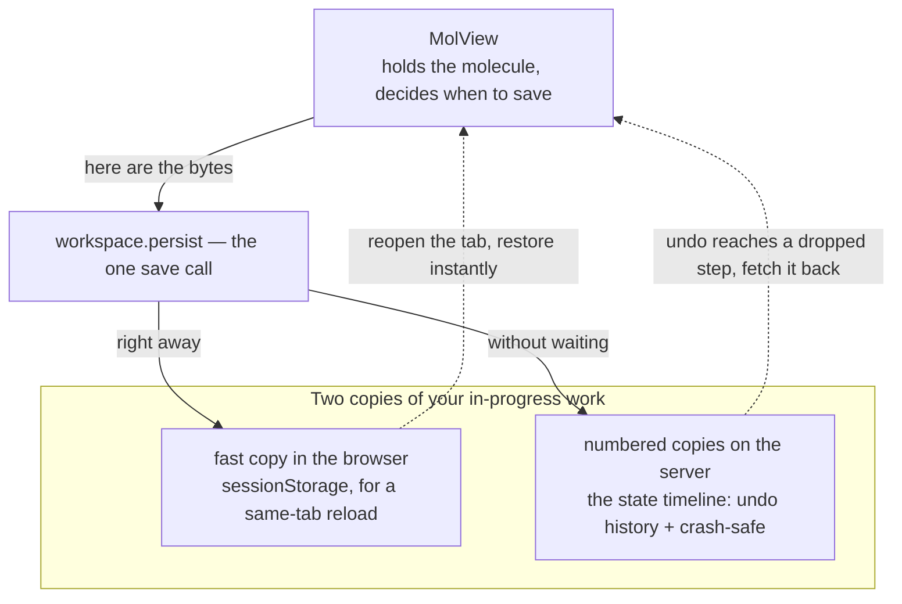

# Workspace — saving your work so a reload or undo can bring it back

**Role:** contract
**Domain:** web
**Companions:** [`molview.md`](?doc=web/molview.md) — owns the molecule the
workspace saves; the workspace holds no data of its own. `web-api.md` — the
`/api/state-timeline/*` server routes (web wave). The Modify tab's Save panel
and the projects file doors — a *file* save is their job, not the workspace's
(§ 8).

When you edit a molecule in a tab and then reload the page — or click Undo far
enough back — your work is still there. That is the **workspace** module: it
quietly saves the in-progress state of a tab so it can be brought back, without
you ever pressing "save". It has one job, and it never looks at *what* it is
saving — it just moves the bytes it is handed.

Two things up front:

- The workspace does **not** hold the molecule. The structure you see and edit
  lives in MolView ([`molview.data`](?doc=web/molview.md)); the workspace only
  saves and restores whatever bytes MolView hands it.
- It is a plain ES module — nothing here is waiting on a conversion.

## 1. The two files

The whole module is two small files:

- **`dispatcher.js`** — the front door, `window.molbuilder.workspace`. Every tab
  talks to this. It decides *where* saved bytes go and hands back what was
  saved.
- **`snapshot-io.js`** — the only file in the whole app that touches the
  browser's own short-term storage (`sessionStorage`). The front door routes
  every browser-storage read or write through it, so there is exactly one place
  that decides the storage key and format.

The server side is three small routes — `/api/state-timeline/{write,read,prune}`
in `state_timeline.py` — described in § 9.

## 2. What gets saved, and where — the two copies

Your in-progress work is kept in **two** places, for two different reasons:



- **A fast copy in the browser** (`sessionStorage`, owned by `snapshot-io.js`).
  This is what makes a **same-tab reload** instant: reopen the page and the tab
  comes back from this copy with no trip to the server. It is only a cache — if
  it's missing, nothing breaks.
- **Numbered copies on the server** (the "state timeline"). Every save also
  writes a numbered snapshot to a small file on the server. This is what powers
  **Undo history** — each save is one numbered step — and it survives a browser
  crash. The server keeps the most recent **30** steps per tab and drops older
  ones on its own.

Both are written by one call. When MolView decides something changed worth
saving, it calls:

```js
window.molbuilder.workspace.persist(sessionBytes, snapshotBlob, identity);
```

`persist` writes the fast browser copy right away, and sends the server write
off **without waiting** for it — so a slow disk never freezes the editor. It
never looks inside the bytes; that is MolView's business.

## 3. A worked example — close the tab, reopen, undo

Say you open a molecule in the Modify tab, delete an atom, then move another:

1. On each edit MolView saves the new state: `workspace.persist(...)` writes the
   fast browser copy **and** appends a numbered snapshot on the server
   (step 1, step 2, …).
2. You **close the tab and reopen it in the same browser.** The tab reads the
   fast browser copy (`readPersistedSnapshot()`) and your edited molecule is
   back instantly — no server hit.
3. You click **Undo** a few times. Undo walks back through the numbered steps.
   A recent step is still in the browser copy; for an older step it no longer
   holds, MolView asks `workspace.readState(...)`, which fetches that exact
   numbered snapshot back from the server.
4. If a save to the server ever fails (disk full, network drop), the editor
   doesn't freeze — the failure is reported through `onPersistError` and a page
   event, never swallowed silently.

## 4. Two viewers on one page don't clobber each other

A single page can show more than one molecule — the Results tab, for instance,
has a structure inspector and a trajectory inspector side by side. Each names
itself with an **owner** tag — `useNamespace("results:structure")` — and the
workspace folds that tag into both the browser key and the server id. So each
viewer saves into its own slot and none overwrites another's work.
`molview.mount` sets this on every mount, so tabs get it for free.

## 5. The public surface

Everything a consumer uses is on `window.molbuilder.workspace`:

| Member | What it does |
|---|---|
| `persist(sessionBytes, snapshotBlob, identity)` | Save now — the fast browser copy right away, the numbered server snapshot without waiting. |
| `readPersistedSnapshot()` | The saved browser copy (for a same-tab reload), or `null`. |
| `readState(identity)` | Fetch one numbered snapshot back from the server — the step the browser copy no longer holds. |
| `pruneStatesAbove(id, index)` | Drop server steps above `index` (used when Undo-then-a-new-edit throws away the redo tail); `-1` clears the whole history. |
| `hasRestorableSnapshot()` | Is there a saved structure worth bringing back at mount? (§ 7) |
| `mountRestoreTarget()` | Which source file a mount-time restore would bring back, or `null`. |
| `useNamespace(owner)` | Give this consumer its own slot (§ 4). |
| `workspaceId()` | The stable id this tab's draft is saved under (survives a same-tab reload). |
| `onPersistError(fn)` | Be told when a background save fails — never silent. Returns an unsubscribe. |
| `STORAGE_KEY` | The base browser-storage key, `molbuilder.workspace.v1`. |

The low-level browser-storage helper is also reachable as
`window.molbuilder.workspaceSnapshot` (`{ setNamespace, read, write }`), but only
one internal file uses it directly on reload — consumers use the front door
above.

## 6. The line between workspace and MolView

The split is deliberate, and worth stating plainly: **MolView decides *when* and
*what* to save; the workspace decides only *where* the bytes go.**

- MolView owns the molecule, turns it into bytes itself (all the "did anything
  change?" and rate-limiting logic lives in MolView, not here), and calls
  `persist`.
- The workspace writes those bytes to the two copies and reads them back on
  request. It holds no structure, no selection, no idea what a "step" *means* —
  it can't tell a molecule from any other blob.

That is why the front door exposes **zero** data accessors — there is no
`workspace.getAtoms()`. A test (`TestWorkspaceIsPersistenceOnly`) keeps it that
way. The in-memory model used to live in this module; it moved out to MolView
during the 2026-07 split, and the old data globals were deleted.

## 7. Bringing work back at mount — the one rule

When a viewer mounts, it may need to restore a saved structure. The rule: ask
**`hasRestorableSnapshot()`** — "is there a saved structure worth bringing
back?" Do **not** decide by comparing files against `mountRestoreTarget()`: a
`null` there is ambiguous — it means *either* no snapshot *or* a generated,
file-less structure — so gating on it wrongly wipes a freshly-generated
molecule (a bug this rule exists to prevent). `hasRestorableSnapshot()` is the
honest gate.

## 8. A file save is not the workspace's job

Saving your work-in-progress (everything above) is a different thing from
**saving a file into a project.** When you click Save-to-project, that runs
through the Modify tab's Save panel (`modify/structure/save.js`) to the projects
file door (`projects.saveMolecule` → `POST /api/structure/save`), which writes
the `.xyz` + `.molstruct.json` pair. The workspace is **not** in that path at
all. (The details live in the Modify-tab and projects docs.)

## 9. The state files on the server, and two ordering rules

For the record: the server keeps each tab's history as small JSON files at
`<projects_root>/.molbuilder_workspace/states/<workspace_id>.<step>.wc.json`. It
never parses them as molecules — it just moves JSON bytes. It keeps the most
recent 30 steps per tab. A crashed or closed tab leaves its files behind (a new
tab starts a fresh id); these are **not** auto-cleaned — crash recovery is out
of scope by design — but once the pile passes 300 files the server logs a
one-time warning so an operator can clear the folder by hand.

Two small ordering rules keep the history consistent:

- **Same-step saves stay in order.** Rapid save → undo → save can send two
  writes to the *same* numbered file; the front door chains them so a stale one
  can't land last.
- **Clear the tail before re-anchoring.** When Undo-then-edit throws away the
  redo tail, that delete (`pruneStatesAbove`) finishes before the new baseline
  snapshot is written, so the history can't briefly contain both.

## 10. Test map

- `test_workspace_dispatcher_js.py` — the front-door surface + the
  persistence-only guard.
- `test_workspace_state_api.py` — the server `/api/state-timeline/*` routes.
- `test_workspace_dispatcher_mount_e2e.py`,
  `test_workspace_dispatcher_canvas_mount_js.py` — restore-at-mount.
- `test_no_legacy_store_consumers.py` — the deleted data globals stay deleted.
