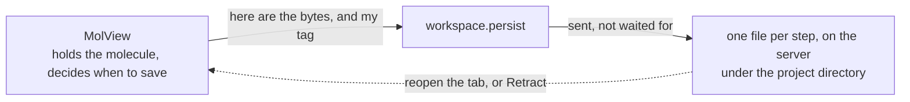

# Workspace — saving your work so a reload or undo can bring it back

**Role:** contract
**Domain:** web
**Companions:** [`molview.md`](?doc=web/molview.md) — owns the molecule the
workspace saves; the workspace holds no data of its own. `web-api.md` — the
`/api/workspace-storage/*` server routes (web wave). The Modify tab's Save panel
and the projects file doors — a *file* save is their job, not the workspace's
(§ 8).

When you edit a molecule in a tab and then reload the page — or click Undo far
enough back — your work is still there. That is the **workspace** module: it
quietly saves the in-progress state of a tab so it can be brought back, without
you ever pressing "save". It has one job, and it never looks at *what* it is
saving — it just moves the bytes it is handed.

Two things up front:

- The workspace does **not** hold the molecule. The structure you see and edit
  lives in MolView ([`molview.data`](?doc=web/molview.md)); the workspace only
  saves and restores whatever bytes MolView hands it.
- It is a plain ES module — nothing here is waiting on a conversion.

## 1. The module

One file: **`dispatcher.js`** — the front door, `window.molbuilder.workspace`.
Every tab talks to this. It decides *where* saved bytes go and hands back what
was saved.

There was a second file that kept a copy in the browser's own short-term storage.
Nothing ever restored from it — every restore went to the server anyway — so it
cost a write on every edit and bought nothing. It is gone, and with it the only
other place your work could be.

The server side is three small routes — `/api/workspace-storage/{write,read,prune}`
in `workspace_storage.py` — described in § 9.

> **They were called `/api/state-timeline/*`, in `state_timeline.py`, and the name
> was wrong.** It named MolView's **timeline** — the sequence of saved points, the
> position on it, the badge, and the policy of what a save records and what to
> prune. None of that is on the server. That is `lib/molview/history.js`, and
> nothing in these routes knows a sequence exists: no order, no position, no
> notion that index 3 follows index 2. They store one opaque blob per
> `{workspace_id, state_index}` for **any** tag — `lib/inspectors/structure.js`
> keeps `{showing: "<path>"}` in them, which is a file path and not a history.
> Renamed 2026-08-02 (§ 2a).

## 2. Where your work is kept

**One place: files on the server, under your project directory.**

```
<projects_root>/.molbuilder_workspace/states/<workspace_id>.<step>.wc.json
```



Two kinds of file, both here:

- **A numbered point for each save.** That is what Undo walks back through, and
  it survives a browser crash. The server keeps the most recent **30** per tag
  and drops older ones on its own.
- **A draft**, one file, rewritten every time you change something. That is what
  makes reopening a tab find the work you never got round to saving.

They are separate files on purpose: an edit rewriting the point you last saved
would mean Retract took you back to something that had changed since you chose
it.

When MolView decides something is worth keeping, it calls:

```js
window.molbuilder.workspace.persist(tag, bytes, identity);
```

**It does not wait.** The write is sent and the call returns, so a slow disk
never freezes the editor — which means "it worked" cannot come back from here. A
failure turns up afterwards through `onPersistError`. The workspace never looks
inside the bytes; that is MolView's business.

## 2a. What the workspace is not

Jobs this module could plausibly grow into, and does not. Each boundary is here
because something has already drifted across it, or has been read as though it
had.

| Not | Whose job it is | Why the boundary is there |
|---|---|---|
| the **timeline** — the sequence of saved points, where you are on it, what a save records, what to prune, how far a step goes | **MolView**, in `lib/molview/history.js` (molview.md § 11.2) | The workspace stores numbered *states*; the **timeline is the sequence MolView makes of them**. The workspace has no idea one exists — it never compares two indices, and index 3 means nothing more to it than "a different file from index 2". A server that knew the order would be a second opinion about a history it cannot see the contents of |
| a **reader** of what it stores | nobody — the bytes are opaque | It moves bytes and never parses them. That is what lets a trajectory become restorable with no change here (molview.md § 11.2), and it is why the same routes serve a molecule, a history point and one inspector's `{showing: "<path>"}` without knowing the difference |
| a **file** save | the Modify tab's Save panel + the projects doors (§ 8) | Saving to a project is a decision a user makes about a name and a place. The workspace saves what you did not ask it to save |
| the **owner** of where `projects/` is | the app, through `Capabilities` | The root is resolved once for the whole app. Answering it separately here is exactly how the storage came to write somewhere the file picker was not looking |

**The first row is the one that has actually cost time.** The server half was
named `state_timeline.py`, serving `/api/state-timeline/*`, after a concept that
lives entirely in the browser and entirely inside MolView. Reading the name
instead of the callers led, on 2026-08-02, to two opposite wrong conclusions
about the same file within an hour — that it was a shared domain module to be
promoted out of the web layer, and that it was MolView-private plumbing to be
hidden. It is neither: it is this module's storage, and this module is public.

---

## 3. A worked example — close the tab, reopen, undo

Say you open a molecule in the Modify tab, delete an atom, then move another:

1. Each edit rewrites **the draft** — one file, replaced each time. Neither edit
   adds a point: you have not said either was worth coming back to.
2. You press **Save state**. That adds a numbered point, and drops any points
   above it.
3. You **close the tab and reopen it.** The tab reads its draft back and your
   edited molecule is there, including the change you made after saving.
4. You click **Retract**. The first press throws away the work sitting on top of
   the point you saved and leaves you on it; the next press steps to the point
   before that, read back from its own numbered file.
5. If a write ever fails — disk full, network drop — the editor does not freeze.
   The failure is reported through `onPersistError` and a page event, never
   swallowed.

## 4. The tag — how several savers share one page

A page can have more than one thing worth keeping. The Results tab shows a
structure inspector and a trajectory inspector side by side. The Modify tab has a
viewer holding a molecule *and* its own panel state. All of them want to survive a
reload, and none of them should be able to tread on another.

**The tag is what separates them.** Every save and every load names who it belongs
to — `"results:structure"`, `"results:trajectory"`, `"modify:panel"` — and the
workspace folds that name into both the browser key and the server id. Two tags
are two slots. Nothing is merged, so there is no moment where one writer's copy
sits half over another's.

**Two things the workspace promises:**

1. **There is one way to save and one way to load — the calls in § 5.** If you
   find another way to write these bytes, that is a bug to report, not a
   shortcut to use. Bytes written any other way carry no tag, and the tag is the
   only thing keeping two savers off each other.
2. **What you save under your tag stays yours.** Another tag's save cannot
   change it, hide it or delete it — whichever of you saved first. And when you
   read, you get back what *you* wrote and never what somebody else did. That
   holds because two tags are two different places, not because callers are
   careful.

**The tag goes in the call. Nothing is switched on beforehand.** That is the whole
of the difference, and it is worth spelling out what the other way does:

> You call `useNamespace("modify")` once. That sets one variable inside the
> workspace. From then on every save — from anyone on the page — goes into
> whatever slot that variable last named, because the save itself says nothing
> about who it belongs to. So the viewer sets it to its own name, the panel later
> sets it to *its* own name, and the viewer's next save lands in the panel's slot.
> Nobody passed a wrong value; the variable changed under them. And the two only
> find out later, when one of them reads back something it never wrote.

Passing the tag with each call removes the window entirely: there is nothing to
set first, so there is nothing to change underneath anyone.

> **This is how the code works now** (changed 2026-08-02). Until then the tag was
> that one variable, `persist` took no tag at all, and the browser-storage half
> was published as a second door anyone could write through. All three are gone,
> and `tests/test_workspace_tag_isolation.py` fails if any of them comes back.

## 5. The public surface

Everything a consumer uses is on `window.molbuilder.workspace`:

**Every call names its tag** (§ 4), so nothing has to be set up beforehand and no
two callers can disagree about whose slot they are in.

| Member | What it does |
|---|---|
| `persist(tag, bytes, identity)` | Send these bytes to their file. Does not wait; `true` means sent, not saved. |
| `readState(identity)` | Read one file back — a numbered point, or the draft. `identity` is `{workspace_id, state_index}`, and the id is the tag's own. `null` for a file that is not there **and** for any failure, deliberately: the only safe reading of it is "nothing to put back". |
| `pruneStatesAbove(id, index)` | Drop server steps above `index` (used when Undo-then-a-new-edit throws away the redo tail); `-1` clears the whole history. |
| `workspaceId(tag)` | The stable id this tag's draft is saved under (survives a same-tab reload). |
| `onPersistError(fn)` | Be told when a background save fails — never silent. Returns an unsubscribe. |
| `STORAGE_KEY` | The base browser-storage key, `molbuilder.workspace.v1`. A tag's slot is that name plus its tag. |

**This is the whole of it.** There is no second way to save or load, and the
browser-storage helper underneath is not part of the surface — reaching it
directly is what § 4's first guarantee rules out.

> **Not yet true of the code.** `useNamespace(owner)` still exists and is how the
> tag is set today, the calls above still take no tag, and the helper is still
> published as `window.molbuilder.workspaceSnapshot` (`{setNamespace, read,
> write}`) with one internal file reading it directly on reload. Task **#44**.

## 6. What the workspace does, and what you have to do

The workspace stores bytes and gives them back. That is all of it. It cannot
read them, so everything that needs to *understand* what was saved is yours.

**What it does**

- Puts your bytes in two places: the browser, right away, and a numbered file on
  the server, sent without waiting.
- Gives them back when you ask, by tag or by step number.
- Keeps one tag's bytes away from another's.
- Tells you when a save to the server failed.

**What it never does**

- Open your bytes. It cannot tell a molecule from a shopping list.
- Decide when you should save.
- Decide what a "step" means.

There is no `workspace.getAtoms()` and there never will be. Two functions once
broke that rule — they opened your saved bytes to answer "is there a molecule in
here?" and "which file did it come from?" — and one of them got it wrong and wiped
a molecule someone had just built (§ 7). Both are gone.

### What you have to do

**Say your tag on every call.** Nothing is remembered between calls. Use the same
word every time for the same thing: the viewer on the Modify tab always says
`"modify"`, the structure inspector on Results always says `"results:structure"`.
Miss it and the call fails; use a different word by accident and you are reading
an empty slot while your work sits in the other one.

**Decide what goes in the bytes — and be able to read them back.** The workspace
hands you exactly what you gave it. If you later want to know "was there a
molecule in there?", open it and look. Nothing else can answer that for you.

**Decide when to save.** Nothing is written on a timer and nothing is written
because something changed. You call `persist` when something happened that you
do not want to lose.

**Number your own steps.** You say which number a saved point is. If you go back
three steps and then start working again, the points above are now abandoned and
they are yours to delete — call `pruneStatesAbove`.

**Know that only half the save is finished when the call returns.** `persist`
tells you whether the *browser* copy was written. Whether the *server* copy made
it is not known yet — that is the point, so a slow disk never freezes your
editor. If it fails you find out afterwards, through `onPersistError`. If your
user should be told, subscribe to it.

**Do not go round the front door.** If you find some other way to write these
bytes, report it — bytes written any other way carry no tag, and then two savers
can land on each other.

## 7. Bringing work back when a page opens

You open the Molbuilder tab. Two things can be true at the same time:

- a file is highlighted in the sidebar, because you clicked it before you left;
- you were working on a molecule here yesterday and never saved it to a file.

The tab has to show one of them. Load the highlighted file and yesterday's work
is gone; bring back yesterday's work and the highlighted file is ignored.

**The tab decides, and it decides by reading its own saved bytes.** It calls
`readPersistedSnapshot(tag)`, looks at what comes back, and asks itself whether
there is work in there worth keeping. If there is, that wins and the highlighted
file is left alone — opening a file is something you do on purpose, by clicking
Load, not something that happens because a name was still highlighted.

**Do not decide by comparing file names.** A molecule you built from SMILES, or
from a peptide sequence, was never in a file — so "which file did this come
from?" answers *nothing* for it, and a tab that reads that as "there is no saved
work" wipes the molecule you just built. That happened. Ask whether there is a
structure in your saved bytes, not where it came from.

> The workspace used to answer both of those questions itself, by opening the
> saved bytes and hunting for a molecule inside them. That is how the wipe
> happened: it was reading data it does not understand. Both questions are yours
> now — you wrote the bytes, so you know what is in them.

## 8. A file save is not the workspace's job

Saving your work-in-progress (everything above) is a different thing from
**saving a file into a project.** When you click Save-to-project, that runs
through the Modify tab's Save panel (`modify/structure/save.js`) to the projects
file door (`projects.saveMolecule` → `POST /api/structure/save`), which writes
the `.xyz` + `.molstruct.json` pair. The workspace is **not** in that path at
all. (The details live in the Modify-tab and projects docs.)

## 9. The state files on the server, and two ordering rules

For the record: the server keeps each tab's history as small JSON files at
`<projects_root>/.molbuilder_workspace/states/<workspace_id>.<step>.wc.json`. It
never parses them as molecules — it just moves JSON bytes. It keeps the most
recent 30 steps per tab. A crashed or closed tab leaves its files behind (a new
tab starts a fresh id); these are **not** auto-cleaned — crash recovery is out
of scope by design — but once the pile passes 300 files the server logs a
one-time warning so an operator can clear the folder by hand.

**An id belongs to a tag, and is remembered per tag.** `workspaceId(tag)` works
the answer out once and keeps it, because it has to be the same across a reload.
That memory is **per tag**: one shared memory would hand the first tag's id to
every tag that asked afterwards, and since the id is what the state files are
named after (`<workspace_id>.<step>.wc.json`), two savers would write over each
other's numbered history while their browser copies stayed properly apart.

Worth stating plainly because it is easy to get half right: **isolation has to
hold for the identity as well as for the content.** Separate slots in the browser
and a shared id on the server is not "mostly isolated" — it is broken in the half
that survives a crash, which is the half the timeline exists for.

> **Not yet true of the code.** The memory is a single variable today, and
> `useNamespace` clearing it is what keeps it honest. Removing that setter
> without making the memory per tag would take the guarantee away silently.
> Task **#44**.

Two small ordering rules keep the history consistent:

- **Same-step saves stay in order.** Rapid save → undo → save can send two
  writes to the *same* numbered file; the front door chains them so a stale one
  can't land last.
- **Clear the tail before re-anchoring.** When Undo-then-edit throws away the
  redo tail, that delete (`pruneStatesAbove`) finishes before the new baseline
  snapshot is written, so the history can't briefly contain both.

## 10. Test map

- `test_workspace_dispatcher_js.py` — the front-door surface + the
  persistence-only guard.
- `test_workspace_storage_api.py` — the server `/api/workspace-storage/*` routes.
- `test_workspace_dispatcher_mount_e2e.py`,
  `test_workspace_dispatcher_canvas_mount_js.py` — restore-at-mount.
- `test_no_legacy_store_consumers.py` — the deleted data globals stay deleted.
