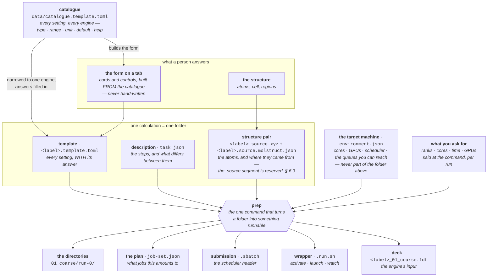
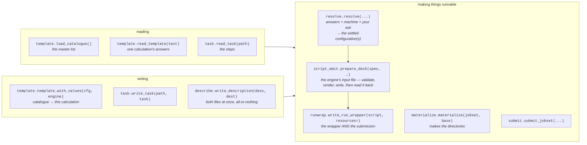
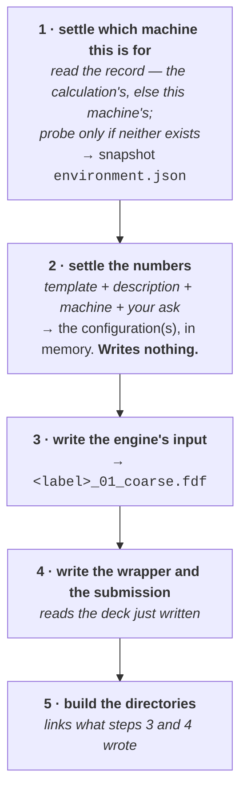
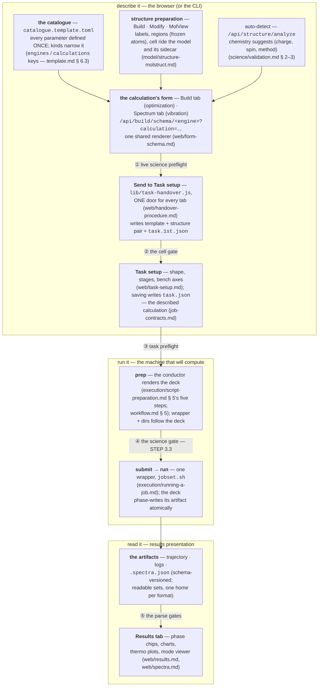

# How molbuilder works — what the parts are, and how they compose

**Role:** contract
**Domain:** (tree-wide)

**Companions — the contracts that own each part's internals, and where this
document and one of them disagree about a part's OWN rules, that one wins:**
[`engines/template.md`](?doc=engines/template.md) (the catalogue and the
template) · [`engines/stages.md`](?doc=engines/stages.md) (the description) ·
[`execution/generator.md`](?doc=execution/generator.md) (the pipeline's
mechanics) · [`execution/architecture.md`](?doc=execution/architecture.md) (who
owns which decision) ·
[`execution/job-contracts.md`](?doc=execution/job-contracts.md) (every file
format, and the shared vocabulary) ·
[`execution/project-layout.md`](?doc=execution/project-layout.md) (the
directories).

## 0. What this document owns

**It is the single contract for the WHOLE — what the parts are, and how they
work together.** Every part has a contract of its own that says what that part
*is* on the inside. Until this page existed, the sentence *"and here is how
they compose"* had no home, so it was written partly in four places and fully
in none.

| this document owns | it does not own |
|---|---|
| **which parts exist**, and the one name each is called by | what any one part contains — the settings an entry may carry, the keys a description may have |
| **what flows into what** — every arrow in § 3, and the whole road with its validation gates in § 9 | the format of the thing on either end of an arrow |
| **the doors** — that each file has one reader and one writer, and which they are | what those functions do internally |
| **the order**, and which step depends on which | the mechanics of any single step |
| **the invariants that only make sense across parts** — the machine never enters the portable folder; a door takes a whole object; two files made from one object are checked against each other | the reasoning behind each, which stays where it was argued |

**Two rules follow from that split, and they are what keep this document
true.**

> **R-W1 — this page states relationships, never restated details.** A fact
> that belongs to one part is named here and defined there. A second copy is a
> copy that drifts, and this project has paid for that twice: `stages.md` and
> `generator.md` came to contradict each other about where a benchmark's
> settings live, and a config class's help text drifted from the catalogue's.
>
> **R-W2 — a disagreement is a real defect, and which side is wrong depends on
> what is disagreed about.** If this page and a part's contract disagree about
> **that part's internals**, the part's contract wins. If they disagree about
> **how the parts compose**, this page wins and the other is the stale copy —
> that is the whole reason it exists.

**Plain language is a requirement here, not a courtesy.** This is the page a
person reads first, so a term is either an ordinary word or is defined in § 2
before it is used.

---

## 1. The one idea

**You describe a calculation in files. The program turns those files into more
files. Nothing anywhere is written for a particular engine except the one
function that knows how to write that engine's input.**

That is the whole design in a sentence, and everything below is what it costs
to mean it.

A worked feel for it: you want to relax a gold–molecule junction with SIESTA.
You never hand-write a SIESTA input. You answer questions about the
calculation — what basis, how fine a grid, how many k-points — and those
answers land in a file. Later, on whatever machine you happen to be on, a
command reads that file and writes the SIESTA input, the shell script that runs
it, and the scheduler submission next to it. **Change an answer, get a
different input file. You never edit the program.**

---

## 2. The vocabulary, defined once

Six words are used throughout. Each is ordinary once you know what it points at.

| word | in plain terms |
|---|---|
| **catalogue** | The master list of *every* setting molbuilder knows about, for every engine, with its type, its allowed range, its unit, its default and its help text. One file, hand-edited: `molbuilder/data/catalogue.template.toml` |
| **template** | One calculation's copy of that list, narrowed to the engine it will run on, with the answers filled in. Named `<label>.template.toml` |
| **description** | What *changes* across a calculation — the sequence of steps, and which settings differ between them. Named `task.json` |
| **deck** | The engine's own input file. `.fdf` for SIESTA, `.py` for PySCF. This is what the engine actually reads |
| **wrapper** | The shell script that activates the right environment, works out how many processors to use, launches the engine, and watches it. Named `<label>.run.sh` |
| **stage** | One step of a multi-step calculation — *coarse*, then *tight*. molbuilder's idea, not the engine's |

Two more you will meet in file names: an **attempt** is one try at running a
stage (`run-0`, `run-1`), and a **trial** is one point of a benchmark
(`bench-K16C1`).

---

## 3. The files, and how they relate

**Read this as: everything flows out of one hand-edited catalogue.**

### Why two files and not one

The template and the description look like they could be one file. They are
two because they answer different questions, and keeping them apart is what
makes a folder portable:

| | holds | changes when |
|---|---|---|
| **template** | *everything*, with the value in force — including the settings that vary, at their starting value | you change a setting |
| **description** | *which* of those you want to vary step by step, and each step's value | you add a stage, or promote a setting to vary |

So `mesh_cutoff` appears in both and says something different in each: the
template says **what it is**, the description says **that it steps, and to
what**. The rule and its reasoning are
[`stages.md § 6.2`](?doc=engines/stages.md).

### Why the machine is not in there

`environment.json` and the resources you ask for are deliberately **outside**
the folder above. That is what lets you hand the same folder to a colleague on
a different cluster, or benchmark it on a short queue and run it on a long one,
**without editing it**. The rule is
[`generator.md § 4.1`](?doc=execution/generator.md).

**A machine fact does not have to be detected — it has to be true.** You can
only probe the machine you are standing on, and the ordinary workflow is to
describe a calculation on your workstation for a cluster you are not on. So a
fact arrives **by probe when you are there and by declaration when you are
not**, and both are facts. What stays in `molbuilder.json` is not "the things
we could not detect" but **the things only you can answer** — which queue to
default to, which account to charge. The full split is
[`configuration.md § 5`](?doc=configuration.md) M-1.

**The folder says nothing about a machine at all** — not the ranks to use, and
not even the ranks to *try*. What to measure is said at the command, and it is
said **per stage**, because what runs fastest changes between a coarse step and
a tight one: different grid, different matrix, different best rank count. So
you measure one stage, and that stage's next run is offered what the
measurement found ([`generator.md § 4.3a`](?doc=execution/generator.md)).

### Every file, and who owns it

The full registry — file name, its schema string, the module that owns it — is
[`job-contracts.md § 6.1`](?doc=execution/job-contracts.md).
The ones you will actually meet:

| file | plain meaning | format, and why |
|---|---|---|
| `catalogue.template.toml` | the master setting list | **TOML** — a person edits it by hand |
| `<label>.template.toml` | this calculation's answers | **TOML** — a person reads and edits it |
| `task.json` | the steps | **JSON** — mostly machine-written |
| `<label>.source.xyz` + `.source.molstruct.json` | the atoms, plus where they came from | plain text + JSON sidecar |
| `molbuilder.json` | what **you** want from this installation — the queue to default to, the account, the activation command | JSON, hand-edited |
| `environment.json` | what the target machine **is** | JSON, written by a probe |
| `job-set.json` | the jobs this folder amounts to | JSON |
| `<label>_01_coarse.fdf` | the engine's input | the engine's own format |
| `.run.sh` / `.sbatch` | run it / submit it | shell |
| `jobset-decisions.log` | every choice the program made, with its reason | one JSON object per line |

---

## 4. The doors — how code touches those files

**No part of the program opens these files by hand.** Each file has exactly one
function that reads it and one that writes it, and everything else calls those.
That is what stops two parts of the system disagreeing about what a file means.

Two things about this list are worth knowing, because they are the rules that
were most recently paid for:

- **A generated file has ONE writer, and the writer keeps what you put in your
  own section.** Every deck goes through `write_script`, which merges back the
  `USER-CUSTOM` block from whatever was already on disk — so the one part of a
  generated file you are invited to edit survives the next `prep`. Any route
  reaching for a plain write destroys those edits, and one did: wrappers were
  written that way until 2026-08-17.
- **A door takes a whole thing, never a handful of its fields.** When a job's
  resources are handed to the wrapper writer, the *whole* set of resources
  goes, not `ranks` and `cores` picked out by hand. The reason is measured:
  when it was eleven separate values, two callers each passed a different
  subset, and each produced a submission file and a launch script that
  disagreed with each other. [`architecture.md § 3.1`](?doc=execution/architecture.md),
  rules **A8** and **A9**.
- **Where two files come out of one thing, they are checked against each
  other** — not just against what a test expected. Same section.

---

## 5. The order things happen in

**Nothing here is a convention; each step needs what the one before it
produced.**

**Why step 4 must come after step 3, and it is not just tidiness.** The wrapper
reads the *finished* deck for two things it has no other source for: whether
the calculation asks for the GPU (which decides the software environment the
job activates) and how many atoms there are (which caps the number of
processors). A wrapper written first would quietly pick the CPU environment and
skip the cap — **and both wrong answers look exactly like the defaults**, so
nothing would appear broken.

**Why step 5 only makes links.** The deck and the wrapper are written once, at
the top of the folder; each attempt and each benchmark point holds a *link* to
them. So re-writing the deck updates every attempt pointing at it, with nothing
to keep in step.

The step table with what each step may and may not do is
[`script-preparation.md § 5`](?doc=execution/script-preparation.md); the
sub-steps inside step 3 are § 3 there, and what each *engine* must supply at
each one is § 4.

### One run, or sixteen — the same pipeline

A benchmark is not a separate feature. Step 2 always produces a **list** of
settled configurations; an ordinary run is that list with one entry, a
benchmark is the same list with sixteen. Steps 3–5 loop over the list without
asking which they are in. That is why there is no second code path for
benchmarking, and why a third kind of study would need nothing new
([`generator.md § 2`](?doc=execution/generator.md)).

---

## 6. Where a person's answers get in

Three ways in, and they all end at the same files:

| you are | you use | it produces |
|---|---|---|
| working in a browser | the parameter tab, then the **Task setup** tab | the template, the description and the structure pair, in a folder you chose |
| working at a terminal | `molbuilder jobset describe` | the same files |
| already have a folder | `molbuilder jobset prep run <stage>` | the runnable directory |

The browser never writes an engine input. It renders the *form* from the
catalogue and asks the server to produce the files, because getting a format
right is the server's job ([`projects.md § 3`](?doc=web/projects.md)).

### 6.1 The one assumption on the target — a working conda or mamba

**Everything on the machine that runs the job rests on exactly one
prerequisite: conda or mamba works there, and the environments were
provisioned through it** ([`ops/installation.md`](?doc=ops/installation.md) —
one host env, one env per engine, all created by the bootstrap). Nothing else
is assumed: no PATH entry points, no pre-activated shells, no molbuilder on
the compute node.

Two scripts divide the work, and the split is the design:

| | knows | does |
|---|---|---|
| **the shell half** — `install-env.sh` once, every generated `.run.sh` per run | how to reach conda/mamba (the bootstrap finds it; the wrapper carries the hook line `prep` baked from this machine) | make the environment right, then hand over — activate and exec, nothing else ([`running-a-job.md § 2.2a`](?doc=execution/running-a-job.md)) |
| **the Python half** — molbuilder before the run, the engine and `mb_monitor.py` during it | everything that computes | describe, resolve, render, arrange, watch |

**And the spelling convention every document uses:** `molbuilder <verb>`
means `python -m molbuilder <verb>`, run in the activated host env from the
repo clone. That is the **supported form** — molbuilder is deliberately *not*
pip-installed into its env ([`ops/installation.md`](?doc=ops/installation.md);
a console-script entry point exists in `pyproject.toml` but is not the
supported invocation). An evaluation that goes looking for `molbuilder` on
`PATH` is testing an assumption this design never makes — made once,
2026-08-19, which is why this section exists.

**And from inside a calculation, the launcher rides the description**
*(user, 2026-08-20 + 2026-08-21)*: `./jobset.sh <verb> …` is the same
supported form, carried to where the data lives. The dilemma it closes: from
the bundle the module is nowhere to be found, and from the repo the bundle is
not the cwd. The file has TWO GENERATIONS, one name:

- **Bootstrap** — written by the Task-setup save door the moment the folder
  becomes a described calculation, because the FIRST command a fresh bundle
  needs is `prep`, and that is exactly the one it could not run.  Nothing is
  baked: from a bare remote shell it activates the molbuilder env itself
  (conda → mamba → micromamba, `$MOLBUILDER_ENV` overriding the name),
  resolves the checkout at run time (`$MOLBUILDER_ROOT` → a real install on
  `PATH` → walking up from the bundle → `~/molbuilder`), and refuses with the
  one-line remedy otherwise.  It assumes only that the env installation was
  done (`ops/installation.md`).
- **Machine-baked** — every `prep` REPLACES the file with the generation that
  bakes THIS machine's repo path and env verbatim (the wrappers' own
  two-layer premise: configured preamble + activation, no runtime
  discovery) — the right trade once the machine is known.

Both stand in the bundle and run `python -m molbuilder` with the repo on
`PYTHONPATH` — the cwd stays the bundle, so `--bundle .` and every other verb
default keep their meaning.

**Verified against the scripts, not assumed** (2026-08-19): both engines'
wrappers were run in a pure shell — `env -i`, no conda on `PATH`, no rc
files — and bootstrapped from nothing but their baked hook line: activation,
engine resolution, and a real completed SIESTA run.

---

## 7. What is genuinely data-driven today, and what is not

**This section is the honest one, and it is the reason the rest of the page is
worth reading carefully.** Re-measured 2026-08-19. *(Its previous measurement,
2026-08-17, predated the engine seam: it reported "the multi-step pipeline
refuses PySCF outright — the registry has one entry." That was true that day
and closed the next: the seam landed 2026-08-18, and the 2026-08-19
end-to-end run drove a real PySCF calculation through describe → prep →
submit → results.)*

### Data-driven, and it works

**Anything about a setting.** Its value, its allowed range, its unit, its
label, which panel it appears on, its help text, whether it may be varied per
stage, whether it may be benchmarked — all of it is the catalogue. Adding a
setting to an engine that already exists is a catalogue entry plus a line in
that engine's translator. Two tests hold the boundary in both directions: a
setting the catalogue does not carry is one no surface can offer, and a
catalogue entry no engine can hold is a dead entry.

**Writing the decks.** Both engines answer the seam's questions —
[`generator.md § 7`](?doc=execution/generator.md) counts the catalogue half,
[`script-preparation.md § 4`](?doc=execution/script-preparation.md) the code
half — and one conductor (`prepare_deck`: validate → render → write → check)
runs every deck of every engine through the same steps. Four of PySCF's
answers are a recorded *nothing*, which is the design working: a decision a
reader can check, not an arm nobody thought about.

### Not yet — and it is a known, named gap

**The WRAPPER writer still carries per-engine facts in its own body.**
`runwrap.py` branches on which engine it is writing for in **four** places
(measured 2026-08-19) — what a cold restart clears, how the label is read
back out of a deck, how the launch line is formed. Those facts belong beside
the engine's other seam answers, and moving them is the recorded seam item
**W1** ([`backend-architecture.md § 5`](?doc=backend-architecture.md),
scheduled in [`roadmap.md § 6`](?doc=roadmap.md)). Until then, adding an
engine edits `runwrap.py` — which is exactly what
[`generator.md § 7`](?doc=execution/generator.md)'s *"adding an engine adds
files and edits none"* test exists to catch.

**And two whole workflows have not migrated onto this pipeline at all.**
Spectra and transport still run the paths built before it — deliberately, so
the framework is verified on one task (structure optimization) before
anything else moves. The statement of record is the migration box at the top
of [`roadmap.md`](?doc=roadmap.md); transport is additionally a different
KIND of job ([`execution/architecture.md § 0`](?doc=execution/architecture.md)).

**Where this is tracked:** [`roadmap.md § 6`](?doc=roadmap.md).

---

## 8. Which document owns which part

**This page owns the composition (§ 0); each document below owns one part's
internals.** When you need a part's own rules rather than how it fits:

| you want the rule for… | open |
|---|---|
| what a setting entry may contain | [`engines/template.md`](?doc=engines/template.md) |
| the steps, and what may differ between them | [`engines/stages.md`](?doc=engines/stages.md) |
| the pipeline, and what bounds a benchmark | [`execution/generator.md`](?doc=execution/generator.md) |
| who decides what, and the rules that must never break | [`execution/architecture.md`](?doc=execution/architecture.md) |
| every file format, and what each name means system-wide | [`execution/job-contracts.md`](?doc=execution/job-contracts.md) |
| what a folder looks like, and what `prep` does to it | [`execution/project-layout.md`](?doc=execution/project-layout.md) |
| why all of a calculation's files share one name | [`execution/run-identity.md`](?doc=execution/run-identity.md) |
| running one job, day to day | [`execution/running-a-job.md`](?doc=execution/running-a-job.md) |
| the whole thing done once, with a real molecule | [`execution/worked-example.md`](?doc=execution/worked-example.md) |
| what is left to build | [`roadmap.md`](?doc=roadmap.md) |

---

## 9. The whole road, one picture — and where validation stands on it

**Every stage below is owned by one document (§ 8); this picture owns only
how they chain.** The circled numbers are the validation gates — a
calculation cannot reach the next stage without passing the gate between
them, and each gate refuses with the *reason*, never a stack trace.

**The five gates, and what each refuses** *(“science validation is a must” —
user, 2026-08-21; a gate that exists but does not run is the failure class
this table exists to rule out)*:

| gate | fires | refuses / warns on | owner |
|---|---|---|---|
| **① live preflight** | on every form edit, Build tab (`/api/build/preflight`) | the same `validate(struct, cfg)` verdict gate ④ will give — surfaced while the person is still at the form | [`science/validation.md`](?doc=science/validation.md) § 4 |
| **② the cell gate** | at Send, on the exported envelope | a box the calculation cannot use (degenerate cell, left-handed axes); *notices* (thin vacuum) hold the navigation, never the write | [`web/handover-procedure.md`](?doc=web/handover-procedure.md) |
| **③ task preflight** | at Task-setup save, `describe`, and dispatch | a description that is not one: unknown keys, empty ladders, identity clashes, bench entries no machine answers | [`engines/stages.md`](?doc=engines/stages.md) § 6.6 |
| **④ the science gate** | at `prep`, inside the conductor’s STEP 3.3 — **“here, and only here”**, so no deck route can forget it | cell + geometry + field ranges (`validation/metadata.py`) + the engine’s science (grid, parity, open-shell, amplitude — `validation/{siesta,pyscf,spectra}.py`); errors refuse the deck, warns reach stderr | [`execution/script-preparation.md`](?doc=execution/script-preparation.md) § 5 (step 3.3 in its table) |
| **⑤ the parse gates** | at every artifact read (Results tab, CLI) | a file the reader cannot vouch for: unknown schema version (readable **sets**, additive bumps read old files whole), malformed fields — each a **typed** refusal the UI can react to | [`web/spectra.md`](?doc=web/spectra.md) § 6, the parse layer |

One honest asymmetry, recorded rather than smoothed over: **transport**
still rides its own pre-JobSet render path (script-preparation.md § “the
four writers”), so its gates are its own until that migration.  *(A second
stood here for a few hours — the vibration kind had no gate ① — until the
kind-aware preflight landed on 2026-08-21; the Spectrum tab now runs the
same live check Build does.)*

### Where the details live — the drill-down for each arrow

The picture above is deliberately a MAP; the details a builder needs are
each in one owning document:

| you want to see… | open |
|---|---|
| how the pipeline **branches per engine** — what each engine supplies at every prep sub-step | [`execution/script-preparation.md`](?doc=execution/script-preparation.md) § 4 (the per-engine table), § 5 (the step table) |
| the **file-to-file information flow** — which file feeds which, one reader/one writer per file | § 3 of this page (the files diagram), [`execution/job-contracts.md`](?doc=execution/job-contracts.md) (every format) |
| how **template information flows** — catalogue → per-calculation template → resolved config → deck | [`engines/template.md`](?doc=engines/template.md) § 6 (incl. § 6.3’s kind-narrowing protocol), [`execution/generator.md`](?doc=execution/generator.md) § 4.3 (precedence: template < declaration < run-config < flags) |
| how the **UI flows** — the catalogue-rendered form, its collected params, the hand-over’s four files, `task.json` | [`web/form-schema.md`](?doc=web/form-schema.md), [`web/handover-procedure.md`](?doc=web/handover-procedure.md) §§ 2–6, [`web/task-setup.md`](?doc=web/task-setup.md) |
| **which checks run for a given procedure**, and each check’s science | [`science/validation.md`](?doc=science/validation.md) § 1 (the layers), § 7 (where every validator lives — engine registry by config type, kind registry by declared fact) |
| where a **person’s answers enter** the flow | § 6 of this page |

*(These citations were verified against the code on 2026-08-21 — the
validators tree in validation.md § 7 was found four files short and
reconciled in the same pass.  A diagram is a claim like any other:
reviewing cited diagrams against the code they draw is part of the audit
playbook.)*

